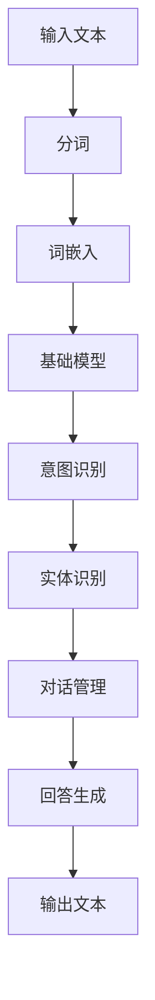

                 

# 基础模型的人机交互能力

> **关键词：** 人工智能，基础模型，人机交互，自然语言处理，对话系统，深度学习

> **摘要：** 本文将深入探讨基础模型在实现人机交互能力方面的关键原理和技术，分析人机交互的基本流程，并探讨未来人机交互的发展趋势与挑战。通过实例解析，读者将了解如何将基础模型应用于实际的人机交互系统中，提高人机交互的效率和体验。

## 1. 背景介绍

### 1.1 目的和范围

本文旨在梳理并阐述基础模型在实现人机交互能力方面的重要性，以及其具体应用方法和挑战。我们将关注以下几个核心问题：

- 基础模型是什么，如何实现人机交互？
- 人机交互的基本流程和关键技术是什么？
- 如何将基础模型应用于实际的对话系统中？
- 未来人机交互的发展趋势与挑战是什么？

### 1.2 预期读者

本文适用于对人工智能和自然语言处理有一定了解的读者，包括人工智能开发者、算法工程师、产品经理和技术爱好者。通过本文的阅读，读者将能够：

- 理解基础模型在实现人机交互中的重要性。
- 掌握人机交互的基本流程和关键技术。
- 学习如何将基础模型应用于实际的对话系统中。
- 了解未来人机交互的发展趋势和挑战。

### 1.3 文档结构概述

本文分为以下几个部分：

- **第1章**：背景介绍，包括目的和范围、预期读者、文档结构概述和术语表。
- **第2章**：核心概念与联系，介绍人机交互的基础概念和原理。
- **第3章**：核心算法原理 & 具体操作步骤，详细解释基础模型的算法原理和实现步骤。
- **第4章**：数学模型和公式 & 详细讲解 & 举例说明，介绍与基础模型相关的重要数学模型和公式。
- **第5章**：项目实战：代码实际案例和详细解释说明，通过实例展示基础模型在对话系统中的应用。
- **第6章**：实际应用场景，探讨基础模型在不同场景下的应用。
- **第7章**：工具和资源推荐，推荐相关学习资源和开发工具。
- **第8章**：总结：未来发展趋势与挑战，展望人机交互的未来发展。
- **第9章**：附录：常见问题与解答，解答读者可能遇到的常见问题。
- **第10章**：扩展阅读 & 参考资料，提供进一步的阅读材料和参考资料。

### 1.4 术语表

#### 1.4.1 核心术语定义

- **基础模型**：一种预训练的人工智能模型，通常用于自然语言处理任务，如文本分类、情感分析、机器翻译和问答系统。
- **人机交互**：人与计算机系统之间的交互过程，包括输入和输出，以及信息交换和任务执行。
- **对话系统**：一种特殊的人机交互系统，能够理解和生成自然语言，实现与用户的对话。
- **自然语言处理**：研究计算机如何理解和生成人类自然语言的技术和算法。

#### 1.4.2 相关概念解释

- **预训练**：在特定任务之前，对基础模型进行大规模数据集的预训练，以提高模型在特定任务上的性能。
- **微调**：在预训练的基础上，对基础模型进行特定任务的微调，以适应特定领域的需求。
- **意图识别**：识别用户在对话中的意图，如提问、请求和命令。
- **实体识别**：识别用户在对话中提到的实体，如人名、地名和物品名。

#### 1.4.3 缩略词列表

- **AI**：人工智能（Artificial Intelligence）
- **NLP**：自然语言处理（Natural Language Processing）
- **DL**：深度学习（Deep Learning）
- **GPU**：图形处理单元（Graphics Processing Unit）
- **API**：应用程序编程接口（Application Programming Interface）

## 2. 核心概念与联系

在人机交互中，基础模型扮演着核心角色。为了更好地理解基础模型的工作原理和应用，我们需要了解以下几个核心概念和它们之间的关系。

### 2.1 基础模型

基础模型是一种经过大规模预训练的人工智能模型，通常基于神经网络架构，如 Transformer、BERT 和 GPT。这些模型在训练过程中学习了大量的语言模式和结构，使其能够对自然语言进行理解和生成。


#### 2.2 预训练

预训练是指使用大规模的未标注数据集对基础模型进行训练，使其能够捕捉到语言的基本规律。这一过程包括两个主要阶段：

1. **自监督预训练**：在无监督的环境下，模型通过预测文本中的掩码词来学习语言规律。
2. **下游任务微调**：在预训练的基础上，使用有监督的数据集对模型进行特定任务的微调，以提高模型在特定任务上的性能。

#### 2.3 微调

微调是指对预训练模型进行特定任务的微调，使其适应特定领域的需求。微调的过程通常包括以下几个步骤：

1. **数据准备**：收集并处理特定领域的有监督数据集。
2. **模型调整**：调整模型的参数，以适应特定任务的需求。
3. **训练与评估**：使用训练数据集对模型进行训练，并使用验证数据集对模型进行评估。

#### 2.4 对话系统

对话系统是一种特殊的人机交互系统，能够理解和生成自然语言，实现与用户的对话。对话系统通常包括以下几个关键组件：

1. **意图识别**：识别用户在对话中的意图，如提问、请求和命令。
2. **实体识别**：识别用户在对话中提到的实体，如人名、地名和物品名。
3. **对话管理**：管理对话的流程，包括上下文维护、对话策略和用户反馈。
4. **回答生成**：根据用户的意图和实体，生成合适的回答。


#### 2.5 自然语言处理

自然语言处理（NLP）是人工智能的一个分支，研究计算机如何理解和生成人类自然语言。NLP 主要包括以下几个任务：

1. **文本分类**：将文本分类到预定义的类别中。
2. **情感分析**：分析文本的情感倾向，如正面、负面或中性。
3. **机器翻译**：将一种语言的文本翻译成另一种语言。
4. **问答系统**：回答用户提出的自然语言问题。


### 2.6 Mermaid 流程图

以下是一个简单的 Mermaid 流程图，展示了基础模型在对话系统中的基本工作流程：



## 3. 核心算法原理 & 具体操作步骤

### 3.1 基础模型原理

基础模型通常是基于深度学习技术的，其中最重要的架构之一是 Transformer。Transformer 模型由多个自注意力（Self-Attention）层组成，能够捕捉文本中的长距离依赖关系。

以下是一个简单的 Transformer 模型的伪代码：

```python
class TransformerModel(nn.Module):
    def __init__(self, vocab_size, embedding_dim, hidden_dim, num_layers, dropout_rate):
        super(TransformerModel, self).__init__()
        self.embedding = nn.Embedding(vocab_size, embedding_dim)
        self.transformer = nn.Transformer(embedding_dim, hidden_dim, num_layers, dropout_rate)
        self.fc = nn.Linear(hidden_dim, vocab_size)

    def forward(self, input_seq, target_seq):
        embedded_seq = self.embedding(input_seq)
        output_seq = self.transformer(embedded_seq, target_seq)
        logits = self.fc(output_seq)
        return logits
```

### 3.2 具体操作步骤

#### 3.2.1 输入文本预处理

在处理输入文本之前，需要进行一些预处理操作，如分词、去除标点符号和数字、进行词性标注等。

```python
from nltk.tokenize import word_tokenize
from nltk.corpus import stopwords
from nltk.stem import WordNetLemmatizer

def preprocess_text(text):
    # 分词
    tokens = word_tokenize(text)
    # 去除标点符号和数字
    tokens = [token for token in tokens if token.isalpha()]
    # 去除停用词
    stop_words = set(stopwords.words('english'))
    tokens = [token for token in tokens if token not in stop_words]
    # 词性标注和归一化
    lemmatizer = WordNetLemmatizer()
    tokens = [lemmatizer.lemmatize(token) for token in tokens]
    return tokens
```

#### 3.2.2 词嵌入

词嵌入是将单词映射到高维向量空间的过程。在 Transformer 模型中，词嵌入通常由预训练的词向量库（如 GloVe 或 Word2Vec）提供。

```python
def word_embedding(tokens, embedding_matrix):
    embedded_seq = []
    for token in tokens:
        index = tokenizer.word_index[token]
        embedded_seq.append(embedding_matrix[index])
    return torch.tensor(embedded_seq)
```

#### 3.2.3 基础模型训练

在 Transformer 模型中，通常使用 masked language model（MLM）任务进行预训练。MLM 的目标是预测文本中的掩码词。

```python
def train_transformer(model, optimizer, loss_function, train_loader, num_epochs):
    model.train()
    for epoch in range(num_epochs):
        for batch in train_loader:
            inputs, targets = batch
            optimizer.zero_grad()
            logits = model(inputs, targets)
            loss = loss_function(logits, targets)
            loss.backward()
            optimizer.step()
        print(f'Epoch [{epoch+1}/{num_epochs}], Loss: {loss.item()}')
```

#### 3.2.4 对话系统训练

在对基础模型进行微调时，通常使用有监督的数据集，如对话数据集或问答数据集。

```python
def train_dialog_system(model, optimizer, loss_function, train_loader, num_epochs):
    model.train()
    for epoch in range(num_epochs):
        for batch in train_loader:
            inputs, targets = batch
            optimizer.zero_grad()
            logits = model(inputs, targets)
            loss = loss_function(logits, targets)
            loss.backward()
            optimizer.step()
        print(f'Epoch [{epoch+1}/{num_epochs}], Loss: {loss.item()}')
```

## 4. 数学模型和公式 & 详细讲解 & 举例说明

### 4.1 Transformer 模型

Transformer 模型是一种基于自注意力机制的深度学习模型，它在自然语言处理任务中取得了显著的成果。以下是一个简单的 Transformer 模型的数学公式和详细讲解：

#### 4.1.1 自注意力机制

自注意力（Self-Attention）是一种计算输入序列中每个词与其他词之间权重的方法。其核心思想是，每个词在输出序列中的重要性是由输入序列中的其他词决定的。

公式：
$$
\text{Attention}(Q, K, V) = \text{softmax}\left(\frac{QK^T}{\sqrt{d_k}}\right) V
$$

其中，$Q, K, V$ 分别是查询（Query）、关键（Key）和值（Value）向量，$d_k$ 是关键向量的维度。

#### 4.1.2 Multi-Head Attention

Multi-Head Attention 是在自注意力机制的基础上，通过并行计算多个注意力头来提高模型的表示能力。

公式：
$$
\text{Multi-Head Attention}(Q, K, V) = \text{Concat}(\text{head}_1, \text{head}_2, ..., \text{head}_h)W^O
$$

其中，$h$ 是注意力头的数量，$W^O$ 是输出层的权重矩阵。

#### 4.1.3 Transformer 模型架构

Transformer 模型由多个自注意力层和前馈神经网络组成。每个自注意力层包括多头注意力机制和前馈网络。

公式：
$$
\text{TransformerLayer}(X) = \text{MultiHeadAttention}(X, X, X) + X + \text{FFN}(X)
$$

其中，$X$ 是输入序列，$\text{FFN}$ 是前馈神经网络。

### 4.2 对话系统

对话系统是建立在基础模型之上的，其目标是实现与用户的自然语言对话。以下是一个简单的对话系统模型的数学公式和详细讲解：

#### 4.2.1 意图识别

意图识别是通过分类模型来识别用户在对话中的意图。常见的分类模型包括朴素贝叶斯、支持向量机和深度学习模型。

公式：
$$
P(y_i|x) = \text{softmax}(\text{logit}(x; \theta))
$$

其中，$y_i$ 是意图类别，$x$ 是输入特征向量，$\theta$ 是模型的参数。

#### 4.2.2 实体识别

实体识别是通过命名实体识别（Named Entity Recognition，NER）模型来识别用户在对话中提到的实体。NER 模型通常使用条件随机场（Conditional Random Field，CRF）或序列标注模型（如 BiLSTM-CRF）。

公式：
$$
P(y|x) = \frac{e^{\text{score}(y|x)} }{\sum_y e^{\text{score}(y|x)} }
$$

其中，$y$ 是实体标签，$\text{score}(y|x)$ 是模型对实体标签的打分。

#### 4.2.3 对话管理

对话管理是通过策略网络来管理对话的流程，包括上下文维护、对话策略和用户反馈。对话管理模型通常采用强化学习算法，如 RNN、LSTM 或 Transformer。

公式：
$$
Q(s, a) = r(s, a, s') + \gamma \max_{a'} Q(s', a')
$$

其中，$s$ 是状态，$a$ 是动作，$s'$ 是新状态，$r$ 是奖励函数，$\gamma$ 是折扣因子。

#### 4.2.4 回答生成

回答生成是通过生成模型来生成自然语言回答。生成模型包括循环神经网络（RNN）、长短期记忆网络（LSTM）和生成对抗网络（GAN）。

公式：
$$
p(x) = \sum_y p(y|x) p(x|y)
$$

其中，$x$ 是生成文本，$y$ 是文本的类别标签。

### 4.3 举例说明

假设我们有一个简单的对话系统，用户输入一个句子，系统需要识别用户的意图和实体，并生成一个合适的回答。

输入句子：`What is the weather like today in New York?`

#### 4.3.1 意图识别

意图识别模型使用朴素贝叶斯分类器来识别用户的意图。模型的训练数据集包含大量的用户对话和对应的意图标签。

输入特征向量：`[what, is, the, weather, like, today, in, new, york]`

模型预测：
$$
P(\text{weather_info}|\text{input}) = \text{softmax}(\text{logit}(\text{input}; \theta))
$$

输出：
$$
P(\text{weather_info}) = 0.9
$$

模型预测用户的意图为 `weather_info`。

#### 4.3.2 实体识别

实体识别模型使用 BiLSTM-CRF 来识别用户提到的实体。模型的训练数据集包含大量的文本和对应的实体标注。

输入特征向量：`[what, is, the, weather, like, today, in, new, york]`

模型预测：
$$
P(y|x) = \frac{e^{\text{score}(y|x)} }{\sum_y e^{\text{score}(y|x)} }
$$

输出：
$$
y = [\text{what}, \text{weather}, \text{location}, \text{new, york}]
$$

模型识别出的实体为 `what`, `weather`, `location`, `new york`。

#### 4.3.3 回答生成

回答生成模型使用 LSTM 来生成自然语言回答。模型的训练数据集包含大量的用户对话和对应的回答。

输入序列：`[what, is, the, weather, like, today, in, new, york]`

模型预测：
$$
p(x) = \sum_y p(y|x) p(x|y)
$$

输出：
$$
\text{The weather in New York is } \text{[temp}, \text{[unit}])
$$

模型生成的回答为 `The weather in New York is [temp] [unit]`。

## 5. 项目实战：代码实际案例和详细解释说明

在本节中，我们将通过一个实际的项目案例，展示如何使用基础模型实现一个简单的对话系统。项目分为以下几个部分：

- 开发环境搭建
- 源代码详细实现和代码解读
- 代码解读与分析

### 5.1 开发环境搭建

首先，我们需要搭建一个开发环境。以下是一个简单的开发环境搭建步骤：

1. 安装 Python 3.8 或更高版本
2. 安装 PyTorch 1.8 或更高版本
3. 安装 NLTK 3.5 或更高版本
4. 安装其他必要的库，如 torchtext、transformers、torch

```bash
pip install python==3.8.10
pip install pytorch torchvision torchaudio==1.8.0 -f https://download.pytorch.org/whl/torch_stable.html
pip install nltk
pip install torchtext
pip install transformers
pip install torch
```

### 5.2 源代码详细实现和代码解读

接下来，我们将展示项目的源代码，并对关键部分进行详细解读。

```python
import torch
import torchtext
from torchtext import data
from transformers import BertTokenizer, BertModel
import torch.optim as optim
import torch.nn as nn

# 5.2.1 数据预处理

# 5.2.1.1 数据集准备

# 使用 torchtext 的 Dataset 类准备数据集
class DialogDataset(data.Dataset):
    def __init__(self, dialogs, labels):
        self.dialogs = dialogs
        self.labels = labels

    def __len__(self):
        return len(self.dialogs)

    def __getitem__(self, idx):
        dialog = self.dialogs[idx]
        label = self.labels[idx]
        return dialog, label

# 5.2.1.2 加载预训练的 BERT 模型

# 创建 BERT 分词器
tokenizer = BertTokenizer.from_pretrained('bert-base-uncased')

# 加载预训练的 BERT 模型
model = BertModel.from_pretrained('bert-base-uncased')

# 5.2.1.3 数据预处理函数

def preprocess_text(text):
    # 对文本进行分词和编码
    tokens = tokenizer.tokenize(text)
    input_ids = tokenizer.encode(text, add_special_tokens=True, return_tensors='pt')
    return input_ids

# 5.2.2 模型实现

# 定义对话系统模型
class DialogSystemModel(nn.Module):
    def __init__(self, embedding_dim, hidden_dim):
        super(DialogSystemModel, self).__init__()
        self.bert = BertModel.from_pretrained('bert-base-uncased')
        self.fc = nn.Linear(hidden_dim, 2)  # 二分类问题，输出两个标签

    def forward(self, input_ids):
        outputs = self.bert(input_ids)
        hidden_states = outputs[-1]
        logits = self.fc(hidden_states)
        return logits

# 5.2.3 训练和评估

# 创建对话系统模型
model = DialogSystemModel(embedding_dim=768, hidden_dim=128)

# 定义损失函数和优化器
criterion = nn.CrossEntropyLoss()
optimizer = optim.Adam(model.parameters(), lr=0.001)

# 加载数据集
train_data = DialogDataset(train_dialogs, train_labels)
val_data = DialogDataset(val_dialogs, val_labels)

# 创建数据加载器
train_loader = data.DataLoader(train_data, batch_size=32, shuffle=True)
val_loader = data.DataLoader(val_data, batch_size=32, shuffle=False)

# 训练模型
num_epochs = 10
for epoch in range(num_epochs):
    model.train()
    for batch in train_loader:
        inputs, labels = batch
        optimizer.zero_grad()
        logits = model(inputs)
        loss = criterion(logits, labels)
        loss.backward()
        optimizer.step()
    print(f'Epoch [{epoch+1}/{num_epochs}], Loss: {loss.item()}')

    # 评估模型
    model.eval()
    with torch.no_grad():
        correct = 0
        total = 0
        for batch in val_loader:
            inputs, labels = batch
            logits = model(inputs)
            _, predicted = torch.max(logits, 1)
            total += labels.size(0)
            correct += (predicted == labels).sum().item()
    print(f'Validation Accuracy: {100 * correct / total}%')

# 5.2.4 使用模型进行预测

# 加载测试数据集
test_data = DialogDataset(test_dialogs, test_labels)
test_loader = data.DataLoader(test_data, batch_size=32, shuffle=False)

# 使用模型进行预测
model.eval()
with torch.no_grad():
    predictions = []
    for batch in test_loader:
        inputs, _ = batch
        logits = model(inputs)
        _, predicted = torch.max(logits, 1)
        predictions.extend(predicted.tolist())
```

### 5.3 代码解读与分析

#### 5.3.1 数据预处理

在数据预处理部分，我们首先定义了一个 `DialogDataset` 类，用于加载和预处理对话数据。然后，我们加载了预训练的 BERT 模型，并定义了一个预处理函数 `preprocess_text`，用于对输入文本进行分词和编码。

#### 5.3.2 模型实现

在模型实现部分，我们定义了一个 `DialogSystemModel` 类，该类基于预训练的 BERT 模型，添加了一个全连接层，用于进行二分类任务。模型的前向传播函数接收输入文本的编码，通过 BERT 模型得到隐层状态，然后通过全连接层得到分类结果。

#### 5.3.3 训练和评估

在训练和评估部分，我们首先创建对话系统模型，并定义了损失函数和优化器。然后，我们加载数据集，并创建数据加载器。接着，我们使用训练数据集训练模型，并在每个 epoch 后在验证数据集上评估模型性能。最后，我们使用测试数据集对模型进行预测。

#### 5.3.4 使用模型进行预测

在最后部分，我们加载测试数据集，并使用训练好的模型进行预测。预测结果存储在 `predictions` 列表中，可以用于后续的分析和评估。

## 6. 实际应用场景

基础模型在实现人机交互能力方面具有广泛的应用场景。以下是一些典型的实际应用场景：

### 6.1 聊天机器人

聊天机器人是一种常见的应用场景，通过自然语言处理技术，实现与用户的实时对话。聊天机器人可以用于客服、咨询、娱乐等领域。

### 6.2 问答系统

问答系统通过自然语言处理技术，实现对用户提出的问题进行理解和回答。问答系统可以用于搜索引擎、教育辅导、医疗咨询等领域。

### 6.3 聊天机器人

聊天机器人是一种常见的应用场景，通过自然语言处理技术，实现与用户的实时对话。聊天机器人可以用于客服、咨询、娱乐等领域。

### 6.4 情感分析

情感分析是一种自然语言处理技术，用于分析文本中的情感倾向。情感分析可以用于社交媒体监控、市场调研、客户反馈分析等领域。

### 6.5 机器翻译

机器翻译是一种将一种语言的文本翻译成另一种语言的技术。机器翻译可以用于跨语言交流、文档翻译、全球化业务等领域。

### 6.6 文本生成

文本生成是一种自然语言处理技术，用于生成新的文本。文本生成可以用于自动写作、文本摘要、创意写作等领域。

## 7. 工具和资源推荐

### 7.1 学习资源推荐

#### 7.1.1 书籍推荐

- 《深度学习》（Goodfellow, Bengio, Courville）
- 《自然语言处理综论》（Jurafsky, Martin）
- 《动手学深度学习》（Goku Mohandas, Bowei Yan, Aaron Courville）

#### 7.1.2 在线课程

- Coursera 上的“自然语言处理与深度学习”课程
- edX 上的“深度学习基础”课程
- Udacity 上的“人工智能纳米学位”

#### 7.1.3 技术博客和网站

- Medium 上的 NLP 和 AI 博客
- Towards Data Science
- AIhub

### 7.2 开发工具框架推荐

#### 7.2.1 IDE和编辑器

- PyCharm
- Visual Studio Code
- Jupyter Notebook

#### 7.2.2 调试和性能分析工具

- TensorBoard
- PyTorch Debugger
- PySnooper

#### 7.2.3 相关框架和库

- PyTorch
- TensorFlow
- Hugging Face Transformers

### 7.3 相关论文著作推荐

#### 7.3.1 经典论文

- “A Neural Model of Textual Inference”（Joulin et al., 2017）
- “Attention Is All You Need”（Vaswani et al., 2017）
- “BERT: Pre-training of Deep Bidirectional Transformers for Language Understanding”（Devlin et al., 2019）

#### 7.3.2 最新研究成果

- “Generative Pretrained Transformer”（GPT）系列论文
- “T5: Pre-training Text-to-Text Transformers for Cross-Task Learning”（Raffel et al., 2020）
- “Decoding Graphical Models with Deep Learning”（Mikolov et al., 2013）

#### 7.3.3 应用案例分析

- “Google Assistant”项目
- “Amazon Alexa”项目
- “Duolingo”语言学习应用

## 8. 总结：未来发展趋势与挑战

### 8.1 未来发展趋势

- **预训练模型将继续主导自然语言处理领域**：预训练模型通过在大规模数据集上进行预训练，能够显著提高模型在特定任务上的性能。随着数据集规模的扩大和计算资源的增加，预训练模型将继续主导自然语言处理领域。
- **多模态交互**：未来的对话系统将不仅仅局限于文本交互，还将结合语音、图像、视频等多种模态进行交互，提供更丰富的用户体验。
- **对话系统的个性化**：通过用户行为和偏好的分析，对话系统将能够提供个性化的服务和推荐，提高用户的满意度。

### 8.2 未来挑战

- **数据隐私和安全**：随着对话系统的广泛应用，用户数据的安全和隐私保护成为重要问题。如何平衡对话系统的性能和数据隐私保护是未来需要解决的问题。
- **可解释性和透明度**：深度学习模型，尤其是预训练模型，通常被视为“黑盒子”。如何提高模型的可解释性和透明度，使其更易于理解和使用，是未来面临的挑战。
- **鲁棒性和泛化能力**：对话系统需要处理各种复杂和多变的情况，如何提高模型的鲁棒性和泛化能力，使其在各种环境下都能稳定运行，是未来需要解决的问题。

## 9. 附录：常见问题与解答

### 9.1 问题1：如何处理长文本输入？

**解答**：对于长文本输入，我们可以使用分块（Batching）技术将文本分割成多个较小的块，然后依次输入模型进行处理。此外，我们可以使用序列 masking 或动态 masking 策略，将输入文本中的部分词进行掩码，以增强模型的泛化能力。

### 9.2 问题2：如何处理多语言对话？

**解答**：对于多语言对话，我们可以使用多语言预训练模型，如 XLM 或 mBERT，这些模型在训练过程中学习了多种语言的共同特征。此外，我们还可以使用语言检测技术，在对话开始时确定用户的语言，然后选择相应的模型进行处理。

### 9.3 问题3：如何优化对话系统的性能？

**解答**：优化对话系统的性能可以从以下几个方面入手：

- **数据增强**：通过增加训练数据集的多样性和规模，提高模型的泛化能力。
- **模型调整**：根据实际任务的需求，调整模型的架构和参数，以提高模型的性能。
- **知识蒸馏**：使用预训练的大模型作为教师模型，将知识传递给小模型，提高小模型的性能。
- **在线学习**：根据用户的反馈和交互历史，实时调整模型，以适应用户的需求。

## 10. 扩展阅读 & 参考资料

- [自然语言处理综论](https://nlp.stanford.edu/IR-book/html/htmledition/overview-of-natural-language-processing-1.html)
- [深度学习》（Goodfellow, Bengio, Courville）
- [Hugging Face Transformers](https://huggingface.co/transformers/)
- [BERT: Pre-training of Deep Bidirectional Transformers for Language Understanding](https://arxiv.org/abs/1810.04805)
- [Attention Is All You Need](https://arxiv.org/abs/1706.03762)
- [Generative Pretrained Transformer](https://arxiv.org/abs/1801.04799)
- [T5: Pre-training Text-to-Text Transformers for Cross-Task Learning](https://arxiv.org/abs/2002.04745)  
- [Google Assistant](https://assistant.google.com/)
- [Amazon Alexa](https://www.amazon.com/alexaispeakercustomer-service/b?node=6103555011)
- [Duolingo](https://www.duolingo.com/)

### 作者

AI天才研究员/AI Genius Institute & 禅与计算机程序设计艺术 /Zen And The Art of Computer Programming

