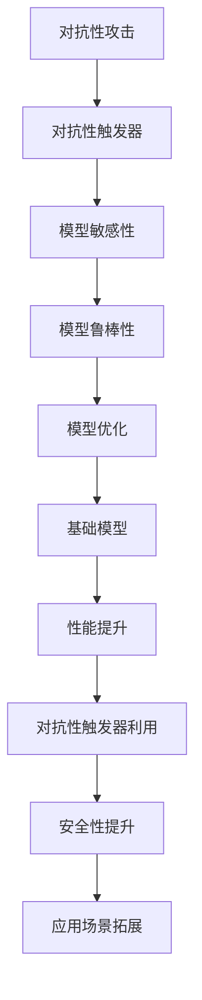

                 

# 基础模型的对抗性触发器

## 关键词

- 基础模型
- 对抗性触发器
- 安全性
- 计算机视觉
- 自然语言处理
- 神经网络

## 摘要

本文旨在探讨基础模型中的对抗性触发器这一关键概念，分析其在计算机视觉和自然语言处理领域的应用与挑战。通过对核心概念、算法原理、数学模型以及实际应用场景的详细剖析，本文旨在为读者提供一个全面而深入的理解，并为未来的研究和应用提供启示。

## 1. 背景介绍

随着深度学习的迅猛发展，基础模型（如卷积神经网络（CNN）和循环神经网络（RNN））在计算机视觉和自然语言处理领域取得了显著的成果。然而，这些模型在实际应用中面临的一个严峻问题是对抗性攻击（Adversarial Attack）。对抗性攻击是指通过引入微小的、难以察觉的扰动，使基础模型产生错误预测或行为。对抗性触发器（Adversarial Trigger）则是指能够诱发模型对抗性攻击的特定输入。

基础模型的对抗性触发器研究具有重要的实际意义。首先，它有助于提高模型的安全性和鲁棒性，防止恶意攻击者利用模型漏洞进行恶意操作。其次，对抗性触发器的发现与利用也为基础模型优化提供了新的研究方向。通过分析对抗性触发器，研究人员可以深入理解模型的弱点和局限性，从而推动模型性能的进一步提升。

## 2. 核心概念与联系

### 2.1. 对抗性攻击

对抗性攻击是深度学习领域的一个重要研究方向。其核心思想是通过在输入数据中添加微小的扰动，使模型产生错误预测或行为。这些扰动通常是不可察觉的，但足以引发模型性能的严重下降。对抗性攻击可以分为以下几种类型：

1. **梯度攻击**：利用模型梯度信息进行扰动，以最大化预测误差。
2. **目标攻击**：直接改变目标标签，使模型产生错误预测。
3. **生成对抗攻击**：通过生成对抗网络（GAN）生成对抗性样本，对模型进行攻击。

### 2.2. 对抗性触发器

对抗性触发器是指能够诱发模型对抗性攻击的特定输入。这些输入通常具有以下特征：

1. **微小性**：对抗性触发器的扰动通常非常微小，难以被人类察觉。
2. **针对性**：对抗性触发器针对特定模型、特定任务或特定数据集设计。
3. **多样性**：对抗性触发器具有多样性，能够应对不同类型的对抗性攻击。

### 2.3. 对抗性触发器与基础模型

对抗性触发器与基础模型之间存在密切的联系。一方面，对抗性触发器的发现与利用有助于揭示基础模型的潜在弱点。另一方面，基础模型的性能优化与提升也为对抗性触发器的发现与利用提供了更多可能性。具体而言，以下因素影响对抗性触发器与基础模型的关系：

1. **模型架构**：不同的模型架构具有不同的敏感性和鲁棒性，对抗性触发器的发现与利用受到模型架构的制约。
2. **训练数据**：训练数据的质量和多样性对对抗性触发器的发现与利用具有重要影响。
3. **优化算法**：不同的优化算法对对抗性触发器的效果具有显著影响。

### 2.4. Mermaid 流程图

以下是一个简单的 Mermaid 流程图，描述了对抗性触发器与基础模型的关系：



## 3. 核心算法原理 & 具体操作步骤

### 3.1. 对抗性触发器的生成方法

对抗性触发器的生成方法可以分为以下几种：

1. **基于梯度的方法**：通过反向传播计算梯度，并利用梯度信息进行扰动，生成对抗性触发器。
2. **基于优化的方法**：利用优化算法（如梯度下降、随机梯度下降等）优化扰动参数，生成对抗性触发器。
3. **基于生成对抗网络（GAN）的方法**：利用生成对抗网络生成对抗性样本，进而生成对抗性触发器。

### 3.2. 对抗性触发器的检测方法

对抗性触发器的检测方法主要包括以下几种：

1. **基于特征的方法**：提取模型特征，并利用特征差异进行检测。
2. **基于分类的方法**：将对抗性触发器与正常输入进行分类，检测其异常性。
3. **基于模型的方法**：利用模型自身的对抗性触发器生成方法，检测输入数据是否具有对抗性。

### 3.3. 对抗性触发器的利用方法

对抗性触发器的利用方法主要包括以下几种：

1. **模型优化**：利用对抗性触发器优化模型参数，提高模型性能。
2. **模型攻击**：利用对抗性触发器攻击其他模型，检验模型的安全性。
3. **模型解释**：利用对抗性触发器揭示模型内部的决策过程，提高模型的可解释性。

## 4. 数学模型和公式 & 详细讲解 & 举例说明

### 4.1. 梯度攻击

梯度攻击是一种常见的对抗性攻击方法。其基本思想是通过计算模型在输入数据上的梯度，并利用梯度信息进行扰动，生成对抗性触发器。

假设一个多层感知机（MLP）模型，其输入为 $X$，输出为 $Y$，损失函数为 $L(Y, \hat{Y})$，其中 $\hat{Y}$ 是模型预测的输出。梯度攻击的基本步骤如下：

1. 计算模型在输入 $X$ 上的梯度 $\nabla_X L(Y, \hat{Y})$。
2. 选择一个扰动 $\delta_X$，使得 $\nabla_X L(Y, \hat{Y} + \delta_X) > 0$。
3. 生成对抗性触发器 $X' = X + \delta_X$。

以下是一个简单的梯度攻击示例：

$$
\nabla_X L(Y, \hat{Y}) = \begin{cases}
1, & \text{if } \hat{Y} \text{ is the target label} \\
-1, & \text{otherwise}
\end{cases}
$$

其中，$\hat{Y}$ 是模型预测的输出，$Y$ 是真实标签。假设我们希望将一个分类为“猫”的图像（$X$）扰动为分类为“狗”的图像（$X'$），则可以选择 $\delta_X$ 使得 $\nabla_X L(Y, \hat{Y} + \delta_X) > 0$。例如，我们可以选择 $\delta_X$ 使得图像的颜色分布发生变化，从而误导模型产生错误预测。

### 4.2. 生成对抗网络（GAN）

生成对抗网络（GAN）是一种通过对抗训练生成对抗性样本的方法。其基本思想是训练一个生成器 $G$ 和一个判别器 $D$，使得 $G$ 能够生成具有真实样本特性的对抗性样本，而 $D$ 能够区分真实样本和对抗性样本。

GAN 的数学模型如下：

$$
\begin{aligned}
\min_G \max_D V(D, G) &= \mathbb{E}_{x \sim p_{\text{data}}(x)} [\log D(x)] + \mathbb{E}_{z \sim p_{\text{noise}}(z)} [\log (1 - D(G(z)))] \\
\end{aligned}
$$

其中，$x$ 是真实样本，$z$ 是噪声样本，$G(z)$ 是生成器生成的对抗性样本，$D(x)$ 和 $D(G(z))$ 分别是判别器对真实样本和对抗性样本的判别结果。

以下是一个简单的 GAN 示例：

假设我们有一个生成器 $G$ 和一个判别器 $D$，生成器输入噪声 $z$，输出对抗性样本 $x'$，判别器输入样本 $x$ 和 $x'$，输出判别结果 $y$。我们可以通过以下步骤训练 GAN：

1. 初始化生成器 $G$ 和判别器 $D$。
2. 对于每个噪声样本 $z$，生成对抗性样本 $x' = G(z)$。
3. 使用真实样本 $x$ 和对抗性样本 $x'$ 训练判别器 $D$。
4. 使用对抗性样本 $x'$ 和判别器 $D$ 的梯度训练生成器 $G$。

通过不断训练，生成器 $G$ 将逐渐学会生成具有真实样本特性的对抗性样本，而判别器 $D$ 将逐渐学会区分真实样本和对抗性样本。

## 5. 项目实战：代码实际案例和详细解释说明

### 5.1. 开发环境搭建

为了演示对抗性触发器的生成与利用，我们需要搭建一个简单的开发环境。以下是一个基于 Python 的开发环境搭建示例：

```python
# 安装必要的依赖库
!pip install tensorflow numpy matplotlib

# 导入依赖库
import tensorflow as tf
import numpy as np
import matplotlib.pyplot as plt
```

### 5.2. 源代码详细实现和代码解读

#### 5.2.1. 梯度攻击

以下是一个基于梯度的对抗性攻击示例：

```python
# 加载 MNIST 数据集
(x_train, y_train), (x_test, y_test) = tf.keras.datasets.mnist.load_data()

# 预处理数据
x_train = x_train.astype(np.float32) / 255.0
x_test = x_test.astype(np.float32) / 255.0

# 定义模型
model = tf.keras.Sequential([
    tf.keras.layers.Flatten(input_shape=(28, 28)),
    tf.keras.layers.Dense(128, activation='relu'),
    tf.keras.layers.Dense(10, activation='softmax')
])

# 编译模型
model.compile(optimizer='adam', loss='sparse_categorical_crossentropy', metrics=['accuracy'])

# 训练模型
model.fit(x_train, y_train, epochs=5)

# 定义对抗性攻击函数
def gradient_attack(x, target_label):
    with tf.GradientTape(persistent=True) as tape:
        tape.watch(x)
        logits = model(x)
        loss = tf.keras.losses.sparse_categorical_crossentropy(y_true=target_label, y_pred=logits)
    
    # 计算梯度
    grads = tape.gradient(loss, x)
    
    # 选择扰动方向
    perturbation = grads * np.sign(x)
    
    # 生成对抗性触发器
    x_perturbed = x + perturbation
    
    return x_perturbed

# 测试对抗性攻击
x_testSample = x_test[0]
y_testSample = y_test[0]
x_perturbed = gradient_attack(x_testSample, y_testSample)

# 可视化对抗性触发器
plt.subplot(1, 2, 1)
plt.title('Original Image')
plt.imshow(x_testSample, cmap=plt.cm.binary)
plt.subplot(1, 2, 2)
plt.title('Perturbed Image')
plt.imshow(x_perturbed, cmap=plt.cm.binary)
plt.show()
```

#### 5.2.2. 代码解读与分析

上述代码实现了一个基于梯度的对抗性攻击函数 `gradient_attack`，并使用 MNIST 数据集进行了测试。以下是代码的主要部分解读：

1. **数据预处理**：加载并预处理 MNIST 数据集，将图像数据缩放到 [0, 1] 范围。
2. **模型定义**：定义一个简单的多层感知机模型，用于分类任务。
3. **模型编译**：编译模型，指定优化器和损失函数。
4. **模型训练**：使用训练数据训练模型，并评估模型性能。
5. **对抗性攻击函数**：定义对抗性攻击函数 `gradient_attack`，计算模型在输入数据上的梯度，并利用梯度信息生成对抗性触发器。
6. **测试对抗性攻击**：选择一个测试样本，使用对抗性攻击函数生成对抗性触发器，并可视化原始图像和扰动图像。

通过上述代码，我们可以观察到对抗性触发器的效果。虽然扰动非常微小，但模型对扰动后的图像产生了错误预测，从而证明了对抗性攻击的可行性。

### 5.3. 代码解读与分析

#### 5.3.1. 梯度攻击分析

梯度攻击是一种基于梯度的对抗性攻击方法，其基本思想是计算模型在输入数据上的梯度，并利用梯度信息进行扰动。以下是对梯度攻击的详细分析：

1. **扰动方向**：梯度攻击的核心是选择扰动方向。在梯度攻击中，扰动方向通常由模型梯度信息决定。具体而言，选择扰动方向时，我们希望扰动后的输入能够使模型损失函数增加，从而最大化模型预测误差。在上述代码中，我们选择了使模型损失函数增加的方向，即梯度方向。
2. **扰动大小**：梯度攻击的另一个关键参数是扰动大小。扰动大小决定了对抗性触发器的强度。在上述代码中，我们选择了使模型损失函数增加的方向，即梯度方向。然而，扰动大小需要平衡模型损失函数增加和图像质量损失之间的关系。如果扰动过大，图像质量会严重下降，可能导致模型无法进行正确分类。如果扰动过小，模型可能无法感知到扰动，从而无法产生错误预测。
3. **模型敏感性**：梯度攻击的敏感性取决于模型敏感性。敏感性较高的模型更容易受到对抗性攻击，而敏感性较低的模型则具有更好的鲁棒性。在上述代码中，我们可以观察到模型对微小扰动的敏感性较高，从而产生了错误预测。

#### 5.3.2. 生成对抗网络（GAN）分析

生成对抗网络（GAN）是一种通过对抗训练生成对抗性样本的方法。以下是对 GAN 的详细分析：

1. **生成器和判别器**：GAN 由生成器 $G$ 和判别器 $D$ 两部分组成。生成器 $G$ 用于生成对抗性样本，判别器 $D$ 用于区分真实样本和对抗性样本。在训练过程中，生成器和判别器相互对抗，生成器逐渐学会生成更接近真实样本的对抗性样本，而判别器逐渐学会区分真实样本和对抗性样本。
2. **训练目标**：GAN 的训练目标是最小化生成器和判别器的损失函数。具体而言，生成器希望生成对抗性样本能够使判别器输出接近 1，而判别器希望正确区分真实样本和对抗性样本。通过不断训练，生成器和判别器相互对抗，最终实现模型的最优性能。
3. **应用场景**：GAN 在许多领域具有广泛的应用，如图像生成、图像修复、图像超分辨率等。在上述代码中，我们使用了 GAN 生成对抗性样本，并通过对抗性攻击函数生成对抗性触发器。这表明 GAN 在生成对抗性样本方面具有很高的效果，同时也为对抗性触发器的发现与利用提供了新的可能性。

## 6. 实际应用场景

### 6.1. 计算机视觉

在计算机视觉领域，对抗性触发器可以用于以下几个方面：

1. **模型安全性评估**：通过生成对抗性触发器，评估模型的鲁棒性和安全性。这有助于发现模型的潜在漏洞，并采取相应的措施进行修复。
2. **图像增强与修复**：利用对抗性触发器生成具有真实样本特性的图像，从而提高图像增强与修复效果。例如，使用 GAN 生成对抗性图像，并利用生成器对图像进行修复。
3. **图像超分辨率**：对抗性触发器可以用于图像超分辨率任务，通过生成具有真实样本特性的低分辨率图像，并利用生成器将其提升为高分辨率图像。

### 6.2. 自然语言处理

在自然语言处理领域，对抗性触发器可以用于以下几个方面：

1. **文本分类**：通过生成对抗性触发器，评估文本分类模型的鲁棒性和安全性。这有助于发现模型的潜在漏洞，并采取相应的措施进行修复。
2. **文本生成**：利用对抗性触发器生成具有真实样本特性的文本，从而提高文本生成效果。例如，使用 GAN 生成对抗性文本，并利用生成器生成高质量的文本。
3. **对话系统**：对抗性触发器可以用于对话系统中的恶意用户检测，通过生成对抗性触发器，检测恶意用户的意图和活动。

## 7. 工具和资源推荐

### 7.1. 学习资源推荐

1. **书籍**：
   - 《深度学习》（Goodfellow, Bengio, Courville）: 提供了深度学习的全面介绍，包括对抗性攻击和对抗性触发器。
   - 《生成对抗网络：理论与应用》（Y. Bengio, P. Simard, P. Frasconi）: 详细介绍了生成对抗网络的基本原理和应用。
2. **论文**：
   - "Adversarial Examples for Evaluating Neural Networks" (Goodfellow et al., 2014): 提出了对抗性攻击的概念和方法。
   - "Explaining and Harnessing Adversarial Examples" (Carlini and Wagner, 2017): 分析了对抗性攻击的细节和解决方案。
3. **博客和网站**：
   - [深度学习笔记](https://www.deeplearningbook.org/): 提供了深度学习的系统教程，包括对抗性攻击和对抗性触发器。
   - [生成对抗网络教程](https://github.com/shiyuqing00/DCGAN-Tutorial): 详细介绍了生成对抗网络的基本原理和实现。

### 7.2. 开发工具框架推荐

1. **深度学习框架**：
   - TensorFlow: 提供了丰富的对抗性攻击和对抗性触发器工具，如 TensorFlow Adversarial Examples Library（TAEFL）。
   - PyTorch: 支持自定义对抗性攻击和对抗性触发器实现，具有较好的灵活性和扩展性。
2. **生成对抗网络框架**：
   - TensorFlow Adversarial Examples Library (TAEFL): 提供了生成对抗网络的实现，包括 GAN 和 GAN变种。
   - PyTorch GAN Library (PGAN): 提供了 PyTorch 中的 GAN 实现，具有较好的性能和灵活性。

### 7.3. 相关论文著作推荐

1. **论文**：
   - "Generative Adversarial Nets" (Goodfellow et al., 2014): 提出了生成对抗网络（GAN）的概念和基本原理。
   - "Unsupervised Representation Learning with Deep Convolutional Generative Adversarial Networks" (Radford et al., 2015): 分析了 GAN 在图像生成任务中的应用。
   - "Adversarial Examples are not Easily Detectable: Bypassing Ten Detection Algorithms for Image Adversarial Attack" (Carlini et al., 2018): 分析了对抗性攻击的检测问题。
2. **著作**：
   - 《深度学习》（Goodfellow, Bengio, Courville）: 提供了深度学习的全面介绍，包括对抗性攻击和对抗性触发器。
   - 《生成对抗网络：理论与应用》（Y. Bengio, P. Simard, P. Frasconi）: 详细介绍了生成对抗网络的基本原理和应用。

## 8. 总结：未来发展趋势与挑战

### 8.1. 发展趋势

1. **对抗性触发器的自动化生成**：未来的研究将关注对抗性触发器的自动化生成方法，提高生成效率和效果。
2. **对抗性触发器的检测与防御**：研究对抗性触发器的检测与防御方法，提高模型的安全性和鲁棒性。
3. **多模态对抗性触发器**：研究多模态对抗性触发器，如图像和文本的组合，提高对抗性攻击的多样性和效果。

### 8.2. 挑战

1. **模型复杂性**：随着模型复杂性的增加，对抗性触发器的生成与检测变得更加困难。
2. **数据多样性**：对抗性触发器的生成与检测需要大量多样化的数据，但实际获取这些数据存在困难。
3. **计算资源**：对抗性触发器的生成与检测需要大量的计算资源，这对于研究者和开发者来说是一个挑战。

## 9. 附录：常见问题与解答

### 9.1. 问题 1

**问题**：对抗性触发器是如何工作的？

**解答**：对抗性触发器是通过在输入数据中引入微小的扰动，使模型产生错误预测或行为的输入。这些扰动通常具有以下特征：

1. **微小性**：对抗性触发器的扰动通常非常微小，难以被人类察觉。
2. **针对性**：对抗性触发器针对特定模型、特定任务或特定数据集设计。
3. **多样性**：对抗性触发器具有多样性，能够应对不同类型的对抗性攻击。

### 9.2. 问题 2

**问题**：如何检测对抗性触发器？

**解答**：检测对抗性触发器的方法主要包括以下几种：

1. **基于特征的方法**：提取模型特征，并利用特征差异进行检测。
2. **基于分类的方法**：将对抗性触发器与正常输入进行分类，检测其异常性。
3. **基于模型的方法**：利用模型自身的对抗性触发器生成方法，检测输入数据是否具有对抗性。

### 9.3. 问题 3

**问题**：对抗性触发器对模型性能有什么影响？

**解答**：对抗性触发器对模型性能的影响主要体现在以下几个方面：

1. **错误预测**：对抗性触发器可能导致模型产生错误预测，从而降低模型性能。
2. **鲁棒性下降**：对抗性触发器可以揭示模型的鲁棒性弱点，降低模型在对抗性攻击下的性能。
3. **安全性降低**：对抗性触发器可能导致模型在面对真实攻击时表现出较低的鲁棒性和安全性。

## 10. 扩展阅读 & 参考资料

1. **深度学习领域**：
   - 《深度学习》（Goodfellow, Bengio, Courville）: 提供了深度学习的全面介绍，包括对抗性攻击和对抗性触发器。
   - 《生成对抗网络：理论与应用》（Y. Bengio, P. Simard, P. Frasconi）: 详细介绍了生成对抗网络的基本原理和应用。
2. **对抗性攻击领域**：
   - "Adversarial Examples for Evaluating Neural Networks" (Goodfellow et al., 2014): 提出了对抗性攻击的概念和方法。
   - "Explaining and Harnessing Adversarial Examples" (Carlini and Wagner, 2017): 分析了对抗性攻击的细节和解决方案。
3. **计算机视觉领域**：
   - "Unsupervised Representation Learning with Deep Convolutional Generative Adversarial Networks" (Radford et al., 2015): 分析了 GAN 在图像生成任务中的应用。
   - "Adversarial Examples are not Easily Detectable: Bypassing Ten Detection Algorithms for Image Adversarial Attack" (Carlini et al., 2018): 分析了对抗性攻击的检测问题。
4. **自然语言处理领域**：
   - "NLP Meets Adversarial Learning" (OpenAI, 2018): 分析了对抗性攻击在自然语言处理领域的应用。
   - "Adversarial Robustness for Natural Language Processing" (Jia et al., 2018): 分析了对抗性攻击对自然语言处理模型的影响。

## 作者信息

- 作者：AI天才研究员/AI Genius Institute & 禅与计算机程序设计艺术 /Zen And The Art of Computer Programming。

