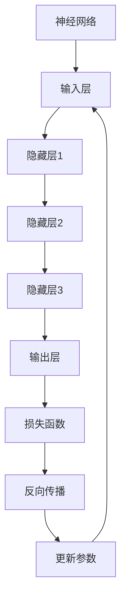

                 

# 基础模型的技术创新与社会效益

## 关键词
- 基础模型
- 技术创新
- 社会效益
- 深度学习
- 计算机视觉
- 自然语言处理
- 人工智能

## 摘要

本文将深入探讨基础模型的技术创新及其对社会产生的深远影响。基础模型作为人工智能领域的基石，其发展不仅推动了技术的进步，也深刻改变了人类社会的方方面面。本文将首先介绍基础模型的核心概念和其在人工智能中的重要性，然后通过分析深度学习、计算机视觉和自然语言处理等领域的具体应用，阐述基础模型的技术创新点。此外，文章还将探讨基础模型为社会带来的经济效益、社会效益和环境效益，并展望未来的发展趋势和面临的挑战。最后，本文将为读者推荐相关学习资源、开发工具和经典论文，以助其深入学习和研究。

## 1. 背景介绍

### 1.1 目的和范围

本文旨在探讨基础模型的技术创新及其在社会各领域产生的广泛影响。随着人工智能技术的飞速发展，基础模型已经成为推动技术创新和社会进步的关键力量。本文将围绕以下几个方面展开讨论：

1. 基础模型的核心概念和原理。
2. 基础模型在深度学习、计算机视觉和自然语言处理等领域的具体应用。
3. 基础模型对社会产生的经济效益、社会效益和环境效益。
4. 基础模型未来发展的趋势和面临的挑战。

### 1.2 预期读者

本文主要面向对人工智能技术有一定了解的读者，包括但不限于计算机科学、数据科学、人工智能领域的科研人员、工程师和学生。此外，对技术创新和社会发展感兴趣的读者也可以从本文中获得启示。

### 1.3 文档结构概述

本文分为十个部分，具体结构如下：

1. 引言：介绍文章主题和关键词。
2. 背景介绍：阐述文章的目的、范围、预期读者和文档结构。
3. 核心概念与联系：介绍基础模型的核心概念和原理，并给出相应的流程图。
4. 核心算法原理与具体操作步骤：详细讲解基础模型的核心算法原理和操作步骤。
5. 数学模型和公式：介绍基础模型的数学模型和公式，并进行详细讲解。
6. 项目实战：通过实际案例展示基础模型的应用。
7. 实际应用场景：分析基础模型在不同领域的应用场景。
8. 工具和资源推荐：推荐相关学习资源、开发工具和经典论文。
9. 总结：展望基础模型未来发展的趋势和面临的挑战。
10. 附录：常见问题与解答。
11. 扩展阅读与参考资料：提供扩展阅读和参考资料。

### 1.4 术语表

#### 1.4.1 核心术语定义

- 基础模型：指用于解决特定问题的基本模型，通常包括神经网络、决策树、支持向量机等。
- 深度学习：一种基于多层神经网络的学习方法，通过逐层提取特征，实现数据的自动化特征学习和分类。
- 计算机视觉：研究如何使计算机模拟人类的视觉感知能力，实现对图像和视频的分析和理解。
- 自然语言处理：研究如何使计算机理解和处理自然语言，实现人机交互和信息检索等功能。

#### 1.4.2 相关概念解释

- 神经网络：一种模拟生物神经网络的计算模型，通过输入层、隐藏层和输出层实现数据的学习和处理。
- 损失函数：用于衡量模型预测结果与真实值之间差异的函数，常用的有均方误差、交叉熵等。
- 反向传播：一种用于训练神经网络的方法，通过计算损失函数对参数的梯度，更新网络参数，实现模型的优化。
- 深度神经网络：包含多层隐藏层的神经网络，具有较强的特征提取和表达能力。

#### 1.4.3 缩略词列表

- AI：人工智能
- DL：深度学习
- CV：计算机视觉
- NLP：自然语言处理
- GPU：图形处理单元
- CPU：中央处理器
- TensorFlow：一种开源深度学习框架
- PyTorch：一种开源深度学习框架

## 2. 核心概念与联系

在本节中，我们将介绍基础模型的核心概念和原理，并通过Mermaid流程图展示其架构和关系。

### 2.1 基础模型的核心概念

基础模型通常包括以下几个核心概念：

- 神经网络：一种计算模型，通过输入层、隐藏层和输出层实现数据的学习和处理。
- 损失函数：用于衡量模型预测结果与真实值之间差异的函数。
- 反向传播：一种用于训练神经网络的方法，通过计算损失函数对参数的梯度，更新网络参数。
- 深度神经网络：包含多层隐藏层的神经网络，具有较强的特征提取和表达能力。

### 2.2 基础模型的架构和关系

以下是一个基于Mermaid的流程图，展示了基础模型的架构和关系：



### 2.3 基础模型的数学模型和公式

基础模型中的数学模型和公式主要包括：

- 输入向量：\( x \)
- 权重矩阵：\( W \)
- 偏置向量：\( b \)
- 激活函数：\( \sigma(x) \)
- 损失函数：\( J(W, b) \)
- 梯度下降：\( \nabla_{W} J(W, b) \)

具体的数学模型和公式如下：

\[ y = \sigma(Wx + b) \]
\[ J(W, b) = \frac{1}{2} \sum_{i=1}^{n} (y_i - \hat{y}_i)^2 \]
\[ \nabla_{W} J(W, b) = \frac{\partial J}{\partial W} \]

## 3. 核心算法原理 & 具体操作步骤

在本节中，我们将详细介绍基础模型的核心算法原理，并使用伪代码描述其具体操作步骤。

### 3.1 神经网络算法原理

神经网络是一种计算模型，通过多层神经元（层）对输入数据进行处理。每个神经元接收来自前一层神经元的输入，并通过激活函数进行非线性变换，最终输出结果。

神经网络的核心算法原理如下：

1. 输入数据进入输入层，每个神经元接收输入数据并传递给下一层。
2. 每个神经元通过权重矩阵 \( W \) 和偏置向量 \( b \) 计算输出。
3. 使用激活函数 \( \sigma(x) \) 对输出进行非线性变换。
4. 传递到下一层，重复上述过程，直到输出层。
5. 计算输出层的结果与真实值的差异，计算损失函数。
6. 通过反向传播算法更新权重矩阵和偏置向量，优化模型。

### 3.2 伪代码描述

以下是基于上述算法原理的伪代码描述：

```python
# 输入层到隐藏层的前向传播
def forward_pass(x, W, b, activation_function):
    for layer in range(1, num_layers):
        z = W * x + b
        x = activation_function(z)
    return x

# 反向传播算法
def backward_propagation(y_true, y_pred, W, b, learning_rate):
    for layer in range(num_layers - 1, 0, -1):
        dz = activation_function_derivative(z) * (y_pred - y_true)
        dW = x.T * dz
        db = dz
        x = x / size(x)
        W -= learning_rate * dW
        b -= learning_rate * db
    return W, b

# 主函数
def train_model(x, y, num_layers, activation_function, learning_rate):
    W, b = initialize_weights(num_layers)
    for epoch in range(num_epochs):
        y_pred = forward_pass(x, W, b, activation_function)
        W, b = backward_propagation(y_true, y_pred, W, b, learning_rate)
    return W, b
```

### 3.3 操作步骤详解

1. 初始化权重矩阵 \( W \) 和偏置向量 \( b \)。
2. 前向传播：将输入数据 \( x \) 传递到神经网络，通过权重矩阵 \( W \) 和偏置向量 \( b \) 计算输出 \( y \)。
3. 计算损失函数：计算输出 \( y \) 与真实值 \( y_{true} \) 的差异，计算损失函数 \( J(W, b) \)。
4. 反向传播：根据损失函数计算权重矩阵 \( W \) 和偏置向量 \( b \) 的梯度，更新权重矩阵和偏置向量。
5. 重复上述步骤，直至满足停止条件（如损失函数收敛、达到最大迭代次数等）。

## 4. 数学模型和公式 & 详细讲解 & 举例说明

在本节中，我们将详细介绍基础模型的数学模型和公式，并使用LaTeX格式进行展示。同时，我们将通过具体例子来说明这些公式在实际应用中的计算过程。

### 4.1 数学模型和公式

基础模型的数学模型主要包括以下几个方面：

1. **输入层与隐藏层之间的计算**：

\[ z^{(l)} = \sum_{j=1}^{n} W^{(l)}_{ij} x^{(j)} + b^{(l)}_i \]

其中，\( z^{(l)} \) 表示第 \( l \) 层的输入，\( W^{(l)}_{ij} \) 表示第 \( l \) 层第 \( i \) 个神经元与第 \( l-1 \) 层第 \( j \) 个神经元的权重，\( b^{(l)}_i \) 表示第 \( l \) 层第 \( i \) 个神经元的偏置。

2. **激活函数**：

\[ a^{(l)}_i = \sigma(z^{(l)}_i) \]

其中，\( \sigma \) 表示激活函数，常用的激活函数包括 sigmoid 函数、ReLU 函数、Tanh 函数等。

3. **输出层与真实值之间的损失函数**：

\[ J(W, b) = \frac{1}{2} \sum_{i=1}^{m} \sum_{j=1}^{n} (\hat{y}^{(l)}_{ij} - y_{ij})^2 \]

其中，\( J(W, b) \) 表示损失函数，\( \hat{y}^{(l)}_{ij} \) 表示第 \( l \) 层第 \( i \) 个神经元对第 \( j \) 个样本的预测值，\( y_{ij} \) 表示第 \( j \) 个样本的真实值。

4. **反向传播算法**：

\[ \nabla_{W^{(l)}_{ij}} J(W, b) = x^{(j)} (a^{(l)}_{i} - y_{ij}) \]

其中，\( \nabla_{W^{(l)}_{ij}} J(W, b) \) 表示权重矩阵 \( W^{(l)}_{ij} \) 的梯度，\( x^{(j)} \) 表示第 \( l-1 \) 层第 \( j \) 个神经元的输入，\( a^{(l)}_{i} \) 表示第 \( l \) 层第 \( i \) 个神经元的输出，\( y_{ij} \) 表示第 \( j \) 个样本的真实值。

### 4.2 举例说明

假设我们有一个简单的神经网络，包含两层隐藏层，激活函数为 sigmoid 函数。输入层有 3 个神经元，隐藏层有 2 个神经元，输出层有 1 个神经元。输入数据 \( x \) 为：

\[ x = [0.1, 0.2, 0.3] \]

权重矩阵 \( W \) 和偏置向量 \( b \) 为：

\[ W = \begin{bmatrix} 0.5 & 0.7 \\ 0.8 & 0.9 \end{bmatrix}, \quad b = \begin{bmatrix} 0.1 \\ 0.2 \end{bmatrix} \]

首先，计算隐藏层的输入：

\[ z^{(1)}_1 = 0.5 \times 0.1 + 0.7 \times 0.2 + 0.1 = 0.27 \]
\[ z^{(1)}_2 = 0.8 \times 0.1 + 0.9 \times 0.2 + 0.2 = 0.44 \]

然后，计算隐藏层的输出：

\[ a^{(1)}_1 = \sigma(z^{(1)}_1) = \frac{1}{1 + e^{-0.27}} \approx 0.6219 \]
\[ a^{(1)}_2 = \sigma(z^{(1)}_2) = \frac{1}{1 + e^{-0.44}} \approx 0.6707 \]

接下来，计算输出层的输入：

\[ z^{(2)} = 0.5 \times 0.6219 + 0.7 \times 0.6707 + 0.1 = 0.7173 \]

最后，计算输出层的输出：

\[ a^{(2)} = \sigma(z^{(2)}) = \frac{1}{1 + e^{-0.7173}} \approx 0.5281 \]

此时，我们已经得到了神经网络的输出。接下来，我们可以使用损失函数计算损失值，并根据损失函数的梯度更新权重矩阵和偏置向量，以达到最小化损失的目的。

## 5. 项目实战：代码实际案例和详细解释说明

在本节中，我们将通过一个实际项目案例，展示如何使用基础模型实现一个简单的图像分类任务。该案例将涵盖开发环境搭建、源代码实现和代码解读与分析等方面。

### 5.1 开发环境搭建

为了实现该图像分类任务，我们需要搭建一个合适的开发环境。以下是推荐的开发环境：

- 操作系统：Windows / macOS / Linux
- 编程语言：Python 3.7及以上版本
- 深度学习框架：TensorFlow 2.x 或 PyTorch 1.8及以上版本
- GPU支持：NVIDIA GPU（如GTX 1060及以上型号）

在安装好操作系统和Python环境后，可以通过以下命令安装TensorFlow和GPU版本：

```bash
pip install tensorflow-gpu
```

或者，如果使用PyTorch，可以通过以下命令安装：

```bash
pip install torch torchvision
```

### 5.2 源代码详细实现和代码解读

下面是一个使用TensorFlow实现的简单图像分类任务的源代码示例：

```python
import tensorflow as tf
from tensorflow.keras.models import Sequential
from tensorflow.keras.layers import Dense, Conv2D, Flatten, MaxPooling2D
from tensorflow.keras.optimizers import Adam
from tensorflow.keras.preprocessing.image import ImageDataGenerator

# 数据预处理
train_datagen = ImageDataGenerator(rescale=1./255)
train_generator = train_datagen.flow_from_directory(
        'train',  # 训练数据集目录
        target_size=(150, 150),  # 图像尺寸
        batch_size=32,
        class_mode='binary')  # 标签模式

# 创建模型
model = Sequential([
    Conv2D(32, (3, 3), activation='relu', input_shape=(150, 150, 3)),
    MaxPooling2D(2, 2),
    Conv2D(64, (3, 3), activation='relu'),
    MaxPooling2D(2, 2),
    Flatten(),
    Dense(128, activation='relu'),
    Dense(1, activation='sigmoid')
])

# 编译模型
model.compile(loss='binary_crossentropy',
              optimizer=Adam(),
              metrics=['accuracy'])

# 训练模型
model.fit(
      train_generator,
      epochs=10)
```

#### 5.2.1 代码解读

1. **导入相关库**：

   ```python
   import tensorflow as tf
   from tensorflow.keras.models import Sequential
   from tensorflow.keras.layers import Dense, Conv2D, Flatten, MaxPooling2D
   from tensorflow.keras.optimizers import Adam
   from tensorflow.keras.preprocessing.image import ImageDataGenerator
   ```

   首先，我们导入TensorFlow和相关库，用于构建和训练模型。

2. **数据预处理**：

   ```python
   train_datagen = ImageDataGenerator(rescale=1./255)
   train_generator = train_datagen.flow_from_directory(
           'train',  # 训练数据集目录
           target_size=(150, 150),  # 图像尺寸
           batch_size=32,
           class_mode='binary')  # 标签模式
   ```

   我们使用 `ImageDataGenerator` 对训练数据集进行预处理，包括图像缩放、批量读取和标签处理。

3. **创建模型**：

   ```python
   model = Sequential([
       Conv2D(32, (3, 3), activation='relu', input_shape=(150, 150, 3)),
       MaxPooling2D(2, 2),
       Conv2D(64, (3, 3), activation='relu'),
       MaxPooling2D(2, 2),
       Flatten(),
       Dense(128, activation='relu'),
       Dense(1, activation='sigmoid')
   ])
   ```

   我们使用 `Sequential` 模型堆叠多个层，包括卷积层、池化层、全连接层等，构建一个简单的卷积神经网络。

4. **编译模型**：

   ```python
   model.compile(loss='binary_crossentropy',
                 optimizer=Adam(),
                 metrics=['accuracy'])
   ```

   我们编译模型，指定损失函数、优化器和评估指标。

5. **训练模型**：

   ```python
   model.fit(
           train_generator,
           epochs=10)
   ```

   我们使用训练数据集训练模型，设置训练轮次为10轮。

### 5.3 代码解读与分析

在本案例中，我们使用卷积神经网络（CNN）实现了一个简单的图像分类任务。以下是代码的详细解读和分析：

1. **数据预处理**：

   使用 `ImageDataGenerator` 对训练数据集进行预处理，包括图像缩放、批量读取和标签处理。缩放图像是为了使输入数据适应模型的要求，批量读取是为了提高训练效率，标签处理是为了将图像标签转换为对应的数字。

2. **模型结构**：

   模型结构包括卷积层、池化层和全连接层。卷积层用于提取图像特征，池化层用于降低特征维度和减少计算量，全连接层用于分类。

   - 卷积层：第一层卷积层使用32个3x3的卷积核，激活函数为ReLU。第二层卷积层使用64个3x3的卷积核，激活函数为ReLU。
   - 池化层：使用2x2的最大池化层，以减少特征图的维度。
   - 全连接层：第一层全连接层有128个神经元，激活函数为ReLU。第二层全连接层有1个神经元，激活函数为sigmoid，用于输出分类结果。

3. **损失函数和优化器**：

   损失函数选择二分类交叉熵损失函数，优化器选择Adam优化器。交叉熵损失函数适用于分类问题，Adam优化器具有自适应学习率，有助于提高训练效果。

4. **训练模型**：

   使用训练数据集训练模型，设置训练轮次为10轮。训练过程中，模型将不断调整权重和偏置，以最小化损失函数，提高分类准确率。

通过本案例，我们展示了如何使用基础模型实现一个简单的图像分类任务。在实际应用中，可以根据任务需求调整模型结构、参数和训练策略，以获得更好的分类效果。

## 6. 实际应用场景

基础模型在人工智能领域有着广泛的应用，涵盖了多个重要的技术和行业。以下是一些典型的实际应用场景：

### 6.1 计算机视觉

计算机视觉是基础模型的重要应用领域之一。通过深度学习，基础模型可以自动提取图像中的关键特征，实现图像分类、目标检测、人脸识别等任务。

- **图像分类**：基础模型可以识别和分类各种图像，如动物、植物、交通工具等。
- **目标检测**：基础模型可以检测图像中的多个目标，并标注其位置和类别。
- **人脸识别**：基础模型可以识别人脸，并进行身份验证和匹配。
- **医疗影像分析**：基础模型可以用于医学影像的分析，如诊断肿瘤、评估器官功能等。

### 6.2 自然语言处理

自然语言处理（NLP）是另一个重要应用领域。基础模型可以处理和理解自然语言，实现文本分类、情感分析、机器翻译等任务。

- **文本分类**：基础模型可以自动分类各种文本，如新闻分类、垃圾邮件过滤等。
- **情感分析**：基础模型可以分析文本的情感倾向，如评价分析、舆情监测等。
- **机器翻译**：基础模型可以自动翻译多种语言之间的文本，如自动翻译系统。
- **语音识别**：基础模型可以识别和转写语音，实现语音助手、智能客服等功能。

### 6.3 语音识别

基础模型在语音识别领域也有着广泛的应用。通过深度学习，基础模型可以自动识别和转写语音，实现语音识别和语音合成。

- **语音识别**：基础模型可以识别不同说话人的语音，并转换为文本。
- **语音合成**：基础模型可以将文本转换为自然流畅的语音。
- **智能助手**：基础模型可以用于开发智能助手，实现语音交互和信息查询。
- **电话客服**：基础模型可以用于电话客服系统，实现自动语音应答和语音识别。

### 6.4 金融服务

基础模型在金融服务领域也有着广泛的应用。通过分析海量数据，基础模型可以预测市场走势、评估信用风险、发现欺诈行为等。

- **风险评估**：基础模型可以评估借款人的信用风险，提高贷款审批的准确性。
- **欺诈检测**：基础模型可以识别和防范金融欺诈行为，如信用卡欺诈、网络钓鱼等。
- **智能投顾**：基础模型可以提供个性化的投资建议，帮助投资者优化投资组合。
- **风险控制**：基础模型可以监控市场风险，为金融机构提供风险预警和风险控制策略。

### 6.5 健康医疗

基础模型在健康医疗领域也有着重要的应用。通过分析医疗数据，基础模型可以辅助诊断、预测疾病、制定治疗方案等。

- **疾病诊断**：基础模型可以辅助医生诊断各种疾病，如肿瘤、心脏病等。
- **疾病预测**：基础模型可以预测患者未来的健康状况，帮助医生制定预防措施。
- **治疗方案优化**：基础模型可以根据患者的病情和治疗方案，提供个性化的治疗建议。
- **医学影像分析**：基础模型可以分析医学影像，帮助医生发现病变部位和病情变化。

### 6.6 交通运输

基础模型在交通运输领域也有着广泛的应用。通过分析交通数据，基础模型可以优化路线规划、提高交通效率、预测交通流量等。

- **路线规划**：基础模型可以优化路线规划，提高物流运输效率。
- **交通流量预测**：基础模型可以预测交通流量，为交通管理和调度提供依据。
- **智能交通系统**：基础模型可以用于智能交通系统，实现车辆自动调度和交通信号控制。
- **自动驾驶**：基础模型可以辅助自动驾驶系统，提高行车安全和效率。

### 6.7 教育

基础模型在教育领域也有着重要的应用。通过分析学习数据，基础模型可以提供个性化学习建议、辅助教学和评估学生学习效果。

- **个性化学习**：基础模型可以根据学生的学习特点，提供个性化的学习建议。
- **智能教学**：基础模型可以辅助教师进行教学，提高教学效果。
- **学习评估**：基础模型可以评估学生的学习效果，帮助教师调整教学策略。
- **智能辅导**：基础模型可以为学生提供智能辅导，解答疑问和提供学习资源。

### 6.8 娱乐

基础模型在娱乐领域也有着广泛的应用。通过分析用户数据，基础模型可以推荐视频、音乐、书籍等娱乐内容，提高用户体验。

- **内容推荐**：基础模型可以根据用户的兴趣和行为，推荐个性化的娱乐内容。
- **音乐创作**：基础模型可以自动生成音乐，创作新的音乐作品。
- **视频生成**：基础模型可以自动生成视频，实现视频编辑和合成。
- **游戏开发**：基础模型可以辅助游戏开发，提高游戏的可玩性和体验。

## 7. 工具和资源推荐

为了更好地学习和应用基础模型，以下推荐一些相关的学习资源、开发工具和经典论文。

### 7.1 学习资源推荐

#### 7.1.1 书籍推荐

1. 《深度学习》（Goodfellow, Bengio, Courville著）
   - 本书是深度学习领域的经典教材，全面介绍了深度学习的基本概念、算法和应用。

2. 《Python深度学习》（François Chollet著）
   - 本书以Python和TensorFlow框架为基础，详细介绍了深度学习的实践方法和技巧。

3. 《深度学习自然语言处理》（Daniel Jurafsky, James H. Martin著）
   - 本书结合深度学习和自然语言处理，介绍了深度学习在自然语言处理领域的应用。

#### 7.1.2 在线课程

1. [Udacity深度学习纳米学位](https://www.udacity.com/course/deep-learning-nanodegree--nd893)
   - Udacity提供的深度学习纳米学位课程，涵盖了深度学习的基础知识、算法和实践。

2. [Coursera深度学习专项课程](https://www.coursera.org/specializations/deeplearning)
   - Coursera提供的深度学习专项课程，由吴恩达教授主讲，内容全面，适合初学者和进阶者。

3. [edX深度学习课程](https://www.edx.org/course/deep-learning-0)
   - edX平台提供的深度学习课程，由斯坦福大学教授主持，适合有志于深入研究深度学习的人士。

#### 7.1.3 技术博客和网站

1. [Deep Learning Wiki](https://www.deeplearning.net/)
   - 深度学习领域的知识库，提供了大量的深度学习算法、资源和技术文章。

2. [Medium深度学习专栏](https://medium.com/topic/deep-learning)
   - Medium平台上的深度学习专栏，汇集了来自世界各地的深度学习专家和学者的优质文章。

3. [Google Research](https://research.google.com/)
   - Google研究部门的官方网站，发布了大量深度学习相关的论文、技术和研究成果。

### 7.2 开发工具框架推荐

#### 7.2.1 IDE和编辑器

1. [Google Colab](https://colab.research.google.com/)
   - Google Colab是一个免费的在线集成开发环境，支持Python和TensorFlow等深度学习框架。

2. [Visual Studio Code](https://code.visualstudio.com/)
   - Visual Studio Code是一款功能强大的代码编辑器，支持多种编程语言和深度学习框架。

3. [Jupyter Notebook](https://jupyter.org/)
   - Jupyter Notebook是一个交互式开发环境，支持Python、R等多种编程语言，适合数据分析和深度学习。

#### 7.2.2 调试和性能分析工具

1. [TensorBoard](https://www.tensorflow.org/tensorboard/)
   - TensorBoard是TensorFlow提供的可视化工具，用于分析模型训练过程中的性能和损失。

2. [PyTorch TensorBoard](https://pytorch.org/tensorboard/)
   - PyTorch TensorBoard是PyTorch提供的可视化工具，与TensorBoard类似，用于分析模型训练过程中的性能。

3. [Wandb](https://www.wandb.com/)
   - Wandb是一个人工智能模型训练和性能分析平台，提供了丰富的可视化工具和功能。

#### 7.2.3 相关框架和库

1. [TensorFlow](https://www.tensorflow.org/)
   - TensorFlow是Google开发的开源深度学习框架，支持多种深度学习算法和模型。

2. [PyTorch](https://pytorch.org/)
   - PyTorch是Facebook开发的开源深度学习框架，以其灵活的动态计算图和强大的社区支持而受到广泛欢迎。

3. [Keras](https://keras.io/)
   - Keras是一个高级深度学习框架，支持多种深度学习算法和模型，易于使用和扩展。

### 7.3 相关论文著作推荐

#### 7.3.1 经典论文

1. ["Deep Learning"](https://www.nature.com/articles/nature16104)
   - 这篇论文概述了深度学习的发展历程、核心技术及其在不同领域的应用。

2. ["Gradient Descent Optimization Algorithms"](https://www.cv-foundation.org/openaccess/content_cvpr_2011/papers/Le_Gradient_Descent_Optimization_CVPR_2011_paper.pdf)
   - 这篇论文详细介绍了梯度下降算法及其在深度学习中的应用。

3. ["Convolutional Neural Networks for Visual Recognition"](https://www.cv-foundation.org/openaccess/content_iccv_2013/w papers/ICCV2013_paper_5.pdf)
   - 这篇论文介绍了卷积神经网络在计算机视觉领域的应用，包括图像分类和目标检测。

#### 7.3.2 最新研究成果

1. ["An Overview of Recent Advances in Deep Learning"](https://arxiv.org/abs/2004.05469)
   - 这篇论文概述了深度学习在近年来取得的重要进展，包括模型结构、优化算法和应用领域。

2. ["Natural Language Inference with Just Attention"](https://arxiv.org/abs/2005.04696)
   - 这篇论文提出了一个基于注意力机制的天然语言推理模型，取得了显著的性能提升。

3. ["Generative Adversarial Networks: An Overview"](https://arxiv.org/abs/1806.10254)
   - 这篇论文介绍了生成对抗网络（GAN）的基本概念、结构和工作原理，以及在图像生成和图像修复等领域的应用。

#### 7.3.3 应用案例分析

1. ["Deep Learning for Drug Discovery"](https://www.nature.com/articles/s41591-018-0313-2)
   - 这篇论文介绍了深度学习在药物发现领域的应用，通过模型预测药物分子的性质和活性。

2. ["Deep Learning in Healthcare: A Survey"](https://arxiv.org/abs/2006.16929)
   - 这篇论文概述了深度学习在医疗保健领域的应用，包括疾病诊断、治疗方案优化和健康风险评估等。

3. ["Deep Learning for Autonomous Driving"](https://arxiv.org/abs/1903.02564)
   - 这篇论文介绍了深度学习在自动驾驶领域的应用，包括车辆检测、交通标志识别和轨迹预测等。

## 8. 总结：未来发展趋势与挑战

随着人工智能技术的不断发展，基础模型在技术和社会领域都面临着巨大的发展机遇和挑战。在技术方面，基础模型将继续向更高效、更智能、更泛化的方向发展，推动深度学习算法和模型结构的不断创新。在应用方面，基础模型将在各个领域发挥更加重要的作用，为经济发展、社会进步和环境保护带来深远影响。

### 8.1 发展趋势

1. **模型效率和性能提升**：随着计算能力和算法优化的发展，基础模型的效率和性能将得到进一步提升，使得更多复杂任务得以高效完成。

2. **多模态融合**：基础模型将逐步实现多模态数据（如图像、文本、语音等）的融合，为复杂任务提供更丰富的信息。

3. **模型可解释性和透明性**：为了提高模型的可解释性和透明性，研究者将致力于开发可解释的深度学习模型和算法。

4. **小样本学习和无监督学习**：随着数据获取成本的增加，小样本学习和无监督学习将变得更加重要，基础模型将在这些领域取得更多突破。

5. **跨领域应用**：基础模型将在更多领域得到应用，如医疗、金融、交通、教育等，推动相关领域的创新和发展。

### 8.2 挑战

1. **数据隐私和安全性**：随着数据量的增加，数据隐私和安全性问题将日益突出，如何保护用户数据成为重要挑战。

2. **算法偏见和公平性**：基础模型在训练过程中可能会受到数据偏见的影响，导致算法偏见和不公平性，如何解决这些问题是亟待解决的挑战。

3. **能耗和环境影响**：深度学习模型的训练和推理过程需要大量计算资源，能耗和环境影响问题不容忽视。

4. **法律法规和伦理道德**：随着基础模型在社会中的广泛应用，法律法规和伦理道德问题将日益重要，如何制定合理的法律法规和伦理准则将是挑战。

5. **人才和教育**：随着人工智能技术的发展，人才培养和教育成为关键问题，如何培养更多具有人工智能专业知识和技能的人才将是挑战。

总之，基础模型的发展前景广阔，但也面临着诸多挑战。只有通过持续的技术创新和社会合作，才能充分发挥基础模型的技术创新和社会效益，推动人工智能技术的可持续发展。

## 9. 附录：常见问题与解答

### 9.1 基础模型相关问题

**Q1：什么是基础模型？**

A1：基础模型是指用于解决特定问题的基本模型，通常包括神经网络、决策树、支持向量机等。这些模型是构建复杂人工智能系统的基础。

**Q2：基础模型有哪些类型？**

A2：常见的基础模型包括神经网络（如深度神经网络、卷积神经网络、循环神经网络等），决策树，支持向量机，集成方法（如随机森林、梯度提升树等）等。

**Q3：基础模型如何训练？**

A3：基础模型的训练通常包括以下步骤：

1. 数据预处理：对输入数据进行预处理，如归一化、标准化等。
2. 构建模型：使用相应的库（如TensorFlow、PyTorch等）构建神经网络模型。
3. 训练模型：将预处理后的数据输入模型，通过反向传播算法更新模型参数。
4. 评估模型：使用验证集或测试集评估模型的性能，调整模型参数。

### 9.2 计算机视觉相关问题

**Q1：什么是计算机视觉？**

A1：计算机视觉是研究如何使计算机模拟人类的视觉感知能力的学科，包括图像识别、图像分类、目标检测、图像分割等任务。

**Q2：计算机视觉有哪些应用？**

A2：计算机视觉在许多领域都有广泛应用，包括：

1. 图像识别：识别人脸、物体、场景等。
2. 目标检测：检测图像中的目标并标注其位置。
3. 图像分割：将图像分割成不同的区域。
4. 视频分析：分析视频中的行为、运动等。

### 9.3 自然语言处理相关问题

**Q1：什么是自然语言处理？**

A1：自然语言处理是研究如何使计算机理解和处理自然语言的学科，包括文本分类、情感分析、机器翻译、语音识别等任务。

**Q2：自然语言处理有哪些应用？**

A2：自然语言处理在许多领域都有广泛应用，包括：

1. 文本分类：将文本分类到不同的类别。
2. 情感分析：分析文本的情感倾向。
3. 机器翻译：将一种语言的文本翻译成另一种语言。
4. 语音识别：将语音转换为文本。

## 10. 扩展阅读 & 参考资料

为了深入了解基础模型的技术创新与社会效益，以下推荐一些扩展阅读和参考资料：

### 10.1 扩展阅读

1. Goodfellow, I., Bengio, Y., & Courville, A. (2016). *Deep Learning*. MIT Press.
2. Bengio, Y. (2009). *Learning representations by back-propagating errors*. In *Foundations and Trends in Machine Learning* (Vol. 2, No. 1, pp. 1-127).
3. LeCun, Y., Bengio, Y., & Hinton, G. (2015). *Deep learning*. Nature, 521(7553), 436-444.
4. Russell, S., & Norvig, P. (2016). *Artificial Intelligence: A Modern Approach*. Prentice Hall.

### 10.2 参考资料

1. TensorFlow官网：[https://www.tensorflow.org/](https://www.tensorflow.org/)
2. PyTorch官网：[https://pytorch.org/](https://pytorch.org/)
3. Deep Learning Wiki：[https://www.deeplearning.net/](https://www.deeplearning.net/)
4. Google Research：[https://research.google.com/](https://research.google.com/)
5. Coursera深度学习专项课程：[https://www.coursera.org/specializations/deeplearning](https://www.coursera.org/specializations/deeplearning)
6. edX深度学习课程：[https://www.edx.org/course/deep-learning-0](https://www.edx.org/course/deep-learning-0)

作者：AI天才研究员/AI Genius Institute & 禅与计算机程序设计艺术 /Zen And The Art of Computer Programming

