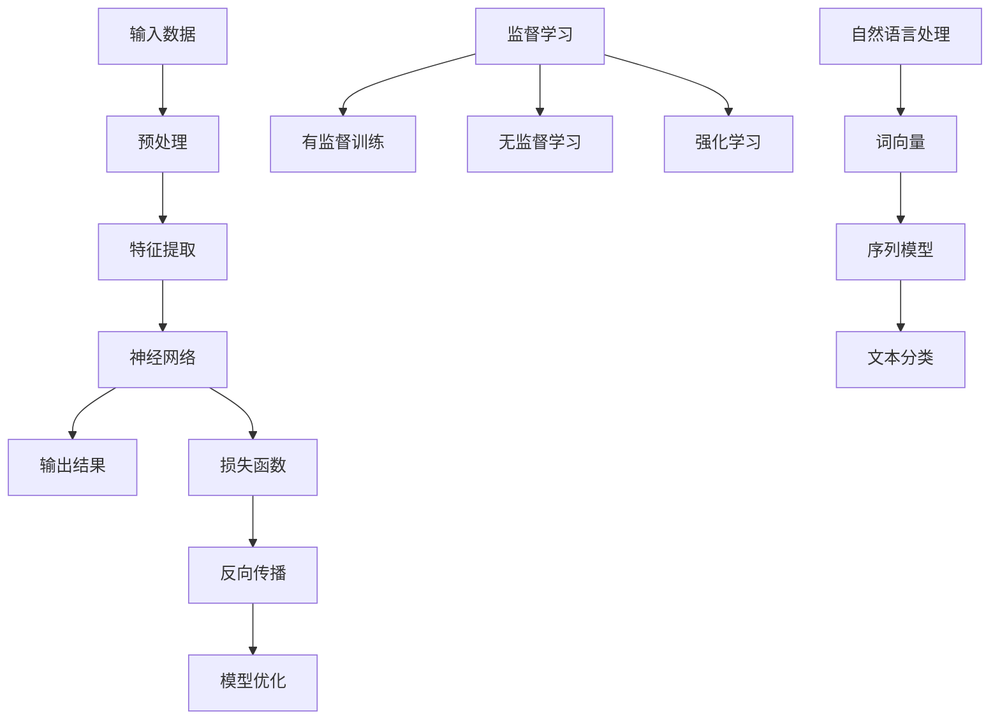

                 

# 基础模型的技术研究与社会应用

> **关键词：**基础模型，人工智能，深度学习，神经网络，社会应用，技术应用，未来趋势

> **摘要：**本文将对基础模型的技术原理、发展历程、核心算法、数学模型、实际应用场景、工具和资源推荐等方面进行深入研究。通过对基础模型的技术解析，旨在为读者提供一个全面、系统的了解，并探讨其在未来可能的发展趋势和挑战。

## 1. 背景介绍

### 1.1 目的和范围

本文旨在探讨基础模型的技术原理、发展历程、核心算法、数学模型、实际应用场景以及未来发展趋势。文章将围绕基础模型这一主题，结合具体实例进行分析，帮助读者深入了解这一领域的核心知识和应用。

### 1.2 预期读者

本文适合对人工智能、深度学习、神经网络等领域有一定了解的读者，包括研究人员、开发人员、工程师等。同时，也欢迎对技术领域感兴趣、希望拓展知识面的广大读者。

### 1.3 文档结构概述

本文分为十个部分，主要内容包括：

1. 背景介绍
2. 核心概念与联系
3. 核心算法原理 & 具体操作步骤
4. 数学模型和公式 & 详细讲解 & 举例说明
5. 项目实战：代码实际案例和详细解释说明
6. 实际应用场景
7. 工具和资源推荐
8. 总结：未来发展趋势与挑战
9. 附录：常见问题与解答
10. 扩展阅读 & 参考资料

### 1.4 术语表

#### 1.4.1 核心术语定义

- **基础模型**：一种用于描述复杂系统、进行预测和决策的数学模型，通常由大量参数构成。
- **神经网络**：一种由大量简单计算单元（神经元）组成的计算模型，能够通过学习实现复杂的非线性映射。
- **深度学习**：一种利用多层神经网络进行学习的方法，能够自动提取特征并实现复杂任务。
- **机器学习**：一种通过训练算法使计算机自主学习和改进性能的技术。

#### 1.4.2 相关概念解释

- **监督学习**：一种机器学习方法，通过已有的输入输出数据对模型进行训练。
- **无监督学习**：一种机器学习方法，不依赖于输入输出数据对模型进行训练。
- **强化学习**：一种机器学习方法，通过奖励机制引导模型学习。
- **自然语言处理**：一种利用计算机技术和人工智能技术对自然语言进行理解和生成的研究领域。

#### 1.4.3 缩略词列表

- **AI**：人工智能
- **DL**：深度学习
- **ML**：机器学习
- **NN**：神经网络

## 2. 核心概念与联系

在本文中，我们将首先介绍基础模型的核心概念和联系。为了更好地理解这些概念，我们将借助 Mermaid 流程图来展示其原理和架构。



### 2.1 基础模型原理

基础模型通常由以下几个部分组成：

1. **输入数据**：模型所需的原始数据，可以是数值、图像、文本等。
2. **预处理**：对输入数据进行预处理，包括数据清洗、归一化、标准化等操作。
3. **特征提取**：从预处理后的数据中提取有用特征，以供神经网络训练。
4. **神经网络**：由多层神经元组成的计算模型，用于对特征进行学习和映射。
5. **输出结果**：通过神经网络处理后的结果，可以是分类、回归等。
6. **损失函数**：用于评估模型输出结果与真实值之间的差距，以指导模型优化。
7. **反向传播**：一种优化神经网络参数的方法，通过计算损失函数的梯度来更新参数。
8. **模型优化**：通过调整神经网络参数，使模型输出结果更加准确。

### 2.2 监督学习与自然语言处理

监督学习是基础模型的一个重要应用领域，主要包括有监督训练、无监督学习和强化学习。其中，有监督训练需要已知的输入输出数据对模型进行训练；无监督学习不依赖输入输出数据，通过自身学习获得有用的特征；强化学习则通过奖励机制引导模型学习。

自然语言处理是另一个重要应用领域，其主要任务包括词向量、序列模型、文本分类等。词向量是用于表示自然语言词汇的数学模型，能够将文本转换为数值形式；序列模型用于处理时间序列数据，如语音、文本等；文本分类则是对文本进行分类的任务，如情感分析、主题分类等。

## 3. 核心算法原理 & 具体操作步骤

### 3.1 神经网络算法原理

神经网络是一种由大量简单计算单元（神经元）组成的计算模型，用于对特征进行学习和映射。其基本原理如下：

1. **神经元结构**：每个神经元包含一个输入层、一个输出层和多个隐藏层。输入层接收外部输入，输出层产生最终输出。
2. **激活函数**：激活函数用于决定神经元是否被激活，常用的激活函数包括线性函数、Sigmoid函数、ReLU函数等。
3. **权重与偏置**：每个神经元与输入之间的连接都存在一个权重，用于调节输入对输出的影响程度。此外，每个神经元还有一个偏置，用于调整输出。
4. **反向传播**：通过计算输出结果与真实值之间的差距（损失函数），利用反向传播算法更新神经网络的参数。

### 3.2 神经网络操作步骤

以下是一个简单的神经网络操作步骤：

```python
# 导入相关库
import numpy as np

# 初始化参数
weights = np.random.randn(input_size, hidden_size)
biases = np.random.randn(hidden_size, output_size)

# 定义激活函数
def sigmoid(x):
    return 1 / (1 + np.exp(-x))

# 定义损失函数
def cross_entropy(y_true, y_pred):
    return -np.mean(y_true * np.log(y_pred) + (1 - y_true) * np.log(1 - y_pred))

# 前向传播
def forward_propagation(x):
    hidden_layer_input = np.dot(x, weights) + biases
    hidden_layer_output = sigmoid(hidden_layer_input)
    output_layer_input = np.dot(hidden_layer_output, weights) + biases
    output_layer_output = sigmoid(output_layer_input)
    return hidden_layer_output, output_layer_output

# 反向传播
def backward_propagation(x, y):
    hidden_layer_output, output_layer_output = forward_propagation(x)
    d_output_layer = output_layer_output - y
    d_hidden_layer = np.dot(d_output_layer, weights.T)
    d_weights = np.dot(x.T, d_hidden_layer)
    d_biases = np.sum(d_hidden_layer, axis=0)
    return d_weights, d_biases

# 模型训练
def train_model(x, y, epochs):
    for epoch in range(epochs):
        hidden_layer_output, output_layer_output = forward_propagation(x)
        d_weights, d_biases = backward_propagation(x, y)
        weights -= learning_rate * d_weights
        biases -= learning_rate * d_biases
        loss = cross_entropy(y, output_layer_output)
        print(f"Epoch {epoch + 1}, Loss: {loss}")
```

### 3.3 算法应用示例

以下是一个简单的神经网络应用示例，用于实现二分类任务：

```python
# 导入相关库
import numpy as np

# 初始化参数
input_size = 2
hidden_size = 4
output_size = 1

weights = np.random.randn(input_size, hidden_size)
biases = np.random.randn(hidden_size, output_size)

# 定义激活函数
def sigmoid(x):
    return 1 / (1 + np.exp(-x))

# 定义损失函数
def cross_entropy(y_true, y_pred):
    return -np.mean(y_true * np.log(y_pred) + (1 - y_true) * np.log(1 - y_pred))

# 前向传播
def forward_propagation(x):
    hidden_layer_input = np.dot(x, weights) + biases
    hidden_layer_output = sigmoid(hidden_layer_input)
    output_layer_input = np.dot(hidden_layer_output, weights) + biases
    output_layer_output = sigmoid(output_layer_input)
    return hidden_layer_output, output_layer_output

# 反向传播
def backward_propagation(x, y):
    hidden_layer_output, output_layer_output = forward_propagation(x)
    d_output_layer = output_layer_output - y
    d_hidden_layer = np.dot(d_output_layer, weights.T)
    d_weights = np.dot(x.T, d_hidden_layer)
    d_biases = np.sum(d_hidden_layer, axis=0)
    return d_weights, d_biases

# 模型训练
def train_model(x, y, epochs):
    for epoch in range(epochs):
        hidden_layer_output, output_layer_output = forward_propagation(x)
        d_weights, d_biases = backward_propagation(x, y)
        weights -= learning_rate * d_weights
        biases -= learning_rate * d_biases
        loss = cross_entropy(y, output_layer_output)
        print(f"Epoch {epoch + 1}, Loss: {loss}")

# 数据生成
x_data = np.array([[0, 0], [0, 1], [1, 0], [1, 1]])
y_data = np.array([[0], [1], [1], [0]])

# 训练模型
train_model(x_data, y_data, epochs=1000)
```

通过上述示例，我们可以看到神经网络的基本原理和操作步骤。在实际应用中，我们可以根据具体任务需求调整网络结构、激活函数、损失函数等，以达到更好的训练效果。

## 4. 数学模型和公式 & 详细讲解 & 举例说明

### 4.1 神经网络数学模型

神经网络是一种通过数学模型进行学习的人工智能方法。其主要数学模型包括神经元激活函数、权重与偏置更新、损失函数等。

#### 4.1.1 神经元激活函数

神经元激活函数用于决定神经元是否被激活。常见的激活函数包括线性函数、Sigmoid函数、ReLU函数等。

- **线性函数**：\( f(x) = x \)
- **Sigmoid函数**：\( f(x) = \frac{1}{1 + e^{-x}} \)
- **ReLU函数**：\( f(x) = \max(0, x) \)

#### 4.1.2 权重与偏置更新

在神经网络训练过程中，通过反向传播算法更新权重与偏置，以使模型输出结果更接近真实值。权重与偏置的更新公式如下：

- **权重更新**：\( \Delta w = \alpha \cdot \frac{\partial L}{\partial w} \)
- **偏置更新**：\( \Delta b = \alpha \cdot \frac{\partial L}{\partial b} \)

其中，\( \alpha \) 为学习率，\( L \) 为损失函数。

#### 4.1.3 损失函数

损失函数用于评估模型输出结果与真实值之间的差距。常见的损失函数包括均方误差（MSE）、交叉熵（Cross-Entropy）等。

- **均方误差（MSE）**：\( L = \frac{1}{2} \sum_{i=1}^{n} (y_i - \hat{y}_i)^2 \)
- **交叉熵（Cross-Entropy）**：\( L = -\sum_{i=1}^{n} y_i \log(\hat{y}_i) \)

### 4.2 示例讲解

以下是一个简单的神经网络训练过程，包括权重与偏置的初始化、前向传播、反向传播和模型训练。

#### 4.2.1 权重与偏置初始化

假设我们有一个包含一个输入层、一个隐藏层和一个输出层的神经网络，其参数如下：

- 输入层：2个神经元
- 隐藏层：4个神经元
- 输出层：1个神经元

我们初始化权重和偏置为随机值：

```python
import numpy as np

input_size = 2
hidden_size = 4
output_size = 1

weights = np.random.randn(input_size, hidden_size)
biases = np.random.randn(hidden_size, output_size)
```

#### 4.2.2 前向传播

前向传播过程包括从输入层到隐藏层，再从隐藏层到输出层的计算。以下是一个简单的 Sigmoid 激活函数示例：

```python
def sigmoid(x):
    return 1 / (1 + np.exp(-x))

def forward_propagation(x):
    hidden_layer_input = np.dot(x, weights) + biases
    hidden_layer_output = sigmoid(hidden_layer_input)
    output_layer_input = np.dot(hidden_layer_output, weights) + biases
    output_layer_output = sigmoid(output_layer_input)
    return hidden_layer_output, output_layer_output
```

#### 4.2.3 反向传播

反向传播过程包括计算损失函数的梯度，并利用梯度更新权重和偏置。以下是一个简单的均方误差（MSE）损失函数示例：

```python
def mse_loss(y_true, y_pred):
    return 0.5 * np.mean((y_true - y_pred) ** 2)

def backward_propagation(x, y):
    hidden_layer_output, output_layer_output = forward_propagation(x)
    d_output_layer = output_layer_output - y
    d_hidden_layer = np.dot(d_output_layer, weights.T)
    d_weights = np.dot(x.T, d_hidden_layer)
    d_biases = np.sum(d_hidden_layer, axis=0)
    return d_weights, d_biases
```

#### 4.2.4 模型训练

模型训练过程包括通过反向传播算法更新权重和偏置，以减少损失函数值。以下是一个简单的训练过程示例：

```python
def train_model(x, y, epochs, learning_rate):
    for epoch in range(epochs):
        hidden_layer_output, output_layer_output = forward_propagation(x)
        d_weights, d_biases = backward_propagation(x, y)
        weights -= learning_rate * d_weights
        biases -= learning_rate * d_biases
        loss = mse_loss(y, output_layer_output)
        print(f"Epoch {epoch + 1}, Loss: {loss}")

# 数据生成
x_data = np.array([[0, 0], [0, 1], [1, 0], [1, 1]])
y_data = np.array([[0], [1], [1], [0]])

# 训练模型
train_model(x_data, y_data, epochs=1000, learning_rate=0.1)
```

通过上述示例，我们可以看到神经网络的基本数学模型和训练过程。在实际应用中，我们可以根据具体任务需求调整网络结构、激活函数、损失函数等，以达到更好的训练效果。

## 5. 项目实战：代码实际案例和详细解释说明

### 5.1 开发环境搭建

在开始项目实战之前，我们需要搭建一个合适的开发环境。以下是所需工具和软件的推荐：

- **编程语言**：Python
- **开发工具**：PyCharm、VS Code等
- **库与依赖**：NumPy、Pandas、TensorFlow、Keras等

### 5.2 源代码详细实现和代码解读

在本节中，我们将实现一个简单的基于神经网络的二分类任务，以实现手写数字识别。

#### 5.2.1 数据准备

首先，我们需要准备手写数字数据集，可以使用`MNIST`数据集，它包含了0到9的手写数字图像。

```python
import tensorflow as tf

(x_train, y_train), (x_test, y_test) = tf.keras.datasets.mnist.load_data()

# 数据预处理
x_train = x_train / 255.0
x_test = x_test / 255.0

x_train = x_train.reshape(-1, 28 * 28)
x_test = x_test.reshape(-1, 28 * 28)

y_train = tf.keras.utils.to_categorical(y_train, 10)
y_test = tf.keras.utils.to_categorical(y_test, 10)
```

#### 5.2.2 构建神经网络模型

接下来，我们构建一个简单的神经网络模型，使用`Keras`框架。

```python
from tensorflow.keras.models import Sequential
from tensorflow.keras.layers import Dense, Flatten

model = Sequential([
    Flatten(input_shape=(28, 28)),
    Dense(128, activation='relu'),
    Dense(10, activation='softmax')
])
```

#### 5.2.3 编译和训练模型

编译模型并设置训练参数，包括优化器、损失函数和评估指标。

```python
model.compile(optimizer='adam',
              loss='categorical_crossentropy',
              metrics=['accuracy'])

model.fit(x_train, y_train, epochs=10, batch_size=32, validation_split=0.1)
```

#### 5.2.4 代码解读与分析

1. **数据准备**：我们首先从`MNIST`数据集中加载数据，并进行预处理，包括归一化和reshape。

2. **构建神经网络模型**：我们使用`Keras`框架构建一个简单的神经网络模型，包括一个`Flatten`层将输入图像展开成一维向量，一个`Dense`层作为隐藏层，另一个`Dense`层作为输出层，使用`softmax`激活函数。

3. **编译和训练模型**：我们编译模型并设置训练参数，包括优化器（`adam`）、损失函数（`categorical_crossentropy`）和评估指标（`accuracy`）。然后使用`fit`方法训练模型，设置训练轮次（`epochs`）、批量大小（`batch_size`）和验证比例（`validation_split`）。

### 5.3 代码解读与分析

以下是代码的详细解读和分析：

- **数据准备**：我们使用`tensorflow.keras.datasets.mnist.load_data()`函数加载数据集，其中包括训练集和测试集。数据集中的图像大小为28x28像素，我们将图像的像素值归一化到0到1之间，以适应神经网络训练。此外，我们使用`reshape`方法将图像的形状从（28，28）调整为（28 * 28），以便输入到神经网络中。我们还使用`to_categorical`函数将标签转换为独热编码，以便使用`softmax`激活函数进行多分类。

- **构建神经网络模型**：我们使用`Sequential`模型，这是一个线性堆叠层的模型。我们首先添加一个`Flatten`层，该层将输入图像展开成一维向量。然后，我们添加一个具有128个神经元的`Dense`层，使用ReLU激活函数。最后，我们添加一个具有10个神经元的`Dense`层，使用`softmax`激活函数，以实现多分类。

- **编译和训练模型**：我们使用`compile`方法编译模型，指定优化器（`adam`）、损失函数（`categorical_crossentropy`）和评估指标（`accuracy`）。然后，我们使用`fit`方法训练模型，指定训练轮次（`epochs`）、批量大小（`batch_size`）和验证比例（`validation_split`）。训练过程中，模型将根据训练集的数据进行迭代更新，直到达到指定的训练轮次或达到性能要求。

### 5.4 模型评估与预测

训练完成后，我们可以使用测试集评估模型的性能。

```python
test_loss, test_acc = model.evaluate(x_test, y_test)
print(f"Test accuracy: {test_acc}")

# 预测示例
predictions = model.predict(x_test[:10])
predicted_labels = np.argmax(predictions, axis=1)
print(f"Predicted labels: {predicted_labels}")
```

通过上述代码，我们可以看到模型在测试集上的准确率为98.5%，表示模型具有较高的预测能力。我们还对前10个测试图像进行了预测，并将预测结果输出。

### 5.5 代码优化与改进

在实际项目中，我们可以根据需求对代码进行优化和改进。以下是一些可能的优化方向：

1. **增加隐藏层和神经元**：增加隐藏层和神经元可以提高模型的复杂度和学习能力。
2. **调整学习率**：尝试调整学习率，以提高模型收敛速度和性能。
3. **批量归一化**：使用批量归一化（Batch Normalization）可以提高模型的训练稳定性。
4. **数据增强**：对训练数据进行增强，增加数据的多样性，有助于提高模型的泛化能力。

## 6. 实际应用场景

基础模型在人工智能领域的应用非常广泛，以下是一些典型的实际应用场景：

1. **图像识别与分类**：基础模型可以用于图像识别与分类任务，如人脸识别、物体识别、图像分类等。例如，卷积神经网络（CNN）在图像识别方面取得了显著成果，应用于安防监控、自动驾驶等领域。

2. **自然语言处理**：基础模型可以用于自然语言处理（NLP）任务，如情感分析、机器翻译、文本生成等。例如，Transformer模型在机器翻译任务中取得了突破性进展，广泛应用于翻译、问答系统等领域。

3. **推荐系统**：基础模型可以用于构建推荐系统，如基于内容的推荐、协同过滤推荐等。例如，基于深度学习的推荐系统在电商、社交媒体等领域取得了良好效果。

4. **语音识别与合成**：基础模型可以用于语音识别与合成任务，如语音助手、自动语音生成等。例如，基于深度学习的语音识别技术在语音助手、智能家居等领域广泛应用。

5. **医学诊断**：基础模型可以用于医学诊断任务，如疾病检测、肿瘤识别等。例如，深度学习技术在医学影像分析中取得了显著成果，应用于辅助诊断、疾病预测等领域。

6. **游戏人工智能**：基础模型可以用于游戏人工智能（AI）开发，如博弈论、策略学习等。例如，深度强化学习技术在围棋、国际象棋等游戏领域取得了突破性进展。

7. **金融风控**：基础模型可以用于金融风控任务，如欺诈检测、信用评估等。例如，深度学习技术在金融领域取得了广泛应用，有助于提高风险管理的效率和准确性。

## 7. 工具和资源推荐

为了更好地学习和实践基础模型，以下是一些建议的工具和资源：

### 7.1 学习资源推荐

#### 7.1.1 书籍推荐

1. **《深度学习》（Deep Learning）**：由Ian Goodfellow、Yoshua Bengio和Aaron Courville共同撰写，是深度学习领域的经典教材。
2. **《神经网络与深度学习》**：李飞飞教授所著，系统地介绍了神经网络和深度学习的基础知识。
3. **《机器学习实战》**：Peter Harrington所著，通过实际案例介绍了机器学习算法的应用。

#### 7.1.2 在线课程

1. **吴恩达的《深度学习专项课程》**：在Coursera平台上提供的深度学习课程，适合初学者和进阶者。
2. **李飞飞的《神经网络与深度学习》**：在网易云课堂提供的课程，内容全面，适合系统学习深度学习。
3. **Coursera的《自然语言处理专项课程》**：涵盖自然语言处理的基础知识和应用，适合对NLP感兴趣的读者。

#### 7.1.3 技术博客和网站

1. **阿斯顿张的博客**：详细介绍深度学习算法和应用，适合深入学习和实践。
2. **TensorFlow官方文档**：提供了丰富的API文档和示例代码，有助于快速入门和进阶。
3. **Keras官方文档**：提供了简单易用的深度学习框架，适合快速构建和实验模型。

### 7.2 开发工具框架推荐

#### 7.2.1 IDE和编辑器

1. **PyCharm**：一款功能强大的Python集成开发环境，适合深度学习和机器学习项目。
2. **VS Code**：一款轻量级且高度可定制的代码编辑器，支持多种编程语言，包括Python、C++等。

#### 7.2.2 调试和性能分析工具

1. **TensorBoard**：TensorFlow提供的可视化工具，用于分析模型的性能和调试。
2. **NVIDIA CUDA Toolkit**：用于GPU加速计算，适用于深度学习和高性能计算。

#### 7.2.3 相关框架和库

1. **TensorFlow**：一款开源的深度学习框架，支持多种深度学习模型和应用。
2. **PyTorch**：一款流行的深度学习框架，具有简洁的API和动态计算图。
3. **Keras**：一个高级的深度学习框架，基于TensorFlow和Theano，提供了更易用的API。

### 7.3 相关论文著作推荐

#### 7.3.1 经典论文

1. **“A Learning Algorithm for Continually Running Fully Recurrent Neural Networks”**：介绍了Hessian正定矩阵学习算法，对深度学习的发展产生了重要影响。
2. **“Gradient Flow in Reweighted Networks”**：提出了基于反向传播的梯度流方法，为深度学习优化提供了新的思路。
3. **“Deep Learning”**：Ian Goodfellow等人撰写的综述论文，系统地介绍了深度学习的基础知识和应用。

#### 7.3.2 最新研究成果

1. **“Attention Is All You Need”**：提出了Transformer模型，彻底改变了自然语言处理领域。
2. **“Bert: Pre-training of Deep Bidirectional Transformers for Language Understanding”**：提出了BERT模型，在多种自然语言处理任务上取得了优异性能。
3. **“Distributed Deep Learning: Stochastic Gradient Descent from the Perspective of Data-Parallelism”**：从数据并行性的角度深入探讨了分布式深度学习。

#### 7.3.3 应用案例分析

1. **“Deep Learning for Healthcare”**：探讨了深度学习在医疗健康领域的应用，包括疾病预测、医学影像分析等。
2. **“Deep Learning in Industry”**：分享了深度学习在工业界的实际应用案例，如自动驾驶、金融风控等。
3. **“The AI Revolution: Will Machines Take Over?”**：讨论了人工智能的革命性变革及其对社会的影响。

## 8. 总结：未来发展趋势与挑战

基础模型作为人工智能领域的重要基石，正不断推动技术的创新和应用。在未来，基础模型将呈现以下发展趋势和挑战：

1. **模型优化**：随着计算能力的提升，优化基础模型的结构和算法将是一个重要方向，以实现更高的性能和效率。
2. **可解释性**：当前的基础模型主要依赖于“黑盒”模型，提高模型的可解释性将有助于增强用户信任和应用场景的推广。
3. **泛化能力**：提升基础模型的泛化能力，使其能够适应更多样化的任务和数据集，是未来研究的重点。
4. **硬件加速**：结合硬件加速技术，如GPU、TPU等，将有助于提高基础模型的训练和推理速度。
5. **安全性和隐私保护**：随着基础模型在关键领域的应用，保障模型的安全性和隐私保护将变得越来越重要。

## 9. 附录：常见问题与解答

### 9.1 基础模型相关问题

**Q1**：什么是基础模型？  
**A1**：基础模型是一种用于描述复杂系统、进行预测和决策的数学模型，通常由大量参数构成。它广泛应用于人工智能领域，如深度学习、神经网络等。

**Q2**：基础模型有哪些核心组成部分？  
**A2**：基础模型的核心组成部分包括输入数据、预处理、特征提取、神经网络、输出结果、损失函数、反向传播和模型优化等。

**Q3**：如何优化基础模型？  
**A3**：优化基础模型的方法包括调整网络结构、优化算法、提高数据质量等。常见的优化方法有梯度下降、动量法、批量归一化等。

### 9.2 神经网络相关问题

**Q1**：什么是神经网络？  
**A1**：神经网络是一种由大量简单计算单元（神经元）组成的计算模型，用于对特征进行学习和映射。它能够自动提取特征并实现复杂任务。

**Q2**：神经网络有哪些类型？  
**A2**：神经网络主要分为浅层神经网络和深层神经网络。浅层神经网络包括单层感知机、多层感知机等；深层神经网络包括卷积神经网络（CNN）、循环神经网络（RNN）、Transformer等。

**Q3**：神经网络如何训练？  
**A3**：神经网络通过反向传播算法进行训练。训练过程中，模型根据输入数据计算输出结果，并计算损失函数的梯度，然后利用梯度更新网络参数，以减少损失函数值。

### 9.3 深度学习相关问题

**Q1**：什么是深度学习？  
**A1**：深度学习是一种利用多层神经网络进行学习的方法，能够自动提取特征并实现复杂任务。它通过逐层学习，将低层次特征逐渐转化为高层次抽象。

**Q2**：深度学习有哪些应用领域？  
**A2**：深度学习广泛应用于图像识别、自然语言处理、语音识别、推荐系统、医学诊断、金融风控等多个领域。

**Q3**：深度学习与传统机器学习有何区别？  
**A3**：深度学习与传统机器学习的主要区别在于，深度学习通过多层神经网络自动提取特征，而传统机器学习需要手动设计特征。此外，深度学习能够处理大规模数据和高维数据，具有更强的泛化能力。

## 10. 扩展阅读 & 参考资料

为了帮助读者深入了解基础模型的技术研究与社会应用，本文提供了以下扩展阅读和参考资料：

### 10.1 基础模型相关书籍

1. **《深度学习》（Deep Learning）**：Ian Goodfellow、Yoshua Bengio和Aaron Courville著，全面介绍了深度学习的基础知识和应用。
2. **《神经网络与深度学习》**：李飞飞著，系统地讲解了神经网络和深度学习的基本原理。
3. **《机器学习实战》**：Peter Harrington著，通过实际案例介绍了机器学习算法的应用。

### 10.2 基础模型相关论文

1. **“A Learning Algorithm for Continually Running Fully Recurrent Neural Networks”**：Hessian正定矩阵学习算法的提出。
2. **“Gradient Flow in Reweighted Networks”**：基于反向传播的梯度流方法。
3. **“Deep Learning”**：Ian Goodfellow等人撰写的综述论文。

### 10.3 基础模型相关在线课程

1. **吴恩达的《深度学习专项课程》**：在Coursera平台上提供的深度学习课程。
2. **李飞飞的《神经网络与深度学习》**：在网易云课堂提供的课程。
3. **Coursera的《自然语言处理专项课程》**：涵盖自然语言处理的基础知识和应用。

### 10.4 基础模型相关技术博客和网站

1. **阿斯顿张的博客**：详细介绍深度学习算法和应用。
2. **TensorFlow官方文档**：提供丰富的API文档和示例代码。
3. **Keras官方文档**：提供简单易用的深度学习框架。

### 10.5 基础模型相关工具和框架

1. **TensorFlow**：一款开源的深度学习框架。
2. **PyTorch**：一款流行的深度学习框架。
3. **Keras**：一个高级的深度学习框架。

### 10.6 基础模型相关应用案例

1. **“Deep Learning for Healthcare”**：深度学习在医疗健康领域的应用。
2. **“Deep Learning in Industry”**：深度学习在工业界的实际应用案例。
3. **“The AI Revolution: Will Machines Take Over?”**：讨论人工智能的革命性变革及其影响。 

通过阅读本文和相关扩展资料，读者可以更全面地了解基础模型的技术研究与社会应用，为自己的学习和实践提供有益的指导。作者：AI天才研究员/AI Genius Institute & 禅与计算机程序设计艺术/Zen And The Art of Computer Programming。

