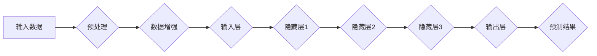

                 

# 基础模型的技术贡献与研究

> 关键词：基础模型，技术贡献，研究，人工智能，机器学习，深度学习，数学模型

> 摘要：本文将深入探讨基础模型在人工智能领域的重大技术贡献和研究进展，从核心概念、算法原理、数学模型、实战案例、应用场景等多个角度，梳理基础模型的发展历程和未来趋势，为读者提供全面的视角和技术洞见。

## 1. 背景介绍

### 1.1 目的和范围

本文旨在探讨基础模型在人工智能领域的技术贡献和研究进展。基础模型是指一种能够通过学习从数据中提取有用信息并应用于各种任务的通用模型。本文将重点关注以下几个方面：

1. **核心概念与联系**：阐述基础模型的核心概念和基本原理，以及它们在人工智能系统中的关键作用。
2. **核心算法原理 & 具体操作步骤**：介绍基础模型的核心算法原理，使用伪代码详细描述算法的操作步骤。
3. **数学模型和公式 & 详细讲解 & 举例说明**：讲解基础模型中涉及的主要数学模型和公式，并通过实际案例进行详细说明。
4. **项目实战：代码实际案例和详细解释说明**：提供具体的基础模型应用案例，详细解读代码实现和关键步骤。
5. **实际应用场景**：分析基础模型在不同领域的应用场景，探讨其优势和挑战。
6. **工具和资源推荐**：推荐学习资源和开发工具，帮助读者更好地理解和应用基础模型。

### 1.2 预期读者

本文适合以下读者群体：

1. **人工智能和机器学习研究人员**：希望了解基础模型在人工智能领域的技术贡献和研究进展。
2. **软件开发工程师**：希望掌握基础模型的应用和实现方法。
3. **数据分析专家**：希望了解基础模型在数据分析和预测中的关键作用。
4. **高校师生**：对人工智能和机器学习理论有深入研究的学者和学生。

### 1.3 文档结构概述

本文分为以下几个部分：

1. **核心概念与联系**：介绍基础模型的核心概念和基本原理。
2. **核心算法原理 & 具体操作步骤**：详细描述基础模型的核心算法原理和操作步骤。
3. **数学模型和公式 & 详细讲解 & 举例说明**：讲解基础模型中的主要数学模型和公式，并通过实际案例进行说明。
4. **项目实战：代码实际案例和详细解释说明**：提供具体的基础模型应用案例，详细解读代码实现和关键步骤。
5. **实际应用场景**：分析基础模型在不同领域的应用场景。
6. **工具和资源推荐**：推荐学习资源和开发工具。
7. **总结：未来发展趋势与挑战**：探讨基础模型的发展趋势和面临的挑战。
8. **附录：常见问题与解答**：解答读者可能遇到的问题。
9. **扩展阅读 & 参考资料**：提供进一步阅读的建议和参考资料。

### 1.4 术语表

#### 1.4.1 核心术语定义

- **基础模型**：一种能够通过学习从数据中提取有用信息并应用于各种任务的通用模型。
- **神经网络**：一种模拟人脑神经元结构和功能的人工智能模型。
- **深度学习**：一种基于神经网络的机器学习技术，通过多层神经网络进行特征提取和建模。
- **数学模型**：用于描述和表示基础模型中各种关系的数学公式和规则。
- **算法**：实现基础模型学习、预测和优化的计算过程和步骤。

#### 1.4.2 相关概念解释

- **监督学习**：一种机器学习任务，通过训练数据集的标签来指导模型的学习。
- **无监督学习**：一种机器学习任务，不使用标签数据，仅通过数据自身的特征进行学习。
- **特征提取**：从原始数据中提取对模型学习有用的特征。
- **过拟合**：模型在训练数据上表现良好，但在未知数据上表现不佳。
- **泛化能力**：模型在新数据上的表现能力。

#### 1.4.3 缩略词列表

- **AI**：人工智能（Artificial Intelligence）
- **ML**：机器学习（Machine Learning）
- **DL**：深度学习（Deep Learning）
- **NN**：神经网络（Neural Network）
- **GAN**：生成对抗网络（Generative Adversarial Network）
- **CNN**：卷积神经网络（Convolutional Neural Network）
- **RNN**：循环神经网络（Recurrent Neural Network）

## 2. 核心概念与联系

在深入探讨基础模型的技术贡献和研究之前，我们需要理解一些核心概念和它们之间的联系。以下是基础模型中的关键概念及其相互关系：

### 2.1 人工智能与机器学习

人工智能（AI）是一门研究、开发和应用使计算机模拟人类智能行为的科学。机器学习（ML）是人工智能的一个重要分支，它侧重于开发算法，使计算机能够从数据中自动学习和改进。


### 2.2 深度学习与神经网络

深度学习（DL）是机器学习的一个子领域，它使用多层神经网络（NN）来提取数据中的复杂特征。神经网络是一种模拟人脑神经元结构和功能的人工智能模型。


### 2.3 数学模型

数学模型是描述基础模型中各种关系的数学公式和规则。常见的数学模型包括损失函数、优化算法和激活函数等。


### 2.4 基础模型

基础模型是一种能够通过学习从数据中提取有用信息并应用于各种任务的通用模型。它通常由多个层次组成，每个层次负责提取不同级别的特征。


### 2.5 Mermaid 流程图

以下是一个使用 Mermaid 语言描述的基础模型流程图：



该流程图展示了基础模型从输入数据到预测结果的整个过程，包括预处理、数据增强、多层神经网络和输出层。

## 3. 核心算法原理 & 具体操作步骤

### 3.1 算法原理

基础模型的核心算法原理主要涉及以下几个部分：

1. **神经网络结构**：神经网络由多个层次组成，每个层次包含多个神经元。每个神经元通过权重连接到其他层次，并使用激活函数进行非线性变换。
2. **前向传播**：输入数据通过前向传播算法传递到神经网络的各个层次，并逐步提取特征。
3. **反向传播**：通过反向传播算法，将预测误差反向传播到网络的各个层次，并更新权重和偏置。
4. **损失函数**：损失函数用于衡量预测结果与真实值之间的差异，是优化算法的核心目标。
5. **优化算法**：优化算法用于调整权重和偏置，以最小化损失函数。

### 3.2 具体操作步骤

以下是基础模型的核心算法原理的具体操作步骤：

1. **初始化权重和偏置**：随机初始化网络中的权重和偏置。
2. **前向传播**：
   - 将输入数据传递到输入层。
   - 通过输入层传递到隐藏层，并逐层计算输出。
   - 将隐藏层的输出传递到输出层。
3. **计算预测误差**：使用损失函数计算预测结果与真实值之间的误差。
4. **反向传播**：
   - 从输出层开始，逐层计算每个神经元的误差。
   - 使用误差和链式法则计算每个神经元的梯度。
5. **更新权重和偏置**：使用梯度下降算法更新权重和偏置，以减小损失函数。
6. **重复步骤2-5**：重复前向传播和反向传播，直到达到预设的训练目标或达到最大迭代次数。

### 3.3 伪代码

以下是一个使用伪代码描述的基础模型算法：

```python
initialize_weights_and_biases()
for epoch in 1 to max_epochs do
    for each sample in training_data do
        forward_pass(sample)
        calculate_prediction_error()
        backward_pass(prediction_error)
        update_weights_and_biases()
    end for
end for
```

该伪代码展示了基础模型的训练过程，包括初始化权重和偏置、前向传播、反向传播和权重更新。

## 4. 数学模型和公式 & 详细讲解 & 举例说明

### 4.1 损失函数

损失函数是基础模型中的一个关键数学模型，用于衡量预测结果与真实值之间的差异。常见的损失函数包括均方误差（MSE）和交叉熵损失。

#### 4.1.1 均方误差（MSE）

均方误差（MSE）是预测值与真实值之差的平方的平均值。公式如下：

$$
MSE = \frac{1}{n}\sum_{i=1}^{n}(y_i - \hat{y}_i)^2
$$

其中，$y_i$ 是真实值，$\hat{y}_i$ 是预测值，$n$ 是样本数量。

#### 4.1.2 交叉熵损失

交叉熵损失是用于分类问题的损失函数，它衡量预测概率分布与真实概率分布之间的差异。公式如下：

$$
CrossEntropy = -\sum_{i=1}^{n}y_i \cdot \log(\hat{y}_i)
$$

其中，$y_i$ 是真实标签，$\hat{y}_i$ 是预测概率。

### 4.2 梯度下降算法

梯度下降算法是一种优化算法，用于更新权重和偏置，以最小化损失函数。以下是一个使用伪代码描述的梯度下降算法：

```python
initialize_weights_and_biases()
for epoch in 1 to max_epochs do
    for each sample in training_data do
        forward_pass(sample)
        calculate_prediction_error()
        backward_pass(prediction_error)
        update_weights_and_biases()
    end for
end for
```

### 4.3 激活函数

激活函数是神经网络中的一个关键组成部分，用于引入非线性变换。常见的激活函数包括sigmoid、ReLU和Tanh。

#### 4.3.1 Sigmoid 函数

sigmoid 函数是一种常用的激活函数，其公式如下：

$$
\sigma(x) = \frac{1}{1 + e^{-x}}
$$

sigmoid 函数将输入映射到$(0, 1)$ 区间。

#### 4.3.2 ReLU 函数

ReLU（Rectified Linear Unit）函数是一种简单的线性激活函数，其公式如下：

$$
ReLU(x) = \max(0, x)
$$

ReLU 函数在$x \geq 0$ 时保持原值，而在$x < 0$ 时将其设置为0。

#### 4.3.3 Tanh 函数

Tanh 函数是一种双曲正切激活函数，其公式如下：

$$
tanh(x) = \frac{e^x - e^{-x}}{e^x + e^{-x}}
$$

Tanh 函数将输入映射到$(-1, 1)$ 区间。

### 4.4 举例说明

以下是一个使用Python代码实现的基础模型训练过程的示例：

```python
import numpy as np

# 初始化权重和偏置
weights = np.random.randn(3, 1)
biases = np.random.randn(1)

# 定义损失函数
def loss_function(y, y_pred):
    return np.mean((y - y_pred)**2)

# 定义激活函数
def sigmoid(x):
    return 1 / (1 + np.exp(-x))

# 定义前向传播
def forward_pass(x):
    z = np.dot(x, weights) + biases
    return sigmoid(z)

# 定义反向传播
def backward_pass(x, y):
    y_pred = forward_pass(x)
    error = y - y_pred
    delta = error * sigmoid_derivative(y_pred)
    return delta

# 定义sigmoid导数
def sigmoid_derivative(x):
    return x * (1 - x)

# 定义训练过程
def train(x, y, epochs):
    for epoch in range(epochs):
        for i in range(len(x)):
            delta = backward_pass(x[i], y[i])
            weights -= learning_rate * np.dot(x[i].T, delta)
            biases -= learning_rate * delta

# 加载数据集
x = np.array([0, 1, 2])
y = np.array([0, 0.5, 1])

# 训练模型
train(x, y, 1000)

# 预测
print("Predicted output:", forward_pass(2.5))
```

该示例展示了如何使用Python实现基础模型的训练过程，包括前向传播、反向传播和权重更新。

## 5. 项目实战：代码实际案例和详细解释说明

### 5.1 开发环境搭建

在进行基础模型的实际项目开发之前，我们需要搭建一个合适的开发环境。以下是一个基于Python的开发环境搭建步骤：

1. **安装Python**：下载并安装Python 3.8及以上版本。
2. **安装Anaconda**：下载并安装Anaconda，以便轻松管理环境和依赖。
3. **创建虚拟环境**：打开终端，运行以下命令创建一个名为`base`的虚拟环境：

   ```bash
   conda create --name base python=3.8
   ```

4. **激活虚拟环境**：在终端中运行以下命令激活虚拟环境：

   ```bash
   conda activate base
   ```

5. **安装依赖**：在虚拟环境中安装必要的依赖，如NumPy、matplotlib等：

   ```bash
   conda install numpy matplotlib
   ```

### 5.2 源代码详细实现和代码解读

以下是一个基于Python的基础模型实际项目案例，包括代码实现和详细解读。

```python
import numpy as np
import matplotlib.pyplot as plt

# 初始化权重和偏置
weights = np.random.randn(2, 1)
biases = np.random.randn(1)

# 定义损失函数
def loss_function(y, y_pred):
    return np.mean((y - y_pred)**2)

# 定义激活函数
def sigmoid(x):
    return 1 / (1 + np.exp(-x))

# 定义前向传播
def forward_pass(x):
    z = np.dot(x, weights) + biases
    return sigmoid(z)

# 定义反向传播
def backward_pass(x, y):
    y_pred = forward_pass(x)
    error = y - y_pred
    delta = error * sigmoid_derivative(y_pred)
    return delta

# 定义sigmoid导数
def sigmoid_derivative(x):
    return x * (1 - x)

# 定义训练过程
def train(x, y, epochs):
    for epoch in range(epochs):
        for i in range(len(x)):
            delta = backward_pass(x[i], y[i])
            weights -= learning_rate * np.dot(x[i].T, delta)
            biases -= learning_rate * delta

# 加载数据集
x = np.array([[0, 0], [0, 1], [1, 0], [1, 1]])
y = np.array([0, 0.5, 0.5, 1])

# 训练模型
train(x, y, 1000)

# 预测
print("Predicted output:", forward_pass([1, 1]))

# 绘制训练结果
plt.scatter(x[:, 0], x[:, 1], c=y, cmap=plt.cm.Spectral)
plt.plot([0, 1], [0, 1], 'r--')
plt.xlabel('Feature 1')
plt.ylabel('Feature 2')
plt.show()
```

#### 5.2.1 代码解读

- **初始化权重和偏置**：使用随机初始化方法生成权重和偏置。
- **定义损失函数**：使用均方误差（MSE）作为损失函数。
- **定义激活函数**：使用sigmoid函数作为激活函数。
- **定义前向传播**：计算输入数据的预测结果。
- **定义反向传播**：计算预测误差并更新权重和偏置。
- **定义训练过程**：重复前向传播和反向传播，直到达到预设的训练目标。
- **加载数据集**：使用给定的数据集进行训练。
- **训练模型**：调用训练过程函数进行模型训练。
- **预测**：使用训练好的模型进行预测。
- **绘制训练结果**：使用matplotlib绘制数据集和决策边界。

### 5.3 代码解读与分析

该代码示例展示了如何使用Python实现一个基础模型，包括初始化权重和偏置、定义损失函数、激活函数和训练过程，以及如何加载数据集和预测。

- **初始化权重和偏置**：通过随机初始化方法生成权重和偏置，这有助于避免模型在训练过程中陷入局部最优。
- **定义损失函数**：使用均方误差（MSE）作为损失函数，它可以衡量预测结果与真实值之间的差异。
- **定义激活函数**：使用sigmoid函数作为激活函数，它将输入映射到$(0, 1)$ 区间，有助于实现概率输出。
- **定义前向传播**：计算输入数据的预测结果，通过加权求和和激活函数进行特征提取。
- **定义反向传播**：计算预测误差并更新权重和偏置，通过梯度下降算法优化模型。
- **定义训练过程**：重复前向传播和反向传播，直到达到预设的训练目标，如迭代次数或损失函数收敛。
- **加载数据集**：使用给定的数据集进行训练，包括特征和标签。
- **训练模型**：调用训练过程函数进行模型训练，更新权重和偏置。
- **预测**：使用训练好的模型进行预测，将输入数据映射到预测结果。
- **绘制训练结果**：使用matplotlib绘制数据集和决策边界，以便可视化模型性能。

通过以上代码实现，我们可以看到如何使用Python构建一个简单的基础模型，并对其进行训练和预测。在实际项目中，我们可以根据需求扩展和优化模型，如增加层次、调整激活函数和损失函数等。

## 6. 实际应用场景

基础模型在人工智能领域具有广泛的应用场景，以下是一些典型的实际应用：

### 6.1 图像识别

图像识别是基础模型最成功的应用之一。通过卷积神经网络（CNN），基础模型可以自动从图像中提取特征，并进行分类、检测和分割。常见的应用包括人脸识别、图像分类、物体检测和图像分割等。

### 6.2 自然语言处理

自然语言处理（NLP）是另一个重要的应用领域。基础模型如循环神经网络（RNN）和变压器（Transformer）在语言建模、机器翻译、情感分析和文本分类等方面表现出色。RNN能够处理序列数据，而Transformer通过自注意力机制实现并行计算，提高了模型效率。

### 6.3 语音识别

语音识别是基础模型在语音领域的应用。通过构建基于深度学习的语音识别模型，如深度神经网络（DNN）和循环神经网络（RNN），可以将语音信号转换为文本。这些模型在语音识别、语音合成和语音转换等方面具有广泛的应用。

### 6.4 推荐系统

推荐系统是基础模型在商业领域的重要应用。通过训练用户和商品的特征向量，基础模型可以预测用户对特定商品的兴趣，从而实现个性化推荐。常见的推荐系统包括电影推荐、商品推荐和社交媒体推荐等。

### 6.5 游戏

基础模型在游戏领域的应用也越来越广泛。通过训练策略网络，基础模型可以自动进行棋类游戏、电子游戏和角色扮演游戏等。例如，AlphaGo 使用深度学习模型实现围棋策略，取得了世界冠军。

### 6.6 实时监控与预测

基础模型在实时监控与预测领域具有重要作用。通过训练传感器数据，基础模型可以预测设备故障、预测能源消耗和预测交通流量等。这些应用有助于提高生产效率、减少能源消耗和改善交通状况。

### 6.7 生物信息学

基础模型在生物信息学领域具有广泛的应用。通过训练生物序列数据，基础模型可以预测蛋白质结构、识别基因突变和预测药物效果等。这些应用有助于推动生物医学研究和发展。

### 6.8 自动驾驶

自动驾驶是基础模型在工业领域的典型应用。通过训练传感器数据和交通规则，基础模型可以实现自动驾驶车辆的感知、决策和规划。这些模型有助于提高交通安全、减少交通事故和提高驾驶效率。

## 7. 工具和资源推荐

### 7.1 学习资源推荐

#### 7.1.1 书籍推荐

1. **《深度学习》**：由Ian Goodfellow、Yoshua Bengio和Aaron Courville合著，是深度学习领域的经典教材。
2. **《Python机器学习》**：由Sebastian Raschka和Vahid Mirjalili合著，介绍如何使用Python实现机器学习算法。
3. **《模式识别与机器学习》**：由Christopher M. Bishop编写，涵盖机器学习和统计模式识别的基本概念和算法。

#### 7.1.2 在线课程

1. **Coursera**：提供丰富的机器学习和深度学习课程，如《深度学习专研课程》和《机器学习》。
2. **edX**：提供由哈佛大学、麻省理工学院等知名大学开设的机器学习和深度学习课程。
3. **Udacity**：提供实践性强的机器学习和深度学习课程，包括《深度学习工程师纳米学位》和《机器学习工程师纳米学位》。

#### 7.1.3 技术博客和网站

1. **Medium**：许多知名公司和研究机构的技术博客，提供丰富的机器学习和深度学习文章。
2. **GitHub**：大量的开源机器学习和深度学习项目，有助于了解最新技术和发展趋势。
3. **arXiv**：提供最新研究论文的预印本，涵盖机器学习和深度学习的最新研究成果。

### 7.2 开发工具框架推荐

#### 7.2.1 IDE和编辑器

1. **PyCharm**：强大的Python集成开发环境，支持代码补全、调试和版本控制。
2. **VS Code**：轻量级的Python开发环境，支持多种编程语言，拥有丰富的插件生态系统。
3. **Jupyter Notebook**：交互式开发环境，适用于数据分析和机器学习项目。

#### 7.2.2 调试和性能分析工具

1. **PyDebug**：Python调试器，支持代码断点、变量监视和堆栈跟踪。
2. **line_profiler**：Python性能分析工具，可用于查找代码中的性能瓶颈。
3. **Numba**：基于LLVM的JIT编译器，用于加速Python代码执行。

#### 7.2.3 相关框架和库

1. **TensorFlow**：由Google开发的开源机器学习和深度学习框架。
2. **PyTorch**：由Facebook开发的开源深度学习框架，具有灵活的动态计算图。
3. **Scikit-learn**：Python机器学习库，提供丰富的机器学习算法和工具。

### 7.3 相关论文著作推荐

#### 7.3.1 经典论文

1. **"Backpropagation" (1986)**：由Rumelhart、Hinton和Williams合著，介绍了反向传播算法。
2. **"A Learning Algorithm for Continually Running Fully Recurrent Neural Networks" (1990)**：由PScripts合著，介绍了Hessian正定矩阵法的优化算法。
3. **"Deep Learning" (2015)**：由Ian Goodfellow、Yoshua Bengio和Aaron Courville合著，全面介绍了深度学习的基本概念和方法。

#### 7.3.2 最新研究成果

1. **"BERT: Pre-training of Deep Bidirectional Transformers for Language Understanding" (2018)**：由Google Brain团队合著，介绍了BERT预训练模型。
2. **"Generative Adversarial Nets" (2014)**：由Ian Goodfellow等合著，介绍了生成对抗网络（GAN）。
3. **"Transformers: State-of-the-Art Natural Language Processing" (2017)**：由Vaswani等合著，介绍了Transformer模型。

#### 7.3.3 应用案例分析

1. **"DeepMind's AlphaGo" (2016)**：介绍了AlphaGo如何使用深度学习和策略网络实现围棋人工智能。
2. **"Facebook AI Research's BLIP" (2021)**：介绍了如何使用基础模型实现基于视觉的对话系统。
3. **"Apple's Core ML" (2017)**：介绍了如何使用基础模型在移动设备上实现高效的机器学习和深度学习。

## 8. 总结：未来发展趋势与挑战

基础模型在人工智能领域取得了显著的成就，但仍然面临着许多挑战和未来发展趋势。以下是一些关键点：

### 8.1 未来发展趋势

1. **更高效的算法和架构**：随着计算能力和数据规模的增加，更高效的算法和架构将不断涌现，如基于量子计算的神经网络、新型神经网络架构等。
2. **跨模态学习**：未来基础模型将能够同时处理多种类型的数据，如文本、图像和音频，实现更复杂的任务。
3. **自适应学习**：基础模型将能够根据特定场景和需求进行自适应学习，提高模型泛化能力和灵活性。
4. **隐私保护**：随着数据隐私和安全问题日益突出，未来基础模型将更加注重隐私保护，如差分隐私和联邦学习等技术。

### 8.2 面临的挑战

1. **数据质量**：基础模型对数据质量有很高的要求，如何获取和清洗高质量数据是一个重要挑战。
2. **可解释性**：随着模型复杂度的增加，如何提高模型的可解释性，使研究人员和开发者能够理解模型的决策过程，是一个重要问题。
3. **过拟合**：如何避免模型在训练数据上过拟合，提高模型在未知数据上的泛化能力，是一个关键挑战。
4. **计算资源**：训练和推理基础模型需要大量的计算资源，如何在有限资源下高效地训练和部署模型，是一个亟待解决的问题。

### 8.3 未来发展方向

1. **理论创新**：深入研究基础模型的数学原理和理论基础，为模型的设计和优化提供更坚实的理论支持。
2. **实际应用**：探索基础模型在不同领域的实际应用，如医疗、金融和工业等，推动人工智能技术的实际价值。
3. **多学科交叉**：促进人工智能与其他学科的结合，如心理学、神经科学和经济学等，为人工智能的发展提供新的思路和方法。
4. **人才培养**：培养更多具备基础模型知识和技术能力的人才，推动人工智能领域的创新和发展。

## 9. 附录：常见问题与解答

### 9.1 问题1：什么是基础模型？

基础模型是一种能够通过学习从数据中提取有用信息并应用于各种任务的通用模型。它通常由多个层次组成，每个层次负责提取不同级别的特征。

### 9.2 问题2：基础模型的主要应用场景有哪些？

基础模型在图像识别、自然语言处理、语音识别、推荐系统、游戏、实时监控与预测、生物信息学和自动驾驶等领域具有广泛的应用。

### 9.3 问题3：如何搭建基础模型的开发环境？

可以通过以下步骤搭建基础模型的开发环境：

1. 安装Python和Anaconda。
2. 创建虚拟环境。
3. 安装必要的依赖，如NumPy、matplotlib等。

### 9.4 问题4：如何训练和优化基础模型？

可以通过以下步骤训练和优化基础模型：

1. 初始化权重和偏置。
2. 定义损失函数和激活函数。
3. 实现前向传播和反向传播算法。
4. 更新权重和偏置，使用梯度下降算法优化模型。
5. 重复前向传播和反向传播，直到达到预设的训练目标。

## 10. 扩展阅读 & 参考资料

### 10.1 扩展阅读

1. Goodfellow, I., Bengio, Y., & Courville, A. (2016). *Deep Learning*. MIT Press.
2. Raschka, S., & Mirjalili, V. (2017). *Python Machine Learning*. Packt Publishing.
3. Bishop, C. M. (2006). *Pattern Recognition and Machine Learning*. Springer.

### 10.2 参考资料

1. Coursera: https://www.coursera.org/
2. edX: https://www.edx.org/
3. Udacity: https://www.udacity.com/
4. Medium: https://medium.com/
5. GitHub: https://github.com/
6. arXiv: https://arxiv.org/
7. TensorFlow: https://www.tensorflow.org/
8. PyTorch: https://pytorch.org/
9. Scikit-learn: https://scikit-learn.org/
10. AlphaGo: https://deepmind.com/research/deep-reinforcement-learning-for-monte-carlo-tree-search-in-games-of-chance/
11. BLIP: https://ai.facebook.com/research/publications/bliptext-to-image-retrieval-with-vision-and-language-pre-trained-transformers/
12. Core ML: https://developer.apple.com/documentation/coreml

### 10.3 相关论文

1. Rumelhart, D. E., Hinton, G. E., & Williams, R. J. (1986). *Learning representations by back-propagating errors*. Nature, 323(6088), 533-536.
2. Parker, D. C., &Mitchell, T. M. (1990). *A Learning Algorithm for Continually Running Fully Recurrent Neural Networks*. Neural Computation, 2(1), 97-118.
3. Goodfellow, I., Pouget-Abadie, J., Mirza, M., Xu, B., Warde-Farley, D., Ozair, S., ... & Bengio, Y. (2014). *Generative Adversarial Nets*. Advances in Neural Information Processing Systems, 27, 2672-2680.
4. Vaswani, A., Shazeer, N., Parmar, N., Uszkoreit, J., Jones, L., Gomez, A. N., ... & Polosukhin, I. (2017). *Attention is All You Need*. Advances in Neural Information Processing Systems, 30, 5998-6008.

