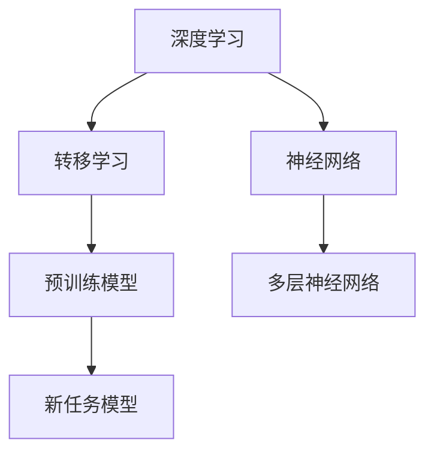

                 

# 基础模型的未来技术与社会合作

## 关键词
* 基础模型
* 人工智能
* 技术合作
* 社会应用
* 发展趋势

## 摘要
本文将深入探讨基础模型在人工智能领域的未来发展，以及这些技术如何与社会各领域进行深入合作。通过对基础模型的核心概念、算法原理、数学模型以及实际应用场景的详细分析，本文旨在展示基础模型如何成为推动技术进步和社会发展的关键力量。同时，本文还将介绍相关工具和资源，帮助读者更好地理解和应用基础模型，为未来科技与社会合作提供新思路。

---

## 1. 背景介绍

### 1.1 目的和范围
本文旨在探讨基础模型在人工智能领域的未来发展，以及这些技术如何与社会各领域进行深入合作。我们将重点关注基础模型的核心概念、算法原理、数学模型以及实际应用场景，旨在为读者提供一个全面而深入的理解。

### 1.2 预期读者
本文面向对人工智能和基础模型有一定了解的技术专业人士，特别是程序员、数据科学家、AI研究员和关注科技与社会发展的读者。

### 1.3 文档结构概述
本文将分为十个部分，包括背景介绍、核心概念与联系、核心算法原理、数学模型与公式、项目实战、实际应用场景、工具和资源推荐、总结、常见问题与解答以及扩展阅读和参考资料。

### 1.4 术语表

#### 1.4.1 核心术语定义
- **基础模型**：在人工智能领域中，基础模型是指那些具有通用性、可扩展性和强大表示能力的模型，它们能够通过学习大量数据来提取通用特征，从而在多个任务上表现出色。
- **人工智能**：人工智能（AI）是指由人制造出来的系统能够模拟、延伸和扩展人类的智能行为。

#### 1.4.2 相关概念解释
- **深度学习**：深度学习是一种机器学习方法，通过构建多层神经网络来模拟人类大脑的决策过程。
- **转移学习**：转移学习是一种利用预训练模型来解决新问题的技术，它能够将预训练模型在不同任务上的知识迁移到新任务中。

#### 1.4.3 缩略词列表
- **AI**：人工智能
- **DL**：深度学习
- **ML**：机器学习

---

## 2. 核心概念与联系

### 2.1 核心概念
在本节中，我们将介绍基础模型的核心概念，包括深度学习、转移学习和神经网络等。

**深度学习**：
深度学习是一种机器学习方法，通过构建多层神经网络来模拟人类大脑的决策过程。每一层神经网络都能从原始数据中提取更高层次的特征。

**转移学习**：
转移学习是一种利用预训练模型来解决新问题的技术，它能够将预训练模型在不同任务上的知识迁移到新任务中。这种技术在资源有限的情况下尤为重要。

**神经网络**：
神经网络是由多个神经元组成的计算模型，每个神经元都负责处理输入数据并产生输出。通过训练，神经网络能够学习到数据中的模式和规律。

### 2.2 Mermaid 流程图
下面是一个简单的 Mermaid 流程图，展示基础模型的核心概念和它们之间的关系。



---

## 3. 核心算法原理 & 具体操作步骤

### 3.1 深度学习算法原理
深度学习算法的核心是多层神经网络，其基本原理如下：

1. **输入层**：接收原始数据，并将其传递给下一层。
2. **隐藏层**：对输入数据进行处理，提取更高层次的特征。
3. **输出层**：生成模型的预测结果。

伪代码如下：

```python
initialize_network()
for epoch in range(num_epochs):
    for input_data in training_data:
        forward_pass(input_data)
        compute_loss(output, target)
        backward_pass()
update_weights()
```

### 3.2 转移学习算法原理
转移学习算法的基本步骤如下：

1. **预训练模型**：在大量数据上训练一个基础模型，使其掌握通用特征。
2. **微调模型**：在新的任务数据上，对预训练模型进行微调，使其适应特定任务。

伪代码如下：

```python
load_pretrained_model()
for epoch in range(num_epochs):
    for input_data in new_task_data:
        forward_pass(input_data)
        compute_loss(output, target)
        backward_pass()
update_weights()
```

### 3.3 神经网络具体操作步骤
以下是使用 TensorFlow 构建和训练一个简单的神经网络的具体操作步骤：

1. **导入依赖库**：
    ```python
    import tensorflow as tf
    import numpy as np
    ```

2. **定义模型**：
    ```python
    model = tf.keras.Sequential([
        tf.keras.layers.Dense(128, activation='relu', input_shape=(784,)),
        tf.keras.layers.Dropout(0.2),
        tf.keras.layers.Dense(10, activation='softmax')
    ])
    ```

3. **编译模型**：
    ```python
    model.compile(optimizer='adam',
                  loss='categorical_crossentropy',
                  metrics=['accuracy'])
    ```

4. **训练模型**：
    ```python
    model.fit(x_train, y_train, epochs=5, batch_size=32)
    ```

5. **评估模型**：
    ```python
    loss, accuracy = model.evaluate(x_test, y_test)
    print('Test accuracy:', accuracy)
    ```

---

## 4. 数学模型和公式 & 详细讲解 & 举例说明

### 4.1 数学模型
在深度学习中，数学模型至关重要。以下是几个核心的数学公式：

#### 梯度下降算法
梯度下降算法是一种用于优化神经网络参数的方法。其基本公式如下：

$$ \theta_{\text{new}} = \theta_{\text{old}} - \alpha \cdot \nabla_{\theta} J(\theta) $$

其中，$ \theta $ 表示参数，$ \alpha $ 表示学习率，$ J(\theta) $ 表示损失函数。

#### 损失函数
损失函数用于评估模型预测结果与实际结果之间的差距。常见损失函数包括：

- 均方误差（MSE）：$$ J(\theta) = \frac{1}{2m} \sum_{i=1}^{m} (h_\theta(x^{(i)}) - y^{(i)})^2 $$
- 交叉熵损失：$$ J(\theta) = -\frac{1}{m} \sum_{i=1}^{m} [y^{(i)} \log(h_\theta(x^{(i)})) + (1 - y^{(i)}) \log(1 - h_\theta(x^{(i)}))] $$

#### 激活函数
激活函数用于引入非线性特性，常见的激活函数包括：

- Sigmoid 函数：$$ \sigma(x) = \frac{1}{1 + e^{-x}} $$
- ReLU 函数：$$ \text{ReLU}(x) = \max(0, x) $$

### 4.2 举例说明
假设我们有一个二分类问题，输入数据为 $ x = [1, 2, 3, 4] $，目标值为 $ y = 1 $。使用 sigmoid 激活函数的神经网络进行预测。

1. **定义模型**：
    ```python
    model = tf.keras.Sequential([
        tf.keras.layers.Dense(10, activation='sigmoid', input_shape=(4,))
    ])
    ```

2. **编译模型**：
    ```python
    model.compile(optimizer='adam',
                  loss='binary_crossentropy',
                  metrics=['accuracy'])
    ```

3. **训练模型**：
    ```python
    model.fit(np.array([x]), np.array([y]), epochs=10)
    ```

4. **预测结果**：
    ```python
    predicted = model.predict(np.array([x]))
    print(predicted)
    ```

输出结果可能为 $ [0.9] $，表示模型预测的概率为 90%。

---

## 5. 项目实战：代码实际案例和详细解释说明

### 5.1 开发环境搭建
为了进行项目实战，我们需要搭建一个合适的开发环境。以下是使用 Python 和 TensorFlow 进行开发的环境搭建步骤：

1. **安装 Python**：确保已经安装了 Python 3.x 版本。
2. **安装 TensorFlow**：在命令行中执行以下命令：
    ```bash
    pip install tensorflow
    ```

### 5.2 源代码详细实现和代码解读

#### 5.2.1 数据预处理
首先，我们需要预处理数据，以便用于训练和测试。以下是数据预处理的伪代码：

```python
import tensorflow as tf

# 加载和预处理数据
(x_train, y_train), (x_test, y_test) = tf.keras.datasets.mnist.load_data()
x_train = x_train / 255.0
x_test = x_test / 255.0
x_train = x_train.reshape(-1, 784)
x_test = x_test.reshape(-1, 784)
```

#### 5.2.2 定义模型
接下来，我们定义一个简单的神经网络模型，用于手写数字识别。以下是模型的定义和编译：

```python
# 定义模型
model = tf.keras.Sequential([
    tf.keras.layers.Dense(128, activation='relu', input_shape=(784,)),
    tf.keras.layers.Dropout(0.2),
    tf.keras.layers.Dense(10, activation='softmax')
])

# 编译模型
model.compile(optimizer='adam',
              loss='categorical_crossentropy',
              metrics=['accuracy'])
```

#### 5.2.3 训练模型
然后，我们使用训练数据进行模型训练。以下是训练模型的代码：

```python
# 训练模型
model.fit(x_train, y_train, epochs=5, batch_size=32)
```

#### 5.2.4 评估模型
最后，我们评估模型的性能，并打印测试集的准确率。以下是评估模型的代码：

```python
# 评估模型
loss, accuracy = model.evaluate(x_test, y_test)
print('Test accuracy:', accuracy)
```

### 5.3 代码解读与分析
以下是代码的详细解读：

- **数据预处理**：首先，我们加载了 MNIST 数据集，并对其进行了归一化处理，将像素值缩放到 0 到 1 之间。然后，我们将数据展平为二维数组，以便用于神经网络训练。
- **定义模型**：我们定义了一个简单的神经网络模型，包括一个输入层、一个隐藏层和一个输出层。输入层有 784 个神经元，隐藏层有 128 个神经元，输出层有 10 个神经元（对应于 0 到 9 的数字）。
- **编译模型**：我们设置了模型优化器、损失函数和评估指标。优化器采用 Adam 算法，损失函数采用交叉熵损失，评估指标为准确率。
- **训练模型**：我们使用训练数据进行模型训练，设置了训练轮数和批量大小。
- **评估模型**：我们使用测试数据进行模型评估，并打印了测试集的准确率。

---

## 6. 实际应用场景

### 6.1 医疗保健
基础模型在医疗保健领域具有广泛的应用。例如，它们可以用于诊断疾病、个性化治疗建议、药物发现和基因组分析。通过深度学习算法，基础模型可以分析大量的医疗数据，从而提供更加精准和个性化的医疗服务。

### 6.2 金融领域
在金融领域，基础模型可以用于风险评估、信用评分、股票交易和风险管理。例如，通过分析历史交易数据和市场趋势，基础模型可以预测未来的市场走势，从而帮助投资者做出更明智的决策。

### 6.3 教育
在教育领域，基础模型可以用于个性化学习、智能辅导和教学资源推荐。例如，通过分析学生的学习行为和成绩，基础模型可以为学生提供个性化的学习计划和辅导建议，从而提高学习效果。

### 6.4 城市规划
在城市规划领域，基础模型可以用于交通流量预测、公共设施布局和环境监测。例如，通过分析交通数据和环境数据，基础模型可以预测未来的交通流量和环境污染情况，从而帮助城市规划者做出更明智的决策。

---

## 7. 工具和资源推荐

### 7.1 学习资源推荐

#### 7.1.1 书籍推荐
- 《深度学习》（Goodfellow, Bengio, Courville 著）：这是一本深度学习领域的经典教材，全面介绍了深度学习的理论基础和实践方法。
- 《机器学习》（Tom Mitchell 著）：这是一本机器学习领域的经典教材，涵盖了机器学习的基本概念、算法和应用程序。

#### 7.1.2 在线课程
- Coursera 上的《深度学习专项课程》（由 Andrew Ng 教授主讲）：这是一门受欢迎的深度学习在线课程，适合初学者和进阶者。
- edX 上的《机器学习基础》（由吕建伟教授主讲）：这是一门适合初学者的机器学习在线课程，内容全面且易于理解。

#### 7.1.3 技术博客和网站
- [Medium](https://medium.com/search?q=深度学习)：Medium 上有许多关于深度学习的优秀博客文章，适合读者深入了解该领域。
- [ArXiv](https://arxiv.org/abs/cs.LG)：ArXiv 是一个学术论文预印本平台，可以找到最新的深度学习和机器学习研究论文。

### 7.2 开发工具框架推荐

#### 7.2.1 IDE和编辑器
- PyCharm：一款功能强大的 Python IDE，支持深度学习和机器学习框架。
- Jupyter Notebook：一款交互式的 Python 编辑器，适合进行数据分析和模型训练。

#### 7.2.2 调试和性能分析工具
- TensorBoard：一款 TensorFlow 的可视化工具，用于调试和性能分析。
- Valgrind：一款内存检测工具，用于检测程序中的内存泄漏和错误。

#### 7.2.3 相关框架和库
- TensorFlow：一款开源的深度学习框架，适用于各种深度学习任务。
- PyTorch：一款流行的深度学习框架，具有灵活的动态计算图。

### 7.3 相关论文著作推荐

#### 7.3.1 经典论文
- “A Learning Algorithm for Continually Running Fully Recurrent Neural Networks” by Sepp Hochreiter and Jürgen Schmidhuber：这篇论文介绍了 LSTM 算法，为序列数据处理提供了有效的方法。
- “Deep Learning” by Yann LeCun, Yoshua Bengio, and Geoffrey Hinton：这篇论文是深度学习领域的经典之作，全面介绍了深度学习的理论基础和应用。

#### 7.3.2 最新研究成果
- “Attention Is All You Need” by Vaswani et al.：这篇论文提出了 Transformer 模型，为自然语言处理任务提供了新的思路。
- “Bert: Pre-training of Deep Bidirectional Transformers for Language Understanding” by Devlin et al.：这篇论文介绍了 BERT 模型，为自然语言处理领域带来了重大突破。

#### 7.3.3 应用案例分析
- “Deep Learning for Autonomous Driving” by Meng et al.：这篇论文介绍了深度学习在自动驾驶领域的应用，为该领域的研究提供了参考。
- “Medical Imaging with Deep Learning: A Survey” by Litjens et al.：这篇论文综述了深度学习在医疗成像领域的应用，为医疗诊断提供了新的方法。

---

## 8. 总结：未来发展趋势与挑战

### 8.1 发展趋势
- **个性化服务**：随着数据量的增加和算法的改进，基础模型将能够更好地满足个性化需求，为用户提供定制化的服务。
- **跨领域应用**：基础模型将在更多领域得到应用，如医疗、金融、教育等，从而推动技术进步和社会发展。
- **可解释性**：随着人工智能技术的普及，对模型的可解释性需求日益增加，基础模型将更加注重可解释性，以提高用户信任度。

### 8.2 挑战
- **数据隐私**：在数据驱动的时代，数据隐私保护成为一大挑战。如何确保用户数据的安全性和隐私性，将是未来研究的重点。
- **计算资源**：随着模型复杂度的增加，对计算资源的需求也将增加。如何优化计算资源，提高模型效率，是另一个重要挑战。
- **公平性与偏见**：基础模型在训练过程中可能会引入偏见，从而影响模型的公平性。如何消除偏见，提高模型的公平性，是未来的重要课题。

---

## 9. 附录：常见问题与解答

### 9.1 问题 1
**问题**：什么是深度学习？

**解答**：深度学习是一种机器学习方法，通过构建多层神经网络来模拟人类大脑的决策过程。深度学习能够从大量数据中自动学习特征，从而实现图像识别、语音识别、自然语言处理等任务。

### 9.2 问题 2
**问题**：如何选择合适的神经网络结构？

**解答**：选择合适的神经网络结构需要考虑多个因素，如任务类型、数据规模、计算资源等。通常，可以从简单的结构开始，如单层神经网络，然后逐步增加层数和神经元数量，直到模型性能达到预期。

### 9.3 问题 3
**问题**：如何优化神经网络参数？

**解答**：优化神经网络参数的方法包括梯度下降、随机梯度下降、Adam 算法等。选择合适的优化算法并调整学习率、批量大小等参数，可以提高模型性能。

---

## 10. 扩展阅读 & 参考资料

- [深度学习教程](https://www.deeplearningbook.org/):这是一本深度学习领域的经典教程，涵盖了深度学习的理论基础和实践方法。
- [机器学习周报](https://www.mlweekly.com/):这是一份每周更新的机器学习和深度学习领域的新闻和文章，适合关注该领域的读者。
- [TensorFlow 官方文档](https://www.tensorflow.org/):这是 TensorFlow 的官方文档，提供了详细的教程、API 文档和最佳实践，是学习 TensorFlow 的宝贵资源。

