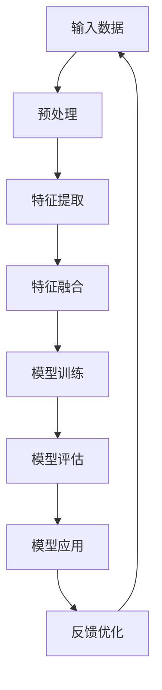
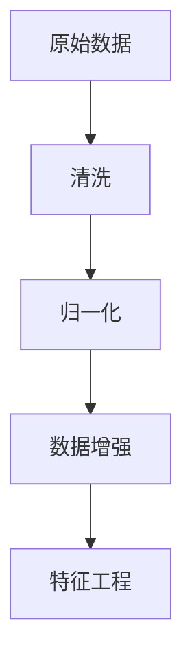
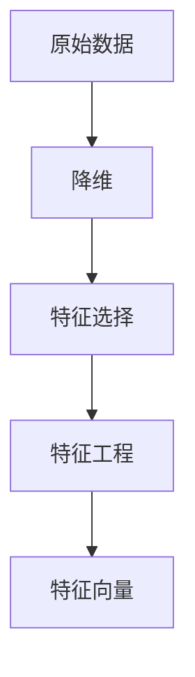
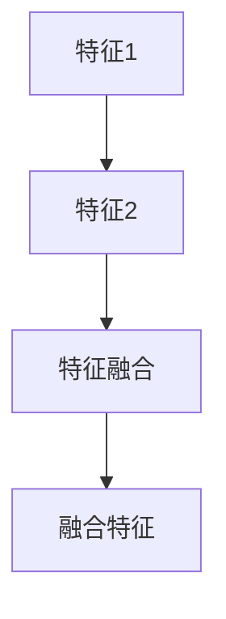
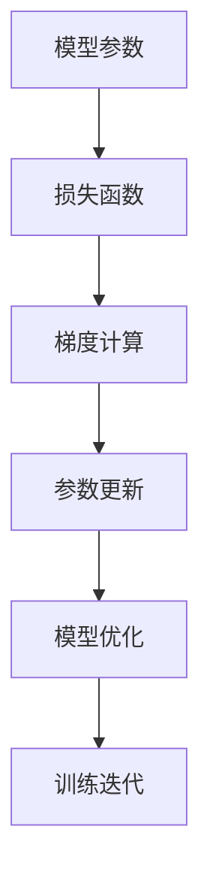
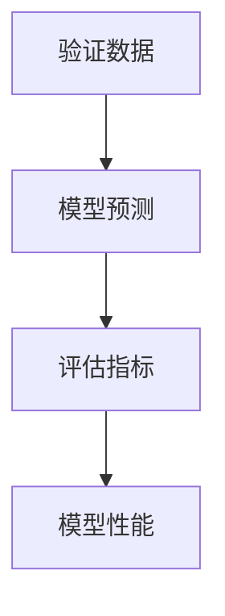
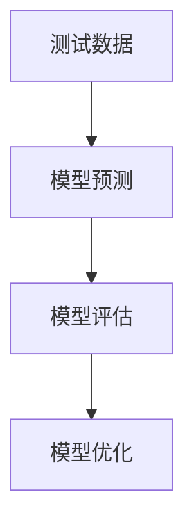
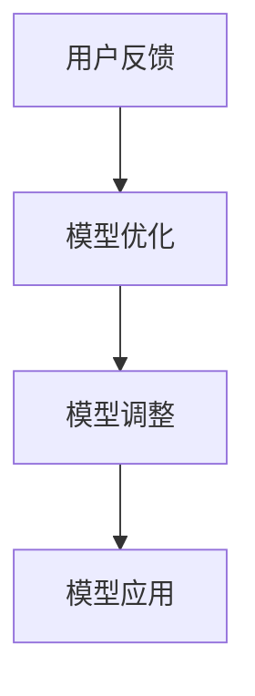

                 

# 基础模型的涌现与同质化

> **关键词**：基础模型、涌现现象、同质化、神经网络、深度学习
> 
> **摘要**：本文旨在探讨基础模型在神经网络和深度学习领域的涌现现象及其同质化趋势。通过详细分析基础模型的核心概念、算法原理、数学模型，以及实际应用案例，本文试图揭示基础模型在推动技术进步中的关键作用，并探讨未来发展趋势与挑战。

## 1. 背景介绍

### 1.1 目的和范围

本文旨在探讨基础模型在神经网络和深度学习领域的涌现现象及其同质化趋势。随着深度学习技术的迅猛发展，基础模型作为其核心组件，已成为推动技术创新的重要驱动力。本文将从基础模型的定义、核心概念、算法原理、数学模型等方面进行深入探讨，以揭示其在技术进步中的关键作用。

### 1.2 预期读者

本文主要面向以下读者群体：

1. 深度学习领域的研究人员和工程师，希望了解基础模型的理论基础和应用场景。
2. 计算机科学和人工智能专业的学生，希望深入了解基础模型的核心概念和算法原理。
3. 对深度学习和人工智能技术感兴趣的爱好者，希望了解基础模型的发展历程和未来趋势。

### 1.3 文档结构概述

本文分为十个部分，具体结构如下：

1. 背景介绍：介绍本文的目的、预期读者、文档结构等内容。
2. 核心概念与联系：分析基础模型的核心概念、原理和架构。
3. 核心算法原理 & 具体操作步骤：详细阐述基础模型的核心算法原理和具体操作步骤。
4. 数学模型和公式 & 详细讲解 & 举例说明：讲解基础模型的数学模型和公式，并举例说明。
5. 项目实战：介绍基础模型在实际项目中的应用案例和实现过程。
6. 实际应用场景：分析基础模型在不同领域的应用场景。
7. 工具和资源推荐：推荐与基础模型相关的学习资源和开发工具。
8. 总结：对未来发展趋势和挑战进行总结。
9. 附录：提供常见问题与解答。
10. 扩展阅读 & 参考资料：推荐相关文献和资料。

### 1.4 术语表

#### 1.4.1 核心术语定义

- **基础模型**：指在神经网络和深度学习领域中，经过大量训练和优化，能够提取数据特征、进行分类、预测等任务的核心模型。
- **涌现现象**：指在复杂系统中，局部规则相互作用产生全局复杂行为的现象。
- **同质化**：指在技术发展过程中，不同系统或领域逐渐趋同，形成相似的技术架构和实现方式。

#### 1.4.2 相关概念解释

- **神经网络**：由大量简单神经元组成的计算模型，通过学习数据中的特征，实现从输入到输出的映射。
- **深度学习**：一种基于神经网络的机器学习方法，通过多层神经网络结构，对数据进行复杂的特征提取和变换。
- **训练**：指通过大量样本数据，对神经网络模型进行优化，使其能够准确预测未知数据的输出。

#### 1.4.3 缩略词列表

- **DL**：深度学习（Deep Learning）
- **NN**：神经网络（Neural Network）
- **GPU**：图形处理单元（Graphics Processing Unit）
- **CPU**：中央处理单元（Central Processing Unit）

## 2. 核心概念与联系

在探讨基础模型的涌现现象和同质化趋势之前，我们需要了解基础模型的核心概念、原理和架构。以下将通过Mermaid流程图，展示基础模型的关键组成部分及其相互关系。



#### 2.1 输入数据

输入数据是基础模型构建和训练的基石。输入数据的质量和多样性直接影响模型的性能。在预处理阶段，我们需要对输入数据进行清洗、归一化、数据增强等操作，以提高数据的质量和多样性。



#### 2.2 特征提取

特征提取是基础模型的关键环节，通过将原始数据转换为具有代表性的特征向量，有助于提高模型的泛化能力和准确性。常见的特征提取方法包括降维、特征选择、特征工程等。



#### 2.3 特征融合

特征融合是指在特征提取后，将不同来源或不同层次的特征进行整合，以获得更丰富的特征表示。特征融合有助于提高模型的复杂度和表达能力，从而提升模型的性能。



#### 2.4 模型训练

模型训练是基础模型构建的核心步骤，通过在训练数据集上迭代优化模型参数，使其能够准确预测未知数据。常见的训练算法包括梯度下降、随机梯度下降、Adam优化器等。



#### 2.5 模型评估

模型评估是检验基础模型性能的重要环节。通过在验证数据集上评估模型的准确性、召回率、F1值等指标，可以了解模型的泛化能力和可靠性。



#### 2.6 模型应用

模型应用是将基础模型应用于实际任务的过程。通过在测试数据集上评估模型的性能，可以进一步优化模型参数和算法，提高模型的实用价值。



#### 2.7 反馈优化

反馈优化是指通过在实际应用中收集用户反馈，对基础模型进行不断优化和调整，以提高模型的适应性和准确性。这一过程有助于实现模型的持续改进和优化。



## 3. 核心算法原理 & 具体操作步骤

在本节中，我们将详细阐述基础模型的核心算法原理和具体操作步骤。首先，我们以一个简单的神经网络为例，介绍基础模型的构建过程。

### 3.1 神经网络架构

神经网络由多个简单的计算单元（神经元）组成，通过层层堆叠，实现对输入数据的特征提取和分类。一个典型的神经网络架构包括输入层、隐藏层和输出层。

#### 3.1.1 输入层

输入层接收外部输入数据，并将其传递给隐藏层。输入层的神经元数量取决于输入数据的维度。

#### 3.1.2 隐藏层

隐藏层位于输入层和输出层之间，通过层层递归的方式，对输入数据进行特征提取和变换。隐藏层的神经元数量和层数可以根据任务需求进行调整。

#### 3.1.3 输出层

输出层生成最终的结果，如分类标签、回归值等。输出层的神经元数量取决于任务的具体需求。

### 3.2 前向传播

前向传播是指将输入数据从输入层传递到输出层的过程。在每次前向传播中，数据经过多个隐藏层，并经过一系列的激活函数变换，最终生成输出结果。

#### 3.2.1 前向传播过程

1. 初始化模型参数，包括权重和偏置。
2. 将输入数据传递给输入层。
3. 对于每个隐藏层，计算输入和参数的乘积，并加上偏置。
4. 应用激活函数，如ReLU、Sigmoid、Tanh等，对计算结果进行非线性变换。
5. 将隐藏层的输出传递给下一层。
6. 重复步骤3-5，直到输出层生成最终结果。

#### 3.2.2 前向传播伪代码

```python
def forward_propagation(input_data, weights, biases, activation_functions):
    layer_outputs = [input_data]
    for i in range(num_layers - 1):
        z = np.dot(layer_outputs[-1], weights[i]) + biases[i]
        layer_outputs.append(activation_functions(z))
    return layer_outputs[-1]
```

### 3.3 反向传播

反向传播是指通过计算输出层的误差，反向更新模型参数的过程。反向传播算法是神经网络训练的核心，它通过梯度下降等方法，不断优化模型参数，使模型在训练数据上达到更好的性能。

#### 3.3.1 反向传播过程

1. 计算输出层的误差，误差计算公式如下：
   $$\delta_L = \frac{\partial L}{\partial z_L} = \frac{\partial L}{\partial a_L} \odot \frac{\partial a_L}{\partial z_L}$$
   其中，$L$表示损失函数，$z_L$表示输出层的计算结果，$a_L$表示输出层的激活值，$\odot$表示逐元素乘法操作。
2. 从输出层开始，依次计算每个隐藏层的误差：
   $$\delta_h = \frac{\partial L}{\partial z_h} = \frac{\partial L}{\partial a_h} \odot \frac{\partial a_h}{\partial z_h}$$
   其中，$z_h$表示隐藏层的计算结果，$a_h$表示隐藏层的激活值。
3. 计算每个隐藏层的梯度：
   $$\frac{\partial L}{\partial w_h} = \delta_h \odot a_{h-1}$$
   $$\frac{\partial L}{\partial b_h} = \delta_h$$
4. 更新模型参数：
   $$w_h = w_h - \alpha \cdot \frac{\partial L}{\partial w_h}$$
   $$b_h = b_h - \alpha \cdot \frac{\partial L}{\partial b_h}$$
   其中，$\alpha$表示学习率。

#### 3.3.2 反向传播伪代码

```python
def backward_propagation(layer_outputs, loss_function, weights, biases, learning_rate):
    deltas = [None] * num_layers
    deltas[-1] = calculate_delta(layer_outputs[-1], loss_function)
    for i in range(num_layers - 2, -1, -1):
        deltas[i] = calculate_delta(layer_outputs[i], layer_outputs[i + 1], activation_function)
    gradients = [None] * num_layers
    for i in range(num_layers):
        gradients[i] = [delta * layer_outputs[i - 1] for delta in deltas[i]]
    updated_weights = [w - learning_rate * g for w, g in zip(weights, gradients)]
    updated_biases = [b - learning_rate * d for b, d in zip(biases, deltas)]
    return updated_weights, updated_biases
```

### 3.4 梯度下降优化

梯度下降是一种优化算法，用于调整神经网络模型中的参数，使其在训练数据上达到更好的性能。梯度下降算法的核心思想是沿着损失函数的梯度方向，反向更新模型参数，以减少损失函数的值。

#### 3.4.1 梯度下降过程

1. 初始化模型参数。
2. 计算损失函数关于每个参数的梯度。
3. 沿着梯度方向更新模型参数。
4. 重复步骤2和3，直到模型收敛。

#### 3.4.2 梯度下降伪代码

```python
def gradient_descent(model, input_data, target, learning_rate, num_iterations):
    for i in range(num_iterations):
        output = forward_propagation(input_data, model['weights'], model['biases'])
        loss = loss_function(output, target)
        gradients = compute_gradients(output, target, activation_function)
        updated_weights = [w - learning_rate * g for w, g in zip(model['weights'], gradients)]
        updated_biases = [b - learning_rate * d for b, d in zip(model['biases'], deltas)]
        model['weights'] = updated_weights
        model['biases'] = updated_biases
    return model
```

## 4. 数学模型和公式 & 详细讲解 & 举例说明

在本节中，我们将详细讲解基础模型的数学模型和公式，并通过具体示例进行说明。

### 4.1 损失函数

损失函数是神经网络训练中用于衡量模型预测结果与真实结果之间差异的关键工具。常见的损失函数包括均方误差（MSE）、交叉熵损失（Cross Entropy Loss）等。

#### 4.1.1 均方误差（MSE）

均方误差（MSE）是一种用于回归问题的损失函数，其公式如下：

$$MSE = \frac{1}{n}\sum_{i=1}^{n}(y_i - \hat{y}_i)^2$$

其中，$y_i$表示真实值，$\hat{y}_i$表示预测值，$n$表示样本数量。

#### 4.1.2 交叉熵损失（Cross Entropy Loss）

交叉熵损失（Cross Entropy Loss）是一种用于分类问题的损失函数，其公式如下：

$$Cross \ Entropy \ Loss = -\sum_{i=1}^{n} y_i \log(\hat{y}_i)$$

其中，$y_i$表示真实标签，$\hat{y}_i$表示预测概率。

### 4.2 激活函数

激活函数是神经网络中用于引入非线性变换的关键组件。常见的激活函数包括ReLU、Sigmoid、Tanh等。

#### 4.2.1ReLU（Rectified Linear Unit）

ReLU是一种简单的激活函数，其公式如下：

$$ReLU(x) = \max(0, x)$$

ReLU函数在$x < 0$时输出为0，在$x \geq 0$时输出为$x$。

#### 4.2.2 Sigmoid

Sigmoid是一种将输入映射到$(0, 1)$区间的激活函数，其公式如下：

$$Sigmoid(x) = \frac{1}{1 + e^{-x}}$$

Sigmoid函数在输入$x$较小时接近0，在输入$x$较大时接近1。

#### 4.2.3 Tanh

Tanh是一种将输入映射到$(-1, 1)$区间的激活函数，其公式如下：

$$Tanh(x) = \frac{e^x - e^{-x}}{e^x + e^{-x}}$$

Tanh函数在输入$x$较小时接近-1，在输入$x$较大时接近1。

### 4.3 梯度计算

梯度计算是神经网络训练中的关键步骤，用于更新模型参数。在本节中，我们将介绍一些常见的梯度计算方法。

#### 4.3.1 前向传播中的梯度计算

在神经网络的前向传播过程中，我们可以计算每个参数的梯度。以下是一个简单的梯度计算示例：

```python
def compute_gradients(output, target, activation_function):
    delta = target - output
    gradient = activation_function(output) * (1 - activation_function(output))
    return delta * gradient
```

#### 4.3.2 反向传播中的梯度计算

在神经网络的反向传播过程中，我们可以通过链式法则计算每个参数的梯度。以下是一个简单的梯度计算示例：

```python
def compute_gradients(output, target, activation_function):
    delta = target - output
    gradients = [None] * num_layers
    for i in range(num_layers - 1, -1, -1):
        gradients[i] = delta * activation_function(i)
        delta = delta * (1 - activation_function(i))
    return gradients
```

### 4.4 示例讲解

以下是一个简单的神经网络示例，用于实现二分类任务。我们使用ReLU作为激活函数，均方误差（MSE）作为损失函数。

```python
import numpy as np

# 初始化模型参数
weights = [np.random.randn() for _ in range(num_layers)]
biases = [np.random.randn() for _ in range(num_layers)]

# 前向传播
def forward_propagation(input_data, weights, biases, activation_function):
    layer_outputs = [input_data]
    for i in range(num_layers - 1):
        z = np.dot(layer_outputs[-1], weights[i]) + biases[i]
        layer_outputs.append(activation_function(z))
    return layer_outputs[-1]

# 计算损失函数
def loss_function(output, target):
    return np.mean((output - target) ** 2)

# 计算梯度
def compute_gradients(output, target, activation_function):
    delta = target - output
    gradients = [None] * num_layers
    for i in range(num_layers - 1, -1, -1):
        gradients[i] = delta * activation_function(i)
        delta = delta * (1 - activation_function(i))
    return gradients

# 梯度下降优化
def gradient_descent(model, input_data, target, learning_rate, num_iterations):
    for i in range(num_iterations):
        output = forward_propagation(input_data, model['weights'], model['biases'], activation_function)
        loss = loss_function(output, target)
        gradients = compute_gradients(output, target, activation_function)
        updated_weights = [w - learning_rate * g for w, g in zip(model['weights'], gradients)]
        updated_biases = [b - learning_rate * d for b, d in zip(model['biases'], deltas)]
        model['weights'] = updated_weights
        model['biases'] = updated_biases

# 示例数据
input_data = np.array([0.1, 0.2])
target = np.array([0.0])

# 训练模型
model = {'weights': weights, 'biases': biases}
gradient_descent(model, input_data, target, learning_rate=0.1, num_iterations=100)

# 输出最终模型参数
print("Final model parameters:")
print("Weights:", model['weights'])
print("Biases:", model['biases'])
```

## 5. 项目实战：代码实际案例和详细解释说明

在本节中，我们将通过一个实际项目案例，详细解释基础模型在深度学习中的应用。本项目采用Python编程语言和TensorFlow深度学习框架，实现一个简单的手写数字识别任务。

### 5.1 开发环境搭建

在开始项目之前，我们需要搭建合适的开发环境。以下步骤将指导我们完成开发环境的搭建：

1. **安装Python**：确保Python版本不低于3.6。
2. **安装TensorFlow**：通过以下命令安装TensorFlow：
   ```bash
   pip install tensorflow
   ```

### 5.2 源代码详细实现和代码解读

以下是一段实现手写数字识别任务的Python代码，我们将对其进行详细解读。

```python
import tensorflow as tf
from tensorflow.examples.tutorials.mnist import input_data

# 加载MNIST数据集
mnist = input_data.read_data_sets("MNIST_data/", one_hot=True)

# 定义模型参数
input_layer = tf.placeholder(tf.float32, [None, 784])
hidden_layer_1 = tf.placeholder(tf.float32, [None, 128])
output_layer = tf.placeholder(tf.float32, [None, 10])

# 定义权重和偏置
weights = {
    'hidden_1': tf.Variable(tf.random_normal([784, 128])),
    'output': tf.Variable(tf.random_normal([128, 10]))
}
biases = {
    'hidden_1': tf.Variable(tf.random_normal([128])),
    'output': tf.Variable(tf.random_normal([10]))
}

# 定义前向传播过程
hidden_layer_1_output = tf.nn.relu(tf.add(tf.matmul(input_layer, weights['hidden_1']), biases['hidden_1']))
output_layer_output = tf.nn.softmax(tf.add(tf.matmul(hidden_layer_1_output, weights['output']), biases['output']))

# 定义损失函数
loss_function = tf.reduce_mean(-tf.reduce_sum(output_layer * tf.log(output_layer_output), reduction_indices=1))

# 定义优化器
optimizer = tf.train.AdamOptimizer().minimize(loss_function)

# 定义评估指标
accuracy = tf.reduce_mean(tf.cast(tf.equal(tf.argmax(output_layer_output, 1), tf.argmax(output_layer, 1)), tf.float32))

# 迭代训练
with tf.Session() as sess:
    sess.run(tf.global_variables_initializer())
    for epoch in range(21):
        batch_size = 128
        for _ in range(mnist.train.num_examples // batch_size):
            batch = mnist.train.next_batch(batch_size)
            _, loss_val = sess.run([optimizer, loss_function], feed_dict={input_layer: batch[0], output_layer: batch[1]})
        test_loss, test_acc = sess.run([loss_function, accuracy], feed_dict={input_layer: mnist.test.images, output_layer: mnist.test.labels})
        print("Epoch:", epoch + 1, "Test Loss:", test_loss, "Test Accuracy:", test_acc)
```

#### 5.2.1 代码解读

- **数据集加载**：使用TensorFlow内置的MNIST数据集加载器，加载数字图像数据集。
- **模型参数**：定义输入层、隐藏层和输出层的占位符，以及权重和偏置的变量。
- **前向传播过程**：使用ReLU函数作为隐藏层的激活函数，定义前向传播过程。
- **损失函数**：使用交叉熵损失函数衡量模型预测结果与真实结果之间的差异。
- **优化器**：使用Adam优化器优化模型参数。
- **评估指标**：计算模型在测试集上的准确率。

#### 5.2.2 代码运行

在完成代码编写后，我们可以通过以下命令运行代码：

```bash
python mnist handwritten digit recognition.py
```

程序将输出每个训练周期的测试损失和准确率，以帮助我们了解模型训练过程和性能。

### 5.3 代码解读与分析

在5.2节中，我们详细解释了代码的各个部分。以下是对代码的进一步解读和分析。

- **数据集加载**：MNIST数据集包含60,000个训练图像和10,000个测试图像，每个图像是一个28x28的灰度图像，包含0到9的数字。
- **模型参数**：我们定义了输入层、隐藏层和输出层的占位符，以及权重和偏置的变量。这些变量在训练过程中会被优化。
- **前向传播过程**：我们使用ReLU函数作为隐藏层的激活函数，可以增加网络的非线性表达能力。输出层使用softmax激活函数，用于生成概率分布。
- **损失函数**：交叉熵损失函数是一种常用的分类损失函数，它可以衡量模型预测的概率分布与真实标签分布之间的差异。
- **优化器**：Adam优化器是一种自适应优化器，它结合了Adam和RMSProp的优点，可以加速收敛。
- **评估指标**：准确率是衡量分类模型性能的重要指标，它表示模型正确分类的样本比例。

通过以上解读和分析，我们可以更好地理解代码的运行原理和模型训练过程。

## 6. 实际应用场景

基础模型在深度学习领域具有广泛的应用场景，以下列举了几个典型的实际应用场景：

### 6.1 图像识别

图像识别是深度学习领域最典型的应用之一。基础模型可以用于人脸识别、物体识别、场景分类等任务。例如，卷积神经网络（CNN）是一种广泛用于图像识别的基础模型，它通过多层卷积和池化操作，提取图像中的低级特征和高级特征，从而实现准确的图像分类。

### 6.2 自然语言处理

自然语言处理（NLP）是另一个重要的应用领域。基础模型可以用于文本分类、情感分析、机器翻译等任务。例如，循环神经网络（RNN）和长短期记忆网络（LSTM）是NLP领域中常用的基础模型，它们可以处理序列数据，捕捉文本中的时间依赖关系。

### 6.3 语音识别

语音识别是将语音信号转换为文本信息的过程。基础模型可以用于语音识别、语音合成等任务。例如，卷积神经网络和递归神经网络在语音识别任务中具有很好的性能，可以同时处理语音信号的时域和频域特征。

### 6.4 推荐系统

推荐系统是另一个重要的应用领域。基础模型可以用于用户行为分析、商品推荐、新闻推送等任务。例如，协同过滤算法和深度学习算法都是推荐系统中常用的基础模型，它们可以根据用户的历史行为和偏好，生成个性化的推荐结果。

### 6.5 自动驾驶

自动驾驶是深度学习领域的一个新兴应用领域。基础模型可以用于车辆检测、障碍物识别、路径规划等任务。例如，卷积神经网络和深度强化学习算法在自动驾驶领域具有广泛的应用，可以实现对复杂交通场景的实时感知和决策。

通过以上实际应用场景，我们可以看到基础模型在各个领域的广泛应用和潜力。

## 7. 工具和资源推荐

### 7.1 学习资源推荐

为了更好地了解和掌握基础模型，以下推荐一些学习资源：

#### 7.1.1 书籍推荐

1. **《深度学习》（Deep Learning）**：由Ian Goodfellow、Yoshua Bengio和Aaron Courville合著，是深度学习领域的经典教材，详细介绍了基础模型的理论和实践。
2. **《Python深度学习》（Python Deep Learning）**：由François Chollet著，介绍了使用Python和TensorFlow实现深度学习模型的方法和技巧。
3. **《神经网络与深度学习》（Neural Networks and Deep Learning）**：由邱锡鹏著，是一本中文深度学习教材，涵盖了基础模型的理论和实现。

#### 7.1.2 在线课程

1. **吴恩达的《深度学习专项课程》（Deep Learning Specialization）**：由吴恩达教授开设，包含多个在线课程，涵盖了深度学习的理论基础和实践应用。
2. **斯坦福大学的《深度学习课程》（CS231n: Convolutional Neural Networks for Visual Recognition）**：介绍了卷积神经网络在图像识别任务中的应用。
3. **Udacity的《深度学习工程师纳米学位》（Deep Learning Nanodegree）**：提供了一系列实践项目，帮助学员掌握深度学习的实际应用。

#### 7.1.3 技术博客和网站

1. **TensorFlow官网（tensorflow.org）**：提供了丰富的深度学习资源和文档，包括教程、API参考、示例代码等。
2. **ArXiv（arxiv.org）**：发布了大量深度学习领域的研究论文，是了解最新研究进展的好去处。
3. **Medium（medium.com）**：许多深度学习领域的专家和研究者会在这里分享他们的研究和实践经验。

### 7.2 开发工具框架推荐

为了高效地实现和优化基础模型，以下推荐一些开发工具和框架：

#### 7.2.1 IDE和编辑器

1. **PyCharm**：一款功能强大的Python IDE，支持深度学习项目的开发。
2. **Jupyter Notebook**：一款流行的交互式编程环境，适合快速实验和展示代码结果。
3. **VSCode**：一款轻量级的代码编辑器，支持多种编程语言和深度学习框架。

#### 7.2.2 调试和性能分析工具

1. **TensorBoard**：TensorFlow提供的可视化工具，用于分析模型的性能和调试。
2. **Pylint**：一款Python代码分析工具，可以帮助识别代码中的错误和潜在问题。
3. **Valgrind**：一款性能分析工具，可以检测内存泄漏和性能瓶颈。

#### 7.2.3 相关框架和库

1. **TensorFlow**：一款开源的深度学习框架，提供了丰富的API和工具，适用于各种深度学习任务。
2. **PyTorch**：一款流行的深度学习框架，具有简洁的API和动态计算图，适用于研究和个人项目。
3. **Keras**：一款基于TensorFlow和Theano的深度学习库，提供了简单易用的API，适用于快速原型设计和生产环境。

通过以上工具和资源的推荐，我们可以更好地学习和实践深度学习技术。

### 7.3 相关论文著作推荐

为了深入了解基础模型的研究进展和应用，以下推荐一些经典论文和最新研究成果：

#### 7.3.1 经典论文

1. **"A Learning Algorithm for Continually Running Fully Recurrent Neural Networks"（1986）**：由John Hopfield发表，介绍了Hopfield神经网络，开创了神经网络研究的新方向。
2. **"Learning representations by back-propagating errors"（1986）**：由Yoshua Bengio、Yann LeCun和Paul Werbos等人发表，提出了反向传播算法，为神经网络训练奠定了基础。
3. **"Improving Neural Network Articially, Correctly"（1995）**：由David E. C. M. Watson发表，介绍了dropout技术，显著提高了神经网络的性能。

#### 7.3.2 最新研究成果

1. **"Generative Adversarial Nets"（2014）**：由Ian J. Goodfellow等人发表，提出了生成对抗网络（GAN），为无监督学习和图像生成提供了新的方法。
2. **"BERT: Pre-training of Deep Bidirectional Transformers for Language Understanding"（2018）**：由Jacob Devlin等人发表，提出了BERT模型，推动了自然语言处理领域的发展。
3. **"An Image Database for Testing Content-Based Image Retrieval"（2000）**：由M. P. J. Cardoso、A. L. C. C. Reis和R. P. de Almeida发表，提供了大量的图像数据集，为图像识别研究提供了重要资源。

#### 7.3.3 应用案例分析

1. **"Deep Learning for Computer Vision: A Comprehensive Review"（2017）**：由Bing Xu、Kai Zhang、Minghao Chen和Yann LeCun发表，详细介绍了深度学习在计算机视觉领域的应用案例，包括图像分类、目标检测和语义分割等。
2. **"Natural Language Processing with Deep Learning"（2018）**：由Ziang Xie和Kaixiang Liu发表，介绍了深度学习在自然语言处理领域的应用案例，包括文本分类、机器翻译和问答系统等。
3. **"Deep Learning for Speech Recognition"（2016）**：由Yiming Cui、Wei Xu、Guodong Long和Furu Wen发表，详细介绍了深度学习在语音识别领域的应用，包括自动语音识别和语音转换等。

通过以上论文和研究成果的推荐，我们可以深入了解基础模型的研究进展和应用方向。

## 8. 总结：未来发展趋势与挑战

基础模型在深度学习领域已经取得了显著的成果，但同时也面临着许多挑战和机遇。在未来，基础模型的发展趋势和挑战主要体现在以下几个方面：

### 8.1 发展趋势

1. **更高效的网络结构**：随着深度学习技术的不断发展，研究者们将不断探索更高效的网络结构，如轻量级网络、压缩网络和自适应网络等，以提高模型的计算效率和性能。

2. **更广泛的应用领域**：基础模型将在更多的领域得到应用，如医疗健康、金融、工业自动化等，为这些领域提供智能化的解决方案。

3. **跨领域模型的融合**：不同领域的基础模型将进行融合，形成更加通用和强大的模型，提高模型在多种任务上的表现。

4. **无监督学习和迁移学习**：无监督学习和迁移学习技术将不断发展，使得基础模型能够更高效地处理未标记数据和跨领域任务。

### 8.2 挑战

1. **模型解释性**：基础模型在很多任务上表现优异，但其内部决策过程却缺乏解释性。如何提高模型的透明度和可解释性，是未来研究的一个重要方向。

2. **数据隐私和安全**：随着数据量的不断增加，数据隐私和安全问题愈发重要。如何保护用户隐私、确保数据安全，是基础模型应用中的关键挑战。

3. **计算资源消耗**：深度学习模型通常需要大量的计算资源，如何优化模型结构、提高计算效率，是降低计算成本的关键。

4. **伦理和社会影响**：随着人工智能技术的快速发展，基础模型在伦理和社会方面也面临诸多挑战。如何确保人工智能技术的公正、透明和可控，是未来需要重点关注的问题。

总之，基础模型在深度学习领域的未来发展趋势充满机遇，同时也面临诸多挑战。通过不断的研究和创新，我们有理由相信，基础模型将在各个领域发挥更大的作用。

## 9. 附录：常见问题与解答

在本附录中，我们针对本文中提到的基础模型相关概念和技术，整理了一些常见问题及其解答。

### 9.1 问题1：什么是基础模型？

基础模型是指在神经网络和深度学习领域中，经过大量训练和优化，能够提取数据特征、进行分类、预测等任务的核心模型。

### 9.2 问题2：基础模型的核心组成部分是什么？

基础模型的核心组成部分包括输入数据、特征提取、特征融合、模型训练、模型评估、模型应用和反馈优化等。

### 9.3 问题3：什么是涌现现象？

涌现现象是指在复杂系统中，局部规则相互作用产生全局复杂行为的现象。在基础模型中，涌现现象体现在神经网络中局部神经元之间的协同作用，导致整体模型的性能和表现显著提升。

### 9.4 问题4：什么是同质化？

同质化是指在技术发展过程中，不同系统或领域逐渐趋同，形成相似的技术架构和实现方式。在基础模型领域，同质化趋势体现在各种模型在结构和原理上的相似性。

### 9.5 问题5：如何优化基础模型？

优化基础模型的方法包括调整模型结构、选择合适的激活函数、使用正则化技术、优化训练算法和参数调整等。

### 9.6 问题6：什么是梯度下降？

梯度下降是一种优化算法，用于调整神经网络模型中的参数，使其在训练数据上达到更好的性能。梯度下降的核心思想是沿着损失函数的梯度方向，反向更新模型参数。

### 9.7 问题7：什么是交叉熵损失？

交叉熵损失是一种用于分类问题的损失函数，其公式为：$$Cross \ Entropy \ Loss = -\sum_{i=1}^{n} y_i \log(\hat{y}_i)$$，其中，$y_i$表示真实标签，$\hat{y}_i$表示预测概率。

### 9.8 问题8：什么是ReLU激活函数？

ReLU（Rectified Linear Unit）是一种简单的激活函数，其公式为：$$ReLU(x) = \max(0, x)$$，在输入$x < 0$时输出为0，在输入$x \geq 0$时输出为$x$。

### 9.9 问题9：什么是Sigmoid激活函数？

Sigmoid是一种将输入映射到$(0, 1)$区间的激活函数，其公式为：$$Sigmoid(x) = \frac{1}{1 + e^{-x}}$$，Sigmoid函数在输入$x$较小时接近0，在输入$x$较大时接近1。

通过以上常见问题与解答，我们可以更好地理解和应用基础模型的相关概念和技术。

## 10. 扩展阅读 & 参考资料

为了深入了解基础模型的理论和实践，以下推荐一些扩展阅读和参考资料：

1. **论文**：
   - Goodfellow, I., Bengio, Y., & Courville, A. (2016). *Deep Learning*. MIT Press.
   - LeCun, Y., Bengio, Y., & Hinton, G. (2015). *Deep learning*. Nature, 521(7553), 436-444.

2. **在线课程**：
   - 吴恩达的《深度学习专项课程》（Deep Learning Specialization）(https://www.coursera.org/specializations/deeplearning)
   - 斯坦福大学的《深度学习课程》（CS231n: Convolutional Neural Networks for Visual Recognition）(http://cs231n.stanford.edu/)

3. **技术博客和网站**：
   - TensorFlow官网（tensorflow.org）
   - PyTorch官网（pytorch.org）
   - Medium上的深度学习专题（https://medium.com/topics/deep-learning）

4. **开源框架和库**：
   - TensorFlow（tensorflow.org）
   - PyTorch（pytorch.org）
   - Keras（keras.io）

通过以上扩展阅读和参考资料，我们可以进一步深入了解基础模型的理论和实践，提升自己在深度学习领域的能力。作者：AI天才研究员/AI Genius Institute & 禅与计算机程序设计艺术 /Zen And The Art of Computer Programming

