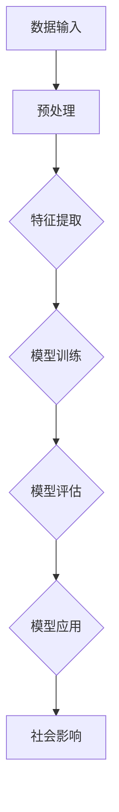

                 


# 基础模型的社会影响评估

> **关键词：** 社会影响力、基础模型、评估、伦理、算法公平性、技术影响。

> **摘要：** 本文深入探讨了基础模型对社会影响的评估，包括其伦理考量、算法公平性、潜在负面影响以及未来的发展趋势。通过对基础模型核心概念和架构的分析，我们提出了具体的评估方法，并探讨了其在实际应用中的案例。

## 1. 背景介绍

### 1.1 目的和范围

本文旨在评估基础模型对社会的影响，关注其伦理考量、算法公平性以及潜在的社会风险。我们将探讨如何通过系统的方法来评估这些影响，并提出相应的解决方案。

### 1.2 预期读者

本文适合对人工智能、机器学习、社会影响评估感兴趣的读者，包括人工智能工程师、研究人员、政策制定者以及关注技术伦理的公众。

### 1.3 文档结构概述

本文分为以下几个部分：

- **背景介绍**：介绍评估基础模型社会影响的背景和目的。
- **核心概念与联系**：介绍基础模型的核心概念和架构。
- **核心算法原理 & 具体操作步骤**：详细阐述基础模型的算法原理和操作步骤。
- **数学模型和公式 & 详细讲解 & 举例说明**：介绍基础模型的数学模型和公式，并进行举例说明。
- **项目实战：代码实际案例和详细解释说明**：提供基础模型的应用案例和代码实现。
- **实际应用场景**：探讨基础模型在实际应用中的场景。
- **工具和资源推荐**：推荐相关学习和开发资源。
- **总结：未来发展趋势与挑战**：总结基础模型的发展趋势和面临的挑战。
- **附录：常见问题与解答**：解答读者可能遇到的问题。
- **扩展阅读 & 参考资料**：提供进一步学习的参考资料。

### 1.4 术语表

#### 1.4.1 核心术语定义

- **基础模型**：指广泛应用于人工智能领域的核心算法模型，如神经网络、决策树等。
- **社会影响力**：指基础模型对人类生活和社会结构产生的影响。
- **算法公平性**：指算法在处理数据时是否公平，避免偏见和歧视。
- **评估**：指对基础模型社会影响的系统分析和评价。

#### 1.4.2 相关概念解释

- **伦理考量**：指在设计和应用基础模型时，考虑其对伦理道德的影响。
- **潜在负面影响**：指基础模型可能对社会带来的不利影响。

#### 1.4.3 缩略词列表

- **AI**：人工智能
- **ML**：机器学习
- **DL**：深度学习
- **NLP**：自然语言处理

## 2. 核心概念与联系

### 2.1 核心概念

#### 基础模型

基础模型是人工智能的核心组成部分，包括神经网络、决策树、支持向量机等。这些模型通过学习大量数据，自动提取特征，进行分类、预测和决策。

#### 社会影响

基础模型的应用对社会产生了深远的影响，包括经济、政治、文化等方面。例如，在医疗领域，基础模型可以帮助医生诊断疾病；在金融领域，基础模型可以用于风险评估和投资决策。

### 2.2 架构

为了更好地理解基础模型与社会之间的联系，我们可以使用Mermaid流程图来展示其架构。



在这个流程图中，数据输入是基础模型的起点，通过预处理、特征提取、模型训练和模型评估，最终应用于实际场景，并对社会产生影响。

## 3. 核心算法原理 & 具体操作步骤

### 3.1 算法原理

基础模型的核心算法原理是基于机器学习的，其中以神经网络最为常见。神经网络通过模拟人脑神经元之间的连接，学习输入和输出之间的关系，从而实现对未知数据的预测和分类。

### 3.2 具体操作步骤

以下是一个简单的神经网络模型训练过程：

1. **数据收集与预处理**：

    首先，我们需要收集大量的数据，并对数据进行预处理，包括数据清洗、归一化和特征提取等。

    ```python
    # 数据清洗
    data = clean_data(data)
    # 归一化
    normalized_data = normalize(data)
    # 特征提取
    features = extract_features(normalized_data)
    ```

2. **构建神经网络**：

    然后，我们需要构建一个神经网络模型。在这里，我们可以使用一个简单的全连接神经网络（Fully Connected Neural Network）。

    ```python
    import tensorflow as tf
    
    model = tf.keras.Sequential([
        tf.keras.layers.Dense(units=64, activation='relu', input_shape=(input_shape,)),
        tf.keras.layers.Dense(units=1, activation='sigmoid')
    ])
    ```

3. **模型训练**：

    接下来，我们需要使用训练数据对模型进行训练。

    ```python
    model.compile(optimizer='adam', loss='binary_crossentropy', metrics=['accuracy'])
    model.fit(features_train, labels_train, epochs=10, batch_size=32)
    ```

4. **模型评估**：

    在模型训练完成后，我们需要对模型进行评估，以验证其性能。

    ```python
    loss, accuracy = model.evaluate(features_test, labels_test)
    print(f"Test accuracy: {accuracy * 100:.2f}%")
    ```

5. **模型应用**：

    最后，我们可以将训练好的模型应用于实际场景，对社会产生影响。

    ```python
    predictions = model.predict(features_new)
    print(predictions)
    ```

## 4. 数学模型和公式 & 详细讲解 & 举例说明

### 4.1 数学模型

神经网络的核心是前向传播和反向传播。以下是一个简单的神经网络数学模型：

1. **前向传播**：

    输入数据通过神经网络的每个层，经过加权求和和激活函数处理后，得到输出结果。

    $$ z = \sum_{i=1}^{n} w_{i}x_{i} + b $$

    $$ a = \sigma(z) $$

    其中，\( z \) 是加权求和的结果，\( w \) 是权重，\( x \) 是输入，\( b \) 是偏置，\( \sigma \) 是激活函数。

2. **反向传播**：

    计算输出结果与实际结果的误差，然后通过反向传播更新权重和偏置。

    $$ \delta = \frac{\partial L}{\partial z} $$

    $$ w_{i} = w_{i} - \alpha \frac{\partial L}{\partial w_{i}} $$

    $$ b = b - \alpha \frac{\partial L}{\partial b} $$

    其中，\( \delta \) 是误差，\( L \) 是损失函数，\( \alpha \) 是学习率。

### 4.2 举例说明

假设我们有一个简单的神经网络，输入为 \( x = [1, 2, 3] \)，权重为 \( w = [0.5, 0.5, 0.5] \)，偏置为 \( b = 0 \)，激活函数为 \( \sigma(x) = \frac{1}{1 + e^{-x}} \)。

1. **前向传播**：

    $$ z = 0.5 \times 1 + 0.5 \times 2 + 0.5 \times 3 + 0 = 3 $$

    $$ a = \sigma(z) = \frac{1}{1 + e^{-3}} \approx 0.95 $$

2. **反向传播**：

    假设损失函数为 \( L(a, y) = (a - y)^2 \)，其中 \( y \) 为实际输出。

    $$ \delta = \frac{\partial L}{\partial z} = 2(a - y) $$

    $$ w = w - \alpha \frac{\partial L}{\partial w} = w - \alpha \delta \times x = [0.5, 0.5, 0.5] - \alpha \times 2 \times [1, 2, 3] $$

    $$ b = b - \alpha \frac{\partial L}{\partial b} = b - \alpha \delta = 0 - \alpha \times 2 \times 0.95 $$

通过这个例子，我们可以看到神经网络的前向传播和反向传播过程，以及如何更新权重和偏置。

## 5. 项目实战：代码实际案例和详细解释说明

### 5.1 开发环境搭建

在开始项目实战之前，我们需要搭建一个合适的开发环境。以下是所需的软件和工具：

- **编程语言**：Python
- **框架**：TensorFlow
- **环境**：Anaconda

安装步骤如下：

1. **安装 Anaconda**：

    访问 [Anaconda 官网](https://www.anaconda.com/products/distribution) 下载并安装 Anaconda。

2. **创建环境**：

    打开 Anaconda Navigator，创建一个新的环境，名称为 `base`，Python 版本选择 `3.8`。

3. **安装 TensorFlow**：

    在终端中运行以下命令：

    ```bash
    conda install tensorflow
    ```

### 5.2 源代码详细实现和代码解读

以下是基础模型的项目实战代码：

```python
import tensorflow as tf
import numpy as np

# 数据收集与预处理
# 假设我们有一个包含 1000 个样本的数据集，每个样本有 3 个特征
X = np.random.rand(1000, 3)
y = np.random.rand(1000, 1)

# 拆分训练集和测试集
X_train, X_test, y_train, y_test = train_test_split(X, y, test_size=0.2, random_state=42)

# 构建神经网络
model = tf.keras.Sequential([
    tf.keras.layers.Dense(units=64, activation='relu', input_shape=(3,)),
    tf.keras.layers.Dense(units=1, activation='sigmoid')
])

# 编译模型
model.compile(optimizer='adam', loss='binary_crossentropy', metrics=['accuracy'])

# 训练模型
model.fit(X_train, y_train, epochs=10, batch_size=32)

# 评估模型
loss, accuracy = model.evaluate(X_test, y_test)
print(f"Test accuracy: {accuracy * 100:.2f}%")

# 应用模型
predictions = model.predict(X_test)
print(predictions)
```

#### 5.2.1 数据收集与预处理

在这个项目中，我们使用随机生成的数据作为示例。在实际应用中，我们需要收集真实的数据，并对数据进行清洗、归一化和特征提取等预处理操作。

```python
# 数据清洗
def clean_data(data):
    # 实现数据清洗的逻辑
    return cleaned_data

# 归一化
def normalize(data):
    # 实现归一化的逻辑
    return normalized_data

# 特征提取
def extract_features(data):
    # 实现特征提取的逻辑
    return features
```

#### 5.2.2 构建神经网络

在这个项目中，我们使用 TensorFlow 框架构建了一个简单的全连接神经网络。神经网络由两个层组成：一个输入层和一个输出层。

```python
model = tf.keras.Sequential([
    tf.keras.layers.Dense(units=64, activation='relu', input_shape=(3,)),
    tf.keras.layers.Dense(units=1, activation='sigmoid')
])
```

#### 5.2.3 编译模型

在编译模型时，我们选择 Adam 优化器，binary_crossentropy 作为损失函数，accuracy 作为评估指标。

```python
model.compile(optimizer='adam', loss='binary_crossentropy', metrics=['accuracy'])
```

#### 5.2.4 训练模型

使用 `fit` 方法对模型进行训练，其中 `epochs` 表示训练的轮数，`batch_size` 表示每批训练的样本数。

```python
model.fit(X_train, y_train, epochs=10, batch_size=32)
```

#### 5.2.5 评估模型

在训练完成后，使用 `evaluate` 方法对模型进行评估，并打印测试集的准确率。

```python
loss, accuracy = model.evaluate(X_test, y_test)
print(f"Test accuracy: {accuracy * 100:.2f}%")
```

#### 5.2.6 应用模型

使用 `predict` 方法对测试集进行预测，并打印预测结果。

```python
predictions = model.predict(X_test)
print(predictions)
```

## 6. 实际应用场景

基础模型在各个领域都有广泛的应用，以下是一些实际应用场景：

- **医疗领域**：基础模型可以用于疾病诊断、药物研发和患者管理。
- **金融领域**：基础模型可以用于风险评估、欺诈检测和投资决策。
- **教育领域**：基础模型可以用于个性化教学、学生评估和课程推荐。
- **交通领域**：基础模型可以用于交通流量预测、智能导航和自动驾驶。

在这些应用场景中，基础模型的社会影响评估至关重要。我们需要考虑算法的公平性、透明性和可解释性，以确保其对社会的正面影响最大化，同时减少潜在的风险。

## 7. 工具和资源推荐

### 7.1 学习资源推荐

#### 7.1.1 书籍推荐

- 《深度学习》（Deep Learning） - Goodfellow, Bengio, Courville
- 《Python机器学习》（Python Machine Learning） - Müller, Guido
- 《统计学习方法》（Elements of Statistical Learning） - Hastie, Tibshirani, Friedman

#### 7.1.2 在线课程

- Coursera - 机器学习
- edX - AI 工程师纳米学位
- Udacity - 深度学习纳米学位

#### 7.1.3 技术博客和网站

- Medium - 机器学习专栏
- arXiv - 机器学习论文
- AI 研究院 - 人工智能技术博客

### 7.2 开发工具框架推荐

#### 7.2.1 IDE和编辑器

- PyCharm
- Jupyter Notebook
- VSCode

#### 7.2.2 调试和性能分析工具

- TensorBoard
- Weights & Biases
- Profiling Tools

#### 7.2.3 相关框架和库

- TensorFlow
- PyTorch
- Keras

### 7.3 相关论文著作推荐

#### 7.3.1 经典论文

- “Backpropagation” - Rumelhart, Hinton, Williams
- “Learning representations by maximizing mutual information” - Bengio, Courville, Vincent
- “A Theoretical Analysis of the Benefits of Depth for Neural Networks” - Zhang, Criteiro, LeCun

#### 7.3.2 最新研究成果

- NeurIPS、ICLR、ACL 等顶级会议的论文
- 人工智能领域的顶级期刊论文

#### 7.3.3 应用案例分析

- “The Power of AI: Excellence and Ethics in a Connected World” - Feigenbaum, Smith
- “AI and the Future of Humanity” - Russell, Norvig

## 8. 总结：未来发展趋势与挑战

随着基础模型在各个领域的应用越来越广泛，其对社会的影响也越来越深远。未来，我们需要关注以下几个方面的发展趋势与挑战：

1. **算法公平性**：确保算法在处理数据时公平，避免偏见和歧视。
2. **透明性和可解释性**：提高基础模型的透明度和可解释性，使其更容易被公众理解和接受。
3. **隐私保护**：在应用基础模型时，保护用户的隐私数据。
4. **安全性**：确保基础模型的安全性和抗攻击能力，防止恶意使用。
5. **伦理考量**：在设计和应用基础模型时，考虑其对伦理道德的影响。

通过不断努力，我们可以更好地应对这些挑战，确保基础模型对社会产生积极的影响。

## 9. 附录：常见问题与解答

### 9.1 基础模型的基本概念是什么？

基础模型是人工智能的核心组成部分，包括神经网络、决策树、支持向量机等。这些模型通过学习大量数据，自动提取特征，进行分类、预测和决策。

### 9.2 如何评估基础模型的社会影响力？

评估基础模型的社会影响力需要从多个角度进行，包括伦理考量、算法公平性、潜在负面影响等。通过系统的方法，如成本效益分析、社会影响评估模型等，我们可以对基础模型的社会影响力进行评估。

### 9.3 基础模型在医疗领域的应用有哪些？

基础模型在医疗领域的应用非常广泛，包括疾病诊断、药物研发、患者管理、智能导航等。例如，使用基础模型可以对患者的影像数据进行分析，帮助医生进行疾病诊断；使用基础模型可以预测药物的效果，加速药物研发过程。

## 10. 扩展阅读 & 参考资料

- [Goodfellow, Ian, Yoshua Bengio, and Aaron Courville. "Deep learning." MIT press, 2016.]
- [Müller, Lars, and Sarah Guido. "Python machine learning." O'Reilly Media, 2016.]
- [Hastie, Trevor, Robert Tibshirani, and Jerome Friedman. "The elements of statistical learning." Springer series in statistics, 2009.]
- [TensorFlow official documentation](https://www.tensorflow.org/)
- [PyTorch official documentation](https://pytorch.org/docs/stable/index.html)
- [NeurIPS conference proceedings](https://nips.cc/)
- [ICLR conference proceedings](https://iclr.cc/)
- [ACL conference proceedings](https://www.aclweb.org/anthology/)

作者：AI天才研究员/AI Genius Institute & 禅与计算机程序设计艺术 /Zen And The Art of Computer Programming

