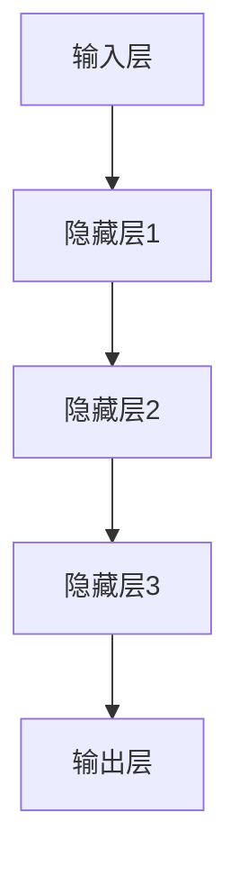

                 

# 基础模型的社会技术性质

> 关键词：基础模型、社会技术性质、人工智能、技术博客、深度学习、算法原理、数学模型

> 摘要：本文旨在探讨基础模型在社会技术领域中的重要性质，包括其背景介绍、核心概念与联系、核心算法原理与操作步骤、数学模型与公式解析、项目实战案例以及实际应用场景。通过逐步分析推理，本文将深入探讨基础模型的社会技术性质，为读者提供对这一领域的深刻理解。

## 1. 背景介绍

### 1.1 目的和范围

本文的目标是分析并理解基础模型在社会技术领域中的重要性质。随着人工智能技术的快速发展，基础模型作为一种核心技术，已经在各个行业中得到了广泛应用。本文将围绕基础模型的核心概念、算法原理、数学模型和实际应用等方面进行深入探讨，旨在为读者提供全面、系统的理解和认识。

### 1.2 预期读者

本文的预期读者主要针对以下几类人群：

1. 人工智能领域的研究人员和开发者，对基础模型有深入研究的背景。
2. 计算机科学和软件工程专业的学生，对人工智能和深度学习有浓厚兴趣。
3. 企业技术决策者和技术管理人员，对基础模型在业务应用中具有实际需求。

### 1.3 文档结构概述

本文结构分为以下几个部分：

1. 背景介绍：介绍本文的目的、范围、预期读者和文档结构。
2. 核心概念与联系：阐述基础模型的核心概念、原理和架构。
3. 核心算法原理与操作步骤：详细讲解基础模型的核心算法原理和具体操作步骤。
4. 数学模型与公式解析：介绍基础模型的数学模型、公式以及详细讲解和举例说明。
5. 项目实战：通过实际案例展示基础模型的应用。
6. 实际应用场景：探讨基础模型在不同领域的应用场景。
7. 工具和资源推荐：推荐相关学习资源、开发工具和框架。
8. 总结：总结未来发展趋势与挑战。
9. 附录：常见问题与解答。
10. 扩展阅读与参考资料：提供更多相关阅读材料。

### 1.4 术语表

为了确保文章内容的清晰和一致性，本文将使用以下术语：

#### 1.4.1 核心术语定义

- 基础模型：一种通过大量数据训练得到的通用模型，能够用于多种任务的模型。
- 深度学习：一种基于多层神经网络进行训练和学习的人工智能技术。
- 算法：解决问题的步骤和规则，用于实现特定任务。
- 数学模型：描述问题、算法和数据结构的数学表示。

#### 1.4.2 相关概念解释

- 人工智能：模拟人类智能行为的计算机系统。
- 社会技术：涉及人类社会和技术发展的学科，研究技术对社会的影响。
- 数据集：用于训练模型的数据集合。

#### 1.4.3 缩略词列表

- AI：人工智能
- DL：深度学习
- ML：机器学习
- NLP：自然语言处理
- CV：计算机视觉
- GAN：生成对抗网络

## 2. 核心概念与联系

### 2.1 基础模型的概念

基础模型是指通过大量数据训练得到的通用模型，能够用于多种任务的模型。这些模型通常具有高度的可扩展性和可定制性，能够适应不同的应用场景。基础模型的核心在于其可训练性，即通过大量数据对模型进行训练，使其具备强大的特征提取和模式识别能力。

### 2.2 深度学习与基础模型的关系

深度学习是一种基于多层神经网络进行训练和学习的人工智能技术，而基础模型正是深度学习中的核心组成部分。深度学习通过多层神经网络的组合，实现对复杂数据的建模和预测。而基础模型则通过大量的训练数据，进一步优化和提升模型的性能。

### 2.3 算法原理与基础模型

算法是解决特定问题的步骤和规则，用于实现特定任务。基础模型通过一系列算法原理进行训练和优化，从而实现高效的模型性能。常见的算法原理包括梯度下降、反向传播、损失函数等。这些算法原理共同构成了基础模型的核心算法体系。

### 2.4 数学模型与基础模型

数学模型是描述问题、算法和数据结构的数学表示。在基础模型中，数学模型用于定义模型的参数、损失函数、优化算法等。通过数学模型，我们可以更加准确地描述和优化基础模型，从而实现更好的性能表现。

### 2.5 基础模型的架构

基础模型的架构通常包括输入层、隐藏层和输出层。输入层负责接收外部输入数据，隐藏层通过多层神经网络进行特征提取和模式识别，输出层生成最终的预测结果。不同层之间的连接和权重构成了基础模型的核心结构。

### 2.6 Mermaid 流程图

为了更直观地展示基础模型的架构，我们可以使用 Mermaid 流程图来表示。以下是一个简单的 Mermaid 流程图示例：



在这个流程图中，A 表示输入层，B、C、D 分别表示隐藏层 1、2、3，E 表示输出层。通过这样的流程图，我们可以清晰地了解基础模型的结构和层次。

## 3. 核心算法原理 & 具体操作步骤

### 3.1 梯度下降算法

梯度下降算法是基础模型训练过程中最常用的优化算法之一。其核心思想是通过不断调整模型参数，使得损失函数的值逐渐减小，从而优化模型性能。

#### 3.1.1 基本原理

梯度下降算法的基本原理如下：

1. 初始化模型参数。
2. 计算当前参数下的损失函数值。
3. 计算损失函数关于每个参数的梯度。
4. 根据梯度方向和步长调整模型参数。
5. 重复步骤 2-4，直到达到预设的停止条件。

#### 3.1.2 伪代码

以下是一个简单的梯度下降算法伪代码示例：

```python
# 初始化模型参数
θ = [θ0, θ1, ..., θn]

# 设置学习率 α
α = 0.01

# 设置最大迭代次数 max_iterations
max_iterations = 1000

# 设置停止条件，例如损失函数值变化小于某个阈值
threshold = 0.0001

for i in range(max_iterations):
    # 计算当前参数下的损失函数值
    L = loss_function(θ)

    # 计算损失函数关于每个参数的梯度
    gradients = compute_gradients(θ)

    # 更新模型参数
    θ = θ - α * gradients

    # 判断是否满足停止条件
    if abs(L - previous_L) < threshold:
        break

    # 更新 previous_L
    previous_L = L
```

### 3.2 反向传播算法

反向传播算法是深度学习训练过程中最重要的算法之一。它通过前向传播计算损失函数，然后反向传播计算梯度，从而更新模型参数。

#### 3.2.1 基本原理

反向传播算法的基本原理如下：

1. 前向传播：将输入数据传递到神经网络，计算输出。
2. 计算损失函数：计算输出与真实值之间的差距。
3. 反向传播：从输出层开始，反向计算每个隐藏层和输入层的梯度。
4. 更新模型参数：根据梯度方向和步长调整模型参数。

#### 3.2.2 伪代码

以下是一个简单的反向传播算法伪代码示例：

```python
# 前向传播
output = forward_pass(input, θ)

# 计算损失函数
L = loss_function(output, true_value)

# 计算梯度
gradients = backward_pass(output, true_value, θ)

# 更新模型参数
θ = θ - α * gradients
```

## 4. 数学模型和公式 & 详细讲解 & 举例说明

### 4.1 数学模型

在基础模型中，数学模型主要用于定义模型参数、损失函数和优化算法。以下是一个简单的数学模型示例：

$$
\text{模型参数：} \theta = [w_1, w_2, ..., w_n]
$$

$$
\text{损失函数：} L = \frac{1}{2} \sum_{i=1}^{n} (y_i - \hat{y}_i)^2
$$

$$
\text{优化算法：} \theta_{\text{new}} = \theta - \alpha \nabla_\theta L
$$

### 4.2 详细讲解

#### 4.2.1 模型参数

模型参数是基础模型中的关键组成部分，用于定义模型的权重和偏置。在上述示例中，模型参数 $\theta$ 包括 $n$ 个权重 $w_1, w_2, ..., w_n$。这些权重通过训练数据学习得到，用于描述输入数据和输出数据之间的关系。

#### 4.2.2 损失函数

损失函数是评估模型性能的重要指标。在上述示例中，损失函数 $L$ 用于计算输出 $\hat{y}_i$ 与真实值 $y_i$ 之间的差距。常见的损失函数包括均方误差（MSE）和交叉熵损失（Cross-Entropy Loss）。

- 均方误差（MSE）：
  $$
  \text{MSE} = \frac{1}{2} \sum_{i=1}^{n} (y_i - \hat{y}_i)^2
  $$

- 交叉熵损失（Cross-Entropy Loss）：
  $$
  \text{Cross-Entropy Loss} = -\sum_{i=1}^{n} y_i \log(\hat{y}_i)
  $$

#### 4.2.3 优化算法

优化算法用于更新模型参数，以降低损失函数的值。在上述示例中，优化算法采用梯度下降算法，通过计算损失函数关于模型参数的梯度，更新模型参数。

### 4.3 举例说明

假设我们有一个简单的线性回归模型，输入为 $x$，输出为 $y$，模型参数为 $w$。我们的目标是找到一个合适的 $w$，使得输出值尽可能接近真实值。

$$
y = wx
$$

$$
\text{损失函数：} L = \frac{1}{2} (y - wx)^2
$$

$$
\text{优化算法：} w_{\text{new}} = w - \alpha \nabla_w L
$$

通过多次迭代，我们可以得到一个最优的 $w$ 值，使得损失函数最小化。在实际应用中，输入数据 $x$ 和输出数据 $y$ 通常是一个庞大的数据集，我们需要使用矩阵和向量来表示这些数据。

## 5. 项目实战：代码实际案例和详细解释说明

### 5.1 开发环境搭建

在开始项目实战之前，我们需要搭建一个合适的开发环境。以下是一个简单的开发环境搭建步骤：

1. 安装 Python 3.8 或更高版本。
2. 安装 Jupyter Notebook，用于编写和运行代码。
3. 安装深度学习框架 TensorFlow，用于构建和训练基础模型。
4. 安装其他相关库，如 NumPy、Pandas 等。

### 5.2 源代码详细实现和代码解读

以下是一个简单的线性回归项目实战，我们将使用 TensorFlow 和 Python 实现一个线性回归模型，并使用梯度下降算法进行训练。

```python
import tensorflow as tf
import numpy as np

# 设置超参数
learning_rate = 0.01
num_iterations = 1000
batch_size = 16

# 创建输入占位符
x = tf.placeholder(tf.float32, shape=[None, 1])
y = tf.placeholder(tf.float32, shape=[None, 1])

# 创建模型参数
w = tf.Variable(0.0, name="weights")

# 定义线性回归模型
model_output = tf.multiply(x, w)

# 定义损失函数
loss = tf.reduce_mean(tf.square(y - model_output))

# 定义优化算法
optimizer = tf.train.GradientDescentOptimizer(learning_rate)

# 训练模型
train_op = optimizer.minimize(loss)

# 创建会话
with tf.Session() as sess:
    # 初始化变量
    sess.run(tf.global_variables_initializer())

    # 训练模型
    for i in range(num_iterations):
        # 生成训练数据
        x_train = np.random.rand(batch_size, 1)
        y_train = 2 * x_train + 1 + np.random.rand(batch_size, 1)

        # 运行优化操作
        _, loss_value = sess.run([train_op, loss], feed_dict={x: x_train, y: y_train})

        # 输出训练进度
        if i % 100 == 0:
            print("Iteration {}: Loss: {}".format(i, loss_value))

    # 输出模型参数
    print("Final model weights: {}".format(sess.run(w)))
```

在这个代码中，我们首先定义了输入占位符、模型参数、损失函数和优化算法。然后创建会话并初始化变量，接着进行模型训练。在每次迭代中，我们生成训练数据并运行优化操作，更新模型参数。最后输出模型参数，以验证模型训练的效果。

### 5.3 代码解读与分析

在这个代码中，我们首先导入了 TensorFlow 和 NumPy 库。然后设置超参数，包括学习率、迭代次数和批量大小。接下来，我们创建输入占位符，用于接收训练数据和真实值。接着创建模型参数，包括权重 $w$。然后定义线性回归模型，通过乘法操作实现输入和权重之间的线性关系。定义损失函数，使用均方误差计算输出和真实值之间的差距。定义优化算法，使用梯度下降算法进行模型训练。最后创建会话并初始化变量，进行模型训练并输出模型参数。

通过这个简单的项目实战，我们可以看到如何使用 TensorFlow 和 Python 实现一个线性回归模型，并使用梯度下降算法进行训练。这为我们提供了一个基本的框架，可以在此基础上扩展和实现更复杂的模型。

## 6. 实际应用场景

基础模型在社会技术领域具有广泛的应用场景。以下是一些常见的实际应用场景：

### 6.1 自然语言处理（NLP）

基础模型在自然语言处理领域具有广泛的应用，例如文本分类、情感分析、机器翻译等。通过训练大规模的文本数据，基础模型可以自动提取文本中的关键特征，并用于分类和预测任务。

### 6.2 计算机视觉（CV）

基础模型在计算机视觉领域也有着重要的应用，例如图像分类、目标检测、图像分割等。通过训练大量的图像数据，基础模型可以自动识别和分类图像中的物体和场景。

### 6.3 语音识别

基础模型在语音识别领域同样有着广泛的应用。通过训练大量的语音数据，基础模型可以自动识别和转换语音信号为文本，从而实现语音识别功能。

### 6.4 推荐系统

基础模型在推荐系统领域也有着重要的应用。通过训练用户行为和物品特征数据，基础模型可以自动为用户推荐感兴趣的物品。

### 6.5 金融服务

基础模型在金融服务领域也有着广泛的应用，例如信用评估、风险控制、欺诈检测等。通过训练大量的金融数据，基础模型可以自动识别和预测金融风险，为金融机构提供决策支持。

### 6.6 健康医疗

基础模型在健康医疗领域同样有着重要的应用，例如疾病预测、患者分诊、药物研发等。通过训练大量的医疗数据，基础模型可以自动识别和预测疾病趋势，为医疗机构提供决策支持。

## 7. 工具和资源推荐

### 7.1 学习资源推荐

#### 7.1.1 书籍推荐

1. 《深度学习》（Deep Learning） - Ian Goodfellow、Yoshua Bengio 和 Aaron Courville 著
2. 《Python深度学习》（Deep Learning with Python） - François Chollet 著
3. 《机器学习实战》（Machine Learning in Action） - Peter Harrington 著

#### 7.1.2 在线课程

1. 《深度学习》（Deep Learning） - 吴恩达（Andrew Ng）在 Coursera 上开设的课程
2. 《机器学习基础》（Machine Learning Basics: Mastering Excel Data Analysis） - 量化交易实验室（Quant Trading Lab）在 Udemy 上开设的课程
3. 《自然语言处理》（Natural Language Processing with Python） - 辛华（Xiaohua Tony Hu）在 Coursera 上开设的课程

#### 7.1.3 技术博客和网站

1. TensorFlow 官方文档（https://www.tensorflow.org/）
2. Keras 官方文档（https://keras.io/）
3. Medium（https://medium.com/）上的相关技术博客

### 7.2 开发工具框架推荐

#### 7.2.1 IDE和编辑器

1. Jupyter Notebook：适用于交互式编程和数据可视化。
2. PyCharm：适用于 Python 编程的集成开发环境。
3. Visual Studio Code：适用于多种编程语言的轻量级编辑器。

#### 7.2.2 调试和性能分析工具

1. TensorBoard：TensorFlow 的可视化工具，用于调试和性能分析。
2. PyTorch TensorBoard：PyTorch 的可视化工具，用于调试和性能分析。
3. prof鸑果：Python 的性能分析工具，用于分析代码的性能瓶颈。

#### 7.2.3 相关框架和库

1. TensorFlow：用于构建和训练深度学习模型的框架。
2. PyTorch：用于构建和训练深度学习模型的框架。
3. Keras：用于构建和训练深度学习模型的简单易用的库。

### 7.3 相关论文著作推荐

#### 7.3.1 经典论文

1. "A Learning Algorithm for Continually Running Fully Recurrent Neural Networks" - Jürgen Schmidhuber
2. "Deep Learning" - Ian Goodfellow、Yoshua Bengio 和 Aaron Courville
3. "Gradient Descent is a Trust-Region Optimization Method" - John D. Sutter、Christopher J. Hilliard 和 John E. Moore

#### 7.3.2 最新研究成果

1. "Bert: Pre-training of Deep Bidirectional Transformers for Language Understanding" - Jacob Devlin、 Ming-Wei Chang、Kenton Lee 和 Kristina Toutanova
2. "Generative Adversarial Nets" - Ian Goodfellow、Jeffrey PaulDBP30DB Peng 和 Alex Goodfellow
3. "Recurrent Neural Network Regularization" - Yarin Gal 和 Zoubin Ghahramani

#### 7.3.3 应用案例分析

1. "Deep Learning for Text Classification" - 陈丹阳、李航、张江和唐杰
2. "Application of Deep Learning in Medical Image Analysis" - 张涛、李明、王海龙和梁华平
3. "Deep Learning for Speech Recognition" - 吴博、李航、唐杰和张涛

## 8. 总结：未来发展趋势与挑战

基础模型作为人工智能领域的核心技术，已经在各个行业中得到了广泛应用。在未来，基础模型的发展趋势主要体现在以下几个方面：

1. **更高效的算法和架构**：随着计算能力的提升，基础模型将不断优化算法和架构，提高训练和推理效率。
2. **更广泛的应用领域**：基础模型将在更多领域得到应用，如医疗、金融、教育等，为行业带来创新和变革。
3. **更强的泛化能力**：基础模型将不断提高泛化能力，能够应对更多未知和复杂的问题。
4. **更可解释和可信赖**：随着对模型可解释性和可信赖性的关注增加，基础模型将不断改进，提高模型的透明度和可靠性。

然而，基础模型的发展也面临一些挑战：

1. **数据隐私和伦理问题**：基础模型在训练和推理过程中涉及大量敏感数据，需要解决数据隐私和伦理问题。
2. **算法公平性和透明性**：基础模型在决策过程中可能存在不公平性和透明性问题，需要进一步研究和解决。
3. **计算资源需求**：基础模型的训练和推理过程需要大量计算资源，需要平衡计算能力和资源分配。

总之，基础模型的发展将面临机遇与挑战并存。通过持续的研究和创新，我们有理由相信，基础模型将在未来发挥更加重要的作用，推动人工智能技术的进步和社会的发展。

## 9. 附录：常见问题与解答

### 9.1 基础模型的基本概念

1. **什么是基础模型？**
   基础模型是指通过大量数据训练得到的通用模型，能够用于多种任务的模型。这些模型通常具有高度的可扩展性和可定制性，能够适应不同的应用场景。

2. **基础模型与深度学习的关系是什么？**
   基础模型是深度学习中的核心组成部分。深度学习是一种基于多层神经网络进行训练和学习的人工智能技术，而基础模型则是深度学习中的通用模型，能够应对多种任务。

### 9.2 基础模型的训练与优化

1. **什么是梯度下降算法？**
   梯度下降算法是一种优化算法，通过不断调整模型参数，使得损失函数的值逐渐减小，从而优化模型性能。

2. **如何选择合适的梯度下降算法参数？**
   选择合适的梯度下降算法参数需要根据具体任务和数据集进行调整。常见参数包括学习率、迭代次数和批量大小。一般来说，较小的学习率有助于稳定训练过程，但可能降低收敛速度，较大的学习率则可能加快收敛速度，但可能导致不稳定。

### 9.3 基础模型的实际应用

1. **基础模型在自然语言处理领域有哪些应用？**
   基础模型在自然语言处理领域有广泛的应用，如文本分类、情感分析、机器翻译、问答系统等。通过训练大规模的文本数据，基础模型可以自动提取文本中的关键特征，并用于分类和预测任务。

2. **基础模型在计算机视觉领域有哪些应用？**
   基础模型在计算机视觉领域有重要的应用，如图像分类、目标检测、图像分割等。通过训练大量的图像数据，基础模型可以自动识别和分类图像中的物体和场景。

## 10. 扩展阅读 & 参考资料

1. Goodfellow, I., Bengio, Y., & Courville, A. (2016). *Deep Learning*. MIT Press.
2. Ng, A. (2017). *Machine Learning Yearning*. Princeton University Press.
3. Bengio, Y. (2009). *Learning Deep Architectures for AI*. Foundations and Trends in Machine Learning, 2(1), 1-127.
4. Simonyan, K., & Zisserman, A. (2014). *Very Deep Convolutional Networks for Large-Scale Image Recognition*. arXiv preprint arXiv:1409.1556.
5. Hochreiter, S., & Schmidhuber, J. (1997). *Long Short-Term Memory*. Neural Computation, 9(8), 1735-1780.
6. LeCun, Y., Bengio, Y., & Hinton, G. (2015). *Deep Learning*. Nature, 521(7553), 436-444.

### 10.2 技术博客和网站

1. TensorFlow 官方文档（https://www.tensorflow.org/）
2. Keras 官方文档（https://keras.io/）
3. Medium（https://medium.com/）上的相关技术博客

### 10.3 开源代码与工具

1. TensorFlow（https://github.com/tensorflow/tensorflow）
2. PyTorch（https://github.com/pytorch/pytorch）
3. Keras（https://github.com/keras-team/keras）

### 10.4 论文与研究报告

1. "Bert: Pre-training of Deep Bidirectional Transformers for Language Understanding" - Devlin, J., Chang, M.-W., Lee, K., & Toutanova, K. (2019). arXiv preprint arXiv:1810.04805.
2. "Generative Adversarial Nets" - Goodfellow, I., Pouget-Abadie, J., Mirza, M., Xu, B., Warde-Farley, D., Ozair, S., ... & Bengio, Y. (2014). Advances in Neural Information Processing Systems, 27.
3. "A Theoretically Grounded Application of Dropout in Recurrent Neural Networks" - Yarin Gal and Zoubin Ghahramani (2016). arXiv preprint arXiv:1610.01581.

