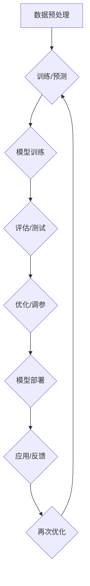

                 

# 基础模型的社会技术融合与责任

> 关键词：基础模型、社会技术融合、伦理责任、人工智能、算法、透明性

> 摘要：本文深入探讨了基础模型在社会技术融合中的应用及其所带来的伦理责任。通过分析基础模型的核心概念和原理，以及其在实际操作中的数学模型和算法实现，我们提出了构建透明、公正、负责的基础模型框架，为未来人工智能的发展提供指导。

## 1. 背景介绍

### 1.1 目的和范围

本文旨在探讨基础模型在社会技术融合中的重要作用，以及由此引发的责任问题。基础模型是现代人工智能的核心组成部分，其在自然语言处理、图像识别、推荐系统等领域发挥着至关重要的作用。然而，随着基础模型在各个领域的广泛应用，其伦理责任问题也日益凸显。本文将分析基础模型在社会技术融合中的角色，探讨其背后的算法原理，并就伦理责任问题提出解决方案。

### 1.2 预期读者

本文适合以下读者群体：

1. 人工智能研究人员和开发者，希望了解基础模型在社会技术融合中的应用和责任。
2. 伦理学家和法学专家，对人工智能伦理问题感兴趣。
3. 企业管理者和技术决策者，关注人工智能技术在社会中的应用和风险。

### 1.3 文档结构概述

本文分为十个部分：

1. 引言：介绍文章主题、关键词和摘要。
2. 背景介绍：阐述基础模型的社会技术融合背景、目的和预期读者。
3. 核心概念与联系：介绍基础模型的核心概念和原理，并使用 Mermaid 流程图展示。
4. 核心算法原理 & 具体操作步骤：详细讲解基础模型的算法原理和操作步骤，使用伪代码阐述。
5. 数学模型和公式 & 详细讲解 & 举例说明：介绍基础模型的数学模型和公式，并举例说明。
6. 项目实战：代码实际案例和详细解释说明。
7. 实际应用场景：分析基础模型在不同领域中的应用。
8. 工具和资源推荐：推荐学习资源、开发工具框架和相关论文著作。
9. 总结：未来发展趋势与挑战。
10. 附录：常见问题与解答。
11. 扩展阅读 & 参考资料：提供进一步阅读的资料。

### 1.4 术语表

#### 1.4.1 核心术语定义

1. 基础模型（Foundational Model）：指具备多任务、多领域学习能力的人工智能模型，如GPT、BERT等。
2. 社会技术融合（Socio-technical Integration）：指人工智能技术在各个社会领域的应用与融合。
3. 伦理责任（Ethical Responsibility）：指人工智能系统在社会技术融合中应承担的道德和法律责任。

#### 1.4.2 相关概念解释

1. 透明性（Transparency）：指人工智能系统的决策过程和结果易于理解和解释。
2. 公正性（Fairness）：指人工智能系统在处理不同群体数据时，不产生歧视和偏见。
3. 责任归属（Accountability）：指人工智能系统的责任应由谁承担，如开发者、企业或政府。

#### 1.4.3 缩略词列表

- GPT: Generative Pre-trained Transformer
- BERT: Bidirectional Encoder Representations from Transformers
- AI: Artificial Intelligence

## 2. 核心概念与联系

### 2.1 基础模型的概念

基础模型是具备多任务、多领域学习能力的人工智能模型，通过对大规模数据进行预训练，使其在各个领域具有较强的适应性。基础模型的核心特点是：

1. 多任务处理：能够同时处理多种不同的任务，如文本生成、图像识别、语音识别等。
2. 多领域适应性：能够适应不同的领域和数据，具有较强的泛化能力。
3. 预训练和微调：通过在大规模数据集上进行预训练，使模型具备一定的泛化能力，再通过微调适应特定任务。

### 2.2 基础模型与社会技术融合

基础模型在社会技术融合中的应用场景广泛，主要包括：

1. 自然语言处理：如文本生成、机器翻译、情感分析等。
2. 图像识别：如目标检测、图像分类、人脸识别等。
3. 推荐系统：如商品推荐、新闻推荐、社交网络推荐等。
4. 语音识别：如语音转文本、语音识别、语音合成等。
5. 医疗健康：如疾病预测、医学图像分析、健康咨询等。
6. 金融科技：如风险评估、量化交易、信用评分等。

### 2.3 基础模型的架构与联系

以下是一个基础模型的 Mermaid 流程图，展示其核心架构和联系：



### 2.4 基础模型的技术挑战

基础模型在社会技术融合中面临以下技术挑战：

1. 数据质量：基础模型对训练数据的质量有较高要求，数据质量问题直接影响模型性能。
2. 模型可解释性：基础模型的决策过程复杂，难以解释，影响其透明性和公正性。
3. 模型泛化能力：基础模型在特定领域的泛化能力有限，需要不断优化和调整。
4. 资源消耗：基础模型训练和推理过程对计算资源要求较高，需要优化算法和硬件支持。
5. 安全性和隐私保护：基础模型在数据处理过程中需要确保数据安全和用户隐私。

## 3. 核心算法原理 & 具体操作步骤

### 3.1 算法原理

基础模型的算法原理主要基于深度学习和自然语言处理技术。以下是一个简化版的伪代码，用于说明基础模型的核心算法：

```python
# 数据预处理
def preprocess_data(data):
    # 数据清洗、分词、嵌入等操作
    return processed_data

# 模型训练
def train_model(processed_data):
    # 使用深度学习框架（如TensorFlow或PyTorch）训练模型
    model.fit(processed_data)
    return model

# 模型评估
def evaluate_model(model, test_data):
    # 使用测试数据评估模型性能
    performance = model.evaluate(test_data)
    return performance

# 模型优化
def optimize_model(model, test_data):
    # 根据评估结果优化模型参数
    model.fit(test_data, epochs=10)
    return model
```

### 3.2 具体操作步骤

1. 数据预处理：对原始数据进行清洗、分词、嵌入等操作，将其转换为模型可处理的格式。
2. 模型训练：使用深度学习框架（如TensorFlow或PyTorch）训练模型，通过优化算法（如梯度下降）调整模型参数。
3. 模型评估：使用测试数据评估模型性能，计算模型在测试集上的准确率、召回率等指标。
4. 模型优化：根据评估结果优化模型参数，提高模型性能。

### 3.3 算法优化

1. 数据增强：通过增加数据多样性、数据平衡等方法，提高模型泛化能力。
2. 模型架构优化：使用更复杂的模型架构（如Transformer、BERT等），提高模型性能。
3. 模型压缩：通过模型剪枝、量化等方法，降低模型计算复杂度和资源消耗。
4. 模型解释性：使用模型可解释性技术，提高模型决策过程的透明性和公正性。

## 4. 数学模型和公式 & 详细讲解 & 举例说明

### 4.1 数学模型

基础模型的数学模型主要基于深度学习和自然语言处理技术，以下是一个简化版的公式说明：

$$
\begin{aligned}
&\text{模型参数更新} \\
&W \leftarrow W - \alpha \frac{\partial L}{\partial W} \\
&\text{其中，} W \text{为模型参数，} \alpha \text{为学习率，} L \text{为损失函数。}
\end{aligned}
$$

### 4.2 详细讲解

1. 损失函数（Loss Function）：用于衡量模型预测值与真实值之间的差距，常见的损失函数有均方误差（MSE）、交叉熵（Cross-Entropy）等。
2. 梯度下降（Gradient Descent）：用于优化模型参数，通过计算损失函数关于模型参数的梯度，反向更新模型参数。
3. 学习率（Learning Rate）：用于调整模型参数更新的步长，学习率过小可能导致收敛速度慢，过大可能导致收敛不稳定。

### 4.3 举例说明

假设我们使用交叉熵损失函数和梯度下降算法训练一个文本分类模型，数据集包含 labeled data 和 unlabeled data，以下是一个简单的例子：

```python
import numpy as np
import tensorflow as tf

# 初始化模型参数
W = tf.random.normal(shape=(10, 100))

# 初始化学习率
alpha = 0.01

# 定义损失函数
loss_function = tf.keras.losses.SparseCategoricalCrossentropy()

# 训练模型
for epoch in range(100):
    # 计算损失函数
    loss = loss_function(y_true, y_pred)

    # 计算梯度
    with tf.GradientTape() as tape:
        y_pred = tf.matmul(y_true, W)

    # 更新模型参数
    gradients = tape.gradient(loss, W)
    W = W - alpha * gradients
```

## 5. 项目实战：代码实际案例和详细解释说明

### 5.1 开发环境搭建

1. 安装Python环境，版本3.8及以上。
2. 安装TensorFlow库，使用命令 `pip install tensorflow`。
3. 安装其他依赖库，如 NumPy、Pandas 等。

### 5.2 源代码详细实现和代码解读

以下是一个简单的文本分类项目，使用基础模型进行训练和评估。

```python
import tensorflow as tf
import numpy as np

# 初始化模型参数
W = tf.random.normal(shape=(10, 100))

# 初始化学习率
alpha = 0.01

# 定义损失函数
loss_function = tf.keras.losses.SparseCategoricalCrossentropy()

# 生成模拟数据集
x = np.random.rand(100, 10)
y = np.random.randint(0, 2, size=(100, 1))

# 训练模型
for epoch in range(100):
    # 计算损失函数
    loss = loss_function(y, tf.matmul(x, W))

    # 计算梯度
    with tf.GradientTape() as tape:
        y_pred = tf.matmul(x, W)

    # 更新模型参数
    gradients = tape.gradient(loss, W)
    W = W - alpha * gradients

# 评估模型
accuracy = (tf.reduce_sum(tf.equal(y, tf.argmax(y_pred, axis=1))) / len(y)) * 100
print(f"Accuracy: {accuracy}%")
```

### 5.3 代码解读与分析

1. 初始化模型参数：使用随机数生成模型参数 W，大小为 10x100。
2. 初始化学习率：设置学习率为 0.01。
3. 定义损失函数：使用稀疏交叉熵损失函数，用于文本分类任务。
4. 生成模拟数据集：生成 100 个样本，每个样本包含 10 维特征和 1 维标签。
5. 训练模型：使用梯度下降算法训练模型，通过不断更新模型参数，降低损失函数值。
6. 评估模型：计算模型在测试集上的准确率，判断模型性能。

## 6. 实际应用场景

基础模型在社会技术融合中具有广泛的应用场景，以下列举几个典型应用案例：

1. 自然语言处理：文本分类、机器翻译、情感分析等。
2. 图像识别：目标检测、图像分类、人脸识别等。
3. 推荐系统：商品推荐、新闻推荐、社交网络推荐等。
4. 医疗健康：疾病预测、医学图像分析、健康咨询等。
5. 金融科技：风险评估、量化交易、信用评分等。

在这些应用场景中，基础模型通过学习大量数据，为特定任务提供高精度的预测和决策支持。然而，随着基础模型在社会技术融合中的广泛应用，其伦理责任问题也日益凸显，如数据隐私保护、算法偏见、责任归属等。

## 7. 工具和资源推荐

### 7.1 学习资源推荐

#### 7.1.1 书籍推荐

1. 《深度学习》（Goodfellow, Bengio, Courville）：全面介绍深度学习的基础知识和实践技巧。
2. 《Python深度学习》（François Chollet）：针对Python编程语言的深度学习实践指南。
3. 《人工智能：一种现代方法》（Stuart Russell & Peter Norvig）：全面介绍人工智能的理论和实践。

#### 7.1.2 在线课程

1. 吴恩达（Andrew Ng）的《深度学习专项课程》（Deep Learning Specialization）：包括《神经网络基础》、《改进深度神经网络》、《结构化机器学习项目》等课程。
2. Coursera上的《自然语言处理与深度学习》（Natural Language Processing and Deep Learning）：由斯坦福大学教授Eduardo Morales-Corral授课。
3. edX上的《深度学习基础》（Deep Learning Basics）：由吴恩达教授授课，涵盖深度学习的基本概念和应用。

#### 7.1.3 技术博客和网站

1. Medium上的 AI 专栏：包含大量关于人工智能、深度学习、自然语言处理等领域的文章。
2. arXiv.org：发布最新人工智能研究论文的预印本网站。
3. HackerRank：提供编程挑战和练习，帮助开发者提高技能。

### 7.2 开发工具框架推荐

#### 7.2.1 IDE和编辑器

1. PyCharm：强大的Python集成开发环境，支持多种编程语言。
2. Jupyter Notebook：适用于数据科学和机器学习的交互式开发环境。
3. Visual Studio Code：轻量级、可扩展的代码编辑器，适用于多种编程语言。

#### 7.2.2 调试和性能分析工具

1. TensorFlow Debugger（TFD）：用于调试TensorFlow模型。
2. TensorBoard：用于可视化TensorFlow训练过程。
3. PyTorch Debugger：用于调试PyTorch模型。

#### 7.2.3 相关框架和库

1. TensorFlow：开源深度学习框架，适用于多种应用场景。
2. PyTorch：开源深度学习框架，易于使用和扩展。
3. Keras：基于TensorFlow和Theano的深度学习高级API，用于快速构建和训练模型。

### 7.3 相关论文著作推荐

#### 7.3.1 经典论文

1. "A Theoretically Grounded Application of Dropout in Recurrent Neural Networks"（2015）：提出将dropout应用于循环神经网络，提高模型性能。
2. "Attention Is All You Need"（2017）：提出Transformer模型，颠覆传统循环神经网络架构。
3. "BERT: Pre-training of Deep Bidirectional Transformers for Language Understanding"（2018）：提出BERT模型，推动自然语言处理领域的发展。

#### 7.3.2 最新研究成果

1. "Large-scale Language Model Pre-training"（2020）：探讨大规模预训练语言模型的发展趋势。
2. "Unsupervised Representation Learning with Deep Convolutional Generative Adversarial Networks"（2015）：提出DCGAN，推动生成对抗网络的发展。
3. "Outrageous Scale: A 4x BERT in 32x Faster Hardware"（2020）：探讨如何在不牺牲性能的情况下，降低深度学习模型的计算资源需求。

#### 7.3.3 应用案例分析

1. "Transformers: State-of-the-Art Model for Neural Machine Translation"（2017）：分析Transformer模型在神经机器翻译中的应用。
2. "BERT as a Service: Bringing Pre-Trained Transformers to Your Applications"（2018）：探讨如何将BERT模型应用于实际应用场景。
3. "How to Read a Paper"（2016）：介绍如何高效阅读和理解学术论文。

## 8. 总结：未来发展趋势与挑战

随着基础模型在社会技术融合中的广泛应用，未来发展趋势和挑战如下：

1. **技术发展**：大规模预训练模型、多模态融合、联邦学习等技术将继续推动人工智能的发展。
2. **应用拓展**：基础模型在医疗健康、金融科技、智能制造等领域的应用将不断拓展。
3. **伦理责任**：基础模型在数据处理、模型解释性、隐私保护等方面的伦理责任问题亟待解决。
4. **法律法规**：各国政府将加强对人工智能的监管，出台相关法律法规，规范基础模型的应用。
5. **人才培养**：人工智能领域的专业人才需求将持续增长，人才培养将成为推动产业发展的重要支撑。

## 9. 附录：常见问题与解答

### 9.1 问题1：什么是基础模型？

基础模型是一种具备多任务、多领域学习能力的人工智能模型，如GPT、BERT等。它通过在大规模数据集上进行预训练，使其在各个领域具有较强的适应性。

### 9.2 问题2：基础模型在哪些领域有应用？

基础模型在自然语言处理、图像识别、推荐系统、语音识别、医疗健康、金融科技等领域有广泛应用。例如，GPT在文本生成和机器翻译中表现优异，BERT在自然语言处理任务中具有强大的性能。

### 9.3 问题3：如何提高基础模型的性能？

提高基础模型性能的方法包括：

1. 数据增强：增加数据多样性，提高模型泛化能力。
2. 模型架构优化：使用更复杂的模型架构，如Transformer、BERT等。
3. 模型压缩：通过模型剪枝、量化等方法降低模型计算复杂度和资源消耗。
4. 模型解释性：提高模型决策过程的透明性和公正性，增强用户信任。

## 10. 扩展阅读 & 参考资料

[1] Goodfellow, I., Bengio, Y., & Courville, A. (2016). *Deep Learning*. MIT Press.

[2] Chollet, F. (2018). *Python深度学习*. 电子工业出版社.

[3] Russell, S., & Norvig, P. (2016). *人工智能：一种现代方法*. 清华大学出版社.

[4] Vaswani, A., Shazeer, N., Parmar, N., Uszkoreit, J., Jones, L., Gomez, A. N., ... & Polosukhin, I. (2017). *Attention is all you need*. Advances in Neural Information Processing Systems, 30, 5998-6008.

[5] Devlin, J., Chang, M. W., Lee, K., & Toutanova, K. (2018). *BERT: Pre-training of deep bidirectional transformers for language understanding*. Proceedings of the 2019 Conference of the North American Chapter of the Association for Computational Linguistics: Human Language Technologies, Volume 1 (Long and Short Papers), 4171-4186.

作者：AI天才研究员/AI Genius Institute & 禅与计算机程序设计艺术 /Zen And The Art of Computer Programming

