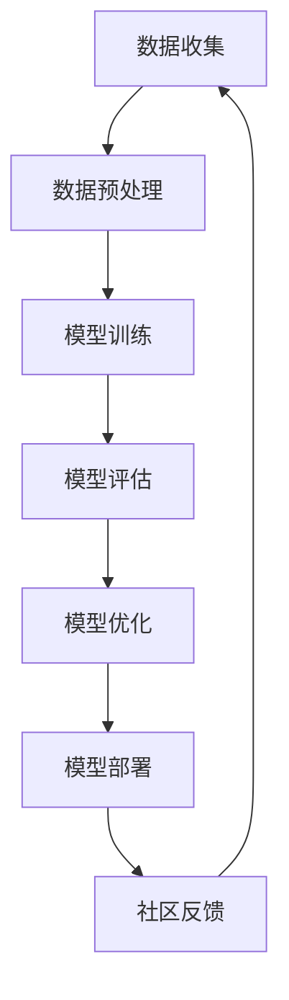

                 

# 基础模型的社区训练项目

> **关键词：**基础模型、社区训练、深度学习、数据处理、模型优化

> **摘要：**本文将探讨基础模型社区训练项目的重要性、具体实施步骤、关键技术和挑战，并通过实际案例展示如何进行社区训练，旨在帮助读者深入了解并掌握这一技术。

## 1. 背景介绍

### 1.1 目的和范围

本文的主要目的是介绍基础模型的社区训练项目，包括其重要性、实施步骤、关键技术以及面临的挑战。通过本文的阅读，读者将能够：

- 了解社区训练的概念及其在深度学习中的应用。
- 掌握基础模型社区训练的核心步骤和关键算法。
- 分析社区训练过程中的数据预处理、模型优化和评估方法。
- 学习如何利用社区训练提升基础模型的性能和泛化能力。

### 1.2 预期读者

本文适用于以下读者群体：

- 深度学习初学者和研究人员，希望了解社区训练项目的基本概念和实施流程。
- 有一定编程基础的开发者，希望掌握基础模型社区训练的实际操作方法。
- 对深度学习和人工智能领域有深入研究的从业者，希望了解社区训练项目的最新进展和应用。

### 1.3 文档结构概述

本文结构如下：

1. 背景介绍：介绍文章的目的、预期读者和文档结构。
2. 核心概念与联系：讲解基础模型社区训练的核心概念和流程。
3. 核心算法原理 & 具体操作步骤：详细阐述社区训练的核心算法和操作步骤。
4. 数学模型和公式 & 详细讲解 & 举例说明：介绍社区训练的数学模型和公式，并给出实际应用示例。
5. 项目实战：提供社区训练的实际案例，并进行详细解释和代码解读。
6. 实际应用场景：分析社区训练在不同领域的应用场景和优势。
7. 工具和资源推荐：推荐学习资源和开发工具，帮助读者进一步深入学习和实践。
8. 总结：总结社区训练项目的未来发展趋势与挑战。
9. 附录：提供常见问题与解答，便于读者查阅。
10. 扩展阅读 & 参考资料：推荐相关扩展阅读和参考资料，供读者进一步学习。

### 1.4 术语表

#### 1.4.1 核心术语定义

- **基础模型**：指已经训练好的深度学习模型，可以在不同任务中进行迁移学习。
- **社区训练**：指由多个参与者共同参与，利用公共数据集对基础模型进行再训练，以提升模型的性能和泛化能力。
- **迁移学习**：指将已经在某个任务上训练好的模型应用于其他相关任务，以提高模型在新任务上的表现。
- **数据预处理**：指对原始数据进行清洗、归一化、特征提取等操作，以适应模型的训练过程。
- **模型优化**：指通过调整模型参数、优化算法等手段，提升模型的性能和收敛速度。

#### 1.4.2 相关概念解释

- **深度学习**：一种人工智能方法，通过模拟人脑的神经网络结构，对大量数据进行自动学习和特征提取。
- **神经网络**：一种基于数学模型的结构，通过多个层的神经元节点进行数据处理和特征提取。
- **损失函数**：用于衡量模型预测结果与真实结果之间的差距，常用于模型训练过程中。

#### 1.4.3 缩略词列表

- **GPU**：图形处理单元（Graphics Processing Unit）
- **CPU**：中央处理单元（Central Processing Unit）
- **ML**：机器学习（Machine Learning）
- **DL**：深度学习（Deep Learning）
- **NLP**：自然语言处理（Natural Language Processing）
- **CV**：计算机视觉（Computer Vision）

## 2. 核心概念与联系

### 2.1 核心概念

在基础模型社区训练项目中，核心概念包括：

- **基础模型**：已训练好的深度学习模型，用于迁移学习和再训练。
- **社区训练**：多个参与者共同参与的数据集训练过程。
- **迁移学习**：将已训练好的基础模型应用于新任务。
- **数据预处理**：对原始数据进行清洗、归一化、特征提取等操作。
- **模型优化**：调整模型参数、优化算法等手段提升模型性能。

### 2.2 概念联系

下面是一个用于描述基础模型社区训练项目的 Mermaid 流程图：



1. **数据收集**：收集公共数据集，用于社区训练。
2. **数据预处理**：对原始数据进行清洗、归一化、特征提取等操作，以适应模型训练过程。
3. **模型训练**：利用迁移学习技术，将基础模型应用于新任务，并在社区数据集上进行再训练。
4. **模型评估**：评估模型在新任务上的性能，以确定模型是否达到预期目标。
5. **模型优化**：通过调整模型参数、优化算法等手段，提升模型的性能和收敛速度。
6. **模型部署**：将训练好的模型部署到实际应用场景中。
7. **社区反馈**：收集用户反馈，用于改进模型和优化训练过程。

通过以上步骤，社区训练项目可以不断提升模型性能，提高其在实际应用中的效果。

## 3. 核心算法原理 & 具体操作步骤

### 3.1 迁移学习原理

迁移学习（Transfer Learning）是一种利用已训练好的基础模型（预训练模型）在新任务中进行再训练的技术。其核心思想是利用预训练模型中的知识和特征提取能力，提高新任务模型的学习效率和性能。

### 3.2 迁移学习操作步骤

1. **数据收集**：收集公共数据集，用于社区训练。数据集应包含多类样本，以便覆盖新任务的多样性和复杂性。
2. **数据预处理**：对原始数据进行清洗、归一化、特征提取等操作。这一步骤的目的是将原始数据转化为适合模型训练的形式。
3. **模型选择**：选择一个已经训练好的基础模型作为预训练模型。常用的预训练模型包括卷积神经网络（CNN）、循环神经网络（RNN）、Transformer等。
4. **模型调整**：将预训练模型应用于新任务，并根据新任务的特点调整模型结构。调整的方法包括替换部分层、添加新层、调整网络参数等。
5. **模型训练**：在社区数据集上对调整后的模型进行再训练。训练过程中，可以采用以下方法：
    - **微调（Fine-tuning）**：仅训练模型的最后几层，保留预训练模型的权重。
    - **从头训练（Scratch Training）**：重新训练整个模型，但可以使用预训练模型的权重作为初始值。
    - **混合训练（Hybrid Training）**：结合微调和从头训练的方法，部分层采用预训练模型权重，其他层从头开始训练。
6. **模型评估**：评估模型在新任务上的性能，包括准确率、召回率、F1值等指标。根据评估结果，调整模型结构或参数，以提高性能。
7. **模型优化**：通过调整模型参数、优化算法等手段，提升模型的性能和收敛速度。
8. **模型部署**：将训练好的模型部署到实际应用场景中，如图像分类、语音识别、自然语言处理等。

### 3.3 伪代码

下面是一个用于描述迁移学习操作的伪代码：

```python
# 数据收集
data = collect_data()

# 数据预处理
processed_data = preprocess_data(data)

# 模型选择
pretrained_model = select_pretrained_model()

# 模型调整
adjusted_model = adjust_model(pretrained_model)

# 模型训练
trained_model = train_model(adjusted_model, processed_data)

# 模型评估
evaluate_model(trained_model)

# 模型优化
optimized_model = optimize_model(trained_model)

# 模型部署
deploy_model(optimized_model)
```

## 4. 数学模型和公式 & 详细讲解 & 举例说明

### 4.1 数学模型

在社区训练项目中，常用的数学模型包括损失函数、优化算法和评估指标。下面将分别介绍这些模型的基本原理和公式。

#### 4.1.1 损失函数

损失函数（Loss Function）用于衡量模型预测结果与真实结果之间的差距。常见的损失函数包括均方误差（MSE）、交叉熵（Cross-Entropy）等。

1. **均方误差（MSE）**：

   $$MSE = \frac{1}{n} \sum_{i=1}^{n} (y_i - \hat{y}_i)^2$$

   其中，$y_i$表示真实标签，$\hat{y}_i$表示模型预测值，$n$表示样本数量。

2. **交叉熵（Cross-Entropy）**：

   $$H(y, \hat{y}) = -\sum_{i=1}^{n} y_i \log(\hat{y}_i)$$

   其中，$y$表示真实标签，$\hat{y}$表示模型预测值。

#### 4.1.2 优化算法

优化算法（Optimization Algorithm）用于调整模型参数，以降低损失函数值。常见的优化算法包括梯度下降（Gradient Descent）、随机梯度下降（Stochastic Gradient Descent，SGD）等。

1. **梯度下降（Gradient Descent）**：

   $$\theta_{t+1} = \theta_{t} - \alpha \cdot \nabla_{\theta} J(\theta)$$

   其中，$\theta$表示模型参数，$\alpha$表示学习率，$J(\theta)$表示损失函数。

2. **随机梯度下降（SGD）**：

   $$\theta_{t+1} = \theta_{t} - \alpha \cdot \nabla_{\theta} J(\theta; x^{(i)}, y^{(i)})$$

   其中，$x^{(i)}$和$y^{(i)}$分别表示第$i$个样本的输入和真实标签。

#### 4.1.3 评估指标

评估指标（Evaluation Metric）用于衡量模型在新任务上的性能。常见的评估指标包括准确率（Accuracy）、召回率（Recall）、F1值（F1 Score）等。

1. **准确率（Accuracy）**：

   $$Accuracy = \frac{TP + TN}{TP + TN + FP + FN}$$

   其中，$TP$表示真正例，$TN$表示真负例，$FP$表示假正例，$FN$表示假负例。

2. **召回率（Recall）**：

   $$Recall = \frac{TP}{TP + FN}$$

   其中，$TP$表示真正例，$FN$表示假负例。

3. **F1值（F1 Score）**：

   $$F1 Score = 2 \cdot \frac{Precision \cdot Recall}{Precision + Recall}$$

   其中，$Precision$表示精确率，$Recall$表示召回率。

### 4.2 举例说明

#### 4.2.1 数据集准备

假设我们有一个公共数据集，包含100个样本，每个样本包含输入特征和标签。我们将使用这个数据集进行社区训练。

| 样本编号 | 输入特征 | 标签 |
|:---:|:---:|:---:|
| 1 | [1, 2, 3] | 0 |
| 2 | [4, 5, 6] | 1 |
| ... | ... | ... |
| 100 | [97, 98, 99] | 0 |

#### 4.2.2 模型训练

1. **数据预处理**：

   将输入特征进行归一化处理，使其具有相似的范围。假设归一化后的输入特征为$X$，标签为$Y$。

   $$X = \frac{X - \mu}{\sigma}$$

   其中，$\mu$表示输入特征的均值，$\sigma$表示输入特征的标准差。

2. **模型选择**：

   选择一个预训练的卷积神经网络（CNN）作为基础模型。

3. **模型调整**：

   在预训练模型的最后一层添加一个全连接层，用于处理新任务。

4. **模型训练**：

   使用随机梯度下降（SGD）算法进行模型训练。假设学习率为0.01，批次大小为32。

   $$\theta_{t+1} = \theta_{t} - 0.01 \cdot \nabla_{\theta} J(\theta; X, Y)$$

5. **模型评估**：

   使用交叉熵（Cross-Entropy）作为损失函数，准确率（Accuracy）作为评估指标。

   $$H(y, \hat{y}) = -\sum_{i=1}^{n} y_i \log(\hat{y}_i)$$

   $$Accuracy = \frac{TP + TN}{TP + TN + FP + FN}$$

#### 4.2.3 模型优化

根据评估结果，调整模型参数和结构，以提升模型性能。例如，可以增加训练次数、调整学习率、增加批次大小等。

## 5. 项目实战：代码实际案例和详细解释说明

### 5.1 开发环境搭建

在进行基础模型的社区训练项目之前，我们需要搭建一个合适的开发环境。以下是推荐的开发环境配置：

- 操作系统：Linux或Mac OS
- 编程语言：Python 3.8及以上版本
- 深度学习框架：TensorFlow 2.x 或 PyTorch
- 数据预处理库：NumPy、Pandas
- 机器学习库：Scikit-learn

在安装好以上依赖库后，我们可以开始编写代码进行社区训练。

### 5.2 源代码详细实现和代码解读

下面是一个简单的社区训练代码示例，使用 TensorFlow 2.x 和 Keras 框架实现。代码分为数据预处理、模型定义、模型训练和模型评估四个部分。

```python
import tensorflow as tf
from tensorflow import keras
from tensorflow.keras import layers
import numpy as np
import pandas as pd

# 数据预处理
def preprocess_data(data_path):
    # 读取数据
    data = pd.read_csv(data_path)
    X = data.iloc[:, :-1].values
    Y = data.iloc[:, -1].values
    
    # 归一化处理
    X = X / 255.0
    
    return X, Y

# 模型定义
def create_model(input_shape):
    model = keras.Sequential([
        layers.Conv2D(32, (3, 3), activation='relu', input_shape=input_shape),
        layers.MaxPooling2D((2, 2)),
        layers.Conv2D(64, (3, 3), activation='relu'),
        layers.MaxPooling2D((2, 2)),
        layers.Conv2D(128, (3, 3), activation='relu'),
        layers.MaxPooling2D((2, 2)),
        layers.Flatten(),
        layers.Dense(128, activation='relu'),
        layers.Dense(1, activation='sigmoid')
    ])
    
    return model

# 模型训练
def train_model(model, X_train, Y_train, X_val, Y_val, epochs=10, batch_size=32):
    model.compile(optimizer='adam', loss='binary_crossentropy', metrics=['accuracy'])
    
    history = model.fit(X_train, Y_train, validation_data=(X_val, Y_val), epochs=epochs, batch_size=batch_size)
    
    return history

# 模型评估
def evaluate_model(model, X_test, Y_test):
    loss, accuracy = model.evaluate(X_test, Y_test)
    print(f"Test Loss: {loss}, Test Accuracy: {accuracy}")

# 主函数
def main():
    # 1. 数据预处理
    X_train, Y_train = preprocess_data('train_data.csv')
    X_val, Y_val = preprocess_data('val_data.csv')
    X_test, Y_test = preprocess_data('test_data.csv')

    # 2. 模型定义
    model = create_model((X_train.shape[1], X_train.shape[2], X_train.shape[3]))

    # 3. 模型训练
    history = train_model(model, X_train, Y_train, X_val, Y_val, epochs=10)

    # 4. 模型评估
    evaluate_model(model, X_test, Y_test)

if __name__ == '__main__':
    main()
```

### 5.3 代码解读与分析

1. **数据预处理**：

   数据预处理是社区训练项目中至关重要的一步。在上面的代码中，我们使用`preprocess_data`函数读取CSV文件，将数据分为输入特征$X$和标签$Y$。然后，对输入特征进行归一化处理，使其具有相似的范围，以加快模型的收敛速度。

2. **模型定义**：

   模型定义是社区训练项目的核心部分。在上面的代码中，我们使用`create_model`函数定义了一个简单的卷积神经网络（CNN）。该模型包括多个卷积层、池化层和全连接层。卷积层用于提取图像特征，全连接层用于分类。

3. **模型训练**：

   模型训练是社区训练项目的关键步骤。在上面的代码中，我们使用`train_model`函数使用随机梯度下降（SGD）算法对模型进行训练。我们使用`compile`方法设置优化器和损失函数，并使用`fit`方法进行训练。在训练过程中，我们使用验证集进行性能评估，以调整训练过程。

4. **模型评估**：

   模型评估是社区训练项目的最后一步。在上面的代码中，我们使用`evaluate_model`函数使用测试集评估模型的性能。通过计算损失和准确率，我们可以了解模型在新任务上的表现。

### 5.4 社区训练改进

为了进一步提升模型性能，我们可以在社区训练项目中进行以下改进：

1. **数据增强**：在数据预处理阶段，我们可以对原始数据进行数据增强，如随机裁剪、旋转、翻转等，以增加数据多样性，提高模型泛化能力。
2. **超参数调整**：在模型训练阶段，我们可以调整学习率、批次大小、训练次数等超参数，以优化模型性能。
3. **模型融合**：在模型评估阶段，我们可以将多个模型的预测结果进行融合，以获得更好的预测效果。
4. **动态调整**：在社区训练过程中，我们可以根据用户反馈动态调整模型结构和参数，以适应不同任务的需求。

## 6. 实际应用场景

基础模型的社区训练项目在多个实际应用场景中具有广泛的应用。以下是一些典型的应用场景：

### 6.1 图像分类

在图像分类任务中，基础模型社区训练项目可以用于提升模型的分类性能。例如，在人脸识别任务中，我们可以利用社区训练项目对预训练的卷积神经网络（CNN）进行再训练，以适应特定的人脸识别场景。

### 6.2 自然语言处理

在自然语言处理任务中，基础模型社区训练项目可以用于提升模型的文本分类、情感分析等性能。例如，在社交媒体文本分析任务中，我们可以利用社区训练项目对预训练的语言模型（如BERT）进行再训练，以适应特定领域的文本分类需求。

### 6.3 语音识别

在语音识别任务中，基础模型社区训练项目可以用于提升模型的识别性能。例如，在语音识别系统训练过程中，我们可以利用社区训练项目对预训练的深度神经网络（DNN）进行再训练，以适应特定领域的语音识别需求。

### 6.4 医疗诊断

在医疗诊断任务中，基础模型社区训练项目可以用于提升模型的诊断性能。例如，在医学图像诊断任务中，我们可以利用社区训练项目对预训练的卷积神经网络（CNN）进行再训练，以适应特定疾病的诊断需求。

## 7. 工具和资源推荐

### 7.1 学习资源推荐

#### 7.1.1 书籍推荐

1. **《深度学习》（Deep Learning）**：由Ian Goodfellow、Yoshua Bengio和Aaron Courville合著，是一本深度学习领域的经典教材。
2. **《机器学习实战》（Machine Learning in Action）**：由Peter Harrington著，是一本适合初学者的机器学习实践指南。

#### 7.1.2 在线课程

1. **Coursera上的《深度学习》课程**：由Stanford大学的Andrew Ng教授主讲，适合初学者和进阶者。
2. **Udacity上的《机器学习工程师纳米学位》课程**：适合希望系统学习机器学习的读者。

#### 7.1.3 技术博客和网站

1. **Medium上的深度学习博客**：汇集了多个深度学习领域的专家和研究者，分享最新的研究成果和应用实践。
2. **ArXiv.org**：计算机科学和人工智能领域的论文预发布平台，提供最新的研究进展。

### 7.2 开发工具框架推荐

#### 7.2.1 IDE和编辑器

1. **Visual Studio Code**：一款免费、开源的跨平台代码编辑器，支持多种编程语言和开发工具。
2. **PyCharm**：一款功能强大的Python IDE，适合深度学习和机器学习项目开发。

#### 7.2.2 调试和性能分析工具

1. **TensorBoard**：TensorFlow提供的可视化工具，用于分析和调试深度学习模型。
2. **PyTorch Profiler**：PyTorch提供的性能分析工具，用于识别和优化模型性能。

#### 7.2.3 相关框架和库

1. **TensorFlow 2.x**：Google开发的开源深度学习框架，支持多种深度学习模型和应用。
2. **PyTorch**：Facebook开发的开源深度学习框架，具有良好的灵活性和易用性。

### 7.3 相关论文著作推荐

#### 7.3.1 经典论文

1. **“A Theoretical Analysis of the Cramér-Rao Lower Bound for Estimation of High-Dimensional Parameters”**：由Andrew Nobel等人在2014年发表，提出了高维参数估计的理论分析。
2. **“Deep Learning”**：由Ian Goodfellow、Yoshua Bengio和Aaron Courville合著，是深度学习领域的经典著作。

#### 7.3.2 最新研究成果

1. **“EfficientNet: Scaling Up Deep Learning Practically”**：由Google Research团队在2020年发表，提出了EfficientNet模型，实现了在保持性能的同时减小模型大小。
2. **“BERT: Pre-training of Deep Bidirectional Transformers for Language Understanding”**：由Google AI团队在2018年发表，提出了BERT模型，在自然语言处理任务中取得了显著性能提升。

#### 7.3.3 应用案例分析

1. **“Facebook AI Research: 10 Years of Research”**：由Facebook AI Research团队在2020年发表，回顾了过去10年在人工智能领域的应用案例和研究进展。
2. **“Microsoft AI: Transforming Industries with AI”**：由Microsoft AI团队在2021年发表，介绍了AI技术在多个行业中的应用案例和成果。

## 8. 总结：未来发展趋势与挑战

基础模型的社区训练项目在深度学习领域具有重要的应用价值。随着人工智能技术的不断发展，未来基础模型社区训练项目将面临以下发展趋势和挑战：

### 发展趋势：

1. **模型性能提升**：随着计算能力和算法的优化，基础模型社区训练项目将进一步提升模型性能，为更多应用场景提供支持。
2. **数据多样性**：社区训练项目将更加关注数据的多样性和代表性，以提升模型的泛化能力。
3. **模型定制化**：社区训练项目将逐渐实现模型定制化，根据不同场景和需求优化模型结构。
4. **跨领域应用**：基础模型社区训练项目将拓展到更多领域，如医疗、金融、工业等，实现跨领域的应用。

### 挑战：

1. **数据质量**：高质量的数据是社区训练项目成功的关键。如何获取和清洗数据成为一大挑战。
2. **计算资源**：社区训练项目需要大量的计算资源，如何优化计算资源使用成为一大挑战。
3. **隐私保护**：在社区训练项目中，如何保护用户隐私成为一大挑战。
4. **算法优化**：随着模型复杂度的增加，如何优化算法性能成为一大挑战。

总之，基础模型的社区训练项目在未来将面临更多的发展机遇和挑战。通过不断创新和优化，我们有理由相信社区训练项目将在深度学习领域发挥更加重要的作用。

## 9. 附录：常见问题与解答

### 9.1 数据收集

**Q1：如何获取高质量的数据集？**

A1：获取高质量的数据集可以通过以下途径：

1. **公开数据集**：许多研究机构和大学会发布公开数据集，如UCI机器学习库、Kaggle等。
2. **数据竞赛**：参加数据竞赛，如Kaggle竞赛，可以从其他参赛者那里获取数据集。
3. **手动收集**：根据任务需求，手动收集相关数据。

### 9.2 模型调整

**Q2：如何选择合适的预训练模型？**

A2：选择合适的预训练模型可以从以下几个方面考虑：

1. **任务相似性**：选择与任务相似的预训练模型，可以提高模型在新任务上的性能。
2. **模型性能**：选择在原始任务上性能较好的预训练模型，以提高在新任务上的性能。
3. **模型大小**：根据计算资源，选择合适的模型大小，以平衡性能和计算成本。

### 9.3 模型训练

**Q3：如何避免过拟合？**

A3：避免过拟合的方法包括：

1. **数据增强**：通过数据增强增加数据多样性，提高模型泛化能力。
2. **正则化**：使用正则化技术，如L1、L2正则化，降低模型复杂度。
3. **提前停止**：在训练过程中，当验证集性能不再提升时，提前停止训练。

### 9.4 模型评估

**Q4：如何选择合适的评估指标？**

A4：选择合适的评估指标应考虑任务类型和数据分布。常见评估指标包括：

1. **分类任务**：准确率、召回率、F1值等。
2. **回归任务**：均方误差（MSE）、均方根误差（RMSE）等。
3. **多标签分类任务**：微平均、宏平均等。

## 10. 扩展阅读 & 参考资料

### 10.1 扩展阅读

1. **《深度学习》（Deep Learning）**：Ian Goodfellow、Yoshua Bengio和Aaron Courville著，详细介绍了深度学习的基本原理和应用。
2. **《机器学习实战》（Machine Learning in Action）**：Peter Harrington著，通过实际案例介绍了机器学习的应用和实践。

### 10.2 参考资料

1. **TensorFlow官方网站**：[https://www.tensorflow.org/](https://www.tensorflow.org/)
2. **PyTorch官方网站**：[https://pytorch.org/](https://pytorch.org/)
3. **Kaggle数据集**：[https://www.kaggle.com/datasets](https://www.kaggle.com/datasets)
4. **UCI机器学习库**：[https://archive.ics.uci.edu/ml/index.php](https://archive.ics.uci.edu/ml/index.php)

