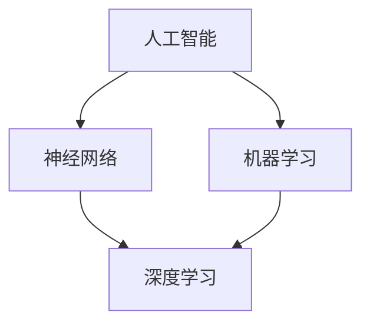

                 

# 基础模型的跨学科合作与研究

> 关键词：基础模型、跨学科合作、研究、人工智能、算法、数学模型、实际应用、工具推荐

> 摘要：本文将深入探讨基础模型的跨学科合作与研究。基础模型是人工智能的核心组成部分，涉及多个学科领域。本文将首先介绍基础模型的发展背景和核心概念，然后详细分析其在各个学科中的应用，探讨跨学科合作的必要性和优势，并通过实际案例和数学模型，阐述研究方法和操作步骤。最后，本文将总结基础模型跨学科合作的未来发展趋势和挑战，并推荐相关的学习资源和工具，为读者提供全面的了解和指导。

## 1. 背景介绍

### 1.1 目的和范围

本文旨在探讨基础模型的跨学科合作与研究，以揭示其在人工智能领域的广泛应用和重要性。本文将重点关注以下几个方面：

1. **基础模型的发展背景**：介绍基础模型的起源、发展历程和核心概念。
2. **跨学科合作的必要性**：分析跨学科合作的优势和重要性，为研究提供理论依据。
3. **核心算法原理**：详细讲解基础模型的核心算法原理和具体操作步骤。
4. **数学模型与公式**：介绍与基础模型相关的数学模型和公式，并进行举例说明。
5. **实际应用场景**：探讨基础模型在各个实际应用场景中的具体应用。
6. **工具和资源推荐**：为读者提供相关的学习资源和工具，以便更好地理解和应用基础模型。
7. **未来发展趋势与挑战**：总结基础模型跨学科合作的未来发展趋势和面临的挑战。

### 1.2 预期读者

本文适合对人工智能和基础模型感兴趣的读者，包括：

1. **人工智能从业者**：希望深入了解基础模型的应用和研究方法。
2. **计算机科学学生**：希望掌握基础模型的原理和实现技术。
3. **数学和统计领域研究者**：希望了解基础模型在数学模型中的应用。
4. **其他学科领域研究者**：对跨学科合作和基础模型感兴趣的学者。

### 1.3 文档结构概述

本文分为十个主要部分，具体结构如下：

1. **背景介绍**：介绍本文的目的、范围、预期读者和文档结构。
2. **核心概念与联系**：介绍基础模型的核心概念和联系，并提供Mermaid流程图。
3. **核心算法原理 & 具体操作步骤**：详细讲解基础模型的核心算法原理和具体操作步骤。
4. **数学模型和公式 & 详细讲解 & 举例说明**：介绍与基础模型相关的数学模型和公式，并进行举例说明。
5. **项目实战：代码实际案例和详细解释说明**：通过实际案例和详细解释，展示基础模型的应用。
6. **实际应用场景**：探讨基础模型在各个实际应用场景中的具体应用。
7. **工具和资源推荐**：为读者提供相关的学习资源和工具。
8. **总结：未来发展趋势与挑战**：总结基础模型跨学科合作的未来发展趋势和挑战。
9. **附录：常见问题与解答**：提供常见的疑问和解答。
10. **扩展阅读 & 参考资料**：提供扩展阅读和参考资料，以便读者进一步学习和研究。

### 1.4 术语表

#### 1.4.1 核心术语定义

- **基础模型**：指用于人工智能领域的核心模型，通常具有通用性和广泛的应用性。
- **跨学科合作**：指不同学科领域之间的合作，以共同研究和解决复杂问题。
- **人工智能**：指通过计算机模拟人类智能，实现感知、思考、学习、决策等过程。

#### 1.4.2 相关概念解释

- **神经网络**：指一种模仿生物神经网络的结构和功能的计算模型。
- **机器学习**：指利用数据和算法，使计算机能够自动学习和改进的能力。
- **深度学习**：指一种基于神经网络的结构，通过多层非线性变换，实现更复杂的特征提取和模型训练。

#### 1.4.3 缩略词列表

- **AI**：人工智能
- **ML**：机器学习
- **DL**：深度学习
- **NN**：神经网络

## 2. 核心概念与联系

在探讨基础模型的跨学科合作与研究之前，首先需要了解基础模型的核心概念和它们之间的联系。以下是一个Mermaid流程图，展示了基础模型的核心概念及其联系：



### 2.1 人工智能

人工智能（AI）是指通过计算机模拟人类智能，实现感知、思考、学习、决策等过程。人工智能是一个广泛的领域，涵盖了多个子领域，包括：

- **机器学习**：通过数据和算法，使计算机能够自动学习和改进的能力。
- **深度学习**：一种基于神经网络的结构，通过多层非线性变换，实现更复杂的特征提取和模型训练。

### 2.2 神经网络

神经网络是一种模仿生物神经网络的结构和功能的计算模型。它由大量简单 interconnected nodes 组成，每个节点称为神经元。神经网络可以通过训练，学习输入和输出之间的复杂关系。

### 2.3 机器学习

机器学习是一种使计算机能够自动学习和改进的能力。它通过从数据中学习，提取模式和知识，从而实现预测、分类、回归等任务。机器学习可以分为：

- **监督学习**：输入和输出数据都有标签，用于训练模型。
- **无监督学习**：只有输入数据，没有标签，用于发现数据中的模式和结构。
- **半监督学习**：既有标签数据，又有无标签数据，用于提高模型的泛化能力。

### 2.4 深度学习

深度学习是一种基于神经网络的结构，通过多层非线性变换，实现更复杂的特征提取和模型训练。深度学习在图像识别、自然语言处理、语音识别等领域取得了显著的成果。深度学习的核心思想是：

- **卷积神经网络（CNN）**：用于图像识别和分类。
- **循环神经网络（RNN）**：用于序列数据的建模和预测。
- **生成对抗网络（GAN）**：用于生成逼真的图像、音频和文本。

## 3. 核心算法原理 & 具体操作步骤

在了解基础模型的核心概念和联系后，接下来将详细讲解基础模型的核心算法原理和具体操作步骤。以下是一个简单的伪代码示例，展示了基础模型的算法原理和具体操作步骤：

```python
# 输入数据
X = ...

# 初始化模型参数
W = ...
b = ...

# 前向传播
z = X * W + b
a = activation_function(z)

# 计算损失函数
loss = loss_function(a, y)

# 反向传播
dZ = activation_function_derivative(a) * (loss_derivative(a, y))
dW = X.T * dZ
db = dZ.sum(axis=0)

# 更新模型参数
W = W - learning_rate * dW
b = b - learning_rate * db
```

### 3.1 输入数据

输入数据是基础模型训练的重要部分。通常，输入数据可以是图像、文本、音频等各种形式。为了简化示例，我们假设输入数据是一个二维矩阵 X，其中每行表示一个样本，每列表示一个特征。

### 3.2 初始化模型参数

初始化模型参数是基础模型训练的第一步。模型参数包括权重矩阵 W 和偏置向量 b。为了简化示例，我们假设权重矩阵 W 和偏置向量 b 都是随机初始化的。

### 3.3 前向传播

前向传播是基础模型的核心步骤之一。在前向传播过程中，输入数据通过模型参数进行变换，生成预测结果。具体来说，输入数据 X 与权重矩阵 W 相乘，再加上偏置向量 b，得到中间结果 z。然后，通过激活函数 activation_function 对中间结果进行变换，得到预测结果 a。

### 3.4 计算损失函数

损失函数是评估模型预测结果与真实标签之间差异的指标。常见的损失函数包括均方误差（MSE）和交叉熵（CE）。在示例中，我们使用均方误差（MSE）作为损失函数。

### 3.5 反向传播

反向传播是基础模型训练的另一个重要步骤。在反向传播过程中，模型参数通过计算损失函数的梯度进行更新。具体来说，首先计算预测结果 a 和真实标签 y 之间的差异，然后通过激活函数的导数和损失函数的导数，计算损失函数对模型参数的梯度。最后，通过梯度下降算法，更新模型参数。

### 3.6 更新模型参数

更新模型参数是基础模型训练的最后一步。通过计算损失函数的梯度，更新权重矩阵 W 和偏置向量 b。具体来说，使用学习率 learning_rate，将梯度乘以学习率的负值，得到更新量，然后从当前参数中减去更新量，得到新的参数。

## 4. 数学模型和公式 & 详细讲解 & 举例说明

在了解基础模型的核心算法原理和具体操作步骤后，接下来将介绍与基础模型相关的数学模型和公式，并进行详细讲解和举例说明。

### 4.1 激活函数

激活函数是基础模型中的重要组成部分，用于将线性变换的结果转换为非线性输出。常见的激活函数包括 sigmoid、ReLU、Tanh 等。以下是一个简单的激活函数公式：

$$
f(x) = \frac{1}{1 + e^{-x}}
$$

#### 4.1.1 Sigmoid 激活函数

Sigmoid 激活函数是最常见的激活函数之一，其公式如下：

$$
f(x) = \frac{1}{1 + e^{-x}}
$$

Sigmoid 激活函数具有以下特点：

- **非线性**：将线性变换的结果转换为非线性输出。
- **饱和性**：当 x 很大时，f(x) 接近 1；当 x 很小（接近负无穷大）时，f(x) 接近 0。
- **连续可导**：在所有实数上连续可导。

#### 4.1.2 ReLU 激活函数

ReLU（Rectified Linear Unit）激活函数是一种线性激活函数，其公式如下：

$$
f(x) =
\begin{cases}
0 & \text{if } x < 0 \\
x & \text{if } x \geq 0
\end{cases}
$$

ReLU 激活函数具有以下特点：

- **非线性**：将负值映射为 0，正值映射为自身。
- **不饱和性**：在正值区间，ReLU 激活函数保持线性关系。
- **稀疏性**：由于 ReLU 激活函数在负值区间将数据映射为 0，可以减少计算复杂度。

#### 4.1.3 Tanh 激活函数

Tanh（Hyperbolic Tangent）激活函数是一种双曲正切函数，其公式如下：

$$
f(x) = \frac{e^x - e^{-x}}{e^x + e^{-x}}
$$

Tanh 激活函数具有以下特点：

- **非线性**：将线性变换的结果转换为非线性输出。
- **饱和性**：当 x 很大时，f(x) 接近 1；当 x 很小（接近负无穷大）时，f(x) 接近 -1。
- **连续可导**：在所有实数上连续可导。

### 4.2 损失函数

损失函数是评估模型预测结果与真实标签之间差异的指标。常见的损失函数包括均方误差（MSE）、交叉熵（CE）等。

#### 4.2.1 均方误差（MSE）

均方误差（MSE）是一种常用的损失函数，用于衡量模型预测值与真实值之间的差异。其公式如下：

$$
MSE = \frac{1}{n}\sum_{i=1}^{n}(y_i - \hat{y}_i)^2
$$

其中，$y_i$ 表示第 i 个真实值，$\hat{y}_i$ 表示第 i 个预测值，n 表示样本数量。

#### 4.2.2 交叉熵（CE）

交叉熵（CE）是一种用于分类问题的损失函数，用于衡量模型预测的概率分布与真实标签之间的差异。其公式如下：

$$
CE = -\sum_{i=1}^{n}y_i\log(\hat{y}_i)
$$

其中，$y_i$ 表示第 i 个真实标签，$\hat{y}_i$ 表示第 i 个预测概率。

### 4.3 梯度下降

梯度下降是一种优化算法，用于最小化损失函数。其基本思想是通过计算损失函数对模型参数的梯度，更新模型参数，从而减少损失函数的值。

#### 4.3.1 梯度下降算法

梯度下降算法的基本步骤如下：

1. 初始化模型参数。
2. 计算损失函数对模型参数的梯度。
3. 更新模型参数。
4. 重复步骤 2 和 3，直到满足停止条件（如损失函数值不再显著减小）。

#### 4.3.2 梯度下降算法示例

以下是一个简单的梯度下降算法示例：

```python
# 初始化模型参数
W = ...
b = ...

# 初始化学习率
learning_rate = ...

# 前向传播
z = X * W + b
a = activation_function(z)

# 计算损失函数
loss = loss_function(a, y)

# 计算梯度
dZ = activation_function_derivative(a) * (loss_derivative(a, y))
dW = X.T * dZ
db = dZ.sum(axis=0)

# 更新模型参数
W = W - learning_rate * dW
b = b - learning_rate * db
```

## 5. 项目实战：代码实际案例和详细解释说明

在了解基础模型的数学模型和公式后，接下来将通过一个实际项目案例，展示如何使用基础模型进行实际应用。我们将使用 Python 编写一个简单的图像分类项目，实现对手写数字的识别。

### 5.1 开发环境搭建

为了实现该项目，需要搭建以下开发环境：

- Python 3.7 或更高版本
- NumPy 库
- TensorFlow 库

在安装完上述环境后，可以按照以下步骤搭建开发环境：

1. 创建一个新的 Python 脚本文件。
2. 导入所需的库：

   ```python
   import numpy as np
   import tensorflow as tf
   ```

3. 设置 TensorFlow 的日志级别：

   ```python
   tf.get_logger().setLevel('ERROR')
   ```

### 5.2 源代码详细实现和代码解读

以下是一个简单的图像分类项目的源代码实现：

```python
import numpy as np
import tensorflow as tf

# 加载数据集
mnist = tf.keras.datasets.mnist
(train_images, train_labels), (test_images, test_labels) = mnist.load_data()

# 数据预处理
train_images = train_images / 255.0
test_images = test_images / 255.0

# 构建模型
model = tf.keras.Sequential([
    tf.keras.layers.Flatten(input_shape=(28, 28)),
    tf.keras.layers.Dense(128, activation='relu'),
    tf.keras.layers.Dense(10, activation='softmax')
])

# 编译模型
model.compile(optimizer='adam',
              loss='sparse_categorical_crossentropy',
              metrics=['accuracy'])

# 训练模型
model.fit(train_images, train_labels, epochs=5)

# 评估模型
test_loss, test_acc = model.evaluate(test_images, test_labels)
print(f"Test accuracy: {test_acc}")
```

#### 5.2.1 数据加载与预处理

在该项目中，我们使用 TensorFlow 的内置数据集 MNIST，该数据集包含 60,000 个训练图像和 10,000 个测试图像。每个图像是一个 28x28 的二维数组，表示一个手写数字。

首先，我们使用 `tf.keras.datasets.mnist.load_data()` 函数加载数据集，然后对图像进行预处理。具体来说，我们将图像的像素值除以 255，使其在 [0, 1] 范围内，以适应模型的要求。

#### 5.2.2 模型构建

接下来，我们构建一个简单的神经网络模型。该模型包括两个主要层：

1. **Flatten 层**：将输入图像从 28x28 的二维数组展平为一个一维数组，以适应后续的全连接层。
2. **Dense 层**：一个全连接层，包含 128 个神经元，使用 ReLU 激活函数。
3. **Dense 层**：另一个全连接层，包含 10 个神经元，用于输出每个数字的概率分布。

#### 5.2.3 模型编译

在构建模型后，我们需要对其进行编译。编译模型时，我们指定以下参数：

- **优化器**：使用 Adam 优化器，这是一种常用的优化算法。
- **损失函数**：使用稀疏分类交叉熵（`sparse_categorical_crossentropy`），这是一种适用于分类问题的损失函数。
- **评价指标**：使用准确率（`accuracy`），这是一种衡量模型性能的指标。

#### 5.2.4 模型训练

在编译模型后，我们使用训练数据集对模型进行训练。训练过程中，模型会尝试调整其参数，以最小化损失函数。在该项目中，我们设置训练周期（`epochs`）为 5，即模型会使用训练数据集训练 5 次。

#### 5.2.5 模型评估

训练完成后，我们需要评估模型的性能。在该项目中，我们使用测试数据集对模型进行评估。通过 `model.evaluate(test_images, test_labels)` 函数，我们可以获取测试数据集上的损失函数值和准确率。最后，我们将测试准确率打印到控制台。

### 5.3 代码解读与分析

在该项目中，我们使用了 TensorFlow 库来实现基础模型的应用。以下是代码的详细解读与分析：

- **数据加载与预处理**：使用 TensorFlow 的内置数据集 MNIST 加载和预处理图像数据。
- **模型构建**：使用 TensorFlow 的 `Sequential` 模型构建一个简单的神经网络，包括 Flatten 层、Dense 层和 Dense 层。
- **模型编译**：使用 Adam 优化器、稀疏分类交叉熵损失函数和准确率评价指标编译模型。
- **模型训练**：使用训练数据集对模型进行训练，尝试调整模型参数，以最小化损失函数。
- **模型评估**：使用测试数据集评估模型的性能，获取测试数据集上的损失函数值和准确率。

通过这个简单的项目案例，我们可以看到如何使用基础模型实现实际应用。在实际开发过程中，可以根据需求和场景调整模型结构和参数，以实现更好的性能和效果。

## 6. 实际应用场景

基础模型在多个实际应用场景中取得了显著的成果。以下是一些典型的应用场景：

### 6.1 图像识别

图像识别是基础模型最典型的应用场景之一。通过卷积神经网络（CNN）等基础模型，可以实现对人脸、物体、场景等图像的自动识别。以下是一些实际应用案例：

- **人脸识别**：在智能安防、人脸支付等领域，基础模型可以实现对大量人脸图像的快速识别和匹配。
- **物体识别**：在自动驾驶、智能监控等领域，基础模型可以实现对场景中物体的自动识别和分类。
- **医学图像分析**：在医学影像诊断领域，基础模型可以实现对病变区域的自动检测和识别，辅助医生进行诊断和治疗。

### 6.2 自然语言处理

自然语言处理（NLP）是基础模型的另一个重要应用场景。通过循环神经网络（RNN）和生成对抗网络（GAN）等基础模型，可以实现文本分类、情感分析、机器翻译等任务。以下是一些实际应用案例：

- **文本分类**：在社交媒体、新闻推荐等领域，基础模型可以实现对大量文本的自动分类和标签。
- **情感分析**：在情感分析领域，基础模型可以实现对用户评论、微博等文本的情感倾向进行判断。
- **机器翻译**：在跨语言交流、全球化等领域，基础模型可以实现对文本的自动翻译和生成。

### 6.3 语音识别

语音识别是基础模型在语音处理领域的重要应用。通过卷积神经网络（CNN）和循环神经网络（RNN）等基础模型，可以实现语音信号的自动识别和转录。以下是一些实际应用案例：

- **智能客服**：在智能客服系统中，基础模型可以实现对用户语音的自动识别和响应，提供个性化服务。
- **语音助手**：在智能家居、智能车载等领域，基础模型可以实现对用户语音指令的自动识别和执行。
- **教育辅助**：在在线教育领域，基础模型可以实现对学生语音作业的自动批改和反馈。

### 6.4 金融风控

金融风控是基础模型在金融领域的重要应用。通过深度学习等基础模型，可以实现信用评分、欺诈检测、投资组合优化等任务。以下是一些实际应用案例：

- **信用评分**：在金融机构，基础模型可以实现对借款人信用风险的评估，提高贷款审批的准确性。
- **欺诈检测**：在反欺诈领域，基础模型可以实现对交易数据的自动分析和异常检测，降低欺诈风险。
- **投资组合优化**：在金融投资领域，基础模型可以实现对市场数据的自动分析，为投资者提供个性化的投资策略。

### 6.5 医疗健康

医疗健康是基础模型在医学领域的重要应用。通过深度学习等基础模型，可以实现医学影像分析、疾病预测、药物研发等任务。以下是一些实际应用案例：

- **医学影像分析**：在医学影像领域，基础模型可以实现对病变区域的自动检测和识别，提高诊断的准确性。
- **疾病预测**：在疾病预测领域，基础模型可以实现对疾病发生的风险进行评估，为医生提供决策支持。
- **药物研发**：在药物研发领域，基础模型可以实现对药物分子的结构和性质进行预测，加速新药的发现和开发。

## 7. 工具和资源推荐

为了更好地理解和应用基础模型，以下是一些推荐的工具和资源：

### 7.1 学习资源推荐

#### 7.1.1 书籍推荐

- **《深度学习》（Deep Learning）**：由 Ian Goodfellow、Yoshua Bengio 和 Aaron Courville 编著，是深度学习的经典教材。
- **《Python机器学习》（Python Machine Learning）**：由 Sebastian Raschka 和 Vahid Mirjalili 编著，涵盖了机器学习的基本原理和应用。
- **《人工智能：一种现代方法》（Artificial Intelligence: A Modern Approach）**：由 Stuart J. Russell 和 Peter Norvig 编著，是人工智能领域的经典教材。

#### 7.1.2 在线课程

- **Coursera 上的“机器学习”课程**：由 Andrew Ng 教授讲授，涵盖机器学习的基本理论和应用。
- **Udacity 上的“深度学习纳米学位”**：涵盖深度学习的理论和实践，适合初学者和进阶者。
- **edX 上的“神经网络与深度学习”课程**：由 Andrew Ng 教授讲授，介绍神经网络和深度学习的基本原理和应用。

#### 7.1.3 技术博客和网站

- **Medium 上的“Deep Learning”系列文章**：涵盖深度学习的各个方面，适合初学者和进阶者。
- **TensorFlow 官方文档**：提供详细的 TensorFlow 框架教程和文档，帮助开发者快速入门和实现深度学习应用。
- **ArXiv**：提供最新的机器学习和深度学习论文，供研究者参考和引用。

### 7.2 开发工具框架推荐

#### 7.2.1 IDE和编辑器

- **Jupyter Notebook**：适用于交互式编程和数据分析，支持多种编程语言。
- **PyCharm**：一款强大的 Python IDE，提供代码编辑、调试、自动化测试等功能。
- **Visual Studio Code**：一款轻量级但功能强大的开源编辑器，支持多种编程语言和框架。

#### 7.2.2 调试和性能分析工具

- **TensorBoard**：TensorFlow 的可视化工具，用于分析模型性能和调试。
- **NN-SLAM**：用于深度学习模型的可视化和性能分析。
- **NVIDIA Nsight**：用于深度学习模型的性能分析和调试。

#### 7.2.3 相关框架和库

- **TensorFlow**：一款开源的深度学习框架，提供丰富的模型构建和训练工具。
- **PyTorch**：一款流行的深度学习框架，具有动态计算图和灵活的编程接口。
- **Keras**：一款基于 TensorFlow 的简单易用的深度学习框架，提供丰富的模型构建和训练工具。

### 7.3 相关论文著作推荐

#### 7.3.1 经典论文

- **“A Learning Algorithm for Continually Running Fully Recurrent Neural Networks”**：提出了长短期记忆（LSTM）网络，为序列数据建模提供了一种有效的方法。
- **“Deep Learning”**：由 Ian Goodfellow、Yoshua Bengio 和 Aaron Courville 编著，是深度学习的经典教材。

#### 7.3.2 最新研究成果

- **“Self-Supervised Visual Representation Learning by Solving Jigsaw Puzzles”**：通过解决拼图问题，实现自监督视觉表示学习。
- **“Attention Is All You Need”**：提出了 Transformer 模型，在自然语言处理领域取得了显著成果。

#### 7.3.3 应用案例分析

- **“Deep Learning for Healthcare”**：探讨了深度学习在医疗健康领域的应用，包括医学影像分析、疾病预测等。
- **“Deep Learning for Autonomous Driving”**：探讨了深度学习在自动驾驶领域的应用，包括环境感知、路径规划等。

## 8. 总结：未来发展趋势与挑战

基础模型在人工智能领域取得了显著的成果，为许多实际应用提供了强大的技术支持。然而，随着技术的发展和应用场景的多样化，基础模型也面临着一系列挑战和趋势。

### 8.1 发展趋势

1. **模型压缩与优化**：为了提高模型的可扩展性和实时性，研究人员正致力于模型压缩和优化技术，如知识蒸馏、剪枝、量化等。
2. **多模态学习**：随着多媒体数据的广泛应用，多模态学习成为基础模型的重要发展趋势。通过融合图像、文本、语音等多种模态数据，可以进一步提升模型的性能和应用范围。
3. **可解释性**：为了提高模型的可信度和可理解性，研究人员正致力于研究模型的可解释性技术，使模型决策过程更加透明和可解释。
4. **联邦学习**：在分布式数据环境下，联邦学习成为基础模型的重要应用方向。通过在客户端进行模型训练，保护用户隐私的同时，实现大规模数据的协同学习。

### 8.2 挑战

1. **数据隐私与安全**：在数据驱动的时代，如何保护用户隐私成为基础模型面临的重要挑战。研究人员需要开发有效的隐私保护和安全机制，以保护用户数据的安全。
2. **模型可解释性**：虽然基础模型在许多领域取得了显著成果，但其决策过程往往具有一定的黑盒性。如何提高模型的可解释性，使其决策过程更加透明和可解释，是一个重要的研究方向。
3. **计算资源与能耗**：深度学习模型的训练和推理过程需要大量的计算资源。如何降低模型的计算复杂度和能耗，提高模型的可扩展性和实时性，是一个亟待解决的问题。
4. **算法公平性**：在人工智能应用中，算法的公平性成为重要议题。如何避免算法偏见，确保模型在不同群体中的公平性和一致性，是一个重要的挑战。

## 9. 附录：常见问题与解答

以下是一些关于基础模型跨学科合作与研究的常见问题及解答：

### 9.1 什么是基础模型？

基础模型是指用于人工智能领域的核心模型，具有通用性和广泛的应用性。常见的有神经网络、机器学习、深度学习等。

### 9.2 跨学科合作的意义是什么？

跨学科合作可以结合不同学科领域的优势，共同研究和解决复杂问题。通过跨学科合作，可以充分利用不同学科的理论、方法和技术，提高研究效率和成果质量。

### 9.3 如何实现跨学科合作？

实现跨学科合作的方法包括：

1. **建立跨学科研究团队**：将来自不同学科领域的研究人员组成一个团队，共同进行研究和项目开发。
2. **开展跨学科研讨会和交流**：定期举办跨学科研讨会和交流活动，促进不同学科领域之间的沟通和合作。
3. **共享数据和资源**：建立共享平台，提供跨学科数据、工具和资源，方便不同学科领域之间的交流和合作。

### 9.4 基础模型在哪些领域有重要应用？

基础模型在图像识别、自然语言处理、语音识别、金融风控、医疗健康等领域有重要应用。随着技术的发展，基础模型的应用领域还将进一步扩大。

### 9.5 如何进行基础模型的研究？

进行基础模型的研究可以遵循以下步骤：

1. **明确研究目标和问题**：确定研究的目标和要解决的问题，明确研究的方向和重点。
2. **收集和分析数据**：收集相关领域的数据，进行数据清洗、预处理和分析，为研究提供基础。
3. **设计和实现模型**：根据研究目标和数据特点，设计和实现相应的模型结构，并进行训练和优化。
4. **评估和优化模型**：评估模型在验证集和测试集上的性能，对模型进行优化和调整，以提高模型的准确性和泛化能力。
5. **撰写论文和报告**：总结研究成果，撰写论文和报告，向学术界和工业界分享研究成果。

### 9.6 如何选择合适的工具和资源进行基础模型研究？

选择合适的工具和资源进行基础模型研究，可以从以下几个方面考虑：

1. **开源框架和库**：选择成熟的深度学习框架和库，如 TensorFlow、PyTorch、Keras 等，可以节省开发时间和成本。
2. **文档和教程**：选择有详细文档和教程的工具和资源，可以方便研究者快速上手和掌握。
3. **社区和支持**：选择具有活跃社区和良好技术支持的工具和资源，可以提供技术支持和问题解答。
4. **兼容性和可扩展性**：选择兼容性强和可扩展性好的工具和资源，可以适应不同的研究需求和项目开发。

## 10. 扩展阅读 & 参考资料

以下是一些扩展阅读和参考资料，供读者进一步学习和研究：

1. **《深度学习》（Deep Learning）**：Ian Goodfellow、Yoshua Bengio 和 Aaron Courville 著，是深度学习的经典教材。
2. **《Python机器学习》（Python Machine Learning）**：Sebastian Raschka 和 Vahid Mirjalili 著，涵盖了机器学习的基本原理和应用。
3. **《人工智能：一种现代方法》（Artificial Intelligence: A Modern Approach）**：Stuart J. Russell 和 Peter Norvig 著，是人工智能领域的经典教材。
4. **TensorFlow 官方文档**：提供详细的 TensorFlow 框架教程和文档，帮助开发者快速入门和实现深度学习应用。
5. **PyTorch 官方文档**：提供详细的 PyTorch 框架教程和文档，帮助开发者快速入门和实现深度学习应用。
6. **Keras 官方文档**：提供详细的 Keras 框架教程和文档，帮助开发者快速入门和实现深度学习应用。
7. **《Self-Supervised Visual Representation Learning by Solving Jigsaw Puzzles》**：论文，探讨了自监督视觉表示学习的方法。
8. **《Attention Is All You Need》**：论文，提出了 Transformer 模型，在自然语言处理领域取得了显著成果。
9. **《Deep Learning for Healthcare》**：探讨了深度学习在医疗健康领域的应用。
10. **《Deep Learning for Autonomous Driving》**：探讨了深度学习在自动驾驶领域的应用。

## 作者

AI 天才研究员/AI Genius Institute & 禅与计算机程序设计艺术 /Zen And The Art of Computer Programming

