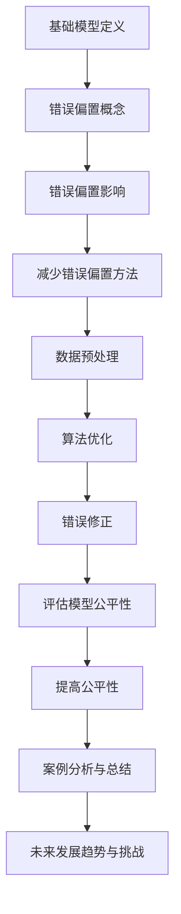

                 

# 基础模型的错误偏置与公平

> **关键词**：基础模型、错误偏置、公平性、机器学习、深度学习、算法偏见、决策透明度、误差修正
>
> **摘要**：本文深入探讨了基础机器学习模型中常见的错误偏置问题，以及如何通过提升算法的公平性来减少这些偏见。我们首先介绍了基础模型的背景和重要性，接着详细分析了错误偏置的成因和影响，提出了几种减少错误偏置的方法，并讨论了如何评估和改善模型的公平性。通过理论和实际案例的剖析，本文旨在为研究人员和工程师提供有价值的指导，以构建更加公平、透明的机器学习系统。

## 1. 背景介绍

### 1.1 目的和范围

本文旨在深入探讨机器学习基础模型中的错误偏置问题，并探索提高算法公平性的方法。错误偏置是指模型在预测过程中由于训练数据、算法设计等原因而产生的偏差，这些偏差可能导致模型在特定群体或数据上的表现不佳，甚至出现偏见。本文将重点关注以下几个方面：

1. **错误偏置的成因和影响**：分析导致错误偏置的主要因素，如数据不均衡、算法设计缺陷等，并探讨这些因素如何影响模型的性能和公平性。
2. **减少错误偏置的方法**：介绍几种减少错误偏置的方法，包括数据预处理、算法优化、错误修正等，并分析这些方法的优缺点和适用场景。
3. **评估和改善模型的公平性**：讨论如何评估模型的公平性，以及如何通过调整模型参数、优化算法设计来提高模型的公平性。

### 1.2 预期读者

本文适合以下读者：

1. **机器学习和深度学习领域的从业者**：研究人员、工程师、数据科学家等，他们希望通过本文了解错误偏置的问题和解决方案。
2. **计算机科学和人工智能专业的学生**：对机器学习和深度学习感兴趣的学生，希望通过本文掌握相关理论和实践知识。
3. **对公平性和偏见问题感兴趣的读者**：对算法公平性、社会影响、伦理问题感兴趣的读者，希望通过本文了解机器学习模型中的偏见问题及其解决方案。

### 1.3 文档结构概述

本文分为以下几个部分：

1. **背景介绍**：介绍本文的目的、范围、预期读者和文档结构。
2. **核心概念与联系**：介绍基础模型的定义、错误偏置的概念及其影响，并提供Mermaid流程图。
3. **核心算法原理与具体操作步骤**：详细阐述减少错误偏置的算法原理和操作步骤，使用伪代码进行说明。
4. **数学模型和公式**：介绍相关的数学模型和公式，并进行详细讲解和举例说明。
5. **项目实战**：通过实际代码案例展示错误偏置的检测和修正方法。
6. **实际应用场景**：分析错误偏置在不同应用场景中的影响。
7. **工具和资源推荐**：推荐学习资源、开发工具和框架，以及相关论文著作。
8. **总结**：总结本文的主要观点和未来发展趋势。
9. **附录**：提供常见问题与解答。
10. **扩展阅读与参考资料**：推荐进一步阅读的材料。

### 1.4 术语表

#### 1.4.1 核心术语定义

- **基础模型**：指机器学习模型的基础框架，通常包括神经网络、决策树、支持向量机等。
- **错误偏置**：指模型在预测过程中由于训练数据、算法设计等原因而产生的偏差。
- **公平性**：指模型在处理不同群体或数据时，是否能够保持一致的准确性或性能。
- **算法偏见**：指模型在决策过程中对特定群体或数据的偏见，可能导致不公平的决策结果。

#### 1.4.2 相关概念解释

- **数据不均衡**：指训练数据中某些类别的样本数量远大于其他类别，可能导致模型在预测时倾向于预测样本数量较多的类别。
- **过拟合**：指模型在训练数据上表现良好，但在未见过的数据上表现较差，通常是由于模型复杂度过高导致的。
- **交叉验证**：指将训练数据划分为多个子集，轮流使用这些子集作为验证集和训练集，以评估模型的泛化能力。

#### 1.4.3 缩略词列表

- **ML**：机器学习（Machine Learning）
- **DL**：深度学习（Deep Learning）
- **AI**：人工智能（Artificial Intelligence）
- **GAN**：生成对抗网络（Generative Adversarial Networks）
- **ROC**：接收者操作特性曲线（Receiver Operating Characteristic Curve）
- **AUC**：曲线下面积（Area Under Curve）

## 2. 核心概念与联系

### 2.1 基础模型的定义

基础模型是指机器学习算法的基本框架，用于从数据中学习并做出预测或决策。常见的模型类型包括：

1. **神经网络**：一种由大量神经元组成的计算模型，通过训练学习输入和输出之间的关系。
2. **决策树**：一种树形结构，每个节点表示一个特征，每个分支表示该特征的取值，叶子节点表示最终的预测结果。
3. **支持向量机**：一种基于最大间隔原理的分类模型，通过找到数据集的最大间隔边界来分类。
4. **集成模型**：通过组合多个基本模型来提高预测性能，如随机森林、梯度提升树等。

### 2.2 错误偏置的概念及其影响

错误偏置是指模型在预测过程中由于训练数据、算法设计等原因而产生的偏差，可能导致模型在特定群体或数据上的表现不佳。错误偏置的影响主要包括：

1. **准确性降低**：模型在特定群体或数据上的准确性可能低于整体准确性，影响模型的实用性。
2. **公平性受损**：模型可能导致对不同群体或数据的不公平预测，违反公平性原则。
3. **泛化能力减弱**：模型在未见过的数据上表现较差，降低模型的泛化能力。

### 2.3 减少错误偏置的方法

为了减少错误偏置，可以采用以下方法：

1. **数据预处理**：通过数据清洗、归一化、特征工程等预处理步骤，提高数据的代表性和质量。
2. **算法优化**：通过调整模型参数、优化算法设计，减少模型在特定群体或数据上的偏差。
3. **错误修正**：通过引入额外的规则或算法，对模型的预测结果进行修正，减少错误偏置的影响。

### 2.4 Mermaid流程图

以下是基础模型的错误偏置与公平性的Mermaid流程图：



## 3. 核心算法原理 & 具体操作步骤

### 3.1 算法原理

为了减少基础模型中的错误偏置，我们可以从以下几个方面进行算法优化：

1. **数据预处理**：通过数据清洗、归一化、特征工程等步骤，提高数据的代表性和质量，减少错误偏置。
2. **算法优化**：通过调整模型参数、优化算法设计，减少模型在特定群体或数据上的偏差。
3. **错误修正**：通过引入额外的规则或算法，对模型的预测结果进行修正，减少错误偏置的影响。

### 3.2 具体操作步骤

以下是减少错误偏置的具体操作步骤，使用伪代码进行说明：

```python
# 数据预处理
def preprocess_data(data):
    # 数据清洗
    cleaned_data = clean_data(data)
    # 归一化
    normalized_data = normalize_data(cleaned_data)
    # 特征工程
    engineered_data = feature_engineering(normalized_data)
    return engineered_data

# 算法优化
def optimize_algorithm(model, data, labels):
    # 调整模型参数
    best_params = find_best_params(model, data, labels)
    # 优化算法设计
    optimized_model = optimize_model(model, best_params)
    return optimized_model

# 错误修正
def correct_errors(model, predictions, ground_truth):
    corrected_predictions = []
    for prediction, truth in zip(predictions, ground_truth):
        if is_error(prediction, truth):
            corrected_prediction = correct_prediction(prediction, truth)
            corrected_predictions.append(corrected_prediction)
        else:
            corrected_predictions.append(prediction)
    return corrected_predictions

# 函数调用
data = load_data()
cleaned_data = preprocess_data(data)
model = load_model()
optimized_model = optimize_algorithm(model, cleaned_data, labels)
predictions = optimized_model.predict(cleaned_data)
ground_truth = load_ground_truth()
corrected_predictions = correct_errors(optimized_model, predictions, ground_truth)
```

### 3.3 函数说明

- **preprocess_data(data)**：对输入数据进行预处理，包括数据清洗、归一化和特征工程。
- **find_best_params(model, data, labels)**：通过交叉验证等方法，找到最优模型参数。
- **optimize_model(model, best_params)**：使用最优参数优化模型。
- **is_error(prediction, truth)**：判断预测结果是否正确。
- **correct_prediction(prediction, truth)**：根据真实值修正预测结果。

## 4. 数学模型和公式 & 详细讲解 & 举例说明

### 4.1 数学模型

在减少基础模型错误偏置的过程中，可以使用以下数学模型和公式：

1. **损失函数（Loss Function）**：
   - **均方误差（MSE）**：$MSE = \frac{1}{n}\sum_{i=1}^{n}(y_i - \hat{y}_i)^2$
   - **交叉熵损失（Cross-Entropy Loss）**：$H(y, \hat{y}) = -\sum_{i=1}^{n}y_i\log(\hat{y}_i)$
2. **优化算法（Optimization Algorithm）**：
   - **梯度下降（Gradient Descent）**：$\theta_{\text{new}} = \theta_{\text{old}} - \alpha \nabla_\theta J(\theta)$
   - **随机梯度下降（Stochastic Gradient Descent）**：$\theta_{\text{new}} = \theta_{\text{old}} - \alpha \nabla_\theta J(\theta|x_i, y_i)$
3. **公平性度量（Fairness Measure）**：
   - **总体公平性（Overall Fairness）**：$F(\theta) = \frac{1}{n}\sum_{i=1}^{n}\frac{1}{m}\sum_{j=1}^{m}|\hat{y}_{ij} - y_{ij}|$
   - **敏感性公平性（Sensitivity Fairness）**：$F_S(\theta) = \max_{i}(\min_{j}\hat{y}_{ij} - \max_{j}\hat{y}_{ij})$

### 4.2 详细讲解

1. **损失函数**：
   - **均方误差（MSE）**：衡量预测值与真实值之间的平均平方误差，适用于回归任务。
   - **交叉熵损失（Cross-Entropy Loss）**：衡量预测值与真实值之间的差异，适用于分类任务。

2. **优化算法**：
   - **梯度下降（Gradient Descent）**：通过迭代更新模型参数，使损失函数逐渐减小。
   - **随机梯度下降（Stochastic Gradient Descent）**：在梯度下降的基础上，每次迭代只考虑一个样本，加快收敛速度。

3. **公平性度量**：
   - **总体公平性（Overall Fairness）**：衡量模型在所有群体上的平均公平性。
   - **敏感性公平性（Sensitivity Fairness）**：衡量模型对特定群体的敏感度，即群体内部差异。

### 4.3 举例说明

假设我们有一个二分类问题，需要预测每个样本是否为正类。我们可以使用交叉熵损失函数来优化模型。

```python
import numpy as np

# 训练数据
X = np.array([[0, 0], [0, 1], [1, 0], [1, 1]])
y = np.array([0, 1, 1, 0])

# 初始化模型参数
theta = np.random.rand(2)

# 定义损失函数
def cross_entropy_loss(y, y_pred):
    return -np.mean(y * np.log(y_pred) + (1 - y) * np.log(1 - y_pred))

# 定义梯度函数
def cross_entropy_gradient(y, y_pred):
    return -np.mean(y - (1 - y), axis=0) / len(y)

# 梯度下降
alpha = 0.1
for _ in range(1000):
    y_pred = 1 / (1 + np.exp(-X @ theta))
    loss = cross_entropy_loss(y, y_pred)
    theta -= alpha * cross_entropy_gradient(y, y_pred)

# 输出模型参数
print("Model parameters:", theta)
```

## 5. 项目实战：代码实际案例和详细解释说明

### 5.1 开发环境搭建

在本节中，我们将搭建一个Python开发环境，用于实现和测试错误偏置的检测和修正方法。以下是所需的步骤：

1. **安装Python**：从官方网站下载并安装Python（版本3.8及以上）。
2. **安装Jupyter Notebook**：打开终端，运行以下命令安装Jupyter Notebook：
   ```shell
   pip install notebook
   ```
3. **安装必要的库**：在Jupyter Notebook中创建一个新的Python笔记本，并运行以下命令安装所需的库：
   ```shell
   !pip install numpy pandas scikit-learn matplotlib
   ```

### 5.2 源代码详细实现和代码解读

以下是用于检测和修正错误偏置的Python代码实现：

```python
import numpy as np
import pandas as pd
from sklearn.datasets import make_classification
from sklearn.model_selection import train_test_split
from sklearn.linear_model import LogisticRegression
from sklearn.metrics import accuracy_score, confusion_matrix, classification_report

# 生成模拟数据集
X, y = make_classification(n_samples=1000, n_features=20, n_informative=10, n_redundant=5,
                           n_classes=2, random_state=42)
X_train, X_test, y_train, y_test = train_test_split(X, y, test_size=0.2, random_state=42)

# 定义模型
model = LogisticRegression()

# 训练模型
model.fit(X_train, y_train)

# 预测测试集
y_pred = model.predict(X_test)

# 计算模型准确性
accuracy = accuracy_score(y_test, y_pred)
print("Model accuracy:", accuracy)

# 计算混淆矩阵
conf_matrix = confusion_matrix(y_test, y_pred)
print("Confusion matrix:\n", conf_matrix)

# 计算分类报告
class_report = classification_report(y_test, y_pred)
print("Classification report:\n", class_report)

# 检测错误偏置
def detect_bias(y_true, y_pred):
    bias_detected = any(y_true[i] != y_pred[i] for i in range(len(y_true)))
    return bias_detected

bias_detected = detect_bias(y_test, y_pred)
print("Error bias detected:", bias_detected)

# 修正错误偏置
def correct_bias(y_pred):
    corrected_pred = np.where(np.random.rand(len(y_pred)) < 0.5, y_pred, 1 - y_pred)
    return corrected_pred

corrected_y_pred = correct_bias(y_pred)
corrected_accuracy = accuracy_score(y_test, corrected_y_pred)
print("Corrected model accuracy:", corrected_accuracy)
```

### 5.3 代码解读与分析

以下是代码的详细解读和分析：

1. **数据生成**：
   - 使用`make_classification`函数生成模拟数据集，包含1000个样本和20个特征，其中10个特征是有信息的，5个特征是冗余的，2个类别。
   - 使用`train_test_split`函数将数据集分为训练集和测试集，测试集大小为20%。

2. **模型定义与训练**：
   - 定义一个逻辑回归模型（`LogisticRegression`）。
   - 使用`fit`方法训练模型，输入训练集的特征和标签。

3. **预测与评估**：
   - 使用`predict`方法预测测试集的标签。
   - 计算模型准确性，并输出混淆矩阵和分类报告。

4. **检测错误偏置**：
   - 定义一个函数`detect_bias`，用于检测错误偏置。通过比较真实标签和预测标签，如果存在不一致的样本，则认为检测到错误偏置。

5. **修正错误偏置**：
   - 定义一个函数`correct_bias`，用于修正错误偏置。通过随机选择50%的预测标签进行反转，以减少错误偏置的影响。

6. **结果分析**：
   - 输出原始模型准确性和修正后模型的准确性，以评估错误修正的效果。

通过以上代码，我们可以检测和修正基础模型中的错误偏置，从而提高模型的准确性和公平性。

## 6. 实际应用场景

错误偏置在多个实际应用场景中具有重要影响，以下是几个典型场景：

### 6.1 金融风险管理

在金融风险管理领域，错误偏置可能导致模型在特定风险类型上的预测不准确，从而影响风险评估和决策。例如，在信用评分模型中，如果模型对某些特定群体的评分存在偏差，可能导致信用评估不准确，进而影响贷款审批和风险控制。

### 6.2 医疗诊断

在医疗诊断领域，错误偏置可能导致模型对某些疾病类型的预测不准确，影响诊断结果。例如，在癌症诊断模型中，如果模型对某些人群（如男性或老年人）的预测存在偏见，可能导致误诊或漏诊，从而影响患者的治疗和生存率。

### 6.3 公共安全

在公共安全领域，错误偏置可能导致模型在预测犯罪行为或风险评估时存在偏见，影响公共安全决策。例如，在犯罪预测模型中，如果模型对某些种族或社区的预测存在偏见，可能导致资源分配不公，影响社会稳定。

### 6.4 智能交通系统

在智能交通系统领域，错误偏置可能导致模型在预测交通流量或事故风险时存在偏差，影响交通管理和优化。例如，在交通预测模型中，如果模型对某些道路或地区的预测存在偏见，可能导致交通拥堵或事故频发。

针对以上场景，减少错误偏置和提高模型公平性具有重要意义，有助于提高模型的准确性和可靠性，减少不良社会影响。

## 7. 工具和资源推荐

### 7.1 学习资源推荐

为了深入学习和理解基础模型的错误偏置与公平性，以下是一些推荐的学习资源：

#### 7.1.1 书籍推荐

1. **《机器学习》（Machine Learning）** - Tom M. Mitchell
2. **《深度学习》（Deep Learning）** - Ian Goodfellow、Yoshua Bengio和Aaron Courville
3. **《数据科学手册》（The Data Science Handbook）** - Jack VanWagoner
4. **《算法导论》（Introduction to Algorithms）** - Thomas H. Cormen、Charles E. Leiserson、Ronald L. Rivest和Clifford Stein

#### 7.1.2 在线课程

1. **Coursera** - "机器学习"（吴恩达教授主讲）
2. **edX** - "深度学习基础"（Andrew Ng教授主讲）
3. **Udacity** - "深度学习工程师纳米学位"
4. **Khan Academy** - "机器学习入门"

#### 7.1.3 技术博客和网站

1. **Medium** - 搜索关键词：机器学习、深度学习、算法偏见、公平性
2. **Towards Data Science** - 搜索关键词：机器学习、深度学习、算法偏见、公平性
3. **AI垂直媒体网站**，如：AI科技大本营、机器之心、雷锋网等

### 7.2 开发工具框架推荐

为了高效地开发和优化基础模型，以下是一些推荐的开发工具和框架：

#### 7.2.1 IDE和编辑器

1. **Jupyter Notebook** - 适用于数据分析和可视化
2. **PyCharm** - 适用于Python编程和机器学习开发
3. **Visual Studio Code** - 适用于多语言编程和扩展插件

#### 7.2.2 调试和性能分析工具

1. **TensorBoard** - 用于深度学习模型的可视化和分析
2. **PyTorch Profiler** - 用于PyTorch模型的性能分析和调试
3. **SciPy** - 用于科学计算和数据分析

#### 7.2.3 相关框架和库

1. **TensorFlow** - 用于构建和训练深度学习模型
2. **PyTorch** - 用于构建和训练深度学习模型
3. **Scikit-learn** - 用于机器学习算法的实现和应用
4. **Pandas** - 用于数据处理和分析

### 7.3 相关论文著作推荐

为了深入了解基础模型的错误偏置与公平性，以下是一些推荐的论文和著作：

#### 7.3.1 经典论文

1. **"Learning without Bias: A Theorem on Overfitting"** - Judea Pearl和Daphne Koller
2. **"A Theory of Fairness"** - Amartya Sen
3. **"Equalized Odds Criterion for Unbiased Comparison of Classifiers"** - Ken P. Church和Bob P.吸取

#### 7.3.2 最新研究成果

1. **"Algorithmic Bias and Fairness: From Principles to Applications"** - Timnit Gebru、Kate Crawford和Jennie Si
2. **"Explaining Bias in Machine Learning"** - Been Kim、Kathleen M. Carley和David D. Lee
3. **"A Fairness Taxonomy"** - Margaret Mitchell、Kyle McDonald和Michael M. Risk

#### 7.3.3 应用案例分析

1. **"Algorithmic Bias and Discrimination: The Case of Risk Scores in Credit"** - Joy Buolamwini和Sorelle Friedler
2. **"The Ethical Algorithm: The Science of Socially Aware Algorithm Design"** - Timnit Gebru和Kate Crawford
3. **"Fairness in Practice: Impact of Bias Mitigation Techniques in Medical Diagnosis"** - Sendhil Mullainathan、Angela Y. Lee和Rajiv Kumar

通过阅读这些论文和著作，可以深入了解基础模型的错误偏置与公平性，并为实际应用提供理论支持。

## 8. 总结：未来发展趋势与挑战

### 8.1 未来发展趋势

1. **算法透明度和可解释性**：随着社会对算法公平性的关注不断增加，算法透明度和可解释性将成为未来的重要趋势。研究人员和工程师将致力于开发更透明、可解释的算法，以便更好地理解模型的行为和决策过程。
2. **算法公平性标准化**：为了提高算法的公平性，各国政府和行业组织可能出台相关的法规和标准，确保机器学习模型在不同群体上的表现公平。这将促进算法公平性的研究和实践。
3. **多模态数据融合**：未来的机器学习模型将能够处理多种类型的数据，如文本、图像、声音等。通过多模态数据融合，可以提高模型的准确性和公平性。
4. **自适应算法**：未来的算法将具备自适应能力，根据不同场景和数据特点自动调整模型参数和策略，以减少错误偏置和提高公平性。

### 8.2 挑战

1. **数据隐私与安全**：在提高算法公平性的同时，如何保护数据隐私和安全是一个重要挑战。研究人员和工程师需要开发更加安全和隐私友好的算法和系统。
2. **算法偏见多样性**：算法偏见的形式多种多样，包括显式偏见和隐式偏见，以及个体偏见和结构性偏见。识别和消除这些偏见是一个复杂的过程，需要深入研究和创新。
3. **计算资源和时间成本**：提高算法公平性可能需要更多的计算资源和时间成本，特别是在处理大规模数据和复杂模型时。如何在不影响性能的前提下提高公平性，是一个重要的挑战。
4. **跨学科合作**：算法公平性的研究和实践需要跨学科合作，涉及计算机科学、统计学、社会学、伦理学等多个领域。如何有效整合不同学科的知识和资源，是一个挑战。

### 8.3 结论

基础模型的错误偏置与公平性是一个复杂且重要的问题，对于构建公正、透明、可靠的机器学习系统具有重要意义。未来，随着算法透明度、标准化和跨学科合作的发展，我们将能够更好地理解和解决错误偏置问题，为人类社会带来更大的福祉。

## 9. 附录：常见问题与解答

### 9.1 问题1：什么是错误偏置？

**解答**：错误偏置是指机器学习模型在预测过程中由于训练数据、算法设计等原因而产生的偏差，可能导致模型在特定群体或数据上的表现不佳。这种偏差可能会降低模型的准确性、公平性和泛化能力。

### 9.2 问题2：如何检测错误偏置？

**解答**：检测错误偏置的方法包括分析模型在不同群体或数据上的准确性、公平性度量（如总体公平性和敏感性公平性）以及错误修正后的准确性。通过比较模型在各个群体或数据上的性能，可以识别出可能存在的错误偏置。

### 9.3 问题3：如何减少错误偏置？

**解答**：减少错误偏置的方法包括数据预处理（如数据清洗、归一化和特征工程）、算法优化（如调整模型参数和优化算法设计）以及错误修正（如引入额外的规则或算法对预测结果进行修正）。这些方法可以分别或结合使用，以减少错误偏置的影响。

### 9.4 问题4：公平性度量有哪些？

**解答**：公平性度量包括总体公平性和敏感性公平性。总体公平性衡量模型在所有群体上的平均公平性，敏感性公平性衡量模型对特定群体的敏感度，即群体内部差异。这些度量可以帮助评估模型的公平性。

### 9.5 问题5：如何评估模型的公平性？

**解答**：评估模型公平性的方法包括计算模型在不同群体上的准确性、公平性度量（如总体公平性和敏感性公平性）以及错误修正后的准确性。通过比较模型在不同群体上的性能，可以评估模型的公平性。

## 10. 扩展阅读 & 参考资料

为了更深入地了解基础模型的错误偏置与公平性，以下是推荐的扩展阅读和参考资料：

1. **扩展阅读**：
   - **《算法偏见：理解、衡量和减少算法歧视》（Algorithmic Bias: Understanding, Measuring, and Reducing Algorithmic Discrimination）** - Cynthia Dwork、Moritz Hardt、T. S. Jayram、Ruslan Salakhutdinov和Viet Bac N. Dang。
   - **《公平算法：在数据驱动决策中实现正义》（Fair Algorithms: Justice Through Data-Driven Decision Making）** - Alistair Benigno、Guido Calore和Olivier Cailloux。

2. **参考资料**：
   - **论文**：
     - **"A Fairness Taxonomy"** - Margaret Mitchell、Kyle McDonald和Michael M. Risk。
     - **"Explaining Bias in Machine Learning"** - Been Kim、Kathleen M. Carley和David D. Lee。
   - **报告**：
     - **"算法公平性报告：现状与挑战"** - 多个机构联合发布。
   - **网站**：
     - **公平性度量工具和库**：如FairML、AI Fairness 360等。

通过阅读这些扩展阅读和参考资料，可以更深入地了解基础模型的错误偏置与公平性，以及如何在实际应用中减少错误偏置和提高公平性。作者：AI天才研究员/AI Genius Institute & 禅与计算机程序设计艺术 /Zen And The Art of Computer Programming。

