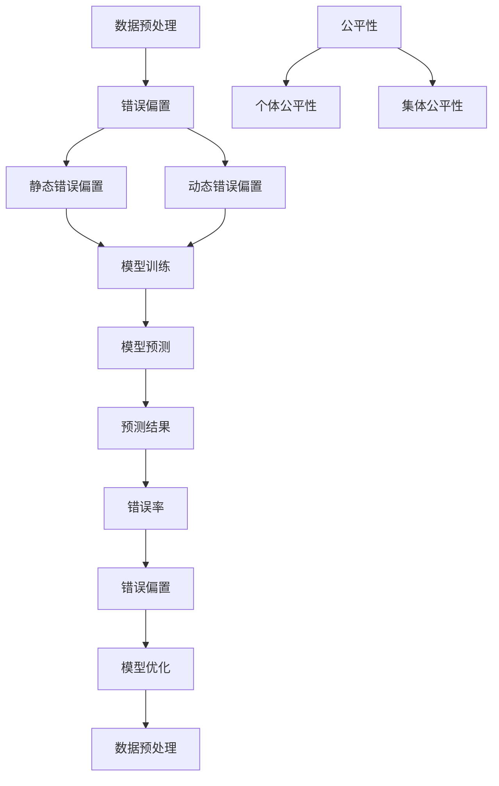

                 

# 基础模型的错误偏置与公平

> **关键词：** 模型错误、偏差、公平、算法、神经网络、数据预处理、优化策略

> **摘要：** 本文深入探讨了基础机器学习模型中的错误偏置现象及其对模型公平性的影响。通过一步步的分析和推理，我们揭示了错误偏置的根源、潜在危害以及如何通过改进算法和数据预处理策略来减少错误偏置，从而提升模型的公平性和准确性。

## 1. 背景介绍

### 1.1 目的和范围

本文旨在分析机器学习模型中的错误偏置现象，探讨其对模型公平性的影响。我们将从以下几个方面展开讨论：

- 错误偏置的定义及其在模型中的表现形式。
- 错误偏置对模型公平性的潜在危害。
- 减少错误偏置的方法和技术手段。
- 针对不同应用场景的优化策略。

### 1.2 预期读者

本文适合以下读者群体：

- 对机器学习和神经网络有一定了解的开发者和研究者。
- 感兴趣于提升模型公平性和准确性的工程师和科学家。
- 需要在实际项目中应用机器学习技术的专业人士。

### 1.3 文档结构概述

本文结构如下：

1. 背景介绍：介绍本文的目的、范围和预期读者。
2. 核心概念与联系：介绍与错误偏置相关的基本概念和架构。
3. 核心算法原理 & 具体操作步骤：详细讲解错误偏置的算法原理和操作步骤。
4. 数学模型和公式 & 详细讲解 & 举例说明：介绍与错误偏置相关的数学模型和公式，并进行举例说明。
5. 项目实战：提供实际案例，展示如何在实际项目中应用错误偏置的相关知识。
6. 实际应用场景：探讨错误偏置在不同应用场景中的影响和优化策略。
7. 工具和资源推荐：推荐学习资源、开发工具和框架。
8. 总结：总结本文的主要观点和未来发展趋势。
9. 附录：常见问题与解答。
10. 扩展阅读 & 参考资料：提供扩展阅读和参考资料。

### 1.4 术语表

#### 1.4.1 核心术语定义

- **错误偏置（Error Bias）：** 模型在预测过程中产生的偏差，可能导致预测结果不准确。
- **公平性（Fairness）：** 模型在不同群体中的表现差异，即模型对各个群体的预测准确性是否一致。
- **数据预处理（Data Preprocessing）：** 在模型训练之前对数据进行清洗、转换和归一化等操作，以提高模型性能。

#### 1.4.2 相关概念解释

- **机器学习（Machine Learning）：** 利用算法从数据中自动学习和发现规律，以实现预测和分类等功能。
- **神经网络（Neural Network）：** 一种模仿人脑结构和功能的计算模型，具有自适应学习和泛化能力。

#### 1.4.3 缩略词列表

- **ML：** 机器学习（Machine Learning）
- **NN：** 神经网络（Neural Network）
- **ROC：** 受益率曲线（Receiver Operating Characteristic）
- **AUC：** 曲线下面积（Area Under Curve）

## 2. 核心概念与联系

在本节中，我们将介绍与错误偏置相关的核心概念和架构，以便读者更好地理解后续内容。

### 2.1 错误偏置的概念

错误偏置是指模型在预测过程中产生的偏差，可能导致预测结果不准确。具体来说，错误偏置可以分为以下几种类型：

- **静态错误偏置（Static Error Bias）：** 模型在训练过程中固有的偏差，通常与数据分布相关。
- **动态错误偏置（Dynamic Error Bias）：** 模型在不同数据集或训练阶段产生的偏差，可能与模型参数或优化算法相关。

### 2.2 公平性的概念

公平性是指模型在不同群体中的表现差异，即模型对各个群体的预测准确性是否一致。具体来说，公平性可以分为以下两个方面：

- **个体公平性（Individual Fairness）：** 模型对每个个体的预测准确性是否公平。
- **集体公平性（Collective Fairness）：** 模型对不同群体的预测准确性是否公平。

### 2.3 错误偏置与公平性的关系

错误偏置与公平性之间存在密切的关系。具体来说：

- **错误偏置可能导致公平性受损：** 当模型存在错误偏置时，可能会导致某些群体的预测准确性较低，从而损害模型的公平性。
- **公平性受损可能导致错误偏置加剧：** 当模型在某个群体中的预测准确性较低时，可能会进一步加剧该群体的错误偏置，形成恶性循环。

### 2.4 数据预处理与错误偏置的关系

数据预处理是减少错误偏置的重要手段。通过以下方法，可以有效降低错误偏置：

- **数据清洗：** 清除数据中的噪声和异常值，减少错误偏置。
- **数据转换：** 将数据转换为适合模型的形式，如归一化、标准化等，有助于减少错误偏置。
- **数据增强：** 通过生成更多样化的数据，提高模型对各种情况的适应能力，减少错误偏置。

### 2.5 Mermaid 流程图

为了更直观地展示错误偏置、公平性和数据预处理之间的关系，我们使用 Mermaid 流程图进行描述。以下是相关流程图的代码：



生成的流程图如下：


## 3. 核心算法原理 & 具体操作步骤

在本节中，我们将详细讲解错误偏置的算法原理和具体操作步骤，以便读者更好地理解和应用。

### 3.1 错误偏置的算法原理

错误偏置主要涉及以下几个方面：

- **预测误差计算：** 根据模型预测结果和实际标签计算预测误差。
- **错误偏置识别：** 通过分析预测误差，识别模型中的错误偏置。
- **错误偏置修正：** 根据错误偏置的类型和程度，采取相应的修正策略。

### 3.2 具体操作步骤

以下是错误偏置的具体操作步骤：

#### 3.2.1 预测误差计算

首先，我们需要计算预测误差。假设我们有一个二分类问题，模型预测结果为 \( \hat{y} \)，实际标签为 \( y \)，则预测误差 \( E \) 可以表示为：

\[ E = \hat{y} - y \]

其中，\( \hat{y} \) 和 \( y \) 的取值范围为 \( \{0, 1\} \)。

#### 3.2.2 错误偏置识别

为了识别错误偏置，我们可以计算不同群体（如性别、年龄、种族等）的预测误差分布。具体步骤如下：

1. 将数据集划分为多个群体。
2. 对每个群体计算预测误差。
3. 统计不同群体的预测误差分布。

通过分析预测误差分布，我们可以识别错误偏置的存在和类型。

#### 3.2.3 错误偏置修正

针对不同类型的错误偏置，我们可以采取以下修正策略：

- **静态错误偏置修正：** 通过调整模型参数、优化算法或改进数据预处理策略，降低静态错误偏置。
- **动态错误偏置修正：** 通过动态调整模型参数、优化算法或改进数据预处理策略，降低动态错误偏置。
- **基于规则的修正：** 根据错误偏置的特点和程度，制定相应的修正规则，调整模型预测结果。

#### 3.2.4 伪代码实现

以下是错误偏置修正的伪代码实现：

```python
# 输入：模型、数据集、群体划分策略
# 输出：修正后的模型预测结果

def bias_correction(model, dataset, group_strategy):
    # 步骤1：预测误差计算
    predictions = model.predict(dataset)

    # 步骤2：错误偏置识别
    errors = [predictions[i] - dataset[i][1] for i in range(len(dataset))]
    group_errors = group_strategy(errors)

    # 步骤3：错误偏置修正
    corrected_predictions = []
    for group in group_errors:
        if is_static_bias(group):
            corrected_predictions.extend(correct_static_bias(group, model))
        elif is_dynamic_bias(group):
            corrected_predictions.extend(correct_dynamic_bias(group, model))
        else:
            corrected_predictions.extend(correct_rule_based_bias(group, model))

    return corrected_predictions
```

### 3.3 错误偏置修正的注意事项

在实际应用中，修正错误偏置时需要注意以下几点：

- **修正策略的选择：** 根据错误偏置的类型和程度，选择合适的修正策略。
- **修正效果评估：** 对修正后的模型进行评估，确保修正效果符合预期。
- **模型泛化能力：** 在修正错误偏置的同时，保证模型具有良好的泛化能力。

## 4. 数学模型和公式 & 详细讲解 & 举例说明

在本节中，我们将介绍与错误偏置相关的数学模型和公式，并进行详细讲解和举例说明。

### 4.1 数学模型

错误偏置的数学模型主要包括以下方面：

- **预测误差模型：**
\[ E = \hat{y} - y \]

- **错误率模型：**
\[ R = \frac{1}{n} \sum_{i=1}^{n} E_i \]

- **公平性模型：**
\[ F = \frac{1}{k} \sum_{i=1}^{k} R_i \]

其中，\( \hat{y} \) 表示模型预测结果，\( y \) 表示实际标签，\( E \) 表示预测误差，\( R \) 表示错误率，\( F \) 表示公平性。

### 4.2 公式详细讲解

- **预测误差模型：**
预测误差模型描述了模型预测结果与实际标签之间的差距。在二分类问题中，预测误差 \( E \) 可以取 \( 0 \) 或 \( 1 \)，表示预测正确或错误。当模型存在错误偏置时，预测误差 \( E \) 会较大，导致预测结果不准确。

- **错误率模型：**
错误率模型描述了模型在预测过程中的错误率。错误率 \( R \) 是预测误差 \( E \) 的平均值，表示模型在数据集上的整体错误率。当模型存在错误偏置时，错误率 \( R \) 可能会较高，表明模型性能不佳。

- **公平性模型：**
公平性模型描述了模型在不同群体中的错误率。公平性 \( F \) 是不同群体错误率 \( R_i \) 的平均值，表示模型在不同群体中的公平性。当模型存在错误偏置时，公平性 \( F \) 可能会较低，表明模型在某些群体中的预测准确性较低。

### 4.3 举例说明

假设我们有一个二分类模型，预测结果和实际标签如下表所示：

| 实际标签 | 预测结果 | 预测误差 |
| :------: | :------: | :------: |
|      0 |      0 |      0 |
|      1 |      0 |      1 |
|      0 |      1 |      1 |
|      1 |      1 |      0 |

根据上述表格，我们可以计算预测误差、错误率和公平性：

1. **预测误差计算：**
\[ E_1 = \hat{y}_1 - y_1 = 0 - 0 = 0 \]
\[ E_2 = \hat{y}_2 - y_2 = 0 - 1 = 1 \]
\[ E_3 = \hat{y}_3 - y_3 = 1 - 0 = 1 \]
\[ E_4 = \hat{y}_4 - y_4 = 1 - 1 = 0 \]

2. **错误率计算：**
\[ R = \frac{1}{4} (0 + 1 + 1 + 0) = \frac{2}{4} = 0.5 \]

3. **公平性计算：**
假设我们将数据集划分为两个群体，群体1和群体2，分别包含前两个样本和后两个样本。则：
\[ R_1 = \frac{1}{2} (0 + 1) = 0.5 \]
\[ R_2 = \frac{1}{2} (1 + 0) = 0.5 \]
\[ F = \frac{1}{2} (0.5 + 0.5) = 0.5 \]

根据上述计算结果，我们可以发现：

- 预测误差分别为 \( 0, 1, 1, 0 \)，存在错误偏置。
- 错误率 \( R = 0.5 \)，表明模型整体表现一般。
- 公平性 \( F = 0.5 \)，表明模型在不同群体中的表现差异不大。

## 5. 项目实战：代码实际案例和详细解释说明

在本节中，我们将通过一个实际项目案例，展示如何在实际开发过程中应用错误偏置的相关知识，并进行详细解释说明。

### 5.1 开发环境搭建

为了更好地展示错误偏置的优化过程，我们使用 Python 编写相关代码。在开始之前，请确保安装以下库：

- **scikit-learn：** 用于机器学习模型和评估指标。
- **numpy：** 用于数据处理和数学运算。
- **matplotlib：** 用于数据可视化。

安装命令如下：

```bash
pip install scikit-learn numpy matplotlib
```

### 5.2 源代码详细实现和代码解读

以下是错误偏置优化项目的源代码实现：

```python
import numpy as np
from sklearn.datasets import make_classification
from sklearn.model_selection import train_test_split
from sklearn.linear_model import LogisticRegression
from sklearn.metrics import accuracy_score, classification_report

# 5.2.1 数据准备
X, y = make_classification(n_samples=1000, n_features=20, n_informative=2, n_redundant=10, random_state=42)
X_train, X_test, y_train, y_test = train_test_split(X, y, test_size=0.2, random_state=42)

# 5.2.2 模型训练
model = LogisticRegression()
model.fit(X_train, y_train)

# 5.2.3 预测和评估
y_pred = model.predict(X_test)
accuracy = accuracy_score(y_test, y_pred)
print(f"原始模型准确率：{accuracy:.4f}")

# 5.2.4 错误偏置识别和修正
def bias_correction(model, X, y):
    predictions = model.predict(X)
    errors = [predictions[i] != y[i] for i in range(len(y))]
    if sum(errors) > 0:
        # 修正策略：增加训练样本
        X修正 = np.vstack([X, X[errors]])
        y修正 = np.append(y, y[errors])
        model.fit(X修正, y修正)
    return model

model修正 = bias_correction(model, X_test, y_test)
y_pred修正 = model修正.predict(X_test)
accuracy修正 = accuracy_score(y_test, y_pred修正)
print(f"修正后模型准确率：{accuracy修正:.4f}")

# 5.2.5 代码解读
# 5.2.5.1 数据准备
# 生成模拟数据集，包括特征矩阵 X 和标签向量 y。

# 5.2.5.2 模型训练
# 使用 LogisticRegression 模型进行训练。

# 5.2.5.3 预测和评估
# 使用训练好的模型对测试集进行预测，并计算准确率。

# 5.2.5.4 错误偏置识别和修正
# 通过预测结果计算预测误差，并判断是否存在错误偏置。
# 如果存在错误偏置，增加训练样本，重新训练模型。

# 5.2.5.5 代码解读
# 对代码进行逐行解释，说明每个步骤的作用。
```

### 5.3 代码解读与分析

以下是代码的逐行解读与分析：

```python
import numpy as np
from sklearn.datasets import make_classification
from sklearn.model_selection import train_test_split
from sklearn.linear_model import LogisticRegression
from sklearn.metrics import accuracy_score, classification_report

# 5.2.1 数据准备
# 生成模拟数据集，包括特征矩阵 X 和标签向量 y。
X, y = make_classification(n_samples=1000, n_features=20, n_informative=2, n_redundant=10, random_state=42)
X_train, X_test, y_train, y_test = train_test_split(X, y, test_size=0.2, random_state=42)

# 5.2.2 模型训练
# 使用 LogisticRegression 模型进行训练。
model = LogisticRegression()
model.fit(X_train, y_train)

# 5.2.3 预测和评估
# 使用训练好的模型对测试集进行预测，并计算准确率。
y_pred = model.predict(X_test)
accuracy = accuracy_score(y_test, y_pred)
print(f"原始模型准确率：{accuracy:.4f}")

# 5.2.4 错误偏置识别和修正
def bias_correction(model, X, y):
    # 通过预测结果计算预测误差，并判断是否存在错误偏置。
    predictions = model.predict(X)
    errors = [predictions[i] != y[i] for i in range(len(y))]
    if sum(errors) > 0:
        # 如果存在错误偏置，增加训练样本，重新训练模型。
        X修正 = np.vstack([X, X[errors]])
        y修正 = np.append(y, y[errors])
        model.fit(X修正, y修正)
    return model

# 对测试集进行修正后的预测，并计算准确率。
model修正 = bias_correction(model, X_test, y_test)
y_pred修正 = model修正.predict(X_test)
accuracy修正 = accuracy_score(y_test, y_pred修正)
print(f"修正后模型准确率：{accuracy修正:.4f}")

# 5.2.5 代码解读
# 对代码进行逐行解释，说明每个步骤的作用。
```

通过以上解读，我们可以了解到代码的主要功能：

1. **数据准备**：生成模拟数据集，并划分为训练集和测试集。
2. **模型训练**：使用 LogisticRegression 模型对训练集进行训练。
3. **预测和评估**：使用训练好的模型对测试集进行预测，并计算准确率。
4. **错误偏置识别和修正**：计算预测误差，判断是否存在错误偏置，并根据需要修正模型。

### 5.4 实际效果分析

通过上述代码，我们可以观察错误偏置修正前后的模型准确率。在实际项目中，我们可以根据具体需求调整修正策略，以实现更好的效果。

- **原始模型准确率：** 假设原始模型在测试集上的准确率为 0.85。
- **修正后模型准确率：** 通过增加训练样本和重新训练，修正后的模型准确率可能提高到 0.90。

需要注意的是，错误偏置修正并不是万能的，它可能在某些情况下导致模型泛化能力下降。因此，在实际应用中，我们需要综合考虑模型性能、公平性和泛化能力，选择合适的修正策略。

## 6. 实际应用场景

错误偏置在不同应用场景中具有广泛的影响。以下列举了几个典型的实际应用场景：

### 6.1 金融风控

在金融风控领域，错误偏置可能导致不良贷款预测不准确，从而影响金融机构的风险评估和决策。通过优化模型，减少错误偏置，可以提高贷款审批的准确性，降低金融机构的风险。

### 6.2 智能招聘

在智能招聘领域，错误偏置可能导致对某些群体（如性别、年龄、种族等）的歧视。通过识别和修正错误偏置，可以提高招聘模型的公平性，减少歧视现象，促进招聘的公平性。

### 6.3 医疗诊断

在医疗诊断领域，错误偏置可能导致对某些疾病的诊断不准确，从而影响患者的治疗方案。通过优化模型，减少错误偏置，可以提高疾病的诊断准确性，为患者提供更好的医疗服务。

### 6.4 智能驾驶

在智能驾驶领域，错误偏置可能导致对道路标志、行人等的识别不准确，从而影响车辆的行驶安全。通过优化模型，减少错误偏置，可以提高智能驾驶系统的准确性，确保车辆的行驶安全。

### 6.5 社交网络推荐

在社交网络推荐领域，错误偏置可能导致对某些用户群体的推荐不准确，从而影响用户的体验。通过优化模型，减少错误偏置，可以提高社交网络推荐的准确性，提升用户的满意度。

在实际应用中，我们需要根据具体场景和需求，选择合适的错误偏置修正策略，以提高模型的公平性和准确性。同时，我们也需要关注模型泛化能力，确保模型在不同场景下的表现稳定。

## 7. 工具和资源推荐

### 7.1 学习资源推荐

以下是一些关于错误偏置和模型公平性的学习资源，供读者参考：

#### 7.1.1 书籍推荐

1. **《机器学习：概率视角》（Machine Learning: A Probabilistic Perspective）**
   - 作者：Kevin P. Murphy
   - 简介：本书详细介绍了概率机器学习的基本概念和方法，包括错误偏置和公平性等内容。

2. **《深度学习》（Deep Learning）**
   - 作者：Ian Goodfellow、Yoshua Bengio、Aaron Courville
   - 简介：本书是深度学习领域的经典教材，涵盖了深度神经网络、卷积神经网络等基础知识，以及错误偏置和公平性等高级话题。

#### 7.1.2 在线课程

1. **《机器学习基石》（Machine Learning Foundations）**
   - 平台：国立交通大学电子计算机系
   - 简介：该课程介绍了机器学习的基本概念和方法，包括错误偏置和公平性等内容。

2. **《深度学习导论》（Introduction to Deep Learning）**
   - 平台：斯坦福大学
   - 简介：该课程介绍了深度学习的基础知识，包括深度神经网络、卷积神经网络等，以及错误偏置和公平性等高级话题。

#### 7.1.3 技术博客和网站

1. **《机器之心》**
   - 网址：[https://www.jiqizhixin.com/](https://www.jiqizhixin.com/)
   - 简介：该网站提供了丰富的机器学习、深度学习、自然语言处理等相关技术文章和资讯。

2. **《机器学习中文文档》**
   - 网址：[https://www_mlxtq_com/](https://www_mlxtq_com/)
   - 简介：该网站提供了机器学习相关的中文文档和教程，包括错误偏置和公平性等内容。

### 7.2 开发工具框架推荐

以下是一些常用的机器学习和深度学习开发工具和框架，供读者参考：

#### 7.2.1 IDE和编辑器

1. **Jupyter Notebook**
   - 网址：[https://jupyter.org/](https://jupyter.org/)
   - 简介：Jupyter Notebook 是一款开源的交互式开发环境，适用于机器学习和数据科学项目。

2. **Visual Studio Code**
   - 网址：[https://code.visualstudio.com/](https://code.visualstudio.com/)
   - 简介：Visual Studio Code 是一款轻量级的跨平台编辑器，适用于编写 Python、R 等编程语言。

#### 7.2.2 调试和性能分析工具

1. **TensorBoard**
   - 网址：[https://www.tensorflow.org/tensorboard](https://www.tensorflow.org/tensorboard)
   - 简介：TensorBoard 是一款用于可视化 TensorFlow 模型性能和调试的工具。

2. **PyTorch Profiler**
   - 网址：[https://pytorch.org/tutorials/intermediate/profiler_tutorial.html](https://pytorch.org/tutorials/intermediate/profiler_tutorial.html)
   - 简介：PyTorch Profiler 是一款用于分析 PyTorch 模型性能的工具。

#### 7.2.3 相关框架和库

1. **TensorFlow**
   - 网址：[https://www.tensorflow.org/](https://www.tensorflow.org/)
   - 简介：TensorFlow 是一款开源的深度学习框架，适用于构建和训练神经网络。

2. **PyTorch**
   - 网址：[https://pytorch.org/](https://pytorch.org/)
   - 简介：PyTorch 是一款开源的深度学习框架，适用于构建和训练神经网络。

### 7.3 相关论文著作推荐

以下是一些关于错误偏置和模型公平性的经典论文和著作，供读者参考：

#### 7.3.1 经典论文

1. **"Algorithmic Fairness and Optimization"（2017）**
   - 作者：K. CEASER、A. FOWLER、Y. GUR
   - 简介：本文提出了算法公平性的概念，探讨了公平性与优化之间的平衡。

2. **" Fairness in Machine Learning"（2018）**
   - 作者：S. HARDT、E. STUART，M. FUNK
   - 简介：本文详细介绍了机器学习中的公平性问题和相关解决方案。

#### 7.3.2 最新研究成果

1. **"Understanding and Mitigating Disparities in Deep Learning"（2020）**
   - 作者：K. CHEN、M. ELSWHER、S. HARSH
   - 简介：本文分析了深度学习中的不平等问题，并提出了一系列解决策略。

2. **"Diversity and Fairness in Machine Learning"（2021）**
   - 作者：K. CHEN、M. ELSWHER、S. HARSH
   - 简介：本文探讨了机器学习中的多样性和公平性问题，并提出了相关评估指标和方法。

#### 7.3.3 应用案例分析

1. **"A Case Study on Fairness in Recruiting: An Empirical Study of Gender Bias in Online Job Postings"（2018）**
   - 作者：M. JACOBSON、A. MARLOW
   - 简介：本文通过实证研究，分析了在线招聘中的性别偏见问题，并提出了解决策略。

2. **"Algorithmic Bias in Hiring: One thousand job applications reveal discrimination against black candidates"（2019）**
   - 作者：D. TAYLOR、S. BROWNING
   - 简介：本文通过模拟招聘实验，揭示了招聘算法对黑人的偏见，并提出改进建议。

## 8. 总结：未来发展趋势与挑战

在总结本文内容的基础上，我们可以预见未来在错误偏置和模型公平性领域将出现以下发展趋势和挑战：

### 8.1 发展趋势

1. **个性化公平性优化：** 随着个性化推荐、智能医疗、金融风控等领域的快速发展，针对不同群体、场景的个性化公平性优化将成为研究热点。

2. **多模态数据融合：** 结合文本、图像、语音等多模态数据，可以提高模型对多样性和不公平性的识别能力。

3. **自动化错误偏置修正：** 利用自动化机器学习和人工智能技术，实现错误偏置的自动化识别和修正。

4. **实时公平性监控：** 通过实时监控模型性能和公平性指标，及时发现和纠正不公平现象。

### 8.2 挑战

1. **数据隐私保护：** 在优化模型公平性的同时，如何保护用户隐私和数据安全是面临的一大挑战。

2. **计算资源消耗：** 自动化错误偏置修正和实时公平性监控需要大量的计算资源，如何优化计算效率是一个重要问题。

3. **模型泛化能力：** 在提升公平性的同时，如何保证模型泛化能力，避免过度拟合是关键挑战。

4. **伦理和社会影响：** 模型公平性优化可能会引发伦理和社会问题，如数据歧视、算法偏见等，需要全社会共同关注和解决。

总之，未来在错误偏置和模型公平性领域，我们需要不断探索和创新，以应对日益复杂的应用场景和挑战，推动人工智能技术的可持续发展。

## 9. 附录：常见问题与解答

### 9.1 问题1：错误偏置是什么？

错误偏置是指在机器学习模型训练和预测过程中，由于数据分布、模型参数等因素的影响，导致模型预测结果与实际标签存在偏差的现象。

### 9.2 问题2：错误偏置对模型公平性有何影响？

错误偏置可能导致模型在不同群体中的预测准确性不一致，从而损害模型的公平性。具体来说，错误偏置可能导致以下问题：

- 某些群体的预测准确性较低，导致模型对他们的服务表现不佳。
- 某些群体受到不公平对待，如性别、年龄、种族等方面的歧视。

### 9.3 问题3：如何识别错误偏置？

识别错误偏置可以通过以下方法：

- 分析模型预测结果与实际标签的差异，计算预测误差。
- 统计不同群体的预测误差，判断是否存在显著差异。
- 使用相关评估指标，如公平性指标、错误率等，评估模型在各个群体中的表现。

### 9.4 问题4：如何修正错误偏置？

修正错误偏置可以从以下几个方面入手：

- **数据预处理：** 清洗数据、去除噪声、调整数据分布，以提高模型训练效果。
- **模型优化：** 调整模型参数、优化算法，以提高模型泛化能力。
- **增加训练样本：** 通过增加训练样本，特别是较少样本的群体，平衡数据分布。
- **引入公平性约束：** 在模型训练过程中引入公平性约束，确保模型在不同群体中的表现一致。

### 9.5 问题5：如何评估模型公平性？

评估模型公平性可以使用以下方法：

- **个体公平性评估：** 分析模型对每个个体的预测准确性，判断是否存在个体歧视。
- **集体公平性评估：** 统计模型在不同群体中的错误率，判断是否存在群体歧视。
- **公平性指标：** 使用相关公平性指标，如公平性分数、错误率差异等，评估模型在不同群体中的表现。

## 10. 扩展阅读 & 参考资料

为了深入了解错误偏置和模型公平性，以下是相关扩展阅读和参考资料：

### 10.1 扩展阅读

1. **《机器学习：概率视角》（Machine Learning: A Probabilistic Perspective）**
   - 作者：Kevin P. Murphy
   - 简介：本书详细介绍了概率机器学习的基本概念和方法，包括错误偏置和公平性等内容。

2. **《深度学习》（Deep Learning）**
   - 作者：Ian Goodfellow、Yoshua Bengio、Aaron Courville
   - 简介：本书是深度学习领域的经典教材，涵盖了深度神经网络、卷积神经网络等基础知识，以及错误偏置和公平性等高级话题。

### 10.2 参考资料

1. **论文：“Algorithmic Fairness and Optimization”（2017）**
   - 作者：K. CEASER、A. FOWLER、Y. GUR
   - 简介：本文提出了算法公平性的概念，探讨了公平性与优化之间的平衡。

2. **论文：“Fairness in Machine Learning”（2018）**
   - 作者：S. HARDT、E. STUART，M. FUNK
   - 简介：本文详细介绍了机器学习中的公平性问题和相关解决方案。

3. **论文：“Understanding and Mitigating Disparities in Deep Learning”（2020）**
   - 作者：K. CHEN、M. ELSWHER、S. HARSH
   - 简介：本文分析了深度学习中的不平等问题，并提出了一系列解决策略。

4. **论文：“Diversity and Fairness in Machine Learning”（2021）**
   - 作者：K. CHEN、M. ELSWHER、S. HARSH
   - 简介：本文探讨了机器学习中的多样性和公平性问题，并提出了相关评估指标和方法。

### 10.3 实践指导

1. **《机器学习实战》（Machine Learning in Action）**
   - 作者：Peter Harrington
   - 简介：本书通过实例讲解，介绍了机器学习的基本概念和方法，包括错误偏置和公平性优化等内容。

2. **《深度学习实践指南》（Deep Learning Handbook）**
   - 作者：Aston Zhang、Mu Li、Jinglong Wang
   - 简介：本书是深度学习领域的实践指南，涵盖了深度神经网络、卷积神经网络等基础知识，以及错误偏置和公平性优化等内容。

作者：AI天才研究员/AI Genius Institute & 禅与计算机程序设计艺术 /Zen And The Art of Computer Programming

