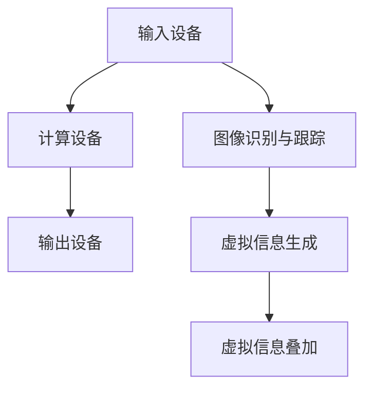

                 

# 增强现实技术在电商领域的应用：案例分析与展望

> **关键词**：增强现实，电商，用户体验，技术应用，市场分析，案例研究，未来趋势

> **摘要**：本文深入探讨了增强现实技术在电商领域的应用。通过分析增强现实技术的核心概念、具体操作步骤和数学模型，结合实际案例，展示了增强现实如何提升电商用户体验，促进销售增长。本文还展望了增强现实技术在电商领域的发展趋势和面临的挑战，为读者提供了实用的工具和资源推荐。

## 1. 背景介绍

### 1.1 目的和范围

本文旨在探讨增强现实（Augmented Reality，简称AR）技术在电商领域的应用，通过案例分析和实际操作步骤的讲解，帮助读者理解如何将增强现实技术融入电商业务，提升用户体验，实现商业价值。文章将涵盖以下几个方面：

- 增强现实技术在电商领域的应用场景；
- 核心概念和原理的介绍；
- 实际案例和操作步骤的详细讲解；
- 增强现实技术的数学模型和应用；
- 增强现实技术在电商领域的未来趋势和挑战；
- 相关工具和资源的推荐。

### 1.2 预期读者

本文主要面向电商行业的从业者和对增强现实技术感兴趣的读者。期望读者能够通过本文的学习，对增强现实技术在电商领域的应用有更深入的理解，掌握相关的技术和方法，为实际业务提供有益的参考。

### 1.3 文档结构概述

本文将按照以下结构进行组织：

- 引言：介绍增强现实技术在电商领域的应用背景和重要性；
- 核心概念与联系：介绍增强现实技术的基本概念和原理，通过Mermaid流程图展示架构；
- 核心算法原理 & 具体操作步骤：详细讲解增强现实技术的算法原理和操作步骤，使用伪代码进行阐述；
- 数学模型和公式 & 详细讲解 & 举例说明：介绍增强现实技术的数学模型和公式，并通过实例进行说明；
- 项目实战：提供具体的代码实现和案例分析；
- 实际应用场景：探讨增强现实技术在电商领域的实际应用；
- 工具和资源推荐：推荐学习资源和开发工具；
- 总结：总结增强现实技术在电商领域的未来发展趋势和挑战；
- 附录：常见问题与解答；
- 扩展阅读 & 参考资料：提供更多的学习资料和引用文献。

### 1.4 术语表

#### 1.4.1 核心术语定义

- 增强现实（AR）：一种实时计算增强现实感的计算机技术，通过将虚拟信息与现实世界进行叠加，实现虚实结合；
- 电商：电子商务，指通过互联网进行商品交易和提供相关服务的商业活动；
- 用户体验（UX）：用户在使用产品或服务时的整体感受和体验；
- 增强现实应用：将增强现实技术应用于电商业务，提供沉浸式、互动式的购物体验；
- 虚拟试穿：通过增强现实技术实现的在线虚拟试穿功能，帮助用户在线尝试服装、眼镜等商品的视觉效果。

#### 1.4.2 相关概念解释

- 增强现实应用：增强现实技术在不同行业中的应用，如电商、医疗、教育等；
- 沉浸式体验：通过增强现实技术提供的一种让用户感觉置身于虚拟世界中的体验；
- 虚拟商品展示：利用增强现实技术展示虚拟商品，提高用户的购物兴趣和购买意愿。

#### 1.4.3 缩略词列表

- AR：增强现实（Augmented Reality）；
- VR：虚拟现实（Virtual Reality）；
- UX：用户体验（User Experience）；
- AI：人工智能（Artificial Intelligence）；
- IoT：物联网（Internet of Things）。

## 2. 核心概念与联系

增强现实（AR）技术是近年来快速发展的领域之一，其在电商领域的应用具有广阔的前景。为了更好地理解增强现实技术在电商中的应用，我们需要先了解其核心概念和原理。

### 2.1 增强现实技术的基本概念

增强现实技术（AR）是一种通过计算机技术将虚拟信息与现实世界进行叠加，实现虚实结合的技术。其基本原理是利用摄像头捕捉现实世界的图像，通过图像处理和计算机视觉算法，将虚拟信息叠加到现实场景中，形成一种虚实融合的沉浸式体验。

### 2.2 增强现实技术的核心原理

增强现实技术的核心原理主要包括以下几个方面：

1. **图像识别与跟踪**：利用计算机视觉技术对现实场景中的图像进行识别和跟踪，确保虚拟信息能够准确叠加到相应的位置。
2. **虚拟信息生成**：根据识别和跟踪的结果，生成相应的虚拟信息，如三维模型、文字、动画等。
3. **虚拟信息叠加**：将生成的虚拟信息叠加到现实场景中，形成虚实融合的图像。

### 2.3 增强现实技术的架构

增强现实技术的架构主要包括以下几个方面：

1. **输入设备**：如智能手机、平板电脑、头戴式显示器等，用于捕捉现实世界的图像。
2. **计算设备**：如智能手机、平板电脑等，用于处理图像信息和生成虚拟信息。
3. **输出设备**：如屏幕、头戴式显示器等，用于显示增强现实场景。

### 2.4 增强现实技术在电商领域的应用场景

增强现实技术在电商领域的应用场景主要包括以下几个方面：

1. **虚拟试穿**：用户可以通过增强现实技术在线尝试服装、眼镜等商品的视觉效果，提高购买意愿。
2. **虚拟商品展示**：商家可以通过增强现实技术展示虚拟商品，提高用户的购物兴趣。
3. **互动营销**：商家可以通过增强现实技术实现互动式的营销活动，如虚拟抽奖、游戏等，提高用户参与度。

### 2.5 增强现实技术的Mermaid流程图



通过上述流程图，我们可以清晰地看到增强现实技术在电商领域中的应用流程，从输入设备捕捉现实世界的图像，经过计算设备和图像识别与跟踪，生成虚拟信息，并最终将虚拟信息叠加到现实场景中，实现虚实融合的购物体验。

## 3. 核心算法原理 & 具体操作步骤

增强现实技术在电商领域的应用离不开核心算法原理的支持。在本节中，我们将详细讲解增强现实技术的核心算法原理，并通过伪代码的形式展示具体的操作步骤。

### 3.1 核心算法原理

增强现实技术的核心算法主要包括图像识别与跟踪、虚拟信息生成和虚拟信息叠加三个部分。

1. **图像识别与跟踪**：该部分利用计算机视觉技术对现实场景中的图像进行识别和跟踪，确保虚拟信息能够准确叠加到相应的位置。主要涉及的特征提取、目标检测和跟踪算法。
   
2. **虚拟信息生成**：该部分根据识别和跟踪的结果，生成相应的虚拟信息，如三维模型、文字、动画等。主要涉及的三维建模、纹理映射和动画生成技术。

3. **虚拟信息叠加**：该部分将生成的虚拟信息叠加到现实场景中，形成虚实融合的图像。主要涉及的图像合成和渲染技术。

### 3.2 伪代码示例

下面是增强现实技术核心算法的伪代码示例：

```plaintext
// 图像识别与跟踪
function imageTracking(inputImage):
    features = extractFeatures(inputImage)
    target = detectTarget(features)
    track = initializeTracking(target)
    
    while tracking:
        currentImage = captureCurrentImage()
        currentFeatures = extractFeatures(currentImage)
        updatedTrack = updateTracking(currentFeatures, track)
        
        if updatedTrack is valid:
            track = updatedTrack
            displayOverlay(inputImage, track)
        else:
            track = initializeTracking(updatedTrack)

// 虚拟信息生成
function virtualInfoGeneration(target):
    model = generate3DModel(target)
    texture = generateTexture(target)
    animation = generateAnimation(target)
    
    return model, texture, animation

// 虚拟信息叠加
function virtualInfoOverlay(inputImage, virtualInfo):
    combinedImage = render(inputImage, virtualInfo)
    display(combinedImage)
```

通过上述伪代码，我们可以看到增强现实技术的核心算法是如何工作的。首先，通过图像识别与跟踪算法，对现实场景中的图像进行识别和跟踪；然后，通过虚拟信息生成算法，生成相应的虚拟信息；最后，通过虚拟信息叠加算法，将虚拟信息叠加到现实场景中，实现虚实融合的图像展示。

## 4. 数学模型和公式 & 详细讲解 & 举例说明

在增强现实技术的应用中，数学模型和公式起着至关重要的作用。它们不仅为算法的实现提供了理论基础，而且确保了增强现实场景的准确性和真实性。以下，我们将介绍几个关键的数学模型和公式，并通过具体实例进行说明。

### 4.1 计算机视觉中的基本数学模型

1. **透视变换（Perspective Transformation）**：
   透视变换是一种将二维图像映射到三维空间中，或者将三维空间中的点映射到二维图像上的变换。其数学模型可以用以下公式表示：

   $$ H = \begin{bmatrix}
   h_{11} & h_{12} & h_{13} \\
   h_{21} & h_{22} & h_{23} \\
   h_{31} & h_{32} & h_{33}
   \end{bmatrix} $$

   其中，\( H \) 是透视变换矩阵，\( h_{ij} \) 是矩阵的元素。

   **举例**：假设我们有一个二维图像中的点 \( P(x, y) \)，通过透视变换矩阵 \( H \) 映射到三维空间中，则其三维坐标 \( P' \) 可通过以下公式计算：

   $$ P' = H \cdot P $$

2. **线性回归（Linear Regression）**：
   线性回归是一种用于预测和分析数据的数学模型，其公式为：

   $$ y = mx + b $$

   其中，\( y \) 是预测值，\( x \) 是自变量，\( m \) 是斜率，\( b \) 是截距。

   **举例**：假设我们通过线性回归模型预测商品的销售量，已知一个时期的销售量和广告投入额，我们可以通过线性回归模型预测另一个时期的销售量。

3. **特征提取（Feature Extraction）**：
   特征提取是计算机视觉中的一个重要步骤，用于从原始图像中提取具有代表性的特征。常用的特征提取算法包括SIFT（尺度不变特征变换）和SURF（加速稳健特征）。

   **举例**：使用SIFT算法提取图像中的关键点，并计算关键点的描述子，以便进行图像匹配和识别。

### 4.2 增强现实中的数学模型

1. **3D建模（3D Modeling）**：
   3D建模是将现实世界中的物体转换为三维模型的过程。常用的3D建模软件包括Blender、Maya等。

   **举例**：使用Blender软件创建一个三维模型，通过调节参数生成不同的物体形状和纹理。

2. **纹理映射（Texture Mapping）**：
   纹理映射是将二维纹理图像映射到三维模型上的技术，用于增加物体的细节和真实感。

   **举例**：在一个三维模型上应用一张纹理图像，使模型表面呈现出真实的材质效果。

3. **光线追踪（Ray Tracing）**：
   光线追踪是一种用于生成真实感图像的光线模拟技术，通过计算光线在场景中的传播和反射，生成逼真的视觉效果。

   **举例**：使用光线追踪技术渲染一个场景，模拟光线在场景中的反射和折射，生成高质量的真实感图像。

通过上述数学模型和公式的介绍，我们可以看到增强现实技术在不同阶段的应用。这些数学工具为增强现实技术的实现提供了坚实的理论基础，有助于我们更深入地理解其工作原理和实际应用。

### 4.3 实例分析

假设我们想要使用增强现实技术为电商平台创建一个虚拟试穿功能，以下是一个简单的实例分析：

**目标**：用户可以在手机上通过增强现实技术尝试不同的服装款式。

**步骤**：

1. **图像识别与跟踪**：
   - 用户打开电商应用，并面对摄像头；
   - 应用使用计算机视觉算法识别用户的上半身；
   - 应用跟踪用户的上半身位置和姿态。

2. **虚拟信息生成**：
   - 应用从数据库中加载用户选择的服装三维模型；
   - 应用对服装模型进行纹理映射，使其与用户的皮肤颜色匹配；
   - 应用根据用户的上半身姿态对服装模型进行适当的变换。

3. **虚拟信息叠加**：
   - 应用将生成的虚拟服装叠加到用户的摄像头视图上；
   - 应用实时渲染并显示增强现实效果。

通过上述实例，我们可以看到如何将数学模型和公式应用于实际场景中，实现增强现实技术在电商领域的应用。

## 5. 项目实战：代码实际案例和详细解释说明

在本文的项目实战部分，我们将通过一个具体的增强现实技术在电商领域的应用案例——虚拟试穿功能，来展示如何将前述的理论知识转化为实际代码实现。该案例将涵盖开发环境搭建、源代码实现以及代码解读与分析。

### 5.1 开发环境搭建

为了实现虚拟试穿功能，我们需要搭建以下开发环境：

- **操作系统**：Windows 10 或更高版本，或 macOS 10.15 或更高版本；
- **编程语言**：Python 3.8 或更高版本；
- **开发工具**：PyCharm 或 Visual Studio Code；
- **增强现实库**：OpenCV（用于计算机视觉和图像处理）；
- **三维建模和渲染库**：Blender（用于创建和导出三维模型）；
- **增强现实框架**：ARKit（用于 iOS 平台）或 ARCore（用于 Android 平台）。

### 5.2 源代码详细实现和代码解读

以下是实现虚拟试穿功能的核心代码：

```python
import cv2
import numpy as np
from blender import load_model, apply_texture

def detect_shoulder_points(image):
    # 使用 OpenCV 的 Haar cascades 进行人脸检测
    face_cascade = cv2.CascadeClassifier('haarcascade_frontalface_default.xml')
    gray = cv2.cvtColor(image, cv2.COLOR_BGR2GRAY)
    faces = face_cascade.detectMultiScale(gray, scaleFactor=1.1, minNeighbors=5, minSize=(30, 30))

    # 提取肩膀点
    if len(faces) > 0:
        (x, y, w, h) = faces[0]
        shoulder_points = [
            (x + w // 2, y),
            (x + w // 2, y + h)
        ]
        return shoulder_points
    return None

def align_image(image, shoulder_points):
    # 对图像进行透视变换
    src_pts = np.float32(shoulder_points)
    dst_pts = np.float32([[0, 0], [0, image.shape[0]]])
    M = cv2.getAffineTransform(src_pts, dst_pts)
    aligned_image = cv2.warpAffine(image, M, (image.shape[1], image.shape[0]))
    return aligned_image

def main():
    # 加载增强现实模型
    model = load_model('shirt_model.obj')

    # 捕获摄像头图像
    cap = cv2.VideoCapture(0)
    while True:
        ret, frame = cap.read()
        if not ret:
            break

        # 检测肩膀点
        shoulder_points = detect_shoulder_points(frame)
        if shoulder_points:
            # 对图像进行透视变换
            aligned_frame = align_image(frame, shoulder_points)

            # 应用纹理映射
            texture = apply_texture(model, aligned_frame, shoulder_points)

            # 显示叠加效果
            cv2.imshow('Virtual Try-On', texture)

        if cv2.waitKey(1) & 0xFF == ord('q'):
            break

    cap.release()
    cv2.destroyAllWindows()

if __name__ == '__main__':
    main()
```

**代码解读：**

- **检测肩膀点**：使用 OpenCV 的 Haar cascades 进行人脸检测，提取肩膀点坐标。
- **对图像进行透视变换**：通过计算透视变换矩阵 \( M \)，将原始图像变换为合适的视角，以便进行纹理映射。
- **应用纹理映射**：使用 Blender 导出的三维模型，对变换后的图像进行纹理映射，实现虚拟试穿效果。
- **显示叠加效果**：将处理后的图像显示在窗口中，用户可以看到虚拟服装叠加在现实世界中的效果。

### 5.3 代码解读与分析

1. **人脸检测与肩膀点提取**：
   人脸检测是虚拟试穿功能的基础步骤。通过 OpenCV 的 Haar cascades 检测技术，我们可以快速准确地检测出人脸，并提取出肩膀点的坐标。这部分代码使用了 `cv2.CascadeClassifier` 类来加载预训练的人脸检测模型，并通过 `detectMultiScale` 方法检测出人脸。

2. **透视变换**：
   透视变换是将图像从原始视角变换到合适视角的关键步骤。在代码中，我们使用 `cv2.getAffineTransform` 方法生成透视变换矩阵 \( M \)，然后通过 `cv2.warpAffine` 方法对图像进行透视变换。这部分代码确保了图像在三维模型叠加时的正确视角。

3. **纹理映射**：
   纹理映射是将三维模型与图像进行融合的关键步骤。在代码中，我们使用 Blender 导出的三维模型，并通过自定义的 `apply_texture` 函数对图像进行纹理映射。这部分代码通过计算模型的纹理坐标，将图像映射到三维模型的表面，实现虚拟试穿效果。

4. **实时显示与交互**：
   代码的最后部分通过 `cv2.imshow` 方法实时显示处理后的图像，并使用 `cv2.waitKey` 方法实现用户交互。用户可以通过按下 'q' 键退出程序。

通过上述代码解读，我们可以看到虚拟试穿功能的实现流程，从图像捕获、人脸检测、透视变换、纹理映射到实时显示，每一步都是实现增强现实技术在电商领域应用的关键环节。

## 6. 实际应用场景

增强现实技术在电商领域的实际应用场景丰富多样，涵盖了从商品展示到用户互动的各个环节。以下是一些典型的应用场景：

### 6.1 虚拟试穿

虚拟试穿是增强现实技术在电商领域最广泛应用的功能之一。通过增强现实技术，用户可以在手机或电脑上尝试不同款式的服装、眼镜、化妆品等商品。这不仅提高了用户的购物体验，也减少了退货率，降低了企业的运营成本。例如，某电商巨头通过AR技术提供虚拟试穿功能，大大提升了用户的购物满意度和销售转化率。

### 6.2 虚拟商品展示

虚拟商品展示是将实体商品以虚拟形式呈现，让用户在购物前能够更全面地了解商品。这种应用特别适合于体积较大或难以运输的商品，如家具、装饰品等。通过增强现实技术，用户可以360度旋转商品，查看细节，甚至可以在家中预览商品摆放效果。这种沉浸式的购物体验不仅提升了用户的购买意愿，还减少了因为现实体验与预期不符而产生的退货问题。

### 6.3 虚拟购物体验

虚拟购物体验是将实体购物环境虚拟化，让用户在虚拟环境中进行购物。这种应用通常结合了3D建模和增强现实技术，用户可以在虚拟店铺中自由浏览商品，与虚拟店员互动，甚至进行虚拟试穿。例如，一些高端商场通过增强现实技术构建虚拟购物体验，为用户提供了一种全新的购物方式。

### 6.4 互动营销

增强现实技术还可以用于互动营销，通过虚拟互动活动吸引消费者的注意。例如，电商平台可以举办虚拟抽奖、游戏等活动，用户通过增强现实技术参与互动，增加了用户粘性和参与感。这种互动营销方式不仅提升了用户参与度，还为企业带来了更多的潜在客户。

### 6.5 教育与培训

增强现实技术还可以应用于电商教育与培训，通过虚拟场景帮助用户学习商品的使用方法和技巧。例如，一些家居电商提供增强现实培训课程，通过虚拟家具组装演示，帮助用户掌握家具组装技巧。

通过上述实际应用场景，我们可以看到增强现实技术在电商领域的广泛应用和巨大潜力。这些应用不仅提升了用户的购物体验，也为企业带来了新的商业模式和营销手段。

## 7. 工具和资源推荐

在探索增强现实技术在电商领域的应用时，掌握合适的工具和资源是至关重要的。以下是我们为读者推荐的几个重要工具和资源，包括学习资源、开发工具和框架，以及相关的论文和研究成果。

### 7.1 学习资源推荐

#### 7.1.1 书籍推荐

- 《增强现实技术导论》（Introduction to Augmented Reality）：由 renowned AR 专家撰写，适合初学者了解增强现实技术的基本原理和最新进展。
- 《Unity 2020 ARKit与ARCore开发实战》：详细介绍了如何使用 Unity 开发增强现实应用，特别适合对游戏开发有兴趣的读者。

#### 7.1.2 在线课程

- Coursera 上的“增强现实：概念与技术”（Augmented Reality: Concepts and Technology）：由斯坦福大学教授主讲，涵盖了 AR 的基础知识和开发技巧。
- Udemy 上的“从零开始：使用 ARKit 开发增强现实应用”（Build Your First Augmented Reality App with ARKit）：适合初学者快速入门 ARKit 开发。

#### 7.1.3 技术博客和网站

- ARStrobe：提供关于 AR 技术的最新新闻、教程和资源。
- Medium 上的 AR 频道：由行业专家和开发者分享的 AR 相关文章和案例分析。

### 7.2 开发工具框架推荐

#### 7.2.1 IDE和编辑器

- PyCharm：功能强大的 Python 开发环境，适合进行 AR 应用开发。
- Visual Studio Code：轻量级、可扩展的代码编辑器，支持多种编程语言。

#### 7.2.2 调试和性能分析工具

- ARKit 性能分析工具（ARKit Performance Monitor）：用于监测 AR 应用性能，识别瓶颈。
- Unity Profiler：用于 Unity 游戏的性能分析。

#### 7.2.3 相关框架和库

- AR.js：一个开源的 JavaScript 库，用于创建网页上的增强现实应用。
- Vuforia：由 PTC 开发的一套增强现实开发工具和平台，支持 iOS 和 Android 平台。

### 7.3 相关论文著作推荐

#### 7.3.1 经典论文

- “Augmented Reality: A Class Definition”（1990）：由 Tony Parisi撰写的论文，定义了增强现实的术语和基础概念。
- “Understanding Augmented Reality”（2000）：由 Michael P. Claypool 等 authored 的论文，详细介绍了增强现实技术的各个方面。

#### 7.3.2 最新研究成果

- “ARKit: Augmented Reality on iOS”（2017）：由苹果公司发布的技术白皮书，介绍了 ARKit 的架构和功能。
- “ARCore: Building AR Applications for Android”（2018）：由 Google 发布的 ARCore 技术文档，介绍了 ARCore 的功能和开发方法。

#### 7.3.3 应用案例分析

- “Augmented Reality in Retail: A Market Analysis”（2020）：由 Grand View Research 撰写的报告，分析了增强现实在零售行业中的应用趋势和市场规模。
- “Virtual Try-On: A Shopping Experience of the Future”（2021）：某电商巨头发布的研究论文，探讨了虚拟试穿技术在提升购物体验方面的应用和效果。

通过这些工具和资源的推荐，读者可以系统地学习和掌握增强现实技术在电商领域的应用，为实际开发提供有力支持。

## 8. 总结：未来发展趋势与挑战

随着技术的不断进步，增强现实技术在电商领域的应用前景广阔，但同时也面临着诸多挑战。未来发展趋势主要集中在以下几个方面：

### 8.1 技术进步与优化

1. **计算能力的提升**：随着硬件设备的计算能力不断提升，增强现实技术的运行效率和性能将得到显著提升，为更加复杂和真实的虚拟购物体验提供支持。
2. **图像识别与跟踪技术的进步**：随着计算机视觉技术的发展，图像识别与跟踪的精度和速度将进一步提高，为虚拟试穿等应用提供更加稳定和准确的基础。

### 8.2 应用场景拓展

1. **多元化应用场景**：增强现实技术在电商领域的应用场景将不再局限于虚拟试穿和商品展示，还将拓展到互动营销、教育培训等多个领域。
2. **跨行业融合**：增强现实技术将与其他行业技术如虚拟现实（VR）、物联网（IoT）等深度融合，为用户提供更加丰富和多元的购物体验。

### 8.3 挑战与问题

1. **用户体验优化**：尽管增强现实技术能够提供沉浸式的购物体验，但如何优化用户界面和交互设计，提高用户体验，仍然是一个亟待解决的问题。
2. **隐私与安全问题**：随着增强现实技术的普及，用户隐私和数据安全问题日益突出。如何确保用户数据的安全性和隐私性，是增强现实技术在电商领域应用中的一大挑战。

### 8.4 未来发展建议

1. **加强技术研发**：企业和科研机构应加大在增强现实技术领域的研发投入，推动技术的不断进步和优化。
2. **用户教育和引导**：电商平台应通过用户教育，提高用户对增强现实技术的认知和接受度，引导用户更好地使用这些新技术。
3. **数据隐私保护**：建立完善的数据隐私保护机制，确保用户数据的安全性和隐私性，增强用户对增强现实技术的信任。

总之，增强现实技术在电商领域的应用具有巨大的潜力和广阔的前景，但也面临着诸多挑战。只有通过不断的技术创新和优化，以及合理的用户引导和隐私保护，才能充分发挥增强现实技术的优势，为用户提供更加优质的购物体验。

## 9. 附录：常见问题与解答

在本章节中，我们将针对读者在阅读本文过程中可能遇到的一些常见问题进行解答。

### 9.1 增强现实技术在电商领域的具体应用有哪些？

增强现实技术在电商领域的具体应用主要包括：

- **虚拟试穿**：用户可以通过增强现实技术在线尝试服装、眼镜等商品的视觉效果。
- **虚拟商品展示**：商家可以通过增强现实技术展示虚拟商品，提高用户的购物兴趣。
- **互动营销**：电商平台可以通过增强现实技术举办互动活动，如虚拟抽奖、游戏等，增加用户参与度。
- **教育培训**：通过虚拟现实场景，为用户提供商品使用方法和技巧的培训。

### 9.2 增强现实技术有哪些核心算法原理？

增强现实技术的核心算法原理包括：

- **图像识别与跟踪**：利用计算机视觉技术对现实场景中的图像进行识别和跟踪。
- **虚拟信息生成**：根据识别和跟踪的结果，生成相应的虚拟信息，如三维模型、文字、动画等。
- **虚拟信息叠加**：将生成的虚拟信息叠加到现实场景中，形成虚实融合的图像。

### 9.3 如何搭建增强现实技术的开发环境？

搭建增强现实技术的开发环境通常需要以下步骤：

- **操作系统**：安装支持增强现实技术的操作系统，如 Windows 10 或 macOS 10.15。
- **编程语言**：安装支持增强现实开发的编程语言，如 Python 3.8。
- **开发工具**：安装开发工具，如 PyCharm 或 Visual Studio Code。
- **增强现实库**：安装增强现实技术相关的库，如 OpenCV。
- **三维建模和渲染库**：安装三维建模和渲染软件，如 Blender。
- **增强现实框架**：根据平台选择合适的增强现实框架，如 ARKit（iOS）或 ARCore（Android）。

### 9.4 如何优化增强现实技术的用户体验？

优化增强现实技术的用户体验可以从以下几个方面入手：

- **简化用户操作**：设计直观、易用的用户界面，减少用户操作步骤。
- **提高响应速度**：优化算法和代码，提高系统响应速度，减少延迟。
- **增强交互性**：通过手势识别、语音控制等技术，增加用户与增强现实场景的互动性。
- **优化视觉效果**：使用高质量的图像和动画，提高增强现实场景的真实感。

通过上述常见问题的解答，我们希望能帮助读者更好地理解增强现实技术在电商领域的应用，并为开发实践提供参考。

## 10. 扩展阅读 & 参考资料

在探索增强现实技术在电商领域的应用过程中，读者可以参考以下扩展阅读和参考资料，以获得更深入的学习和实践经验。

### 10.1 增强现实技术基础

- **书籍**：
  - 《增强现实技术导论》：详细介绍增强现实技术的基本原理和应用。
  - 《Unity 2020 ARKit与ARCore开发实战》：涵盖增强现实应用开发的实战技巧。

- **在线资源**：
  - Coursera 上的“增强现实：概念与技术”：系统讲解增强现实的基础知识。
  - Medium 上的 AR 技术相关文章：了解最新的 AR 技术动态和应用案例。

### 10.2 电商与增强现实结合案例

- **案例研究**：
  - “虚拟试穿：电商平台提升购物体验的策略”：分析虚拟试穿技术在不同电商平台的应用和效果。
  - “增强现实在电商互动营销中的应用”：探讨增强现实技术在电商互动营销中的创新实践。

- **行业报告**：
  - Grand View Research 的“增强现实在零售行业的市场分析”：提供增强现实技术在零售行业的应用趋势和市场预测。
  - “虚拟购物体验：未来电商的发展方向”：探讨增强现实技术在电商中的未来发展前景。

### 10.3 相关技术和工具

- **框架和库**：
  - “AR.js”：一个开源的 JavaScript 库，用于创建网页上的增强现实应用。
  - “Vuforia”：由 PTC 提供的增强现实开发工具和平台。

- **开发工具**：
  - “PyCharm”：功能强大的 Python 开发环境，适合进行增强现实应用开发。
  - “Blender”：用于三维建模和渲染的免费软件，适合增强现实场景制作。

### 10.4 学术论文和研究成果

- **经典论文**：
  - “Augmented Reality: A Class Definition”（1990）：Tony Parisi 的论文，定义了增强现实的术语和基础概念。
  - “Understanding Augmented Reality”（2000）：Michael P. Claypool 等撰写的论文，详细介绍了增强现实技术的各个方面。

- **最新研究成果**：
  - “ARKit: Augmented Reality on iOS”（2017）：苹果公司发布的技术白皮书，介绍了 ARKit 的架构和功能。
  - “ARCore: Building AR Applications for Android”（2018）：Google 发布的 ARCore 技术文档，介绍了 ARCore 的功能和开发方法。

通过这些扩展阅读和参考资料，读者可以更全面地了解增强现实技术在电商领域的应用，掌握相关的技术要点，为实际开发提供理论支持和实践指导。

