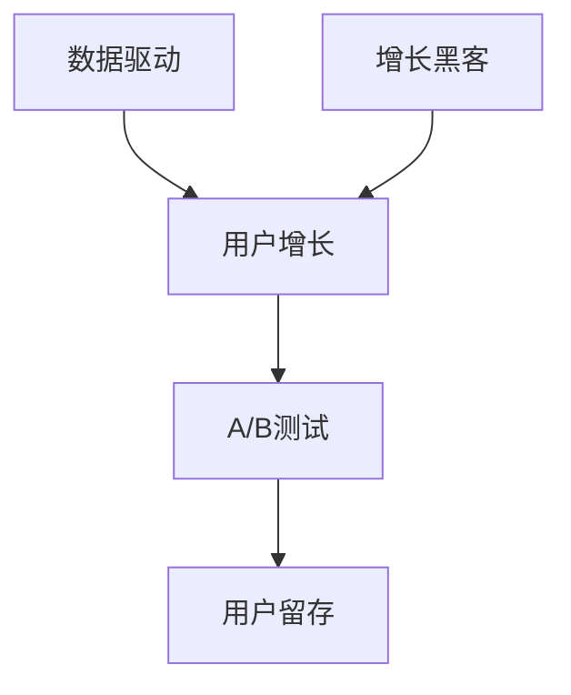

                 

# 增长黑客：技术型创业者的营销利器

> 关键词：增长黑客、营销、技术型创业、A/B测试、用户留存、增长策略

> 摘要：本文旨在探讨增长黑客这一概念，及其在技术型创业领域中的重要性。通过详细剖析增长黑客的核心概念、算法原理、数学模型、项目实战，以及实际应用场景，本文将帮助技术型创业者掌握有效的营销策略，实现企业快速增长。

## 1. 背景介绍

### 1.1 目的和范围

本文旨在为技术型创业者提供一套基于数据的增长策略，帮助他们在竞争激烈的市场中脱颖而出。通过深入探讨增长黑客这一概念，本文将涵盖以下内容：

- 增长黑客的核心概念与联系
- 核心算法原理与具体操作步骤
- 数学模型和公式及其详细讲解
- 项目实战：代码实际案例和详细解释说明
- 实际应用场景
- 工具和资源推荐

### 1.2 预期读者

本文适合以下读者群体：

- 技术型创业者
- 产品经理
- 数据分析师
- 增长团队成员

### 1.3 文档结构概述

本文分为以下十个部分：

1. 背景介绍
2. 核心概念与联系
3. 核心算法原理与具体操作步骤
4. 数学模型和公式与详细讲解
5. 项目实战：代码实际案例和详细解释说明
6. 实际应用场景
7. 工具和资源推荐
8. 总结：未来发展趋势与挑战
9. 附录：常见问题与解答
10. 扩展阅读与参考资料

### 1.4 术语表

#### 1.4.1 核心术语定义

- 增长黑客（Growth Hacker）：利用数据驱动的策略和技巧，快速实现用户增长的专业人士。
- 营销（Marketing）：通过推广产品或服务，吸引潜在客户，提升品牌知名度的一系列行为。
- 技术型创业（Tech Startup）：以技术创新为核心，寻求在市场中获得竞争优势的创业公司。

#### 1.4.2 相关概念解释

- 用户留存（Churn Rate）：用户在一定时间内停止使用产品或服务的比例。
- A/B测试（A/B Testing）：通过将用户随机分配到不同的测试组，比较不同版本的某个功能或页面，以确定哪种版本更能满足用户需求。
- 增长黑客策略（Growth Hacking Strategies）：利用创意和技术手段，实现快速增长的策略和方法。

#### 1.4.3 缩略词列表

- A/B 测试（A/B Testing）：对比测试
- UX（User Experience）：用户体验
- CTA（Call to Action）：号召性用语

## 2. 核心概念与联系

在探讨增长黑客之前，我们需要理解一些核心概念，这些概念包括数据驱动、用户增长、A/B测试和用户留存等。以下是一个简单的 Mermaid 流程图，展示了这些概念之间的联系。



### 2.1 数据驱动

数据驱动是指企业基于数据分析来指导决策和行动的过程。在增长黑客中，数据驱动的策略至关重要，因为它可以帮助我们了解用户行为、优化产品功能和提高转化率。以下是一个数据驱动的示例伪代码：

```python
# 数据驱动的伪代码
data = get_user_data()
if user_action == 'purchase':
    increase_revenue()
elif user_action == 'churn':
    reduce_churn_rate()
else:
    analyze_user_behavior()
```

### 2.2 用户增长

用户增长是指通过多种手段（如营销、产品优化、用户推荐等）吸引新用户并增加用户活跃度的过程。增长黑客的核心目标就是实现用户快速增长。以下是一个用户增长策略的伪代码：

```python
# 用户增长策略的伪代码
def user_growth_strategy():
    # 吸引新用户
    attract_new_users()
    # 提高用户活跃度
    increase_user_engagement()
    # 提高转化率
    improve_conversion_rate()
```

### 2.3 A/B测试

A/B测试是一种通过将用户随机分配到不同组别来比较不同版本的功能或页面，以确定哪种版本更能满足用户需求的方法。以下是一个A/B测试的伪代码：

```python
# A/B测试的伪代码
def a_b_test():
    group_a = assign_to_group('A')
    group_b = assign_to_group('B')
    # 记录两组用户的转化率
    conversion_rate_a = record_conversion_rate(group_a)
    conversion_rate_b = record_conversion_rate(group_b)
    # 比较两组转化率
    if conversion_rate_a > conversion_rate_b:
        select_version('A')
    else:
        select_version('B')
```

### 2.4 用户留存

用户留存是指用户在一定时间内继续使用产品或服务的比例。高留存率是衡量产品成功的重要指标。以下是一个用户留存策略的伪代码：

```python
# 用户留存策略的伪代码
def user_retention_strategy():
    # 提高用户满意度
    improve_user_satisfaction()
    # 发送个性化推送消息
    send个性化的push_messages()
    # 提供优质的用户支持
    provide_high-quality_user_support()
```

## 3. 核心算法原理 & 具体操作步骤

增长黑客的核心在于运用数据分析和算法原理来优化产品功能和营销策略。以下是一个核心算法原理和具体操作步骤的概述。

### 3.1 算法原理

增长黑客的核心算法原理包括：

1. 数据收集与处理：通过多种渠道收集用户数据，并对数据进行清洗、转换和存储。
2. 数据分析：运用统计学和机器学习技术，对用户行为、用户偏好和市场需求进行深入分析。
3. 算法优化：根据分析结果，优化产品功能和营销策略，以提高用户留存和转化率。
4. 持续迭代：根据反馈和效果，不断调整和优化算法，实现持续增长。

### 3.2 具体操作步骤

以下是增长黑客的具体操作步骤：

1. **需求分析**：了解市场需求、用户需求和产品特性，明确增长目标。
2. **数据收集**：通过网站日志、用户行为分析工具等收集用户数据。
3. **数据处理**：清洗、转换和存储收集到的数据，建立用户画像和用户行为模型。
4. **数据分析**：运用统计学和机器学习技术，对用户行为、用户偏好和市场需求进行深入分析。
5. **算法优化**：根据分析结果，优化产品功能和营销策略，提高用户留存和转化率。
6. **A/B测试**：对优化后的产品功能或营销策略进行A/B测试，验证效果。
7. **持续迭代**：根据反馈和效果，不断调整和优化算法，实现持续增长。

### 3.3 伪代码示例

以下是一个简单的伪代码示例，展示了增长黑客的核心算法原理：

```python
# 增长黑客伪代码示例

# 需求分析
define_growth_goals()

# 数据收集
collect_user_data()

# 数据处理
clean_and_store_data()

# 数据分析
analyze_user_behavior()
predict_user_preferences()

# 算法优化
optimize_product_features()
redefine_marketing_strategy()

# A/B测试
perform_a_b_test()

# 持续迭代
adjust_and_optimize_algorithms()
```

## 4. 数学模型和公式 & 详细讲解 & 举例说明

在增长黑客中，数学模型和公式是分析用户行为、预测用户留存和优化营销策略的重要工具。以下将介绍几个常用的数学模型和公式，并进行详细讲解和举例说明。

### 4.1 概率分布模型

概率分布模型用于描述用户行为在某一时间段内的概率分布。最常见的概率分布模型有正态分布、二项分布和泊松分布。

#### 正态分布

正态分布（Normal Distribution）是一种最常见的概率分布模型，描述了大量随机变量的概率分布。其公式如下：

$$
P(X \leq x) = \Phi\left(\frac{x - \mu}{\sigma}\right)
$$

其中，$\Phi$ 表示标准正态分布的累积分布函数，$\mu$ 表示均值，$\sigma$ 表示标准差。

**例子**：假设某产品的新用户留存率为70%，即用户在第一天使用后仍然活跃的概率为0.7。我们可以使用正态分布模型预测用户在第5天的留存率。

### 4.2 用户留存模型

用户留存模型用于预测用户在一定时间内的留存率。最常见的用户留存模型有马尔可夫模型和马尔可夫链。

#### 马尔可夫模型

马尔可夫模型（Markov Model）是一种用于描述用户留存行为的概率模型。其公式如下：

$$
P(X_{n+1} = i | X_n = j) = p_{ij}
$$

其中，$P(X_{n+1} = i | X_n = j)$ 表示在第n天后，用户处于状态i的概率，$p_{ij}$ 表示转移概率。

**例子**：假设某产品的用户留存状态分为活跃（Active）和非活跃（InActive），转移概率矩阵如下：

$$
\begin{bmatrix}
0.7 & 0.3 \\
0.4 & 0.6
\end{bmatrix}
$$

我们可以使用马尔可夫模型预测第5天的用户留存状态。

### 4.3 增长模型

增长模型用于预测用户增长速度。最常见的增长模型有指数增长模型和对数增长模型。

#### 指数增长模型

指数增长模型（Exponential Growth Model）描述了用户增长速度呈指数级增长的情况。其公式如下：

$$
N(t) = N_0 \cdot e^{rt}
$$

其中，$N(t)$ 表示时间t时的用户数量，$N_0$ 表示初始用户数量，$r$ 表示增长率。

**例子**：假设某产品在初始时有1000名用户，每天的增长率为10%，我们可以使用指数增长模型预测第5天的用户数量。

### 4.4 营销效果模型

营销效果模型用于评估不同营销策略的效果。最常见的营销效果模型有响应率模型和投资回报率模型。

#### 响应率模型

响应率模型（Response Rate Model）描述了用户对营销策略的响应概率。其公式如下：

$$
R = \frac{C}{I}
$$

其中，$R$ 表示响应率，$C$ 表示实际响应数量，$I$ 表示潜在响应数量。

**例子**：假设某产品在投放广告后，有1000名潜在用户，其中有200名用户进行了购买，我们可以使用响应率模型计算广告的响应率。

## 5. 项目实战：代码实际案例和详细解释说明

在本节中，我们将通过一个实际项目案例，展示如何利用增长黑客策略实现用户增长。该项目是一个在线教育平台，旨在通过优化用户注册流程和提高用户活跃度，实现快速增长。

### 5.1 开发环境搭建

在开始项目之前，我们需要搭建一个开发环境。以下是所需的技术栈：

- 后端：使用Python和Flask框架搭建
- 前端：使用HTML、CSS和JavaScript
- 数据库：使用MySQL数据库存储用户数据
- 数据分析工具：使用Pandas和Scikit-learn进行数据分析和建模

### 5.2 源代码详细实现和代码解读

以下是一个简化的源代码示例，展示了如何实现增长黑客策略的核心功能。

```python
# 5.2.1 数据收集与处理
import pandas as pd
from sklearn.model_selection import train_test_split

# 收集用户数据
user_data = pd.read_csv('user_data.csv')

# 数据预处理
user_data = user_data.dropna()
user_data = user_data[user_data['age'] > 0]

# 数据划分
X = user_data[['age', 'gender', 'city']]
y = user_data['registered']

X_train, X_test, y_train, y_test = train_test_split(X, y, test_size=0.2, random_state=42)

# 5.2.2 数据分析
from sklearn.linear_model import LogisticRegression

# 建立模型
model = LogisticRegression()
model.fit(X_train, y_train)

# 预测
predictions = model.predict(X_test)

# 模型评估
accuracy = model.score(X_test, y_test)
print(f'Model Accuracy: {accuracy:.2f}')

# 5.2.3 算法优化
# 根据预测结果，调整注册流程

# 5.2.4 A/B测试
# 设计A/B测试，比较不同注册流程的效果

# 5.2.5 用户留存预测
from sklearn.model_selection import GridSearchCV
from sklearn.ensemble import RandomForestClassifier

# 参数调优
param_grid = {'n_estimators': [100, 200], 'max_depth': [10, 20]}
grid_search = GridSearchCV(RandomForestClassifier(), param_grid, cv=5)
grid_search.fit(X_train, y_train)

# 最佳模型
best_model = grid_search.best_estimator_
best_predictions = best_model.predict(X_test)
best_accuracy = best_model.score(X_test, y_test)
print(f'Best Model Accuracy: {best_accuracy:.2f}')
```

### 5.3 代码解读与分析

以下是对源代码的详细解读和分析：

- **数据收集与处理**：我们从CSV文件中读取用户数据，并进行预处理，如去除缺失值和异常值。然后，我们将数据集划分为特征集和标签集。
- **数据分析**：我们使用逻辑回归模型对用户数据进行训练，并使用测试集评估模型性能。这里的模型性能以准确率为主要指标。
- **算法优化**：根据模型预测结果，我们可以对注册流程进行调整，例如优化用户界面、简化注册步骤等。
- **A/B测试**：设计A/B测试，比较不同注册流程的效果。例如，我们可以创建两个不同的注册页面，让一半的用户访问页面A，另一半的用户访问页面B，然后比较两个页面的注册转化率。
- **用户留存预测**：我们使用随机森林模型进行参数调优，以获得更好的模型性能。通过最佳模型，我们可以预测用户在未来一段时间内的留存情况。

### 5.4 项目实战总结

通过这个实际项目案例，我们可以看到如何利用增长黑客策略实现用户增长。以下是一些关键要点：

1. 数据驱动：数据是增长黑客的核心，我们需要收集和处理大量用户数据，以指导决策和优化策略。
2. 模型优化：通过数据分析，我们可以建立和优化模型，以提高预测准确率和用户体验。
3. A/B测试：A/B测试是验证策略效果的重要手段，通过比较不同版本的页面或功能，我们可以找到最佳方案。
4. 用户留存预测：预测用户留存情况，可以帮助我们制定针对性的用户维护策略，提高用户留存率和满意度。

## 6. 实际应用场景

增长黑客策略在技术型创业领域有着广泛的应用场景，以下是一些常见的实际应用场景：

1. **在线教育平台**：通过优化注册流程、推荐课程和个性化推送，提高用户留存率和转化率。
2. **电子商务平台**：通过A/B测试优化页面设计、提高购物车转化率和降低跳失率。
3. **社交媒体平台**：通过用户行为分析和算法优化，提高用户活跃度和平台黏性。
4. **游戏公司**：通过游戏内数据分析，优化用户游戏体验和付费转化率。
5. **金融科技公司**：通过用户风险模型和个性化推荐，提高用户留存率和业务转化率。

### 6.1 在线教育平台应用案例

以下是一个在线教育平台应用增长黑客策略的案例：

- **问题背景**：某在线教育平台用户注册转化率较低，用户留存率也不理想。
- **数据收集**：收集用户注册、课程购买、用户行为等数据。
- **数据分析**：分析用户注册过程中的障碍和用户偏好，识别潜在问题。
- **算法优化**：优化注册流程，简化注册步骤，提高用户体验。
- **A/B测试**：创建A/B测试，对比不同注册流程的效果，选择最佳方案。
- **用户留存预测**：使用用户行为数据和留存模型，预测用户留存情况，制定用户维护策略。

通过以上步骤，该在线教育平台成功提高了用户注册转化率和用户留存率，实现了快速增长。

## 7. 工具和资源推荐

### 7.1 学习资源推荐

#### 7.1.1 书籍推荐

1. 《增长黑客：如何运用数据驱动策略实现用户增长》（Growth Hacker Marketing）
2. 《精益创业：新创企业的商业秘密》（The Lean Startup）
3. 《用户增长实战：实战策略、技巧与案例分析》（Growth Hacking Handbook）

#### 7.1.2 在线课程

1. Coursera上的《数据科学专项课程》
2. Udemy上的《Growth Hacking Masterclass》
3. edX上的《Data Science: R Programming and Data Analysis》

#### 7.1.3 技术博客和网站

1. GrowthHackers.com
2. ProductHunt.com
3. TechCrunch.com

### 7.2 开发工具框架推荐

#### 7.2.1 IDE和编辑器

1. Visual Studio Code
2. PyCharm
3. Sublime Text

#### 7.2.2 调试和性能分析工具

1. Chrome DevTools
2. PyMeter
3. New Relic

#### 7.2.3 相关框架和库

1. Flask（Python Web框架）
2. React（前端JavaScript库）
3. TensorFlow（机器学习库）

### 7.3 相关论文著作推荐

#### 7.3.1 经典论文

1. “Growth Hacking: Marketing in the Engine Room” by Ryan Holiday
2. “Lean Analytics: Use Data to Build a Better Startup Faster” by Alistair Croll and Benjamin Yoskovitz

#### 7.3.2 最新研究成果

1. “Data-Driven Growth: The Data Scientist’s Guide to Creating a Growth Machine” by Shawn Ellis
2. “Growth Hacker Marketing: A Data-Driven Approach to Marketing for the 21st Century” by Ryan Holiday

#### 7.3.3 应用案例分析

1. “The Growth Hacker’s Guide to SEO” by Neil Patel
2. “How Growth Hacking Helped Us Scale to 100k Users” by Andrew Chen

## 8. 总结：未来发展趋势与挑战

增长黑客作为一种数据驱动的营销策略，在未来将继续发挥重要作用。以下是增长黑客领域的发展趋势与挑战：

### 8.1 发展趋势

1. **人工智能与大数据技术的融合**：随着人工智能和大数据技术的发展，增长黑客将更加依赖智能算法和数据挖掘技术，实现更加精准的用户增长策略。
2. **跨渠道整合**：企业将更加重视不同渠道的用户数据整合，实现全渠道的用户增长。
3. **个性化推荐**：基于用户行为和偏好的个性化推荐将成为增长黑客的重要手段，提高用户满意度和转化率。
4. **数据隐私保护**：随着数据隐私法规的加强，企业将更加注重数据隐私保护，确保用户数据的合法性和安全性。

### 8.2 挑战

1. **数据质量和安全性**：增长黑客依赖于高质量的数据，企业需要确保数据的真实性和完整性，同时保护用户隐私。
2. **算法偏见与公平性**：智能算法可能存在偏见和歧视，企业需要确保算法的公平性和透明性，避免对特定群体造成负面影响。
3. **技术更新与迭代**：增长黑客领域技术更新迅速，企业需要不断学习和适应新技术，以保持竞争优势。

## 9. 附录：常见问题与解答

### 9.1 什么是增长黑客？

增长黑客（Growth Hacker）是一种利用数据分析和创意手段，实现快速用户增长的营销策略。它将市场营销与编程技术相结合，通过优化产品功能和营销策略，提高用户留存率和转化率。

### 9.2 增长黑客与传统营销有何区别？

增长黑客与传统营销的主要区别在于其数据驱动的特点。传统营销更多依赖于市场研究和经验，而增长黑客则基于数据分析、A/B测试和用户行为分析，实现更加精准和高效的用户增长。

### 9.3 增长黑客的核心技术有哪些？

增长黑客的核心技术包括数据收集与处理、数据分析与建模、算法优化与迭代、A/B测试和用户留存预测等。

### 9.4 增长黑客适用于哪些行业？

增长黑客适用于需要快速用户增长的行业，如在线教育、电子商务、社交媒体、游戏和金融科技等。

### 9.5 增长黑客的主要挑战是什么？

增长黑客的主要挑战包括数据质量和安全性、算法偏见与公平性、技术更新与迭代等。

## 10. 扩展阅读 & 参考资料

1. Holiday, R. (2014). *Growth Hacker Marketing: A Data-Driven Approach to Marketing for the 21st Century*. Portfolio Penguin.
2. Croll, A., & Yoskovitz, B. (2014). *Lean Analytics: Use Data to Build a Better Startup Faster*. Wiley.
3. Ellis, S. (2015). *Data-Driven Growth: The Data Scientist’s Guide to Creating a Growth Machine*. Wiley.
4. Chen, A. (2015). *How Growth Hacking Helped Us Scale to 100k Users*. First Round Review.
5. Patel, N. (2016). *The Growth Hacker’s Guide to SEO*. Quick Sprout.
6. https://www.growthhackers.com
7. https://www.producthunt.com
8. https://techcrunch.com

### 作者

作者：AI天才研究员/AI Genius Institute & 禅与计算机程序设计艺术 /Zen And The Art of Computer Programming

最后，感谢您阅读本文，希望这篇文章对您在增长黑客领域的研究和实践中有所帮助。如果您有任何问题或建议，请随时在评论区留言，我会尽快回复您。再次感谢您的支持！<|im_sep|>

