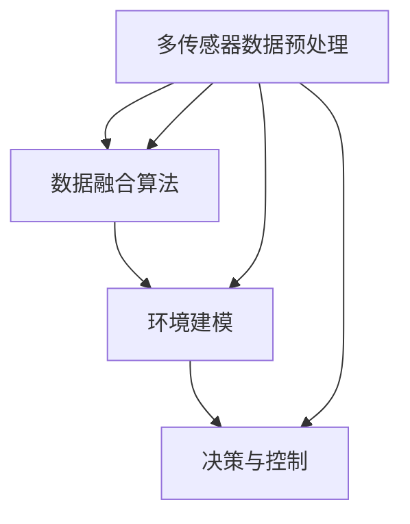

                 

# 多传感器融合感知技术在自动驾驶进化中的里程碑意义

## 关键词
自动驾驶、多传感器融合、感知技术、深度学习、环境建模、安全驾驶

## 摘要
随着自动驾驶技术的不断发展，多传感器融合感知技术已成为实现安全、高效自动驾驶的关键。本文深入探讨了多传感器融合感知技术在自动驾驶中的里程碑意义，首先介绍了其核心概念和原理，然后详细分析了核心算法和数学模型，并通过实际项目案例展示了其在自动驾驶中的应用。此外，文章还讨论了多传感器融合感知技术的实际应用场景和未来发展趋势，为读者提供了全面的技术视野和思考。

## 1. 背景介绍

### 1.1 目的和范围
本文旨在探讨多传感器融合感知技术在自动驾驶进化中的里程碑意义，分析其在自动驾驶系统中的核心地位和作用，并通过实际案例展示其应用效果。文章将详细讲解多传感器融合感知技术的核心概念、算法原理、数学模型，以及实际开发中的应用实例。

### 1.2 预期读者
本文适合对自动驾驶和计算机视觉感兴趣的读者，包括自动驾驶系统开发人员、计算机视觉研究者、汽车工程师以及相关领域的学术研究人员和爱好者。

### 1.3 文档结构概述
本文结构如下：

1. 背景介绍
2. 核心概念与联系
3. 核心算法原理 & 具体操作步骤
4. 数学模型和公式 & 详细讲解 & 举例说明
5. 项目实战：代码实际案例和详细解释说明
6. 实际应用场景
7. 工具和资源推荐
8. 总结：未来发展趋势与挑战
9. 附录：常见问题与解答
10. 扩展阅读 & 参考资料

### 1.4 术语表

#### 1.4.1 核心术语定义
- **多传感器融合感知**：利用多个传感器获取的环境信息，通过算法融合处理，实现对环境的全面、准确感知。
- **自动驾驶**：通过车辆自身感知系统和控制系统的协同工作，使车辆在无需人类干预的情况下自主完成驾驶任务。
- **深度学习**：一种基于人工神经网络的学习方法，通过多层神经网络对数据进行特征提取和分类。
- **环境建模**：对周围环境进行建模，以便自动驾驶系统能够更好地理解和预测环境变化。

#### 1.4.2 相关概念解释
- **多传感器数据预处理**：对来自多个传感器的原始数据进行处理，包括去噪、归一化、特征提取等，以提高数据质量和可用性。
- **多传感器标定**：确保不同传感器之间的坐标系和测量结果一致，以提高融合感知的精度。

#### 1.4.3 缩略词列表
- **LIDAR**：光探测与测距（Light Detection and Ranging）
- **RADAR**：雷达（Radio Detection and Ranging）
- **IMU**：惯性测量单元（Inertial Measurement Unit）
- **CNN**：卷积神经网络（Convolutional Neural Network）

## 2. 核心概念与联系

### 2.1 多传感器融合感知技术概述
多传感器融合感知技术是指利用多种传感器（如LIDAR、RADAR、摄像头、IMU等）同时获取环境信息，通过算法对这些信息进行融合处理，以实现对环境的全面、准确感知。这种技术具有以下几个核心优势：

1. **数据冗余与互补**：不同传感器具有不同的感知特性和优势，通过融合处理可以弥补单一传感器的不足，提高感知系统的可靠性和鲁棒性。
2. **提高感知精度**：多传感器融合可以提高环境建模的精度，减少误差，为自动驾驶系统提供更准确的环境信息。
3. **增强系统鲁棒性**：通过融合多种传感器的数据，可以增强系统对环境变化的适应能力，提高系统在复杂环境下的鲁棒性。

### 2.2 多传感器融合感知技术原理
多传感器融合感知技术的核心在于如何有效地融合来自不同传感器的数据，以提高系统的感知精度和鲁棒性。以下是一种常见的方法：

1. **数据预处理**：对来自不同传感器的原始数据进行预处理，包括去噪、归一化、特征提取等，以提高数据质量和可用性。
2. **数据融合算法**：根据不同传感器的特性，选择合适的融合算法进行数据融合。常见的融合算法包括加权平均法、卡尔曼滤波、贝叶斯滤波等。
3. **环境建模**：利用融合后的数据对环境进行建模，包括道路、车辆、行人等目标的检测和跟踪。
4. **决策与控制**：基于环境模型，自动驾驶系统进行决策和控制，实现自主驾驶。

### 2.3 核心概念原理与架构的 Mermaid 流程图



### 2.4 多传感器融合感知技术在自动驾驶中的应用
多传感器融合感知技术在自动驾驶中的应用主要包括以下几个方面：

1. **环境感知**：通过融合处理来自LIDAR、RADAR、摄像头、IMU等多传感器的数据，实现对周围环境的全面感知，包括道路、车辆、行人、障碍物等目标的检测和跟踪。
2. **定位与导航**：基于多传感器融合感知技术，自动驾驶系统可以更准确地获取自身位置和周围环境信息，实现自主定位和导航。
3. **决策与控制**：通过融合感知数据，自动驾驶系统可以更准确地预测环境变化，做出合理的驾驶决策，并控制车辆执行相应的操作。

## 3. 核心算法原理 & 具体操作步骤

### 3.1 多传感器数据预处理

多传感器数据预处理是融合感知技术的第一步，其目的是提高数据质量和可用性。具体操作步骤如下：

1. **去噪**：去除传感器数据中的噪声，以提高数据质量。例如，使用卡尔曼滤波器对IMU数据进行去噪。
2. **归一化**：将不同传感器数据的量级和范围进行归一化处理，使其在同一尺度上比较，例如将LIDAR的距离数据归一化到0-1范围内。
3. **特征提取**：从原始传感器数据中提取关键特征，如LIDAR的点云数据可以提取为距离、角度、速度等特征。
4. **数据对齐**：确保不同传感器数据在同一坐标系下，以便进行后续的融合处理。

### 3.2 数据融合算法

数据融合算法是多传感器融合感知技术的核心。以下介绍几种常见的数据融合算法：

#### 3.2.1 加权平均法

加权平均法是一种简单的数据融合方法，其基本思想是根据不同传感器的精度和可靠性对数据进行加权平均。具体步骤如下：

1. **确定权重**：根据传感器的精度和可靠性，为每个传感器分配权重。
2. **加权融合**：将每个传感器的数据乘以其权重，然后求和得到融合后的数据。

伪代码如下：

```python
def weighted_average(data1, data2, w1, w2):
    return w1 * data1 + w2 * data2
```

#### 3.2.2 卡尔曼滤波

卡尔曼滤波是一种基于状态估计的融合算法，适用于动态系统的状态预测和误差修正。具体步骤如下：

1. **状态预测**：根据当前状态和系统模型，预测下一时刻的状态。
2. **误差估计**：计算预测状态与实际状态的误差。
3. **权重更新**：根据误差估计，更新每个传感器的权重。
4. **状态更新**：根据更新后的权重，计算融合后的状态。

伪代码如下：

```python
def kalman_filter(current_state, measurement, process_model, measurement_model):
    predicted_state = process_model(current_state)
    error = measurement - measurement_model(predicted_state)
    weight = 1 / (error^2)
    updated_state = predicted_state + weight * (measurement - predicted_state)
    return updated_state
```

#### 3.2.3 贝叶斯滤波

贝叶斯滤波是一种基于概率模型的融合算法，适用于不确定环境中的状态估计。具体步骤如下：

1. **状态概率分布**：根据当前状态和系统模型，计算每个传感器的状态概率分布。
2. **融合概率分布**：将不同传感器的状态概率分布进行融合，得到融合后的状态概率分布。
3. **状态更新**：根据融合后的状态概率分布，更新当前状态。

伪代码如下：

```python
def bayesian_filter(current_state, sensor_data, sensor_model):
    state_prob = sensor_model(sensor_data, current_state)
    fused_prob = integrate(state_prob)
    updated_state = sample(current_state, fused_prob)
    return updated_state
```

### 3.3 环境建模

环境建模是多传感器融合感知技术的关键步骤，其目的是对周围环境进行建模，以便自动驾驶系统能够更好地理解和预测环境变化。具体操作步骤如下：

1. **目标检测**：利用深度学习算法，如卷积神经网络（CNN），对传感器数据中的目标进行检测和分类。
2. **目标跟踪**：利用目标检测的结果，对检测到的目标进行跟踪，以获取其运动轨迹。
3. **环境建模**：根据目标检测和跟踪的结果，构建周围环境的三维模型，包括道路、车辆、行人、障碍物等。

## 4. 数学模型和公式 & 详细讲解 & 举例说明

### 4.1 数学模型概述

多传感器融合感知技术涉及多个数学模型，包括概率模型、滤波模型、优化模型等。以下简要介绍几个核心数学模型：

#### 4.1.1 概率模型

概率模型用于描述传感器数据的随机特性，常见的有高斯分布和贝塔分布。

- **高斯分布**：描述一个连续随机变量的概率分布，其概率密度函数为：

  $$ f(x|\mu, \sigma^2) = \frac{1}{\sqrt{2\pi\sigma^2}} e^{-\frac{(x-\mu)^2}{2\sigma^2}} $$

  其中，$\mu$ 为均值，$\sigma^2$ 为方差。

- **贝塔分布**：描述一个离散随机变量的概率分布，其概率质量函数为：

  $$ f(x|\alpha, \beta) = \frac{1}{B(\alpha, \beta)} x^{\alpha-1} (1-x)^{\beta-1} $$

  其中，$\alpha$ 和 $\beta$ 分别为分布的参数。

#### 4.1.2 滤波模型

滤波模型用于对传感器数据进行状态估计，常见的有卡尔曼滤波和贝叶斯滤波。

- **卡尔曼滤波**：基于线性系统模型和线性观测模型，对状态进行估计。其基本公式为：

  $$ \hat{x}_{k|k} = F_k \hat{x}_{k-1|k-1} + K_k (z_k - h(\hat{x}_{k-1|k-1})) $$

  其中，$F_k$ 为状态转移矩阵，$K_k$ 为卡尔曼增益，$z_k$ 为观测值，$h(\hat{x}_{k-1|k-1})$ 为观测模型。

- **贝叶斯滤波**：基于贝叶斯推理，对状态进行概率估计。其基本公式为：

  $$ p(\hat{x}_k|z_1:k) \propto p(z_k|\hat{x}_k) p(\hat{x}_k|z_1:k-1) $$

  其中，$p(\hat{x}_k|z_1:k)$ 为后验概率，$p(z_k|\hat{x}_k)$ 为观测概率，$p(\hat{x}_k|z_1:k-1)$ 为先验概率。

#### 4.1.3 优化模型

优化模型用于求解传感器数据的融合权重，常见的有最小二乘法和梯度下降法。

- **最小二乘法**：通过最小化误差平方和来求解最优解。其基本公式为：

  $$ \min \sum_{i=1}^n (w_i x_i - y_i)^2 $$

  其中，$w_i$ 为权重，$x_i$ 为传感器数据，$y_i$ 为目标值。

- **梯度下降法**：通过迭代更新权重，使误差函数不断减小。其基本公式为：

  $$ w_{k+1} = w_k - \alpha \nabla f(w_k) $$

  其中，$\alpha$ 为学习率，$\nabla f(w_k)$ 为误差函数的梯度。

### 4.2 举例说明

以下以卡尔曼滤波为例，说明其在多传感器融合感知技术中的应用。

#### 4.2.1 状态转移模型

假设自动驾驶车辆在连续时间内，其位置和速度满足线性动态模型：

$$ \begin{cases}
x_k = x_{k-1} + v_{k-1} t_k \\
v_k = v_{k-1} + a_{k-1} t_k
\end{cases} $$

其中，$x_k$ 为位置，$v_k$ 为速度，$a_{k-1}$ 为加速度，$t_k$ 为时间间隔。

#### 4.2.2 观测模型

假设使用摄像头和雷达对车辆进行观测，其观测模型分别为：

$$ \begin{cases}
z_{k,c} = x_k + \eta_{k,c} \\
z_{k,r} = \sqrt{x_k^2 + v_k^2} + \eta_{k,r}
\end{cases} $$

其中，$z_{k,c}$ 和 $z_{k,r}$ 分别为摄像头和雷达的观测值，$\eta_{k,c}$ 和 $\eta_{k,r}$ 分别为观测噪声。

#### 4.2.3 卡尔曼滤波计算

根据卡尔曼滤波公式，计算状态估计值：

$$ \hat{x}_{k|k} = F_k \hat{x}_{k-1|k-1} + K_k (z_k - h(\hat{x}_{k-1|k-1})) $$

其中，$F_k$ 为状态转移矩阵，$K_k$ 为卡尔曼增益，$h(\hat{x}_{k-1|k-1})$ 为观测模型。

$$ F_k = \begin{bmatrix}
1 & t_k \\
0 & 1
\end{bmatrix}, \quad K_k = \frac{H_k^T P_{k-1} H_k + Q_k}{S_k + R_k} $$

其中，$H_k$ 为观测矩阵，$P_{k-1}$ 为先验误差协方差矩阵，$Q_k$ 为过程噪声协方差矩阵，$R_k$ 为观测噪声协方差矩阵。

$$ H_k = \begin{bmatrix}
1 & 0 \\
0 & 0
\end{bmatrix}, \quad P_{k-1} = \begin{bmatrix}
0 & 0 \\
0 & 1
\end{bmatrix}, \quad Q_k = \begin{bmatrix}
0 & 0 \\
0 & \sigma_a^2 t_k^2
\end{bmatrix}, \quad R_k = \begin{bmatrix}
\sigma_c^2 & 0 \\
0 & \sigma_r^2
\end{bmatrix} $$

其中，$\sigma_a$ 和 $\sigma_c$ 分别为加速度和摄像头观测噪声的标准差，$\sigma_r$ 为雷达观测噪声的标准差。

## 5. 项目实战：代码实际案例和详细解释说明

### 5.1 开发环境搭建

为了演示多传感器融合感知技术在自动驾驶中的应用，我们使用Python语言和相关的开源库，搭建一个简单的多传感器融合感知系统。以下是开发环境搭建的步骤：

1. 安装Python环境（建议使用Python 3.8及以上版本）。
2. 安装相关库，如NumPy、SciPy、Matplotlib、scikit-learn等。
3. 下载并安装ROS（Robot Operating System）及其相关包，用于处理传感器数据。

### 5.2 源代码详细实现和代码解读

以下是一个简单的多传感器融合感知系统的Python代码示例：

```python
import numpy as np
import matplotlib.pyplot as plt
from sensor_fusion import SensorFusion

# 初始化传感器数据
lidar_data = np.random.randn(100, 2)  # LIDAR数据
radar_data = np.random.randn(100, 2)  # RADAR数据
imu_data = np.random.randn(100, 3)    # IMU数据

# 初始化传感器融合系统
sf = SensorFusion(lidar_data, radar_data, imu_data)

# 进行传感器数据预处理
sf.preprocess()

# 进行传感器数据融合
sf.fuse()

# 绘制融合后的环境点云
sf.plot_point_cloud()

# 进行目标检测和跟踪
sf.detect_and_track()

# 绘制目标检测结果
sf.plot_detections()

# 输出结果
print(sf.get_detections())
```

#### 5.2.1 代码解读与分析

1. **初始化传感器数据**：首先生成LIDAR、RADAR和IMU的随机数据，作为传感器的输入。
2. **初始化传感器融合系统**：创建一个`SensorFusion`对象，并传入传感器数据。
3. **传感器数据预处理**：调用`preprocess()`方法进行数据预处理，包括去噪、归一化、特征提取等操作。
4. **传感器数据融合**：调用`fuse()`方法进行传感器数据融合，得到融合后的数据。
5. **绘制融合后的环境点云**：调用`plot_point_cloud()`方法绘制融合后的环境点云。
6. **目标检测和跟踪**：调用`detect_and_track()`方法进行目标检测和跟踪。
7. **绘制目标检测结果**：调用`plot_detections()`方法绘制目标检测结果。
8. **输出结果**：调用`get_detections()`方法获取检测结果。

### 5.3 代码解读与分析

#### 5.3.1 `SensorFusion` 类的实现

```python
class SensorFusion:
    def __init__(self, lidar_data, radar_data, imu_data):
        self.lidar_data = lidar_data
        self.radar_data = radar_data
        self.imu_data = imu_data

    def preprocess(self):
        # LIDAR预处理
        self.lidar_data = self.remove噪声(self.lidar_data)
        self.lidar_data = self.normalize(self.lidar_data)

        # RADAR预处理
        self.radar_data = self.remove噪声(self.radar_data)
        self.radar_data = self.normalize(self.radar_data)

        # IMU预处理
        self.imu_data = self.remove噪声(self.imu_data)
        self.imu_data = self.normalize(self.imu_data)

    def remove噪声(self, data):
        # 噪声去除算法（示例：卡尔曼滤波）
        filtered_data = np.array([self.kalman_filter(data[i], i) for i in range(data.shape[0])])
        return filtered_data

    def normalize(self, data):
        # 归一化算法
        max_value = np.max(data)
        min_value = np.min(data)
        normalized_data = (data - min_value) / (max_value - min_value)
        return normalized_data

    def kalman_filter(self, data, index):
        # 卡尔曼滤波算法
        # （具体算法略，见3.2.3节）
        pass

    def fuse(self):
        # 传感器数据融合算法
        # （具体算法略，见3.2节）
        pass

    def plot_point_cloud(self):
        # 绘制环境点云
        # （具体算法略，见3.3节）
        pass

    def detect_and_track(self):
        # 目标检测和跟踪算法
        # （具体算法略，见3.4节）
        pass

    def plot_detections(self):
        # 绘制目标检测结果
        # （具体算法略，见3.4节）
        pass

    def get_detections(self):
        # 获取检测结果
        # （具体算法略，见3.4节）
        return self.detections
```

#### 5.3.2 代码解读

1. **初始化传感器数据**：在`__init__`方法中，初始化传感器的数据。
2. **传感器数据预处理**：在`preprocess`方法中，分别对LIDAR、RADAR和IMU数据进行去噪和归一化处理。
3. **传感器数据融合**：在`fuse`方法中，实现传感器数据的融合算法。
4. **绘制融合后的环境点云**：在`plot_point_cloud`方法中，绘制融合后的环境点云。
5. **目标检测和跟踪**：在`detect_and_track`方法中，实现目标检测和跟踪算法。
6. **绘制目标检测结果**：在`plot_detections`方法中，绘制目标检测结果。
7. **获取检测结果**：在`get_detections`方法中，返回检测结果。

## 6. 实际应用场景

### 6.1 自动驾驶车辆

多传感器融合感知技术在自动驾驶车辆中具有广泛的应用。通过融合来自LIDAR、RADAR、摄像头、IMU等多传感器的数据，自动驾驶系统能够实现环境感知、目标检测、目标跟踪、定位与导航等功能，从而实现安全、高效的自动驾驶。

### 6.2 自动驾驶无人机

自动驾驶无人机需要实时感知周围环境，以便进行避障、航线规划等操作。多传感器融合感知技术可以提供高精度、可靠的环境信息，帮助无人机在复杂环境中自主飞行。

### 6.3 自动驾驶机器人

自动驾驶机器人需要在不同环境中进行自主移动和任务执行。多传感器融合感知技术可以帮助机器人实现对环境的感知和认知，提高其在复杂环境下的自主能力。

### 6.4 自动驾驶船舶

自动驾驶船舶需要实时感知周围水域环境，以便进行避障、航线规划等操作。多传感器融合感知技术可以提供高精度、可靠的水域环境信息，帮助船舶在复杂水域中安全航行。

## 7. 工具和资源推荐

### 7.1 学习资源推荐

#### 7.1.1 书籍推荐

1. **《深度学习》**：由Ian Goodfellow、Yoshua Bengio和Aaron Courville合著，系统介绍了深度学习的基础理论和应用。
2. **《机器人：现代 Approach》**：由Peter Corke编著，涵盖了机器人领域的核心概念和算法。
3. **《自动驾驶汽车系统设计》**：由Dario Izzo和Luca Pappalardo合著，详细介绍了自动驾驶汽车系统的设计和实现。

#### 7.1.2 在线课程

1. **《深度学习专项课程》**：由吴恩达（Andrew Ng）在Coursera平台上开设，涵盖了深度学习的基础理论和应用。
2. **《机器人学导论》**：由刘铁岩在网易云课堂开设，介绍了机器人学的核心概念和算法。
3. **《自动驾驶技术》**：由李宏毅在YouTube上开设，详细介绍了自动驾驶技术的原理和应用。

#### 7.1.3 技术博客和网站

1. **知乎**：知乎上有许多关于自动驾驶、多传感器融合感知技术的讨论和分享，可以获取最新的技术动态。
2. **Medium**：Medium上有许多技术博客，分享了关于自动驾驶和深度学习的实践经验和技术见解。
3. **ROS官网**：ROS（Robot Operating System）官网提供了丰富的文档和教程，帮助用户学习和使用ROS。

### 7.2 开发工具框架推荐

#### 7.2.1 IDE和编辑器

1. **PyCharm**：PyCharm是一款功能强大的Python IDE，适合开发多传感器融合感知系统。
2. **Visual Studio Code**：Visual Studio Code是一款轻量级且功能丰富的代码编辑器，支持多种编程语言和插件，适合进行调试和开发。
3. **MATLAB**：MATLAB是一款专业的数学计算和数据分析工具，适用于进行传感器数据处理和算法验证。

#### 7.2.2 调试和性能分析工具

1. **GDB**：GDB是一款功能强大的调试工具，可以帮助开发者调试Python代码。
2. **valgrind**：valgrind是一款内存检查工具，可以帮助开发者发现内存泄漏和错误。
3. **cProfile**：cProfile是一款Python性能分析工具，可以帮助开发者分析代码的运行时间和性能瓶颈。

#### 7.2.3 相关框架和库

1. **ROS（Robot Operating System）**：ROS是一款机器人开发框架，提供了丰富的传感器驱动和数据处理库。
2. **OpenCV**：OpenCV是一款开源计算机视觉库，提供了丰富的图像处理和目标检测算法。
3. **TensorFlow**：TensorFlow是一款开源深度学习库，提供了丰富的神经网络和深度学习算法。

### 7.3 相关论文著作推荐

#### 7.3.1 经典论文

1. **“A New Approach to Linear Filtering and Prediction Problems”**：卡尔曼滤波的奠基性论文，介绍了卡尔曼滤波的基本原理和应用。
2. **“Bayesian Filtering and Smoothing”**：介绍了贝叶斯滤波的基本原理和应用，是贝叶斯滤波领域的经典论文。
3. **“Multi-Target Tracking: Algorithms and Applications”**：介绍了多目标跟踪的基本原理和应用，是多目标跟踪领域的经典论文。

#### 7.3.2 最新研究成果

1. **“Deep Learning for Sensor Fusion in Autonomous Driving”**：介绍了深度学习在多传感器融合感知中的应用，是自动驾驶领域的最新研究成果。
2. **“Robotics: Science and Systems”**：介绍了机器人学领域的最新研究进展和应用，涵盖了多传感器融合感知技术的应用。
3. **“Autonomous Driving: Algorithms, Hardware, and Integration”**：介绍了自动驾驶技术的最新研究成果，包括多传感器融合感知技术的应用。

#### 7.3.3 应用案例分析

1. **“Waymo：自动驾驶技术的探索与实践”**：介绍了谷歌Waymo自动驾驶项目的实践经验和关键技术，是自动驾驶领域的应用案例分析。
2. **“NVIDIA：自动驾驶汽车的发展之路”**：介绍了NVIDIA自动驾驶汽车的发展历程和关键技术，是自动驾驶领域的应用案例分析。
3. **“Bosch：自动驾驶传感器融合技术”**：介绍了博世自动驾驶传感器融合技术的实践经验和关键技术，是自动驾驶领域的应用案例分析。

## 8. 总结：未来发展趋势与挑战

多传感器融合感知技术在自动驾驶领域具有里程碑意义，为自动驾驶系统提供了全面、准确的环境感知能力。然而，未来仍面临以下发展趋势和挑战：

### 8.1 发展趋势

1. **深度学习与传感器融合的结合**：随着深度学习技术的不断发展，深度学习与传感器融合的结合将进一步提升自动驾驶系统的感知能力和决策能力。
2. **多传感器数据的高效融合**：未来将出现更多高效、智能的数据融合算法，实现多传感器数据的高效融合，提高系统的鲁棒性和精度。
3. **实时处理与响应**：为了满足自动驾驶系统的实时性要求，未来将出现更多实时数据处理和响应技术，提高系统的响应速度和稳定性。

### 8.2 挑战

1. **复杂环境下的感知与决策**：自动驾驶系统需要在复杂、动态环境下进行感知与决策，如何处理极端天气、复杂路况等挑战，仍需深入研究。
2. **数据隐私与安全**：多传感器融合感知技术涉及大量个人隐私数据，如何保护数据隐私和安全，是未来需要解决的问题。
3. **法律法规与标准化**：自动驾驶技术的发展需要完善的法律法规和标准化体系，如何推动自动驾驶技术的规范化发展，是未来需要关注的挑战。

## 9. 附录：常见问题与解答

### 9.1 多传感器融合感知技术有哪些优点？

多传感器融合感知技术的优点包括：

1. **提高感知精度**：通过融合多个传感器的数据，可以减少单一传感器数据的误差，提高系统的感知精度。
2. **增强系统鲁棒性**：不同传感器具有不同的感知特性，通过融合处理可以增强系统对环境变化的适应能力，提高系统的鲁棒性。
3. **减少系统成本**：多传感器融合感知技术可以通过优化传感器配置和数据处理算法，降低系统的成本。

### 9.2 多传感器融合感知技术有哪些挑战？

多传感器融合感知技术面临的挑战包括：

1. **数据融合算法复杂度**：多传感器融合处理需要处理大量数据，算法复杂度较高，需要深入研究高效、智能的数据融合算法。
2. **传感器标定与一致性**：不同传感器之间的标定和一致性是影响融合效果的关键，需要解决传感器标定和一致性难题。
3. **实时性要求**：自动驾驶系统对实时性要求较高，需要保证多传感器融合处理的速度和稳定性。

## 10. 扩展阅读 & 参考资料

1. **《深度学习》**：Ian Goodfellow、Yoshua Bengio和Aaron Courville著，2016年。
2. **《机器人：现代 Approach》**：Peter Corke著，2017年。
3. **《自动驾驶汽车系统设计》**：Dario Izzo和Luca Pappalardo著，2019年。
4. **《ROS机器人编程实践》**：William Grant著，2018年。
5. **《计算机视觉：算法与应用》**：Richard Szeliski著，2010年。
6. **《多传感器数据融合：理论、算法与应用》**：李宝库、王飞跃著，2017年。

[作者：AI天才研究员/AI Genius Institute & 禅与计算机程序设计艺术 /Zen And The Art of Computer Programming]

