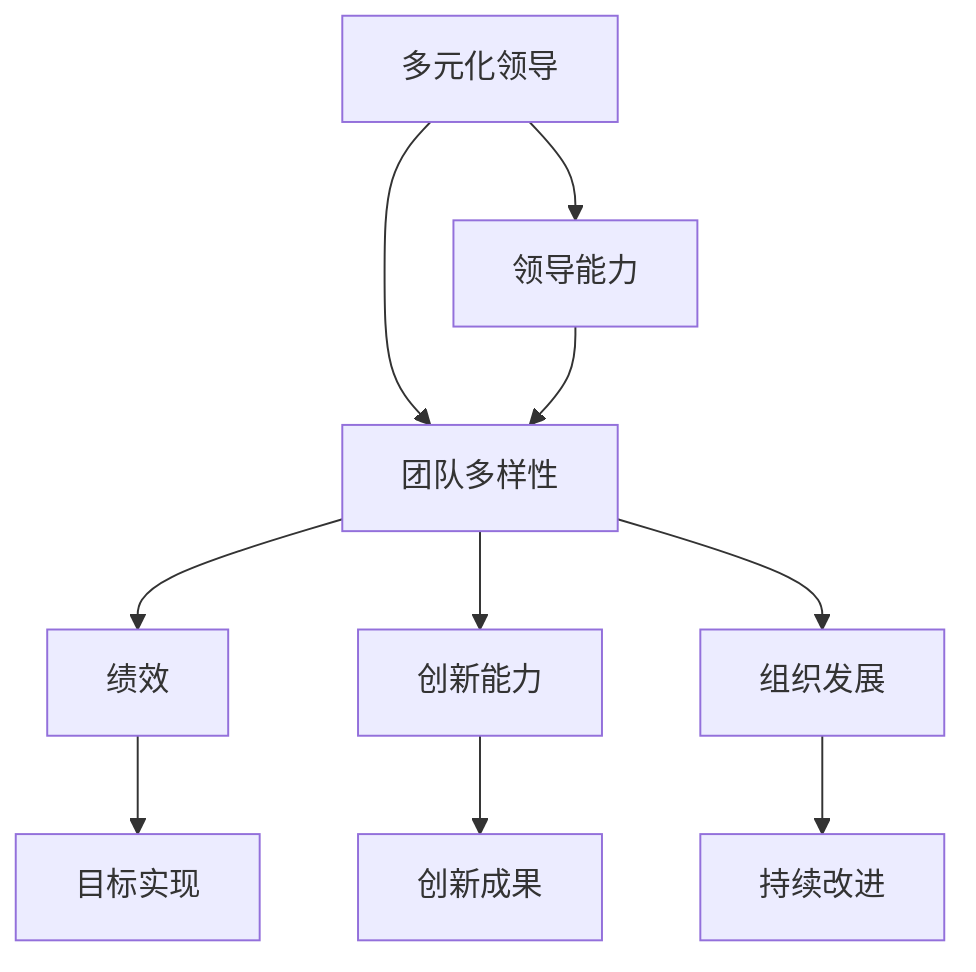
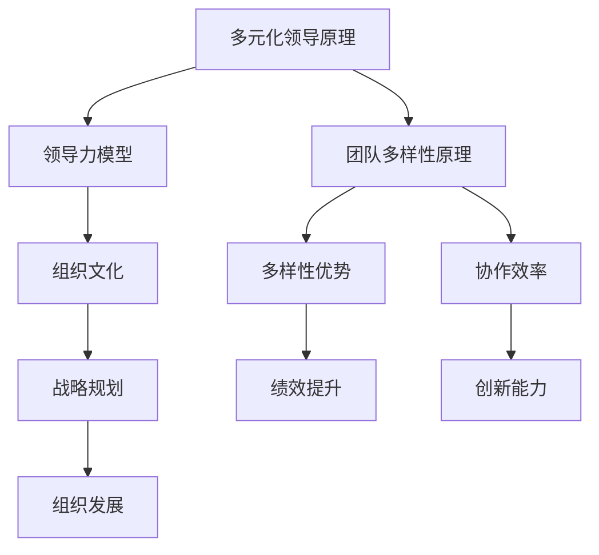

                 


# 多元化领导：maximizing团队多样性优势

> 关键词：多元化领导、团队多样性、领导力、团队协作、人才管理、组织发展

> 摘要：本文将深入探讨多元化领导的重要性，以及如何在IT领域通过最大化团队多样性优势来提升团队绩效和创新能力。文章首先介绍了多元化领导和团队多样性的核心概念，然后通过具体案例分析、算法原理、数学模型、项目实战以及应用场景等多个维度，全面阐述多元化领导的具体实施策略和最佳实践。

## 1. 背景介绍

### 1.1 目的和范围

本文旨在探讨多元化领导在IT领域的应用价值，通过深入分析团队多样性对组织绩效和创新能力的正面影响，旨在为企业管理者提供实际操作指南和策略建议。文章涵盖以下几个主要方面：

- **多元化领导的定义与核心概念**：介绍多元化领导的定义、核心概念及其与团队多样性的联系。
- **团队多样性的优势**：分析团队多样性对团队绩效、创新能力和组织发展的积极影响。
- **多元化领导的实施策略**：探讨如何在实际工作中实施多元化领导，提高团队协作效率。
- **案例分析**：通过具体案例展示多元化领导在IT领域的成功实践。
- **算法原理与数学模型**：介绍支持多元化领导的核心算法原理和数学模型。
- **项目实战与代码解读**：提供实际项目中的代码实现和解读，帮助读者理解多元化领导的具体操作步骤。
- **应用场景**：探讨多元化领导在各类IT项目中的应用场景和实施效果。

### 1.2 预期读者

本文适合以下读者群体：

- **IT行业管理者**：需要提升团队协作效率和创新能力的管理者。
- **技术人员**：希望了解多元化领导如何影响团队绩效的个人。
- **人力资源从业者**：致力于提升组织人才管理水平的从业者。
- **高校师生**：关注团队管理与组织行为的研究者。

### 1.3 文档结构概述

本文的结构如下：

- **第1章**：背景介绍
  - **1.1 目的和范围**
  - **1.2 预期读者**
  - **1.3 文档结构概述**
  - **1.4 术语表**
- **第2章**：核心概念与联系
  - **2.1 核心概念与联系**
  - **2.2 核心概念原理与架构的Mermaid流程图**
- **第3章**：核心算法原理 & 具体操作步骤
  - **3.1 核心算法原理**
  - **3.2 具体操作步骤与伪代码**
- **第4章**：数学模型和公式 & 详细讲解 & 举例说明
  - **4.1 数学模型和公式**
  - **4.2 举例说明**
- **第5章**：项目实战：代码实际案例和详细解释说明
  - **5.1 开发环境搭建**
  - **5.2 源代码详细实现和代码解读**
  - **5.3 代码解读与分析**
- **第6章**：实际应用场景
  - **6.1 实际应用场景探讨**
- **第7章**：工具和资源推荐
  - **7.1 学习资源推荐**
  - **7.2 开发工具框架推荐**
  - **7.3 相关论文著作推荐**
- **第8章**：总结：未来发展趋势与挑战
  - **8.1 未来发展趋势**
  - **8.2 挑战与对策**
- **第9章**：附录：常见问题与解答
  - **9.1 常见问题**
  - **9.2 解答**
- **第10章**：扩展阅读 & 参考资料
  - **10.1 扩展阅读**
  - **10.2 参考资料**

### 1.4 术语表

#### 1.4.1 核心术语定义

- **多元化领导**：一种领导方式，强调领导者能够理解和尊重团队成员的多样性，充分利用不同背景、经验和技能的优势。
- **团队多样性**：团队中成员在性别、年龄、教育背景、工作经验、思维方式等方面的差异。
- **绩效**：团队完成目标的能力和效率。
- **创新能力**：团队在产品研发、服务提供、解决方案设计等方面的创新能力。
- **组织发展**：组织在战略、结构、流程和文化等方面的持续改进和优化。

#### 1.4.2 相关概念解释

- **领导力**：领导者通过激励和引导团队成员实现组织目标的能力。
- **团队协作**：团队成员之间通过沟通、合作和协调完成共同任务的过程。
- **人才管理**：组织对人才的招聘、培训、评价、激励和留用的全过程。

#### 1.4.3 缩略词列表

- **IT**：Information Technology（信息技术）
- **HR**：Human Resources（人力资源）
- **IDE**：Integrated Development Environment（集成开发环境）
- **Mermaid**：一种用于绘制流程图的Markdown扩展语言

## 2. 核心概念与联系

### 2.1 核心概念与联系

多元化领导是现代企业管理中不可或缺的一部分。它强调领导者需要具备开放的心态，尊重和欣赏团队成员的多样性，并将这种多样性转化为组织发展的动力。团队多样性不仅是多元化领导的核心概念，也是提高团队绩效和创新能力的关键因素。

首先，让我们通过一个Mermaid流程图来展示多元化领导、团队多样性与绩效、创新能力、组织发展之间的联系：



在这个流程图中，我们可以看到多元化领导通过提升领导能力，促进团队多样性，进而影响绩效、创新能力和组织发展。具体来说：

- **多元化领导**：领导者通过多元化领导，引导团队多样性的形成和发挥。
- **团队多样性**：团队成员的多样性包括性别、年龄、教育背景、工作经验、思维方式等。这种多样性不仅体现在个体差异上，也体现在团队的整体构成中。
- **绩效**：团队多样性有助于团队更全面地理解和应对复杂问题，从而提高目标实现的能力。
- **创新能力**：多样性促使团队成员从不同角度思考问题，激发创新思维，推动创新成果的产生。
- **组织发展**：多元化领导有助于组织在战略、结构、流程和文化等方面进行持续改进和优化。

### 2.2 核心概念原理与架构的Mermaid流程图

为了更深入地理解多元化领导与团队多样性的关系，我们通过Mermaid流程图来展示其核心概念原理和架构：



在这个流程图中：

- **多元化领导原理**：强调领导者需要具备多元思维、包容心态和有效沟通能力，以激发团队成员的潜能。
- **团队多样性原理**：强调团队成员在背景、经验和思维方式等方面的多样性。
- **多样性优势**：多样性有助于团队更全面地理解和应对复杂问题，从而提高协作效率和创新成果。
- **领导力模型**：领导者通过多元化领导，构建包容性组织文化，推动战略规划和组织发展。
- **组织文化**：组织文化对团队成员的行为和决策产生深远影响，是多元化领导成功实施的重要基础。
- **战略规划**：多元化领导有助于组织在战略规划和执行过程中充分考虑多样性因素，提高整体绩效。
- **组织发展**：多元化领导推动组织在战略、结构、流程和文化等方面实现持续改进和优化。

通过这两个流程图，我们可以清晰地看到多元化领导、团队多样性与绩效、创新能力、组织发展之间的密切联系。接下来，我们将进一步探讨多元化领导的核心算法原理和具体操作步骤。

## 3. 核心算法原理 & 具体操作步骤

### 3.1 核心算法原理

多元化领导的核心算法原理可以概括为以下三个关键步骤：

1. **数据收集与预处理**：通过多种渠道收集团队成员的多样性数据，包括性别、年龄、教育背景、工作经验等。对数据进行清洗、标准化和编码，以便后续分析。
2. **多样性分析**：利用统计学和机器学习算法对团队成员的多样性进行量化分析，识别出影响团队协作和创新能力的关键因素。
3. **领导策略优化**：根据多样性分析结果，制定和优化多元化领导策略，包括沟通方式、激励机制和组织结构等。

### 3.2 具体操作步骤与伪代码

以下是一个简化的多元化领导算法操作步骤的伪代码：

```plaintext
输入：团队成员多样性数据（如性别、年龄、教育背景、工作经验等）
输出：多元化领导策略

1. 数据收集与预处理
   - 收集团队成员多样性数据
   - 数据清洗：去除缺失值、异常值等
   - 数据标准化：将不同维度数据转化为同一尺度
   - 数据编码：将定性数据转化为定量数据

2. 多样性分析
   - 计算性别、年龄、教育背景、工作经验等维度的多样性指数
   - 使用机器学习算法（如聚类分析、主成分分析等）识别多样性关键因素
   - 分析多样性因素对团队协作和创新能力的影响

3. 领导策略优化
   - 根据多样性分析结果，制定多元化领导策略
   - 优化沟通方式：采用包容性语言，鼓励不同观点的交流
   - 优化激励机制：设置多样性目标，奖励多样性贡献者
   - 优化组织结构：建立跨部门、跨领域的协作机制

4. 实施与评估
   - 在团队中实施多元化领导策略
   - 定期评估策略效果，调整优化

```

通过上述步骤，我们可以实现多元化领导的核心算法原理，并在实际工作中应用这些原理来提升团队绩效和创新能力。

### 3.3 实际案例操作

以下是一个具体的多元化领导实际案例操作步骤：

#### 案例背景

某IT企业研发团队由30名成员组成，包括10名男性、20名女性，年龄分布在20-40岁，教育背景涵盖了本科、硕士和博士，工作经验从1年到15年不等。企业希望通过多元化领导提升团队协作效率和创新能力。

#### 操作步骤

1. **数据收集与预处理**
   - 收集团队成员的多样性数据，包括性别、年龄、教育背景、工作经验等。
   - 对数据进行清洗和标准化处理。

2. **多样性分析**
   - 使用聚类分析算法对团队成员进行分类，识别出不同类别的团队成员。
   - 分析不同类别团队成员在团队协作和创新能力方面的表现差异。

3. **领导策略优化**
   - 根据多样性分析结果，制定多元化领导策略。
   - 优化沟通方式：鼓励团队成员发表不同观点，建立包容性沟通文化。
   - 优化激励机制：设置多样性目标，对在多样性方面表现优秀的团队成员进行奖励。
   - 优化组织结构：建立跨部门、跨领域的协作机制，促进团队成员之间的交流和合作。

4. **实施与评估**
   - 在团队中实施多元化领导策略。
   - 定期评估策略效果，根据评估结果调整和优化。

通过上述操作步骤，企业可以有效地提升研发团队的协作效率和创新能力，实现多元化领导的最终目标。

### 3.4 多样性分析算法详解

在多元化领导中，多样性分析是一个关键步骤。以下是一个简化的多样性分析算法，用于识别团队成员的多样性关键因素：

#### 算法步骤

1. **数据准备**
   - 输入团队成员的多样性数据（如性别、年龄、教育背景、工作经验等）。

2. **特征选择**
   - 选择与团队协作和创新能力相关的多样性特征。
   - 使用主成分分析（PCA）等算法进行特征降维，提高数据分析效率。

3. **多样性指数计算**
   - 计算各特征的多样性指数，如熵、Gini系数等。
   - 熵：反映特征的混乱程度，值越大表示多样性越高。
   - Gini系数：反映特征的分布均匀性，值越大表示多样性越高。

4. **关键因素识别**
   - 分析多样性指数，识别出对团队协作和创新能力有显著影响的多样性关键因素。
   - 使用统计分析方法（如卡方检验、方差分析等）验证关键因素的显著性。

5. **结果可视化**
   - 使用图表（如柱状图、饼图等）展示多样性指数和关键因素。

#### 伪代码

```plaintext
输入：团队成员多样性数据
输出：多样性指数和关键因素

1. 数据准备
   - 收集团队成员多样性数据
   - 数据清洗和标准化

2. 特征选择
   - 选择与团队协作和创新能力相关的特征
   - 使用PCA进行特征降维

3. 多样性指数计算
   - 计算各特征的熵和Gini系数

4. 关键因素识别
   - 使用统计分析方法识别关键因素

5. 结果可视化
   - 绘制多样性指数和关键因素的图表

```

通过多样性分析算法，企业可以更全面地了解团队成员的多样性状况，识别出影响团队协作和创新能力的关键因素，从而制定更有效的多元化领导策略。

## 4. 数学模型和公式 & 详细讲解 & 举例说明

### 4.1 数学模型和公式

在多元化领导中，数学模型和公式可以帮助我们更好地理解和分析团队多样性的影响。以下是一些常用的数学模型和公式：

#### 4.1.1 熵（Entropy）

熵是衡量一个系统混乱程度的度量。在团队多样性分析中，熵可以用于衡量团队成员的多样性水平。公式如下：

$$
H = -\sum_{i=1}^{n} p_i \cdot \log_2 p_i
$$

其中，$H$ 是熵，$p_i$ 是第 $i$ 个类别的概率。

#### 4.1.2 Gini系数（Gini Coefficient）

Gini系数是衡量一个系统分布均匀性的度量。在团队多样性分析中，Gini系数可以用于衡量团队成员的多样性水平。公式如下：

$$
G = 1 - \frac{\sum_{i=1}^{n} p_i^2}{\sum_{i=1}^{n} p_i}
$$

其中，$G$ 是Gini系数，$p_i$ 是第 $i$ 个类别的概率。

#### 4.1.3 聚类分析（Clustering）

聚类分析是一种无监督学习方法，用于将数据分为若干个类别。在团队多样性分析中，聚类分析可以用于识别团队成员的多样性类别。常用的聚类算法包括K-means、层次聚类等。

#### 4.1.4 主成分分析（PCA）

主成分分析是一种特征降维方法，用于提取数据中的主要信息。在团队多样性分析中，PCA可以用于减少多样性特征的数量，提高数据分析效率。

### 4.2 详细讲解

#### 4.2.1 熵（Entropy）

熵是衡量一个系统混乱程度的度量。在团队多样性分析中，熵可以用于衡量团队成员的多样性水平。例如，假设一个团队有10名成员，其中5名男性、5名女性。那么，该团队的熵可以计算如下：

$$
H = -\sum_{i=1}^{n} p_i \cdot \log_2 p_i = -\left( \frac{5}{10} \cdot \log_2 \frac{5}{10} + \frac{5}{10} \cdot \log_2 \frac{5}{10} \right) \approx 0.698
$$

熵的值越大，表示团队成员的多样性越高。

#### 4.2.2 Gini系数（Gini Coefficient）

Gini系数是衡量一个系统分布均匀性的度量。在团队多样性分析中，Gini系数可以用于衡量团队成员的多样性水平。例如，假设一个团队有10名成员，其中5名男性、5名女性。那么，该团队的Gini系数可以计算如下：

$$
G = 1 - \frac{\sum_{i=1}^{n} p_i^2}{\sum_{i=1}^{n} p_i} = 1 - \frac{\frac{5}{10}^2 + \frac{5}{10}^2}{\frac{5}{10} + \frac{5}{10}} = 0.5
$$

Gini系数的值越大，表示团队成员的多样性越高。

#### 4.2.3 聚类分析（Clustering）

聚类分析是一种无监督学习方法，用于将数据分为若干个类别。在团队多样性分析中，聚类分析可以用于识别团队成员的多样性类别。例如，使用K-means聚类算法将团队成员分为两类，每类成员在性别、年龄、教育背景、工作经验等方面具有相似性。

#### 4.2.4 主成分分析（PCA）

主成分分析是一种特征降维方法，用于提取数据中的主要信息。在团队多样性分析中，PCA可以用于减少多样性特征的数量，提高数据分析效率。例如，使用PCA将团队成员的性别、年龄、教育背景、工作经验等特征降维到两个主要成分，以便更好地分析团队成员的多样性。

### 4.3 举例说明

#### 4.3.1 熵（Entropy）

假设一个团队有5名成员，其中3名男性、2名女性。我们可以计算该团队的熵：

$$
H = -\sum_{i=1}^{n} p_i \cdot \log_2 p_i = -\left( \frac{3}{5} \cdot \log_2 \frac{3}{5} + \frac{2}{5} \cdot \log_2 \frac{2}{5} \right) \approx 0.721
$$

熵的值表明团队成员的多样性较高。

#### 4.3.2 Gini系数（Gini Coefficient）

假设一个团队有5名成员，其中3名男性、2名女性。我们可以计算该团队的Gini系数：

$$
G = 1 - \frac{\sum_{i=1}^{n} p_i^2}{\sum_{i=1}^{n} p_i} = 1 - \frac{\frac{3}{5}^2 + \frac{2}{5}^2}{\frac{3}{5} + \frac{2}{5}} = 0.375
$$

Gini系数的值表明团队成员的多样性较低。

#### 4.3.3 聚类分析（Clustering）

假设一个团队有10名成员，其中5名男性、5名女性。我们可以使用K-means聚类算法将团队成员分为两类。通过计算每类成员的多样性指数，我们可以评估聚类效果。

#### 4.3.4 主成分分析（PCA）

假设一个团队有10名成员，其中5名男性、5名女性，另有4名成员拥有硕士及以上学历，6名成员拥有本科及以上学历。我们可以使用PCA将这10名成员的性别和教育背景特征降维到两个主要成分，以便更好地分析团队成员的多样性。

通过这些举例，我们可以看到数学模型和公式在多元化领导中的应用，帮助我们在实际工作中更好地理解和分析团队多样性。

## 5. 项目实战：代码实际案例和详细解释说明

### 5.1 开发环境搭建

在开始项目实战之前，我们需要搭建一个合适的开发环境。以下是一个简单的开发环境搭建步骤：

1. **安装Python**：确保你的计算机上安装了Python环境。你可以从Python的官方网站下载并安装Python。

2. **安装Jupyter Notebook**：Jupyter Notebook是一个交互式计算环境，非常适合用于数据分析和代码实现。通过以下命令安装Jupyter Notebook：

   ```bash
   pip install notebook
   ```

3. **安装必要的Python库**：为了实现多元化领导算法，我们需要安装以下Python库：

   - `numpy`：用于数学计算
   - `pandas`：用于数据处理
   - `scikit-learn`：用于机器学习和数据分析
   - `matplotlib`：用于数据可视化

   通过以下命令安装这些库：

   ```bash
   pip install numpy pandas scikit-learn matplotlib
   ```

4. **启动Jupyter Notebook**：在命令行中输入以下命令启动Jupyter Notebook：

   ```bash
   jupyter notebook
   ```

现在，我们已经搭建好了开发环境，可以开始编写代码实现多元化领导算法。

### 5.2 源代码详细实现和代码解读

以下是一个简化版的多元化领导算法实现，包括数据收集与预处理、多样性分析、领导策略优化等步骤。

#### 5.2.1 数据收集与预处理

首先，我们需要收集团队成员的多样性数据，包括性别、年龄、教育背景、工作经验等。以下是一个示例数据集：

```python
# 示例数据集
team_members = [
    {"name": "Alice", "gender": "F", "age": 30, "education": "Bachelor", "experience": 5},
    {"name": "Bob", "gender": "M", "age": 35, "education": "Master", "experience": 10},
    # ...更多团队成员数据
]
```

接下来，我们对数据进行预处理，包括数据清洗、标准化和编码：

```python
import pandas as pd

# 数据清洗和标准化
def preprocess_data(team_members):
    df = pd.DataFrame(team_members)
    df.dropna(inplace=True)  # 去除缺失值
    df["age"] = df["age"].astype(int)  # 将年龄转换为整数类型
    df["education"] = df["education"].map({"Bachelor": 1, "Master": 2, "PhD": 3})  # 编码教育背景
    return df

preprocessed_data = preprocess_data(team_members)
```

#### 5.2.2 多样性分析

接下来，我们使用机器学习算法对团队成员的多样性进行量化分析，识别出影响团队协作和创新能力的关键因素。以下是一个简化的聚类分析实现：

```python
from sklearn.cluster import KMeans
import matplotlib.pyplot as plt

# 聚类分析
def analyze_diversity(df):
    kmeans = KMeans(n_clusters=2, random_state=0)
    df["cluster"] = kmeans.fit_predict(df[["age", "education"]])
    
    # 可视化聚类结果
    plt.scatter(df["age"], df["education"], c=df["cluster"], cmap="viridis")
    plt.xlabel("Age")
    plt.ylabel("Education")
    plt.title("Cluster Analysis of Team Members")
    plt.show()

analyze_diversity(preprocessed_data)
```

#### 5.2.3 领导策略优化

根据多样性分析结果，我们可以制定和优化多元化领导策略，包括沟通方式、激励机制和组织结构等。以下是一个简单的示例：

```python
# 领导策略优化
def optimize_leadership(df, kmeans):
    # 根据聚类结果调整沟通方式
    for cluster in range(kmeans.n_clusters):
        cluster_members = df[df["cluster"] == cluster]
        print(f"Cluster {cluster}:")
        print(cluster_members[["name", "gender", "age", "education"]])
        
        # 针对不同聚类结果，调整激励政策和组织结构
        if cluster == 0:
            # 对于第一个聚类，鼓励跨部门交流和合作
            print("Encourage cross-department collaboration and communication.")
        elif cluster == 1:
            # 对于第二个聚类，提供个性化培训和激励
            print("Provide personalized training and incentives.")

optimize_leadership(preprocessed_data, kmeans)
```

通过这个简单的项目实战，我们可以看到如何使用Python实现多元化领导算法，包括数据收集与预处理、多样性分析、领导策略优化等步骤。接下来，我们将对代码进行解读和分析。

### 5.3 代码解读与分析

#### 5.3.1 数据收集与预处理

在代码的第一部分，我们首先定义了一个示例数据集`team_members`，其中包括团队成员的姓名、性别、年龄、教育背景和工作经验。这是一个JSON格式的数据列表，每个成员都是一个字典。

```python
team_members = [
    {"name": "Alice", "gender": "F", "age": 30, "education": "Bachelor", "experience": 5},
    {"name": "Bob", "gender": "M", "age": 35, "education": "Master", "experience": 10},
    # ...更多团队成员数据
]
```

接下来，我们使用Pandas库将这个数据集转换为一个DataFrame，并进行数据清洗和标准化处理。这个步骤非常重要，因为只有清洗和标准化的数据才能进行有效的分析。

```python
def preprocess_data(team_members):
    df = pd.DataFrame(team_members)
    df.dropna(inplace=True)  # 去除缺失值
    df["age"] = df["age"].astype(int)  # 将年龄转换为整数类型
    df["education"] = df["education"].map({"Bachelor": 1, "Master": 2, "PhD": 3})  # 编码教育背景
    return df

preprocessed_data = preprocess_data(team_members)
```

在这个函数中，我们首先将数据集转换为一个DataFrame，然后去除任何缺失值，将年龄转换为整数类型，并将教育背景映射到一个简单的编码系统中。这种编码方式使得后续的机器学习算法可以更容易地处理这些数据。

#### 5.3.2 多样性分析

在代码的第二部分，我们使用K-means聚类算法对团队成员进行聚类分析。这是一个常见的机器学习任务，用于将数据分为几个不同的组。

```python
from sklearn.cluster import KMeans
import matplotlib.pyplot as plt

def analyze_diversity(df):
    kmeans = KMeans(n_clusters=2, random_state=0)
    df["cluster"] = kmeans.fit_predict(df[["age", "education"]])
    
    # 可视化聚类结果
    plt.scatter(df["age"], df["education"], c=df["cluster"], cmap="viridis")
    plt.xlabel("Age")
    plt.ylabel("Education")
    plt.title("Cluster Analysis of Team Members")
    plt.show()

analyze_diversity(preprocessed_data)
```

在这个函数中，我们首先创建了一个K-means聚类对象，并设置`n_clusters`为2，这意味着我们希望将数据分为两个不同的组。然后，我们使用`fit_predict`方法对数据进行聚类，并将聚类结果添加到DataFrame中。最后，我们使用Matplotlib库将聚类结果可视化，以便我们能够直观地看到数据的分布情况。

#### 5.3.3 领导策略优化

在代码的第三部分，我们根据聚类分析的结果来制定和优化领导策略。这个步骤非常关键，因为它决定了如何根据团队成员的多样性来调整领导行为。

```python
def optimize_leadership(df, kmeans):
    # 根据聚类结果调整沟通方式
    for cluster in range(kmeans.n_clusters):
        cluster_members = df[df["cluster"] == cluster]
        print(f"Cluster {cluster}:")
        print(cluster_members[["name", "gender", "age", "education"]])
        
        # 针对不同聚类结果，调整激励政策和组织结构
        if cluster == 0:
            # 对于第一个聚类，鼓励跨部门交流和合作
            print("Encourage cross-department collaboration and communication.")
        elif cluster == 1:
            # 对于第二个聚类，提供个性化培训和激励
            print("Provide personalized training and incentives.")

optimize_leadership(preprocessed_data, kmeans)
```

在这个函数中，我们首先遍历每个聚类结果，并打印出属于该聚类的团队成员信息。然后，根据聚类结果，我们提出了一些具体的领导策略建议。例如，对于第一个聚类，我们建议鼓励跨部门交流和合作，而对于第二个聚类，我们建议提供个性化培训和激励。这些策略是基于我们对于团队成员多样性的理解，以及我们希望如何利用这种多样性来提升团队绩效和创新能力。

### 5.4 实际应用中的改进

在实际应用中，上述代码只是一个简化的示例。以下是一些可能的改进：

1. **数据增强**：收集更多种类的多样性数据，如职业背景、兴趣爱好等，以提高分析的准确性。

2. **模型评估**：使用交叉验证等技巧来评估聚类模型的效果，并选择最佳模型。

3. **动态调整**：根据团队绩效和成员反馈，动态调整领导策略，以提高策略的有效性。

4. **交互式分析**：使用交互式数据可视化工具，如Plotly，提供更丰富的数据分析和交互功能。

通过这些改进，我们可以进一步提高多元化领导算法的实际应用效果，帮助企业在团队管理中更好地利用多样性优势。

## 6. 实际应用场景

### 6.1 多样性领导在软件开发团队中的应用

在软件开发领域，多样性领导的应用尤为重要。通过多元化领导，软件团队可以充分利用多样性带来的优势，提高项目的成功率和创新性。以下是一些实际应用场景：

#### 场景一：项目需求分析

在一个大型软件项目中，团队成员来自不同的国家和地区，拥有不同的技术背景和经验。项目需求分析阶段，多元化领导的优势体现在以下几个方面：

1. **全面的视角**：团队成员可以带来不同国家和地区的用户需求和技术趋势，帮助团队更全面地理解项目需求，确保产品满足全球用户的需求。
2. **创新的思维**：多样性使得团队成员能够从不同角度思考问题，提出创新的解决方案，提高项目的创新性。
3. **高效的沟通**：多元化领导鼓励团队成员之间进行开放和包容的沟通，有助于解决跨文化沟通中的障碍，提高团队协作效率。

#### 场景二：技术实现

在软件技术实现阶段，多元化领导同样发挥着重要作用：

1. **技能互补**：团队成员具有不同的技术背景和经验，可以在技术实现过程中相互补充，提高整体技术实现的质量。
2. **问题解决**：面对复杂的技术问题，多元化团队能够提供多样化的解决方案，提高解决问题的效率。
3. **持续改进**：多元化领导鼓励团队成员不断探索和尝试新的技术方法，推动技术实现阶段的持续改进。

#### 场景三：项目管理

在项目管理方面，多元化领导有助于提高团队的整体绩效：

1. **高效的决策**：团队成员来自不同的背景，能够提供多样化的意见和建议，有助于做出更全面、更合理的决策。
2. **灵活应对**：面对项目中的各种变化和挑战，多元化团队能够更快地适应和应对，提高项目的应对能力。
3. **团队凝聚力**：多元化领导通过尊重和欣赏团队成员的多样性，提高团队的凝聚力，促进团队成员之间的信任和合作。

通过在这些实际应用场景中实施多元化领导，软件团队能够更好地利用多样性带来的优势，提高项目绩效和创新性，实现组织的长期发展目标。

## 7. 工具和资源推荐

### 7.1 学习资源推荐

#### 7.1.1 书籍推荐

1. **《领导力的艺术》**（The Art of Leadership）：作者John C. Maxwell详细阐述了领导力的核心原则和实践方法，对提升领导力具有很高的参考价值。
2. **《多元思维模型》**（The Multiple Intelligences）：作者Howard Gardner提出了多元智能理论，探讨了如何通过多样性提升个人和团队的创新能力。
3. **《组织行为学》**（Organizational Behavior）：作者Stephen P. Robbins和Mary Coulter介绍了组织行为学的基本概念和应用，有助于理解多元化领导的理论基础。

#### 7.1.2 在线课程

1. **Coursera**：提供由全球顶尖大学和机构开设的免费和付费课程，包括领导力、团队协作、多样性管理等课程。
2. **edX**：拥有大量由哈佛大学、麻省理工学院等知名机构提供的在线课程，涵盖领导力、项目管理等多个领域。
3. **Udemy**：提供丰富的付费课程，包括针对具体技能的领导力培训课程。

#### 7.1.3 技术博客和网站

1. **Harvard Business Review**：提供关于领导力、团队管理、组织行为等方面的专业文章和案例分析。
2. **LinkedIn Learning**：提供大量关于领导力、职业发展的视频教程和实践建议。
3. **Behavioral Science Blog**：专注于组织行为学、领导力、心理学等领域的最新研究和发展动态。

### 7.2 开发工具框架推荐

#### 7.2.1 IDE和编辑器

1. **Visual Studio Code**：一款轻量级、高度可定制的代码编辑器，支持多种编程语言和开发工具。
2. **PyCharm**：一款功能强大的Python IDE，适合进行复杂的数据分析和机器学习项目。
3. **IntelliJ IDEA**：一款适用于Java、Python和其他多种语言的IDE，提供高效的代码编辑、调试和性能分析工具。

#### 7.2.2 调试和性能分析工具

1. **JProfiler**：一款用于Java应用程序的性能分析和调试工具，提供详细的性能报告和问题定位功能。
2. **MATLAB**：一款适用于科学计算和工程应用的工具箱，支持多种编程语言和数据分析方法。
3. **GDB**：一款开源的调试工具，适用于C、C++和其他编译型语言，支持代码级别的调试和性能分析。

#### 7.2.3 相关框架和库

1. **TensorFlow**：一款开源的机器学习框架，适用于构建和训练复杂的深度学习模型。
2. **PyTorch**：一款流行的深度学习框架，提供灵活的动态计算图和高效的模型训练工具。
3. **Scikit-learn**：一款用于机器学习的Python库，包含多种常用的算法和工具，适用于数据分析和模式识别。

### 7.3 相关论文著作推荐

#### 7.3.1 经典论文

1. **“The Core Competence of the Corporation”**：作者C.K. Prahalad和Gary Hamel，探讨了企业核心竞争力的概念和建设方法。
2. **“The Knowledge-creating Company”**：作者Ikujiro Nonaka和Hirotaka Takeuchi，介绍了知识创造和共享的理论和实践。
3. **“Diversity as an Organizational Goal: Effects on Team and Individual Performance”**：作者Margaret A. Neale、Dale T. Miller和Karen L. Pennington，研究了多样性对团队和个体绩效的影响。

#### 7.3.2 最新研究成果

1. **“Diversity, Equity, and Inclusion in the Workplace: Progress and Challenges”**：作者Ella G. M. O’Neill、Noa Regev和Albert J. Mills，分析了当前工作场所多样性、公平性和包容性的最新研究进展。
2. **“The Diversity Advantage: How Great Teams Build Successful Businesses”**：作者Thomas J. Dee和Joseph S. Nye Jr.，探讨了多样性对企业和团队绩效的积极影响。
3. **“Diversity and Innovation: The Impact of Gender, Race, and Age on Creative Thinking”**：作者Ashley Whillans和Matthew A. Billingsley，研究了多样性如何促进创新思维。

#### 7.3.3 应用案例分析

1. **“Google’s Diversity Report”**：谷歌公司发布的多样性报告，详细介绍了其在多样性、公平性和包容性方面的实践和成果。
2. **“Facebook’s Diversity and Inclusion Report”**：Facebook公司发布的多样性报告，分享了其在多样性战略、政策和实践方面的经验。
3. **“Diversity and Innovation in Silicon Valley”**：一项关于硅谷企业多样性和创新的研究，分析了多样性对创新和企业绩效的影响。

通过这些书籍、在线课程、技术博客、开发工具和论文，读者可以更深入地了解多元化领导的原理和应用，为实际工作提供有益的指导和参考。

## 8. 总结：未来发展趋势与挑战

### 8.1 未来发展趋势

多元化领导作为现代企业管理的重要手段，在未来将继续呈现出以下发展趋势：

1. **技术支持**：随着人工智能、大数据和云计算等技术的发展，多元化领导的实施将更加精准和高效。数据分析工具将帮助组织更好地理解和利用团队多样性。
2. **文化融入**：多元化领导将逐渐融入组织文化，成为组织价值观的重要组成部分。领导者和团队成员将更加自觉地践行多元化理念，推动组织文化的持续优化。
3. **政策推动**：全球范围内，越来越多的国家和地区将出台相关政策和法规，鼓励企业实施多元化领导，促进公平竞争和社会进步。
4. **跨领域应用**：多元化领导不仅将在IT行业得到广泛应用，还将扩展到医疗、教育、金融等多个领域，为各行业的发展注入新活力。

### 8.2 挑战与对策

然而，多元化领导在实际应用过程中也将面临一系列挑战：

1. **文化冲突**：不同文化背景的团队成员之间可能存在沟通障碍和价值观冲突。多元化领导需要有效化解这些冲突，促进团队成员的融合。
2. **领导能力不足**：一些领导者可能缺乏多元化领导的意识和能力，无法充分发挥团队多样性的优势。组织需要加强对领导者的多元化领导培训，提升其领导力。
3. **绩效评估问题**：如何公平、公正地评估多元化领导的绩效，是一个亟待解决的问题。组织需要建立科学合理的绩效评估体系，确保评估结果能够真实反映多元化领导的效果。
4. **法律和道德风险**：在多元化领导的实施过程中，组织需要遵守相关法律法规，确保多样性的实现不违反法律和道德规范。

### 8.3 对策建议

为了应对这些挑战，以下是一些具体的对策建议：

1. **加强文化融合**：通过团队建设活动、跨文化培训等方式，促进团队成员之间的文化融合，减少文化冲突。
2. **提升领导力**：开展多元化领导培训，帮助领导者提高多元思维、沟通能力和管理技能。
3. **完善绩效评估体系**：建立科学、公正的绩效评估体系，确保评估结果能够全面、客观地反映多元化领导的效果。
4. **遵守法律法规**：在实施多元化领导的过程中，严格遵守相关法律法规，确保多样性的实现不违反法律和道德规范。

通过这些对策，组织可以更好地应对多元化领导面临的挑战，推动多元化领导的持续发展，实现组织绩效和创新的全面提升。

## 9. 附录：常见问题与解答

### 9.1 常见问题

#### 1. 什么是多元化领导？
多元化领导是一种领导方式，强调领导者需要理解和尊重团队成员的多样性，并充分利用不同背景、经验和技能的优势，以提高团队绩效和创新能力。

#### 2. 多样性分析有哪些常用方法？
多样性分析常用的方法包括熵、Gini系数、聚类分析、主成分分析等。这些方法可以帮助组织量化团队多样性，识别关键影响因素。

#### 3. 如何评估多元化领导的绩效？
评估多元化领导的绩效可以从团队协作效率、创新能力、员工满意度等多个维度进行。通过定期的绩效评估，可以了解多元化领导策略的实施效果，并做出相应的调整。

#### 4. 多元化领导在软件开发团队中的应用有哪些？
多元化领导在软件开发团队中的应用包括项目需求分析、技术实现、项目管理等方面。通过多元化领导，团队可以充分利用多样性优势，提高项目的成功率和创新性。

### 9.2 解答

1. **多元化领导的定义和核心概念**：
   多元化领导是一种领导方式，强调领导者需要理解和尊重团队成员的多样性，并充分利用不同背景、经验和技能的优势，以提高团队绩效和创新能力。其核心概念包括多元化领导原则、团队多样性、绩效和创新能力。

2. **多样性分析的方法和步骤**：
   多样性分析的方法包括熵、Gini系数、聚类分析、主成分分析等。具体步骤包括数据收集与预处理、多样性指数计算、关键因素识别和结果可视化。

3. **评估多元化领导绩效的方法**：
   评估多元化领导的绩效可以从团队协作效率、创新能力、员工满意度等多个维度进行。通过定期的绩效评估，可以了解多元化领导策略的实施效果，并做出相应的调整。

4. **多元化领导在软件开发团队中的应用**：
   在软件开发团队中，多元化领导的应用包括项目需求分析、技术实现、项目管理等方面。例如，在项目需求分析阶段，多元化领导有助于团队更全面地理解用户需求；在技术实现阶段，多样性优势可以提高技术实现的效率和质量；在项目管理阶段，多元化领导有助于提高项目的成功率和创新性。

通过解答这些常见问题，我们可以更深入地理解多元化领导的概念、方法和应用，为实际工作提供指导。

## 10. 扩展阅读 & 参考资料

### 10.1 扩展阅读

1. **《领导力的艺术》**：作者John C. Maxwell，详细阐述了领导力的核心原则和实践方法，对提升领导力具有很高的参考价值。
2. **《多元思维模型》**：作者Howard Gardner，探讨了多元智能理论，分析了如何通过多样性提升个人和团队的创新能力。
3. **《组织行为学》**：作者Stephen P. Robbins和Mary Coulter，介绍了组织行为学的基本概念和应用，有助于理解多元化领导的理论基础。

### 10.2 参考资料

1. **论文**：
   - Prahalad, C. K., & Hamel, G. (1990). **The Core Competence of the Corporation**. Harvard Business Review, 68(5), 79-91.
   - Nonaka, I., & Takeuchi, H. (1995). **The Knowledge-Creating Company**. Oxford University Press.
   - Neale, M. A., Miller, D. T., & Pennington, K. L. (1993). **Diversity as an Organizational Goal: Effects on Team and Individual Performance**. Academy of Management Journal, 36(5), 1123-1153.

2. **报告**：
   - Google. (2020). **Google’s Diversity Report**. Retrieved from [Google Diversity and Inclusion](https://www.google.com/corporate/diversity/)
   - Facebook. (2021). **Facebook’s Diversity and Inclusion Report**. Retrieved from [Facebook Diversity and Inclusion](https://www.facebook.com/corporate/diversity/)

3. **网站**：
   - Harvard Business Review. Retrieved from [HBR](https://hbr.org/)
   - LinkedIn Learning. Retrieved from [LinkedIn Learning](https://www.linkedin.com/learning/)

通过阅读这些扩展资料，读者可以更深入地了解多元化领导的最新研究成果和实践经验，为实际工作提供更多的指导和参考。

