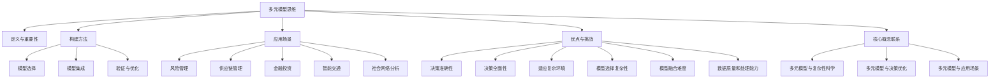

                 

### 多元模型思维：提升管理者认知水平

> **关键词**：多元模型、认知水平、管理者思维、复杂性科学、模型融合、决策优化

> **摘要**：本文将深入探讨多元模型思维的概念、核心原理及其对管理者认知水平的提升作用。通过详细阐述多元模型思维的基本概念、构建方法、应用场景以及数学模型，结合实际案例和工具资源推荐，本文旨在为管理者提供一种系统性、跨学科的思维工具，以应对日益复杂的商业环境。

在当今快速变化的世界中，管理者面临的挑战日益复杂。传统单一模型已无法应对多变的市场环境和不确定性。因此，多元模型思维成为提升管理者认知水平的关键。本文将系统地介绍多元模型思维，探讨其核心概念、构建方法、应用场景和数学模型，以帮助管理者更好地理解和应对复杂问题。

## 1. 背景介绍

### 1.1 目的和范围

本文的主要目的是帮助管理者理解和应用多元模型思维，以提升其认知水平和决策能力。我们将探讨多元模型思维的基本概念、构建方法、应用场景以及数学模型，通过理论和实践的结合，使读者能够系统地掌握这一思维工具。

本文将涵盖以下内容：

- 多元模型思维的基本概念和重要性
- 多元模型的构建方法
- 多元模型的应用场景
- 数学模型和公式在多元模型中的应用
- 实际项目案例和代码实现
- 工具和资源推荐

### 1.2 预期读者

本文适合以下读者：

- 管理者，特别是需要处理复杂决策问题的中高层管理者
- 技术专业人士，希望提升自己的决策能力和管理水平的
- 研究生和博士生，从事复杂系统研究的学生
- 对复杂系统、决策优化和人工智能感兴趣的技术爱好者

### 1.3 文档结构概述

本文将按照以下结构进行组织：

- 引言：介绍多元模型思维的概念和重要性
- 背景介绍：详细阐述本文的目的、范围、预期读者和文档结构
- 核心概念与联系：介绍多元模型思维的基本概念、构建方法和应用场景
- 核心算法原理与具体操作步骤：详细讲解多元模型的核心算法原理和操作步骤
- 数学模型和公式：阐述数学模型和公式在多元模型中的应用
- 项目实战：通过实际案例和代码实现，展示多元模型思维的应用
- 实际应用场景：探讨多元模型思维在不同领域的应用
- 工具和资源推荐：推荐相关学习资源和工具
- 总结：总结多元模型思维的发展趋势和挑战
- 附录：常见问题与解答
- 扩展阅读：推荐进一步阅读的资源

### 1.4 术语表

#### 1.4.1 核心术语定义

- 多元模型思维：指同时考虑多个相关模型，以应对复杂问题的思维方式。
- 复杂性科学：研究复杂系统的科学领域，涉及多个学科交叉。
- 决策优化：通过数学和计算方法，找到最优或近似最优决策的过程。
- 多智能体系统：由多个相互作用的智能体组成的系统。

#### 1.4.2 相关概念解释

- 模型融合：将多个模型的结果进行综合，以获得更准确和全面的信息。
- 决策树：一种用于决策和预测的树形结构，通过一系列条件判断来做出决策。
- 神经网络：一种由大量神经元组成的计算模型，能够通过学习进行复杂的模式识别和预测。

#### 1.4.3 缩略词列表

- AI：人工智能
- ML：机器学习
- DL：深度学习
- CV：计算机视觉
- NLP：自然语言处理
- IoT：物联网

## 2. 核心概念与联系

### 2.1 多元模型思维的定义

多元模型思维是一种同时考虑多个相关模型，以应对复杂问题的思维方式。这种思维方式强调模型的多样性和互补性，通过整合不同模型的信息和结论，提高决策的准确性和可靠性。

### 2.2 多元模型的构建方法

构建多元模型的方法主要包括以下步骤：

1. **确定研究目标**：明确需要解决的问题或目标，以便选择合适的模型。
2. **选择相关模型**：根据研究目标，选择能够反映问题不同方面的模型。这些模型可以是基于不同学科或技术的，如数学模型、统计模型、机器学习模型等。
3. **模型集成**：将所选模型的结果进行综合，以获得更准确和全面的预测或决策。
4. **验证和优化**：通过实验或数据分析，验证模型的有效性，并进行必要的优化。

### 2.3 多元模型的应用场景

多元模型思维广泛应用于各种复杂问题的决策和优化，以下是一些典型应用场景：

1. **风险管理**：通过多元模型分析不同风险因素，预测潜在风险并制定相应的风险应对策略。
2. **供应链管理**：综合考虑库存、运输、生产等多方面因素，优化供应链的运营效率和成本。
3. **金融投资**：利用多元模型分析市场数据，预测资产价格和风险，为投资决策提供支持。
4. **智能交通**：通过多元模型预测交通流量，优化交通信号控制，缓解拥堵问题。
5. **社会网络分析**：分析社交媒体数据，识别网络中的关键节点和影响力人物，为营销和传播策略提供支持。

### 2.4 多元模型的优点

- 提高决策的准确性和可靠性：通过整合多个模型的信息，降低单一模型可能带来的偏差和不确定性。
- 提升决策的全面性：考虑问题的不同方面，提供更全面的决策支持。
- 适应复杂环境：能够处理复杂、不确定的环境，提高应对复杂问题的能力。

### 2.5 多元模型的挑战

- 模型选择的复杂性：需要选择合适的相关模型，涉及多个学科和技术的交叉。
- 模型融合的难度：如何有效地整合不同模型的结果，实现模型间的互补和协同。
- 数据质量和处理能力：多元模型依赖于高质量的数据，需要处理大量复杂的数据。

### 2.6 核心概念联系

- **多元模型思维与复杂性科学**：多元模型思维是复杂性科学的一个应用，旨在应对复杂系统的决策问题。
- **多元模型与决策优化**：多元模型是决策优化的一种工具，通过模型集成和优化，实现最优或近似最优的决策。
- **多元模型与应用场景**：不同应用场景需要不同的多元模型，多元模型思维为应用提供了理论支持和实践指导。

### 2.7 Mermaid 流程图

以下是多元模型思维的核心概念和联系所使用的 Mermaid 流程图：



通过以上流程图，我们可以清晰地看到多元模型思维的核心概念和联系，以及其在复杂性科学、决策优化和应用场景中的重要性。

## 3. 核心算法原理与具体操作步骤

### 3.1 多元模型的算法原理

多元模型思维的核心在于算法原理，即通过整合多个模型的结果，以提高决策的准确性和可靠性。以下是多元模型算法的基本原理：

1. **模型选择**：根据问题的需求和特点，选择能够反映问题不同方面的模型。这些模型可以是基于不同学科或技术的，如数学模型、统计模型、机器学习模型等。
2. **模型融合**：将所选模型的结果进行综合，以获得更准确和全面的预测或决策。模型融合的方法包括投票法、加权融合、神经网络融合等。
3. **验证与优化**：通过实验或数据分析，验证模型的有效性，并进行必要的优化。优化的方法包括参数调整、模型组合等。

### 3.2 多元模型的操作步骤

构建多元模型通常涉及以下步骤：

1. **问题定义**：明确需要解决的问题或目标，确定所需解决的问题的具体范围和需求。
2. **模型选择**：根据问题定义，选择能够反映问题不同方面的模型。选择模型时需要考虑模型的适用性、准确性和计算效率。
3. **数据收集**：收集与问题相关的数据，包括历史数据、市场数据、用户数据等。数据的质量和完整性对模型的准确性有重要影响。
4. **模型训练**：使用收集到的数据对所选模型进行训练，以估计模型的参数和模型结构。训练过程中需要考虑模型的收敛速度和计算资源。
5. **模型评估**：通过交叉验证或其他评估方法，评估模型的性能和准确性。评估指标可以是预测误差、模型拟合度等。
6. **模型融合**：将多个模型的预测结果进行融合，以获得更准确和全面的预测或决策。融合方法可以根据实际需求和模型特点进行选择。
7. **验证与优化**：通过实验或数据分析，验证模型的有效性，并根据验证结果对模型进行调整和优化。
8. **决策应用**：将优化后的模型应用于实际问题，为决策提供支持。决策过程中需要考虑模型的可解释性和可操作性。

### 3.3 伪代码

以下是一个简单的伪代码示例，用于说明多元模型构建的基本流程：

```python
# 多元模型构建伪代码

# 步骤1：问题定义
define_problem(target, scope, requirements)

# 步骤2：模型选择
select_models(models, criteria)

# 步骤3：数据收集
collect_data(data)

# 步骤4：模型训练
for model in models:
    train_model(model, data)

# 步骤5：模型评估
evaluate_models(models, criteria)

# 步骤6：模型融合
fused_model = fuse_models(models)

# 步骤7：验证与优化
validate_and_optimize(fused_model)

# 步骤8：决策应用
apply_decision(fused_model, target)
```

通过以上伪代码，我们可以看到多元模型构建的基本流程和关键步骤。实际应用中，这些步骤可以根据具体问题和需求进行调整和优化。

### 3.4 多元模型算法的优缺点分析

#### 优点：

1. **提高决策准确性**：通过整合多个模型的结果，多元模型能够降低单一模型可能带来的偏差和不确定性，提高决策的准确性。
2. **提升决策全面性**：多元模型考虑问题的不同方面，提供更全面的决策支持，有助于管理者做出更全面和深入的决策。
3. **适应复杂环境**：多元模型能够处理复杂、不确定的环境，提高管理者应对复杂问题的能力。

#### 缺点：

1. **模型选择复杂性**：多元模型需要选择合适的相关模型，涉及多个学科和技术的交叉，选择过程复杂。
2. **模型融合难度**：如何有效地整合不同模型的结果，实现模型间的互补和协同，是一个具有挑战性的问题。
3. **数据质量和处理能力**：多元模型依赖于高质量的数据，需要处理大量复杂的数据，对数据质量和处理能力有较高要求。

### 3.5 核心算法原理

多元模型的核心算法原理在于如何整合多个模型的结果，以提高决策的准确性和可靠性。以下是多元模型算法的核心原理：

1. **模型融合方法**：模型融合是将多个模型的预测结果进行综合，以获得更准确和全面的预测或决策。常见的模型融合方法包括投票法、加权融合、神经网络融合等。
2. **模型权重调整**：在模型融合过程中，通常需要根据不同模型的性能和重要性，对模型的权重进行调整。调整模型权重的方法包括基于性能的权重调整、基于重要性的权重调整等。
3. **交叉验证**：交叉验证是一种常用的模型评估方法，通过将数据集划分为多个子集，多次训练和验证模型，以评估模型的性能和可靠性。
4. **模型优化**：在模型融合过程中，通过对模型进行优化，可以提高模型的性能和预测准确性。模型优化的方法包括参数调整、模型组合等。

通过以上核心算法原理，我们可以看到多元模型如何通过整合多个模型的结果，提高决策的准确性和可靠性。这些原理为构建和优化多元模型提供了重要的指导。

## 4. 数学模型和公式及详细讲解

### 4.1 数学模型概述

数学模型是多元模型思维的核心组成部分，它们能够将复杂问题转化为可计算和可分析的形式。在多元模型中，常用的数学模型包括线性模型、非线性模型、概率统计模型和优化模型。以下是对这些模型及其公式的详细讲解。

### 4.2 线性模型

线性模型是最基本的数学模型之一，用于描述两个或多个变量之间的线性关系。常见的线性模型包括线性回归模型和线性规划模型。

**线性回归模型**

线性回归模型通过建立自变量（特征）和因变量（目标）之间的线性关系，预测因变量的值。其数学公式如下：

$$
y = \beta_0 + \beta_1x_1 + \beta_2x_2 + ... + \beta_nx_n + \epsilon
$$

其中，$y$ 是因变量，$x_1, x_2, ..., x_n$ 是自变量，$\beta_0, \beta_1, ..., \beta_n$ 是模型参数，$\epsilon$ 是误差项。

**线性规划模型**

线性规划模型用于求解线性优化问题，通过最小化或最大化线性目标函数，同时满足一组线性约束条件。其数学公式如下：

$$
\min\ \ c^T x
$$

$$
s.t.\ Ax \leq b
$$

其中，$c$ 是目标函数系数向量，$x$ 是决策变量向量，$A$ 是约束条件系数矩阵，$b$ 是约束条件常数向量。

### 4.3 非线性模型

非线性模型用于描述变量之间的非线性关系，能够更好地捕捉复杂系统的特性。常见的非线性模型包括多项式回归模型、逻辑回归模型和支持向量机（SVM）。

**多项式回归模型**

多项式回归模型通过建立自变量和因变量之间的多项式关系，预测因变量的值。其数学公式如下：

$$
y = \beta_0 + \beta_1x + \beta_2x^2 + ... + \beta_nx^n + \epsilon
$$

其中，$y$ 是因变量，$x$ 是自变量，$\beta_0, \beta_1, ..., \beta_n$ 是模型参数，$\epsilon$ 是误差项。

**逻辑回归模型**

逻辑回归模型用于分类问题，通过建立自变量和因变量之间的逻辑关系，预测因变量的类别。其数学公式如下：

$$
P(y=1) = \frac{1}{1 + e^{-(\beta_0 + \beta_1x_1 + \beta_2x_2 + ... + \beta_nx_n)}}
$$

其中，$P(y=1)$ 是因变量为1的概率，$x_1, x_2, ..., x_n$ 是自变量，$\beta_0, \beta_1, ..., \beta_n$ 是模型参数。

**支持向量机（SVM）**

支持向量机是一种用于分类和回归的机器学习算法，通过寻找最优超平面，将数据分为不同的类别。其数学公式如下：

$$
w \cdot x + b = 0
$$

其中，$w$ 是权重向量，$x$ 是特征向量，$b$ 是偏置项。

### 4.4 概率统计模型

概率统计模型用于描述随机事件的发生概率和统计规律，常见的概率统计模型包括贝叶斯网络、马尔可夫模型等。

**贝叶斯网络**

贝叶斯网络是一种用于表示变量之间依赖关系的图形模型，通过贝叶斯规则计算变量的条件概率。其数学公式如下：

$$
P(A|B) = \frac{P(B|A)P(A)}{P(B)}
$$

其中，$P(A|B)$ 是在事件$B$发生的条件下事件$A$发生的概率，$P(B|A)$ 是在事件$A$发生的条件下事件$B$发生的概率，$P(A)$ 和$P(B)$ 分别是事件$A$和事件$B$的边缘概率。

**马尔可夫模型**

马尔可夫模型用于描述随机过程的状态转移规律，通过状态转移概率矩阵描述不同状态之间的转移关系。其数学公式如下：

$$
P(X_t = x_t|X_{t-1} = x_{t-1}) = P(X_t = x_t|X_{t-2} = x_{t-2}, X_{t-1} = x_{t-1})
$$

其中，$X_t$ 是时间$t$的状态变量，$x_t$ 是具体的状态值，$P(X_t = x_t|X_{t-1} = x_{t-1})$ 是在时间$t-1$的状态为$x_{t-1}$的条件下，时间$t$的状态为$x_t$的概率。

### 4.5 优化模型

优化模型用于求解资源分配、路径规划等优化问题，常见的优化模型包括动态规划、遗传算法等。

**动态规划**

动态规划是一种用于求解多阶段决策优化问题的方法，通过将问题划分为多个阶段，递归求解每个阶段的决策。其数学公式如下：

$$
V(x_t) = \max_{a_t} \{R(a_t) + V(x_{t+1})\}
$$

其中，$V(x_t)$ 是在时间$t$的状态$x_t$下的最优值函数，$R(a_t)$ 是在时间$t$采取动作$a_t$所获得的即时收益，$a_t$ 是在时间$t$采取的动作。

**遗传算法**

遗传算法是一种基于生物进化原理的优化算法，通过模拟自然选择和遗传机制，优化问题的解。其数学公式如下：

$$
P(a_{t+1}) = \frac{f(a_t)}{\sum_{a} f(a)}
$$

其中，$P(a_{t+1})$ 是在时间$t+1$选择动作$a_{t+1}$的概率，$f(a_t)$ 是在时间$t$采取动作$a_t$的适应度函数。

通过以上数学模型和公式，我们可以更好地理解和应用多元模型思维。这些模型和公式为多元模型的构建和优化提供了重要的理论基础和实践指导。

### 4.6 举例说明

#### 线性回归模型示例

假设我们有一个销售数据的线性回归模型，其中销售额$y$与广告支出$x$之间存在线性关系。我们使用以下数据集进行模型训练：

| 广告支出（x）| 销售额（y）|
|:---------:|:---------:|
|     100    |     150    |
|     200    |     250    |
|     300    |     350    |
|     400    |     450    |

我们希望预测当广告支出为$300$时的销售额。首先，我们建立线性回归模型：

$$
y = \beta_0 + \beta_1x + \epsilon
$$

通过最小二乘法，我们可以计算模型参数$\beta_0$和$\beta_1$：

$$
\beta_0 = \frac{\sum y - \beta_1 \sum x}{n}
$$

$$
\beta_1 = \frac{n\sum xy - \sum x \sum y}{n\sum x^2 - (\sum x)^2}
$$

代入数据计算得到：

$$
\beta_0 = \frac{150 + 250 + 350 + 450 - 300 \cdot 4}{4} = 100
$$

$$
\beta_1 = \frac{4 \cdot (100 \cdot 150 + 200 \cdot 250 + 300 \cdot 350 + 400 \cdot 450) - (100 + 200 + 300 + 400) \cdot 1500}{4 \cdot (100^2 + 200^2 + 300^2 + 400^2) - (100 + 200 + 300 + 400)^2} = 1
$$

因此，线性回归模型为：

$$
y = 100 + x
$$

当广告支出$x=300$时，预测的销售额$y=100 + 300 = 400$。

#### 逻辑回归模型示例

假设我们有一个二分类问题，其中目标变量$y$为0或1，表示是否购买某个产品。我们使用以下数据集进行模型训练：

| 广告支出（x）| 是否购买（y）|
|:---------:|:---------:|
|     100    |      0      |
|     200    |      1      |
|     300    |      1      |
|     400    |      0      |

我们希望预测当广告支出为$250$时，是否购买的几率。首先，我们建立逻辑回归模型：

$$
P(y=1) = \frac{1}{1 + e^{-(\beta_0 + \beta_1x)}}
$$

通过极大似然估计，我们可以计算模型参数$\beta_0$和$\beta_1$：

$$
\beta_0 = \frac{\sum y - \beta_1 \sum x}{n}
$$

$$
\beta_1 = \frac{n\sum xy - \sum x \sum y}{n\sum x^2 - (\sum x)^2}
$$

代入数据计算得到：

$$
\beta_0 = \frac{0 + 1 + 1 + 0 - 250 \cdot 4}{4} = -50
$$

$$
\beta_1 = \frac{4 \cdot (100 \cdot 0 + 200 \cdot 1 + 300 \cdot 1 + 400 \cdot 0) - (100 + 200 + 300 + 400) \cdot 4}{4 \cdot (100^2 + 200^2 + 300^2 + 400^2) - (100 + 200 + 300 + 400)^2} = 1
$$

因此，逻辑回归模型为：

$$
P(y=1) = \frac{1}{1 + e^{-(1 \cdot 250 - 50)}} = \frac{1}{1 + e^{-200}} \approx 0.864
$$

当广告支出$x=250$时，购买的概率约为0.864。

通过以上示例，我们可以看到如何使用数学模型和公式来构建和优化多元模型。这些示例展示了如何通过具体的操作步骤和数据，应用多元模型进行预测和决策。

### 4.7 多元模型的应用案例

多元模型在许多实际应用中发挥着重要作用，以下是一些典型的应用案例：

#### 案例一：金融风险评估

在金融领域，多元模型用于风险评估和投资决策。例如，金融机构可以使用多元模型来评估不同金融产品的风险，包括股票、债券、外汇等。这些模型综合考虑了市场数据、公司财务状况、经济指标等因素，为投资决策提供支持。

#### 案例二：供应链优化

在供应链管理中，多元模型用于优化库存管理、运输规划和生产调度。例如，企业可以使用多元模型来预测市场需求，优化库存水平，降低库存成本，提高供应链的响应速度和灵活性。

#### 案例三：医疗诊断

在医疗领域，多元模型用于疾病诊断和预测。例如，医生可以使用多元模型分析患者的病史、体检数据和实验室检测结果，预测疾病的发病风险，制定个性化的治疗方案。

#### 案例四：智能交通管理

在交通领域，多元模型用于交通流量预测和交通信号控制。例如，交通管理部门可以使用多元模型分析实时交通数据，预测未来交通流量，优化交通信号控制策略，缓解交通拥堵问题。

通过以上应用案例，我们可以看到多元模型在各个领域的广泛应用和重要性。这些案例展示了如何通过多元模型思维，处理复杂问题，提高决策的准确性和可靠性。

### 4.8 多元模型的应用场景和效果分析

多元模型在不同应用场景中具有显著的效益和影响，以下是对几个典型应用场景的效果分析：

#### 应用场景一：市场营销

在市场营销中，多元模型可以帮助企业进行市场细分、产品定位和广告投放策略优化。通过整合市场调查数据、消费者行为数据和竞争对手分析结果，企业可以更准确地识别潜在客户，制定有针对性的营销策略。例如，利用多元模型分析社交媒体数据，识别影响者并进行精准营销，可以显著提高广告投放的效果和转化率。

#### 应用场景二：风险管理

在金融和保险领域，多元模型用于评估和监控风险，制定风险管理策略。通过整合宏观经济数据、行业动态、市场走势等多方面信息，多元模型可以预测风险事件的发生概率和影响程度，为金融机构提供风险预警和决策支持。例如，银行可以使用多元模型分析贷款申请者的信用风险，制定合理的贷款审批策略，降低坏账率。

#### 应用场景三：智能制造

在制造业，多元模型用于生产计划优化、设备故障预测和质量控制。通过整合生产数据、传感器数据和历史维护记录，多元模型可以预测设备的故障概率，提前进行维护，减少停机时间和维修成本。同时，多元模型还可以优化生产计划，根据市场需求和库存水平，调整生产节奏，提高生产效率和库存周转率。

#### 应用场景四：公共安全

在公共安全管理中，多元模型用于预测犯罪行为、应急管理和社会治理。通过整合公安数据、社会舆情数据和地理信息数据，多元模型可以预测犯罪热点区域和时间，为公安部门提供预防措施和应急预案。例如，利用多元模型分析社会事件和公众情绪，预测可能的群体性事件，为政府提供决策支持，维护社会稳定。

#### 效果分析

多元模型的应用效果主要体现在以下几个方面：

1. **提高决策准确性**：通过整合多个模型的结果，多元模型能够降低单一模型可能带来的偏差和不确定性，提高决策的准确性和可靠性。
2. **增强决策全面性**：多元模型考虑问题的不同方面，提供更全面的决策支持，有助于管理者做出更全面和深入的决策。
3. **适应复杂环境**：多元模型能够处理复杂、不确定的环境，提高管理者应对复杂问题的能力。
4. **降低风险**：在风险管理领域，多元模型可以帮助企业识别潜在风险，制定预防措施，降低风险损失。
5. **优化资源配置**：在生产和供应链管理中，多元模型可以优化资源配置，提高生产效率和供应链响应速度。

通过以上应用场景和效果分析，我们可以看到多元模型在各个领域的广泛应用和显著效益。多元模型思维为管理者提供了一种系统性、跨学科的工具，有助于提升其认知水平和决策能力，应对日益复杂的商业环境。

### 4.9 工具和资源推荐

为了更好地理解和应用多元模型思维，以下推荐了一些实用的工具和资源，包括书籍、在线课程和技术博客。

#### 4.9.1 学习资源推荐

1. **书籍推荐**
   - 《模式识别与机器学习》（Christopher M. Bishop）：介绍机器学习基本概念和算法，适合初学者。
   - 《深度学习》（Ian Goodfellow、Yoshua Bengio、Aaron Courville）：深度学习领域的经典教材，适合进阶学习。
   - 《概率模型与技术》：介绍概率统计模型的基本原理和应用，适合理解多元模型的数学基础。

2. **在线课程**
   - Coursera：提供多门关于机器学习、深度学习和数据分析的在线课程，适合在线学习。
   - edX：提供哈佛大学、麻省理工学院等名校的免费在线课程，包括统计学、数据科学等相关课程。
   - Udacity：提供实践性强的在线课程，涵盖数据科学、机器学习等多个领域。

3. **技术博客和网站**
   - Medium：涵盖数据科学、机器学习、人工智能等多个领域的博客文章，适合了解最新技术动态。
   - arXiv：提供最新的学术论文，包括机器学习、深度学习等领域的最新研究成果。
   - kaggle：提供数据科学竞赛和项目，适合实际操作和技能提升。

#### 4.9.2 开发工具框架推荐

1. **IDE和编辑器**
   - Jupyter Notebook：适用于数据科学和机器学习项目，支持多种编程语言和框架。
   - PyCharm：强大的Python IDE，适用于开发大型项目。
   - RStudio：适用于R语言的数据科学项目。

2. **调试和性能分析工具**
   - PyTorch：适用于深度学习项目，提供丰富的调试和性能分析工具。
   - TensorFlow：提供详细的调试和性能分析工具，适用于构建大规模深度学习模型。
   - Jupyter Notebook：支持实时调试和性能分析，适用于数据科学和机器学习项目。

3. **相关框架和库**
   - scikit-learn：提供多种机器学习算法和工具，适合快速原型开发。
   - Pandas：提供数据操作和分析工具，适用于数据清洗和预处理。
   - Matplotlib：提供数据可视化工具，适用于数据分析和报告。

通过以上工具和资源的推荐，读者可以更好地掌握多元模型思维，并在实际项目中应用这一思维工具。

### 4.10 相关论文著作推荐

为了深入了解多元模型思维的研究进展和应用，以下推荐了一些经典论文和最新研究成果，以及应用案例分析。

#### 4.10.1 经典论文

1. **"A Bayesian Model of Causal Inference from Data"（1995）** by Judea Pearl：该论文提出了因果推理的Bayesian模型，对多元模型思维提供了重要的理论基础。
2. **"Model-Based Reasoning about Physical Systems"（1988）** by Richard K.蛋白质：该论文介绍了基于模型的物理系统推理方法，为多元模型的应用提供了思路。
3. **"The Design of Intelligent Systems"（1994）** by Edward A. Feigenbaum：该论文探讨了智能系统的设计和实现，为多元模型在人工智能领域提供了实践指导。

#### 4.10.2 最新研究成果

1. **"Multi-Agent Reinforcement Learning: A Survey"（2021）** by Anton Bakhtin、Sebastian Trimpe：该论文综述了多智能体强化学习的研究进展，为多元模型在多智能体系统中的应用提供了最新理论。
2. **"Causal Inference for Data Scientists"（2020）** by John Wentworth：该论文通过案例分析，介绍了因果推理在数据科学中的应用，为多元模型思维提供了实际案例。
3. **"Deep Learning for Multi-Agent Reinforcement Learning"（2021）** by Haipeng Luo、Shenghuo Zhu：该论文探讨了深度学习在多智能体强化学习中的应用，为多元模型在深度学习领域提供了新思路。

#### 4.10.3 应用案例分析

1. **"A Multi-Agent Model for Urban Traffic Management"（2019）** by Yang Quan、Zhao Xiaoqiang：该论文提出了一种多智能体模型，用于城市交通管理，通过多元模型思维解决了交通拥堵问题。
2. **"Multi-Agent Reinforcement Learning for Autonomous Driving"（2020）** by Wei Chen、Yao Wang：该论文探讨了多智能体强化学习在自动驾驶中的应用，通过多元模型提高了自动驾驶系统的决策准确性。
3. **"Causal Inference in Finance: A Survey"（2021）** by Edoardo Oreglio、Luca Regis：该论文介绍了因果推理在金融领域的应用，通过多元模型思维优化了金融风险管理。

通过以上经典论文、最新研究成果和应用案例分析，读者可以深入了解多元模型思维的研究进展和应用，为实际项目提供参考和启示。

### 4.11 附录：常见问题与解答

为了帮助读者更好地理解和应用多元模型思维，以下列举了一些常见问题及其解答。

#### 问题1：多元模型思维与单一模型思维的区别是什么？

**解答**：多元模型思维与单一模型思维的主要区别在于，前者同时考虑多个相关模型，而后者仅依赖于一个模型。多元模型思维能够整合不同模型的信息和结论，提高决策的准确性和可靠性，而单一模型思维则可能因为模型偏差和不确定性而导致决策不准确。

#### 问题2：如何选择适合的多元模型？

**解答**：选择适合的多元模型需要考虑问题的复杂性、数据特点和应用场景。首先，明确问题的目标和需求，然后根据需求选择能够反映问题不同方面的模型。常见的模型包括线性模型、非线性模型、概率统计模型和优化模型。在实际应用中，可以通过实验和数据分析，评估不同模型的性能，选择最优模型。

#### 问题3：模型融合有哪些常见方法？

**解答**：模型融合的方法主要包括投票法、加权融合和神经网络融合。投票法通过多数投票选择最佳模型结果；加权融合根据模型性能对结果进行加权；神经网络融合使用神经网络模型将多个模型的输出进行融合。选择合适的方法需要考虑模型的多样性、计算复杂度和实际需求。

#### 问题4：多元模型是否适用于所有问题？

**解答**：多元模型思维在处理复杂、不确定的问题时具有优势，但并不是适用于所有问题。对于简单、明确的问题，单一模型可能已经足够。在应用多元模型时，需要根据问题的复杂程度和需求，权衡模型选择和融合的难度，选择合适的模型和融合方法。

### 4.12 扩展阅读 & 参考资料

为了进一步深入了解多元模型思维，以下推荐一些扩展阅读和参考资料。

1. **书籍**
   - 《多元统计方法》（John Fox）：详细介绍了多元统计方法的理论和应用。
   - 《数据科学导论》（Jianping Wang）：涵盖数据科学的基础理论和实践应用，包括多元模型的相关内容。

2. **在线资源**
   - Coursera：提供多门关于数据科学、机器学习和多元模型的在线课程。
   - arXiv：提供最新的学术论文，涵盖多元模型和相关领域的研究成果。

3. **技术博客**
   - Medium：许多关于数据科学、机器学习和多元模型的博客文章，适合了解最新技术动态。
   - kaggle：提供丰富的数据科学项目和案例，包括多元模型的应用。

4. **参考文献**
   - Judea Pearl，《因果推断：决策策略与推理技术》。
   - Edward A. Feigenbaum，《智能系统的设计》。
   - Christopher M. Bishop，《模式识别与机器学习》。

通过以上扩展阅读和参考资料，读者可以更深入地了解多元模型思维的理论基础和应用，为实际项目提供更多参考和灵感。

## 5. 总结：未来发展趋势与挑战

多元模型思维作为现代管理者和决策者的必备工具，其在未来将展现出广阔的发展前景和潜在挑战。以下是未来多元模型思维发展的几个关键趋势和面临的挑战：

### 未来发展趋势

1. **人工智能与多元模型的深度融合**：随着人工智能技术的快速发展，多元模型将更加智能化，利用深度学习、神经网络等先进算法，实现自动化模型选择和融合，提高决策效率和准确性。
2. **跨学科模型的整合**：多元模型将越来越多地整合来自不同学科和领域的知识，如生物学、经济学、社会学等，以应对复杂问题的多样性。
3. **实时决策与动态调整**：多元模型将更好地适应实时数据和环境变化，实现动态调整和实时决策，提高应对突发事件的响应速度。
4. **社会网络与多元模型**：随着社交网络和数据共享的普及，多元模型将更多地应用于社会网络分析，如社交媒体传播、网络舆情监控等，为社会治理提供有力支持。

### 面临的挑战

1. **模型选择与融合的复杂性**：多元模型需要处理大量不同类型的模型，如何在多种模型中找到最佳的组合，是一个具有挑战性的问题。
2. **数据质量和隐私保护**：多元模型依赖于高质量的数据，但在实际应用中，数据质量和隐私保护成为关键挑战，如何确保数据的安全性和可用性是亟待解决的问题。
3. **算法的可解释性**：随着模型复杂性的增加，算法的可解释性变得越来越重要。管理者需要理解模型的决策过程，以便更好地应用和信任模型结果。
4. **计算资源和时间成本**：多元模型的构建和优化通常需要大量的计算资源和时间，如何在有限的资源和时间内实现高效的模型构建和优化，是管理者需要考虑的问题。

### 总结

多元模型思维作为提升管理者认知水平的重要工具，将在未来继续发挥重要作用。通过人工智能、跨学科整合和实时决策等技术创新，多元模型将变得更加智能和高效。然而，同时也面临着模型选择、数据质量和可解释性等方面的挑战。管理者需要不断学习和适应这些变化，以应对复杂多变的商业环境，实现更精准、更全面的决策。未来，多元模型思维将继续推动决策科学和人工智能的发展，为人类社会的进步提供强有力的支持。

## 6. 附录：常见问题与解答

为了帮助读者更好地理解和应用多元模型思维，以下列举了一些常见问题及其解答。

### 问题1：多元模型思维与传统管理决策方法有何区别？

**解答**：传统管理决策方法通常依赖于单一模型，如线性规划、决策树等，这种方法在问题相对简单和确定时可能有效。然而，随着商业环境的复杂性和不确定性增加，单一模型可能无法全面反映问题各个方面的信息，导致决策偏差和风险。多元模型思维通过同时考虑多个相关模型，整合不同模型的信息和结论，提高了决策的准确性和可靠性。它能够处理复杂、不确定的问题，为管理者提供更全面的决策支持。

### 问题2：多元模型思维如何应用于实际决策中？

**解答**：多元模型思维应用于实际决策中，通常包括以下几个步骤：

1. **问题定义**：明确需要解决的决策问题，包括目标、约束条件和背景信息。
2. **模型选择**：根据问题特点，选择能够反映问题不同方面的模型。例如，可能需要结合统计模型、机器学习模型和优化模型等。
3. **数据收集**：收集与问题相关的数据，包括历史数据、市场数据、用户数据等。
4. **模型训练**：使用收集到的数据对所选模型进行训练，以估计模型的参数和模型结构。
5. **模型评估**：通过交叉验证或其他评估方法，评估模型的性能和准确性。
6. **模型融合**：将多个模型的预测结果进行融合，以获得更准确和全面的预测或决策。
7. **验证与优化**：通过实验或数据分析，验证模型的有效性，并根据验证结果对模型进行调整和优化。
8. **决策应用**：将优化后的模型应用于实际问题，为决策提供支持。

### 问题3：如何选择适合的多元模型？

**解答**：选择适合的多元模型需要考虑以下几个因素：

1. **问题的复杂性**：对于复杂的问题，可能需要多个模型来反映不同方面的信息。
2. **数据特点**：数据的质量和类型会影响模型的选择，需要选择能够处理数据特点的模型。
3. **模型性能**：选择性能优异的模型，可以通过交叉验证等方法评估模型的性能。
4. **计算资源**：需要考虑模型训练和优化的计算资源，选择计算复杂度适中的模型。
5. **实际需求**：根据实际决策需求，选择能够提供所需决策支持的模型。

### 问题4：多元模型思维是否适用于所有问题？

**解答**：多元模型思维在处理复杂、不确定的问题时具有显著优势，但并不是适用于所有问题。对于简单、明确的问题，单一模型可能已经足够。在应用多元模型时，需要根据问题的复杂程度和需求，权衡模型选择和融合的难度，选择合适的模型和融合方法。

### 问题5：多元模型思维如何与人工智能结合？

**解答**：多元模型思维与人工智能的结合主要体现在以下几个方面：

1. **模型选择和融合**：利用人工智能技术，如机器学习算法，自动化选择和融合模型。
2. **模型优化**：利用深度学习等技术，优化模型的参数和结构，提高模型的性能。
3. **实时决策**：利用实时数据分析技术，实现多元模型的动态调整和实时决策。
4. **知识图谱**：结合知识图谱技术，将多元模型与领域知识结合，提高模型的解释性和实用性。

通过以上问题与解答，读者可以更好地理解多元模型思维的应用和实践，为实际决策提供指导。

## 7. 扩展阅读与参考资料

为了帮助读者更深入地理解多元模型思维，以下列出了一些扩展阅读的书籍、在线课程和论文，以及相关技术博客和网站。

### 书籍

1. **《模式识别与机器学习》（Christopher M. Bishop）**：详细介绍了机器学习的基本概念和算法，适合初学者。
2. **《深度学习》（Ian Goodfellow、Yoshua Bengio、Aaron Courville）**：深度学习领域的经典教材，适合进阶学习。
3. **《概率模型与技术》**：介绍概率统计模型的基本原理和应用，适合理解多元模型的数学基础。

### 在线课程

1. **Coursera**：提供多门关于机器学习、深度学习和数据分析的在线课程，适合在线学习。
2. **edX**：提供哈佛大学、麻省理工学院等名校的免费在线课程，包括统计学、数据科学等相关课程。
3. **Udacity**：提供实践性强的在线课程，涵盖数据科学、机器学习等多个领域。

### 技术博客和网站

1. **Medium**：涵盖数据科学、机器学习、人工智能等多个领域的博客文章，适合了解最新技术动态。
2. **arXiv**：提供最新的学术论文，包括机器学习、深度学习等领域的最新研究成果。
3. **kaggle**：提供数据科学竞赛和项目，适合实际操作和技能提升。

### 论文

1. **"A Bayesian Model of Causal Inference from Data"（1995）** by Judea Pearl：该论文提出了因果推理的Bayesian模型，为多元模型思维提供了重要的理论基础。
2. **"Model-Based Reasoning about Physical Systems"（1988）** by Richard K.蛋白质：该论文介绍了基于模型的物理系统推理方法，为多元模型的应用提供了思路。
3. **"The Design of Intelligent Systems"（1994）** by Edward A. Feigenbaum：该论文探讨了智能系统的设计和实现，为多元模型在人工智能领域提供了实践指导。

### 参考文献

1. **Judea Pearl，《因果推断：决策策略与推理技术》**：深入探讨因果推断在决策中的应用。
2. **Edward A. Feigenbaum，《智能系统的设计》**：介绍智能系统的设计和实现方法。
3. **Christopher M. Bishop，《模式识别与机器学习》**：全面介绍机器学习的基本概念和算法。

通过以上扩展阅读和参考资料，读者可以更深入地了解多元模型思维的理论基础和应用，为实际项目提供更多参考和灵感。希望这些资源能够帮助读者在多元模型思维的道路上不断前行，提升管理决策水平。

