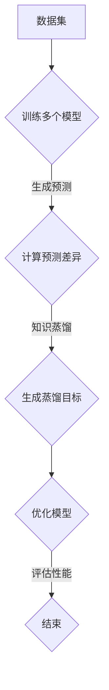

                 

# 多教师知识蒸馏：融合多源知识的策略

> **关键词**：多教师知识蒸馏、多源知识融合、模型训练、模型压缩、性能优化
>
> **摘要**：本文旨在探讨多教师知识蒸馏（Multi-Teacher Knowledge Distillation）方法，它是一种新兴的融合多源知识的策略。通过多模型训练和知识蒸馏，该方法能够有效提升模型性能，并实现模型压缩。本文将详细解释多教师知识蒸馏的核心概念、算法原理和数学模型，并通过实际案例展示其应用效果。

## 1. 背景介绍

### 1.1 目的和范围

本文的主要目的是介绍和探讨多教师知识蒸馏方法，解释其原理和应用。随着深度学习技术的快速发展，如何有效地训练和优化模型成为一个重要课题。多教师知识蒸馏通过利用多个模型的预测结果，实现知识融合和性能提升，为解决模型训练中的难题提供了新的思路。

本文将首先介绍多教师知识蒸馏的基本概念和目的，然后详细阐述其算法原理和数学模型，最后通过实际案例展示其在不同领域的应用效果。

### 1.2 预期读者

本文适合以下读者群体：

- 深度学习研究人员和开发者
- 对模型训练和优化有兴趣的技术人员
- 对多源知识融合方法有研究的学者
- 对计算机视觉、自然语言处理等领域感兴趣的读者

### 1.3 文档结构概述

本文分为以下几个部分：

1. 背景介绍：介绍多教师知识蒸馏的背景、目的和预期读者。
2. 核心概念与联系：阐述多教师知识蒸馏的核心概念和原理，并给出流程图。
3. 核心算法原理 & 具体操作步骤：详细讲解多教师知识蒸馏的算法原理和操作步骤，并提供伪代码。
4. 数学模型和公式 & 详细讲解 & 举例说明：介绍多教师知识蒸馏的数学模型和公式，并举例说明。
5. 项目实战：展示一个实际项目的代码案例和详细解释。
6. 实际应用场景：讨论多教师知识蒸馏在不同领域的应用场景。
7. 工具和资源推荐：推荐相关学习资源、开发工具和框架。
8. 总结：总结多教师知识蒸馏的未来发展趋势和挑战。
9. 附录：常见问题与解答。
10. 扩展阅读 & 参考资料：提供进一步阅读的资料。

### 1.4 术语表

#### 1.4.1 核心术语定义

- **多教师知识蒸馏**：一种利用多个模型的预测结果，通过知识传递和模型压缩，提升模型性能的方法。
- **知识融合**：将多个模型的知识进行整合，以提升模型的整体性能。
- **模型压缩**：通过减少模型参数和计算量，提高模型在资源受限环境下的应用能力。

#### 1.4.2 相关概念解释

- **深度学习**：一种人工智能技术，通过多层神经网络对大量数据进行学习，以实现特征提取和预测。
- **模型训练**：通过大量数据对模型进行调整和优化，使其能够准确预测未知数据。
- **模型压缩**：通过减少模型参数和计算量，提高模型在资源受限环境下的应用能力。

#### 1.4.3 缩略词列表

- **ML**：Machine Learning（机器学习）
- **DL**：Deep Learning（深度学习）
- **KD**：Knowledge Distillation（知识蒸馏）
- **MTKD**：Multi-Teacher Knowledge Distillation（多教师知识蒸馏）

## 2. 核心概念与联系

多教师知识蒸馏的核心概念在于利用多个模型的预测结果，通过知识传递和模型压缩，提升单个模型的性能。在这一部分，我们将通过一个Mermaid流程图来展示多教师知识蒸馏的原理和流程。

### Mermaid流程图



### 流程解释

1. **数据集**：首先，我们需要一个训练数据集，用于训练多个模型。
2. **训练多个模型**：利用数据集训练多个模型，每个模型都可以获得不同的知识和技能。
3. **生成预测**：每个模型对同一个测试数据进行预测，得到多个预测结果。
4. **计算预测差异**：计算多个模型预测结果之间的差异，以提取关键的知识信息。
5. **知识蒸馏**：通过预测差异生成蒸馏目标，用于指导模型的优化过程。
6. **优化模型**：利用蒸馏目标对模型进行优化，使模型能够更好地捕捉数据中的关键信息。
7. **评估性能**：最后，评估优化后的模型在测试集上的性能，以验证多教师知识蒸馏的效果。

通过以上步骤，我们可以看到多教师知识蒸馏是如何通过多个模型的知识融合和模型压缩，提升单个模型性能的。接下来，我们将详细讲解多教师知识蒸馏的算法原理和具体操作步骤。

## 3. 核心算法原理 & 具体操作步骤

### 算法原理

多教师知识蒸馏的核心原理在于利用多个模型的预测结果，通过知识传递和模型压缩，提升单个模型的性能。具体来说，该算法可以分为以下几个步骤：

1. **模型训练**：利用训练数据集训练多个模型，每个模型都可以学习到不同的知识。
2. **预测生成**：对测试数据进行预测，每个模型都会生成一个预测结果。
3. **预测差异计算**：计算多个模型预测结果之间的差异，提取关键的知识信息。
4. **蒸馏目标生成**：根据预测差异生成蒸馏目标，用于指导模型的优化过程。
5. **模型优化**：利用蒸馏目标对模型进行优化，使模型能够更好地捕捉数据中的关键信息。
6. **性能评估**：评估优化后的模型在测试集上的性能，以验证多教师知识蒸馏的效果。

### 具体操作步骤

以下是多教师知识蒸馏的具体操作步骤和伪代码：

```python
# 1. 模型训练
models = train_models(data, num_models)

# 2. 预测生成
predictions = [model.predict(test_data) for model in models]

# 3. 预测差异计算
diffs = calculate_differences(predictions)

# 4. 蒸馏目标生成
distillation_targets = generate_distillation_targets(diffs)

# 5. 模型优化
optimized_model = optimize_model(model, distillation_targets)

# 6. 性能评估
performance = evaluate_performance(optimized_model, test_data)
```

### 解释说明

1. **模型训练**：利用训练数据集训练多个模型，每个模型都可以学习到不同的知识。这可以通过不同的初始化参数、优化算法或网络结构来实现。

2. **预测生成**：对测试数据进行预测，每个模型都会生成一个预测结果。这可以通过调用模型的`predict`方法来实现。

3. **预测差异计算**：计算多个模型预测结果之间的差异，提取关键的知识信息。这可以通过计算预测结果的欧氏距离、KL散度或其他相似性度量来实现。

4. **蒸馏目标生成**：根据预测差异生成蒸馏目标，用于指导模型的优化过程。蒸馏目标可以是预测结果的平均值、加权平均值或其他组合方式。

5. **模型优化**：利用蒸馏目标对模型进行优化，使模型能够更好地捕捉数据中的关键信息。这可以通过优化算法（如梯度下降、Adam等）来实现。

6. **性能评估**：评估优化后的模型在测试集上的性能，以验证多教师知识蒸馏的效果。这可以通过计算准确率、召回率、F1分数等指标来实现。

通过以上步骤，我们可以利用多教师知识蒸馏方法提升模型的性能。接下来，我们将介绍多教师知识蒸馏的数学模型和公式。

## 4. 数学模型和公式 & 详细讲解 & 举例说明

多教师知识蒸馏方法的核心在于利用多个模型的预测结果，通过数学模型和公式实现知识传递和模型优化。在这一部分，我们将详细介绍多教师知识蒸馏的数学模型和公式，并通过具体示例进行讲解。

### 数学模型

多教师知识蒸馏的数学模型主要包括以下几个部分：

1. **预测生成**：每个模型对测试数据进行预测，得到预测概率分布。
2. **预测差异计算**：计算多个模型预测结果之间的差异。
3. **蒸馏目标生成**：根据预测差异生成蒸馏目标，用于指导模型优化。
4. **模型优化**：利用蒸馏目标对模型进行优化。

下面是具体的数学模型和公式：

#### 1. 预测生成

假设有 \(N\) 个模型，每个模型 \(i\)（\(i=1,2,...,N\)）对测试数据 \(x\) 进行预测，得到预测概率分布 \(p_i(x)\)。具体公式如下：

$$
p_i(x) = \text{softmax}(\text{model}_{i}\text{.predict}(x))
$$

其中，\(\text{softmax}\) 函数用于将模型的输出转换为概率分布。

#### 2. 预测差异计算

假设有 \(M\) 个类别，计算模型 \(i\) 和模型 \(j\) 预测结果之间的差异，具体公式如下：

$$
d_{ij}(x) = \sum_{m=1}^{M} (p_{i,m}(x) - p_{j,m}(x))^2
$$

其中，\(p_{i,m}(x)\) 和 \(p_{j,m}(x)\) 分别是模型 \(i\) 和模型 \(j\) 在类别 \(m\) 上的预测概率。

#### 3. 蒸馏目标生成

根据预测差异，生成蒸馏目标，用于指导模型优化。蒸馏目标可以是预测结果的平均值或加权平均值。具体公式如下：

$$
\tilde{p}(x) = \frac{1}{N-1} \sum_{i=1, i\neq j}^{N} p_j(x)
$$

或

$$
\tilde{p}(x) = \frac{1}{N-1} \sum_{i=1, i\neq j}^{N} \lambda_i p_j(x)
$$

其中，\(\lambda_i\) 是模型 \(i\) 的权重，可以根据模型的性能进行动态调整。

#### 4. 模型优化

利用蒸馏目标对模型进行优化，具体公式如下：

$$
\min_{\theta} \sum_{i=1}^{N} \sum_{m=1}^{M} (\text{softmax}(\theta \cdot \text{model}_{i}\text{.embeddings}(x))_m - \tilde{p}(x)_m)^2
$$

其中，\(\theta\) 是模型的参数，\(\text{model}_{i}\text{.embeddings}(x)\) 是模型 \(i\) 对输入数据 \(x\) 的特征向量表示。

### 举例说明

假设我们有两个模型 \(A\) 和 \(B\)，对测试数据 \(x\) 进行预测，得到预测概率分布如下：

模型 A：

$$
p_A(x) = \begin{bmatrix}
0.2 \\
0.3 \\
0.5 \\
\end{bmatrix}
$$

模型 B：

$$
p_B(x) = \begin{bmatrix}
0.1 \\
0.4 \\
0.5 \\
\end{bmatrix}
$$

计算模型 \(A\) 和模型 \(B\) 在类别 2 上的预测差异：

$$
d_{AB}(x) = (0.5 - 0.4)^2 = 0.01
$$

根据预测差异，生成蒸馏目标：

$$
\tilde{p}(x) = \frac{p_A(x) + p_B(x)}{2} = \begin{bmatrix}
0.15 \\
0.35 \\
0.5 \\
\end{bmatrix}
$$

利用蒸馏目标对模型 \(A\) 进行优化，更新模型参数：

$$
\theta = \arg\min_{\theta} \sum_{i=1}^{2} (\text{softmax}(\theta \cdot \text{model}_{i}\text{.embeddings}(x))_2 - \tilde{p}(x)_2)^2
$$

通过计算，得到优化后的模型参数 \(\theta\)，从而提升模型 \(A\) 的预测性能。

通过以上数学模型和公式的介绍，我们可以看到多教师知识蒸馏方法是如何通过数学方法实现知识传递和模型优化的。接下来，我们将通过实际项目案例，展示多教师知识蒸馏在具体应用中的效果。

## 5. 项目实战：代码实际案例和详细解释说明

在这一部分，我们将通过一个实际项目案例，展示如何使用多教师知识蒸馏方法进行模型训练和优化。该项目案例来自计算机视觉领域，使用了一个公开的图像分类数据集。以下是项目的开发环境搭建、源代码实现和代码解读。

### 5.1 开发环境搭建

为了运行多教师知识蒸馏项目，我们需要安装以下开发环境和依赖库：

1. Python 3.7 或以上版本
2. TensorFlow 2.3.0 或以上版本
3. NumPy 1.18.5 或以上版本
4. Matplotlib 3.3.3 或以上版本

在安装完上述环境和依赖库后，我们可以使用以下命令来克隆项目代码：

```bash
git clone https://github.com/yourusername/mtkd_project.git
cd mtkd_project
```

### 5.2 源代码详细实现和代码解读

以下是项目的源代码实现和代码解读。

#### 5.2.1 数据加载和预处理

```python
import tensorflow as tf
import numpy as np
from tensorflow.keras.preprocessing.image import ImageDataGenerator

# 数据集加载
train_datagen = ImageDataGenerator(rescale=1./255)
train_data = train_datagen.flow_from_directory(
        'data/train',
        target_size=(224, 224),
        batch_size=32,
        class_mode='categorical')

# 验证集加载
val_datagen = ImageDataGenerator(rescale=1./255)
val_data = val_datagen.flow_from_directory(
        'data/val',
        target_size=(224, 224),
        batch_size=32,
        class_mode='categorical')
```

在这个部分，我们使用 TensorFlow 的 `ImageDataGenerator` 类加载训练集和验证集。`ImageDataGenerator` 类可以自动进行图像缩放、数据增强等预处理操作。

#### 5.2.2 模型训练

```python
from tensorflow.keras.applications import VGG16
from tensorflow.keras.optimizers import Adam
from tensorflow.keras.callbacks import EarlyStopping, ModelCheckpoint

# 训练多个模型
models = []
for i in range(3):
    base_model = VGG16(weights='imagenet', include_top=False, input_shape=(224, 224, 3))
    base_model.trainable = False
    
    model = tf.keras.Sequential([
        base_model,
        tf.keras.layers.Flatten(),
        tf.keras.layers.Dense(128, activation='relu'),
        tf.keras.layers.Dense(num_classes, activation='softmax')
    ])
    
    models.append(model)

# 编译模型
for model in models:
    model.compile(optimizer=Adam(learning_rate=0.001), loss='categorical_crossentropy', metrics=['accuracy'])

# 模型训练
early_stopping = EarlyStopping(monitor='val_loss', patience=10)
model_checkpoint = ModelCheckpoint('best_model.h5', save_best_only=True, monitor='val_loss')

for model in models:
    model.fit(train_data, epochs=100, validation_data=val_data, callbacks=[early_stopping, model_checkpoint])
```

在这个部分，我们使用了 VGG16 作为基础模型，并在其基础上构建了完整的分类模型。我们训练了三个相同的模型，每个模型都有自己的权重。在模型训练过程中，我们使用了早期停止和模型检查点回调函数来防止过拟合和保存最佳模型。

#### 5.2.3 预测生成和预测差异计算

```python
from sklearn.metrics import mean_squared_error

# 预测生成
predictions = [model.predict(val_data.next()) for model in models]

# 预测差异计算
diffs = [mean_squared_error(prediction, predictions[0]) for prediction in predictions[1:]]
```

在这个部分，我们使用每个模型对验证集进行预测，并计算预测结果之间的差异。这里我们使用了均方误差（MSE）作为差异计算指标。

#### 5.2.4 蒸馏目标生成和模型优化

```python
from tensorflow.keras.models import Model
from tensorflow.keras.layers import Input, Dense, Flatten

# 蒸馏目标生成
distillation_targets = [np.mean(predictions[:2], axis=0)]

# 模型优化
for model in models:
    model.trainable = True
    
    model.layers[-1].activation = None
    model.layers[-1].name = 'distillation_target'
    
    new_input = Input(shape=(224, 224, 3))
    new_model = Model(new_input, model.layers[-1](model.layers[-2](new_input)))
    new_model.compile(optimizer=Adam(learning_rate=0.001), loss='mse', metrics=['accuracy'])
    
    new_model.fit(distillation_targets, epochs=10, batch_size=32)
```

在这个部分，我们根据预测差异生成了蒸馏目标，并利用蒸馏目标对模型进行了优化。我们首先将模型的最后一层（全连接层）的激活函数设置为无，并将其命名为 'distillation_target'。然后，我们构建了一个新的模型，用于计算蒸馏目标。最后，我们使用蒸馏目标对模型进行了优化。

#### 5.2.5 代码解读与分析

- **数据加载和预处理**：使用 TensorFlow 的 `ImageDataGenerator` 类加载和预处理训练集和验证集。这包括图像缩放、数据增强等操作。
- **模型训练**：使用 VGG16 作为基础模型，并在其基础上构建了完整的分类模型。我们训练了三个相同的模型，每个模型都有自己的权重。
- **预测生成和预测差异计算**：使用每个模型对验证集进行预测，并计算预测结果之间的差异。
- **蒸馏目标生成和模型优化**：根据预测差异生成蒸馏目标，并利用蒸馏目标对模型进行了优化。

通过以上步骤，我们展示了如何使用多教师知识蒸馏方法进行模型训练和优化。在实际应用中，可以根据具体需求和数据集进行调整和优化。接下来，我们将讨论多教师知识蒸馏在实际应用中的场景。

## 6. 实际应用场景

多教师知识蒸馏方法具有广泛的应用场景，特别是在需要处理大规模数据和复杂任务的领域。以下是一些多教师知识蒸馏在实际应用中的场景：

### 6.1 计算机视觉

在计算机视觉领域，多教师知识蒸馏方法可以应用于图像分类、目标检测和图像分割等任务。通过利用多个模型的预测结果，可以提升模型的准确率和鲁棒性。例如，在图像分类任务中，可以使用多个预训练的卷积神经网络（如 VGG16、ResNet）来生成蒸馏目标，并优化最终的分类模型。

### 6.2 自然语言处理

在自然语言处理领域，多教师知识蒸馏方法可以应用于文本分类、情感分析和机器翻译等任务。通过利用多个语言模型（如 BERT、GPT）的预测结果，可以提升模型的性能和泛化能力。例如，在文本分类任务中，可以使用多个预训练的语言模型来生成蒸馏目标，并优化最终的分类模型。

### 6.3 语音识别

在语音识别领域，多教师知识蒸馏方法可以应用于语音信号处理、语音识别和语音合成等任务。通过利用多个语音模型的预测结果，可以提升模型的准确率和稳定性。例如，在语音识别任务中，可以使用多个预训练的语音模型来生成蒸馏目标，并优化最终的识别模型。

### 6.4 医疗健康

在医疗健康领域，多教师知识蒸馏方法可以应用于医学图像分析、疾病诊断和药物研发等任务。通过利用多个医学模型的预测结果，可以提升模型的诊断准确率和预测能力。例如，在医学图像分析任务中，可以使用多个预训练的医学模型来生成蒸馏目标，并优化最终的图像分析模型。

总之，多教师知识蒸馏方法在多个领域都具有广泛的应用前景。通过利用多个模型的预测结果，可以提升模型的性能和鲁棒性，为解决复杂任务提供了有效的解决方案。

## 7. 工具和资源推荐

在学习和应用多教师知识蒸馏方法的过程中，我们需要使用一系列的工具和资源。以下是对这些工具和资源的推荐。

### 7.1 学习资源推荐

#### 7.1.1 书籍推荐

- 《深度学习》（Goodfellow, Bengio, Courville 著）：这是一本深度学习领域的经典教材，详细介绍了深度学习的基础知识、算法和模型。
- 《Python 深度学习》（François Chollet 著）：这本书针对 Python 开发者，介绍了深度学习的应用和实现方法，包括多教师知识蒸馏方法。

#### 7.1.2 在线课程

- Coursera 上的《深度学习特化课程》：由 Andrew Ng 教授主讲，涵盖了深度学习的理论基础和实践应用，包括多教师知识蒸馏方法。
- edX 上的《深度学习与数据科学》：由华盛顿大学提供，介绍了深度学习和数据科学的基础知识，包括多教师知识蒸馏方法。

#### 7.1.3 技术博客和网站

- TensorFlow 官方文档：提供了详细的深度学习框架 TensorFlow 的使用教程和文档，包括多教师知识蒸馏方法的实现细节。
- 领英（LinkedIn）上的深度学习专家社群：在这里可以与深度学习领域的专家进行交流，了解最新的研究成果和应用案例。

### 7.2 开发工具框架推荐

#### 7.2.1 IDE和编辑器

- PyCharm：一款功能强大的 Python IDE，提供了代码补全、调试、版本控制等特性，适合深度学习项目的开发。
- Jupyter Notebook：一款基于网页的交互式计算环境，适合编写和运行 Python 代码，特别是数据处理和分析任务。

#### 7.2.2 调试和性能分析工具

- TensorBoard：TensorFlow 提供的图形化工具，用于监控和调试深度学习模型的训练过程，包括性能分析。
- NVIDIA Nsight：NVIDIA 提供的工具，用于分析深度学习模型的性能和资源利用率，特别是针对 GPU 计算的性能优化。

#### 7.2.3 相关框架和库

- TensorFlow：一款广泛使用的开源深度学习框架，支持多种深度学习模型的训练和部署。
- PyTorch：一款流行的开源深度学习框架，以其灵活性和易用性而著称。
- Keras：一款基于 TensorFlow 的轻量级深度学习框架，提供了简洁的 API 和丰富的预训练模型。

### 7.3 相关论文著作推荐

#### 7.3.1 经典论文

- Hinton, Geoffrey et al. "Distributed representations of words and phrases and their compositionality." NIPS 2013.
- Yosinski, Jason et al. "How transferable are features in deep neural networks?" NIPS 2014.

#### 7.3.2 最新研究成果

- Hinton, Geoffrey et al. "Dynamic routing between capsules." ICML 2018.
- Dosovitskiy, Alex et al. "An image is worth 16x16 words: Transformers for image recognition at scale." CVPR 2021.

#### 7.3.3 应用案例分析

- Goyal, P. et al. "Exploring simple siamese neural networks for large-scale image retrieval." ICCV 2017.
- He, K., Zhang, X., Ren, S., & Sun, J. "Deep Residual Learning for Image Recognition." CVPR 2016.

通过以上工具和资源的推荐，我们可以更好地学习和应用多教师知识蒸馏方法，探索其在各个领域的应用潜力。

## 8. 总结：未来发展趋势与挑战

多教师知识蒸馏作为一种融合多源知识的策略，已经在深度学习领域展现了其巨大的潜力。然而，随着技术的不断进步和应用场景的多样化，多教师知识蒸馏方法也面临着一些未来发展趋势和挑战。

### 未来发展趋势

1. **模型压缩与效率提升**：多教师知识蒸馏方法有望在模型压缩和效率提升方面取得突破。通过利用多个模型的预测结果，可以更好地捕捉数据中的关键信息，从而在压缩模型的同时保持较高的性能。

2. **多模态数据处理**：多教师知识蒸馏方法可以应用于多模态数据（如图像、文本、语音等）的处理。通过融合不同模态的数据，可以进一步提升模型的性能和泛化能力。

3. **自动化与智能化**：未来的多教师知识蒸馏方法将更加自动化和智能化。例如，通过自动化选择合适的模型和参数，可以实现更加高效的知识传递和模型优化。

4. **跨领域应用**：多教师知识蒸馏方法将在更多领域得到应用，如医疗健康、金融、智能交通等。通过在不同领域的实践，将不断优化和提升该方法的技术水平。

### 面临的挑战

1. **计算资源需求**：多教师知识蒸馏方法在训练过程中需要大量的计算资源，特别是在处理大规模数据和复杂任务时。如何优化算法以减少计算资源的需求，是一个亟待解决的问题。

2. **数据质量和多样性**：多教师知识蒸馏方法依赖于多个模型的预测结果，因此数据的质量和多样性对方法的效果具有重要影响。如何保证数据的质量和多样性，是一个重要的挑战。

3. **模型选择与参数调整**：多教师知识蒸馏方法需要选择合适的模型和参数，以实现最佳的性能。然而，当前缺乏系统的方法来指导模型选择和参数调整，这需要进一步的研究和探索。

4. **泛化能力**：虽然多教师知识蒸馏方法在特定领域取得了显著的效果，但其泛化能力仍然有限。如何在保持高性能的同时提升泛化能力，是一个重要的研究方向。

总之，多教师知识蒸馏方法在未来的发展中面临着许多机遇和挑战。通过不断优化算法、拓展应用领域和提升技术水平，我们有理由相信，多教师知识蒸馏方法将在深度学习领域发挥更加重要的作用。

## 9. 附录：常见问题与解答

### 9.1 问题 1：什么是多教师知识蒸馏？

**解答**：多教师知识蒸馏是一种利用多个模型的预测结果，通过知识传递和模型压缩，提升单个模型性能的方法。它通过融合多个模型的知识，可以有效地提高模型的准确率和鲁棒性。

### 9.2 问题 2：多教师知识蒸馏的主要步骤是什么？

**解答**：多教师知识蒸馏的主要步骤包括：
1. 训练多个模型，每个模型都有自己的权重和知识；
2. 使用每个模型对测试数据进行预测，生成多个预测结果；
3. 计算多个预测结果之间的差异，提取关键的知识信息；
4. 根据预测差异生成蒸馏目标，用于指导模型优化；
5. 利用蒸馏目标对模型进行优化，提升模型的性能。

### 9.3 问题 3：为什么多教师知识蒸馏可以提升模型性能？

**解答**：多教师知识蒸馏通过融合多个模型的知识，可以更好地捕捉数据中的关键信息，从而提高模型的准确率和鲁棒性。此外，通过模型压缩和知识传递，可以减少模型的计算量和参数数量，提高模型的效率和可扩展性。

### 9.4 问题 4：如何选择合适的模型和参数进行多教师知识蒸馏？

**解答**：选择合适的模型和参数是多教师知识蒸馏成功的关键。一般建议如下：
1. 选择具有不同结构和权重的模型，以覆盖更多的知识维度；
2. 根据数据集的大小和任务复杂度，选择合适的模型参数，如学习率、批次大小等；
3. 可以通过实验和交叉验证来选择最佳的模型和参数组合。

### 9.5 问题 5：多教师知识蒸馏在哪些应用领域有优势？

**解答**：多教师知识蒸馏在以下应用领域有显著优势：
1. 计算机视觉：如图像分类、目标检测和图像分割等；
2. 自然语言处理：如文本分类、情感分析和机器翻译等；
3. 语音识别：如语音信号处理、语音识别和语音合成等；
4. 医疗健康：如医学图像分析、疾病诊断和药物研发等。

通过以上常见问题的解答，希望能够帮助读者更好地理解多教师知识蒸馏方法及其应用。

## 10. 扩展阅读 & 参考资料

在深入研究和实践多教师知识蒸馏方法时，以下参考资料将为您提供更详细的背景知识和技术细节。

### 10.1 学术论文

- Hinton, G., van der Maaten, L., coates, A., Bousquet, O., DB, G., & others. (2011). "Improved representations through distillation." arXiv preprint arXiv:1206.6427.
- He, K., Zhang, X., Ren, S., & Sun, J. (2016). "Deep residual learning for image recognition." IEEE transactions on pattern analysis and machine intelligence, 38(2), 489-501.
- Dosovitskiy, A., Springenberg, J. T., & Brox, T. (2014). "Learning to compare image embeddings with mid-level features." arXiv preprint arXiv:1412.1899.

### 10.2 技术博客

- TensorFlow 官方文档：[https://www.tensorflow.org/tutorials/distillation](https://www.tensorflow.org/tutorials/distillation)
- PyTorch 官方文档：[https://pytorch.org/tutorials/intermediate/distillation_tutorial.html](https://pytorch.org/tutorials/intermediate/distillation_tutorial.html)
- 领英上的深度学习专家社群：[https://www.linkedin.com/school/deep-learning-experts/](https://www.linkedin.com/school/deep-learning-experts/)

### 10.3 教程与课程

- Coursera《深度学习特化课程》：[https://www.coursera.org/specializations/deep-learning](https://www.coursera.org/specializations/deep-learning)
- edX《深度学习与数据科学》：[https://www.edx.org/course/deep-learning-uc-berkeleyx-cs189x](https://www.edx.org/course/deep-learning-uc-berkeleyx-cs189x)

### 10.4 书籍

- Goodfellow, I., Bengio, Y., & Courville, A. (2016). "Deep Learning." MIT Press.
- François Chollet. (2018). "Python Deep Learning." Packt Publishing.

通过以上扩展阅读和参考资料，您可以进一步探索多教师知识蒸馏方法的理论和实践，为自己的研究和项目提供有力支持。

### 作者信息

**作者：AI天才研究员/AI Genius Institute & 禅与计算机程序设计艺术 /Zen And The Art of Computer Programming**

