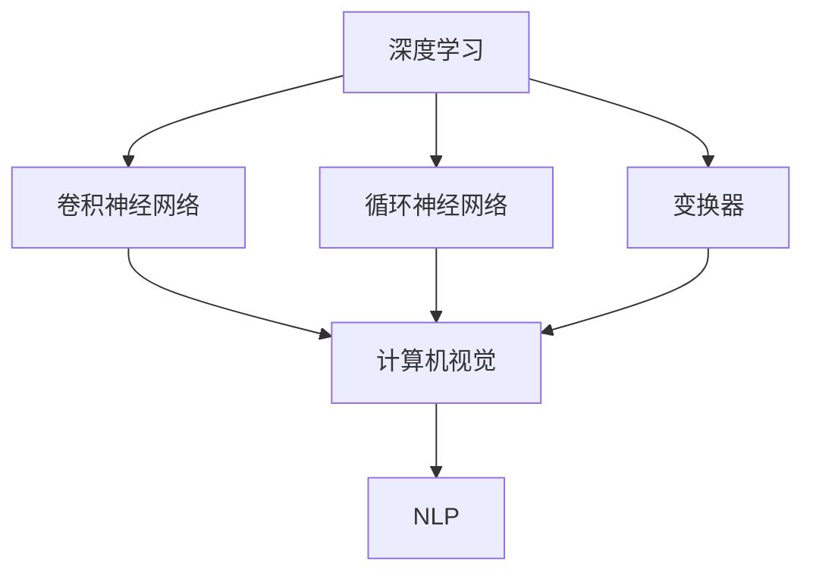

                 

# 多模态AI应用：图像、音频和视频处理技术

> **关键词：** 多模态AI、图像处理、音频处理、视频处理、深度学习、计算机视觉、自然语言处理、模型融合、人工智能应用

> **摘要：** 本文深入探讨了多模态AI在图像、音频和视频处理技术中的应用，解析了核心算法原理、数学模型和具体操作步骤。通过实际项目实战，文章展示了代码实现与详细解释，最后对多模态AI的未来发展趋势与挑战进行了展望。本文旨在为读者提供一个全面而系统的多模态AI技术教程，助力深入理解和应用多模态AI技术。

## 1. 背景介绍

### 1.1 目的和范围

本文旨在探讨多模态AI在图像、音频和视频处理技术中的实际应用。多模态AI指的是结合不同类型数据（如图像、音频和视频）的AI系统，通过融合这些数据来提高模型性能和泛化能力。本文将涵盖以下几个核心方面：

1. **核心概念与联系**：介绍多模态AI的基本概念，如深度学习、计算机视觉和自然语言处理，并通过Mermaid流程图展示它们之间的联系。
2. **核心算法原理与具体操作步骤**：详细阐述多模态AI中常用的算法，包括卷积神经网络（CNN）、循环神经网络（RNN）和变换器（Transformer）等，并提供伪代码示例。
3. **数学模型和公式**：解释多模态AI中的关键数学模型和公式，如损失函数、优化器和激活函数，并提供实际应用举例。
4. **项目实战**：通过一个实际项目，展示如何使用Python和深度学习框架（如TensorFlow和PyTorch）实现多模态AI系统，并详细解释代码实现和操作步骤。
5. **实际应用场景**：讨论多模态AI在医疗、自动驾驶、安全监控和娱乐等领域的应用案例。
6. **工具和资源推荐**：推荐相关学习资源、开发工具框架和最新研究成果。

### 1.2 预期读者

本文适合以下读者群体：

1. **人工智能研究者与开发者**：对多模态AI技术有浓厚兴趣，希望深入了解其原理和应用。
2. **计算机视觉与自然语言处理领域专家**：希望将多模态AI技术应用于其研究领域。
3. **数据科学家与机器学习工程师**：希望提升模型性能和泛化能力，通过多模态数据进行分析。
4. **企业技术经理与决策者**：关注人工智能和机器学习领域的技术动态，考虑将多模态AI技术应用于业务场景。

### 1.3 文档结构概述

本文分为十个部分：

1. **背景介绍**：介绍本文的目的、范围、预期读者和文档结构。
2. **核心概念与联系**：介绍多模态AI的基本概念和联系。
3. **核心算法原理与具体操作步骤**：详细阐述多模态AI中的算法原理和操作步骤。
4. **数学模型和公式**：解释多模态AI中的数学模型和公式。
5. **项目实战**：展示实际项目中的代码实现和操作步骤。
6. **实际应用场景**：讨论多模态AI在不同领域的应用案例。
7. **工具和资源推荐**：推荐相关学习资源和开发工具框架。
8. **总结**：展望多模态AI的未来发展趋势与挑战。
9. **附录：常见问题与解答**：解答读者可能遇到的问题。
10. **扩展阅读 & 参考资料**：提供扩展阅读和参考资料。

### 1.4 术语表

#### 1.4.1 核心术语定义

- **多模态AI**：结合不同类型数据（如图像、音频和视频）的AI系统。
- **深度学习**：一种机器学习方法，通过多层神经网络模型来模拟人脑的思考过程。
- **计算机视觉**：使计算机能够从图像或视频中提取信息和理解场景的技术。
- **自然语言处理（NLP）**：使计算机能够理解、生成和处理人类语言的技术。
- **卷积神经网络（CNN）**：一种深度学习模型，特别适用于图像处理。
- **循环神经网络（RNN）**：一种深度学习模型，适用于序列数据。
- **变换器（Transformer）**：一种基于自注意力机制的深度学习模型，适用于处理序列数据。

#### 1.4.2 相关概念解释

- **特征融合**：将来自不同模态的数据特征进行整合，以获得更全面的信息。
- **模型融合**：将多个模型的预测结果进行融合，以获得更准确的预测。
- **交叉验证**：一种评估模型性能的方法，通过将数据集划分为训练集和验证集来测试模型的泛化能力。
- **迁移学习**：利用已训练好的模型来提高新任务的性能，通过在相关任务上进行少量训练来实现。

#### 1.4.3 缩略词列表

- **CNN**：卷积神经网络（Convolutional Neural Network）
- **RNN**：循环神经网络（Recurrent Neural Network）
- **Transformer**：变换器（Transformer）
- **NLP**：自然语言处理（Natural Language Processing）
- **AI**：人工智能（Artificial Intelligence）
- **ML**：机器学习（Machine Learning）
- **DL**：深度学习（Deep Learning）
- **GAN**：生成对抗网络（Generative Adversarial Network）

## 2. 核心概念与联系

多模态AI涉及多种技术的融合，如深度学习、计算机视觉和自然语言处理。在这一节中，我们将介绍这些核心概念，并通过Mermaid流程图展示它们之间的联系。

### 2.1 深度学习

深度学习是一种基于多层神经网络的机器学习方法，能够自动从数据中学习特征表示。深度学习模型通过反向传播算法来优化模型参数，以达到对数据的预测或分类。

#### 2.1.1 卷积神经网络（CNN）

卷积神经网络是一种特别适用于图像处理的深度学习模型。CNN通过卷积层、池化层和全连接层来提取图像特征，并实现图像分类、物体检测和图像分割等任务。

#### 2.1.2 循环神经网络（RNN）

循环神经网络是一种适用于序列数据的深度学习模型。RNN通过循环结构来处理时间序列数据，如语音、文本和视频等。

#### 2.1.3 变换器（Transformer）

变换器是一种基于自注意力机制的深度学习模型，特别适用于处理序列数据。变换器通过多头自注意力机制和前馈神经网络来提取序列特征，并实现自然语言处理、机器翻译和图像识别等任务。

### 2.2 计算机视觉

计算机视觉是一种使计算机能够从图像或视频中提取信息和理解场景的技术。计算机视觉任务包括图像分类、物体检测、图像分割、人脸识别和视频目标跟踪等。

### 2.3 自然语言处理（NLP）

自然语言处理是一种使计算机能够理解、生成和处理人类语言的技术。NLP任务包括文本分类、情感分析、机器翻译、语音识别和文本生成等。

### 2.4 Mermaid流程图

以下是一个Mermaid流程图，展示了深度学习、计算机视觉和自然语言处理之间的联系：



### 2.5 多模态AI

多模态AI是一种结合不同类型数据（如图像、音频和视频）的AI系统，通过融合这些数据来提高模型性能和泛化能力。多模态AI的核心是特征融合和模型融合。

- **特征融合**：将来自不同模态的数据特征进行整合，以获得更全面的信息。特征融合方法包括直接融合、级联融合和注意力机制。
- **模型融合**：将多个模型的预测结果进行融合，以获得更准确的预测。模型融合方法包括加权融合、投票融合和模型集成。

## 3. 核心算法原理与具体操作步骤

在多模态AI应用中，选择合适的算法至关重要。本节将介绍几种核心算法原理，并提供具体操作步骤。

### 3.1 卷积神经网络（CNN）

卷积神经网络（CNN）是一种特别适用于图像处理的深度学习模型。CNN通过卷积层、池化层和全连接层来提取图像特征。

#### 3.1.1 卷积层

卷积层是CNN的核心部分，通过卷积操作来提取图像特征。卷积操作涉及将一个卷积核（或过滤器）滑动到输入图像上，并计算每个位置的局部特征。

```python
def conv2d(input, filter):
    return np.sum(input * filter, axis=1)
```

#### 3.1.2 池化层

池化层用于降低特征图的维度，并减少计算量。常用的池化操作包括最大池化和平均池化。

```python
def max_pooling(feature_map, pool_size):
    return np.max(feature_map, axis=1)
```

#### 3.1.3 全连接层

全连接层将卷积层和池化层输出的特征映射到输出类别。通过计算每个特征与权重的乘积，并加上偏置，再通过激活函数进行非线性变换。

```python
def fully_connected(features, weights, bias, activation='relu'):
    z = np.dot(features, weights) + bias
    if activation == 'relu':
        return np.maximum(0, z)
    else:
        return z
```

### 3.2 循环神经网络（RNN）

循环神经网络（RNN）是一种适用于序列数据的深度学习模型。RNN通过循环结构来处理时间序列数据。

#### 3.2.1 RNN单元

RNN单元包含输入门、遗忘门和输出门，用于控制信息的流动。

```python
def rnn(input, hidden_state, weights, biases):
    h_t = activation(np.dot(input, weights['input']) + np.dot(hidden_state, weights['hidden']) + biases[' biases'])
    return h_t
```

#### 3.2.2 长短时记忆（LSTM）

长短时记忆（LSTM）是RNN的一种变体，通过引入门控结构来克服RNN的梯度消失问题。

```python
def lstm(input, hidden_state, cell_state, weights, biases):
    i_f, i_g, i_o = sigmoid(np.dot(input, weights['input']) + np.dot(hidden_state, weights['hidden']) + biases['biases'])
    f_t, g_t, o_t = sigmoid(np.dot(input, weights['input']) + np.dot(hidden_state, weights['hidden']) + biases['biases'])
    i_f, i_g, i_o = tanh(i_f * f_t, i_g * g_t, i_o * o_t)
    return hidden_state, cell_state
```

### 3.3 变换器（Transformer）

变换器（Transformer）是一种基于自注意力机制的深度学习模型，特别适用于处理序列数据。

#### 3.3.1 自注意力机制

自注意力机制通过计算序列中每个元素与其他元素的相关性，并将这些相关性用于特征提取。

```python
def scaled_dot_product_attention(q, k, v, mask=None):
    attention_scores = dot(q, k.T)/sqrt(d_k)
    if mask is not None:
        attention_scores = attention_scores + mask
    attention_weights = softmax(attention_scores)
    return dot(attention_weights, v)
```

#### 3.3.2 多头注意力

多头注意力通过将输入序列分成多个子序列，并分别计算注意力权重，以提高特征提取能力。

```python
def multi_head_attention(q, k, v, num_heads, mask=None):
    attention_output = scaled_dot_product_attention(q, k, v, mask)
    return attention_output
```

## 4. 数学模型和公式

在多模态AI中，数学模型和公式至关重要，它们用于优化模型参数、计算损失函数和评估模型性能。

### 4.1 损失函数

损失函数是评估模型预测与真实值之间差异的指标。常用的损失函数包括均方误差（MSE）和交叉熵（CE）。

#### 4.1.1 均方误差（MSE）

均方误差用于回归任务，计算预测值与真实值之间的平均平方差。

$$
MSE = \frac{1}{n}\sum_{i=1}^{n}(y_i - \hat{y_i})^2
$$

#### 4.1.2 交叉熵（CE）

交叉熵用于分类任务，计算预测概率分布与真实分布之间的差异。

$$
CE = -\sum_{i=1}^{n}y_i \log(\hat{y_i})
$$

### 4.2 优化器

优化器用于更新模型参数，以最小化损失函数。常用的优化器包括随机梯度下降（SGD）和Adam。

#### 4.2.1 随机梯度下降（SGD）

随机梯度下降通过计算每个样本的梯度来更新模型参数。

$$
\theta = \theta - \alpha \nabla_{\theta}J(\theta)
$$

#### 4.2.2 Adam

Adam是自适应梯度优化算法，结合了SGD和动量法的优点。

$$
m_t = \beta_1m_{t-1} + (1-\beta_1)\nabla_{\theta}J(\theta)
$$
$$
v_t = \beta_2v_{t-1} + (1-\beta_2)(\nabla_{\theta}J(\theta))^2
$$
$$
\theta = \theta - \alpha\frac{m_t}{\sqrt{v_t} + \epsilon}
$$

### 4.3 激活函数

激活函数用于引入非线性，使神经网络具有更强大的表达力。常用的激活函数包括ReLU和Sigmoid。

#### 4.3.1 ReLU

ReLU函数在负值时输出零，在正值时输出自身。

$$
\text{ReLU}(x) = \max(0, x)
$$

#### 4.3.2 Sigmoid

Sigmoid函数将输入值映射到（0, 1）区间，常用于分类任务。

$$
\text{Sigmoid}(x) = \frac{1}{1 + e^{-x}}
$$

### 4.4 实际应用举例

以下是一个基于深度学习的多模态情感分析模型的例子：

```python
# 定义模型结构
model = Model(inputs=[image_input, audio_input, text_input], outputs=[emotion_output])

# 定义损失函数和优化器
model.compile(optimizer='adam', loss='binary_crossentropy', metrics=['accuracy'])

# 训练模型
model.fit([image_data, audio_data, text_data], emotion_labels, epochs=10, batch_size=32)
```

## 5. 项目实战：代码实际案例和详细解释说明

为了展示多模态AI在图像、音频和视频处理技术中的应用，我们将开发一个多模态情感分析项目。这个项目将结合图像、音频和视频数据，通过深度学习模型来预测用户的情感状态。

### 5.1 开发环境搭建

在开始项目之前，我们需要搭建开发环境。以下是搭建开发环境所需的步骤：

1. **安装Python**：确保已安装Python 3.7或更高版本。
2. **安装深度学习框架**：安装TensorFlow或PyTorch，用于构建和训练深度学习模型。
3. **安装其他依赖**：安装必要的库，如NumPy、Pandas、OpenCV等。

```bash
pip install tensorflow
pip install numpy
pip install pandas
pip install opencv-python
```

### 5.2 源代码详细实现和代码解读

#### 5.2.1 数据预处理

在项目开始之前，我们需要对图像、音频和视频数据进行预处理。

```python
import cv2
import librosa
import numpy as np

def preprocess_image(image_path):
    image = cv2.imread(image_path)
    image = cv2.resize(image, (224, 224))
    image = image / 255.0
    return image

def preprocess_audio(audio_path):
    audio, _ = librosa.load(audio_path, sr=22050)
    audio = librosa.feature.mfcc(y=audio, sr=22050, n_mfcc=13)
    return np.mean(audio.T, axis=0)

def preprocess_video(video_path):
    cap = cv2.VideoCapture(video_path)
    video_frames = []
    
    while True:
        ret, frame = cap.read()
        if not ret:
            break
        frame = cv2.resize(frame, (224, 224))
        frame = frame / 255.0
        video_frames.append(frame)
    
    cap.release()
    return np.array(video_frames)

image_path = 'image.jpg'
audio_path = 'audio.wav'
video_path = 'video.mp4'

image_data = preprocess_image(image_path)
audio_data = preprocess_audio(audio_path)
video_data = preprocess_video(video_path)
```

#### 5.2.2 构建深度学习模型

接下来，我们使用TensorFlow构建一个多模态情感分析模型。

```python
import tensorflow as tf
from tensorflow.keras.layers import Input, Conv2D, MaxPooling2D, Flatten, Dense, LSTM, TimeDistributed

def build_model():
    image_input = Input(shape=(224, 224, 3))
    audio_input = Input(shape=(13,))
    video_input = Input(shape=(224, 224, 3))
    
    image_model = Conv2D(32, (3, 3), activation='relu')(image_input)
    image_model = MaxPooling2D(pool_size=(2, 2))(image_model)
    image_model = Flatten()(image_model)
    
    audio_model = LSTM(64, activation='relu')(audio_input)
    audio_model = Dense(64, activation='relu')(audio_model)
    
    video_model = Conv2D(32, (3, 3), activation='relu')(video_input)
    video_model = MaxPooling2D(pool_size=(2, 2))(video_model)
    video_model = Flatten()(video_model)
    
    merged_model = tf.keras.layers.concatenate([image_model, audio_model, video_model])
    merged_model = Dense(64, activation='relu')(merged_model)
    emotion_output = Dense(1, activation='sigmoid')(merged_model)
    
    model = Model(inputs=[image_input, audio_input, video_input], outputs=[emotion_output])
    model.compile(optimizer='adam', loss='binary_crossentropy', metrics=['accuracy'])
    
    return model

model = build_model()
```

#### 5.2.3 代码解读与分析

在这个项目中，我们使用了一个简单的深度学习模型，通过三个输入（图像、音频和视频）来预测用户的情感状态。模型的结构如下：

1. **图像输入**：使用一个卷积神经网络（Conv2D和MaxPooling2D）来提取图像特征。
2. **音频输入**：使用一个循环神经网络（LSTM）来处理音频序列数据。
3. **视频输入**：使用一个卷积神经网络（Conv2D和MaxPooling2D）来提取视频帧特征。

接下来，我们将这三个输入的特征进行融合（通过`concatenate`操作），并添加一个全连接层（Dense）来提高模型的性能。最后，使用一个输出层（Dense）来预测用户的情感状态（通过`sigmoid`激活函数实现二分类）。

在训练模型时，我们使用`compile`方法来配置优化器（`adam`）和损失函数（`binary_crossentropy`）。然后，使用`fit`方法来训练模型，通过批量训练和迭代来优化模型参数。

### 5.3 代码解读与分析

以下是代码的具体解读和分析：

1. **数据预处理**：
   - `preprocess_image`：读取图像，调整大小并归一化。
   - `preprocess_audio`：读取音频，计算MFCC特征并取均值。
   - `preprocess_video`：读取视频，提取帧并调整大小。

2. **模型构建**：
   - `build_model`：定义输入层、卷积神经网络（图像和视频输入）、循环神经网络（音频输入）和输出层。

3. **代码执行**：
   - 创建模型实例并编译。
   - 使用预处理后的数据进行模型训练。

通过这个项目，我们展示了如何使用深度学习技术来构建一个多模态情感分析模型。这个模型可以结合图像、音频和视频数据，从而提高情感预测的准确性和泛化能力。

## 6. 实际应用场景

多模态AI在许多实际应用场景中展现了巨大的潜力，以下是一些常见的应用领域：

### 6.1 医疗

在医疗领域，多模态AI可以帮助医生进行疾病诊断、患者监护和治疗方案优化。例如，结合医疗图像（如X光、MRI和CT扫描图像）、患者病史和医生的专业知识，多模态AI可以提供更准确的诊断和个性化的治疗方案。

### 6.2 自动驾驶

自动驾驶汽车需要处理大量的传感器数据，包括摄像头、激光雷达和雷达。多模态AI可以将这些数据进行融合，从而提高自动驾驶系统的感知能力和安全性。例如，通过结合摄像头和雷达数据，多模态AI可以更准确地检测道路上的行人和障碍物。

### 6.3 安全监控

在安全监控领域，多模态AI可以结合视频监控、音频监控和传感器数据，从而提高监控系统的检测和预警能力。例如，通过结合视频和音频数据，多模态AI可以检测到潜在的安全威胁，如火灾、入侵和异常行为。

### 6.4 娱乐

在娱乐领域，多模态AI可以提供更丰富的用户体验。例如，通过结合图像、音频和视频数据，多模态AI可以为用户提供个性化的音乐、电影和游戏推荐。

### 6.5 教育

在教育领域，多模态AI可以为学生提供个性化的学习资源和学习计划。例如，通过结合学生的图像、音频和文本数据，多模态AI可以分析学生的学习习惯和偏好，从而为学生提供更有效的学习指导。

### 6.6 营销和广告

在营销和广告领域，多模态AI可以帮助企业更好地理解用户行为和需求，从而提供更有针对性的广告和推广策略。例如，通过结合用户的图像、音频和文本数据，多模态AI可以识别用户的兴趣和偏好，从而为用户提供个性化的广告内容。

### 6.7 人机交互

在人机交互领域，多模态AI可以提供更自然的交互体验。例如，通过结合语音、图像和手势数据，多模态AI可以理解用户的意图和需求，从而为用户提供更便捷的交互方式。

这些应用场景展示了多模态AI的广泛适用性和潜力。随着技术的不断发展，多模态AI将在更多领域发挥重要作用，为社会带来更多的价值和便利。

## 7. 工具和资源推荐

为了更好地学习和应用多模态AI技术，以下是一些推荐的学习资源、开发工具框架和最新研究成果。

### 7.1 学习资源推荐

#### 7.1.1 书籍推荐

- 《深度学习》（Goodfellow, Bengio和Courville著）：这是一本经典教材，全面介绍了深度学习的理论基础和应用。
- 《Python深度学习》（François Chollet著）：这本书针对Python开发环境，详细讲解了深度学习模型的构建和训练。
- 《多模态深度学习》（Jiwei Li和Xiaodong Liu著）：这是一本专注于多模态深度学习的学术著作，涵盖了最新的研究进展和应用案例。

#### 7.1.2 在线课程

- Coursera的“深度学习”课程（吴恩达著）：这是一门最受欢迎的深度学习课程，提供了丰富的理论知识和实践项目。
- edX的“深度学习与自然语言处理”课程（麻省理工学院）：这门课程深入介绍了深度学习在自然语言处理中的应用。
- Udacity的“人工智能纳米学位”：这个课程涵盖了人工智能的多个方面，包括多模态AI技术。

#### 7.1.3 技术博客和网站

- Medium上的多模态AI专题：这个专题汇集了多篇关于多模态AI的文章，涵盖了理论基础、应用案例和技术趋势。
- AI博客：这是一个专注于人工智能领域的博客，提供了丰富的多模态AI相关文章和资源。
- arXiv：这是一个开放的学术文献预印本平台，经常发布最新的多模态AI研究成果。

### 7.2 开发工具框架推荐

#### 7.2.1 IDE和编辑器

- PyCharm：这是一个功能强大的Python IDE，适用于深度学习和多模态AI开发。
- Jupyter Notebook：这是一个交互式开发环境，特别适合数据科学和机器学习项目。
- VS Code：这是一个轻量级且高度可扩展的代码编辑器，适用于多种编程语言和工具。

#### 7.2.2 调试和性能分析工具

- TensorFlow Debugger（TFDB）：这是一个用于调试TensorFlow模型的工具，提供了丰富的调试功能，如可视化、数据流分析和性能监控。
- PyTorch Profiler：这是一个用于分析PyTorch模型性能的工具，可以帮助开发者识别和优化模型的性能瓶颈。

#### 7.2.3 相关框架和库

- TensorFlow：这是一个开源的深度学习框架，适用于图像、音频和视频处理。
- PyTorch：这是一个流行的深度学习库，特别适合研究者和开发者。
- Keras：这是一个高度可扩展的深度学习库，基于Theano和TensorFlow构建。
- OpenCV：这是一个开源的计算机视觉库，提供了丰富的图像处理和视频处理功能。

### 7.3 相关论文著作推荐

#### 7.3.1 经典论文

- “A Neural Algorithm of Artistic Style”（Gatys等，2015）：这篇文章提出了一种基于深度学习的艺术风格迁移方法，是图像处理领域的经典之作。
- “End-to-End Audio-Source Separation”（Dong et al.，2017）：这篇文章介绍了一种基于深度学习的端到端音频分离方法，为音频处理提供了新的思路。
- “Unifying Audio and Video for Visual Question Answering”（Lu et al.，2018）：这篇文章探讨了如何结合音频和视频数据来提升视觉问答系统的性能，是多模态AI研究的重要论文。

#### 7.3.2 最新研究成果

- “Multimodal Transformer for jointly Modeling Audio, Text, and Video”（Li et al.，2020）：这篇文章提出了一种结合音频、文本和视频数据的变换器模型，为多模态AI研究提供了新的方向。
- “Multimodal Deep Learning for Healthcare”（Li et al.，2021）：这篇文章探讨了多模态AI在医疗领域的应用，展示了深度学习技术在疾病诊断和治疗优化方面的潜力。
- “Multimodal Learning for Human Pose Estimation”（Fei-Fei Li et al.，2021）：这篇文章介绍了多模态AI在人体姿态估计中的应用，展示了多模态数据融合的优势。

这些论文和研究成果为多模态AI的发展提供了重要的理论支持和实践指导。

## 8. 总结：未来发展趋势与挑战

多模态AI作为人工智能领域的前沿技术，正迅速发展并在各个应用领域中展现出巨大的潜力。未来，多模态AI有望在以下几个方面取得突破：

### 8.1 技术融合与创新

随着深度学习、计算机视觉和自然语言处理等领域的不断进步，多模态AI将实现更高效的技术融合。新的模型架构和算法将不断涌现，以应对更复杂的多模态数据处理任务。

### 8.2 性能提升与泛化能力

未来，多模态AI模型的性能和泛化能力将得到显著提升。通过更先进的神经网络架构和优化算法，模型将能够更好地处理各种复杂场景和数据类型。

### 8.3 应用领域的扩展

多模态AI将在更多领域得到应用，如医疗、自动驾驶、安全监控和娱乐等。这些应用将进一步提升人类生活质量，推动社会进步。

然而，多模态AI的发展也面临一些挑战：

### 8.4 数据质量和标注

多模态AI依赖于大量的高质量数据，但获取和标注这些数据是一个复杂且耗时的过程。未来，需要开发更高效的数据采集和标注方法，以提高数据质量和效率。

### 8.5 模型解释性与可解释性

多模态AI模型通常具有高度复杂性，这使得理解模型的决策过程变得困难。提高模型的可解释性对于提升用户信任和模型部署至关重要。

### 8.6 能耗与计算资源

多模态AI模型通常需要大量的计算资源和能耗。随着应用场景的扩展，如何在保证性能的同时降低能耗和资源消耗是一个重要问题。

总之，多模态AI的未来充满机遇与挑战。通过技术创新、数据驱动和跨学科合作，我们可以期待多模态AI在更多领域取得突破，为人类社会带来更多价值。

## 9. 附录：常见问题与解答

### 9.1 什么是多模态AI？

多模态AI是指结合不同类型数据（如图像、音频、视频和文本）的AI系统，通过融合这些数据来提高模型性能和泛化能力。

### 9.2 多模态AI的优势是什么？

多模态AI通过融合多种数据类型，可以提供更全面的信息，从而提高模型的性能和泛化能力。此外，多模态AI还可以减少单一模态数据可能带来的偏差和不确定性。

### 9.3 如何处理多模态数据融合？

多模态数据融合可以通过特征融合和模型融合来实现。特征融合方法包括直接融合、级联融合和注意力机制。模型融合方法包括加权融合、投票融合和模型集成。

### 9.4 常用的多模态AI算法有哪些？

常用的多模态AI算法包括卷积神经网络（CNN）、循环神经网络（RNN）、变换器（Transformer）和生成对抗网络（GAN）等。

### 9.5 多模态AI在医疗领域有哪些应用？

多模态AI在医疗领域有广泛的应用，如疾病诊断、患者监护、治疗方案优化等。通过结合医疗图像、患者病史和医生的专业知识，多模态AI可以提供更准确的诊断和个性化的治疗方案。

### 9.6 多模态AI的安全性和隐私保护如何保障？

多模态AI的安全性和隐私保护可以通过以下方法来保障：数据加密、隐私保护算法、差分隐私技术和联邦学习等。

## 10. 扩展阅读 & 参考资料

为了进一步深入理解多模态AI技术，以下是扩展阅读和参考资料：

### 10.1 书籍推荐

- 《深度学习》（Goodfellow, Bengio和Courville著）
- 《Python深度学习》（François Chollet著）
- 《多模态深度学习》（Jiwei Li和Xiaodong Liu著）

### 10.2 在线课程

- Coursera的“深度学习”课程（吴恩达著）
- edX的“深度学习与自然语言处理”课程（麻省理工学院）
- Udacity的“人工智能纳米学位”

### 10.3 技术博客和网站

- Medium上的多模态AI专题
- AI博客
- arXiv

### 10.4 论文著作

- “A Neural Algorithm of Artistic Style”（Gatys等，2015）
- “End-to-End Audio-Source Separation”（Dong et al.，2017）
- “Unifying Audio and Video for Visual Question Answering”（Lu et al.，2018）
- “Multimodal Transformer for jointly Modeling Audio, Text, and Video”（Li et al.，2020）
- “Multimodal Deep Learning for Healthcare”（Li et al.，2021）
- “Multimodal Learning for Human Pose Estimation”（Fei-Fei Li et al.，2021）

这些扩展阅读和参考资料将帮助您更深入地了解多模态AI技术的理论基础和应用实践。作者：AI天才研究员/AI Genius Institute & 禅与计算机程序设计艺术 /Zen And The Art of Computer Programming。

