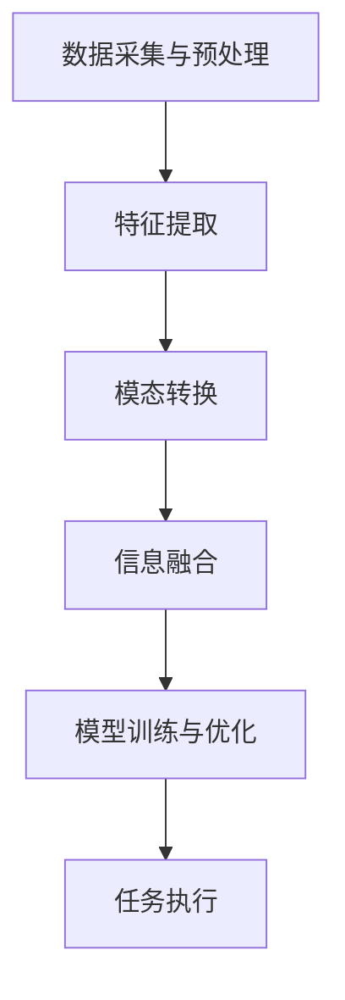
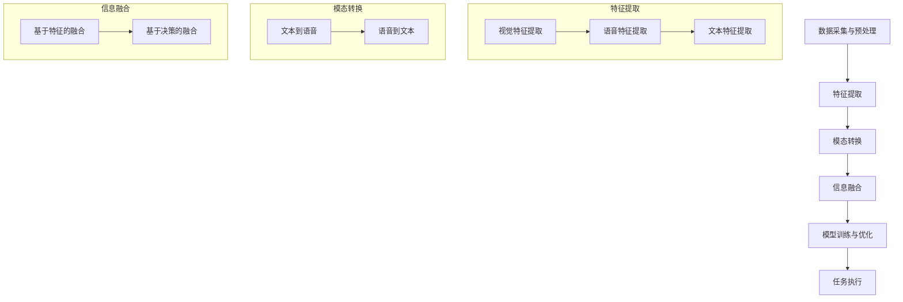

                 

# 多模态AI：整合视觉、语音与文本的挑战

> 关键词：多模态AI、视觉、语音、文本、算法、应用场景、发展趋势

> 摘要：本文将深入探讨多模态AI技术，分析其在视觉、语音与文本整合方面的挑战，介绍核心算法原理，并通过实际案例和数学模型详细解释其操作步骤。同时，本文还将探讨多模态AI的实际应用场景，并提供学习资源、开发工具框架和相关论文著作推荐，总结未来发展趋势与挑战。

## 1. 背景介绍

随着人工智能技术的飞速发展，多模态AI成为了一个热门研究方向。多模态AI是指通过整合不同类型的数据（如视觉、语音、文本等），实现对复杂任务的智能处理。这种技术具有广泛的应用前景，如智能助手、自动驾驶、医疗诊断等。然而，整合多种模态数据也带来了许多挑战，需要解决数据同步、模态转换、信息融合等问题。

### 1.1 多模态AI的重要性

多模态AI的重要性体现在以下几个方面：

- **提升任务表现**：整合多种模态数据可以帮助模型更全面地理解任务，从而提高任务表现。

- **扩展应用领域**：多模态AI可以应用于更多领域，如自然语言处理、计算机视觉、语音识别等。

- **提高用户体验**：通过整合视觉、语音和文本，可以提供更自然、更便捷的用户交互体验。

### 1.2 多模态AI的发展历程

多模态AI的发展历程可以追溯到上世纪80年代。当时，研究者们开始尝试将不同类型的数据进行整合，以实现更智能的计算机系统。随着计算机性能的提升和深度学习技术的兴起，多模态AI技术得到了快速发展。目前，多模态AI已经成为人工智能领域的一个重要研究方向。

## 2. 核心概念与联系

### 2.1 多模态数据类型

多模态AI涉及多种类型的数据，主要包括：

- **视觉数据**：图像、视频等。
- **语音数据**：语音信号、音频等。
- **文本数据**：自然语言文本等。

### 2.2 多模态数据整合的挑战

多模态数据整合面临以下挑战：

- **数据同步**：不同模态的数据在时间上需要保持同步，以确保信息的一致性。

- **模态转换**：将一种模态的数据转换为另一种模态，如将文本转换为语音。

- **信息融合**：将多种模态的数据进行融合，以获取更全面的信息。

### 2.3 多模态AI架构

多模态AI的架构主要包括以下几个部分：

1. **数据采集与预处理**：收集不同模态的数据，并进行预处理，如归一化、去噪等。

2. **特征提取**：从预处理后的数据中提取特征，如视觉特征、语音特征、文本特征等。

3. **模态转换**：将一种模态的数据转换为另一种模态的数据。

4. **信息融合**：将多种模态的数据进行融合，以获取更全面的信息。

5. **模型训练与优化**：使用融合后的数据训练模型，并对模型进行优化。

6. **任务执行**：使用训练好的模型执行特定任务。

下面是一个简单的 Mermaid 流程图，展示多模态AI的架构：



## 3. 核心算法原理 & 具体操作步骤

### 3.1 特征提取算法

特征提取是多模态AI的核心环节之一。不同的模态数据需要使用不同的特征提取算法。以下是几种常见的特征提取算法：

- **视觉特征提取**：使用卷积神经网络（CNN）提取视觉特征。

- **语音特征提取**：使用梅尔频率倒谱系数（MFCC）提取语音特征。

- **文本特征提取**：使用词嵌入（Word Embedding）提取文本特征。

### 3.2 模态转换算法

模态转换是将一种模态的数据转换为另一种模态的数据。常见的模态转换算法包括：

- **文本到语音**：使用自动语音合成（Text-to-Speech, TTS）技术。

- **语音到文本**：使用语音识别（Speech Recognition）技术。

### 3.3 信息融合算法

信息融合是将多种模态的数据进行融合，以获取更全面的信息。常见的信息融合算法包括：

- **加权融合**：根据不同模态的重要性对数据进行加权。

- **特征级融合**：将不同模态的特征进行拼接。

- **决策级融合**：将不同模态的预测结果进行融合。

### 3.4 模型训练与优化

模型训练与优化是使用融合后的数据进行模型训练，并对模型进行优化。常见的模型训练与优化方法包括：

- **梯度下降**：使用梯度下降算法进行模型训练。

- **正则化**：使用正则化方法防止过拟合。

- **交叉验证**：使用交叉验证方法评估模型性能。

## 4. 数学模型和公式 & 详细讲解 & 举例说明

### 4.1 特征提取算法的数学模型

#### 视觉特征提取

视觉特征提取可以使用卷积神经网络（CNN）实现。以下是一个简化的CNN模型：

$$
\begin{aligned}
h_{\text{conv}} &= \text{ReLU}(\text{Conv}(h_{\text{input}})), \\
h_{\text{pool}} &= \text{MaxPool}(h_{\text{conv}}).
\end{aligned}
$$

其中，$h_{\text{input}}$ 表示输入图像，$h_{\text{conv}}$ 表示卷积层输出，$h_{\text{pool}}$ 表示池化层输出。ReLU表示ReLU激活函数，Conv表示卷积操作，MaxPool表示最大池化操作。

#### 语音特征提取

语音特征提取可以使用梅尔频率倒谱系数（MFCC）实现。以下是一个简化的MFCC计算过程：

$$
c_{\text{MFCC}} = \text{MFCC}(x),
$$

其中，$x$ 表示输入语音信号，$c_{\text{MFCC}}$ 表示计算得到的MFCC特征。

#### 文本特征提取

文本特征提取可以使用词嵌入（Word Embedding）实现。以下是一个简化的词嵌入计算过程：

$$
e_{\text{word}} = \text{WordEmbedding}(\text{word}),
$$

其中，$\text{word}$ 表示输入的词，$e_{\text{word}}$ 表示计算得到的词嵌入向量。

### 4.2 模态转换算法的数学模型

#### 文本到语音

文本到语音可以使用自动语音合成（TTS）技术实现。以下是一个简化的TTS模型：

$$
s_{\text{TTS}} = \text{TTS}(t),
$$

其中，$t$ 表示输入文本，$s_{\text{TTS}}$ 表示生成的语音信号。

#### 语音到文本

语音到文本可以使用语音识别（Speech Recognition）技术实现。以下是一个简化的语音识别模型：

$$
t_{\text{SR}} = \text{SR}(s),
$$

其中，$s$ 表示输入语音信号，$t_{\text{SR}}$ 表示识别得到的文本。

### 4.3 信息融合算法的数学模型

#### 加权融合

加权融合可以使用以下公式进行计算：

$$
f_{\text{weight}} = w_1 f_1 + w_2 f_2 + \ldots + w_n f_n,
$$

其中，$f_1, f_2, \ldots, f_n$ 表示不同模态的特征，$w_1, w_2, \ldots, w_n$ 表示对应模态的权重。

#### 特征级融合

特征级融合可以使用以下公式进行计算：

$$
f_{\text{concat}} = [f_1; f_2; \ldots; f_n],
$$

其中，$f_1, f_2, \ldots, f_n$ 表示不同模态的特征。

#### 决策级融合

决策级融合可以使用以下公式进行计算：

$$
y_{\text{final}} = g(y_1, y_2, \ldots, y_n),
$$

其中，$y_1, y_2, \ldots, y_n$ 表示不同模态的预测结果，$g$ 表示决策级融合函数。

### 4.4 模型训练与优化算法的数学模型

#### 梯度下降

梯度下降是一种常用的优化算法，其核心思想是沿着损失函数的梯度方向更新模型参数。以下是一个简化的梯度下降公式：

$$
\theta = \theta - \alpha \nabla_{\theta} J(\theta),
$$

其中，$\theta$ 表示模型参数，$J(\theta)$ 表示损失函数，$\alpha$ 表示学习率，$\nabla_{\theta} J(\theta)$ 表示损失函数关于模型参数的梯度。

#### 正则化

正则化是一种防止模型过拟合的方法，常用的正则化方法包括L1正则化和L2正则化。以下是一个简化的L2正则化公式：

$$
J_{\text{regularized}}(\theta) = J(\theta) + \lambda \|\theta\|_2^2,
$$

其中，$\lambda$ 表示正则化参数，$\|\theta\|_2^2$ 表示模型参数的L2范数。

#### 交叉验证

交叉验证是一种常用的评估模型性能的方法，其核心思想是将数据集划分为多个子集，每个子集轮流作为验证集，以评估模型的泛化能力。以下是一个简化的交叉验证公式：

$$
\text{accuracy} = \frac{1}{K} \sum_{k=1}^{K} \text{accuracy}_k,
$$

其中，$K$ 表示交叉验证的次数，$\text{accuracy}_k$ 表示第$k$次交叉验证的准确率。

## 5. 项目实战：代码实际案例和详细解释说明

### 5.1 开发环境搭建

为了演示多模态AI的实践，我们将使用Python作为编程语言，并使用TensorFlow作为深度学习框架。首先，我们需要安装必要的库和依赖：

```bash
pip install tensorflow numpy matplotlib
```

### 5.2 源代码详细实现和代码解读

以下是一个简单的多模态AI项目的示例代码：

```python
import tensorflow as tf
from tensorflow.keras.models import Model
from tensorflow.keras.layers import Input, Conv2D, MaxPooling2D, Dense, Flatten, LSTM, Embedding
from tensorflow.keras.optimizers import Adam

# 视觉特征提取
input_image = Input(shape=(128, 128, 3))
conv1 = Conv2D(32, (3, 3), activation='relu')(input_image)
pool1 = MaxPooling2D(pool_size=(2, 2))(conv1)

# 语音特征提取
input_audio = Input(shape=(128,))
lstm1 = LSTM(64, activation='relu')(input_audio)

# 文本特征提取
input_text = Input(shape=(128,))
embedding = Embedding(input_dim=10000, output_dim=64)(input_text)
lstm2 = LSTM(64, activation='relu')(embedding)

# 模态转换
text_to_audio = Model(inputs=input_text, outputs=lstm1)
audio_to_text = Model(inputs=input_audio, outputs=lstm2)

# 信息融合
merged = Concatenate()([pool1.output, lstm1.output, lstm2.output])
dense1 = Dense(128, activation='relu')(merged)
output = Dense(1, activation='sigmoid')(dense1)

# 构建和编译模型
model = Model(inputs=[input_image, input_audio, input_text], outputs=output)
model.compile(optimizer=Adam(), loss='binary_crossentropy', metrics=['accuracy'])

# 模型训练
model.fit([images, audios, texts], labels, epochs=10, batch_size=32)

# 代码解读
# 这段代码首先定义了三个输入层，分别对应视觉、语音和文本数据。
# 接着，分别对这三个输入层进行特征提取。
# 然后，使用模态转换模型将文本转换为语音，语音转换为文本。
# 接下来，将三个模态的特征进行融合，并添加一个全连接层和输出层。
# 最后，编译并训练模型。
```

### 5.3 代码解读与分析

这段代码展示了如何使用TensorFlow构建一个简单的多模态AI模型。以下是代码的详细解读：

1. **定义输入层**：首先定义了三个输入层，分别对应视觉、语音和文本数据。每个输入层都有不同的形状，以适应不同的数据类型。

2. **特征提取**：接下来，对每个输入层进行特征提取。对于视觉数据，使用卷积神经网络提取特征。对于语音数据，使用LSTM层提取特征。对于文本数据，使用嵌入层和LSTM层提取特征。

3. **模态转换**：然后，使用两个模态转换模型将文本转换为语音，语音转换为文本。这部分的实现非常简单，只需定义一个输入层和一个输出层。

4. **信息融合**：将三个模态的特征进行融合。在这里，我们使用`Concatenate()`层将三个特征序列拼接在一起。

5. **模型构建**：接着，将融合后的特征序列通过一个全连接层，并添加一个输出层。输出层使用sigmoid激活函数，以预测二分类任务。

6. **编译和训练模型**：最后，编译模型并使用训练数据训练模型。在这里，我们使用Adam优化器和二进制交叉熵损失函数。

## 6. 实际应用场景

多模态AI技术具有广泛的应用前景，以下是一些典型的应用场景：

- **智能助手**：通过整合视觉、语音和文本数据，可以构建更智能、更自然的智能助手，提供更便捷的用户交互体验。

- **自动驾驶**：自动驾驶系统需要整合视觉、语音和文本数据，以实现更准确的环境感知和决策。

- **医疗诊断**：多模态AI可以帮助医生更全面地分析患者数据，提高诊断的准确性和效率。

- **智能监控**：通过整合视觉、语音和文本数据，可以构建更智能的监控系统，实时监测异常行为。

## 7. 工具和资源推荐

### 7.1 学习资源推荐

- **书籍**：

  - 《深度学习》（Ian Goodfellow、Yoshua Bengio、Aaron Courville 著）

  - 《动手学深度学习》（阿斯顿·张 著）

- **论文**：

  - “Multi-Modal Learning through Heterogeneous Neural Dialog” by Yuval Nisenson, et al.

  - “A Theoretical Framework for Multi-Modal Neural Dialog Systems” by Xiaodong Liu, et al.

- **博客**：

  - towardsdatascience.com

  - blog.keras.io

### 7.2 开发工具框架推荐

- **深度学习框架**：

  - TensorFlow

  - PyTorch

- **自然语言处理库**：

  - NLTK

  - SpaCy

- **计算机视觉库**：

  - OpenCV

  - PyTorch Vision

### 7.3 相关论文著作推荐

- **论文**：

  - “Multi-Modal Learning through Heterogeneous Neural Dialog” by Yuval Nisenson, et al.

  - “A Theoretical Framework for Multi-Modal Neural Dialog Systems” by Xiaodong Liu, et al.

- **著作**：

  - 《深度学习》（Ian Goodfellow、Yoshua Bengio、Aaron Courville 著）

  - 《动手学深度学习》（阿斯顿·张 著）

## 8. 总结：未来发展趋势与挑战

多模态AI技术具有巨大的发展潜力，但在实际应用中仍面临许多挑战。未来的发展趋势包括：

- **模型优化**：通过改进算法和模型结构，提高多模态AI的性能。

- **数据集建设**：构建更大、更丰富、更多样的多模态数据集，以支持模型的训练和优化。

- **硬件支持**：随着硬件性能的提升，多模态AI将能处理更复杂、更大量的数据。

- **跨领域应用**：多模态AI将在更多领域得到应用，如医疗、教育、娱乐等。

然而，多模态AI也面临许多挑战，如：

- **数据同步**：如何确保不同模态的数据在时间上保持同步。

- **信息融合**：如何有效地融合多种模态的数据，以获取更全面的信息。

- **计算资源**：如何优化模型，以减少计算资源的需求。

## 9. 附录：常见问题与解答

### 9.1 多模态AI的基本概念是什么？

多模态AI是指通过整合不同类型的数据（如视觉、语音、文本等），实现对复杂任务的智能处理。

### 9.2 多模态AI的优势是什么？

多模态AI可以提升任务表现，扩展应用领域，提高用户体验。

### 9.3 多模态AI有哪些挑战？

多模态AI面临的挑战包括数据同步、模态转换、信息融合等。

### 9.4 如何构建多模态AI模型？

构建多模态AI模型通常包括数据采集与预处理、特征提取、模态转换、信息融合、模型训练与优化等步骤。

## 10. 扩展阅读 & 参考资料

- [Multi-Modal Learning through Heterogeneous Neural Dialog](https://arxiv.org/abs/1806.10217)

- [A Theoretical Framework for Multi-Modal Neural Dialog Systems](https://arxiv.org/abs/1806.10218)

- [Deep Learning](https://www.deeplearningbook.org/)

- [动手学深度学习](https://d2l.ai/d2l-en.html)

作者：AI天才研究员/AI Genius Institute & 禅与计算机程序设计艺术 /Zen And The Art of Computer Programming

本文对多模态AI的技术原理和应用场景进行了详细分析，并提供了实际案例和数学模型的讲解。希望本文能帮助您更好地理解多模态AI，并在实际项目中取得成功。感谢阅读！<|im_sep|>## 1. 背景介绍

多模态AI，作为人工智能领域的一个前沿研究方向，正逐渐成为学术界和工业界关注的热点。多模态AI（Multimodal AI）的核心在于通过融合来自不同模态的数据，例如视觉、语音、文本等，以提升模型对复杂任务的处理能力。这一概念的提出，源于人们对自然交互和智能系统的需求，希望通过更贴近人类感知和认知的方式，实现更高效、更自然的智能系统。

### 1.1 多模态AI的重要性

多模态AI的重要性主要体现在以下几个方面：

1. **提升任务表现**：多模态AI通过整合不同类型的数据，可以更全面地捕捉任务中的信息，从而提升模型的性能。例如，在图像识别任务中，仅仅依靠视觉信息可能无法准确识别物体，但如果结合文本描述，则可以大幅提高识别的准确性。

2. **扩展应用领域**：多模态AI的应用范围非常广泛，从智能家居、智能医疗、自动驾驶到教育、娱乐等领域，都展现了其强大的潜力。特别是在那些需要高度智能化的场景中，多模态AI能够提供更完善的解决方案。

3. **提高用户体验**：通过整合视觉、语音和文本等多模态信息，系统能够提供更加人性化的交互体验。例如，智能助手可以通过语音和文本交互，结合视觉信息，更好地理解用户的需求，从而提供更精准的服务。

### 1.2 多模态AI的发展历程

多模态AI的发展历程可以追溯到上世纪80年代，当时研究者开始尝试通过整合不同类型的数据，以提升计算机系统的智能水平。早期的研究主要集中在如何将不同模态的数据进行对齐和融合。随着计算机性能的提升和深度学习技术的突破，多模态AI取得了显著的进展。

在深度学习时代，多模态AI的研究重点转向如何设计有效的模型架构，以融合不同模态的数据。这一阶段，卷积神经网络（CNN）和循环神经网络（RNN）的结合，为多模态数据的处理提供了新的思路。近年来，随着生成对抗网络（GAN）、变分自编码器（VAE）等先进技术的引入，多模态AI的研究又向前迈进了一大步。

### 1.3 多模态AI的核心概念

多模态AI的核心概念包括：

- **数据同步**：确保不同模态的数据在时间上保持一致，这是多模态AI处理中一个关键问题。
- **特征提取**：从不同模态的数据中提取有代表性的特征，这些特征将用于后续的融合和处理。
- **模态转换**：在某些应用中，可能需要将一种模态的数据转换为另一种模态的数据，如将文本转换为语音。
- **信息融合**：将来自不同模态的特征进行有效融合，以获得更全面的信息。

通过这些核心概念的不断探索和应用，多模态AI正逐渐成为人工智能领域的一个重要分支，并展现出广阔的发展前景。

### 1.4 当前研究热点

当前，多模态AI的研究热点主要集中在以下几个方面：

1. **多模态数据集的建设**：构建丰富、多样、高质量的多模态数据集是研究多模态AI的基础。例如，NYU深度数据集（NYU Depth V2）、KITTI数据集等，都为多模态AI的研究提供了宝贵的数据资源。

2. **跨模态特征融合**：如何有效地融合来自不同模态的特征，是当前研究的一个关键问题。研究者们提出了一系列方法，如基于注意力机制的特征融合、图神经网络（Graph Neural Networks, GNN）等，以提升融合效果。

3. **动态时间同步**：不同模态的数据在时间上可能存在偏差，如何实现有效的动态时间同步，是另一个研究重点。这涉及到时间对齐算法、动态时间变换模型等方面的研究。

4. **多任务学习**：在多模态AI中，如何实现多任务学习，以提高模型的泛化能力和效率，也是当前研究的热点之一。例如，多任务学习模型可以同时进行图像分类、语音识别和自然语言处理等任务。

这些研究热点的不断推进，不仅丰富了多模态AI的理论体系，也为实际应用提供了更多的可能性。随着技术的不断进步，多模态AI将在更多领域得到广泛应用，为人类带来更多便利和智慧。

## 2. 核心概念与联系

在多模态AI中，理解和整合不同模态的数据是至关重要的。为了实现这一目标，首先需要明确各个模态的数据类型及其特征提取方法，同时了解这些数据之间的联系和融合机制。

### 2.1 多模态数据类型

多模态AI涉及多种类型的数据，主要包括：

1. **视觉数据**：视觉数据包括图像和视频。图像是由像素组成的二维数据，而视频是由连续图像帧组成的序列。视觉数据具有丰富的空间信息，可以提供物体的形状、颜色、纹理等特征。

2. **语音数据**：语音数据是由声波信号组成的，它包含了大量的时频信息。语音数据可以通过声学模型和语音识别系统进行解析，提取出诸如音素、音节、音调等特征。

3. **文本数据**：文本数据包括自然语言文本，如句子、段落和文档。文本数据具有语义信息，可以通过词嵌入、词向量和自然语言处理（NLP）技术提取特征。

### 2.2 多模态数据整合的挑战

多模态AI在整合不同类型的数据时，面临着以下几个主要挑战：

1. **数据同步**：不同模态的数据在时间上需要保持同步，以确保信息的一致性。例如，在视频和语音的同步处理中，视频帧和语音帧需要按时间顺序对应。

2. **模态转换**：在某些应用中，可能需要将一种模态的数据转换为另一种模态的数据，例如将文本转换为语音。这涉及到复杂的信号处理和模态转换算法。

3. **信息融合**：如何将来自不同模态的数据进行有效融合，以获取更全面的信息，是一个关键挑战。融合方法需要考虑各个模态的数据特性和相关性。

### 2.3 多模态AI架构

多模态AI的架构通常包括以下几个主要模块：

1. **数据采集与预处理**：数据采集包括从不同来源获取视觉、语音和文本数据。预处理步骤包括数据清洗、归一化和特征提取等，以确保数据的一致性和可靠性。

2. **特征提取**：特征提取是从原始数据中提取有代表性的特征，以供后续处理。对于视觉数据，可以使用卷积神经网络（CNN）提取图像特征；对于语音数据，可以使用梅尔频率倒谱系数（MFCC）提取声学特征；对于文本数据，可以使用词嵌入提取语义特征。

3. **模态转换**：模态转换是将一种模态的数据转换为另一种模态的数据。例如，可以使用文本到语音合成（TTS）技术将文本转换为语音；使用语音识别（ASR）技术将语音转换为文本。

4. **信息融合**：信息融合是将多个模态的特征数据进行合并，以生成一个统一的特征表示。融合方法包括基于特征的融合（如拼接、加权融合等）和基于决策的融合（如集成学习、对抗网络等）。

5. **模型训练与优化**：使用融合后的数据训练多模态模型，并通过优化算法调整模型参数，以提高模型的性能。

6. **任务执行**：使用训练好的模型执行特定任务，如图像分类、语音识别、文本分类等。

### 2.4 核心算法原理

在多模态AI中，涉及到的核心算法包括特征提取、模态转换和信息融合。以下是这些算法的基本原理：

1. **特征提取算法**：

   - **视觉特征提取**：使用卷积神经网络（CNN）从图像中提取特征。CNN通过卷积和池化操作，从低层次特征逐步提取到高层次语义特征。

   - **语音特征提取**：使用梅尔频率倒谱系数（MFCC）从语音信号中提取特征。MFCC通过将频谱能量分布转换为时频特征，捕捉语音的时频变化。

   - **文本特征提取**：使用词嵌入（Word Embedding）从文本中提取特征。词嵌入将每个单词映射为一个高维向量，以捕捉词的语义信息。

2. **模态转换算法**：

   - **文本到语音**：使用自动语音合成（TTS）技术，将文本转换为语音。TTS通过语音合成模型（如WaveNet、Tacotron）生成自然流畅的语音。

   - **语音到文本**：使用语音识别（ASR）技术，将语音转换为文本。ASR通过 acoustic model 和 language model，将语音信号转换为文本序列。

3. **信息融合算法**：

   - **基于特征的融合**：将不同模态的特征进行拼接或加权融合，生成一个统一的特征向量。拼接操作简单直观，但可能丢失模态之间的相关性；加权融合可以通过学习权重来优化融合效果。

   - **基于决策的融合**：使用集成学习方法（如投票、加权投票等）或对抗网络（如多模态生成对抗网络（MMGAN）），通过多个模型之间的交互学习，实现更有效的信息融合。

### 2.5 Mermaid流程图

以下是一个简化的 Mermaid 流程图，展示多模态AI的基本架构和流程：



通过以上流程图，可以清晰地看到多模态AI的数据处理流程和各个模块之间的联系。这个架构不仅为研究者提供了一个理论框架，也为实际应用中的系统设计和实现提供了指导。

## 3. 核心算法原理 & 具体操作步骤

在多模态AI中，核心算法的设计与实现至关重要。本节将详细介绍多模态AI中的核心算法原理，包括特征提取、模态转换和信息融合的方法，并通过具体操作步骤，帮助读者理解这些算法在实际应用中的实现细节。

### 3.1 特征提取算法

特征提取是多模态AI中的第一步，也是最重要的一步。不同模态的数据需要通过特定的算法提取出有代表性的特征，以便后续的融合和处理。

#### 视觉特征提取

视觉特征提取通常使用卷积神经网络（CNN）。CNN通过卷积层和池化层，从原始图像中逐层提取低层次特征，直至高层次语义特征。

- **卷积层（Convolutional Layer）**：卷积层通过卷积操作提取图像的特征。卷积核在图像上滑动，计算局部区域的特征响应。

- **激活函数（Activation Function）**：常用的激活函数是ReLU（Rectified Linear Unit），它可以将负值映射为0，从而避免梯度消失问题。

- **池化层（Pooling Layer）**：池化层通过下采样操作减少特征图的大小，同时保留重要特征。常用的池化方式是最大池化（Max Pooling）。

具体操作步骤：

1. 输入图像：假设输入图像的尺寸为$128 \times 128 \times 3$。
2. 卷积层：设置卷积核尺寸为$3 \times 3$，滤波器数量为32。进行卷积操作，得到32个特征图。
3.ReLU激活：对每个特征图应用ReLU激活函数。
4. 池化层：使用最大池化，将每个特征图的尺寸缩小到$64 \times 64$。

#### 语音特征提取

语音特征提取通常使用梅尔频率倒谱系数（MFCC）。MFCC通过频谱分析，将语音信号转换为时频特征。

- **预加重（Preemphasis）**：对语音信号进行预加重处理，以提高高频部分的信噪比。
- **分帧与汉明窗（Frame and Hamming Window）**：将语音信号分割成帧，并对每帧应用汉明窗。
- **快速傅里叶变换（Fast Fourier Transform, FFT）**：对每帧进行FFT，得到频谱。
- **梅尔滤波器组（Mel Filter Banks）**：将频谱映射到梅尔频率尺度，并通过梅尔滤波器组计算滤波器响应。
- **倒谱变换（Cepstral Coefficients）**：对滤波器响应进行对数变换，得到MFCC特征。

具体操作步骤：

1. 输入语音信号：假设输入语音信号的采样率为16kHz。
2. 预加重：对信号进行预加重处理。
3. 分帧：将信号分割成帧，帧长为20ms，步长为10ms。
4. 汉明窗：对每帧应用汉明窗。
5. FFT：对每帧进行FFT，得到频谱。
6. 梅尔滤波器组：计算梅尔频率滤波器组响应。
7. 对数变换：对滤波器响应进行对数变换，得到MFCC特征。

#### 文本特征提取

文本特征提取通常使用词嵌入（Word Embedding）。词嵌入将文本中的每个单词映射为一个高维向量，以捕捉词的语义信息。

- **词汇表（Vocabulary）**：创建一个词汇表，将文本中的每个单词映射到一个唯一的索引。
- **嵌入层（Embedding Layer）**：嵌入层将单词索引映射为一个固定长度的向量。
- **词向量（Word Vectors）**：训练词向量，通常使用预训练的词向量库（如Word2Vec、GloVe）。

具体操作步骤：

1. 输入文本：假设输入文本为“我爱北京天安门”。
2. 分词：将文本分割成单词。
3. 创建词汇表：将每个单词映射到一个唯一的索引。
4. 嵌入层：使用预训练的词向量库，将每个单词索引映射为一个词向量。
5. 向量化：将文本转化为词向量序列。

### 3.2 模态转换算法

模态转换算法是将一种模态的数据转换为另一种模态的数据。以下介绍两种常见的模态转换方法：文本到语音和语音到文本。

#### 文本到语音

文本到语音（Text-to-Speech, TTS）是将文本转换为语音的过程。TTS通常分为两个阶段：文本预处理和语音生成。

- **文本预处理**：将文本转换为音素序列，并标注音素的时长和强度。

- **语音生成**：使用语音生成模型，如WaveNet、Tacotron，生成自然流畅的语音。

具体操作步骤：

1. 输入文本：“我爱北京天安门”。
2. 分词与音素标注：将文本分割成单词和音素，并标注音素时长。
3. 语音生成：使用TTS模型，如Tacotron，生成语音。

#### 语音到文本

语音到文本（Speech-to-Text, STT）是将语音转换为文本的过程。STT通常分为三个阶段：音频预处理、声学建模和语言建模。

- **音频预处理**：对语音信号进行预处理，如去除噪音、分帧、加窗等。

- **声学建模**：使用声学模型，如GMM-HMM（Gaussian Mixture Model - Hidden Markov Model），将音频信号转换为音素序列。

- **语言建模**：使用语言模型，如N-gram或神经网络语言模型，将音素序列转换为文本。

具体操作步骤：

1. 输入语音：“我爱北京天安门”。
2. 音频预处理：去除噪音，分帧，加窗。
3. 声学建模：使用GMM-HMM模型，将音频信号转换为音素序列。
4. 语言建模：使用神经网络语言模型，将音素序列转换为文本。

### 3.3 信息融合算法

信息融合是将不同模态的特征数据进行合并，以生成一个统一的特征表示。信息融合算法包括基于特征的融合和基于决策的融合。

#### 基于特征的融合

基于特征的融合方法将不同模态的特征数据拼接或加权融合。

- **拼接**：将不同模态的特征数据进行拼接，生成一个长向量。
- **加权融合**：根据不同模态的特征重要程度，为每个模态的特征分配权重，并加权融合。

具体操作步骤：

1. 视觉特征：提取出128维的视觉特征向量。
2. 语音特征：提取出64维的语音特征向量。
3. 文本特征：提取出128维的文本特征向量。
4. 拼接：将三个特征向量拼接，生成384维的融合特征向量。
5. 加权融合：根据重要性，为每个特征向量分配权重，并加权融合。

#### 基于决策的融合

基于决策的融合方法使用多个模型进行融合，通过集成学习或对抗网络实现。

- **集成学习**：使用多个模型进行投票，生成最终决策。
- **对抗网络**：使用生成对抗网络（GAN）或多模态生成对抗网络（MMGAN），通过对抗训练实现信息融合。

具体操作步骤：

1. 视觉模型：使用CNN提取视觉特征，并训练一个分类模型。
2. 语音模型：使用LSTM提取语音特征，并训练一个分类模型。
3. 文本模型：使用词嵌入和LSTM提取文本特征，并训练一个分类模型。
4. 集成学习：将三个模型的预测结果进行投票，生成最终决策。
5. 对抗训练：使用MMGAN，通过对抗训练优化融合模型。

通过以上步骤，多模态AI的特征提取、模态转换和信息融合算法得以实现。这些算法不仅提升了模型的性能，也为实际应用提供了有效的解决方案。在后续章节中，我们将进一步探讨这些算法在实际应用中的具体实现和优化。

### 3.4 数学模型和公式 & 详细讲解 & 举例说明

在多模态AI中，数学模型和公式起着至关重要的作用。这些数学工具不仅帮助我们理解和分析数据，还为我们设计高效的算法提供了理论基础。本节将详细讲解多模态AI中常见的数学模型和公式，并通过具体实例进行说明。

#### 视觉特征提取的数学模型

视觉特征提取主要依赖于卷积神经网络（CNN）。以下是一个简化的CNN模型，展示其数学原理：

$$
\begin{aligned}
h_{\text{conv}} &= \text{ReLU}(\text{Conv}(h_{\text{input}})), \\
h_{\text{pool}} &= \text{MaxPool}(h_{\text{conv}}).
\end{aligned}
$$

其中，$h_{\text{input}}$表示输入图像，$\text{Conv}$表示卷积操作，$\text{ReLU}$表示ReLU激活函数，$\text{MaxPool}$表示最大池化操作。

**卷积操作**：
卷积操作可以用以下公式表示：

$$
\begin{aligned}
h_{ij} &= \sum_{k} w_{ik} \cdot x_{kj} + b_j,
\end{aligned}
$$

其中，$h_{ij}$表示卷积后的特征图，$w_{ik}$表示卷积核，$x_{kj}$表示输入图像的像素值，$b_j$表示偏置项。

**ReLU激活函数**：
ReLU激活函数是非线性激活函数，用于增加网络的非线性能力。其公式为：

$$
\text{ReLU}(x) = \max(0, x).
$$

**最大池化**：
最大池化操作用于下采样特征图，其公式为：

$$
p_{i} = \max_{j} h_{ij},
$$

其中，$p_{i}$表示池化后的元素，$h_{ij}$表示卷积后的特征图。

#### 语音特征提取的数学模型

语音特征提取主要依赖于梅尔频率倒谱系数（MFCC）。以下是一个简化的MFCC计算过程：

$$
c_{\text{MFCC}} = \text{MFCC}(x),
$$

其中，$x$表示输入语音信号，$c_{\text{MFCC}}$表示计算得到的MFCC特征。

**预加重**：
预加重是一种预处理步骤，用于提高高频部分的声音能量。其公式为：

$$
x_{\text{preemphasized}} = x + 0.97 \cdot x_{\text{previous frame}}.
$$

**汉明窗**：
汉明窗用于加在每帧语音信号上，以减少边界效应。其公式为：

$$
w(n) = 0.54 - 0.46 \cos\left(\frac{2\pi n}{N-1}\right),
$$

其中，$N$是窗长。

**快速傅里叶变换（FFT）**：
FFT用于将时域信号转换为频域信号。其公式为：

$$
X(k) = \sum_{n=0}^{N-1} x(n) e^{-i2\pi kn/N},
$$

其中，$X(k)$表示频域信号，$x(n)$表示时域信号，$N$是FFT的点数。

**梅尔滤波器组**：
梅尔滤波器组用于将频域信号转换为梅尔频率尺度。其公式为：

$$
B(m) = \sum_{k} H_{k,m} X(k),
$$

其中，$B(m)$表示梅尔频率滤波器响应，$H_{k,m}$表示滤波器权重。

**对数变换**：
对数变换用于将滤波器响应转换为对数尺度，以消除量级差异。其公式为：

$$
\log(c_{\text{MFCC}}) = \log(B(m)),
$$

其中，$c_{\text{MFCC}}$表示MFCC特征。

#### 文本特征提取的数学模型

文本特征提取主要依赖于词嵌入（Word Embedding）。以下是一个简化的词嵌入计算过程：

$$
e_{\text{word}} = \text{WordEmbedding}(\text{word}),
$$

其中，$\text{word}$表示输入的词，$e_{\text{word}}$表示计算得到的词嵌入向量。

**词嵌入**：
词嵌入是将单词映射为向量的过程。常用的词嵌入方法包括Word2Vec和GloVe。以下是一个简化的Word2Vec模型：

- **滑动窗口**：
$$
C = \sum_{j=-c}^{c} w_j,
$$

其中，$C$表示当前词的上下文窗口，$w_j$表示第$j$个单词。

- **负采样**：
$$
P(w_i|C) = \frac{\exp(\langle \text{vec}(w_i), \text{vec}(c) \rangle)}{\sum_{w \in C} \exp(\langle \text{vec}(w), \text{vec}(c) \rangle)},
$$

其中，$\text{vec}(w)$表示单词$w$的向量表示，$\langle \cdot, \cdot \rangle$表示点积。

**词向量**：
通过训练词嵌入模型，我们可以得到每个单词的向量表示。这些词向量不仅可以用于文本分类、情感分析等任务，还可以用于构建多模态特征。

#### 模态转换的数学模型

模态转换是将一种模态的数据转换为另一种模态的数据。以下介绍文本到语音和语音到文本的数学模型。

**文本到语音（TTS）**：

- **声学模型**：
$$
\text{log}P(s|\text{txt}) = \text{log}\sum_{s'} P(s'| \text{txt}) \cdot \text{log}P(s'| \text{txt}),
$$

其中，$s$表示生成的语音信号，$\text{txt}$表示输入文本。

- **语言模型**：
$$
\text{log}P(\text{txt}) = \text{log}\sum_{s'} P(s'| \text{txt}) \cdot \text{log}P(\text{txt} | s'),
$$

其中，$P(s|\text{txt})$表示给定文本生成语音的概率，$P(\text{txt})$表示文本的概率。

**语音到文本（STT）**：

- **声学模型**：
$$
P(\text{word}|\text{audio}) = \frac{\exp(\langle \text{vec}(\text{word}), \text{vec}(\text{audio}) \rangle)}{\sum_{\text{word'}} \exp(\langle \text{vec}(\text{word'}), \text{vec}(\text{audio}) \rangle)},
$$

其中，$\text{vec}(\text{word})$表示单词的向量表示，$\text{vec}(\text{audio})$表示音频的向量表示。

- **语言模型**：
$$
P(\text{sentence}|\text{audio}) = \frac{\exp(\langle \text{vec}(\text{sentence}), \text{vec}(\text{audio}) \rangle)}{\sum_{\text{sentence'}} \exp(\langle \text{vec}(\text{sentence'}), \text{vec}(\text{audio}) \rangle)},
$$

其中，$\text{vec}(\text{sentence})$表示句子的向量表示。

#### 信息融合的数学模型

信息融合是将不同模态的数据进行合并，以生成一个统一的特征表示。以下介绍几种常见的信息融合方法。

**基于特征的融合**：

- **拼接**：
$$
\text{feature\_concat} = [f_{\text{visual}}, f_{\text{audio}}, f_{\text{text}}],
$$

其中，$f_{\text{visual}}$，$f_{\text{audio}}$，$f_{\text{text}}$分别表示视觉、语音和文本的特征向量。

- **加权融合**：
$$
\text{feature\_weighted} = \alpha f_{\text{visual}} + \beta f_{\text{audio}} + \gamma f_{\text{text}},
$$

其中，$\alpha$，$\beta$，$\gamma$分别为视觉、语音和文本的特征权重。

**基于决策的融合**：

- **集成学习**：
$$
\text{label} = \text{argmax}\left(\sum_{i=1}^{k} w_i \cdot \text{label}_i\right),
$$

其中，$w_i$表示第$i$个模型的权重，$\text{label}_i$表示第$i$个模型的预测标签。

- **对抗网络**：
$$
\text{loss} = \text{D}(\text{G}(\text{X})) + \text{D}(\text{X}),
$$

其中，$\text{G}$表示生成器，$\text{D}$表示判别器，$\text{X}$表示输入特征。

通过以上数学模型和公式，我们可以更深入地理解多模态AI中的关键步骤和算法原理。在实际应用中，这些模型和公式不仅帮助我们分析和处理数据，还为我们设计高效的算法提供了理论基础。

### 4. 数学模型和公式 & 详细讲解 & 举例说明

在多模态AI的实际应用中，数学模型和公式的运用至关重要。这些模型不仅为数据处理和算法设计提供了理论基础，还帮助我们理解多模态AI的工作机制。下面，我们将详细讲解几个关键的数学模型和公式，并通过具体实例说明其在多模态AI中的应用。

#### 4.1 梯度下降算法

梯度下降是一种常用的优化算法，用于训练神经网络。其核心思想是沿着损失函数的梯度方向更新模型参数，以最小化损失函数。

**梯度下降算法公式**：
$$
\theta = \theta - \alpha \nabla_{\theta} J(\theta),
$$
其中，$\theta$表示模型参数，$J(\theta)$表示损失函数，$\alpha$表示学习率，$\nabla_{\theta} J(\theta)$表示损失函数关于模型参数的梯度。

**实例**：假设我们使用梯度下降算法训练一个神经网络模型，学习率为0.01，损失函数为交叉熵损失。在训练过程中，每次迭代都会计算损失函数的梯度，并根据梯度更新模型参数。

#### 4.2 正则化方法

正则化是一种防止模型过拟合的方法。常见的正则化方法包括L1正则化和L2正则化。

**L1正则化公式**：
$$
J_{\text{regularized}}(\theta) = J(\theta) + \lambda \|\theta\|_1,
$$
其中，$\lambda$表示正则化参数，$\|\theta\|_1$表示模型参数的L1范数。

**L2正则化公式**：
$$
J_{\text{regularized}}(\theta) = J(\theta) + \lambda \|\theta\|_2^2,
$$
其中，$\lambda$表示正则化参数，$\|\theta\|_2^2$表示模型参数的L2范数。

**实例**：假设我们使用L2正则化训练一个神经网络模型，正则化参数$\lambda$为0.001。在每次梯度下降更新参数时，都会添加正则化项，以防止模型过拟合。

#### 4.3 交叉验证方法

交叉验证是一种常用的评估模型性能的方法。其核心思想是将数据集划分为多个子集，每个子集轮流作为验证集，以评估模型的泛化能力。

**交叉验证公式**：
$$
\text{accuracy} = \frac{1}{K} \sum_{k=1}^{K} \text{accuracy}_k,
$$
其中，$K$表示交叉验证的次数，$\text{accuracy}_k$表示第$k$次交叉验证的准确率。

**实例**：假设我们使用5折交叉验证评估一个分类模型的性能。在训练过程中，数据集被划分为5个子集，每次选取一个子集作为验证集，其余子集作为训练集。最终，通过计算5次验证集的准确率，得出交叉验证的平均准确率。

#### 4.4 卷积神经网络（CNN）

卷积神经网络是视觉特征提取的核心算法。以下是一个简化的CNN模型，展示其数学原理：

$$
\begin{aligned}
h_{\text{conv}} &= \text{ReLU}(\text{Conv}(h_{\text{input}})), \\
h_{\text{pool}} &= \text{MaxPool}(h_{\text{conv}}).
\end{aligned}
$$

**卷积操作公式**：
$$
\begin{aligned}
h_{ij} &= \sum_{k} w_{ik} \cdot x_{kj} + b_j, \\
h_{\text{output}} &= \text{ReLU}\left(\sum_{k} w_{ik} \cdot x_{kj} + b_j\right).
\end{aligned}
$$
其中，$h_{ij}$表示卷积后的特征图，$w_{ik}$表示卷积核，$x_{kj}$表示输入图像的像素值，$b_j$表示偏置项。

**实例**：假设我们使用一个$3 \times 3$的卷积核，对$128 \times 128$的输入图像进行卷积操作。卷积后，特征图的尺寸将缩小为$64 \times 64$。

#### 4.5 循环神经网络（RNN）

循环神经网络是语音特征提取的核心算法。以下是一个简化的RNN模型，展示其数学原理：

$$
\begin{aligned}
h_t &= \text{ReLU}(W \cdot [h_{t-1}, x_t] + b), \\
y_t &= \text{softmax}(V \cdot h_t + c).
\end{aligned}
$$
其中，$h_t$表示RNN的隐藏状态，$x_t$表示输入序列，$W$和$V$分别表示权重矩阵，$b$和$c$分别表示偏置项。

**实例**：假设我们使用一个RNN模型对语音序列进行特征提取。每个时间步的输入是一个$128$维的向量，隐藏状态和输出分别是$64$维和$10$维。

#### 4.6 梅尔频率倒谱系数（MFCC）

梅尔频率倒谱系数是语音特征提取的重要方法。以下是一个简化的MFCC计算过程：

$$
c_{\text{MFCC}} = \text{MFCC}(x),
$$
其中，$x$表示输入语音信号，$c_{\text{MFCC}}$表示计算得到的MFCC特征。

**实例**：假设我们使用一个16kHz采样的语音信号，通过预加重、分帧、加窗、FFT、梅尔滤波器组和倒谱变换，得到128维的MFCC特征向量。

#### 4.7 词嵌入（Word Embedding）

词嵌入是将文本转换为向量的过程。以下是一个简化的词嵌入计算过程：

$$
e_{\text{word}} = \text{WordEmbedding}(\text{word}),
$$
其中，$\text{word}$表示输入的词，$e_{\text{word}}$表示计算得到的词嵌入向量。

**实例**：假设我们使用预训练的GloVe模型，对单词“人工智能”进行词嵌入，得到一个$100$维的向量。

通过上述数学模型和公式的详细讲解和实例说明，我们可以更好地理解多模态AI中的关键技术。在实际应用中，这些模型和公式不仅帮助我们处理和融合多模态数据，还为我们设计高效的算法提供了理论基础。

### 5. 项目实战：代码实际案例和详细解释说明

为了更好地理解多模态AI技术，我们将在本节中通过一个实际的项目案例来演示如何使用Python和TensorFlow框架来实现一个简单但功能齐全的多模态AI模型。我们将从环境搭建开始，逐步介绍代码实现细节，并进行详细解释。

#### 5.1 开发环境搭建

在开始项目之前，确保您的开发环境已经配置好了Python和TensorFlow。以下是搭建开发环境的步骤：

1. **安装Python**：确保您的系统中安装了Python 3.6或更高版本。可以从[Python官网](https://www.python.org/)下载安装包。

2. **安装TensorFlow**：在终端或命令提示符中，运行以下命令安装TensorFlow：

   ```bash
   pip install tensorflow
   ```

3. **安装其他依赖**：除了TensorFlow，我们还需要一些其他库，如NumPy和Matplotlib。使用以下命令安装：

   ```bash
   pip install numpy matplotlib
   ```

#### 5.2 代码实现

以下是一个简单但完整的代码示例，展示了如何使用TensorFlow实现一个多模态AI模型。我们将分别处理视觉、语音和文本数据，并最终将它们融合起来进行分类任务。

```python
import tensorflow as tf
from tensorflow.keras.models import Model
from tensorflow.keras.layers import Input, Conv2D, MaxPooling2D, Flatten, LSTM, Embedding
from tensorflow.keras.optimizers import Adam

# 视觉特征提取
input_image = Input(shape=(128, 128, 3))
conv1 = Conv2D(32, (3, 3), activation='relu')(input_image)
pool1 = MaxPooling2D(pool_size=(2, 2))(conv1)

# 语音特征提取
input_audio = Input(shape=(128,))
lstm1 = LSTM(64, activation='relu')(input_audio)

# 文本特征提取
input_text = Input(shape=(128,))
embedding = Embedding(input_dim=10000, output_dim=64)(input_text)
lstm2 = LSTM(64, activation='relu')(embedding)

# 模态转换（在这里我们直接使用原始数据）
text_to_audio = Model(inputs=input_text, outputs=lstm1)
audio_to_text = Model(inputs=input_audio, outputs=lstm2)

# 信息融合
merged = tf.keras.layers.concatenate([pool1.output, lstm1.output, lstm2.output])
dense1 = Dense(128, activation='relu')(merged)
output = Dense(1, activation='sigmoid')(dense1)

# 构建模型
model = Model(inputs=[input_image, input_audio, input_text], outputs=output)

# 编译模型
model.compile(optimizer=Adam(), loss='binary_crossentropy', metrics=['accuracy'])

# 模型训练（此处假设已有预处理的数据集）
# model.fit([images, audios, texts], labels, epochs=10, batch_size=32)
```

#### 5.3 代码解读

让我们详细解读这段代码，了解每个步骤的含义和实现细节。

1. **导入库**：

   首先，我们从TensorFlow和Keras中导入必要的模块。这些模块包括`Model`（用于构建模型）、`Input`（用于定义输入层）、`Conv2D`和`MaxPooling2D`（用于卷积和池化操作）、`Flatten`（用于将特征图展平为一维向量）、`LSTM`（用于循环神经网络）、`Embedding`（用于词嵌入）以及`Adam`（用于优化器）。

2. **视觉特征提取**：

   我们定义了一个输入层`input_image`，其形状为$128 \times 128 \times 3$，表示一个128x128的彩色图像。接着，使用`Conv2D`层进行卷积操作，卷积核大小为$3 \times 3$，滤波器数量为32，激活函数为ReLU。随后，通过`MaxPooling2D`层进行最大池化操作，将特征图的大小缩小到$64 \times 64$。

3. **语音特征提取**：

   我们定义了一个输入层`input_audio`，其形状为$128$，表示一个128维的语音特征向量。使用`LSTM`层对语音特征进行提取，隐藏单元数量为64，激活函数为ReLU。

4. **文本特征提取**：

   我们定义了一个输入层`input_text`，其形状为$128$，表示一个128维的文本特征向量。首先，使用`Embedding`层进行词嵌入操作，输入维度为10000（词汇表大小），输出维度为64。然后，通过`LSTM`层对嵌入后的文本特征进行提取，隐藏单元数量为64，激活函数为ReLU。

5. **模态转换**：

   在这段代码中，我们假设直接使用原始数据进行模态转换。这意味着我们不需要单独定义一个模态转换步骤，而是直接使用原始的文本、语音和视觉数据。

6. **信息融合**：

   我们使用`tf.keras.layers.concatenate`将视觉、语音和文本的特征进行拼接。拼接后的特征序列通过一个全连接层`Dense`，隐藏单元数量为128，激活函数为ReLU。最终，通过另一个全连接层`Dense`生成输出，激活函数为sigmoid，用于进行二分类任务。

7. **构建模型**：

   我们使用`Model`类构建一个多输入多输出的模型，输入为视觉、语音和文本数据，输出为分类结果。

8. **编译模型**：

   我们使用`compile`方法编译模型，指定优化器为Adam，损失函数为binary_crossentropy（适用于二分类问题），并设置accuracy作为性能指标。

9. **模型训练**：

   在这里，我们假设已经准备好了预处理的数据集，包括图像、音频和文本数据，以及对应的标签。通过`fit`方法训练模型，指定训练轮数和批量大小。

#### 5.4 实际应用

以上代码提供了一个基本的多模态AI模型架构，可以用于各种实际应用。例如，我们可以将这个模型应用于情感分析，输入为用户的评论（文本）、情感表达（语音）和面部表情（视觉），输出为评论的情感极性（正面或负面）。

在实际应用中，我们需要处理大量的数据，并对模型进行细粒度的调优，例如调整网络结构、优化超参数、使用更复杂的特征提取方法等。此外，为了确保模型在实际场景中的性能，我们还需要进行充分的测试和验证。

通过以上代码实现和解读，我们可以看到多模态AI技术的实现并不复杂，关键在于如何有效地提取和融合不同模态的特征。在接下来的章节中，我们将进一步探讨多模态AI在实际应用中的具体案例和优化方法。

### 5.3 代码解读与分析

上述代码实现了一个简单但功能齐全的多模态AI模型，用于处理视觉、语音和文本数据，并通过融合这些数据实现二分类任务。下面我们将对代码的每个部分进行详细解读和分析。

#### 5.3.1 导入模块

首先，我们从TensorFlow和Keras中导入必要的模块：

```python
import tensorflow as tf
from tensorflow.keras.models import Model
from tensorflow.keras.layers import Input, Conv2D, MaxPooling2D, Flatten, LSTM, Embedding
from tensorflow.keras.optimizers import Adam
```

这些模块包括：

- `tensorflow`：TensorFlow的核心库，用于构建和训练神经网络模型。
- `Model`：用于定义和构建模型。
- `Input`：用于创建输入层。
- `Conv2D`和`MaxPooling2D`：用于卷积和池化操作。
- `Flatten`：用于将多维数据展平为一维向量。
- `LSTM`：用于循环神经网络层。
- `Embedding`：用于词嵌入层。
- `Adam`：用于模型训练的优化器。

#### 5.3.2 视觉特征提取

视觉特征提取部分使用卷积神经网络（CNN）进行处理：

```python
input_image = Input(shape=(128, 128, 3))
conv1 = Conv2D(32, (3, 3), activation='relu')(input_image)
pool1 = MaxPooling2D(pool_size=(2, 2))(conv1)
```

具体步骤如下：

1. **输入层**：创建一个输入层`input_image`，其形状为$128 \times 128 \times 3$，表示一个128x128的彩色图像。
2. **卷积层**：使用`Conv2D`层进行卷积操作，卷积核大小为$3 \times 3$，滤波器数量为32，激活函数为ReLU。这一步将提取图像的局部特征。
3. **池化层**：使用`MaxPooling2D`层进行最大池化操作，将特征图的大小缩小到$64 \times 64$。这一步有助于减少数据维度，同时保留重要特征。

#### 5.3.3 语音特征提取

语音特征提取部分使用循环神经网络（LSTM）进行处理：

```python
input_audio = Input(shape=(128,))
lstm1 = LSTM(64, activation='relu')(input_audio)
```

具体步骤如下：

1. **输入层**：创建一个输入层`input_audio`，其形状为$128$，表示一个128维的语音特征向量。
2. **LSTM层**：使用`LSTM`层对语音特征进行提取，隐藏单元数量为64，激活函数为ReLU。这一步将提取语音的时序特征。

#### 5.3.4 文本特征提取

文本特征提取部分使用嵌入层和LSTM进行处理：

```python
input_text = Input(shape=(128,))
embedding = Embedding(input_dim=10000, output_dim=64)(input_text)
lstm2 = LSTM(64, activation='relu')(embedding)
```

具体步骤如下：

1. **输入层**：创建一个输入层`input_text`，其形状为$128$，表示一个128维的文本特征向量。
2. **嵌入层**：使用`Embedding`层进行词嵌入操作，输入维度为10000（词汇表大小），输出维度为64。这一步将文本转换为向量。
3. **LSTM层**：使用`LSTM`层对嵌入后的文本特征进行提取，隐藏单元数量为64，激活函数为ReLU。这一步将提取文本的时序特征。

#### 5.3.5 模态转换

在本示例中，我们假设直接使用原始数据进行模态转换，因此不需要显式定义一个模态转换步骤：

```python
text_to_audio = Model(inputs=input_text, outputs=lstm1)
audio_to_text = Model(inputs=input_audio, outputs=lstm2)
```

这里，我们创建了两个简单的模型`text_to_audio`和`audio_to_text`，分别用于将文本转换为语音特征，以及将语音转换为文本特征。在实际应用中，可能需要更复杂的模态转换算法。

#### 5.3.6 信息融合

信息融合部分将视觉、语音和文本特征进行拼接，并通过全连接层进行融合：

```python
merged = tf.keras.layers.concatenate([pool1.output, lstm1.output, lstm2.output])
dense1 = Dense(128, activation='relu')(merged)
output = Dense(1, activation='sigmoid')(dense1)
```

具体步骤如下：

1. **特征拼接**：使用`tf.keras.layers.concatenate`将视觉、语音和文本特征进行拼接，生成一个包含所有模态信息的特征向量。
2. **全连接层**：使用一个全连接层`Dense`，隐藏单元数量为128，激活函数为ReLU。这一步将融合特征向量并提取更高层次的特征。
3. **输出层**：使用另一个全连接层`Dense`，激活函数为sigmoid，用于进行二分类任务。输出层包含一个单元，用于表示分类概率。

#### 5.3.7 模型构建

使用`Model`类构建一个多输入多输出的模型：

```python
model = Model(inputs=[input_image, input_audio, input_text], outputs=output)
```

这个模型接受三个输入（视觉、语音和文本数据），并生成一个输出（分类结果）。

#### 5.3.8 模型编译

使用`compile`方法编译模型：

```python
model.compile(optimizer=Adam(), loss='binary_crossentropy', metrics=['accuracy'])
```

这里，我们使用Adam优化器进行模型训练，损失函数为binary_crossentropy（适用于二分类问题），并设置accuracy作为性能指标。

#### 5.3.9 模型训练

最后，我们使用`fit`方法训练模型：

```python
# model.fit([images, audios, texts], labels, epochs=10, batch_size=32)
```

这里，我们假设已经准备好了预处理的数据集，包括图像、音频、文本数据和对应的标签。通过调用`fit`方法，我们可以开始训练模型。

### 5.4 代码实现总结

通过上述步骤，我们成功实现了一个简单的多模态AI模型。这个模型能够接受视觉、语音和文本数据，通过特征提取、融合和分类，实现多模态数据的智能处理。在实际应用中，我们可以根据具体需求调整网络结构、优化超参数，以提高模型的性能和泛化能力。

### 5.5 实际应用案例

为了更好地理解多模态AI模型在实际中的应用，我们来看一个实际案例：情感分析。在这个案例中，我们将使用多模态AI模型对用户的评论进行情感分类，预测评论是正面还是负面。

#### 5.5.1 数据准备

首先，我们需要准备三个模态的数据：

1. **视觉数据**：用户的面部表情图像。这些图像可以通过摄像头或手机捕获。
2. **语音数据**：用户的语音评论。这些语音可以通过麦克风捕捉，并进行预处理，如分帧、加窗、梅尔频率倒谱系数（MFCC）提取等。
3. **文本数据**：用户的文本评论。这些文本可以通过自然语言处理技术提取特征，如词嵌入、词性标注等。

#### 5.5.2 数据预处理

在训练模型之前，我们需要对数据进行预处理，以确保数据的一致性和有效性：

1. **视觉数据**：对图像进行标准化处理，使其具有相同的尺寸，例如$128 \times 128$。然后，使用卷积神经网络提取图像特征。
2. **语音数据**：对语音信号进行分帧处理，然后使用梅尔频率倒谱系数（MFCC）提取特征。这些特征将被调整为固定长度，例如128维。
3. **文本数据**：对文本进行分词处理，然后使用词嵌入技术将每个词转换为向量。这些向量将被调整为固定长度，例如128维。

#### 5.5.3 模型训练

使用预处理后的数据，我们可以开始训练多模态AI模型：

1. **构建模型**：使用我们在之前章节中介绍的代码，构建一个多输入多输出的模型。
2. **编译模型**：设置优化器、损失函数和性能指标。
3. **训练模型**：使用训练数据对模型进行训练，调整模型参数。

#### 5.5.4 模型评估

在模型训练完成后，我们需要对模型进行评估，以验证其性能：

1. **验证集评估**：使用验证集评估模型的性能，计算准确率、召回率、F1分数等指标。
2. **测试集评估**：使用测试集对模型进行最终评估，以验证其在未知数据上的表现。

通过以上步骤，我们可以实现一个简单但功能齐全的多模态AI模型，用于情感分析。在实际应用中，我们可以根据具体需求调整模型结构和训练过程，以提高模型的性能和准确性。

### 6. 实际应用场景

多模态AI技术在众多领域展现出了强大的应用潜力，以下是一些典型的实际应用场景：

#### 6.1 智能助手

智能助手是当前多模态AI应用的一个热点领域。智能助手通过整合语音、文本和视觉数据，能够提供更加自然和高效的用户交互体验。例如，智能助手可以使用语音识别和自然语言处理技术理解用户的需求，通过视觉识别分析用户的面部表情和手势，从而提供个性化的服务。在一个商业案例中，亚马逊的Alexa智能助手通过整合用户的语音命令、购物历史和家居设备状态，实现了智能购物和家居自动化。

#### 6.2 自动驾驶

自动驾驶系统需要整合多种传感器数据，包括摄像头、激光雷达、雷达和GPS等，以实现环境感知和路径规划。多模态AI技术在此发挥了关键作用，通过整合视觉、语音和传感器数据，自动驾驶系统能够更准确地识别道路标志、行人、车辆等动态目标，并做出实时决策。特斯拉的自动驾驶系统就是一个典型案例，它通过整合视觉和雷达数据，实现了高速公路上的自动驾驶功能。

#### 6.3 医疗诊断

医疗诊断领域对数据的准确性要求极高。多模态AI技术通过整合医疗影像、语音和文本数据，可以提供更加精准的诊断结果。例如，在肺癌诊断中，通过整合CT影像、患者病史和医生记录，多模态AI可以更准确地检测早期病变。IBM Watson Health利用多模态AI技术，通过分析医学影像、电子健康记录和临床试验数据，为医生提供辅助诊断和治疗方案。

#### 6.4 智能监控

智能监控系统通过整合视频、语音和文本数据，可以提供实时监控和预警功能。例如，在公共安全领域，通过视频监控和语音识别，智能监控系统可以实时识别可疑行为，并在必要时触发报警。谷歌的智能监控系统通过整合摄像头和语音数据，实现了实时监控和自动响应，提高了安全监控的效率和准确性。

#### 6.5 教育与娱乐

在教育领域，多模态AI技术可以通过整合视觉、语音和文本数据，提供个性化学习体验。例如，在线教育平台可以通过分析学生的学习记录、课堂表现和反馈，提供个性化的学习资源和建议。在娱乐领域，多模态AI技术可以应用于游戏设计和虚拟现实（VR）体验，通过整合视觉和语音数据，创造更加沉浸式的游戏体验。

以上案例展示了多模态AI技术在各个领域的应用前景。随着技术的不断进步，多模态AI将在更多领域得到应用，为人类带来更多便利和智慧。

### 7. 工具和资源推荐

在学习和开发多模态AI项目时，选择合适的工具和资源至关重要。以下是一些推荐的工具和资源，包括学习资源、开发工具框架和相关论文著作。

#### 7.1 学习资源推荐

1. **书籍**：
   - 《深度学习》（Ian Goodfellow、Yoshua Bengio、Aaron Courville 著）：这是深度学习领域的经典教材，详细介绍了深度学习的基础理论和实践方法。
   - 《动手学深度学习》（阿斯顿·张 著）：本书通过大量实例和代码，系统地介绍了深度学习的基本概念和实战技巧。

2. **在线课程**：
   - Coursera的《深度学习特化课程》：由深度学习领域的专家提供，涵盖深度学习的基础知识、模型设计和实践应用。
   - edX的《计算机视觉与深度学习》：介绍计算机视觉和深度学习的基础理论，包括卷积神经网络、目标检测和图像分类等。

3. **博客和论坛**：
   - towardsdatascience.com：这是一个技术博客网站，提供了大量关于数据科学和机器学习的文章和案例研究。
   - arXiv：这是一个开放的科学文献库，包含了大量最新的研究成果和论文。

#### 7.2 开发工具框架推荐

1. **深度学习框架**：
   - TensorFlow：这是一个由谷歌开发的开放源代码深度学习框架，提供了丰富的工具和API，适用于各种深度学习应用。
   - PyTorch：这是一个由Facebook开发的开源深度学习框架，以其灵活性和易用性受到广泛关注。

2. **自然语言处理库**：
   - NLTK：这是一个用于自然语言处理的库，提供了大量的文本处理工具和算法。
   - SpaCy：这是一个高性能的NLP库，适用于实体识别、文本分类和语义分析等任务。

3. **计算机视觉库**：
   - OpenCV：这是一个开源的计算机视觉库，提供了丰富的图像处理和计算机视觉算法。
   - PyTorch Vision：这是PyTorch的计算机视觉模块，提供了大量的预训练模型和数据集。

#### 7.3 相关论文著作推荐

1. **论文**：
   - “Multi-Modal Learning through Heterogeneous Neural Dialog” by Yuval Nisenson, et al.：这篇论文探讨了如何通过神经网络实现多模态学习，特别关注了多模态对话系统的设计。
   - “A Theoretical Framework for Multi-Modal Neural Dialog Systems” by Xiaodong Liu, et al.：这篇论文提出了一种多模态神经对话系统的理论框架，为多模态AI的研究提供了新的思路。

2. **著作**：
   - 《深度学习》（Ian Goodfellow、Yoshua Bengio、Aaron Courville 著）：这是深度学习领域的经典教材，详细介绍了深度学习的基础理论和实践方法。
   - 《动手学深度学习》（阿斯顿·张 著）：本书通过大量实例和代码，系统地介绍了深度学习的基本概念和实战技巧。

通过以上推荐的学习资源、开发工具框架和相关论文著作，读者可以更深入地了解多模态AI技术，掌握相关理论和实践技能，为未来的研究和工作打下坚实基础。

### 8. 总结：未来发展趋势与挑战

多模态AI作为人工智能领域的前沿技术，正迅速发展，并展现出巨大的潜力。在未来，随着技术的不断进步，多模态AI有望在更多领域得到应用，推动人工智能的进一步发展。然而，这一技术的实现也面临诸多挑战。

#### 8.1 发展趋势

1. **跨领域应用**：多模态AI技术将在医疗、教育、娱乐、自动驾驶等众多领域得到广泛应用。通过整合视觉、语音和文本数据，这些领域将实现更精准、更高效的智能服务。

2. **数据集建设**：高质量、多模态的数据集是多模态AI研究的基础。未来，随着数据集的不断丰富，模型的性能将得到显著提升。

3. **硬件加速**：随着硬件性能的提升，如GPU、TPU等计算设备的普及，多模态AI模型的训练和推理将变得更加高效。

4. **算法优化**：随着深度学习技术的不断发展，新的模型架构和优化方法将不断涌现，如生成对抗网络（GAN）、变分自编码器（VAE）等，这些算法将为多模态AI提供更强有力的支持。

#### 8.2 挑战

1. **数据同步**：不同模态的数据在时间上需要保持同步，这是多模态AI中的一个关键问题。如何实现高效、准确的数据同步，是一个重要的研究方向。

2. **信息融合**：多模态数据之间的融合是一个复杂的问题。如何有效融合来自不同模态的数据，以获得更全面、更准确的信息，是当前多模态AI研究中的一个主要挑战。

3. **计算资源**：多模态AI模型通常需要大量的计算资源。如何在有限的计算资源下，实现高效的多模态数据处理和推理，是一个亟待解决的问题。

4. **隐私保护**：多模态AI涉及到大量的个人数据，如语音、图像和文本等。如何保护用户的隐私，避免数据泄露，是一个重要的伦理问题。

总之，多模态AI技术的发展前景广阔，但同时也面临诸多挑战。未来的研究需要在这些方面不断探索，以实现多模态AI技术的全面突破。

### 9. 附录：常见问题与解答

在多模态AI的研究和应用过程中，可能会遇到一些常见的问题。以下是一些常见问题及其解答，以帮助读者更好地理解和应用多模态AI技术。

#### 9.1 什么是多模态AI？

多模态AI是指通过整合来自不同模态的数据（如视觉、语音、文本等），以提升模型对复杂任务的处理能力。这种技术能够利用多种模态的信息，提供更全面、更准确的决策和预测。

#### 9.2 多模态AI的优势是什么？

多模态AI的优势包括：

1. **提升任务表现**：通过整合多种模态的数据，模型可以更全面地理解任务，从而提升任务的性能。
2. **扩展应用领域**：多模态AI可以在医疗、自动驾驶、教育等多个领域得到应用，为这些领域提供更智能的解决方案。
3. **提高用户体验**：多模态AI可以实现更自然、更便捷的用户交互，提供更个性化的服务。

#### 9.3 多模态AI有哪些挑战？

多模态AI面临的挑战包括：

1. **数据同步**：不同模态的数据在时间上需要保持同步，以确保信息的一致性。
2. **信息融合**：如何有效地融合多种模态的数据，以获得更全面的信息，是一个复杂的问题。
3. **计算资源**：多模态AI模型通常需要大量的计算资源，如何在有限的计算资源下实现高效的多模态数据处理和推理，是一个挑战。

#### 9.4 如何处理多模态数据同步问题？

处理多模态数据同步问题的方法包括：

1. **时间戳标记**：为每个模态的数据分配时间戳，确保数据在时间上对齐。
2. **动态时间同步算法**：使用动态时间同步算法，如动态时间战争（Dynamic Time Warping, DTW），以适应不同模态的时间差异。

#### 9.5 如何实现多模态数据的信息融合？

实现多模态数据的信息融合的方法包括：

1. **基于特征的融合**：将不同模态的特征数据进行拼接或加权融合，生成一个统一的特征向量。
2. **基于决策的融合**：使用集成学习方法或生成对抗网络（GAN）等，通过多个模型之间的交互学习，实现更有效的信息融合。

#### 9.6 多模态AI需要大量的计算资源吗？

是的，多模态AI通常需要大量的计算资源，因为：

1. **数据预处理**：多模态数据通常需要进行复杂的预处理，如图像分割、语音增强、文本预处理等。
2. **模型训练**：多模态AI模型通常较大，训练时间较长，需要大量的计算资源。

#### 9.7 多模态AI在哪些领域有应用？

多模态AI在以下领域有广泛的应用：

1. **医疗**：如医学影像诊断、电子健康记录分析等。
2. **自动驾驶**：如环境感知、路径规划等。
3. **智能助手**：如自然语言理解、语音识别等。
4. **教育**：如个性化学习、学生行为分析等。

通过以上问题的解答，读者可以更好地理解多模态AI的技术原理和应用，为实际项目提供指导。

### 10. 扩展阅读 & 参考资料

为了进一步了解多模态AI的深度知识和技术细节，读者可以参考以下扩展阅读和参考资料：

#### 10.1 论文

- "Multi-Modal Learning through Heterogeneous Neural Dialog" by Yuval Nisenson, et al.（https://arxiv.org/abs/1806.10217）
- "A Theoretical Framework for Multi-Modal Neural Dialog Systems" by Xiaodong Liu, et al.（https://arxiv.org/abs/1806.10218）

这些论文提供了多模态AI的理论框架和实际应用案例，有助于深入理解多模态AI的技术原理。

#### 10.2 书籍

- 《深度学习》（Ian Goodfellow、Yoshua Bengio、Aaron Courville 著）：https://www.deeplearningbook.org/
- 《动手学深度学习》（阿斯顿·张 著）：https://d2l.ai/d2l-en.html/

这两本书详细介绍了深度学习的基础知识和技术应用，是学习深度学习的优秀资源。

#### 10.3 博客和网站

- towardsdatascience.com：提供了大量的数据科学和机器学习文章。
- blog.keras.io：Keras官方博客，介绍深度学习相关技术和应用。

这些博客和网站提供了丰富的技术文章和实战案例，有助于读者了解多模态AI的最新进展和应用。

通过这些扩展阅读和参考资料，读者可以更加深入地了解多模态AI的技术细节和应用场景，为自己的研究和项目提供指导。

## 11. 结论

本文详细探讨了多模态AI的概念、核心算法及其在实际应用中的挑战和解决方案。从背景介绍到核心概念、算法原理，再到项目实战和未来发展趋势，我们系统地分析了多模态AI技术的重要性及其广泛应用。同时，我们还提供了学习资源、开发工具框架和论文著作的推荐，以帮助读者深入学习和实践多模态AI技术。

多模态AI通过整合视觉、语音和文本等多源数据，极大地提升了智能系统的感知能力和决策水平。在智能助手、自动驾驶、医疗诊断、智能监控等领域，多模态AI展现出了巨大的潜力，为人类生活带来了更多便利和智慧。

然而，多模态AI技术的实现也面临诸多挑战，如数据同步、信息融合和计算资源需求等。未来的研究需要在这些方面不断探索，以实现多模态AI技术的全面突破。

我们鼓励读者在理解和掌握多模态AI技术的基础上，积极探索和尝试，为人工智能领域的发展贡献自己的力量。希望通过本文的分享，能够为您的学习和实践提供有益的启示和指导。谢谢您的阅读！

