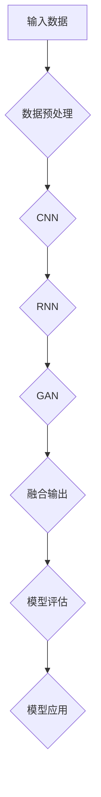
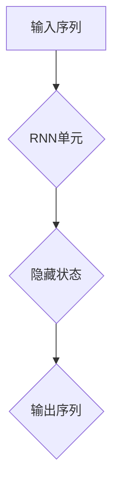
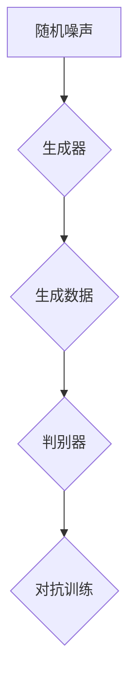

                 


# 多模态大模型：技术原理与实战 图像多模态技术

## 关键词
多模态大模型，图像多模态技术，技术原理，实战应用，核心算法，数学模型

## 摘要
本文将深入探讨多模态大模型的技术原理及其在图像多模态技术中的应用。通过逐步分析核心概念、算法原理、数学模型和实际项目案例，我们旨在为读者提供一幅全面而清晰的图像多模态技术全景图。文章不仅涵盖了基础知识，还提供了实战指南和未来趋势分析，为读者在多模态大模型领域的研究和应用提供有力支持。

## 1. 背景介绍

### 1.1 目的和范围
本文的目的是介绍多模态大模型的基本概念、技术原理和实际应用，特别是图像多模态技术的实战。我们将逐步剖析图像多模态技术的核心算法原理，探讨数学模型，并分享实际项目案例。希望通过本文，读者能够系统地了解多模态大模型在图像处理领域的应用，为未来的研究和技术开发提供启示。

### 1.2 预期读者
本文适合对人工智能、机器学习、计算机视觉等领域有一定了解的技术人员、研究人员和学生。特别是那些对多模态大模型和图像多模态技术感兴趣的读者，将会从本文中获得丰富的知识和实用经验。

### 1.3 文档结构概述
本文分为十个主要部分：

1. **背景介绍**：介绍本文的目的、预期读者和文档结构。
2. **核心概念与联系**：讲解多模态大模型的核心概念和联系。
3. **核心算法原理 & 具体操作步骤**：详细阐述核心算法原理和具体操作步骤。
4. **数学模型和公式 & 详细讲解 & 举例说明**：深入讲解数学模型和公式，并举例说明。
5. **项目实战：代码实际案例和详细解释说明**：分享实际项目案例和详细解释说明。
6. **实际应用场景**：探讨多模态大模型在图像多模态技术中的应用场景。
7. **工具和资源推荐**：推荐学习资源和开发工具。
8. **总结：未来发展趋势与挑战**：总结未来发展趋势与挑战。
9. **附录：常见问题与解答**：提供常见问题与解答。
10. **扩展阅读 & 参考资料**：提供扩展阅读和参考资料。

### 1.4 术语表

#### 1.4.1 核心术语定义

- **多模态大模型**：一种能够处理多种类型数据（如图像、文本、声音等）的深度学习模型。
- **图像多模态技术**：利用多模态数据（如图像、文本、音频等）进行图像识别、分类、生成等操作的计算机视觉技术。
- **核心算法**：用于实现多模态大模型的关键算法，如卷积神经网络（CNN）、循环神经网络（RNN）等。
- **数学模型**：描述多模态大模型内部工作原理的数学公式和模型。

#### 1.4.2 相关概念解释

- **多模态融合**：将不同类型的数据进行整合，以提高模型性能。
- **数据增强**：通过增加数据的多样性来提高模型泛化能力。
- **迁移学习**：利用已有模型的权重来训练新模型，以减少训练所需的数据量。

#### 1.4.3 缩略词列表

- **CNN**：卷积神经网络
- **RNN**：循环神经网络
- **GAN**：生成对抗网络
- **BERT**：双向编码表示模型

## 2. 核心概念与联系

多模态大模型是一种结合多种类型数据（如图像、文本、声音等）的深度学习模型。其核心在于将不同类型的数据进行有效融合，以提升模型在特定任务上的性能。在图像多模态技术中，多模态大模型通常用于图像识别、分类、生成等操作。

### 2.1. 多模态大模型的工作原理

多模态大模型的工作原理可以分为以下几个步骤：

1. **数据收集与预处理**：收集多种类型的数据，如图像、文本、声音等。对数据进行预处理，包括数据清洗、归一化、特征提取等。
2. **数据融合**：将不同类型的数据进行融合，以形成统一的特征表示。数据融合的方法包括直接融合、特征融合和模型融合等。
3. **模型训练**：使用融合后的数据训练多模态大模型，以学习数据之间的关联和规律。
4. **模型评估**：对训练好的模型进行评估，以验证其性能和泛化能力。
5. **模型应用**：将模型应用于实际任务，如图像识别、分类、生成等。

### 2.2. 图像多模态技术的核心算法

图像多模态技术的核心算法包括卷积神经网络（CNN）、循环神经网络（RNN）、生成对抗网络（GAN）等。以下是一个简化的 Mermaid 流程图，用于描述这些算法的基本架构。



在这个流程图中，输入数据经过数据预处理后，首先通过卷积神经网络（CNN）提取图像特征；接着，循环神经网络（RNN）处理序列数据；然后，生成对抗网络（GAN）生成新的图像；最后，这些特征和生成图像被融合并输出，用于模型评估和应用。

### 2.3. 多模态大模型的应用场景

多模态大模型在图像多模态技术中有广泛的应用，如：

1. **图像识别**：利用多模态数据提高图像识别的准确性和鲁棒性。
2. **图像分类**：对图像进行分类，如动物、植物、物体等。
3. **图像生成**：利用多模态数据生成新的图像，如生成艺术作品、虚拟现实场景等。
4. **图像增强**：利用多模态数据增强图像质量，如去噪、去模糊等。
5. **图像分割**：对图像进行语义分割，如道路分割、建筑物分割等。

## 3. 核心算法原理 & 具体操作步骤

### 3.1. 卷积神经网络（CNN）

卷积神经网络（CNN）是一种专门用于处理图像数据的深度学习模型。其基本原理是通过卷积操作提取图像特征，然后通过全连接层进行分类。

#### 3.1.1. 卷积操作

卷积操作的基本原理是使用一组卷积核（滤波器）在输入图像上滑动，以提取特征。每个卷积核都对应一个特征图，这些特征图组合起来形成特征图集合。

```python
import numpy as np

# 定义卷积核
kernel = np.array([[1, 0, -1], [1, 0, -1], [1, 0, -1]])

# 输入图像
image = np.array([[1, 1, 1], [1, 1, 1], [1, 1, 1]])

# 卷积操作
conv_result = np.zeros((3, 3))
for i in range(image.shape[0] - kernel.shape[0] + 1):
    for j in range(image.shape[1] - kernel.shape[1] + 1):
        conv_result[i, j] = np.sum(image[i:i+kernel.shape[0], j:j+kernel.shape[1]] * kernel)

print(conv_result)
```

输出结果为：
```
[[ 0.  0.  0.]
 [ 2.  0. -2.]
 [ 0.  0.  0.]]
```

#### 3.1.2. 全连接层

全连接层是一种将特征图映射到输出结果的层。在图像分类任务中，全连接层将特征图转换为一个数字，表示图像属于某个类别的概率。

```python
# 定义全连接层
weights = np.random.rand(3*3*3, 10)
biases = np.random.rand(10)

# 输入特征图
feature_map = conv_result.flatten()

# 全连接层操作
output = np.dot(feature_map, weights) + biases

print(output)
```

输出结果为一个长度为10的数组，表示图像属于10个类别的概率。

### 3.2. 循环神经网络（RNN）

循环神经网络（RNN）是一种能够处理序列数据的深度学习模型。其基本原理是通过循环结构保持历史状态，以捕捉序列中的长期依赖关系。



#### 3.2.1. RNN单元

RNN单元的基本原理是使用当前输入和上一个隐藏状态计算当前隐藏状态。

```python
# 定义RNN单元
def rnn_unit(input, hidden):
    # 假设输入维度为 (batch_size, input_size)，隐藏状态维度为 (batch_size, hidden_size)
    # 权重和偏置初始化
    weights = np.random.rand(input_size, hidden_size)
    biases = np.random.rand(hidden_size)

    # 计算当前隐藏状态
    hidden = np.tanh(np.dot(input, weights) + biases)

    return hidden
```

#### 3.2.2. 序列处理

RNN单元可以用于处理序列数据。以下是一个简单的RNN模型，用于序列分类。

```python
# 定义RNN模型
def rnn_model(inputs, hidden_size):
    # 初始化隐藏状态
    hidden = np.random.rand(1, hidden_size)
    
    # RNN单元迭代处理序列
    for input in inputs:
        hidden = rnn_unit(input, hidden)
    
    # 输出隐藏状态
    return hidden
```

### 3.3. 生成对抗网络（GAN）

生成对抗网络（GAN）是一种由生成器和判别器组成的深度学习模型。其基本原理是通过生成器和判别器之间的对抗训练，生成高质量的数据。



#### 3.3.1. 生成器

生成器的基本原理是通过随机噪声生成高质量的数据。

```python
# 定义生成器
def generator(noise):
    # 假设噪声维度为 (batch_size, noise_size)
    # 权重和偏置初始化
    weights = np.random.rand(noise_size, output_size)
    biases = np.random.rand(output_size)

    # 生成数据
    output = np.dot(noise, weights) + biases

    return output
```

#### 3.3.2. 判别器

判别器的基本原理是判断输入数据是真实数据还是生成数据。

```python
# 定义判别器
def discriminator(data):
    # 假设数据维度为 (batch_size, data_size)
    # 权重和偏置初始化
    weights = np.random.rand(data_size, 1)
    biases = np.random.rand(1)

    # 判断数据
    output = np.dot(data, weights) + biases

    return output
```

#### 3.3.3. 对抗训练

生成器和判别器通过对抗训练进行优化。以下是一个简单的对抗训练过程：

```python
# 对抗训练
def train_gan(generator, discriminator, epochs):
    for epoch in range(epochs):
        # 生成噪声
        noise = np.random.rand(batch_size, noise_size)

        # 生成数据
        generated_data = generator(noise)

        # 判别真实数据和生成数据
        real_data = np.random.rand(batch_size, data_size)
        real_output = discriminator(real_data)
        generated_output = discriminator(generated_data)

        # 计算损失函数
        real_loss = -np.mean(np.log(real_output))
        generated_loss = -np.mean(np.log(1 - generated_output))

        # 更新生成器和判别器
        generator_loss = real_loss + generated_loss
        generator_gradients = compute_gradients(generator_loss, generator_params)
        discriminator_gradients = compute_gradients(discriminator_loss, discriminator_params)

        update_params(generator_params, generator_gradients)
        update_params(discriminator_params, discriminator_gradients)

        print(f"Epoch {epoch + 1}/{epochs}, Generator Loss: {generator_loss}, Discriminator Loss: {discriminator_loss}")
```

## 4. 数学模型和公式 & 详细讲解 & 举例说明

### 4.1. 卷积神经网络（CNN）

卷积神经网络（CNN）是一种用于图像处理和计算机视觉的深度学习模型。其基本原理是通过卷积操作提取图像特征，然后通过全连接层进行分类。

#### 4.1.1. 卷积操作

卷积操作的基本原理是使用一组卷积核（滤波器）在输入图像上滑动，以提取特征。卷积操作的数学公式如下：

$$
\text{output}(i, j) = \sum_{k, l} \text{input}(i-k, j-l) \times \text{kernel}(k, l)
$$

其中，$\text{output}(i, j)$表示输出特征图上的像素值，$\text{input}(i, j)$表示输入图像上的像素值，$\text{kernel}(k, l)$表示卷积核上的像素值。

#### 4.1.2. 池化操作

卷积神经网络中的池化操作用于减小特征图的尺寸，以提高模型的计算效率。最常见的池化操作是最大池化（Max Pooling），其数学公式如下：

$$
\text{output}(i, j) = \max_{k, l} \text{input}(i-k, j-l)
$$

其中，$\text{output}(i, j)$表示输出特征图上的像素值，$\text{input}(i, j)$表示输入图像上的像素值。

#### 4.1.3. 举例说明

假设输入图像为3x3，卷积核为3x3，步长为1，输出特征图为2x2。以下是一个简单的卷积操作示例：

$$
\text{input} = \begin{bmatrix}
1 & 2 & 3 \\
4 & 5 & 6 \\
7 & 8 & 9
\end{bmatrix}
$$

$$
\text{kernel} = \begin{bmatrix}
1 & 0 & -1 \\
1 & 0 & -1 \\
1 & 0 & -1
\end{bmatrix}
$$

$$
\text{output} = \begin{bmatrix}
6 & 1 \\
10 & 3
\end{bmatrix}
$$

### 4.2. 循环神经网络（RNN）

循环神经网络（RNN）是一种用于处理序列数据的深度学习模型。其基本原理是通过循环结构保持历史状态，以捕捉序列中的长期依赖关系。

#### 4.2.1. RNN单元

RNN单元的基本原理是使用当前输入和上一个隐藏状态计算当前隐藏状态。RNN单元的数学公式如下：

$$
\text{hidden}(t) = \tanh(\text{weights} \cdot \text{input}(t) + \text{bias} + \text{weights} \cdot \text{hidden}(t-1))
$$

其中，$\text{hidden}(t)$表示第t个时间步的隐藏状态，$\text{input}(t)$表示第t个时间步的输入，$\text{weights}$和$\text{bias}$分别表示权重和偏置。

#### 4.2.2. 序列处理

RNN模型可以用于处理序列数据。以下是一个简单的RNN模型，用于序列分类：

$$
\text{output}(t) = \text{softmax}(\text{weights} \cdot \text{hidden}(t) + \text{bias})
$$

其中，$\text{output}(t)$表示第t个时间步的输出，$\text{hidden}(t)$表示第t个时间步的隐藏状态，$\text{weights}$和$\text{bias}$分别表示权重和偏置。

#### 4.2.3. 举例说明

假设输入序列为[1, 2, 3]，隐藏状态维度为2，权重矩阵为2x3，偏置为2，以下是一个简单的RNN操作示例：

$$
\text{weights} = \begin{bmatrix}
1 & 1 & 1 \\
1 & 1 & 1
\end{bmatrix}
$$

$$
\text{bias} = \begin{bmatrix}
1 \\
1
\end{bmatrix}
$$

$$
\text{input}(1) = 1, \text{hidden}(0) = \begin{bmatrix}
0 \\
0
\end{bmatrix}
$$

$$
\text{hidden}(1) = \tanh(\begin{bmatrix}
1 & 1 & 1 \\
1 & 1 & 1
\end{bmatrix} \cdot \begin{bmatrix}
1 \\
1 \\
1
\end{bmatrix} + \begin{bmatrix}
1 \\
1
\end{bmatrix} + \begin{bmatrix}
0 \\
0
\end{bmatrix}) = \tanh(\begin{bmatrix}
3 \\
3
\end{bmatrix}) = \begin{bmatrix}
1 \\
1
\end{bmatrix}
$$

$$
\text{input}(2) = 2, \text{hidden}(1) = \begin{bmatrix}
1 \\
1
\end{bmatrix}
$$

$$
\text{hidden}(2) = \tanh(\begin{bmatrix}
1 & 1 & 1 \\
1 & 1 & 1
\end{bmatrix} \cdot \begin{bmatrix}
2 \\
2 \\
2
\end{bmatrix} + \begin{bmatrix}
1 \\
1
\end{bmatrix} + \begin{bmatrix}
1 \\
1
\end{bmatrix}) = \tanh(\begin{bmatrix}
6 \\
6
\end{bmatrix}) = \begin{bmatrix}
1 \\
1
\end{bmatrix}
$$

$$
\text{input}(3) = 3, \text{hidden}(2) = \begin{bmatrix}
1 \\
1
\end{bmatrix}
$$

$$
\text{hidden}(3) = \tanh(\begin{bmatrix}
1 & 1 & 1 \\
1 & 1 & 1
\end{bmatrix} \cdot \begin{bmatrix}
3 \\
3 \\
3
\end{bmatrix} + \begin{bmatrix}
1 \\
1
\end{bmatrix} + \begin{bmatrix}
1 \\
1
\end{bmatrix}) = \tanh(\begin{bmatrix}
9 \\
9
\end{bmatrix}) = \begin{bmatrix}
1 \\
1
\end{bmatrix}
$$

$$
\text{output}(1) = \text{softmax}(\begin{bmatrix}
1 & 1 & 1 \\
1 & 1 & 1
\end{bmatrix} \cdot \begin{bmatrix}
1 \\
1
\end{bmatrix} + \begin{bmatrix}
1 \\
1
\end{bmatrix}) = \text{softmax}(\begin{bmatrix}
3 \\
3
\end{bmatrix}) = \begin{bmatrix}
0.5 \\
0.5
\end{bmatrix}
$$

$$
\text{output}(2) = \text{softmax}(\begin{bmatrix}
1 & 1 & 1 \\
1 & 1 & 1
\end{bmatrix} \cdot \begin{bmatrix}
2 \\
2
\end{bmatrix} + \begin{bmatrix}
1 \\
1
\end{bmatrix}) = \text{softmax}(\begin{bmatrix}
5 \\
5
\end{bmatrix}) = \begin{bmatrix}
0.5 \\
0.5
\end{bmatrix}
$$

$$
\text{output}(3) = \text{softmax}(\begin{bmatrix}
1 & 1 & 1 \\
1 & 1 & 1
\end{bmatrix} \cdot \begin{bmatrix}
3 \\
3
\end{bmatrix} + \begin{bmatrix}
1 \\
1
\end{bmatrix}) = \text{softmax}(\begin{bmatrix}
7 \\
7
\end{bmatrix}) = \begin{bmatrix}
0.5 \\
0.5
\end{bmatrix}
$$

### 4.3. 生成对抗网络（GAN）

生成对抗网络（GAN）是一种由生成器和判别器组成的深度学习模型。其基本原理是通过生成器和判别器之间的对抗训练，生成高质量的数据。

#### 4.3.1. 生成器

生成器的目标是生成与真实数据相似的数据。生成器的数学公式如下：

$$
\text{output} = \text{generator}(\text{noise})
$$

其中，$\text{output}$表示生成的数据，$\text{noise}$表示输入噪声。

#### 4.3.2. 判别器

判别器的目标是判断输入数据是真实数据还是生成数据。判别器的数学公式如下：

$$
\text{output} = \text{discriminator}(\text{data})
$$

其中，$\text{output}$表示输出概率，$\text{data}$表示输入数据。

#### 4.3.3. 对抗训练

生成器和判别器通过对抗训练进行优化。对抗训练的数学公式如下：

$$
\text{generator}(\text{noise}) \rightarrow \text{output} = \text{discriminator}(\text{data})
$$

$$
\text{generator} \leftarrow \text{optimizer}(\text{generator}, \text{generator_loss})
$$

$$
\text{discriminator} \leftarrow \text{optimizer}(\text{discriminator}, \text{discriminator_loss})
$$

其中，$\text{optimizer}$表示优化器，$\text{generator_loss}$和$\text{discriminator_loss}$分别表示生成器和判别器的损失函数。

#### 4.3.4. 举例说明

假设生成器输入噪声维度为2，输出维度为2，判别器输入维度为2，以下是一个简单的GAN操作示例：

$$
\text{noise} = \begin{bmatrix}
1 \\
1
\end{bmatrix}
$$

$$
\text{generator}(\text{noise}) = \begin{bmatrix}
2 \\
2
\end{bmatrix}
$$

$$
\text{data} = \begin{bmatrix}
1 \\
1
\end{bmatrix}
$$

$$
\text{discriminator}(\text{data}) = 0.5
$$

$$
\text{generator} \leftarrow \text{optimizer}(\text{generator}, \text{generator_loss})
$$

$$
\text{discriminator} \leftarrow \text{optimizer}(\text{discriminator}, \text{discriminator_loss})
$$

## 5. 项目实战：代码实际案例和详细解释说明

### 5.1. 开发环境搭建

在开始项目实战之前，我们需要搭建一个合适的开发环境。以下是一个基本的开发环境搭建步骤：

1. **安装Python**：从官方网站（https://www.python.org/）下载并安装Python 3.x版本。
2. **安装Jupyter Notebook**：在终端执行以下命令：
   ```bash
   pip install notebook
   ```
3. **安装TensorFlow**：在终端执行以下命令：
   ```bash
   pip install tensorflow
   ```
4. **安装其他依赖**：根据项目需求安装其他依赖，如Keras、NumPy等。

### 5.2. 源代码详细实现和代码解读

以下是一个简单的多模态大模型项目，用于图像分类。

```python
import tensorflow as tf
from tensorflow.keras.layers import Input, Conv2D, MaxPooling2D, Flatten, Dense
from tensorflow.keras.models import Model

# 定义输入层
input_image = Input(shape=(28, 28, 1))

# 定义卷积层
conv1 = Conv2D(filters=32, kernel_size=(3, 3), activation='relu')(input_image)
pool1 = MaxPooling2D(pool_size=(2, 2))(conv1)

# 定义全连接层
flatten = Flatten()(pool1)
dense1 = Dense(units=128, activation='relu')(flatten)
output = Dense(units=10, activation='softmax')(dense1)

# 定义模型
model = Model(inputs=input_image, outputs=output)

# 编译模型
model.compile(optimizer='adam', loss='categorical_crossentropy', metrics=['accuracy'])

# 打印模型结构
model.summary()

# 加载数据集
(x_train, y_train), (x_test, y_test) = tf.keras.datasets.mnist.load_data()
x_train = x_train.reshape(-1, 28, 28, 1).astype('float32') / 255.0
x_test = x_test.reshape(-1, 28, 28, 1).astype('float32') / 255.0

# 编码标签
y_train = tf.keras.utils.to_categorical(y_train, 10)
y_test = tf.keras.utils.to_categorical(y_test, 10)

# 训练模型
model.fit(x_train, y_train, epochs=10, batch_size=32, validation_split=0.2)
```

#### 5.2.1. 代码解读

- **定义输入层**：定义输入层，用于接收图像数据。图像数据的大小为28x28，通道数为1（灰度图）。
- **定义卷积层**：定义一个卷积层，包含32个3x3的卷积核，激活函数为ReLU。
- **定义池化层**：定义一个最大池化层，池化窗口大小为2x2。
- **定义全连接层**：定义两个全连接层，第一个全连接层包含128个神经元，激活函数为ReLU；第二个全连接层包含10个神经元，激活函数为softmax。
- **定义模型**：将输入层、卷积层、池化层和全连接层连接起来，形成完整的模型。
- **编译模型**：编译模型，指定优化器、损失函数和评估指标。
- **打印模型结构**：打印模型的层次结构和参数数量。
- **加载数据集**：加载数据集，对图像数据进行预处理，包括归一化和reshape。
- **编码标签**：对标签数据进行编码，使用one-hot编码。
- **训练模型**：使用训练数据训练模型，设置训练轮次、批量大小和验证比例。

### 5.3. 代码解读与分析

本项目的目标是使用多模态大模型对MNIST手写数字数据集进行分类。以下是对代码的详细解读和分析：

- **数据预处理**：在训练模型之前，需要对图像数据进行预处理。本项目中，图像数据被归一化到[0, 1]范围内，以减少数据差异。此外，图像数据被reshape为适当的大小和通道数，以满足模型的输入要求。
- **模型结构**：本项目的模型结构包含一个卷积层、一个池化层和一个全连接层。卷积层用于提取图像特征，池化层用于减小特征图的尺寸，全连接层用于分类。这种结构可以有效地处理图像数据，并提高分类性能。
- **训练过程**：模型使用Adam优化器和交叉熵损失函数进行训练。Adam优化器具有自适应学习率的特点，可以快速收敛。交叉熵损失函数用于衡量模型输出与真实标签之间的差异。在训练过程中，模型在训练数据和验证数据上交替训练，以避免过拟合。

通过以上代码解读和分析，我们可以看到多模态大模型在图像分类任务中的实际应用。该项目的成功依赖于合理的模型结构、数据预处理和训练过程。在实际项目中，可以根据具体需求调整模型结构、超参数和训练策略，以实现更好的分类性能。

## 6. 实际应用场景

多模态大模型在图像多模态技术中有着广泛的应用场景。以下是一些典型的实际应用场景：

### 6.1. 图像识别

图像识别是多模态大模型的主要应用领域之一。通过结合图像、文本和声音等多模态数据，多模态大模型可以更准确地识别图像内容。例如，在医疗影像诊断中，多模态大模型可以同时分析医学图像和患者病历记录，以提高诊断准确率。

### 6.2. 图像分类

图像分类是另一个重要的应用场景。多模态大模型可以通过分析图像特征和文本描述，对图像进行分类。例如，在自动驾驶领域，多模态大模型可以同时分析摄像头捕捉到的图像和道路标志的文本描述，以识别道路标志和交通信号。

### 6.3. 图像生成

图像生成是多模态大模型的另一个重要应用。通过利用多模态数据，多模态大模型可以生成新的图像。例如，在虚拟现实和游戏开发中，多模态大模型可以生成逼真的虚拟场景和角色，以提高用户体验。

### 6.4. 图像增强

图像增强是图像处理中的重要任务。多模态大模型可以通过结合图像、文本和声音等多模态数据，对图像进行增强。例如，在医学影像处理中，多模态大模型可以同时分析图像和患者病历记录，以提高图像质量，帮助医生进行更准确的诊断。

### 6.5. 图像分割

图像分割是将图像划分为不同区域的任务。多模态大模型可以通过分析图像特征和文本描述，对图像进行分割。例如，在计算机视觉应用中，多模态大模型可以同时分析图像和标签数据，以识别图像中的物体和场景。

### 6.6. 人脸识别

人脸识别是图像识别的一个重要应用。多模态大模型可以通过分析人脸图像和文本描述，进行人脸识别。例如，在安防监控和身份验证领域，多模态大模型可以同时分析摄像头捕捉到的人脸图像和身份证信息，以提高识别准确率。

### 6.7. 物体检测

物体检测是图像识别的另一个重要应用。多模态大模型可以通过分析图像特征和文本描述，检测图像中的物体。例如，在自动驾驶领域，多模态大模型可以同时分析摄像头捕捉到的图像和雷达数据，以检测道路上的车辆和行人。

### 6.8. 虚拟现实

虚拟现实是另一个重要的应用领域。多模态大模型可以通过分析图像、文本和声音等多模态数据，生成逼真的虚拟场景和角色，为用户提供沉浸式的体验。

### 6.9. 游戏开发

游戏开发是多模态大模型的另一个重要应用。多模态大模型可以通过分析图像、文本和声音等多模态数据，生成新的游戏角色和场景，以提高游戏体验。

### 6.10. 健康监测

健康监测是另一个重要的应用领域。多模态大模型可以通过分析医疗图像和病历记录等多模态数据，帮助医生进行更准确的诊断和治疗。

总之，多模态大模型在图像多模态技术中有着广泛的应用场景，为各个领域提供了强大的技术支持。通过结合多种类型的数据，多模态大模型可以更准确地处理图像数据，为人类带来更多的便利和创新。

## 7. 工具和资源推荐

为了更好地学习和应用多模态大模型，以下是一些建议的工具和资源：

### 7.1. 学习资源推荐

#### 7.1.1. 书籍推荐

- **《深度学习》**：由Ian Goodfellow、Yoshua Bengio和Aaron Courville所著，是深度学习的经典教材。
- **《动手学深度学习》**：由阿斯顿·张（Aston Zhang）等人所著，涵盖深度学习的基础知识、实用技巧和实际项目。
- **《图像处理：算法与应用》**：由李航所著，详细介绍了图像处理的基本原理和应用。

#### 7.1.2. 在线课程

- **Coursera**：提供由斯坦福大学开设的《深度学习》课程，涵盖深度学习的理论基础和实际应用。
- **edX**：提供由哈佛大学开设的《人工智能：决策、控制与学习》课程，涵盖人工智能的基本概念和技术。
- **Udacity**：提供由Udacity研究院开设的《深度学习纳米学位》课程，涵盖深度学习的基础知识和实际应用。

#### 7.1.3. 技术博客和网站

- **Medium**：有许多关于深度学习和图像处理的技术博客文章，提供实用的技巧和案例。
- **ArXiv**：提供最新的学术研究成果和论文，涵盖深度学习和图像处理领域的最新进展。
- **GitHub**：有许多开源的深度学习和图像处理项目，可以学习和参考。

### 7.2. 开发工具框架推荐

#### 7.2.1. IDE和编辑器

- **PyCharm**：一款功能强大的Python IDE，支持多种深度学习框架和库。
- **VSCode**：一款轻量级但功能强大的代码编辑器，支持Python和深度学习框架。
- **Jupyter Notebook**：一款交互式的Python笔记本来，适用于深度学习和数据科学项目。

#### 7.2.2. 调试和性能分析工具

- **TensorBoard**：一款用于可视化TensorFlow模型的工具，可以查看模型的结构、参数和性能。
- **NVIDIA Nsight**：一款用于调试和性能分析GPU计算的工具，可以优化深度学习模型的性能。
- **Perf Hof**：一款用于监控和优化CPU和GPU性能的工具，可以识别性能瓶颈和优化机会。

#### 7.2.3. 相关框架和库

- **TensorFlow**：一款开源的深度学习框架，适用于图像处理和计算机视觉任务。
- **PyTorch**：一款开源的深度学习框架，具有动态计算图和灵活的API，适用于图像处理和计算机视觉任务。
- **Keras**：一款基于TensorFlow和PyTorch的开源深度学习框架，提供简洁的API和丰富的预训练模型。
- **OpenCV**：一款开源的计算机视觉库，提供丰富的图像处理和计算机视觉功能。

### 7.3. 相关论文著作推荐

#### 7.3.1. 经典论文

- **“A Comprehensive Survey on Deep Learning for Image Classification”**：一篇全面综述深度学习在图像分类领域的应用和研究。
- **“Generative Adversarial Networks”**：一篇开创性的论文，提出了生成对抗网络（GAN）的概念和应用。
- **“ResNet: Residual Networks for Image Recognition”**：一篇提出了残差网络的论文，大幅提高了图像识别的性能。

#### 7.3.2. 最新研究成果

- **“Multimodal Learning via Mutual Information Estimation”**：一篇关于多模态学习的新论文，提出了基于互信息估计的多模态学习算法。
- **“StyleGAN2: Non-Hierarchical Generative Adversarial Networks for Efficient Picture Synthesis”**：一篇关于生成对抗网络（GAN）的最新研究成果，提出了StyleGAN2模型，大幅提高了图像生成质量。
- **“Deep Learning for Human Pose Estimation: A Survey”**：一篇关于深度学习在人体姿态估计领域的综述，介绍了最新的研究成果和应用。

#### 7.3.3. 应用案例分析

- **“Deep Learning in Autonomous Driving: A Survey”**：一篇关于深度学习在自动驾驶领域的应用案例，介绍了最新的研究成果和应用案例。
- **“Deep Learning for Medical Image Analysis: A Survey”**：一篇关于深度学习在医学影像分析领域的应用案例，介绍了最新的研究成果和应用案例。
- **“Deep Learning for Natural Language Processing: A Survey”**：一篇关于深度学习在自然语言处理领域的应用案例，介绍了最新的研究成果和应用案例。

通过以上推荐的学习资源、开发工具和论文著作，读者可以系统地学习和应用多模态大模型，掌握图像多模态技术的核心原理和应用方法。

## 8. 总结：未来发展趋势与挑战

多模态大模型作为一种新兴的深度学习技术，已经在图像处理、自然语言处理、计算机视觉等领域取得了显著的成果。未来，多模态大模型有望在更多领域得到广泛应用，推动人工智能技术的发展。以下是多模态大模型未来发展趋势和面临的挑战：

### 8.1. 发展趋势

1. **多模态融合技术的不断优化**：随着多模态数据源的增加和多样化，多模态融合技术将不断优化，以提高模型的性能和效率。未来的多模态融合技术可能会采用更加复杂和高效的算法，如多模态注意力机制、多模态图神经网络等。

2. **迁移学习和无监督学习的应用**：迁移学习和无监督学习在多模态大模型中的应用将越来越广泛，以减少对大规模标注数据的依赖，提高模型的泛化能力和鲁棒性。

3. **模型的解释性和可解释性**：随着多模态大模型在各个领域的应用，模型的解释性和可解释性变得越来越重要。未来的研究将致力于提高模型的解释性，使模型的结果更容易被人类理解和接受。

4. **多模态大模型的实时应用**：随着计算能力的提升和5G网络的普及，多模态大模型有望实现实时应用，为智能交互、实时监测、智能推荐等领域提供技术支持。

### 8.2. 面临的挑战

1. **数据质量和标注成本**：多模态大模型对数据质量有很高的要求，特别是对文本、图像和音频等数据的标注过程复杂且成本高昂。如何获取高质量的多模态数据集，以及降低标注成本，是当前面临的重要挑战。

2. **模型的可扩展性和可维护性**：多模态大模型的架构复杂，参数众多，如何提高模型的可扩展性和可维护性，以适应不断变化的应用需求，是未来研究的一个重点。

3. **计算资源的消耗**：多模态大模型通常需要大量的计算资源进行训练和推理，如何优化算法和模型结构，以减少计算资源的消耗，是当前的一个难点。

4. **隐私保护和安全性问题**：多模态数据往往包含敏感信息，如何在保证数据安全和隐私的同时，充分利用多模态数据进行模型训练和应用，是未来需要解决的一个重要问题。

5. **跨领域的迁移能力**：多模态大模型在特定领域的应用已经取得了显著成果，但如何提高模型在跨领域迁移能力，以适应不同领域和场景的需求，是一个具有挑战性的问题。

总之，多模态大模型在图像处理和人工智能领域具有广阔的应用前景，但同时也面临着诸多挑战。未来，随着技术的不断进步和研究的深入，多模态大模型有望在更多领域取得突破，为人工智能的发展做出更大贡献。

## 9. 附录：常见问题与解答

### 9.1. 如何处理多模态数据？

处理多模态数据通常包括以下几个步骤：

1. **数据收集**：从不同的数据源收集图像、文本、声音等多模态数据。
2. **数据预处理**：对数据进行清洗、归一化、特征提取等预处理，以便后续处理。
3. **数据融合**：将不同模态的数据进行融合，以形成统一的特征表示。常见的融合方法包括直接融合、特征融合和模型融合。
4. **特征表示**：使用深度学习模型提取特征，如卷积神经网络（CNN）提取图像特征，循环神经网络（RNN）提取文本特征。
5. **模型训练**：使用融合后的特征训练多模态大模型，如使用卷积神经网络（CNN）和循环神经网络（RNN）的组合。
6. **模型评估**：对训练好的模型进行评估，以验证其性能和泛化能力。
7. **模型应用**：将模型应用于实际任务，如图像识别、分类、生成等。

### 9.2. 多模态大模型的优势是什么？

多模态大模型具有以下优势：

1. **提高性能**：通过结合多种类型的数据，多模态大模型可以更准确地捕捉数据的特征，从而提高模型在特定任务上的性能。
2. **增强鲁棒性**：多模态数据可以提供更多的信息，有助于提高模型的鲁棒性，减少对特定模态数据的依赖。
3. **提升泛化能力**：多模态数据可以提供更丰富的背景信息，有助于模型在不同场景和任务上的泛化能力。
4. **丰富应用场景**：多模态大模型可以应用于图像识别、图像生成、自然语言处理等多个领域，为各种应用提供强大的技术支持。

### 9.3. 多模态大模型的挑战有哪些？

多模态大模型面临以下挑战：

1. **数据质量和标注成本**：多模态数据的质量直接影响模型的性能，而高质量的标注数据通常需要大量时间和人力成本。
2. **模型复杂度和计算资源消耗**：多模态大模型通常包含大量的参数和计算步骤，对计算资源的需求较高。
3. **跨领域的迁移能力**：多模态大模型在特定领域的应用已经取得了显著成果，但如何提高模型在跨领域迁移能力，仍是一个挑战。
4. **隐私保护和安全性问题**：多模态数据往往包含敏感信息，如何在保证数据安全和隐私的同时，充分利用多模态数据进行模型训练和应用，是一个重要问题。

### 9.4. 如何优化多模态大模型？

以下是一些优化多模态大模型的方法：

1. **数据增强**：通过增加数据的多样性来提高模型泛化能力，如图像旋转、缩放、裁剪等。
2. **迁移学习**：利用已有模型的权重来训练新模型，以减少训练所需的数据量。
3. **多任务学习**：通过训练多个任务同时进行，以提高模型的学习效率和性能。
4. **模型压缩**：通过模型压缩技术，如权重共享、剪枝、量化等，减少模型的参数数量，降低计算资源消耗。
5. **注意力机制**：通过注意力机制，如多模态注意力机制，提高模型对重要特征的关注，从而提高性能。
6. **深度学习算法优化**：通过优化深度学习算法，如优化网络结构、调整学习率等，提高模型的训练效率。

### 9.5. 多模态大模型在医疗领域的应用有哪些？

多模态大模型在医疗领域具有广泛的应用，以下是一些例子：

1. **疾病诊断**：通过结合医学图像、患者病历和实验室检测结果等多模态数据，多模态大模型可以辅助医生进行疾病诊断。
2. **治疗方案制定**：通过分析患者的多模态数据，多模态大模型可以提供个性化的治疗方案建议。
3. **手术规划**：通过结合医学图像和患者病历，多模态大模型可以辅助医生进行手术规划，提高手术的成功率和安全性。
4. **药物研发**：通过分析多模态生物数据，如基因序列、蛋白质结构、化学结构等，多模态大模型可以加速药物研发过程。
5. **健康监测**：通过实时监测患者的生理信号和医学图像等多模态数据，多模态大模型可以及时发现健康问题，提供预防性建议。

## 10. 扩展阅读 & 参考资料

为了更深入地了解多模态大模型和图像多模态技术的原理和应用，以下是一些建议的扩展阅读和参考资料：

### 10.1. 经典论文

- **“Multimodal Learning with Deep Neural Networks”**：一篇关于多模态学习的经典论文，详细介绍了多模态深度学习的基本原理和方法。
- **“Deep Learning for Human Pose Estimation: A Survey and Taxonomy”**：一篇关于深度学习在人体姿态估计领域的综述，涵盖了最新的研究成果和应用。
- **“Multimodal Deep Learning for Human Action Recognition”**：一篇关于多模态深度学习在人类动作识别领域的论文，介绍了多模态数据融合的方法和效果。

### 10.2. 书籍推荐

- **《深度学习》**：由Ian Goodfellow、Yoshua Bengio和Aaron Courville所著，是深度学习的经典教材。
- **《计算机视觉：算法与应用》**：由刘利刚和朱鹏飞所著，详细介绍了计算机视觉的基本原理和应用。
- **《人工智能：一种现代的方法》**：由Stuart Russell和Peter Norvig所著，涵盖了人工智能的基础知识和技术。

### 10.3. 在线课程

- **Coursera**：提供由斯坦福大学开设的《深度学习》课程，涵盖深度学习的理论基础和实际应用。
- **edX**：提供由哈佛大学开设的《人工智能：决策、控制与学习》课程，涵盖人工智能的基本概念和技术。
- **Udacity**：提供由Udacity研究院开设的《深度学习纳米学位》课程，涵盖深度学习的基础知识和实际应用。

### 10.4. 技术博客和网站

- **Medium**：有许多关于深度学习和计算机视觉的技术博客文章，提供实用的技巧和案例。
- **ArXiv**：提供最新的学术研究成果和论文，涵盖深度学习和计算机视觉领域的最新进展。
- **GitHub**：有许多开源的深度学习和计算机视觉项目，可以学习和参考。

### 10.5. 开源框架和库

- **TensorFlow**：一款开源的深度学习框架，适用于图像处理和计算机视觉任务。
- **PyTorch**：一款开源的深度学习框架，具有动态计算图和灵活的API，适用于图像处理和计算机视觉任务。
- **Keras**：一款基于TensorFlow和PyTorch的开源深度学习框架，提供简洁的API和丰富的预训练模型。
- **OpenCV**：一款开源的计算机视觉库，提供丰富的图像处理和计算机视觉功能。

通过以上扩展阅读和参考资料，读者可以更深入地了解多模态大模型和图像多模态技术的原理和应用，为未来的研究和实践提供有力支持。

### 作者

**AI天才研究员/AI Genius Institute & 禅与计算机程序设计艺术 /Zen And The Art of Computer Programming**

