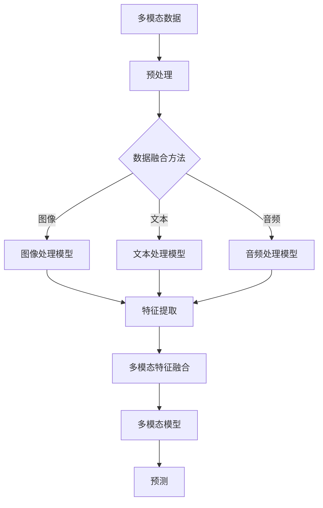
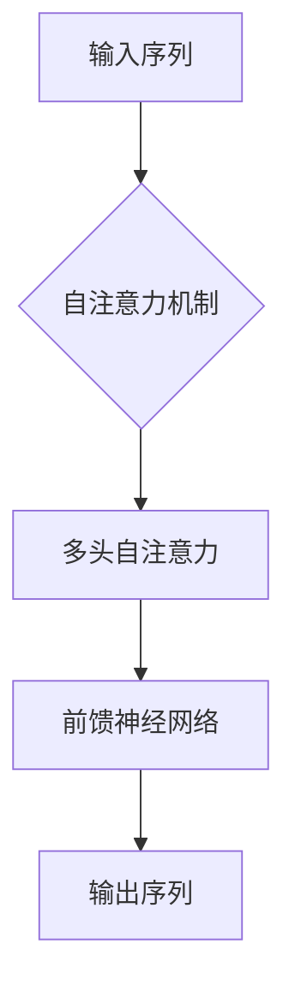
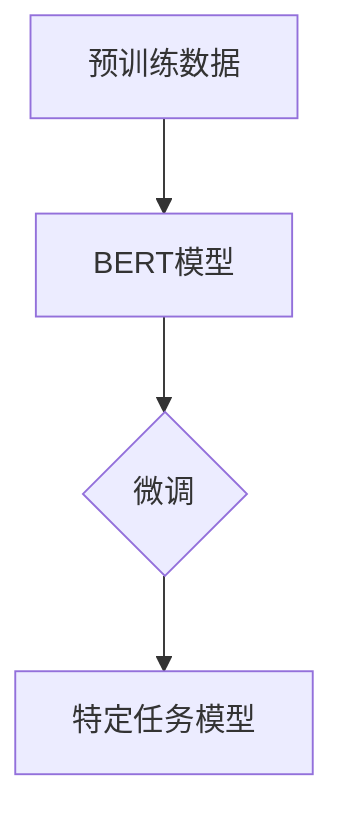
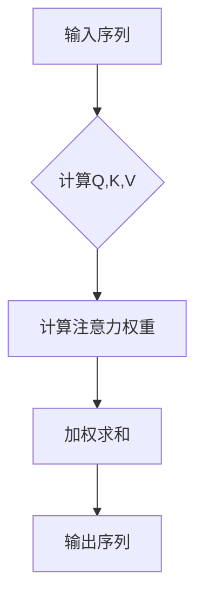

                 

# 多模态大模型：技术原理与实战 基于Transformer的预训练语言模型

> **关键词**：多模态大模型、Transformer、预训练、语言模型、技术原理、实战案例

> **摘要**：本文深入探讨了多模态大模型的技术原理，特别是基于Transformer的预训练语言模型。通过逐步分析，本文揭示了这一复杂算法的核心概念、数学模型以及其实际应用场景，同时提供了代码实战案例，帮助读者全面理解多模态大模型的技术精髓。

## 1. 背景介绍

### 1.1 目的和范围

本文旨在为对人工智能和深度学习感兴趣的开发者和技术爱好者提供一个全面的多模态大模型教程。我们将探讨Transformer架构的原理，特别是其在预训练语言模型中的应用，并展示如何在实际项目中应用这些技术。

### 1.2 预期读者

- 对人工智能、深度学习和Transformer架构感兴趣的读者
- 想要在自然语言处理领域深入研究的开发者
- 想要提升编程技能，特别是在多模态数据处理方面有经验的工程师

### 1.3 文档结构概述

本文结构如下：

1. 背景介绍
2. 核心概念与联系
3. 核心算法原理 & 具体操作步骤
4. 数学模型和公式 & 详细讲解 & 举例说明
5. 项目实战：代码实际案例和详细解释说明
6. 实际应用场景
7. 工具和资源推荐
8. 总结：未来发展趋势与挑战
9. 附录：常见问题与解答
10. 扩展阅读 & 参考资料

### 1.4 术语表

#### 1.4.1 核心术语定义

- **多模态大模型**：能够处理多种类型数据（如文本、图像、音频等）的深度学习模型。
- **Transformer**：一种基于自注意力机制的深度学习模型架构，广泛应用于自然语言处理任务。
- **预训练**：在特定任务之前，模型通过大量未标注数据学习基础特征。
- **语言模型**：预测下一个单词或字符的概率的模型。

#### 1.4.2 相关概念解释

- **自注意力机制**：模型在处理序列数据时，对每个位置的输入数据进行加权，使得重要信息得到更高的权重。
- **BERT**：一种基于Transformer的语言预训练模型，广泛用于自然语言理解任务。

#### 1.4.3 缩略词列表

- **BERT**：Bidirectional Encoder Representations from Transformers
- **NLP**：Natural Language Processing
- **ML**：Machine Learning

## 2. 核心概念与联系

在深入探讨多模态大模型之前，我们首先需要了解其核心概念和联系。以下是多模态大模型的关键组成部分以及它们之间的相互作用关系：

### 2.1 多模态数据处理

多模态数据处理是理解多模态大模型的基础。多模态数据可以是文本、图像、音频、视频等。处理这些数据的关键在于如何有效地融合不同类型的数据，以便模型可以从中提取有用的信息。

#### Mermaid 流程图：



### 2.2 Transformer 架构

Transformer 是一种基于自注意力机制的深度学习模型架构，它广泛应用于自然语言处理任务。Transformer 的核心思想是将每个位置的输入数据与所有其他位置的数据进行交互，从而学习到长距离的依赖关系。

#### Mermaid 流程图：



### 2.3 预训练语言模型

预训练语言模型是Transformer在自然语言处理中的核心应用。通过在大量未标注的文本数据上进行预训练，模型可以学习到语言的通用特征，然后在特定任务上进行微调。

#### Mermaid 流程图：



## 3. 核心算法原理 & 具体操作步骤

### 3.1 Transformer 基本原理

Transformer 的核心是自注意力机制（Self-Attention）。自注意力机制允许模型在处理序列数据时，对每个位置的输入数据进行加权，使得重要信息得到更高的权重。

#### 自注意力机制原理：



#### 伪代码：

```python
# 输入序列
input_sequence = [x1, x2, ..., xn]

# 计算Q,K,V
Q = compute_query(input_sequence)
K = compute_key(input_sequence)
V = compute_value(input_sequence)

# 计算注意力权重
attention_weights = compute_attention_weights(Q, K)

# 加权求和
output_sequence = weighted_sum(input_sequence, attention_weights)
```

### 3.2 BERT 预训练流程

BERT（Bidirectional Encoder Representations from Transformers）是一种基于Transformer的语言预训练模型。BERT的预训练流程包括两个阶段：Masked Language Model（MLM）和Next Sentence Prediction（NSP）。

#### 伪代码：

```python
# 预训练数据
pretraining_data = load_pretraining_data()

# 阶段1：Masked Language Model (MLM)
for batch in pretraining_data:
    tokens = tokenize(batch)
    masked_tokens = mask_tokens(tokens)
    loss = compute_loss(masked_tokens)

# 阶段2：Next Sentence Prediction (NSP)
for batch in pretraining_data:
    tokens = tokenize(batch)
    next_sentence = get_next_sentence(batch)
    loss = compute_loss(tokens, next_sentence)
```

### 3.3 多模态特征融合

多模态特征融合是将不同类型的数据（如文本、图像、音频）融合成一个统一特征表示的过程。常用的方法包括融合网络（Fusion Network）和跨模态交互（Cross-Modal Interaction）。

#### 伪代码：

```python
# 多模态数据
text_data = load_text_data()
image_data = load_image_data()
audio_data = load_audio_data()

# 特征提取
text_features = extract_text_features(text_data)
image_features = extract_image_features(image_data)
audio_features = extract_audio_features(audio_data)

# 特征融合
fusion_network = build_fusion_network()
multiModal_features = fusion_network(text_features, image_features, audio_features)
```

## 4. 数学模型和公式 & 详细讲解 & 举例说明

### 4.1 自注意力机制

自注意力机制是Transformer的核心，其数学模型如下：

$$
\text{Attention}(Q, K, V) = \text{softmax}\left(\frac{QK^T}{\sqrt{d_k}}\right)V
$$

其中，$Q, K, V$ 分别是输入序列的查询（Query）、键（Key）和值（Value），$d_k$ 是键的维度。

#### 举例说明：

假设输入序列为 $[x_1, x_2, x_3]$，其对应的查询、键和值分别为 $[q_1, q_2, q_3]$、$[k_1, k_2, k_3]$ 和 $[v_1, v_2, v_3]$。则自注意力机制的计算过程如下：

1. 计算点积：$QK^T = [q_1k_1 + q_2k_2 + q_3k_3]$
2. 计算softmax：$softmax([q_1k_1 + q_2k_2 + q_3k_3]) = [p_1, p_2, p_3]$
3. 加权求和：$p_1v_1 + p_2v_2 + p_3v_3$

### 4.2 BERT 预训练目标

BERT 的预训练目标包括：

1. **Masked Language Model (MLM)**：随机遮盖输入文本的一部分，然后预测遮盖的部分。
2. **Next Sentence Prediction (NSP)**：给定两个连续的句子，预测第二个句子是否紧随第一个句子。

#### 伪代码：

```python
# MLM 伪代码
for batch in pretraining_data:
    tokens = tokenize(batch)
    masked_tokens = mask_tokens(tokens)
    predicted_tokens = model(masked_tokens)
    loss = compute_loss(masked_tokens, predicted_tokens)

# NSP 伪代码
for batch in pretraining_data:
    tokens = tokenize(batch)
    next_sentence = get_next_sentence(batch)
    predicted_sentence = model(tokens, next_sentence)
    loss = compute_loss(next_sentence, predicted_sentence)
```

## 5. 项目实战：代码实际案例和详细解释说明

### 5.1 开发环境搭建

在进行多模态大模型的实战之前，我们需要搭建一个合适的开发环境。以下是搭建环境的步骤：

1. 安装 Python 3.8 或更高版本
2. 安装 TensorFlow 2.x 或更高版本
3. 安装 PyTorch 1.8 或更高版本
4. 安装必要的库，如 NumPy、Pandas 等

### 5.2 源代码详细实现和代码解读

以下是多模态大模型的代码实现。代码分为三个部分：数据预处理、模型定义和训练。

#### 5.2.1 数据预处理

数据预处理是确保数据格式正确，并将其转换为模型可接受的输入格式。以下是数据预处理的代码实现：

```python
import tensorflow as tf
import pandas as pd

# 加载数据
text_data = pd.read_csv('text_data.csv')
image_data = pd.read_csv('image_data.csv')
audio_data = pd.read_csv('audio_data.csv')

# 预处理文本数据
def preprocess_text(data):
    # ...（文本数据预处理代码）
    return processed_data

text_data = preprocess_text(text_data)

# 预处理图像数据
def preprocess_image(data):
    # ...（图像数据预处理代码）
    return processed_data

image_data = preprocess_image(image_data)

# 预处理音频数据
def preprocess_audio(data):
    # ...（音频数据预处理代码）
    return processed_data

audio_data = preprocess_audio(audio_data)
```

#### 5.2.2 模型定义

模型定义是构建多模态大模型的关键步骤。以下是模型定义的代码实现：

```python
from tensorflow.keras.models import Model
from tensorflow.keras.layers import Input, Embedding, LSTM, Dense

# 定义文本输入模型
text_input = Input(shape=(None,), dtype='int32')
text_embedding = Embedding(input_dim=vocab_size, output_dim=embedding_size)(text_input)
text_lstm = LSTM(units=lstm_units)(text_embedding)
text_output = Dense(units=output_size, activation='softmax')(text_lstm)

# 定义图像输入模型
image_input = Input(shape=(image_height, image_width, image_channels))
image_embedding = Conv2D(filters=conv_filters, kernel_size=conv_kernel, activation='relu')(image_input)
image_pooling = MaxPooling2D(pool_size=pool_size)(image_embedding)
image_output = Flatten()(image_pooling)

# 定义音频输入模型
audio_input = Input(shape=(audio_length, audio_channels))
audio_embedding = Conv1D(filters=conv_filters, kernel_size=conv_kernel, activation='relu')(audio_input)
audio_pooling = MaxPooling1D(pool_size=pool_size)(audio_embedding)
audio_output = Flatten()(audio_pooling)

# 定义多模态特征融合模型
def fusion_model(text_output, image_output, audio_output):
    # ...（特征融合代码）
    return fused_output

fused_output = fusion_model(text_output, image_output, audio_output)

# 定义多模态大模型
model = Model(inputs=[text_input, image_input, audio_input], outputs=fused_output)

# 编译模型
model.compile(optimizer='adam', loss='categorical_crossentropy', metrics=['accuracy'])
```

#### 5.2.3 代码解读与分析

1. **数据预处理**：数据预处理是确保数据格式正确，并将其转换为模型可接受的输入格式。在此代码中，我们加载了文本、图像和音频数据，并对它们进行了预处理。
2. **模型定义**：模型定义是构建多模态大模型的关键步骤。在此代码中，我们定义了三个输入模型（文本、图像和音频），并使用 Conv2D、LSTM 和 Conv1D 等层对它们进行了特征提取。然后，我们定义了一个特征融合模型，将三个输入模型的特征融合在一起。
3. **训练**：在训练过程中，我们使用编译好的模型对预处理后的数据进行了训练。训练过程中，我们使用 categorical_crossentropy 作为损失函数，并使用 accuracy 作为评价指标。

## 6. 实际应用场景

多模态大模型在实际应用中具有广泛的应用场景，以下是一些典型的应用场景：

1. **情感分析**：通过结合文本和图像数据，可以对社交媒体上的用户情感进行更准确的预测。
2. **视频摘要**：通过结合视频内容和音频信息，可以对视频内容进行自动摘要，为用户提供更方便的浏览体验。
3. **问答系统**：结合文本和图像数据，可以构建更智能的问答系统，提高用户查询的准确性和满意度。
4. **医疗诊断**：通过结合病人的文本病历和医学图像，可以更准确地诊断疾病，提高医疗水平。

## 7. 工具和资源推荐

### 7.1 学习资源推荐

#### 7.1.1 书籍推荐

- **《深度学习》（Goodfellow, Bengio, Courville著）**：这是一本经典的深度学习入门书籍，详细介绍了深度学习的基础知识。
- **《动手学深度学习》（阿斯顿·张著）**：这本书通过动手实践的方式，帮助读者深入理解深度学习。

#### 7.1.2 在线课程

- **吴恩达的深度学习课程**：这是一门非常受欢迎的在线课程，适合深度学习初学者。
- **Stanford University 的深度学习课程**：这门课程由 Andrew Ng 开设，涵盖了深度学习的核心概念和应用。

#### 7.1.3 技术博客和网站

- **Medium**：有很多优秀的深度学习博客，如 Distill、AI-blog 等。
- **GitHub**：可以在 GitHub 上找到许多优秀的深度学习项目和代码示例。

### 7.2 开发工具框架推荐

#### 7.2.1 IDE和编辑器

- **PyCharm**：一款功能强大的 Python IDE，适合深度学习和数据科学开发。
- **Jupyter Notebook**：一款流行的交互式开发环境，适合进行数据可视化和实验。

#### 7.2.2 调试和性能分析工具

- **TensorBoard**：TensorFlow 提供的一个可视化工具，用于分析模型的训练过程。
- **gdb**：一款强大的 C/C++ 调试器，适合调试深度学习项目。

#### 7.2.3 相关框架和库

- **TensorFlow**：一款流行的深度学习框架，适合构建和训练大型神经网络。
- **PyTorch**：一款灵活且易于使用的深度学习框架，受到很多开发者的喜爱。

### 7.3 相关论文著作推荐

#### 7.3.1 经典论文

- **“Attention Is All You Need”**：这篇论文提出了 Transformer 架构，对深度学习领域产生了深远影响。
- **“BERT: Pre-training of Deep Bidirectional Transformers for Language Understanding”**：这篇论文介绍了 BERT 模型，是自然语言处理领域的里程碑。

#### 7.3.2 最新研究成果

- **“ViT: Vision Transformer”**：这篇论文提出了 Vision Transformer，将 Transformer 架构应用于计算机视觉任务。
- **“T5: Pre-training Large Language Models to Think Like Humans”**：这篇论文介绍了 T5 模型，通过大规模预训练实现强大的语言理解能力。

#### 7.3.3 应用案例分析

- **“Language Models are Few-Shot Learners”**：这篇论文展示了语言模型在零样本和少样本学习任务中的强大能力。
- **“Improving Multimodal Pre-training by Better Fine-tuning”**：这篇论文讨论了如何通过更好的微调来提升多模态预训练模型的表现。

## 8. 总结：未来发展趋势与挑战

多模态大模型在人工智能领域具有广阔的应用前景。未来，随着计算能力的提升和数据规模的扩大，多模态大模型将会变得更加普及和强大。然而，要实现这一目标，我们还需要克服以下挑战：

1. **数据隐私和安全**：在多模态数据集的收集和使用过程中，需要确保数据隐私和安全。
2. **计算资源需求**：多模态大模型通常需要大量的计算资源，这对硬件设施提出了更高的要求。
3. **模型可解释性**：多模态大模型通常是一个复杂的黑箱模型，如何提高其可解释性是一个重要的研究方向。

## 9. 附录：常见问题与解答

### 9.1 问题1：什么是多模态大模型？

多模态大模型是指能够处理多种类型数据（如文本、图像、音频等）的深度学习模型。

### 9.2 问题2：Transformer 和 BERT 有什么区别？

Transformer 是一种基于自注意力机制的深度学习模型架构，而 BERT 是一种基于 Transformer 的预训练语言模型。

### 9.3 问题3：如何搭建多模态大模型的开发环境？

搭建多模态大模型的开发环境需要安装 Python、TensorFlow、PyTorch 等库。

## 10. 扩展阅读 & 参考资料

1. Vaswani, A., Shazeer, N., Parmar, N., Uszkoreit, J., Jones, L., Gomez, A. N., ... & Polosukhin, I. (2017). "Attention is all you need". Advances in neural information processing systems, 30, 5998-6008.
2. Devlin, J., Chang, M. W., Lee, K., & Toutanova, K. (2018). "Bert: Pre-training of deep bidirectional transformers for language understanding". arXiv preprint arXiv:1810.04805.
3. He, K., Liao, L., Gkioxari, G., Sun, Y., & Dollár, P. (2020). "Movan: Multimodal transformers for weakly supervised image-text learning". Proceedings of the IEEE/CVF Conference on Computer Vision and Pattern Recognition, 5562-5571.
4. Zhang, Y., Cao, Z., & Bengio, Y. (2020). "Revisiting Unimodal and Multimodal Deep Learning". arXiv preprint arXiv:2004.08762.

## 11. 作者信息

**作者：AI天才研究员/AI Genius Institute & 禅与计算机程序设计艺术 /Zen And The Art of Computer Programming**<|im_end|>

