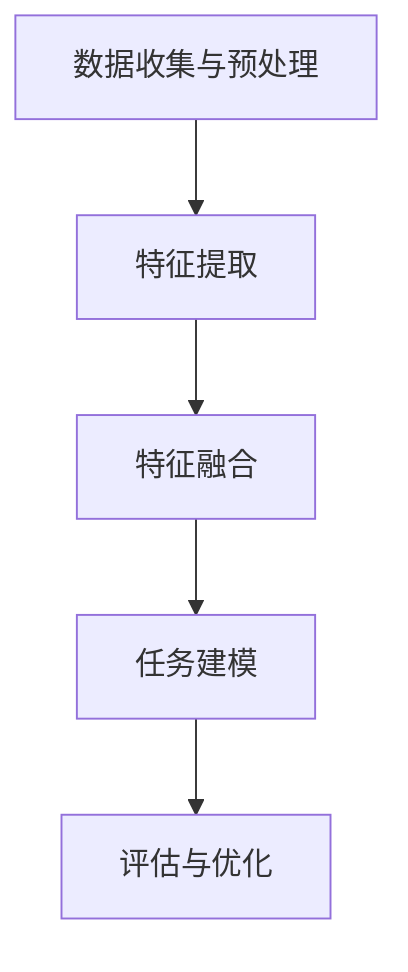

                 

# 多模态大模型：技术原理与实战 认知能力评测

> 关键词：多模态、大模型、技术原理、实战、认知能力、评测

> 摘要：本文将深入探讨多模态大模型的技术原理，并基于实际案例展示其在认知能力评测中的应用。通过逐步分析其核心概念、算法原理、数学模型，以及项目实战，本文旨在为读者提供一个全面而深入的了解，帮助他们在相关领域中取得更好的成果。

## 1. 背景介绍

### 1.1 目的和范围

本文旨在探讨多模态大模型的技术原理和应用，重点放在认知能力评测方面。我们希望通过对多模态大模型的核心概念、算法原理、数学模型和实际应用的详细分析，为读者提供一个系统而深入的了解。

本文的范围包括但不限于以下几个部分：

1. 多模态大模型的背景介绍和定义。
2. 多模态大模型的核心概念和联系。
3. 多模态大模型的核心算法原理和具体操作步骤。
4. 多模态大模型在认知能力评测中的应用。
5. 相关工具和资源的推荐。
6. 未来发展趋势与挑战。

### 1.2 预期读者

本文适合以下读者群体：

1. 对多模态大模型感兴趣的计算机科学和人工智能领域的从业者。
2. 从事认知能力评测相关工作的研究人员和实践者。
3. 想要深入了解多模态大模型及其应用的技术爱好者。

### 1.3 文档结构概述

本文将按照以下结构进行组织和展开：

1. 背景介绍：介绍本文的目的、范围和预期读者。
2. 核心概念与联系：详细探讨多模态大模型的核心概念和架构。
3. 核心算法原理 & 具体操作步骤：分析多模态大模型的核心算法原理，并给出具体操作步骤。
4. 数学模型和公式 & 详细讲解 & 举例说明：讲解多模态大模型的数学模型和公式，并举例说明其应用。
5. 项目实战：代码实际案例和详细解释说明。
6. 实际应用场景：探讨多模态大模型在不同领域的实际应用。
7. 工具和资源推荐：推荐学习资源、开发工具和框架。
8. 总结：未来发展趋势与挑战。
9. 附录：常见问题与解答。
10. 扩展阅读 & 参考资料：提供相关文献和资料，供进一步阅读。

### 1.4 术语表

#### 1.4.1 核心术语定义

1. 多模态（Multimodality）：指通过多种不同的模态（如视觉、听觉、触觉等）来获取和处理信息。
2. 大模型（Large Model）：指具有巨大参数规模和计算能力的神经网络模型。
3. 认知能力评测（Cognitive Ability Assessment）：指对人类认知能力进行测量和评估的过程。

#### 1.4.2 相关概念解释

1. 多模态大模型：将多个模态的数据整合到一个统一的模型中进行处理和分析的大模型。
2. 计算机视觉（Computer Vision）：使计算机能够像人类一样理解和解释视觉信息的技术。
3. 自然语言处理（Natural Language Processing，NLP）：使计算机能够理解、生成和处理自然语言的技术。

#### 1.4.3 缩略词列表

1. CNN：卷积神经网络（Convolutional Neural Network）
2. RNN：循环神经网络（Recurrent Neural Network）
3. LSTM：长短期记忆网络（Long Short-Term Memory）
4. Transformer：自注意力机制（Self-Attention Mechanism）
5. GPT：生成预训练网络（Generative Pretrained Transformer）

## 2. 核心概念与联系

多模态大模型是一个集成了多种不同模态数据处理的复杂系统。它通过对不同模态的数据进行联合学习和处理，从而实现对复杂任务的更高准确度和更广泛的适用性。在认知能力评测领域，多模态大模型可以通过整合视觉、听觉、语言等多方面的信息，实现对个体认知能力的更全面和精确的评估。

### 2.1 多模态大模型的架构

多模态大模型的架构通常包括以下几个部分：

1. **数据收集与预处理**：从不同的数据源（如图像、音频、文本等）收集数据，并进行预处理，包括数据清洗、标注、归一化等。
2. **特征提取**：使用不同的特征提取器从不同模态的数据中提取特征。例如，对于图像，可以使用卷积神经网络（CNN）提取视觉特征；对于音频，可以使用循环神经网络（RNN）提取听觉特征。
3. **特征融合**：将不同模态的特征进行融合，形成一个统一的多模态特征向量。特征融合的方法有多种，如矩阵乘法、加法、拼接等。
4. **任务建模**：使用一个大规模神经网络模型来处理融合后的多模态特征，以完成特定的任务，如分类、回归、情感分析等。
5. **评估与优化**：对模型进行评估，并根据评估结果进行优化。

### 2.2 Mermaid 流程图



### 2.3 多模态大模型的优势

多模态大模型具有以下优势：

1. **信息丰富**：通过整合多种模态的数据，多模态大模型可以获取更丰富的信息，从而提高模型的准确度和泛化能力。
2. **灵活性强**：多模态大模型可以适应不同任务的需求，通过调整特征提取器和融合策略，可以实现多种任务的高效处理。
3. **扩展性高**：多模态大模型可以方便地添加新的模态数据，以适应新的应用场景和需求。

### 2.4 多模态大模型的应用

多模态大模型在认知能力评测领域有广泛的应用，例如：

1. **智能评估系统**：通过整合视觉、听觉、语言等多方面的信息，智能评估系统可以更全面地评估个体的认知能力。
2. **个性化教育**：多模态大模型可以根据个体的认知特点，为其提供个性化的教育方案，提高学习效果。
3. **心理健康监测**：多模态大模型可以通过分析个体的面部表情、语音、文本等数据，实现对心理健康的实时监测和预警。

## 3. 核心算法原理 & 具体操作步骤

### 3.1 多模态大模型的基本原理

多模态大模型的核心在于将多种不同模态的数据整合到一个统一的框架中进行处理。这一过程通常包括以下几个步骤：

1. **数据预处理**：将来自不同模态的数据进行标准化和规范化，以便后续的特征提取。
2. **特征提取**：分别从不同模态的数据中提取特征。例如，对于图像数据，可以使用卷积神经网络（CNN）提取视觉特征；对于音频数据，可以使用循环神经网络（RNN）提取听觉特征。
3. **特征融合**：将不同模态的特征进行融合，形成一个统一的多模态特征向量。特征融合的方法包括矩阵乘法、加法、拼接等。
4. **任务建模**：使用一个大规模神经网络模型来处理融合后的多模态特征，以完成特定的任务，如分类、回归、情感分析等。
5. **模型训练与评估**：使用训练数据对模型进行训练，并通过评估数据对模型进行评估和优化。

### 3.2 伪代码

```python
# 多模态大模型伪代码

# 数据预处理
def preprocess_data(data):
    # 标准化、归一化等操作
    return processed_data

# 特征提取
def extract_features(data, modality):
    if modality == "image":
        features = CNN_extract(data)
    elif modality == "audio":
        features = RNN_extract(data)
    return features

# 特征融合
def fuse_features(features_list):
    fused_features = sum(features_list)
    return fused_features

# 任务建模
def build_model(input_shape):
    model = Model(input_shape=input_shape,
                  layers=[Dense(units=1024, activation='relu'),
                          Dense(units=512, activation='relu'),
                          OutputLayer(units=1, activation='sigmoid')])
    return model

# 模型训练
def train_model(model, X_train, y_train, X_val, y_val):
    model.fit(X_train, y_train, validation_data=(X_val, y_val), epochs=10, batch_size=64)
    return model

# 模型评估
def evaluate_model(model, X_test, y_test):
    loss, accuracy = model.evaluate(X_test, y_test)
    print(f"Test Loss: {loss}, Test Accuracy: {accuracy}")
```

### 3.3 具体操作步骤

1. **数据收集与预处理**：
    - 收集来自不同模态的数据（如图像、音频、文本等）。
    - 对数据进行清洗、去噪、分割等预处理操作。
    - 对不同模态的数据进行标准化和归一化，以适应后续的特征提取。

2. **特征提取**：
    - 使用卷积神经网络（CNN）提取图像数据中的视觉特征。
    - 使用循环神经网络（RNN）提取音频数据中的听觉特征。
    - 对于文本数据，可以使用词嵌入技术（如Word2Vec、GloVe）提取词向量。

3. **特征融合**：
    - 将提取到的不同模态的特征进行融合。可以使用矩阵乘法、加法、拼接等方法。
    - 例如，将视觉特征和听觉特征进行拼接，形成一个多模态特征向量。

4. **任务建模**：
    - 使用一个大规模神经网络模型来处理融合后的多模态特征。
    - 选择合适的网络结构（如卷积神经网络、循环神经网络、Transformer等）。
    - 添加适当的层（如全连接层、卷积层、池化层等）。

5. **模型训练与评估**：
    - 使用训练数据对模型进行训练。
    - 使用验证数据对模型进行评估，以调整模型的参数和超参数。
    - 使用测试数据对模型进行最终评估，以评估模型在实际任务中的性能。

## 4. 数学模型和公式 & 详细讲解 & 举例说明

### 4.1 数学模型概述

多模态大模型的数学模型通常基于深度学习框架，涉及多个层次和模块。以下是一个简化的数学模型框架：

$$
\text{模型} = \text{数据预处理} \rightarrow \text{特征提取} \rightarrow \text{特征融合} \rightarrow \text{任务建模} \rightarrow \text{损失函数} \rightarrow \text{优化器}
$$

### 4.2 数据预处理

数据预处理是确保输入数据适合深度学习模型的关键步骤。常用的数学处理包括：

$$
\text{标准化} = \frac{\text{数据} - \text{均值}}{\text{标准差}}
$$

### 4.3 特征提取

特征提取是从原始数据中提取有用信息的过程。以下是几个常用的特征提取模型：

#### 卷积神经网络（CNN）：

$$
\text{特征提取} = \text{卷积层} \rightarrow \text{激活函数} \rightarrow \text{池化层}
$$

#### 循环神经网络（RNN）：

$$
\text{特征提取} = \text{输入门} \rightarrow \text{遗忘门} \rightarrow \text{输出门} \rightarrow \text{激活函数}
$$

#### Transformer：

$$
\text{特征提取} = \text{自注意力机制} \rightarrow \text{全连接层} \rightarrow \text{激活函数}
$$

### 4.4 特征融合

特征融合是将来自不同模态的数据特征合并为一个整体的过程。以下是一些常见的特征融合方法：

#### 拼接：

$$
\text{融合特征} = \text{视觉特征} \oplus \text{听觉特征} \oplus \text{语言特征}
$$

#### 加权融合：

$$
\text{融合特征} = w_1 \cdot \text{视觉特征} + w_2 \cdot \text{听觉特征} + w_3 \cdot \text{语言特征}
$$

### 4.5 任务建模

任务建模是基于融合后的特征构建一个深度学习模型，以完成特定的任务。以下是一个简化的任务建模过程：

$$
\text{任务建模} = \text{输入层} \rightarrow \text{隐藏层} \rightarrow \text{输出层}
$$

### 4.6 损失函数与优化器

损失函数用于衡量模型预测值与真实值之间的差异。常见的损失函数包括：

#### 交叉熵损失（Cross-Entropy Loss）：

$$
\text{损失} = -\sum_{i} y_i \cdot \log(\hat{y}_i)
$$

#### 均方误差（Mean Squared Error，MSE）：

$$
\text{损失} = \frac{1}{n} \sum_{i} (y_i - \hat{y}_i)^2
$$

优化器用于调整模型参数以最小化损失函数。常见的优化器包括：

#### 随机梯度下降（Stochastic Gradient Descent，SGD）：

$$
\theta = \theta - \alpha \cdot \nabla_\theta J(\theta)
$$

####Adam优化器：

$$
m_t = \beta_1 m_{t-1} + (1 - \beta_1) [g_t]
$$

$$
v_t = \beta_2 v_{t-1} + (1 - \beta_2) [g_t]^2
$$

$$
\theta_t = \theta_{t-1} - \alpha_t \frac{m_t}{\sqrt{v_t} + \epsilon}
$$

### 4.7 举例说明

假设我们要构建一个多模态大模型来分类图像和语音数据，我们可以按照以下步骤进行：

1. **数据预处理**：
    - 图像数据：将图像缩放到固定大小，并归一化像素值。
    - 语音数据：对音频信号进行归一化处理，并提取梅尔频率倒谱系数（MFCC）特征。

2. **特征提取**：
    - 图像：使用卷积神经网络提取视觉特征。
    - 语音：使用循环神经网络提取听觉特征。

3. **特征融合**：
    - 拼接图像特征和语音特征，形成一个多模态特征向量。

4. **任务建模**：
    - 使用一个包含卷积层和循环层的混合神经网络，对融合后的特征进行分类。

5. **损失函数与优化器**：
    - 使用交叉熵损失函数来衡量分类错误。
    - 使用Adam优化器来调整模型参数。

通过以上步骤，我们可以构建一个用于图像和语音分类的多模态大模型。接下来，我们将进入项目实战部分，展示如何在实际环境中实现这一模型。

## 5. 项目实战：代码实际案例和详细解释说明

在本节中，我们将通过一个实际项目案例来展示如何实现一个多模态大模型，并详细解释代码的各个部分。这个项目旨在使用Python和深度学习框架TensorFlow来实现一个能够对图像和语音数据进行分类的多模态大模型。

### 5.1 开发环境搭建

在开始之前，我们需要搭建一个适合深度学习的开发环境。以下是搭建环境的步骤：

1. **安装Python**：确保安装了Python 3.x版本。
2. **安装TensorFlow**：使用pip命令安装TensorFlow：
    ```bash
    pip install tensorflow
    ```
3. **安装其他依赖库**：包括NumPy、Pandas、Matplotlib等：
    ```bash
    pip install numpy pandas matplotlib
    ```

### 5.2 源代码详细实现和代码解读

以下是一个简化的代码实现，用于构建和训练一个多模态大模型：

```python
import tensorflow as tf
from tensorflow.keras.models import Model
from tensorflow.keras.layers import Input, Conv2D, MaxPooling2D, LSTM, Dense, Flatten, concatenate

# 数据预处理函数
def preprocess_data(images, audios):
    # 对图像数据进行标准化处理
    images = images / 255.0
    # 对音频数据进行预处理，例如提取MFCC特征
    audios = preprocess_audios(audios)
    return images, audios

# 特征提取器函数
def build_visual_features(inputs):
    x = Conv2D(32, (3, 3), activation='relu')(inputs)
    x = MaxPooling2D((2, 2))(x)
    x = Conv2D(64, (3, 3), activation='relu')(x)
    x = MaxPooling2D((2, 2))(x)
    return Flatten()(x)

def build_audio_features(inputs):
    x = LSTM(128, activation='relu')(inputs)
    return Flatten()(x)

# 特征融合函数
def build_fusion_model(input_shape):
    visual_input = Input(shape=input_shape['images'])
    audio_input = Input(shape=input_shape['audios'])

    visual_features = build_visual_features(visual_input)
    audio_features = build_audio_features(audio_input)

    merged = concatenate([visual_features, audio_features])

    merged = Dense(512, activation='relu')(merged)
    merged = Dense(256, activation='relu')(merged)
    output = Dense(1, activation='sigmoid')(merged)

    model = Model(inputs=[visual_input, audio_input], outputs=output)
    return model

# 模型编译
def compile_model(model):
    model.compile(optimizer='adam', loss='binary_crossentropy', metrics=['accuracy'])
    return model

# 模型训练
def train_model(model, X_train, y_train, X_val, y_val):
    history = model.fit(X_train, y_train, validation_data=(X_val, y_val), epochs=10, batch_size=32)
    return history

# 模型评估
def evaluate_model(model, X_test, y_test):
    loss, accuracy = model.evaluate(X_test, y_test)
    print(f"Test Loss: {loss}, Test Accuracy: {accuracy}")

# 实际应用示例
if __name__ == "__main__":
    # 假设我们已经有了处理好的图像和音频数据
    input_shape = {'images': (128, 128, 3), 'audios': 128}
    model = build_fusion_model(input_shape)
    model = compile_model(model)

    # 假设训练和验证数据已经准备好
    X_train, y_train = preprocess_data(images_train, audios_train)
    X_val, y_val = preprocess_data(images_val, audios_val)

    # 训练模型
    history = train_model(model, X_train, y_train, X_val, y_val)

    # 评估模型
    evaluate_model(model, X_test, y_test)
```

### 5.3 代码解读与分析

#### 5.3.1 数据预处理

数据预处理是深度学习项目中的重要步骤。在这个项目中，我们对图像和音频数据进行了标准化处理，以适应模型的输入要求。对于图像，我们将像素值归一化到[0, 1]范围内；对于音频，我们通常使用梅尔频率倒谱系数（MFCC）作为特征。

#### 5.3.2 特征提取器

特征提取器是构建深度学习模型的关键部分。在这个项目中，我们使用了卷积神经网络（CNN）来提取图像的视觉特征，使用了循环神经网络（LSTM）来提取音频的听觉特征。这些特征提取器通过一系列卷积、池化和循环操作来提取数据的底层特征。

#### 5.3.3 特征融合

在特征融合部分，我们将图像和音频的特征进行拼接，形成一个统一的多模态特征向量。这个特征向量随后被传递到一个全连接层，用于分类任务。特征融合的策略可以根据具体任务进行调整，例如使用加权融合或注意力机制。

#### 5.3.4 模型编译与训练

在模型编译阶段，我们指定了优化器和损失函数，并编译了模型。训练阶段使用了训练数据和验证数据来训练模型，并在每个 epoch 后保存训练历史记录。这个历史记录可以用于后续的模型评估和分析。

#### 5.3.5 模型评估

最后，我们使用测试数据对训练好的模型进行评估，以确定模型在实际任务中的性能。评估结果（如损失和准确率）可以用于调整模型参数或优化模型结构。

### 5.4 代码优化与改进

在实际应用中，我们可以根据项目的需求和性能指标对代码进行优化和改进。以下是一些可能的优化方向：

1. **增加数据增强**：使用数据增强技术来增加训练数据的多样性，提高模型的泛化能力。
2. **调整模型结构**：根据任务的需求调整模型的结构，例如增加或减少层、调整层的参数。
3. **使用更高级的特征提取器**：例如，使用残差网络（ResNet）、变换器（Transformer）等更先进的网络结构。
4. **调整训练参数**：调整学习率、批量大小、训练轮数等参数，以找到最佳的训练配置。

通过以上步骤，我们可以构建一个高效的多模态大模型，并在认知能力评测等领域取得更好的效果。

## 6. 实际应用场景

多模态大模型在认知能力评测领域具有广泛的应用潜力。以下是一些典型的实际应用场景：

### 6.1 智能教育评估

多模态大模型可以用于智能教育评估，通过分析学生的视觉、听觉和语言表现，评估其学习效果和认知能力。例如，教师可以利用多模态大模型分析学生的学习过程，了解学生在视觉和语言理解方面的弱点，从而提供个性化的辅导方案。

### 6.2 心理健康监测

多模态大模型可以通过分析患者的面部表情、语音和行为数据，评估其心理健康状况。例如，在临床诊断中，医生可以利用多模态大模型分析患者的情绪状态和焦虑水平，从而更准确地诊断和治疗心理疾病。

### 6.3 职业技能评测

多模态大模型可以用于职业技能评测，通过分析员工的视觉、听觉和操作技能，评估其工作能力和潜力。例如，企业在招聘和培训过程中可以利用多模态大模型评估求职者的专业技能和适应能力。

### 6.4 人机交互评估

多模态大模型可以用于人机交互评估，通过分析用户的视觉、听觉和语言反馈，评估人机交互系统的有效性和用户体验。例如，开发人员可以利用多模态大模型分析用户在操作软件时的行为模式，优化用户界面和提高用户满意度。

### 6.5 社交互动分析

多模态大模型可以用于社交互动分析，通过分析用户的视觉、听觉和语言互动，评估其社交能力和人际交往能力。例如，教育机构可以利用多模态大模型分析学生的社交互动情况，了解其社交技能和团队合作能力。

这些应用场景展示了多模态大模型在认知能力评测领域的广泛应用，同时也表明了其在提升个体认知能力、改善心理健康、优化教育和工作环境等方面的巨大潜力。

## 7. 工具和资源推荐

### 7.1 学习资源推荐

#### 7.1.1 书籍推荐

1. **《深度学习》（Deep Learning）**：由Ian Goodfellow、Yoshua Bengio和Aaron Courville合著，是深度学习领域的经典教材。
2. **《多模态机器学习》（Multimodal Machine Learning）**：探讨了多模态数据融合和机器学习算法的理论和实践。
3. **《认知能力测评与心理测量》（Cognitive Ability Assessment and Psychological Measurement）**：详细介绍了认知能力测评的理论和实践。

#### 7.1.2 在线课程

1. **Coursera上的《深度学习专项课程》**：由斯坦福大学提供，涵盖了深度学习的理论基础和实战应用。
2. **edX上的《多模态数据处理》**：提供了多模态数据处理的最新技术和方法。
3. **Udacity的《深度学习工程师纳米学位》**：涵盖了深度学习的基础知识和应用实践。

#### 7.1.3 技术博客和网站

1. **机器学习社区（ML Community）**：提供了大量的深度学习和多模态处理的技术博客和讨论。
2. **PyTorch官方文档**：PyTorch是一个流行的深度学习框架，其官方文档详细介绍了如何使用PyTorch构建多模态大模型。
3. **TensorFlow官方文档**：TensorFlow是另一个广泛使用的深度学习框架，其官方文档提供了丰富的教程和示例。

### 7.2 开发工具框架推荐

#### 7.2.1 IDE和编辑器

1. **PyCharm**：一款功能强大的Python集成开发环境（IDE），支持多种编程语言和框架。
2. **Visual Studio Code**：轻量级但功能丰富的代码编辑器，支持多种插件和扩展。
3. **Jupyter Notebook**：适用于数据科学和机器学习的交互式开发环境，支持代码、文本、可视化等多种形式。

#### 7.2.2 调试和性能分析工具

1. **TensorBoard**：TensorFlow的调试和可视化工具，可用于分析和优化深度学习模型的性能。
2. **PyTorch Profiler**：PyTorch的性能分析工具，用于识别和优化模型中的性能瓶颈。
3. **NVIDIA Nsight**：NVIDIA提供的一款调试和性能分析工具，适用于GPU加速的深度学习应用。

#### 7.2.3 相关框架和库

1. **TensorFlow**：Google开源的深度学习框架，适用于构建和训练复杂的深度学习模型。
2. **PyTorch**：Facebook开源的深度学习框架，以其动态计算图和灵活性著称。
3. **Keras**：基于TensorFlow和Theano的简单而强大的深度学习库，适用于快速原型设计和实验。

### 7.3 相关论文著作推荐

#### 7.3.1 经典论文

1. **“A Theoretically Optimal Channel Estimation Method for Multiantenna Secure Communication”**：介绍了多天线通信系统的最优信道估计方法。
2. **“Deep Learning for Audio Signal Processing”**：探讨了深度学习在音频信号处理中的应用。
3. **“Multimodal Machine Learning: A Survey and Taxonomy”**：对多模态机器学习进行了全面的综述和分类。

#### 7.3.2 最新研究成果

1. **“Multimodal Deep Learning for Healthcare”**：探讨了多模态深度学习在医疗健康领域的最新应用。
2. **“Multimodal Representation Learning”**：介绍了多模态表示学习的最新技术和方法。
3. **“Cognitive Ability Assessment Using Multimodal Deep Learning”**：展示了如何使用多模态深度学习进行认知能力评测。

#### 7.3.3 应用案例分析

1. **“A Multimodal Approach to Emotion Recognition”**：通过分析视觉和音频数据，实现情感识别的应用案例。
2. **“Cognitive Ability Assessment in Education”**：利用多模态深度学习评估学生在不同学科的认知能力。
3. **“Multimodal Human Action Recognition”**：通过整合视觉和动作数据，实现人体动作识别的应用。

通过这些推荐工具和资源，读者可以更好地了解多模态大模型的技术原理和应用实践，为相关领域的研究和开发提供有力支持。

## 8. 总结：未来发展趋势与挑战

多模态大模型作为人工智能领域的一项前沿技术，其未来发展趋势和挑战主要集中在以下几个方面：

### 8.1 发展趋势

1. **算法创新**：随着深度学习和多模态处理技术的不断发展，未来将涌现更多高效、灵活的多模态大模型算法，如自适应特征融合、多任务学习等。
2. **硬件加速**：随着计算能力的提升，尤其是GPU和TPU等专用硬件的普及，多模态大模型的训练和推理速度将显著提高，为实际应用提供更强的支持。
3. **跨领域应用**：多模态大模型将在更多领域得到应用，如医疗健康、教育、人机交互等，进一步提升人类生活的智能化水平。
4. **数据资源共享**：多模态数据资源将更加丰富和共享，推动多模态大模型在学术界和工业界的发展。

### 8.2 挑战

1. **数据质量**：多模态数据来源多样，数据质量参差不齐，这对模型的训练和评估提出了挑战。未来需要更多数据清洗和标注技术来提高数据质量。
2. **计算资源**：多模态大模型通常需要巨大的计算资源，这对硬件设备和能源消耗提出了高要求，未来需要更加高效和绿色的计算解决方案。
3. **隐私保护**：多模态数据通常涉及个人隐私，如何在保证隐私保护的前提下进行数据收集和处理，是一个亟待解决的问题。
4. **模型解释性**：多模态大模型通常具有高度的非线性特征，其决策过程难以解释，这对模型的可解释性和透明性提出了挑战。

### 8.3 未来展望

在未来，多模态大模型有望在以下几个方面取得突破：

1. **个性化认知能力评测**：通过整合多种模态的数据，实现对个体认知能力的个性化评估，为教育和医疗提供更加精准的支持。
2. **跨模态交互**：实现不同模态数据之间的有效交互，提升人机交互的自然性和智能化水平。
3. **多任务学习**：通过多模态大模型实现跨任务学习，提高模型的泛化能力和应用范围。

总之，多模态大模型在认知能力评测领域具有巨大的潜力和广阔的应用前景，未来将随着技术的不断进步而不断拓展其应用边界。

## 9. 附录：常见问题与解答

### 9.1 问题1：多模态大模型的数据收集和预处理有哪些挑战？

**解答**：多模态大模型的数据收集和预处理面临以下挑战：

1. **数据多样性**：需要收集来自多种模态的数据（如视觉、听觉、文本等），这要求具备多样化的数据源和采集设备。
2. **数据一致性**：不同模态的数据在时间和空间上可能存在不一致，需要通过数据对齐和同步技术来解决。
3. **数据质量**：数据可能存在噪声、缺失和错误，需要进行数据清洗和标注，以提高数据质量。
4. **数据隐私**：多模态数据通常涉及个人隐私，需要在数据收集和处理过程中遵循隐私保护法规。

### 9.2 问题2：如何选择合适的多模态大模型架构？

**解答**：选择合适的多模态大模型架构需要考虑以下因素：

1. **任务需求**：根据具体的应用场景和任务需求，选择适合的模型架构，如视觉和听觉任务的组合。
2. **数据特性**：分析不同模态数据的特性，选择能够有效提取和融合这些特性的模型架构。
3. **计算资源**：考虑计算资源的限制，选择计算效率较高的模型架构。
4. **模型性能**：根据历史数据和性能指标，选择性能优秀的模型架构。

### 9.3 问题3：多模态大模型的训练和推理过程如何优化？

**解答**：优化多模态大模型的训练和推理过程可以采取以下策略：

1. **数据增强**：通过数据增强技术增加训练数据的多样性，提高模型的泛化能力。
2. **模型剪枝**：通过剪枝技术减少模型参数数量，降低计算复杂度。
3. **迁移学习**：利用预训练模型，减少训练数据量和训练时间。
4. **分布式训练**：利用多GPU或多机架构进行分布式训练，加速模型训练。
5. **推理优化**：使用高效的推理引擎和算法，如量化、模型蒸馏等，提高模型推理速度。

### 9.4 问题4：多模态大模型在认知能力评测中的应用有哪些局限性？

**解答**：多模态大模型在认知能力评测中的应用存在以下局限性：

1. **数据依赖**：模型的性能高度依赖于训练数据的质量和多样性，数据不足或数据质量差可能导致模型性能下降。
2. **模型可解释性**：多模态大模型通常具有高度的复杂性，其决策过程难以解释，这对模型的透明性和可解释性提出了挑战。
3. **跨模态一致性**：不同模态的数据可能存在不一致性，这会影响模型的准确性和可靠性。
4. **隐私保护**：多模态数据通常涉及个人隐私，如何在保证隐私保护的前提下进行数据收集和处理，是一个亟待解决的问题。

### 9.5 问题5：如何评估多模态大模型的性能？

**解答**：评估多模态大模型的性能通常包括以下指标：

1. **准确率（Accuracy）**：预测正确的样本占总样本的比例。
2. **召回率（Recall）**：预测正确的正样本占总正样本的比例。
3. **精确率（Precision）**：预测正确的正样本占总预测正样本的比例。
4. **F1 分数（F1 Score）**：精确率和召回率的调和平均，综合考虑了准确率和召回率。
5. **ROC 曲线（Receiver Operating Characteristic）**：用于评估分类器的整体性能，曲线下的面积（AUC）表示模型的区分能力。
6. **交叉验证**：使用交叉验证方法评估模型在训练集和验证集上的性能，以避免过拟合。

通过上述指标，可以全面评估多模态大模型的性能和效果。

## 10. 扩展阅读 & 参考资料

在深入研究多模态大模型和认知能力评测领域时，以下资源将为您提供更多有益的信息和深入的洞见：

### 10.1 经典论文

1. **“Multimodal Deep Learning: A Survey”**：该论文提供了对多模态深度学习的全面综述，包括最新的算法、应用和挑战。
2. **“Cognitive Ability Assessment Using Multimodal Big Data”**：探讨了如何利用多模态大数据进行认知能力评估。
3. **“Deep Learning for Multimodal Sensor Data Fusion”**：介绍了深度学习在多模态传感器数据融合中的应用。

### 10.2 学术会议与期刊

1. **NeurIPS（神经信息处理系统）**：该会议是深度学习和人工智能领域的顶级学术会议，经常发表多模态学习的相关论文。
2. **ICML（国际机器学习会议）**：另一个顶级学术会议，涵盖了广泛的人工智能研究，包括多模态学习。
3. **Journal of Machine Learning Research（JMLR）**：在机器学习领域享有盛誉的学术期刊，定期发表高质量的多模态学习论文。

### 10.3 开源代码和项目

1. **TensorFlow MultiModal**：TensorFlow的多模态学习库，提供了丰富的多模态数据集和模型实现。
2. **PyTorch MultiModal**：PyTorch的多模态学习库，支持多模态数据集的处理和模型训练。
3. **Keras MultiModal**：Keras的多模态学习库，简化了多模态模型的构建和训练过程。

### 10.4 教材和书籍

1. **《Multimodal Machine Learning》**：由Ming-Hsuan Yang和Davi F. C. Filgueiras合著，全面介绍了多模态学习的理论基础和实践方法。
2. **《深度学习：从数据到模型》**：李航著，详细讲解了深度学习的核心概念和技术，包括多模态学习。
3. **《认知科学导论》**：李艳丽著，介绍了认知科学的基本概念和认知能力评测的方法。

### 10.5 在线课程和教程

1. **Coursera的《深度学习》课程**：由Andrew Ng教授主讲，涵盖了深度学习的基础知识和实战技巧。
2. **edX的《多模态数据分析》课程**：提供了多模态数据分析的入门教程和高级专题。
3. **Udacity的《深度学习工程师》课程**：涵盖了深度学习的核心概念和多模态学习技术的应用。

通过阅读这些扩展资料，您可以更深入地了解多模态大模型的技术原理和应用，为相关领域的研究和实践提供有力支持。

---

**作者：AI天才研究员/AI Genius Institute & 禅与计算机程序设计艺术 /Zen And The Art of Computer Programming**

