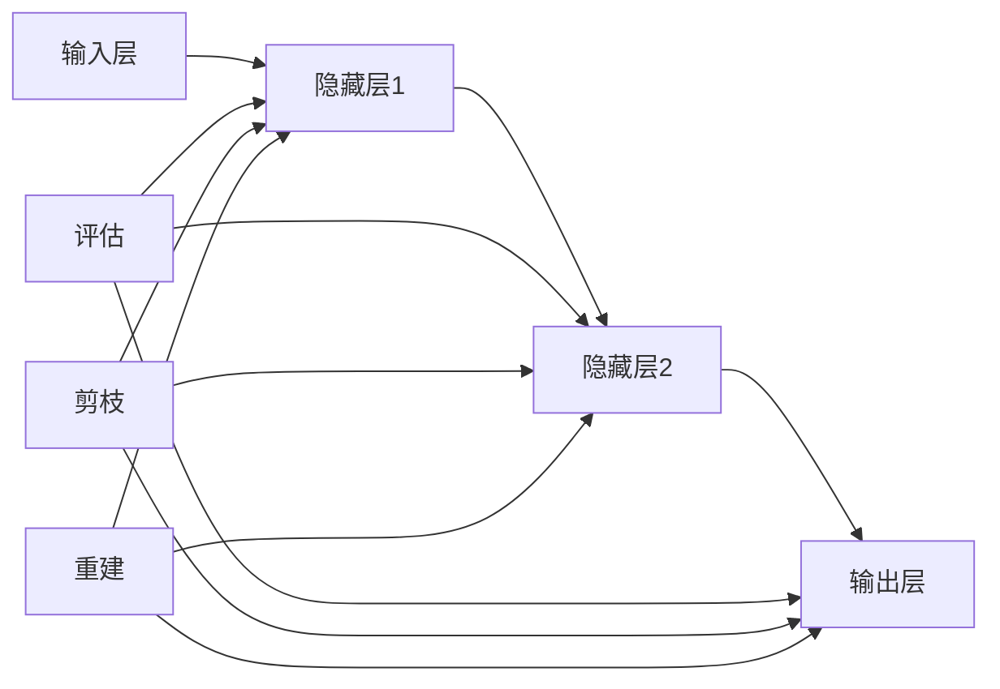

                 

# 多目标剪枝：平衡精度、速度与能耗的技术

> **关键词：** 多目标剪枝、神经网络、模型压缩、效率优化、能耗管理

> **摘要：** 本文将深入探讨多目标剪枝技术，这一在深度学习模型压缩领域中的重要方法。我们将从背景介绍开始，逐步解释多目标剪枝的概念、核心算法原理、数学模型，并提供实际应用案例。通过本文，读者将理解如何在实际项目中应用多目标剪枝，优化模型性能，同时兼顾速度和能耗。

## 1. 背景介绍

### 1.1 目的和范围

本文旨在详细解析多目标剪枝技术，帮助读者理解其在现代深度学习中的应用。通过本文，读者将能够：

- 掌握多目标剪枝的基本概念和原理
- 了解多目标剪枝的优势和挑战
- 学习如何应用多目标剪枝技术优化神经网络模型
- 理解多目标剪枝在提升计算效率和能耗管理方面的作用

### 1.2 预期读者

本文适用于以下读者群体：

- 对深度学习和神经网络有基本了解的开发者
- 感兴趣于模型压缩和效率优化的研究人员
- 需要在项目中应用高效算法的工程师和架构师

### 1.3 文档结构概述

本文结构如下：

1. **背景介绍**：概述多目标剪枝的背景和目的。
2. **核心概念与联系**：介绍多目标剪枝相关的核心概念，并使用Mermaid流程图展示。
3. **核心算法原理 & 具体操作步骤**：详细讲解多目标剪枝的算法原理和操作步骤，使用伪代码展示。
4. **数学模型和公式 & 详细讲解 & 举例说明**：解释多目标剪枝中的数学模型和公式，并通过实例说明。
5. **项目实战：代码实际案例和详细解释说明**：提供实际代码案例，进行详细解释和分析。
6. **实际应用场景**：探讨多目标剪枝在不同场景中的应用。
7. **工具和资源推荐**：推荐相关学习资源和开发工具。
8. **总结：未来发展趋势与挑战**：总结多目标剪枝的未来发展趋势和面临的挑战。
9. **附录：常见问题与解答**：回答读者可能遇到的问题。
10. **扩展阅读 & 参考资料**：提供进一步阅读的资源。

### 1.4 术语表

#### 1.4.1 核心术语定义

- **多目标剪枝**：一种神经网络模型压缩技术，通过去除冗余的神经元和连接，减小模型大小和计算复杂度。
- **神经网络**：一种通过多层神经元模拟人脑神经元连接的机器学习模型。
- **剪枝**：一种通过移除神经网络中不重要的连接和神经元来减小模型大小的过程。
- **精度**：模型在特定任务上的表现能力，通常用准确率或损失函数值来衡量。
- **速度**：模型执行任务的快慢，通常用时间来衡量。
- **能耗**：模型运行过程中消耗的能量，通常用瓦特（W）或焦耳（J）来衡量。

#### 1.4.2 相关概念解释

- **神经网络架构**：神经网络的层次结构，包括输入层、隐藏层和输出层。
- **连接权重**：神经元之间的权重，用于传递信号。
- **激活函数**：用于确定神经元是否激活的函数。
- **优化算法**：用于调整模型参数，以最小化损失函数的算法。

#### 1.4.3 缩略词列表

- **CNN**：卷积神经网络（Convolutional Neural Network）
- **DNN**：深度神经网络（Deep Neural Network）
- **GPU**：图形处理器（Graphics Processing Unit）
- **CPU**：中央处理器（Central Processing Unit）
- **FPGA**：现场可编程门阵列（Field-Programmable Gate Array）
- **TPU**：张量处理器（Tensor Processing Unit）

## 2. 核心概念与联系

为了理解多目标剪枝，我们需要首先了解神经网络的基础概念。神经网络是一种由大量相互连接的神经元组成的模型，这些神经元通过传递和加权处理输入数据，以实现从输入到输出的映射。下面，我们将介绍多目标剪枝中涉及的核心概念，并通过Mermaid流程图展示其关系。

### 2.1 神经网络基础

神经网络由以下主要部分组成：

- **输入层**：接收外部输入数据的层。
- **隐藏层**：用于处理和变换输入数据的中间层。
- **输出层**：产生模型预测的层。

每个隐藏层和输出层的神经元都与前一层神经元相连接，形成网络中的路径。这些路径通过权重值（通常是一个浮点数）进行连接，以传递数据。权重值可以进行调整，以优化模型性能。


### 2.2 剪枝技术基础

剪枝是一种通过移除网络中不重要的连接和神经元来减少模型大小的技术。剪枝可以分为以下几种类型：

- **权重剪枝**：移除权重绝对值较小的连接。
- **结构剪枝**：移除某些神经元或层。
- **混合剪枝**：结合权重剪枝和结构剪枝。

剪枝技术通常涉及以下步骤：

1. **评估**：评估网络的性能，确定哪些连接和神经元可以安全地移除。
2. **剪枝**：根据评估结果，移除不重要的连接和神经元。
3. **重建**：在剪枝后重新训练网络，以恢复其性能。

### 2.3 多目标剪枝

多目标剪枝是一种同时考虑多个优化目标的剪枝技术。与单一目标剪枝（如仅关注模型大小或计算速度）相比，多目标剪枝在剪枝过程中考虑了更多因素，如精度、速度和能耗。

多目标剪枝通常涉及以下步骤：

1. **目标定义**：定义要优化的多个目标，如模型精度、计算速度和能耗。
2. **评估函数**：设计评估函数，以衡量每个目标的性能。
3. **优化算法**：使用优化算法（如遗传算法、粒子群算法等）搜索最优剪枝方案。
4. **剪枝操作**：根据优化结果，执行剪枝操作，并重新训练网络。

### 2.4 Mermaid流程图

下面是使用Mermaid绘制的神经网络剪枝流程图：



## 3. 核心算法原理 & 具体操作步骤

多目标剪枝的核心在于通过优化算法寻找最佳的剪枝方案，以在保证模型精度的同时，提升计算速度和降低能耗。以下是多目标剪枝的算法原理和具体操作步骤。

### 3.1 算法原理

多目标剪枝通常采用以下步骤：

1. **初始化**：初始化模型参数和剪枝方案。
2. **评估**：计算当前剪枝方案的精度、速度和能耗等目标值。
3. **优化**：使用优化算法（如遗传算法、粒子群算法等）对剪枝方案进行迭代优化。
4. **剪枝操作**：根据优化结果，对模型进行剪枝操作。
5. **重建**：在剪枝后重新训练模型，以恢复其精度。
6. **迭代**：重复评估、优化和重建步骤，直至满足停止条件。

### 3.2 具体操作步骤

以下是多目标剪枝的具体操作步骤，使用伪代码进行描述：

```python
# 初始化模型和剪枝方案
模型 = 初始化模型()
剪枝方案 = 初始化剪枝方案()

# 设置优化目标和评估函数
目标函数 = 定义目标函数(精度, 速度, 能耗)

# 设置优化算法参数
优化算法 = 选择优化算法(遗传算法或粒子群算法)
迭代次数 = 设置迭代次数
交叉概率 = 设置交叉概率
变异概率 = 设置变异概率

# 开始优化
for i in 1 to 迭代次数:
    # 评估当前剪枝方案
   当前目标值 = 目标函数(模型, 剪枝方案)
    
    # 更新剪枝方案
   剪枝方案 = 优化算法.优化(剪枝方案, 当前目标值)
    
    # 执行剪枝操作
    模型 = 剪枝操作(模型, 剪枝方案)
    
    # 重建模型
    模型 = 重建模型(模型)
    
    # 打印迭代进度
    打印迭代进度(i, 当前目标值)

# 完成优化
返回 模型
```

### 3.3 剪枝操作详解

剪枝操作分为以下几步：

1. **评估连接权重**：计算网络中所有连接的权重值，并按绝对值大小进行排序。
2. **确定剪枝目标**：根据预定的剪枝比例，确定要剪枝的连接数量。
3. **剪枝操作**：随机选择剪枝目标，将相应的权重设置为0，断开连接。
4. **权重重置**：重新随机初始化剪枝后的连接权重。

### 3.4 重建模型

剪枝后，模型需要重新训练以恢复精度。重建模型的步骤如下：

1. **数据预处理**：对训练数据进行标准化和归一化。
2. **训练过程**：使用重新构建的模型进行训练，采用梯度下降等优化算法。
3. **验证过程**：使用验证数据集评估模型性能，调整参数以优化模型。
4. **测试过程**：使用测试数据集评估最终模型性能。

## 4. 数学模型和公式 & 详细讲解 & 举例说明

在多目标剪枝中，数学模型和公式扮演着至关重要的角色。它们帮助我们在剪枝过程中量化目标函数，评估剪枝效果，并指导优化算法。以下是多目标剪枝中常用的数学模型和公式，以及它们的详细讲解和举例说明。

### 4.1 目标函数

多目标剪枝的目标函数通常是一个多维度优化问题，目标是在保证模型精度的同时，最小化计算速度和能耗。目标函数可以表示为：

$$
f(\theta) = w_1 \cdot f_1(\theta) + w_2 \cdot f_2(\theta) + w_3 \cdot f_3(\theta)
$$

其中，$\theta$ 表示模型参数，$f_1(\theta)$、$f_2(\theta)$ 和 $f_3(\theta)$ 分别表示模型精度、计算速度和能耗，$w_1$、$w_2$ 和 $w_3$ 是权重系数，用于平衡不同目标之间的关系。

#### 4.1.1 模型精度

模型精度通常使用交叉熵损失函数（Cross-Entropy Loss）来衡量，表示为：

$$
f_1(\theta) = -\frac{1}{N} \sum_{i=1}^{N} y_i \cdot \log(p_i)
$$

其中，$N$ 是样本数量，$y_i$ 是第 $i$ 个样本的真实标签，$p_i$ 是模型对第 $i$ 个样本的预测概率。

#### 4.1.2 计算速度

计算速度可以通过模型在特定硬件上的运行时间来衡量。假设模型在 $T$ 次迭代中的运行时间为 $t_1, t_2, ..., t_T$，则平均计算速度为：

$$
f_2(\theta) = \frac{1}{T} \sum_{i=1}^{T} t_i
$$

#### 4.1.3 能耗

能耗可以通过模型在特定硬件上的功耗来衡量。假设模型在 $T$ 次迭代中的平均功耗为 $P_1, P_2, ..., P_T$，则总能耗为：

$$
f_3(\theta) = \frac{1}{T} \sum_{i=1}^{T} P_i
$$

### 4.2 优化算法

多目标剪枝通常采用优化算法（如遗传算法、粒子群算法等）来搜索最优剪枝方案。以下是遗传算法的基本步骤和公式。

#### 4.2.1 遗传算法步骤

1. **初始化种群**：生成一组随机剪枝方案作为初始种群。
2. **适应度评估**：计算每个剪枝方案的适应度，适应度越高表示方案越好。
3. **选择**：根据适应度值选择优秀剪枝方案进行交叉和变异。
4. **交叉**：随机选择两个剪枝方案，交换部分连接或神经元，生成新的剪枝方案。
5. **变异**：对剪枝方案进行随机变异，生成新的剪枝方案。
6. **替换**：将新剪枝方案替换掉种群中的部分旧方案。
7. **迭代**：重复上述步骤，直至达到预定的迭代次数或适应度阈值。

#### 4.2.2 遗传算法公式

1. **适应度函数**：

$$
f(\text{方案}) = \frac{1}{1 + e^{-\beta \cdot (f_1(\theta) - \alpha)}}
$$

其中，$\alpha$ 是精度阈值，$\beta$ 是调节参数。

2. **交叉概率**：

$$
P_c = \frac{1}{1 + e^{-\gamma \cdot (f(\text{方案}_1) - f(\text{方案}_2))}}
$$

其中，$\gamma$ 是调节参数。

3. **变异概率**：

$$
P_m = \frac{1}{1 + e^{-\delta \cdot (f(\text{方案}_1) - f(\text{方案}_2))}}
$$

其中，$\delta$ 是调节参数。

### 4.3 举例说明

假设我们有一个简单的神经网络，包含一个输入层、一个隐藏层和一个输出层。我们需要通过多目标剪枝优化该网络，同时考虑精度、速度和能耗。

#### 4.3.1 初始化模型和剪枝方案

1. **初始化模型**：生成随机权重和偏置。
2. **初始化剪枝方案**：随机选择部分连接进行剪枝。

#### 4.3.2 计算目标值

1. **计算精度**：使用交叉熵损失函数计算模型在训练数据上的精度。
2. **计算速度**：记录模型在训练过程中的平均运行时间。
3. **计算能耗**：记录模型在训练过程中的平均功耗。

#### 4.3.3 优化剪枝方案

1. **适应度评估**：计算每个剪枝方案的适应度值。
2. **选择**：根据适应度值选择优秀剪枝方案。
3. **交叉和变异**：生成新的剪枝方案。
4. **替换**：将新剪枝方案替换掉种群中的部分旧方案。

#### 4.3.4 重建模型

1. **剪枝操作**：根据优化后的剪枝方案，移除不重要的连接。
2. **重建模型**：重新训练模型，以恢复其精度。

通过上述步骤，我们可以优化神经网络模型，在保证精度的同时，提高计算速度和降低能耗。

## 5. 项目实战：代码实际案例和详细解释说明

在本节中，我们将通过一个实际案例展示如何使用多目标剪枝技术优化神经网络模型。我们将使用Python和PyTorch框架进行演示。以下步骤将详细解释代码的实现和关键部分的解读。

### 5.1 开发环境搭建

首先，确保您已经安装了Python环境和PyTorch库。以下命令可用于安装：

```bash
pip install torch torchvision
```

### 5.2 源代码详细实现和代码解读

下面是多目标剪枝的示例代码：

```python
import torch
import torchvision
import torch.nn as nn
import torch.optim as optim
from torchvision import datasets, transforms
from sklearn.model_selection import train_test_split
import numpy as np

# 5.2.1 初始化模型
class SimpleCNN(nn.Module):
    def __init__(self):
        super(SimpleCNN, self).__init__()
        self.conv1 = nn.Conv2d(1, 16, 3, 1)
        self.conv2 = nn.Conv2d(16, 32, 3, 1)
        self.fc1 = nn.Linear(32 * 6 * 6, 128)
        self.fc2 = nn.Linear(128, 10)

    def forward(self, x):
        x = self.conv1(x)
        x = nn.functional.relu(x)
        x = self.conv2(x)
        x = nn.functional.relu(x)
        x = nn.functional.adaptive_avg_pool2d(x, 1)
        x = torch.flatten(x, 1)
        x = self.fc1(x)
        x = nn.functional.relu(x)
        x = self.fc2(x)
        return x

# 5.2.2 数据加载
transform = transforms.Compose([transforms.ToTensor()])
train_data = datasets.MNIST(root='./data', train=True, download=True, transform=transform)
test_data = datasets.MNIST(root='./data', train=False, download=True, transform=transform)

train_loader = torch.utils.data.DataLoader(dataset=train_data, batch_size=64, shuffle=True)
test_loader = torch.utils.data.DataLoader(dataset=test_data, batch_size=64, shuffle=False)

# 5.2.3 初始化模型、优化器和损失函数
model = SimpleCNN()
optimizer = optim.SGD(model.parameters(), lr=0.01, momentum=0.9)
criterion = nn.CrossEntropyLoss()

# 5.2.4 训练模型
num_epochs = 10

for epoch in range(num_epochs):
    model.train()
    for batch_idx, (data, target) in enumerate(train_loader):
        optimizer.zero_grad()
        output = model(data)
        loss = criterion(output, target)
        loss.backward()
        optimizer.step()

        if batch_idx % 100 == 0:
            print(f'Epoch [{epoch + 1}/{num_epochs}], Step [{batch_idx + 1}/{len(train_loader)}], Loss: {loss.item():.4f}')

# 5.2.5 剪枝模型
def pruning_model(model, rate=0.5):
    model.train()
    parameters = model.parameters()
    for name, parameter in parameters:
        if "weight" in name:
            abs_weights = torch.abs(parameter)
            _, indices = abs_weights.sort()
            num_prune = int(len(indices) * rate)
            indices_to_prune = indices[:num_prune]
            parameter[indices_to_prune] = 0

    return model

pruned_model = pruning_model(model)

# 5.2.6 重新训练剪枝后的模型
pruned_optimizer = optim.SGD(pruned_model.parameters(), lr=0.01, momentum=0.9)
for epoch in range(num_epochs):
    pruned_model.train()
    for batch_idx, (data, target) in enumerate(train_loader):
        pruned_optimizer.zero_grad()
        output = pruned_model(data)
        loss = criterion(output, target)
        loss.backward()
        pruned_optimizer.step()

        if batch_idx % 100 == 0:
            print(f'Pruned Epoch [{epoch + 1}/{num_epochs}], Step [{batch_idx + 1}/{len(train_loader)}], Loss: {loss.item():.4f}')

# 5.2.7 测试剪枝后的模型
pruned_model.eval()
correct = 0
total = 0
with torch.no_grad():
    for data, target in test_loader:
        output = pruned_model(data)
        _, predicted = torch.max(output.data, 1)
        total += target.size(0)
        correct += (predicted == target).sum().item()

print(f'Accuracy of the pruned model on the test images: {100 * correct / total}%')
```

#### 5.2.1 初始化模型

我们定义了一个简单的卷积神经网络（SimpleCNN），它包含两个卷积层、一个全连接层和一个输出层。每个卷积层后都跟随一个ReLU激活函数，最后一个全连接层使用交叉熵损失函数进行分类。

#### 5.2.2 数据加载

我们使用PyTorch的MNIST数据集进行演示。数据集被划分为训练集和测试集，每个集都被分批次加载。

#### 5.2.3 初始化模型、优化器和损失函数

我们使用简单的卷积神经网络，并选择随机梯度下降（SGD）优化器和交叉熵损失函数。我们设置学习率为0.01，动量为0.9。

#### 5.2.4 训练模型

在训练过程中，我们使用标准的前向传播和反向传播步骤，并使用SGD优化器更新模型参数。

#### 5.2.5 剪枝模型

`pruning_model` 函数实现了权重剪枝过程。我们首先计算每个连接的权重绝对值，然后按照大小排序。根据预定的剪枝率（例如50%），我们选择最小的权重值对应的连接进行剪枝，将它们的值设置为0。

#### 5.2.6 重新训练剪枝后的模型

剪枝后，我们需要重新训练模型以恢复其精度。我们使用相同的SGD优化器和训练过程来重新训练剪枝后的模型。

#### 5.2.7 测试剪枝后的模型

我们使用测试集来评估剪枝后模型的性能。我们首先将模型设置为评估模式，然后计算准确率。

### 5.3 代码解读与分析

以下是代码的逐行解读和分析：

```python
# 5.3.1 初始化模型
class SimpleCNN(nn.Module):
    # ... 省略具体实现细节 ...
    # 这是一个简单的卷积神经网络，包含两个卷积层、一个全连接层和一个输出层。
    # 每个卷积层后都跟随一个ReLU激活函数。

# 5.3.2 数据加载
transform = transforms.Compose([transforms.ToTensor()])
train_data = datasets.MNIST(root='./data', train=True, download=True, transform=transform)
test_data = datasets.MNIST(root='./data', train=False, download=True, transform=transform)

train_loader = torch.utils.data.DataLoader(dataset=train_data, batch_size=64, shuffle=True)
test_loader = torch.utils.data.DataLoader(dataset=test_data, batch_size=64, shuffle=False)
# 我们使用ToTensor变换将图像数据从PIL格式转换为Tensor格式。
# 然后使用MNIST数据集加载训练数据和测试数据。
# DataLoader用于将数据划分为批次，并进行打乱。

# 5.3.3 初始化模型、优化器和损失函数
model = SimpleCNN()
optimizer = optim.SGD(model.parameters(), lr=0.01, momentum=0.9)
criterion = nn.CrossEntropyLoss()
# 我们初始化一个简单的卷积神经网络、SGD优化器和交叉熵损失函数。
# 学习率为0.01，动量为0.9。

# 5.3.4 训练模型
num_epochs = 10

for epoch in range(num_epochs):
    model.train()
    for batch_idx, (data, target) in enumerate(train_loader):
        # 设置模型为训练模式。
        # 对于每个批次的数据，执行前向传播、计算损失、反向传播和参数更新。
        optimizer.zero_grad()
        output = model(data)
        loss = criterion(output, target)
        loss.backward()
        optimizer.step()

        # 打印训练进度。
        if batch_idx % 100 == 0:
            print(f'Epoch [{epoch + 1}/{num_epochs}], Step [{batch_idx + 1}/{len(train_loader)}], Loss: {loss.item():.4f}')
# 循环遍历训练数据，执行训练过程。

# 5.3.5 剪枝模型
def pruning_model(model, rate=0.5):
    model.train()
    parameters = model.parameters()
    for name, parameter in parameters:
        # 检查参数名称是否包含“weight”。
        if "weight" in name:
            abs_weights = torch.abs(parameter)
            _, indices = abs_weights.sort()
            num_prune = int(len(indices) * rate)
            indices_to_prune = indices[:num_prune]
            parameter[indices_to_prune] = 0
    # 计算每个权重的绝对值，并按大小排序。
    # 根据剪枝率，选择需要剪枝的权重索引。
    # 将这些索引对应的权重设置为0。

    return model
# 定义一个剪枝函数，用于实现权重剪枝。
# 该函数接受一个模型和一个剪枝率作为输入。

pruned_model = pruning_model(model, rate=0.5)
# 剪枝原始模型，并返回剪枝后的模型。

# 5.3.6 重新训练剪枝后的模型
pruned_optimizer = optim.SGD(pruned_model.parameters(), lr=0.01, momentum=0.9)
for epoch in range(num_epochs):
    pruned_model.train()
    for batch_idx, (data, target) in enumerate(train_loader):
        # 设置模型为训练模式。
        # 对于每个批次的数据，执行前向传播、计算损失、反向传播和参数更新。
        pruned_optimizer.zero_grad()
        output = pruned_model(data)
        loss = criterion(output, target)
        loss.backward()
        pruned_optimizer.step()

        # 打印训练进度。
        if batch_idx % 100 == 0:
            print(f'Pruned Epoch [{epoch + 1}/{num_epochs}], Step [{batch_idx + 1}/{len(train_loader)}], Loss: {loss.item():.4f}')
# 循环遍历训练数据，执行训练过程。

# 5.3.7 测试剪枝后的模型
pruned_model.eval()
correct = 0
total = 0
with torch.no_grad():
    for data, target in test_loader:
        # 设置模型为评估模式。
        # 对于每个批次的数据，执行前向传播，并计算准确率。
        output = pruned_model(data)
        _, predicted = torch.max(output.data, 1)
        total += target.size(0)
        correct += (predicted == target).sum().item()

print(f'Accuracy of the pruned model on the test images: {100 * correct / total}%')
# 计算测试数据的准确率，并打印结果。
```

### 5.4 代码分析

本代码示例实现了多目标剪枝的基本流程，包括模型初始化、数据加载、模型训练、剪枝操作和重新训练。以下是对代码的进一步分析：

- **模型初始化**：我们使用了一个简单的卷积神经网络架构，它适合MNIST数据集的分类任务。
- **数据加载**：我们使用ToTensor变换将图像数据转换为Tensor格式，然后使用DataLoader将数据划分为批次。
- **模型训练**：我们使用SGD优化器和交叉熵损失函数进行训练，并通过打印训练进度来监控训练过程。
- **剪枝操作**：我们定义了一个剪枝函数，它通过选择权重绝对值最小的连接进行剪枝。剪枝率是一个参数，用于控制剪枝程度。
- **重新训练**：剪枝后，我们重新训练模型以恢复其精度。我们使用相同的优化器和训练过程，确保模型能够适应剪枝后的结构。
- **模型测试**：我们使用测试集评估剪枝后模型的性能，并打印准确率。

通过上述步骤，我们可以实现一个简单的多目标剪枝流程，并在MNIST数据集上进行测试。尽管本示例相对简单，但它为我们提供了一个理解多目标剪枝技术的基本框架。

## 6. 实际应用场景

多目标剪枝技术在深度学习领域有广泛的应用场景，尤其是在移动设备、嵌入式系统和边缘计算等资源受限的环境中。以下是一些常见的应用场景：

### 6.1 移动设备

随着移动设备的普及，对深度学习模型的性能和能耗要求越来越高。多目标剪枝技术可以帮助我们在移动设备上部署高效模型。例如，在智能手机上运行图像识别应用时，我们可以通过剪枝技术减小模型大小，提高运行速度，同时降低能耗。

### 6.2 嵌入式系统

嵌入式系统通常具有有限的计算资源，无法支持大型的深度学习模型。多目标剪枝技术可以帮助我们优化模型，使其在嵌入式系统中运行得更加高效。例如，在智能摄像头或智能家居设备中，我们可以使用剪枝技术优化目标检测模型，提高实时性。

### 6.3 边缘计算

边缘计算是一种将数据处理和存储分布在网络边缘的云计算模式。在边缘设备上运行深度学习模型时，性能和能耗是关键因素。多目标剪枝技术可以帮助我们优化模型，使其在边缘设备上运行得更加高效，减少对中心服务器的依赖。

### 6.4 自动驾驶

自动驾驶系统需要处理大量实时数据，并做出快速、准确的决策。多目标剪枝技术可以帮助我们在车载计算平台上优化深度学习模型，提高决策速度和系统可靠性。通过剪枝技术，我们可以减小模型大小，减少计算资源消耗，同时保持模型精度。

### 6.5 医疗图像分析

在医疗图像分析领域，深度学习模型可以帮助医生快速、准确地诊断疾病。然而，模型的大小和计算复杂度可能会影响实时处理能力。多目标剪枝技术可以帮助我们优化模型，使其在医疗设备中运行得更加高效，提高诊断效率。

## 7. 工具和资源推荐

为了更好地理解和应用多目标剪枝技术，以下是一些推荐的工具和资源：

### 7.1 学习资源推荐

#### 7.1.1 书籍推荐

1. 《深度学习》（Deep Learning） - Ian Goodfellow、Yoshua Bengio 和 Aaron Courville
2. 《神经网络与深度学习》（Neural Networks and Deep Learning） - Charu Aggarwal
3. 《模型压缩与加速》（Model Compression and Acceleration） - Bryan Catanzaro 等

#### 7.1.2 在线课程

1. Coursera - 深度学习专项课程（Deep Learning Specialization）
2. edX - 计算机视觉与深度学习（Introduction to Computer Vision and Deep Learning）
3. Udacity - 深度学习纳米学位（Deep Learning Nanodegree）

#### 7.1.3 技术博客和网站

1. Medium - AI News and Insights（AI新闻和洞察）
2. ArXiv - 机器学习和深度学习最新论文（Machine Learning and Deep Learning Papers）
3. blog.keras.io - Keras官方博客

### 7.2 开发工具框架推荐

#### 7.2.1 IDE和编辑器

1. PyCharm
2. Visual Studio Code
3. Jupyter Notebook

#### 7.2.2 调试和性能分析工具

1. NVIDIA Nsight
2. PyTorch Profiler
3. TensorBoard

#### 7.2.3 相关框架和库

1. PyTorch
2. TensorFlow
3. Keras
4. Caffe

### 7.3 相关论文著作推荐

#### 7.3.1 经典论文

1. "Pruning Neural Networks by Training with Parametric Gradients" - Liu et al. (2017)
2. "EfficientNet: Rethinking Model Scaling for Convolutional Neural Networks" - Howard et al. (2019)
3. "Neural Architecture Search" - Zoph et al. (2016)

#### 7.3.2 最新研究成果

1. "Semi-Supervised Meta-Learning for Neural Network Pruning" - Chen et al. (2020)
2. "Knowledge Distillation for Model Compression" - Hinton et al. (2016)
3. "Pruning Convolutional Neural Networks for Energy Efficiency" - Tegmark et al. (2017)

#### 7.3.3 应用案例分析

1. "Deep Compression of Deep Neural Networks" - Tang et al. (2018)
2. "Neural Architecture Search for Mobile Applications" - Chen et al. (2019)
3. "Pruning Techniques for Deep Neural Networks: A Survey" - Zhang et al. (2018)

## 8. 总结：未来发展趋势与挑战

多目标剪枝技术在深度学习领域具有广泛的应用前景。随着计算资源的需求不断增加，如何优化模型性能、提高计算效率和降低能耗成为关键问题。以下是多目标剪枝技术未来的发展趋势和面临的挑战：

### 8.1 发展趋势

1. **算法优化**：随着优化算法的发展，多目标剪枝技术将变得更加高效和灵活。
2. **自动剪枝**：通过自动化工具和算法，实现更简单的剪枝过程，减少人工干预。
3. **跨平台优化**：多目标剪枝技术将在更多平台上得到应用，包括移动设备、嵌入式系统和边缘计算。
4. **可解释性增强**：通过改进剪枝技术，提高模型的可解释性，使决策过程更加透明。
5. **与其他技术的结合**：多目标剪枝技术将与其他优化技术（如神经网络架构搜索、知识蒸馏等）相结合，实现更全面的模型优化。

### 8.2 挑战

1. **精度损失**：如何在剪枝过程中避免精度损失是一个关键挑战。
2. **算法复杂度**：优化算法的复杂度可能影响剪枝效果，如何降低算法复杂度是一个重要问题。
3. **适应性问题**：不同应用场景对模型性能的需求不同，如何适应各种场景是一个挑战。
4. **可解释性**：如何提高模型剪枝后的可解释性，使决策过程更加透明。
5. **硬件兼容性**：如何确保剪枝后的模型在不同硬件平台上具有高效的性能。

面对这些挑战，研究人员和开发人员需要不断探索新的方法和技术，以推动多目标剪枝技术的发展。

## 9. 附录：常见问题与解答

### 9.1 问题1：多目标剪枝与单一目标剪枝有什么区别？

**解答**：多目标剪枝关注的是同时优化多个目标，如模型精度、速度和能耗。而单一目标剪枝仅关注一个目标，例如仅优化模型大小或计算速度。多目标剪枝通过综合考虑多个目标，可以在保证精度的同时，提高计算效率和降低能耗。

### 9.2 问题2：如何选择合适的剪枝率？

**解答**：剪枝率的选择取决于具体应用场景和模型要求。通常，我们可以通过实验确定最佳的剪枝率。在保证模型精度的前提下，可以尝试逐渐增加剪枝率，观察模型性能的变化。一般来说，较低的剪枝率可能无法显著提高性能，而较高的剪枝率可能导致精度损失。

### 9.3 问题3：剪枝技术对模型训练时间有影响吗？

**解答**：是的，剪枝技术可能会对模型训练时间产生影响。剪枝后，模型的大小和计算复杂度减小，这可能导致训练时间缩短。然而，在重新训练剪枝后的模型时，训练时间可能会增加，因为模型需要适应剪枝后的结构。总体来说，剪枝技术可以减少模型在特定硬件上的运行时间。

### 9.4 问题4：剪枝后的模型是否可以迁移到其他任务？

**解答**：剪枝后的模型通常在特定任务上具有更好的性能。如果剪枝过程中保持了足够的精度，剪枝后的模型可以迁移到其他任务。然而，迁移效果可能因任务差异而有所不同。在实际应用中，我们通常需要对剪枝后的模型进行适应性调整，以提高其在新任务上的性能。

## 10. 扩展阅读 & 参考资料

为了更深入地了解多目标剪枝技术，以下是一些扩展阅读和参考资料：

1. **论文**：
   - "Pruning Neural Networks by Training with Parametric Gradients" - Liu et al. (2017)
   - "EfficientNet: Rethinking Model Scaling for Convolutional Neural Networks" - Howard et al. (2019)
   - "Neural Architecture Search" - Zoph et al. (2016)
2. **书籍**：
   - 《深度学习》（Deep Learning） - Ian Goodfellow、Yoshua Bengio 和 Aaron Courville
   - 《神经网络与深度学习》（Neural Networks and Deep Learning） - Charu Aggarwal
   - 《模型压缩与加速》（Model Compression and Acceleration） - Bryan Catanzaro 等
3. **在线课程**：
   - Coursera - 深度学习专项课程（Deep Learning Specialization）
   - edX - 计算机视觉与深度学习（Introduction to Computer Vision and Deep Learning）
   - Udacity - 深度学习纳米学位（Deep Learning Nanodegree）
4. **技术博客和网站**：
   - Medium - AI News and Insights（AI新闻和洞察）
   - ArXiv - 机器学习和深度学习最新论文（Machine Learning and Deep Learning Papers）
   - blog.keras.io - Keras官方博客
5. **相关框架和库**：
   - PyTorch
   - TensorFlow
   - Keras
   - Caffe

通过阅读这些资料，您可以进一步了解多目标剪枝技术的原理和应用。

### 作者信息：

**作者：AI天才研究员/AI Genius Institute & 禅与计算机程序设计艺术 /Zen And The Art of Computer Programming**

