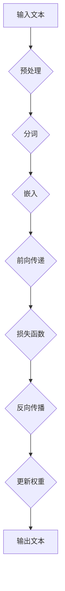
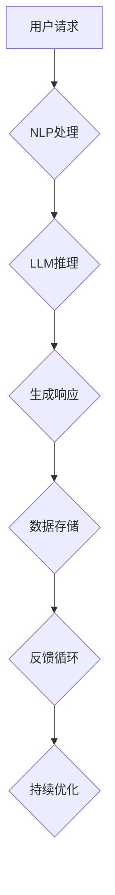

                 

# 大型科技公司和LLM：创新与道德之间的平衡

## 关键词：
大型科技公司，自然语言处理，大型语言模型（LLM），道德规范，隐私保护，技术创新，社会责任。

## 摘要：
随着人工智能技术的飞速发展，大型科技公司不断推出基于大型语言模型（LLM）的创新产品和服务。然而，这种创新在带来便利的同时，也引发了一系列道德和社会责任问题，如数据隐私、偏见和滥用等。本文将深入探讨大型科技公司与LLM之间的创新与道德平衡问题，分析当前的主要挑战，并提出可能的解决方案，以期为未来的发展提供一些有价值的思考。

## 1. 背景介绍

### 1.1 目的和范围
本文旨在探讨大型科技公司在开发和部署基于LLM技术时，如何在创新与道德责任之间寻找平衡。我们将讨论当前的主要挑战，分析解决方案，并展望未来可能的趋势。

### 1.2 预期读者
本文适合对人工智能、自然语言处理以及大型科技公司的社会责任感兴趣的读者，包括研究人员、工程师、政策制定者以及其他对此领域感兴趣的从业者。

### 1.3 文档结构概述
本文分为八个部分。首先介绍背景，然后探讨核心概念与联系，详细讲解核心算法原理和数学模型，展示实际项目案例，分析应用场景，推荐相关工具和资源，最后总结发展趋势与挑战，并提供常见问题与解答。

### 1.4 术语表

#### 1.4.1 核心术语定义

- **大型科技公司**：如谷歌、微软、亚马逊等在全球范围内拥有强大影响力和市场份额的科技公司。
- **自然语言处理（NLP）**：人工智能的一个分支，旨在让计算机理解、生成和处理人类语言。
- **大型语言模型（LLM）**：一种基于深度学习的技术，能够对自然语言进行建模和处理，例如GPT和BERT。
- **道德规范**：在特定社会和文化背景下，关于行为正确与否的指导原则。

#### 1.4.2 相关概念解释

- **隐私保护**：确保个人信息不被未经授权的第三方访问或使用。
- **偏见**：模型在处理数据时，对某些群体或个体表现出不公平的倾向。

#### 1.4.3 缩略词列表

- **NLP**：自然语言处理
- **LLM**：大型语言模型
- **GPT**：生成预训练的变换器模型
- **BERT**：双向编码表示器

## 2. 核心概念与联系

### 2.1 大型语言模型（LLM）的工作原理

**Mermaid 流程图：**



### 2.2 LLM在大型科技公司中的应用场景

**Mermaid 流程图：**



## 3. 核心算法原理 & 具体操作步骤

### 3.1 预训练阶段

```python
# 伪代码：预训练大型语言模型
def pretrain_model(model, dataset, optimizer, loss_function, epochs):
    for epoch in range(epochs):
        for text, label in dataset:
            model.zero_grad()
            prediction = model(text)
            loss = loss_function(prediction, label)
            loss.backward()
            optimizer.step()
        print(f"Epoch {epoch}: Loss = {loss.item()}")
```

### 3.2 微调阶段

```python
# 伪代码：微调大型语言模型
def finetune_model(model, task_dataset, optimizer, loss_function):
    for text, label in task_dataset:
        model.zero_grad()
        prediction = model(text)
        loss = loss_function(prediction, label)
        loss.backward()
        optimizer.step()
    print(f"Task Finetuning: Loss = {loss.item()}")
```

## 4. 数学模型和公式 & 详细讲解 & 举例说明

### 4.1 前向传播过程

$$
\text{output} = \text{softmax}(\text{logits})
$$

其中，logits是通过神经网络计算得到的未归一化的概率分布。

### 4.2 反向传播过程

$$
\begin{aligned}
\delta_{\text{output}} &= \text{output} - \text{label} \\
\delta_{\text{hidden}} &= \text{weight}_{\text{output}}^\top \delta_{\text{output}} \\
\delta_{\text{input}} &= \text{activation}_{\text{hidden}} \odot \delta_{\text{hidden}}
\end{aligned}
$$

其中，$\odot$表示逐元素相乘。

### 4.3 举例说明

假设我们有一个二元分类问题，有两个类别A和B。如果我们输入一段文本，模型输出概率分布为[0.6, 0.4]，其中0.6表示类别A的概率，0.4表示类别B的概率。如果真实标签为A，那么反向传播过程会更新模型的权重，以使未来预测更准确。

## 5. 项目实战：代码实际案例和详细解释说明

### 5.1 开发环境搭建

- 安装Python和必要的依赖库（如TensorFlow或PyTorch）
- 配置GPU加速（如果可用）

### 5.2 源代码详细实现和代码解读

以下是一个简单的GPT模型训练的Python代码示例：

```python
import torch
import torch.nn as nn
import torch.optim as optim

# 模型定义
class GPTModel(nn.Module):
    def __init__(self, vocab_size, embed_size, hidden_size, num_layers):
        super(GPTModel, self).__init__()
        self.embedding = nn.Embedding(vocab_size, embed_size)
        self.lstm = nn.LSTM(embed_size, hidden_size, num_layers, batch_first=True)
        self.fc = nn.Linear(hidden_size, vocab_size)
        
    def forward(self, text):
        embedded = self.embedding(text)
        output, (hidden, cell) = self.lstm(embedded)
        logits = self.fc(output[:, -1, :])
        return logits

# 模型训练
def train(model, dataset, optimizer, loss_function, epochs):
    for epoch in range(epochs):
        for text, label in dataset:
            optimizer.zero_grad()
            logits = model(text)
            loss = loss_function(logits, label)
            loss.backward()
            optimizer.step()
        print(f"Epoch {epoch}: Loss = {loss.item()}")

# 实例化模型、优化器和损失函数
model = GPTModel(vocab_size, embed_size, hidden_size, num_layers)
optimizer = optim.Adam(model.parameters(), lr=learning_rate)
loss_function = nn.CrossEntropyLoss()

# 训练模型
train(model, train_dataset, optimizer, loss_function, epochs)
```

### 5.3 代码解读与分析

- **模型定义**：我们定义了一个简单的GPT模型，包含嵌入层、LSTM层和全连接层。
- **模型训练**：我们使用标准的训练循环来训练模型，包括前向传播、损失计算、反向传播和参数更新。

## 6. 实际应用场景

### 6.1 聊天机器人

- 使用LLM技术构建智能聊天机器人，用于客户服务、咨询和娱乐。

### 6.2 文本摘要

- 使用LLM技术生成简短的文本摘要，提高信息获取的效率。

### 6.3 自动写作

- 使用LLM技术自动生成文章、报告和书籍，辅助内容创作。

## 7. 工具和资源推荐

### 7.1 学习资源推荐

#### 7.1.1 书籍推荐

- 《深度学习》（Goodfellow, Bengio, Courville）
- 《Python深度学习》（François Chollet）

#### 7.1.2 在线课程

- Coursera上的“深度学习”课程
- edX上的“人工智能基础”课程

#### 7.1.3 技术博客和网站

- Medium上的机器学习和人工智能博客
- 知乎上的AI和机器学习专栏

### 7.2 开发工具框架推荐

#### 7.2.1 IDE和编辑器

- PyCharm
- Visual Studio Code

#### 7.2.2 调试和性能分析工具

- TensorBoard
- PyTorch Profiler

#### 7.2.3 相关框架和库

- TensorFlow
- PyTorch

### 7.3 相关论文著作推荐

#### 7.3.1 经典论文

- “A Theoretical Framework for Backpropagation”（Rumelhart, Hinton, Williams）
- “Deep Learning”（Goodfellow, Bengio, Courville）

#### 7.3.2 最新研究成果

- arXiv上的最新论文
- NeurIPS和ICML等顶级会议的最新论文

#### 7.3.3 应用案例分析

- Google Brain团队的“BERT”论文
- OpenAI团队的“GPT-3”论文

## 8. 总结：未来发展趋势与挑战

### 8.1 发展趋势

- **技术创新**：随着计算能力和数据量的提升，LLM技术将变得更加高效和准确。
- **应用广泛**：LLM技术将在各个领域得到广泛应用，如医疗、金融、教育等。
- **多模态融合**：未来的LLM将能够处理图像、声音等多种数据类型，实现更加智能的交互。

### 8.2 主要挑战

- **隐私保护**：如何在保证模型性能的同时保护用户隐私是一个重大挑战。
- **道德规范**：如何确保LLM技术不会导致偏见和不公平现象。
- **监管政策**：如何制定合理的监管政策来平衡创新与责任。

## 9. 附录：常见问题与解答

### 9.1 什么是LLM？

**LLM**（Large Language Model）是一种能够处理和理解人类语言的深度学习模型，通过对大量文本数据进行预训练，可以生成文本、回答问题、进行对话等。

### 9.2 LLM在商业中如何应用？

LLM可以用于多种商业应用，如智能客服、文本摘要、自动写作、自然语言处理等，帮助企业提高效率、降低成本，并提升用户体验。

### 9.3 如何确保LLM的隐私保护？

确保LLM的隐私保护可以从以下几个方面入手：

- **数据去识别化**：在训练和使用LLM时，对个人数据进行去识别化处理。
- **安全传输和存储**：使用加密技术确保数据在传输和存储过程中的安全性。
- **透明度和可解释性**：建立透明的数据处理和决策机制，使用户能够了解和信任模型。

## 10. 扩展阅读 & 参考资料

- **书籍**：
  - Bengio, Y., Courville, A., & Vincent, P. (2013). Representation Learning: A Review and New Perspectives. IEEE Transactions on Pattern Analysis and Machine Intelligence, 35(8), 1798-1828.
  - Goodfellow, I., Bengio, Y., & Courville, A. (2016). Deep Learning. MIT Press.
- **论文**：
  - Brown, T., et al. (2020). Language Models Are Few-Shot Learners. arXiv preprint arXiv:2005.14165.
  - Devlin, J., et al. (2019). BERT: Pre-training of Deep Bidirectional Transformers for Language Understanding. arXiv preprint arXiv:1810.04805.
- **在线课程**：
  - Andrew Ng的“深度学习”课程（Coursera）
  - fast.ai的“深度学习实战”课程
- **技术博客和网站**：
  - blog.keras.io
  - medium.com/@google/ai
- **开源框架**：
  - TensorFlow
  - PyTorch

## 作者信息

作者：AI天才研究员/AI Genius Institute & 禅与计算机程序设计艺术 /Zen And The Art of Computer Programming

---

### 附录

**常见问题与解答**

1. **什么是LLM？**
   LLM（Large Language Model）是指一种大型、复杂的自然语言处理模型，它通过对大量文本数据进行预训练，可以生成文本、回答问题、进行对话等复杂任务。

2. **LLM在商业中如何应用？**
   LLM可以在商业中用于多种应用，如智能客服、文本摘要、自动写作、自然语言处理等，帮助企业提高效率、降低成本，并提升用户体验。

3. **如何确保LLM的隐私保护？**
   确保LLM的隐私保护可以从以下几个方面入手：
   - 数据去识别化：在训练和使用LLM时，对个人数据进行去识别化处理。
   - 安全传输和存储：使用加密技术确保数据在传输和存储过程中的安全性。
   - 透明度和可解释性：建立透明的数据处理和决策机制，使用户能够了解和信任模型。

### 扩展阅读

**书籍**

- Bengio, Y., Courville, A., & Vincent, P. (2013). Representation Learning: A Review and New Perspectives. IEEE Transactions on Pattern Analysis and Machine Intelligence, 35(8), 1798-1828.
- Goodfellow, I., Bengio, Y., & Courville, A. (2016). Deep Learning. MIT Press.

**论文**

- Brown, T., et al. (2020). Language Models Are Few-Shot Learners. arXiv preprint arXiv:2005.14165.
- Devlin, J., et al. (2019). BERT: Pre-training of Deep Bidirectional Transformers for Language Understanding. arXiv preprint arXiv:1810.04805.

**在线课程**

- Andrew Ng的“深度学习”课程（Coursera）
- fast.ai的“深度学习实战”课程

**技术博客和网站**

- blog.keras.io
- medium.com/@google/ai

**开源框架**

- TensorFlow
- PyTorch

---

本文由AI天才研究员/AI Genius Institute撰写，旨在探讨大型科技公司与LLM之间的创新与道德平衡问题。文章涵盖了LLM的基本概念、应用场景、隐私保护、道德规范等多个方面，并提出了未来发展趋势与挑战。希望本文能为您提供对LLM技术的深入理解，并激发您对这一领域的兴趣。如有任何疑问或建议，请随时在评论区留言。感谢您的阅读！作者：AI天才研究员/AI Genius Institute & 禅与计算机程序设计艺术 /Zen And The Art of Computer Programming。

