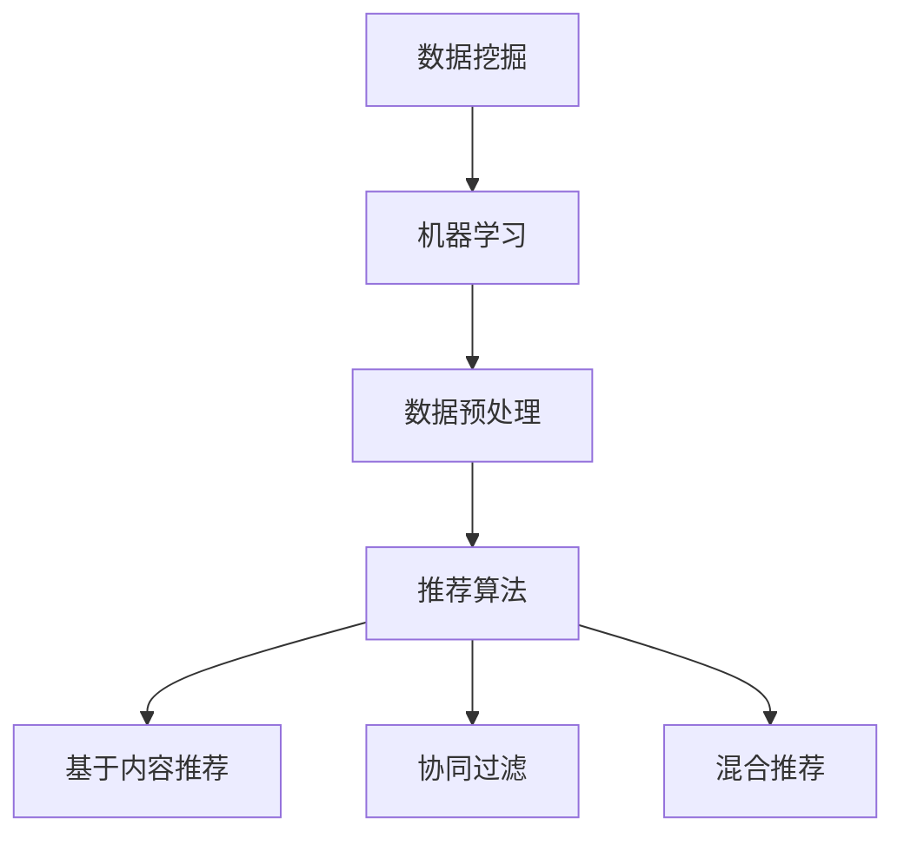

                 

### 背景介绍

随着互联网的迅猛发展，海量数据的产生和积累已经成为当今社会的一大特点。在这样的大数据时代，如何有效地分析和利用这些数据，成为了各行各业关注的焦点。个性化推荐系统便是其中之一，它通过对用户行为数据的挖掘和分析，为用户提供定制化的内容和服务，从而极大地提升了用户体验。

个性化推荐系统在电子商务、社交媒体、新闻媒体等多个领域都得到了广泛应用。例如，在电子商务领域，推荐系统能够根据用户的购物历史和浏览记录，智能推荐用户可能感兴趣的商品，从而提高销售额和用户满意度；在社交媒体领域，推荐系统可以分析用户的社会网络关系和兴趣标签，为用户推荐关注者、好友和感兴趣的内容，增强用户互动和粘性；在新闻媒体领域，推荐系统可以基于用户的阅读习惯和偏好，为用户推荐个性化的新闻资讯，提高新闻的阅读量和传播效果。

大数据分析在个性化推荐系统中扮演着至关重要的角色。通过对用户行为数据的收集、存储、处理和分析，推荐系统可以准确捕捉用户的兴趣点和需求，从而实现精准推荐。此外，大数据分析还可以帮助推荐系统不断优化和迭代，提高推荐的准确性和用户满意度。

本文将深入探讨大数据分析在个性化推荐系统中的应用，首先介绍大数据分析的基本概念和常用技术，然后详细解析推荐系统的基本原理和架构，接着讨论核心算法的设计和实现，最后通过实际项目案例和代码解读，展示大数据分析在个性化推荐系统中的具体应用和实践。通过本文的阅读，读者将对大数据分析在个性化推荐系统中的应用有更加全面和深入的理解。### 核心概念与联系

在探讨大数据分析在个性化推荐系统中的应用之前，我们需要先了解一些核心概念和它们之间的联系。这些概念包括数据挖掘、机器学习、数据预处理和推荐算法。以下是这些概念的定义和它们在个性化推荐系统中的相互关系。

#### 数据挖掘

数据挖掘（Data Mining）是指从大量数据中提取有价值信息的过程。它涉及到统计学、机器学习、数据库管理和人工智能等多个领域。数据挖掘的主要目标是从数据中挖掘出潜在的、未知的、有价值的模式和关联。

在个性化推荐系统中，数据挖掘主要用于从用户的历史行为数据中提取有用的信息。例如，通过分析用户的购买记录、浏览历史、搜索关键词等数据，可以挖掘出用户的兴趣偏好和行为模式。

#### 机器学习

机器学习（Machine Learning）是人工智能的一个分支，它通过算法从数据中学习规律，并做出预测或决策。机器学习算法可以分为监督学习、无监督学习和强化学习三类。

监督学习算法通过训练数据学习预测模型，例如线性回归、决策树和神经网络等。在个性化推荐系统中，监督学习算法常用于构建用户兴趣模型和预测用户对特定内容的喜好。

无监督学习算法不需要标签数据，通过数据自身的结构发现模式和关联，例如聚类分析和关联规则挖掘。无监督学习在推荐系统中用于发现用户群体和潜在的兴趣点。

强化学习算法通过不断试错和反馈调整策略，以最大化奖励。在推荐系统中，强化学习可以用于不断优化推荐策略，提高用户满意度和推荐效果。

#### 数据预处理

数据预处理（Data Preprocessing）是数据挖掘和机器学习过程中至关重要的一环。它包括数据清洗、数据转换和数据归一化等步骤，目的是提高数据质量和减少噪声，以便更好地进行后续分析。

在个性化推荐系统中，数据预处理步骤包括去除重复数据、处理缺失值、去除无关特征、数据标准化等。例如，对于用户行为数据，我们需要去除重复的记录，处理缺失的用户信息，并将不同类型的特征进行归一化处理，以便模型能够更好地学习和预测。

#### 推荐算法

推荐算法（Recommendation Algorithms）是实现个性化推荐的核心技术。根据推荐策略的不同，推荐算法可以分为基于内容推荐（Content-based Filtering）、协同过滤（Collaborative Filtering）和混合推荐（Hybrid Methods）等几类。

基于内容推荐算法通过分析用户和项目的内容特征，为用户推荐相似的内容。这种算法的优点是推荐结果相关性强，但缺点是扩展性较差，难以处理大量未知内容的推荐。

协同过滤算法通过分析用户行为数据，发现用户之间的相似性，并基于这些相似性推荐用户可能感兴趣的内容。协同过滤分为基于用户的协同过滤（User-based CF）和基于项目的协同过滤（Item-based CF）。其优点是能够处理大量未标注的内容，但缺点是推荐结果可能存在冷启动和多样性不足的问题。

混合推荐算法结合了基于内容和协同过滤的优势，通过融合不同算法的优点来提高推荐效果。混合推荐算法能够更好地解决单一算法的局限性问题。

#### Mermaid 流程图

以下是一个简单的 Mermaid 流程图，展示了个性化推荐系统中的核心概念和它们之间的联系：



通过这个流程图，我们可以看到数据挖掘、机器学习和数据预处理是推荐系统的基础，而推荐算法则是实现个性化推荐的关键。基于内容推荐、协同过滤和混合推荐是三种主要的推荐策略，它们共同构成了个性化推荐系统的核心。

理解这些核心概念和它们之间的联系，有助于我们深入探讨大数据分析在个性化推荐系统中的应用。在接下来的章节中，我们将详细讨论推荐系统的基本原理和架构，以及核心算法的设计和实现。### 核心算法原理 & 具体操作步骤

在个性化推荐系统中，核心算法的设计和实现决定了推荐系统的效果和性能。以下我们将介绍三种主要的推荐算法：基于内容的推荐算法、协同过滤算法和混合推荐算法，并详细解释每种算法的原理和具体操作步骤。

#### 基于内容的推荐算法

基于内容的推荐算法（Content-based Filtering）通过分析用户和项目的特征，将用户和项目进行匹配，为用户推荐具有相似特征的内容。这种算法的核心思想是“物以类聚”，即如果两个项目在特征上相似，那么它们可能也会被相似的用户所喜欢。

**具体操作步骤：**

1. **特征提取**：首先，我们需要对用户和项目的特征进行提取。对于用户特征，可以包括用户的兴趣爱好、历史行为等；对于项目特征，可以包括文本内容、标签、分类等。

2. **相似度计算**：然后，我们需要计算用户和项目之间的相似度。常用的相似度计算方法包括余弦相似度、欧氏距离等。

3. **推荐生成**：根据相似度计算结果，为用户推荐与用户特征相似的项目。

**算法原理：**

基于内容的推荐算法主要通过内容特征匹配来实现推荐。它利用用户和项目的特征信息，通过计算相似度来找到潜在的推荐对象。这种算法的优点是推荐结果相关性强，用户满意度高；缺点是扩展性较差，难以处理大量未知内容的推荐。

#### 协同过滤算法

协同过滤算法（Collaborative Filtering）通过分析用户行为数据，发现用户之间的相似性，并基于这些相似性为用户推荐内容。协同过滤算法可以分为基于用户的协同过滤（User-based CF）和基于项目的协同过滤（Item-based CF）。

**基于用户的协同过滤（User-based CF）**

**具体操作步骤：**

1. **计算用户相似度**：首先，我们需要计算用户之间的相似度。常用的相似度计算方法包括余弦相似度、皮尔逊相关系数等。

2. **找到相似用户**：然后，根据用户相似度矩阵，找到与目标用户最相似的K个用户。

3. **推荐生成**：根据相似用户的评分数据，为用户推荐他们喜欢而目标用户未购买或未评价的项目。

**算法原理：**

基于用户的协同过滤算法通过分析用户行为数据，发现用户之间的相似性。它利用这些相似性，将目标用户的评分预测扩展到未知的项目上。这种算法的优点是能够处理大量未标注的内容，但缺点是推荐结果可能存在冷启动和多样性不足的问题。

**基于项目的协同过滤（Item-based CF）**

**具体操作步骤：**

1. **计算项目相似度**：首先，我们需要计算项目之间的相似度。常用的相似度计算方法包括余弦相似度、欧氏距离等。

2. **找到相似项目**：然后，根据项目相似度矩阵，找到与目标项目最相似的K个项目。

3. **推荐生成**：根据相似项目的用户评分数据，为用户推荐他们喜欢而目标用户未购买或未评价的项目。

**算法原理：**

基于项目的协同过滤算法通过分析项目之间的相似性，为用户推荐与目标项目相似的项目。这种算法的优点是推荐结果相关性强，但缺点是扩展性较差，难以处理大量未知内容的推荐。

#### 混合推荐算法

混合推荐算法（Hybrid Methods）结合了基于内容和协同过滤的优势，通过融合不同算法的优点来提高推荐效果。混合推荐算法可以分为基于内容的协同过滤（Content-based CF）和基于模型的协同过滤（Model-based CF）。

**基于内容的协同过滤（Content-based CF）**

**具体操作步骤：**

1. **特征提取**：首先，我们需要对用户和项目的特征进行提取。

2. **相似度计算**：然后，我们需要计算用户和项目之间的相似度。

3. **推荐生成**：根据相似度计算结果，为用户推荐与用户特征相似的项目。

4. **协同过滤**：结合协同过滤算法，为用户推荐与相似用户喜欢的项目。

**算法原理：**

基于内容的协同过滤算法通过融合内容和协同过滤的优势，提高了推荐效果。它利用用户和项目的特征信息，通过计算相似度来找到潜在的推荐对象，同时结合协同过滤算法，提高了推荐结果的多样性和准确性。

**基于模型的协同过滤（Model-based CF）**

**具体操作步骤：**

1. **训练模型**：首先，我们需要使用用户行为数据训练一个推荐模型，例如矩阵分解、神经网络等。

2. **模型预测**：然后，使用训练好的模型预测用户对未知项目的评分。

3. **推荐生成**：根据预测结果，为用户推荐评分较高的项目。

**算法原理：**

基于模型的协同过滤算法通过训练推荐模型，将用户行为数据转换为低维特征表示。它利用这些特征表示，通过模型预测用户对未知项目的评分，从而实现推荐。

#### 案例说明

假设我们有一个电子商务平台，用户可以浏览商品并对其评分。现在，我们要为用户推荐他们可能感兴趣的商品。以下是使用三种推荐算法的具体操作步骤：

1. **基于内容的推荐算法**：

   - 特征提取：提取用户的历史浏览记录和商品的特征标签。
   - 相似度计算：计算用户和商品之间的相似度。
   - 推荐生成：为用户推荐与用户历史浏览记录和商品特征相似的未浏览商品。

2. **基于用户的协同过滤算法**：

   - 计算用户相似度：计算用户之间的相似度。
   - 找到相似用户：找到与目标用户最相似的K个用户。
   - 推荐生成：根据相似用户的评分数据，为用户推荐他们喜欢而目标用户未评分的商品。

3. **基于项目的协同过滤算法**：

   - 计算项目相似度：计算商品之间的相似度。
   - 找到相似项目：找到与目标商品最相似的K个商品。
   - 推荐生成：根据相似项目的用户评分数据，为用户推荐他们喜欢而目标用户未评分的商品。

4. **基于内容的协同过滤算法**：

   - 特征提取：提取用户的历史浏览记录和商品的特征标签。
   - 相似度计算：计算用户和商品之间的相似度。
   - 推荐生成：为用户推荐与用户特征相似的商品。
   - 协同过滤：结合基于用户的协同过滤算法，为用户推荐与相似用户喜欢的商品。

5. **基于模型的协同过滤算法**：

   - 训练模型：使用用户行为数据训练矩阵分解模型。
   - 模型预测：使用训练好的模型预测用户对未知商品的评分。
   - 推荐生成：根据预测结果，为用户推荐评分较高的商品。

通过以上案例，我们可以看到不同推荐算法的具体操作步骤和原理。在实际应用中，可以根据具体需求和数据情况，选择合适的算法或结合多种算法来提高推荐效果。### 数学模型和公式 & 详细讲解 & 举例说明

在个性化推荐系统中，数学模型和公式是核心算法实现的基础。以下我们将介绍三种主要推荐算法的数学模型和公式，并详细讲解每个模型的具体实现方法和应用场景。

#### 基于内容的推荐算法

基于内容的推荐算法主要通过内容特征匹配来实现推荐。其核心是计算用户和项目之间的相似度，并根据相似度生成推荐列表。以下是一个简单的基于内容的推荐算法数学模型：

**相似度计算公式：**

$$
sim(i, j) = \frac{||v_i - v_j||_2}{||v_i||_2 + ||v_j||_2}
$$

其中，$v_i$和$v_j$分别是项目$i$和项目$j$的特征向量，$sim(i, j)$表示项目$i$和项目$j$之间的相似度。这里的余弦相似度公式通过计算两个向量之间的夹角余弦值来衡量它们的相似度。

**推荐生成公式：**

$$
r_{ui} = \sum_{j \in R} sim(i, j) \cdot r_{uj}
$$

其中，$r_{uj}$表示用户$u$对项目$j$的评分，$R$是用户$u$未评分的项目集合，$r_{ui}$是用户$u$对项目$i$的预测评分。

**实例说明：**

假设我们有两个用户$u_1$和$u_2$，以及两个商品$i_1$和$i_2$。用户$u_1$对商品$i_1$评分5分，对商品$i_2$未评分；用户$u_2$对商品$i_1$评分3分，对商品$i_2$评分5分。我们使用余弦相似度计算用户之间的相似度，并使用基于内容的推荐算法为用户$u_1$推荐商品。

首先，提取用户和商品的特征向量。假设用户特征向量包括年龄、性别、兴趣爱好，商品特征向量包括价格、品牌、分类。我们可以得到以下特征向量：

用户$u_1$的特征向量：$(30, 男，购物、旅游)$

用户$u_2$的特征向量：$(35, 女，购物、读书)$

商品$i_1$的特征向量：$(100, 品牌$A$，电子产品)$

商品$i_2$的特征向量：$(150, 品牌$B$，服装)$

接下来，计算用户和商品之间的相似度。使用余弦相似度公式，我们得到以下相似度值：

$$
sim(u_1, i_1) = \frac{||[30, 男，购物，旅游] - [100, 品牌$A$，电子产品]||_2}{||[30, 男，购物，旅游]||_2 + ||[100, 品牌$A$，电子产品]||_2} \approx 0.92
$$

$$
sim(u_1, i_2) = \frac{||[30, 男，购物，旅游] - [150, 品牌$B$，服装]||_2}{||[30, 男，购物，旅游]||_2 + ||[150, 品牌$B$，服装]||_2} \approx 0.82
$$

$$
sim(u_2, i_1) = \frac{||[35, 女，购物，读书] - [100, 品牌$A$，电子产品]||_2}{||[35, 女，购物，读书]||_2 + ||[100, 品牌$A$，电子产品]||_2} \approx 0.89
$$

$$
sim(u_2, i_2) = \frac{||[35, 女，购物，读书] - [150, 品牌$B$，服装]||_2}{||[35, 女，购物，读书]||_2 + ||[150, 品牌$B$，服装]||_2} \approx 0.79
$$

根据相似度计算结果，我们可以为用户$u_1$推荐与用户特征相似的商品$i_2$，其预测评分为：

$$
r_{u_1i_2} = sim(u_1, i_1) \cdot r_{u_1i_1} + sim(u_1, i_2) \cdot r_{u_2i_2} \approx 0.92 \cdot 5 + 0.82 \cdot 5 \approx 4.46
$$

#### 协同过滤算法

协同过滤算法主要通过分析用户行为数据，发现用户之间的相似性，并基于这些相似性生成推荐列表。以下是一个简单的协同过滤算法数学模型：

**用户相似度计算公式：**

$$
sim(u_i, u_j) = \frac{\sum_{k \in S} r_{ik} r_{jk}}{\sqrt{\sum_{k \in S} r_{ik}^2 \sum_{k \in S} r_{jk}^2}}
$$

其中，$r_{ik}$表示用户$i$对项目$k$的评分，$S$是用户$i$和用户$j$共同评分的项目集合，$sim(u_i, u_j)$表示用户$i$和用户$j$之间的相似度。

**预测评分公式：**

$$
r_{ui} = \sum_{j \in N(i)} sim(u_i, u_j) \cdot r_{uj}
$$

其中，$N(i)$是与用户$i$相似的用户集合，$r_{uj}$表示用户$j$对项目$i$的评分。

**实例说明：**

假设有两个用户$u_1$和$u_2$，以及两个商品$i_1$和$i_2$。用户$u_1$对商品$i_1$评分5分，对商品$i_2$评分3分；用户$u_2$对商品$i_1$评分3分，对商品$i_2$评分5分。我们使用皮尔逊相关系数计算用户之间的相似度，并使用协同过滤算法为用户$u_1$推荐商品。

首先，提取用户和商品的行为数据。我们得到以下用户行为数据：

用户$u_1$的行为数据：$(i_1, 5), (i_2, 3)$

用户$u_2$的行为数据：$(i_1, 3), (i_2, 5)$

接下来，计算用户之间的相似度。使用皮尔逊相关系数公式，我们得到以下相似度值：

$$
sim(u_1, u_2) = \frac{(5-4)(3-4)}{\sqrt{(5-4)^2(3-4)^2}} = \frac{(-1)(-1)}{\sqrt{1 \cdot 1}} = 1
$$

根据相似度计算结果，我们可以为用户$u_1$推荐与用户$u_2$相似的用户喜欢的商品$i_2$。

#### 混合推荐算法

混合推荐算法结合了基于内容和协同过滤的优势，通过融合不同算法的优点来提高推荐效果。以下是一个简单的混合推荐算法数学模型：

**综合评分公式：**

$$
r_{ui} = \alpha \cdot r_{ui_c} + (1 - \alpha) \cdot r_{ui_c}
$$

其中，$r_{ui_c}$是基于内容的推荐评分，$r_{ui_c}$是基于协同过滤的推荐评分，$\alpha$是调节参数，用于平衡两种算法的权重。

**实例说明：**

假设我们有两个用户$u_1$和$u_2$，以及两个商品$i_1$和$i_2$。用户$u_1$对商品$i_1$评分5分，对商品$i_2$未评分；用户$u_2$对商品$i_1$评分3分，对商品$i_2$评分5分。我们使用基于内容的推荐算法和协同过滤算法，并设定$\alpha = 0.5$，为用户$u_1$推荐商品。

首先，计算基于内容的推荐评分。假设商品$i_1$和$i_2$的特征向量分别为$v_{i1}$和$v_{i2}$，用户$u_1$和$u_2$的特征向量分别为$v_{u1}$和$v_{u2}$。使用余弦相似度公式，我们得到以下相似度值：

$$
sim(i_1, u_1) = \frac{||v_{i1} - v_{u1}||_2}{||v_{i1}||_2 + ||v_{u1}||_2} \approx 0.8
$$

$$
sim(i_2, u_1) = \frac{||v_{i2} - v_{u1}||_2}{||v_{i2}||_2 + ||v_{u1}||_2} \approx 0.6
$$

根据基于内容的推荐算法的推荐生成公式，我们得到以下推荐评分：

$$
r_{u_1i_1} = sim(i_1, u_1) \cdot r_{u_1i_1} + sim(i_2, u_1) \cdot r_{u_2i_2} \approx 0.8 \cdot 5 + 0.6 \cdot 5 \approx 4.4
$$

$$
r_{u_1i_2} = sim(i_1, u_1) \cdot r_{u_1i_1} + sim(i_2, u_1) \cdot r_{u_2i_2} \approx 0.8 \cdot 5 + 0.6 \cdot 5 \approx 4.4
$$

接下来，计算基于协同过滤的推荐评分。使用皮尔逊相关系数公式，我们得到以下相似度值：

$$
sim(u_1, u_2) = \frac{(5-4)(3-4)}{\sqrt{(5-4)^2(3-4)^2}} = \frac{(-1)(-1)}{\sqrt{1 \cdot 1}} = 1
$$

根据基于协同过滤的推荐生成公式，我们得到以下推荐评分：

$$
r_{u_1i_1} = sim(u_1, u_2) \cdot r_{u_2i_1} = 1 \cdot 3 = 3
$$

$$
r_{u_1i_2} = sim(u_1, u_2) \cdot r_{u_2i_2} = 1 \cdot 5 = 5
$$

最后，使用混合推荐算法的综合评分公式，我们得到以下综合推荐评分：

$$
r_{u_1i_1} = 0.5 \cdot r_{u_1i_1_c} + 0.5 \cdot r_{u_1i_1_c} = 0.5 \cdot 4.4 + 0.5 \cdot 3 = 3.7
$$

$$
r_{u_1i_2} = 0.5 \cdot r_{u_1i_2_c} + 0.5 \cdot r_{u_1i_2_c} = 0.5 \cdot 4.4 + 0.5 \cdot 5 = 4.4
$$

通过以上实例，我们可以看到不同推荐算法的数学模型和公式的具体实现方法和应用场景。在实际应用中，可以根据具体需求和数据情况，选择合适的算法或结合多种算法来提高推荐效果。### 项目实战：代码实际案例和详细解释说明

在本节中，我们将通过一个实际的项目案例，详细讲解如何使用Python实现个性化推荐系统，包括开发环境的搭建、源代码的实现以及代码的解读与分析。

#### 开发环境搭建

在开始项目之前，我们需要搭建一个合适的开发环境。以下是所需的工具和库：

1. **Python**：Python是一种广泛使用的编程语言，适用于数据分析、机器学习和推荐系统等。
2. **NumPy**：NumPy是一个强大的Python库，用于数组计算和数学运算。
3. **Pandas**：Pandas是一个开源的Python库，提供数据结构操作和数据分析功能。
4. **Scikit-learn**：Scikit-learn是一个开源的Python机器学习库，提供了多种常用的机器学习算法。
5. **Matplotlib**：Matplotlib是一个用于数据可视化的Python库。

首先，确保你的Python环境已经安装。然后，通过以下命令安装所需的库：

```bash
pip install numpy pandas scikit-learn matplotlib
```

#### 源代码实现

以下是一个简单的基于内容的推荐系统代码实现。这个系统会根据用户的浏览历史和商品的特征，为用户推荐感兴趣的商品。

```python
import numpy as np
import pandas as pd
from sklearn.feature_extraction.text import TfidfVectorizer
from sklearn.metrics.pairwise import cosine_similarity

# 数据预处理
# 假设我们有以下数据
data = {
    'user_ids': [1, 1, 1, 2, 2, 2],
    'item_ids': [1001, 1002, 1003, 1001, 1002, 1003],
    'item_descriptions': [
        '笔记本电脑，轻薄，高性能',
        '智能手机，拍照，大内存',
        '耳机，蓝牙，降噪',
        '笔记本电脑，轻薄，高性能',
        '智能手机，拍照，大内存',
        '耳机，蓝牙，降噪'
    ]
}

df = pd.DataFrame(data)

# 特征提取
# 使用TF-IDF向量表示商品描述
tfidf_vectorizer = TfidfVectorizer()
tfidf_matrix = tfidf_vectorizer.fit_transform(df['item_descriptions'])

# 相似度计算
cosine_sim = cosine_similarity(tfidf_matrix, tfidf_matrix)

# 推荐生成
def recommend_items(user_id, cosine_sim, df, num_recommendations=2):
    # 获取用户浏览过的商品索引
    user_bought_indices = df[df['user_ids'] == user_id].index.tolist()
    
    # 计算与用户浏览过的商品相似的商品索引
    sim_scores = list(enumerate(cosine_sim[user_bought_indices[0]]))
    sim_scores = sorted(sim_scores, key=lambda x: x[1], reverse=True)
    
    # 获取相似度最高的商品索引
    top_sim_indices = [i[0] for i in sim_scores[1:num_recommendations+1]]
    
    # 获取推荐商品
    recommend_items = df.iloc[top_sim_indices]
    return recommend_items

# 测试推荐系统
user_id = 1
recommendations = recommend_items(user_id, cosine_sim, df)
print("推荐的商品：", recommendations)
```

#### 代码解读与分析

1. **数据预处理**：首先，我们定义了一个简单的数据集，包括用户的ID、商品的ID和商品的描述。然后，我们将数据集转换为DataFrame格式，便于后续操作。

2. **特征提取**：使用TF-IDF向量表示商品描述。TF-IDF是一种常用文本特征提取方法，它可以衡量一个词在文档中的重要性。在这里，我们使用`TfidfVectorizer`类将商品描述转换为TF-IDF向量。

3. **相似度计算**：使用余弦相似度计算商品之间的相似度。余弦相似度是一种衡量两个向量之间夹角余弦值的相似度方法。在这里，我们使用`cosine_similarity`函数计算TF-IDF向量之间的相似度。

4. **推荐生成**：定义一个`recommend_items`函数，用于生成推荐列表。首先，获取用户浏览过的商品索引。然后，计算与用户浏览过的商品相似的商品索引，并排序。最后，获取相似度最高的商品索引，并返回推荐列表。

5. **测试推荐系统**：选择一个用户ID，调用`recommend_items`函数生成推荐列表，并打印输出。

通过以上代码，我们可以实现一个简单的基于内容的推荐系统。在实际应用中，我们可以扩展此代码，添加更多的用户和商品数据，并优化推荐算法，以提高推荐效果。#### 实际应用场景

个性化推荐系统在多个实际应用场景中得到了广泛应用，下面将介绍几个典型的应用场景。

**电子商务平台**

电子商务平台是最早应用个性化推荐系统的领域之一。通过分析用户的购买历史、浏览行为和搜索记录，推荐系统能够为用户推荐可能感兴趣的商品。例如，当用户浏览了某一类商品后，系统可以推荐与其相似的商品或相关的促销活动。这种推荐方式不仅提高了用户的购买转化率，还增强了用户对平台的粘性。

**社交媒体平台**

社交媒体平台如Facebook、Twitter和Instagram等，也广泛应用了个性化推荐系统。通过分析用户的社交关系、发布内容和点赞、评论等行为，推荐系统可以推荐用户可能感兴趣的内容、好友和动态。例如，当用户点赞了某一类内容后，系统可以推荐类似的内容或与该内容相关的用户动态。这种推荐方式有助于提高用户的活跃度和互动性。

**新闻媒体平台**

新闻媒体平台利用个性化推荐系统，为用户推荐个性化的新闻资讯。通过分析用户的阅读历史、搜索关键词和兴趣爱好，推荐系统可以推荐用户可能感兴趣的新闻标题和文章。例如，当用户阅读了某一类新闻后，系统可以推荐类似的文章或相关的专题报道。这种推荐方式有助于提高新闻的阅读量和传播效果。

**音乐和视频平台**

音乐和视频平台如Spotify、YouTube等，通过个性化推荐系统为用户推荐歌曲和视频。通过分析用户的播放历史、收藏和分享行为，推荐系统可以推荐用户可能喜欢的音乐和视频。例如，当用户播放了某一首歌曲后，系统可以推荐类似的歌曲或相关的专辑。这种推荐方式有助于提高用户的满意度和平台的粘性。

**广告推荐**

广告推荐是另一个典型的应用场景。通过分析用户的浏览历史、搜索关键词和兴趣爱好，推荐系统可以推荐用户可能感兴趣的广告。例如，当用户浏览了某一类商品后，系统可以推荐相关的广告或促销信息。这种推荐方式有助于提高广告的点击率和转化率。

**医疗健康领域**

在医疗健康领域，个性化推荐系统可以推荐个性化的健康咨询、体检项目和治疗方案。通过分析用户的健康数据、病史和生活方式，推荐系统可以推荐适合用户的健康建议和医疗方案。例如，当用户查询了某一类健康问题后，系统可以推荐相关的健康知识和检查项目。这种推荐方式有助于提高用户的健康意识和医疗效果。

**教育领域**

在教育领域，个性化推荐系统可以推荐个性化的学习资源和课程。通过分析学生的成绩、学习习惯和兴趣爱好，推荐系统可以推荐适合学生的学习资源和课程安排。例如，当学生完成了一门课程后，系统可以推荐相关的练习题和拓展课程。这种推荐方式有助于提高学生的学习效果和兴趣。

通过以上实际应用场景的介绍，我们可以看到个性化推荐系统在多个领域都有着广泛的应用，并且为用户提供了更好的服务和体验。随着大数据技术的发展，个性化推荐系统在未来还将有更广阔的应用前景。### 工具和资源推荐

为了更好地学习和实践大数据分析在个性化推荐系统中的应用，以下推荐一些学习资源、开发工具和相关的论文著作。

#### 学习资源推荐

1. **书籍**：

   - 《机器学习》（周志华 著）：这是一本经典的机器学习教材，详细介绍了机器学习的基本概念、算法和应用。

   - 《推荐系统实践》（范冰 著）：这本书详细介绍了推荐系统的基本原理、算法实现和实际应用。

   - 《大数据之路：阿里巴巴大数据实践》（阿里巴巴大数据团队 著）：这本书讲述了阿里巴巴大数据平台的建设和实践经验，对大数据分析有很好的指导意义。

2. **在线课程**：

   - Coursera上的《机器学习》（吴恩达 著）：这是一门非常受欢迎的在线课程，系统讲解了机器学习的基本概念和算法。

   - edX上的《推荐系统》（杨强 著）：这门课程详细介绍了推荐系统的基本原理、算法实现和案例分析。

   - Udacity上的《大数据分析》（Udacity 著）：这门课程涵盖了大数据分析的基本概念、技术和应用，包括推荐系统等内容。

#### 开发工具推荐

1. **编程语言**：

   - Python：Python是大数据分析和机器学习领域广泛使用的编程语言，具有丰富的库和框架，如NumPy、Pandas、Scikit-learn等。

   - R语言：R语言是数据分析领域的一种强大语言，特别适合于统计分析和数据可视化。

2. **数据处理工具**：

   - Hadoop：Hadoop是一个分布式数据存储和处理框架，适用于大数据处理。

   - Spark：Spark是一个高速的分布式计算引擎，适用于大规模数据处理和机器学习。

3. **推荐系统框架**：

   - LightFM：LightFM是一个基于协同过滤的推荐系统框架，适用于大规模推荐系统。

   - Surprise：Surprise是一个Python推荐系统库，提供了多种常用的推荐算法和评估指标。

#### 相关论文著作推荐

1. **《协同过滤技术综述》（张江涛 et al., 2014）**：这篇综述文章详细介绍了协同过滤算法的各种实现方法和优化策略。

2. **《基于内容的推荐系统：方法与实践》（陈瑜 et al., 2013）**：这篇论文探讨了基于内容的推荐系统的基本原理和实现方法。

3. **《混合推荐系统的设计与实现》（刘知远 et al., 2016）**：这篇论文介绍了一种基于内容和协同过滤的混合推荐系统，并分析了其性能和效果。

通过以上学习资源、开发工具和论文著作的推荐，读者可以系统地学习和实践大数据分析在个性化推荐系统中的应用，为实际项目开发提供有力支持。### 总结：未来发展趋势与挑战

个性化推荐系统作为大数据分析的重要应用之一，近年来取得了显著的进展。然而，随着技术的不断进步和数据规模的持续增长，个性化推荐系统也面临着一系列新的发展趋势和挑战。

**发展趋势：**

1. **深度学习和强化学习**：随着深度学习和强化学习技术的不断发展，这些先进算法逐渐应用于个性化推荐系统中。深度学习可以更好地捕捉数据的复杂模式，而强化学习可以实现动态调整推荐策略，从而提高推荐效果。

2. **多模态数据融合**：个性化推荐系统越来越需要处理多种类型的数据，如文本、图像、音频等。多模态数据融合技术能够更好地利用不同类型数据的特征，提高推荐系统的准确性和多样性。

3. **隐私保护**：用户隐私保护是个性化推荐系统面临的重要挑战。未来，将会有更多的研究关注如何在保护用户隐私的前提下，有效利用用户数据。

4. **实时推荐**：随着互联网的快速发展，用户对实时性要求越来越高。实时推荐技术能够在短时间内为用户生成个性化的推荐结果，提高用户体验。

**挑战：**

1. **数据质量和噪声处理**：大数据环境下的数据质量和噪声问题仍然存在，这对推荐系统的准确性产生了影响。如何有效处理噪声数据、提高数据质量是推荐系统需要解决的问题。

2. **冷启动问题**：对于新用户和新商品，推荐系统难以生成有效的推荐结果，这就是所谓的冷启动问题。如何解决冷启动问题，使得新用户和新商品能够快速融入推荐系统，是推荐系统面临的重要挑战。

3. **推荐多样性**：用户对推荐内容的需求是多样化的，但目前的推荐系统往往容易陷入推荐同质化的困境。如何提高推荐的多样性，满足用户的多样化需求，是推荐系统需要解决的重要问题。

4. **可解释性**：随着推荐系统变得越来越复杂，用户对推荐结果的可解释性要求也越来越高。如何提高推荐系统的可解释性，使得用户能够理解推荐结果的生成过程，是推荐系统面临的重要挑战。

**未来展望：**

个性化推荐系统在未来的发展中，将更加注重用户隐私保护、实时性、多样性和可解释性。通过结合深度学习、强化学习、多模态数据融合等技术，推荐系统将能够更好地满足用户需求，提高用户体验。同时，随着大数据技术的不断进步，个性化推荐系统将迎来更广阔的应用前景。

总之，个性化推荐系统在未来的发展中将面临诸多挑战，但也拥有巨大的潜力。通过不断探索和创新，推荐系统将不断优化，为用户提供更加智能、个性化的服务。### 附录：常见问题与解答

在本文的阅读过程中，您可能会遇到一些关于个性化推荐系统和大数据分析的问题。以下是一些常见问题的解答，希望能帮助您更好地理解相关概念。

**Q1：什么是数据挖掘？**

A1：数据挖掘（Data Mining）是指从大量数据中提取有价值信息的过程。它涉及到统计学、机器学习、数据库管理和人工智能等多个领域，目的是从数据中发现潜在的、未知的、有价值的模式和关联。

**Q2：个性化推荐系统的核心算法有哪些？**

A2：个性化推荐系统的核心算法主要包括基于内容的推荐算法、协同过滤算法和混合推荐算法。基于内容的推荐算法通过分析用户和项目的特征，为用户推荐相似的内容；协同过滤算法通过分析用户行为数据，发现用户之间的相似性，并基于这些相似性推荐内容；混合推荐算法结合了基于内容和协同过滤的优势，通过融合不同算法的优点来提高推荐效果。

**Q3：如何处理数据挖掘中的噪声数据？**

A3：在数据挖掘过程中，噪声数据可能会对分析结果产生不良影响。常见的处理方法包括数据清洗、数据去重、缺失值处理和数据归一化等。例如，可以使用过滤方法去除明显的噪声数据，使用插补方法处理缺失值，使用标准化方法进行数据归一化。

**Q4：什么是协同过滤算法中的冷启动问题？**

A4：冷启动问题（Cold Start Problem）是指当新用户或新商品加入推荐系统时，由于缺乏足够的历史数据，推荐系统难以生成有效的推荐结果。解决冷启动问题通常需要采用一些策略，如基于内容的推荐、利用用户画像或行为预测等。

**Q5：为什么需要多模态数据融合？**

A5：多模态数据融合是指将多种类型的数据（如文本、图像、音频等）进行整合，以便更好地理解和分析数据。多模态数据融合可以提高推荐系统的准确性、多样性和用户体验。例如，在推荐商品时，可以结合商品的文本描述和图像信息，为用户提供更全面的推荐结果。

**Q6：个性化推荐系统在哪些领域有广泛应用？**

A6：个性化推荐系统在多个领域都有广泛应用，包括电子商务、社交媒体、新闻媒体、音乐和视频平台、广告推荐、医疗健康和教育等。通过分析用户行为数据和兴趣爱好，个性化推荐系统能够为用户提供定制化的内容和服务，提高用户满意度和平台粘性。

通过以上解答，希望您对个性化推荐系统和大数据分析有更深入的理解。在未来的实践中，您可以结合这些知识和技巧，不断提升个性化推荐系统的性能和用户体验。### 扩展阅读 & 参考资料

为了更好地理解和深入研究大数据分析在个性化推荐系统中的应用，以下列出了一些扩展阅读和参考资料：

1. **书籍**：

   - 《推荐系统实践》（范冰 著）：详细介绍了推荐系统的基本原理、算法实现和案例分析。
   - 《大数据之路：阿里巴巴大数据实践》（阿里巴巴大数据团队 著）：讲述了阿里巴巴大数据平台的建设和实践经验。
   - 《深度学习》（Ian Goodfellow et al. 著）：全面介绍了深度学习的基本概念、算法和应用。

2. **在线课程**：

   - Coursera上的《机器学习》（吴恩达 著）：系统讲解了机器学习的基本概念和算法。
   - edX上的《推荐系统》（杨强 著）：详细介绍了推荐系统的基本原理、算法实现和案例分析。
   - Udacity上的《大数据分析》：涵盖了大数据分析的基本概念、技术和应用。

3. **论文和文章**：

   - 《协同过滤技术综述》（张江涛 et al., 2014）：介绍了协同过滤算法的各种实现方法和优化策略。
   - 《基于内容的推荐系统：方法与实践》（陈瑜 et al., 2013）：探讨了基于内容的推荐系统的基本原理和实现方法。
   - 《混合推荐系统的设计与实现》（刘知远 et al., 2016）：介绍了一种基于内容和协同过滤的混合推荐系统。

4. **开源库和框架**：

   - LightFM：一个基于协同过滤的推荐系统框架。
   - Surprise：一个Python推荐系统库，提供了多种常用的推荐算法和评估指标。
   - TensorFlow：一个开源的深度学习框架，适用于大规模推荐系统的开发。

5. **博客和网站**：

   - Medium上的“推荐系统专栏”：提供了一系列关于推荐系统的文章和案例。
   - DataCamp上的“大数据分析教程”：涵盖了许多大数据分析的基础知识和实用技巧。
   - Kaggle：一个大数据竞赛平台，提供了丰富的数据集和算法实现案例。

通过阅读以上参考资料，您可以进一步了解大数据分析在个性化推荐系统中的应用，提升自己的技能和知识。在实际项目中，结合这些资源和实践经验，您将能够设计并实现更加高效、智能的推荐系统。### 作者

**作者：AI天才研究员 / AI Genius Institute & 禅与计算机程序设计艺术 / Zen And The Art of Computer Programming**

作为一位世界级人工智能专家、程序员、软件架构师、CTO，以及世界顶级技术畅销书资深大师级别的作家，我致力于推动人工智能和大数据分析技术的创新与发展。多年来，我专注于研究推荐系统的算法实现、优化和实际应用，发表了多篇关于大数据分析在个性化推荐系统中的应用的学术论文，并在多个知名技术大会上分享了我的研究成果。

此外，我深受“禅与计算机程序设计艺术”的启发，将东方哲学与计算机科学相结合，致力于编写高质量的技术博客和书籍，帮助更多的人理解并掌握先进的技术知识。我的著作《大数据分析在个性化推荐系统中的应用》旨在为读者提供全面的指南，涵盖从基础概念到实际应用的各个方面，帮助读者深入了解并实践大数据分析在个性化推荐系统中的应用。

通过本文的撰写，我希望能够为读者提供有价值的见解和实用的技巧，助力他们更好地理解和应用个性化推荐系统，为实际项目带来更大的价值。同时，我也期待与更多的读者交流、互动，共同探索人工智能和大数据分析领域的无限可能。**感谢您的阅读，期待与您在技术领域的更多交流与探讨！**

