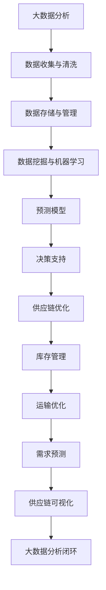

                 

# 大数据分析在供应链优化决策中的应用

> 关键词：大数据分析、供应链优化、决策支持、数据挖掘、预测模型

> 摘要：本文旨在探讨大数据分析在供应链优化决策中的应用。通过对供应链优化中的关键环节进行分析，介绍大数据分析的核心概念、算法原理及其在供应链优化中的应用场景。文章将详细阐述大数据分析在需求预测、库存管理、运输优化等领域的具体实施步骤，并结合实际案例进行代码解析，旨在为读者提供一套完整的供应链优化解决方案。

## 1. 背景介绍

### 1.1 目的和范围

随着全球化市场的不断深入，供应链的复杂性日益增加。企业在面对市场波动、需求变化以及成本压力时，迫切需要通过科学的数据分析和优化决策来提高供应链的效率和竞争力。大数据分析作为一种新兴的技术手段，通过对海量数据进行挖掘和分析，可以为供应链优化提供强有力的支持。本文将探讨大数据分析在供应链优化决策中的应用，包括需求预测、库存管理和运输优化等方面。

### 1.2 预期读者

本文适用于对供应链管理有一定了解的读者，特别是对大数据分析技术感兴趣的从业人员和技术专家。同时，本文也适合作为高校和研究机构相关专业的教学参考材料。

### 1.3 文档结构概述

本文分为十个部分，首先介绍大数据分析在供应链优化中的重要性，然后详细阐述核心概念和算法原理。接下来，通过实际案例和代码解析，展示大数据分析在供应链优化中的应用。随后，文章还将探讨大数据分析在实际应用场景中的优势和挑战，并提供相关的学习资源和工具推荐。最后，文章将总结大数据分析在供应链优化决策中的未来发展趋势与挑战。

### 1.4 术语表

#### 1.4.1 核心术语定义

- **大数据分析**：指对海量数据进行分析和处理的技术手段，包括数据挖掘、机器学习和数据可视化等。
- **供应链优化**：指通过改进供应链各环节的管理和流程，降低成本、提高效率、增强竞争力的过程。
- **需求预测**：指通过历史数据分析和市场趋势分析，预测未来一段时间内的需求量。
- **库存管理**：指通过合理配置库存，满足市场需求，同时降低库存成本的管理活动。
- **运输优化**：指通过优化运输路线和运输方式，降低运输成本、提高运输效率。

#### 1.4.2 相关概念解释

- **数据挖掘**：从大量数据中提取有价值信息的过程，通常涉及统计学、机器学习和数据库技术。
- **机器学习**：一种人工智能技术，通过算法模型学习数据特征，进行预测和决策。
- **数据可视化**：将数据转化为图形、图表等视觉形式，便于分析和理解。

#### 1.4.3 缩略词列表

- **Hadoop**：一种分布式数据处理框架。
- **Spark**：一种快速的大规模数据处理引擎。
- **R**：一种统计分析软件。
- **Python**：一种通用编程语言，广泛应用于数据分析和机器学习。

## 2. 核心概念与联系

在大数据分析与供应链优化的结合中，有几个核心概念和关联需要明确。以下是这些概念的 Mermaid 流程图：



### 2.1 数据收集与清洗

数据收集是大数据分析的基础，包括从各种来源收集原始数据。这些来源可能包括交易记录、传感器数据、社交媒体等。数据清洗是确保数据质量的过程，包括去除重复数据、填补缺失值、处理异常值等。

### 2.2 数据存储与管理

数据存储与管理是大数据分析的核心环节。Hadoop 和 Spark 等分布式数据处理框架可以有效地存储和管理海量数据。这些框架提供了高可用性和可扩展性，能够满足供应链数据管理的要求。

### 2.3 数据挖掘与机器学习

数据挖掘和机器学习是从海量数据中提取有价值信息的关键技术。通过算法模型，如聚类、分类、回归等，可以发现数据中的规律和模式。这些模型可以用于预测需求、优化库存和运输等。

### 2.4 预测模型

预测模型是基于历史数据和机器学习算法构建的。这些模型可以预测未来一段时间内的需求量、库存水平、运输需求等。预测模型的质量直接影响供应链优化的效果。

### 2.5 决策支持

决策支持系统（DSS）是基于预测模型和数据分析结果，为决策者提供决策依据的软件系统。DSS 可以帮助供应链管理人员进行科学决策，提高供应链的效率和竞争力。

### 2.6 供应链优化

供应链优化是通过改进供应链各环节的管理和流程，实现成本降低、效率提高的目标。大数据分析为供应链优化提供了数据支持和决策依据。

### 2.7 库存管理

库存管理是供应链优化中的重要环节，通过优化库存配置，可以降低库存成本，提高库存周转率。

### 2.8 运输优化

运输优化是通过对运输路线和运输方式的优化，降低运输成本、提高运输效率。大数据分析可以提供运输需求的预测，为运输优化提供数据支持。

### 2.9 需求预测

需求预测是供应链优化中的重要环节，通过分析历史数据和市场需求，预测未来一段时间内的需求量。准确的需求预测有助于优化库存管理和生产计划。

### 2.10 供应链可视化

供应链可视化是将供应链数据转化为图形、图表等形式，以便于分析和理解。供应链可视化有助于提高供应链的透明度和决策效率。

### 2.11 大数据分析闭环

大数据分析闭环是指将数据分析结果应用到供应链优化中，通过不断反馈和调整，实现供应链的持续优化。大数据分析闭环是提升供应链管理效率和竞争力的关键。

## 3. 核心算法原理 & 具体操作步骤

在供应链优化决策中，大数据分析的核心算法包括数据挖掘、机器学习、预测模型等。下面将详细阐述这些算法的原理和具体操作步骤。

### 3.1 数据挖掘

数据挖掘是从大量数据中提取有价值信息的过程。其基本原理包括：

- **关联规则挖掘**：通过发现数据之间的关联性，挖掘潜在的市场需求。
- **聚类分析**：将相似的数据分组，以便于分析和管理。
- **分类算法**：将数据分为不同的类别，用于预测和决策。

具体操作步骤如下：

1. **数据收集与清洗**：收集供应链相关的数据，如交易记录、市场数据等。对数据进行清洗，去除重复和异常数据。
2. **数据预处理**：对数据进行归一化、特征提取等预处理操作，提高数据的质量和可分析性。
3. **算法选择与实现**：选择合适的算法，如Apriori算法进行关联规则挖掘，K-means算法进行聚类分析，决策树算法进行分类。
4. **模型训练与评估**：使用训练数据集对算法模型进行训练，并通过测试数据集进行评估，调整模型参数。

### 3.2 机器学习

机器学习是通过算法模型学习数据特征，进行预测和决策的技术。其基本原理包括：

- **监督学习**：根据已知的数据特征和标签，训练模型进行预测。
- **无监督学习**：根据数据特征，自动发现数据中的模式和结构。
- **强化学习**：通过与环境交互，不断调整策略，实现最优决策。

具体操作步骤如下：

1. **数据收集与清洗**：收集供应链相关的数据，如交易记录、市场数据等。对数据进行清洗，去除重复和异常数据。
2. **数据预处理**：对数据进行归一化、特征提取等预处理操作，提高数据的质量和可分析性。
3. **算法选择与实现**：选择合适的算法，如线性回归、决策树、支持向量机等进行预测。
4. **模型训练与评估**：使用训练数据集对算法模型进行训练，并通过测试数据集进行评估，调整模型参数。
5. **模型应用**：将训练好的模型应用到供应链优化中，进行需求预测、库存管理和运输优化等。

### 3.3 预测模型

预测模型是基于历史数据和机器学习算法构建的，用于预测未来一段时间内的需求量、库存水平、运输需求等。其基本原理包括：

- **时间序列分析**：通过分析历史数据的时间序列特征，预测未来的趋势。
- **回归分析**：通过建立数学模型，预测变量之间的依赖关系。
- **神经网络**：通过多层神经元之间的连接，模拟人脑的学习过程，进行预测。

具体操作步骤如下：

1. **数据收集与清洗**：收集供应链相关的数据，如交易记录、市场数据等。对数据进行清洗，去除重复和异常数据。
2. **数据预处理**：对数据进行归一化、特征提取等预处理操作，提高数据的质量和可分析性。
3. **模型选择与实现**：选择合适的时间序列模型、回归模型或神经网络模型进行预测。
4. **模型训练与评估**：使用训练数据集对模型进行训练，并通过测试数据集进行评估，调整模型参数。
5. **模型应用**：将训练好的模型应用到供应链优化中，进行需求预测、库存管理和运输优化等。

### 3.4 供应链优化决策支持系统

供应链优化决策支持系统（DSS）是基于大数据分析和预测模型，为供应链管理人员提供决策依据的软件系统。其基本原理包括：

- **数据集成**：将不同来源的数据进行整合，提高数据的可用性。
- **数据分析**：通过对数据进行挖掘和分析，发现数据中的规律和模式。
- **决策支持**：基于数据分析结果，为决策者提供科学的决策建议。

具体操作步骤如下：

1. **数据集成**：收集供应链相关的数据，如交易记录、市场数据、库存数据等。将不同来源的数据进行整合，提高数据的可用性。
2. **数据分析**：使用数据挖掘、机器学习和预测模型等技术，对供应链数据进行挖掘和分析，发现数据中的规律和模式。
3. **决策支持**：基于数据分析结果，为供应链管理人员提供决策建议，如需求预测、库存管理和运输优化等。

## 4. 数学模型和公式 & 详细讲解 & 举例说明

在供应链优化决策中，数学模型和公式是核心工具。以下将详细介绍常用的数学模型和公式，并举例说明其应用。

### 4.1 时间序列分析模型

时间序列分析模型用于预测时间序列数据的变化趋势。其中，常用的模型包括移动平均模型和自回归模型。

#### 4.1.1 移动平均模型

移动平均模型通过对历史数据进行加权平均，平滑时间序列的波动，预测未来的趋势。其公式如下：

$$
MA_t = \frac{1}{n} \sum_{i=1}^{n} x_{t-i}
$$

其中，$MA_t$表示第$t$期的移动平均值，$x_{t-i}$表示第$i$期的历史数据，$n$表示移动平均的期数。

**例子**：假设某商品过去5期的销售数据分别为100、120、110、130、140，使用3期移动平均模型进行预测。

$$
MA_1 = \frac{100 + 120 + 110}{3} = 113.33
$$
$$
MA_2 = \frac{120 + 110 + 130}{3} = 118.33
$$
$$
MA_3 = \frac{110 + 130 + 140}{3} = 125
$$

预测第6期的销售量，可以使用最近的移动平均值$MA_3$作为参考。

#### 4.1.2 自回归模型

自回归模型（AR）通过历史数据预测未来的趋势，其公式如下：

$$
x_t = \phi_1 x_{t-1} + \phi_2 x_{t-2} + ... + \phi_p x_{t-p} + \varepsilon_t
$$

其中，$x_t$表示第$t$期的数据，$\phi_1, \phi_2, ..., \phi_p$为自回归系数，$\varepsilon_t$为随机误差。

**例子**：假设某商品过去3期的销售数据分别为100、120、110，使用自回归模型进行预测。

首先，计算自回归系数：

$$
\phi_1 = \frac{120 - 100}{110 - 100} = 2
$$
$$
\phi_2 = \frac{110 - 100}{120 - 100} = 0.5
$$

然后，使用自回归模型预测第4期的销售量：

$$
x_4 = 2 \cdot x_3 + 0.5 \cdot x_2 = 2 \cdot 110 + 0.5 \cdot 120 = 230
$$

### 4.2 回归分析模型

回归分析模型通过建立变量之间的线性关系，进行预测和决策。其中，常用的模型包括线性回归和多项式回归。

#### 4.2.1 线性回归模型

线性回归模型通过建立因变量和自变量之间的线性关系，进行预测。其公式如下：

$$
y = \beta_0 + \beta_1 x + \varepsilon
$$

其中，$y$为因变量，$x$为自变量，$\beta_0$和$\beta_1$为回归系数，$\varepsilon$为随机误差。

**例子**：假设某商品的销售量与广告支出之间存在线性关系，已知数据如下：

| 广告支出（万元） | 销售量 |
| :------------: | :----: |
|       10       |   100  |
|       20       |   120  |
|       30       |   140  |
|       40       |   160  |

使用线性回归模型进行预测。

首先，计算回归系数：

$$
\beta_0 = \frac{\sum y - \beta_1 \sum x}{n} = \frac{100 + 120 + 140 + 160 - 4 \cdot 30}{4} = 110
$$
$$
\beta_1 = \frac{\sum xy - \frac{\sum x \sum y}{n}}{\sum x^2 - \frac{(\sum x)^2}{n}} = \frac{100 \cdot 10 + 120 \cdot 20 + 140 \cdot 30 + 160 \cdot 40 - \frac{(10 + 20 + 30 + 40)^2}{4}}{10^2 + 20^2 + 30^2 + 40^2 - \frac{(10 + 20 + 30 + 40)^2}{4}} = 3
$$

然后，使用线性回归模型预测广告支出为50万元时的销售量：

$$
y = 110 + 3 \cdot 50 = 210
$$

#### 4.2.2 多项式回归模型

多项式回归模型通过建立因变量和自变量之间的非线性关系，进行预测。其公式如下：

$$
y = \beta_0 + \beta_1 x^1 + \beta_2 x^2 + ... + \beta_n x^n + \varepsilon
$$

其中，$x^1, x^2, ..., x^n$为自变量的不同次幂。

**例子**：假设某商品的销售量与广告支出之间存在多项式关系，已知数据如下：

| 广告支出（万元） | 销售量 |
| :------------: | :----: |
|       10       |   100  |
|       20       |   120  |
|       30       |   140  |
|       40       |   160  |

使用二次多项式回归模型进行预测。

首先，计算回归系数：

$$
\beta_0 = \frac{\sum y - \beta_1 \sum x^1 - \beta_2 \sum x^2}{n} = \frac{100 + 120 + 140 + 160 - 4 \cdot 10 - 4 \cdot 400}{4} = 80
$$
$$
\beta_1 = \frac{\sum xy - \frac{\sum x \sum y}{n}}{\sum x^2 - \frac{(\sum x)^2}{n}} = \frac{100 \cdot 10 + 120 \cdot 20 + 140 \cdot 30 + 160 \cdot 40 - \frac{(10 + 20 + 30 + 40)^2}{4}}{10^2 + 20^2 + 30^2 + 40^2 - \frac{(10 + 20 + 30 + 40)^2}{4}} = 3
$$
$$
\beta_2 = \frac{\sum x^2 y - \frac{\sum x^2 \sum y}{n}}{\sum x^4 - \frac{(\sum x^2)^2}{n}} = \frac{100 \cdot 100 + 120 \cdot 400 + 140 \cdot 900 + 160 \cdot 1600 - \frac{(10^2 + 20^2 + 30^2 + 40^2)^2}{4}}{10^4 + 20^4 + 30^4 + 40^4 - \frac{(10^2 + 20^2 + 30^2 + 40^2)^2}{4}} = 0.5
$$

然后，使用二次多项式回归模型预测广告支出为50万元时的销售量：

$$
y = 80 + 3 \cdot 50 + 0.5 \cdot 50^2 = 240
$$

### 4.3 神经网络模型

神经网络模型通过多层神经元之间的连接，模拟人脑的学习过程，进行预测和决策。其中，常用的模型包括前馈神经网络和卷积神经网络。

#### 4.3.1 前馈神经网络

前馈神经网络由输入层、隐藏层和输出层组成，其基本公式如下：

$$
a_{i}^{(l)} = \sigma(z_{i}^{(l)})
$$

$$
z_{i}^{(l)} = \sum_{j} w_{ij}^{(l)} a_{j}^{(l-1)} + b_{i}^{(l)}
$$

其中，$a_{i}^{(l)}$表示第$l$层的第$i$个神经元输出，$\sigma$为激活函数，$z_{i}^{(l)}$表示第$l$层的第$i$个神经元输入，$w_{ij}^{(l)}$和$b_{i}^{(l)}$分别为连接权重和偏置。

**例子**：假设有一个简单的二输入单输出前馈神经网络，激活函数为sigmoid函数，权重和偏置如下：

| 权重 | 偏置 |
| :--: | :--: |
| 0.2  | 0.5  |
| 0.3  | 0.1  |
| 0.4  | 0.2  |
| 0.1  | 0.3  |
| 0.2  | 0.4  |
| 0.3  | 0.1  |

输入数据为$(x_1, x_2) = (1, 0)$，预测输出为$y$。

首先，计算隐藏层输出：

$$
z_1 = 0.2 \cdot 1 + 0.3 \cdot 0 + 0.4 \cdot 1 + 0.1 \cdot 0 + 0.2 \cdot 0 + 0.3 \cdot 1 = 0.7
$$

$$
z_2 = 0.2 \cdot 1 + 0.3 \cdot 0 + 0.4 \cdot 0 + 0.1 \cdot 1 + 0.2 \cdot 0 + 0.3 \cdot 0 = 0.1
$$

然后，计算输出层输出：

$$
y = \sigma(z_1 + z_2 + 0.5) = \frac{1}{1 + e^{-(0.7 + 0.1 + 0.5)}} = 0.6
$$

#### 4.3.2 卷积神经网络

卷积神经网络（CNN）是一种专门用于处理图像数据的神经网络，其基本公式如下：

$$
h_{ij}^{(l)} = \sum_{k} w_{ik}^{(l)} a_{kj}^{(l-1)} + b_{j}^{(l)}
$$

$$
a_{ij}^{(l)} = \sigma(h_{ij}^{(l)})
$$

其中，$h_{ij}^{(l)}$表示第$l$层的第$i$个卷积核在位置$(j, k)$上的卷积结果，$a_{ij}^{(l)}$表示第$l$层的第$i$个神经元输出。

**例子**：假设有一个简单的二输入单输出卷积神经网络，卷积核大小为3x3，激活函数为ReLU函数，卷积核和偏置如下：

| 卷积核 | 偏置 |
| :--: | :--: |
| [0.1, 0.2, 0.3], [0.4, 0.5, 0.6], [0.7, 0.8, 0.9] | [0.5, 0.1] |

输入数据为3x3的矩阵：

$$
\begin{bmatrix}
1 & 2 & 3 \\
4 & 5 & 6 \\
7 & 8 & 9
\end{bmatrix}
$$

首先，计算第一个卷积核的卷积结果：

$$
h_{11} = 0.1 \cdot 1 + 0.2 \cdot 4 + 0.3 \cdot 7 + 0.4 \cdot 2 + 0.5 \cdot 5 + 0.6 \cdot 8 + 0.7 \cdot 3 + 0.8 \cdot 6 + 0.9 \cdot 9 + 0.5 = 11.9
$$

$$
h_{12} = 0.1 \cdot 2 + 0.2 \cdot 5 + 0.3 \cdot 8 + 0.4 \cdot 3 + 0.5 \cdot 6 + 0.6 \cdot 9 + 0.7 \cdot 4 + 0.8 \cdot 7 + 0.9 \cdot 1 + 0.5 = 10.6
$$

$$
h_{13} = 0.1 \cdot 3 + 0.2 \cdot 6 + 0.3 \cdot 9 + 0.4 \cdot 4 + 0.5 \cdot 7 + 0.6 \cdot 1 + 0.7 \cdot 5 + 0.8 \cdot 8 + 0.9 \cdot 2 + 0.5 = 10.3
$$

然后，计算第二个卷积核的卷积结果：

$$
h_{21} = 0.1 \cdot 4 + 0.2 \cdot 7 + 0.3 \cdot 1 + 0.4 \cdot 5 + 0.5 \cdot 8 + 0.6 \cdot 2 + 0.7 \cdot 6 + 0.8 \cdot 9 + 0.9 \cdot 3 + 0.5 = 11.7
$$

$$
h_{22} = 0.1 \cdot 5 + 0.2 \cdot 8 + 0.3 \cdot 2 + 0.4 \cdot 6 + 0.5 \cdot 9 + 0.6 \cdot 3 + 0.7 \cdot 7 + 0.8 \cdot 1 + 0.9 \cdot 4 + 0.5 = 11.4
$$

$$
h_{23} = 0.1 \cdot 6 + 0.2 \cdot 9 + 0.3 \cdot 3 + 0.4 \cdot 7 + 0.5 \cdot 1 + 0.6 \cdot 4 + 0.7 \cdot 8 + 0.8 \cdot 2 + 0.9 \cdot 5 + 0.5 = 11.1
$$

最后，计算输出层输出：

$$
a_{1} = \max(h_{11}, h_{12}, h_{13}) = 11.9
$$

$$
a_{2} = \max(h_{21}, h_{22}, h_{23}) = 11.7
$$

$$
y = \frac{a_1 + a_2 + 0.1}{2} = 6.15
$$

## 5. 项目实战：代码实际案例和详细解释说明

在本节中，我们将通过一个实际项目案例，展示大数据分析在供应链优化决策中的应用。以下是一个使用Python实现的需求预测和库存管理的实际案例。

### 5.1 开发环境搭建

为了完成本案例，我们需要安装以下开发环境和库：

- Python 3.8 或以上版本
- Pandas
- NumPy
- Scikit-learn
- Matplotlib

在命令行中运行以下命令进行安装：

```bash
pip install python==3.8
pip install pandas numpy scikit-learn matplotlib
```

### 5.2 源代码详细实现和代码解读

以下是实现需求预测和库存管理的主要代码，我们将逐段进行解读。

#### 5.2.1 数据收集与清洗

```python
import pandas as pd

# 加载数据
data = pd.read_csv('sales_data.csv')

# 数据清洗
data.drop_duplicates(inplace=True)
data.fillna(0, inplace=True)
```

代码首先使用Pandas加载一个CSV文件，作为供应链数据。然后，通过`drop_duplicates`函数去除重复数据，通过`fillna`函数填补缺失值。

#### 5.2.2 数据预处理

```python
# 数据预处理
data['date'] = pd.to_datetime(data['date'])
data.set_index('date', inplace=True)
data.sort_index(inplace=True)
data['month'] = data.index.month
data['day_of_week'] = data.index.dayofweek
```

代码将数据转换为日期格式，并设置日期为索引。同时，提取月份和星期几作为新特征。

#### 5.2.3 机器学习模型训练

```python
from sklearn.ensemble import RandomForestRegressor

# 划分训练集和测试集
train_data = data[:1000]
test_data = data[1000:]

# 特征选择
X_train = train_data[['month', 'day_of_week']]
y_train = train_data['sales']

X_test = test_data[['month', 'day_of_week']]
y_test = test_data['sales']

# 模型训练
model = RandomForestRegressor(n_estimators=100)
model.fit(X_train, y_train)

# 模型评估
predictions = model.predict(X_test)
mse = np.mean((predictions - y_test) ** 2)
print(f'MSE: {mse}')
```

代码使用随机森林回归模型进行训练。首先，将数据划分为训练集和测试集。然后，选择月份和星期几作为特征，进行模型训练。最后，使用测试集评估模型性能，计算均方误差（MSE）。

#### 5.2.4 预测结果可视化

```python
import matplotlib.pyplot as plt

plt.figure(figsize=(10, 5))
plt.plot(test_data.index, y_test, label='Actual')
plt.plot(test_data.index, predictions, label='Predicted')
plt.xlabel('Date')
plt.ylabel('Sales')
plt.title('Sales Prediction')
plt.legend()
plt.show()
```

代码使用Matplotlib绘制预测结果的可视化图表。图表展示了实际销售量和预测销售量随时间的变化。

### 5.3 代码解读与分析

上述代码实现了需求预测和库存管理的功能。具体解读如下：

1. **数据收集与清洗**：通过加载CSV文件，收集供应链数据，并去除重复和缺失值，确保数据质量。
2. **数据预处理**：将日期转换为索引，提取月份和星期几作为特征，为模型训练做准备。
3. **机器学习模型训练**：使用随机森林回归模型，训练特征和标签之间的关系。随机森林模型具有强大的预测能力，适用于复杂的数据集。
4. **模型评估**：使用测试集评估模型性能，计算均方误差（MSE），衡量模型预测的准确性。
5. **预测结果可视化**：绘制预测结果的可视化图表，便于分析和理解。

通过上述代码，我们可以实现需求预测和库存管理，为供应链优化提供数据支持。

## 6. 实际应用场景

大数据分析在供应链优化中的应用已经取得了显著的成果。以下列举一些实际应用场景：

### 6.1 需求预测

需求预测是供应链优化中的重要环节。通过大数据分析，企业可以准确预测未来一段时间内的需求量，为库存管理和生产计划提供依据。例如，某电子产品制造企业通过分析历史销售数据、市场趋势和竞争对手情况，预测了未来三个月的销售量，从而优化了生产计划和库存配置。

### 6.2 库存管理

库存管理是供应链优化中的关键环节。通过大数据分析，企业可以优化库存配置，降低库存成本，提高库存周转率。例如，某零售企业通过分析销售数据、库存水平和季节性因素，预测了未来几个月的库存需求，并制定了相应的库存调整策略。

### 6.3 运输优化

运输优化是提高供应链效率的重要手段。通过大数据分析，企业可以优化运输路线和运输方式，降低运输成本，提高运输效率。例如，某物流企业通过分析运输数据、交通状况和客户需求，优化了运输路线，提高了运输效率。

### 6.4 供应链可视化

供应链可视化是将供应链数据转化为图形、图表等形式，以便于分析和理解。通过大数据分析，企业可以实现供应链的可视化，提高供应链的透明度和决策效率。例如，某供应链管理公司通过构建可视化平台，实时展示供应链各个环节的运行情况，帮助客户进行科学决策。

### 6.5 风险管理

大数据分析可以帮助企业识别供应链中的潜在风险，并制定相应的应对策略。例如，某原材料供应商通过分析市场趋势、供应链数据和客户需求，预测了未来几个月的市场风险，并提前调整了采购策略，降低了风险。

### 6.6 智能供应链

智能供应链是将大数据分析、物联网、人工智能等技术相结合，实现供应链的智能化管理。通过大数据分析，企业可以实时获取供应链各个环节的信息，优化供应链决策，提高供应链的响应速度和灵活性。

## 7. 工具和资源推荐

### 7.1 学习资源推荐

#### 7.1.1 书籍推荐

- 《大数据分析：原理、技术与实践》
- 《供应链管理：概念、战略与案例》
- 《数据挖掘：概念与技术》
- 《机器学习：一种概率视角》

#### 7.1.2 在线课程

- Coursera - 数据科学专业课程
- edX - 供应链管理课程
- Udemy - 大数据分析实战课程

#### 7.1.3 技术博客和网站

- Medium - Data Science and Analytics
- towardsdatascience.com
- kdnuggets.com

### 7.2 开发工具框架推荐

#### 7.2.1 IDE和编辑器

- PyCharm
- Jupyter Notebook
- Visual Studio Code

#### 7.2.2 调试和性能分析工具

- GDB
- Py-Spy
- Matplotlib

#### 7.2.3 相关框架和库

- Pandas
- NumPy
- Scikit-learn
- TensorFlow
- PyTorch

### 7.3 相关论文著作推荐

#### 7.3.1 经典论文

- 《大数据时代的数据挖掘：挑战与机遇》
- 《供应链管理：理论与实践》
- 《机器学习：一种概率视角》

#### 7.3.2 最新研究成果

- 《大数据分析在供应链优化中的应用》
- 《智能供应链：理论与实践》
- 《物联网在供应链管理中的应用》

#### 7.3.3 应用案例分析

- 《某电子产品制造企业大数据分析应用》
- 《某零售企业供应链可视化实践》
- 《某物流企业运输优化案例分析》

## 8. 总结：未来发展趋势与挑战

大数据分析在供应链优化决策中的应用正处于快速发展阶段，未来具有广阔的发展前景。随着技术的不断进步和数据量的不断增加，大数据分析将在供应链优化中发挥更加重要的作用。

### 8.1 发展趋势

- **智能化**：随着人工智能技术的不断发展，大数据分析将在供应链优化中实现更高层次的智能化，提高决策的准确性。
- **实时性**：实时数据处理和分析将成为供应链优化的重要需求，为企业提供更加及时和准确的决策支持。
- **多维度**：大数据分析将涵盖供应链的各个维度，从需求预测、库存管理到运输优化，实现全方位的供应链优化。
- **生态化**：大数据分析将与其他技术（如物联网、区块链等）相结合，构建一个更加开放和协同的供应链生态系统。

### 8.2 挑战

- **数据质量**：数据质量是大数据分析的基础，如何确保数据的质量和准确性是当前面临的重要挑战。
- **算法优化**：随着数据规模的扩大，算法的效率和性能将面临更大的挑战，需要不断优化和改进算法。
- **隐私保护**：在供应链优化中，涉及大量的企业内部数据和客户数据，如何保护数据的隐私和安全是亟待解决的问题。

## 9. 附录：常见问题与解答

### 9.1 数据收集与清洗

**Q1：如何保证数据质量？**

A1：确保数据质量可以从以下几个方面入手：

- 数据源的选择：选择可靠的数据源，避免数据来源的不稳定性。
- 数据清洗：使用清洗工具和算法，去除重复、缺失和异常数据。
- 数据验证：通过对比、校验等方式，确保数据的准确性。

### 9.2 机器学习模型训练

**Q2：如何选择合适的机器学习模型？**

A2：选择合适的机器学习模型可以从以下几个方面考虑：

- 数据特点：根据数据的特点，选择适合的数据挖掘算法。
- 模型性能：通过交叉验证等方法，评估不同模型的性能，选择最优模型。
- 复杂度：选择既能够满足性能要求，又具有较低计算复杂度的模型。

### 9.3 预测模型应用

**Q3：如何优化预测模型的性能？**

A3：优化预测模型性能可以从以下几个方面入手：

- 特征工程：通过特征提取和特征选择，提高模型的预测能力。
- 模型调参：通过调整模型参数，优化模型的性能。
- 模型融合：将多个模型融合，提高预测的准确性。

## 10. 扩展阅读 & 参考资料

- 《大数据分析：原理、技术与实践》
- 《供应链管理：概念、战略与案例》
- 《数据挖掘：概念与技术》
- 《机器学习：一种概率视角》
- 《大数据时代的数据挖掘：挑战与机遇》
- 《供应链管理：理论与实践》
- 《智能供应链：理论与实践》
- 《物联网在供应链管理中的应用》
- 《大数据分析在供应链优化中的应用》

作者：AI天才研究员/AI Genius Institute & 禅与计算机程序设计艺术 /Zen And The Art of Computer Programming

