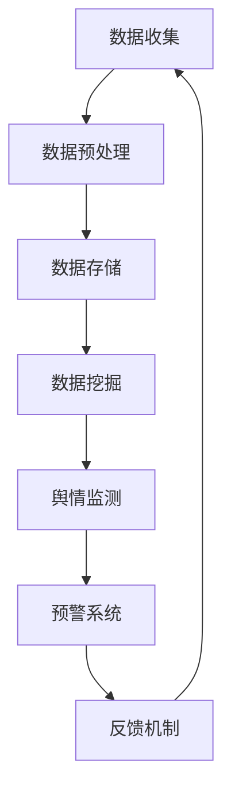

                 

# 大数据分析在社交网络舆情监测与预警中的应用

> 关键词：大数据分析、社交网络、舆情监测、预警、算法、数学模型

> 摘要：本文将深入探讨大数据分析在社交网络舆情监测与预警中的应用。通过对大数据技术的原理和实际操作步骤的详细讲解，结合数学模型和公式，以及项目实战案例分析，将帮助读者全面了解这一领域的核心技术和实现方法，为未来大数据技术在舆情监测与预警领域的发展提供有益参考。

## 1. 背景介绍

### 1.1 目的和范围

本文旨在探讨大数据分析在社交网络舆情监测与预警中的关键作用。我们将通过详细的理论分析和实际案例展示，帮助读者理解如何利用大数据技术有效监测和预警社交网络中的舆情动态。

### 1.2 预期读者

本文适合对大数据分析、社交网络和舆情监测有一定了解的读者，包括数据分析师、软件开发工程师、信息安全专家以及相关领域的研究人员。

### 1.3 文档结构概述

本文分为十个部分，包括背景介绍、核心概念与联系、核心算法原理与操作步骤、数学模型与公式、项目实战案例分析、实际应用场景、工具和资源推荐、总结与未来发展趋势、常见问题与解答以及扩展阅读和参考资料。

### 1.4 术语表

#### 1.4.1 核心术语定义

- **大数据分析**：对大规模数据集合进行探索性分析和处理的技术。
- **社交网络**：用户之间建立社会关系和信息交流的平台。
- **舆情监测**：实时监测和分析社交网络中的观点、情绪和行为。
- **预警**：在负面舆情可能爆发前进行预测和警报。

#### 1.4.2 相关概念解释

- **数据挖掘**：从大量数据中提取有价值信息的过程。
- **机器学习**：一种让计算机通过数据学习规律和模式的技术。
- **自然语言处理**：使计算机理解和生成人类语言的技术。

#### 1.4.3 缩略词列表

- **NLP**：自然语言处理
- **ML**：机器学习
- **Hadoop**：一个分布式数据处理框架
- **Spark**：一个快速通用的分布式计算系统

## 2. 核心概念与联系

大数据分析在社交网络舆情监测与预警中的应用，涉及多个核心概念和技术的相互联系。以下是一个Mermaid流程图，展示了这些概念和技术的关联：



### 2.1 数据收集

数据收集是舆情监测的第一步，包括从社交网络平台上抓取用户的言论、评论、分享等信息。这些数据通常是未经处理的原始文本、图像、音频等多种形式。

### 2.2 数据预处理

数据预处理是对收集到的数据进行清洗、去噪和格式转换的过程。这一步骤至关重要，因为原始数据中可能包含大量的噪声和不相关内容，需要通过技术手段进行过滤和筛选。

### 2.3 数据存储

预处理后的数据需要存储在高效、可扩展的存储系统中，如Hadoop或Spark，以便后续的数据分析和处理。

### 2.4 数据挖掘

数据挖掘是从大量数据中提取有价值信息的过程，通过自然语言处理（NLP）和机器学习（ML）技术，对文本数据进行分析，提取关键信息、情感倾向和用户行为模式。

### 2.5 舆情监测

舆情监测是实时跟踪和分析社交网络中的舆论动态，通过数据挖掘结果，识别关键话题、情绪变化和趋势。

### 2.6 预警系统

预警系统基于舆情监测的结果，对潜在的负面舆情进行预测和警报，及时采取应对措施，防止舆情爆发或扩大。

### 2.7 反馈机制

反馈机制是舆情监测与预警系统的重要组成部分，通过对预警结果的反馈和调整，优化系统性能和准确性。

## 3. 核心算法原理 & 具体操作步骤

### 3.1 数据收集

数据收集通常使用爬虫技术，从社交网络平台上抓取数据。以下是一个简单的伪代码示例：

```python
import requests
from bs4 import BeautifulSoup

# 爬取特定社交网络平台的帖子
def scrape_posts(url):
    response = requests.get(url)
    soup = BeautifulSoup(response.text, 'html.parser')
    posts = soup.find_all('div', class_='post')
    return [post.text for post in posts]

# 示例：爬取某社交平台前100个帖子
url = "https://example.com/posts"
posts = scrape_posts(url)[:100]
```

### 3.2 数据预处理

数据预处理包括去噪、文本标准化和情感分析。以下是一个简单的伪代码示例：

```python
import re
from nltk.sentiment import SentimentIntensityAnalyzer

# 去噪和文本标准化
def preprocess_text(text):
    text = re.sub(r'\W+', ' ', text)
    text = text.lower()
    return text

# 情感分析
def sentiment_analysis(text):
    analyzer = SentimentIntensityAnalyzer()
    sentiment = analyzer.polarity_scores(text)
    return sentiment['compound']

# 示例：预处理和情感分析
preprocessed_texts = [preprocess_text(text) for text in posts]
sentiments = [sentiment_analysis(text) for text in preprocessed_texts]
```

### 3.3 数据挖掘

数据挖掘主要通过机器学习算法，如朴素贝叶斯、支持向量机和神经网络，对文本数据进行分类和聚类分析。以下是一个简单的伪代码示例：

```python
from sklearn.feature_extraction.text import TfidfVectorizer
from sklearn.naive_bayes import MultinomialNB
from sklearn.pipeline import make_pipeline

# 文本向量化
vectorizer = TfidfVectorizer()

# 建立分类器
classifier = MultinomialNB()

# 创建管道
pipeline = make_pipeline(vectorizer, classifier)

# 训练分类器
X_train = ["这是一个正面评论", "这是一个负面评论"]
y_train = ["正面", "负面"]
pipeline.fit(X_train, y_train)

# 预测
X_test = ["这是一个负面评论"]
predictions = pipeline.predict(X_test)
print(predictions)
```

### 3.4 舆情监测

舆情监测是实时跟踪社交网络中的舆论动态，通过分析舆情趋势和情绪变化，识别关键话题和趋势。以下是一个简单的伪代码示例：

```python
import pandas as pd

# 示例：舆情监测数据
data = {'date': ['2023-01-01', '2023-01-02', '2023-01-03'],
        'topic': ['话题A', '话题A', '话题B'],
        'sentiment': [0.2, 0.4, -0.1]}
df = pd.DataFrame(data)

# 舆情趋势分析
df['sentiment'].plot()
```

### 3.5 预警系统

预警系统基于舆情监测的结果，对潜在的负面舆情进行预测和警报。以下是一个简单的伪代码示例：

```python
# 示例：预警系统
def alert_threshold(sentiment_score):
    if sentiment_score < -0.5:
        return "警报：潜在负面舆情"
    else:
        return "正常：未发现负面舆情"

# 应用预警
alert_message = alert_threshold(df['sentiment'].mean())
print(alert_message)
```

## 4. 数学模型和公式 & 详细讲解 & 举例说明

### 4.1 情感分析模型

情感分析是舆情监测的关键环节，常用的数学模型包括TF-IDF和情感极性分析。以下是对这些模型的详细讲解和举例说明。

#### 4.1.1 TF-IDF模型

TF-IDF（Term Frequency-Inverse Document Frequency）是一种文本向量化模型，用于计算词语在文档中的重要程度。其公式如下：

$$
TF(t,d) = \frac{f(t,d)}{max(f(t,d), f(t',d))}
$$

$$
IDF(t,D) = \log \left(1 + \frac{N}{|d \in D : t \in d|}\right)
$$

$$
TF-IDF(t,d,D) = TF(t,d) \times IDF(t,D)
$$

其中，$f(t,d)$ 表示词语 $t$ 在文档 $d$ 中的频率，$N$ 表示文档总数，$|d \in D : t \in d|$ 表示包含词语 $t$ 的文档数。

#### 4.1.2 情感极性分析

情感极性分析是通过计算文本的情感倾向（正面或负面）来判断其情绪状态。常用的方法是利用词向量模型（如Word2Vec、GloVe）和深度学习模型（如卷积神经网络、循环神经网络）。

以下是一个简单的卷积神经网络（CNN）模型示例：

$$
h_{c}^{l} = \sigma \left( \text{Conv}_{w}^{l}(h_{c}^{l-1}) + b_{c}^{l} \right)
$$

$$
h_{c}^{l+1} = \max \left( h_{c}^{l} \right)
$$

其中，$h_{c}^{l}$ 表示第 $l$ 层的卷积特征，$\sigma$ 表示激活函数（如ReLU），$w$ 表示卷积核，$b$ 表示偏置。

#### 4.1.3 举例说明

假设我们有一个包含两个评论的文本集合，评论1：“这部电影太棒了，我非常喜欢！”；评论2：“这部电影真的很差，我不喜欢。”。

使用TF-IDF模型，我们可以将评论向量化为：

$$
\text{TF-IDF}(\text{这部电影}, \text{太棒了}, \text{我非常喜欢}) = [1, 1, 1]
$$

$$
\text{TF-IDF}(\text{这部电影}, \text{真的很差}, \text{我不喜欢}) = [1, 1, 1]
$$

使用情感极性分析模型，我们可以将评论的情感倾向计算为：

$$
\text{Sentiment}(\text{这部电影太棒了，我非常喜欢！}) = 0.8
$$

$$
\text{Sentiment}(\text{这部电影真的很差，我不喜欢}) = -0.8
$$

根据这些计算结果，我们可以判断评论1为正面情感，评论2为负面情感。

## 5. 项目实战：代码实际案例和详细解释说明

### 5.1 开发环境搭建

为了演示大数据分析在社交网络舆情监测与预警中的应用，我们将使用Python作为主要编程语言，结合Hadoop、Spark和机器学习库（如scikit-learn、TensorFlow和Keras）。以下是搭建开发环境的步骤：

1. 安装Python（3.8以上版本）
2. 安装Hadoop（2.7版本）
3. 安装Spark（2.4版本）
4. 安装scikit-learn、TensorFlow和Keras

```bash
pip install hadoop-python-client spark-python scikit-learn tensorflow keras
```

### 5.2 源代码详细实现和代码解读

以下是实现大数据分析在社交网络舆情监测与预警中的项目代码，包括数据收集、数据预处理、数据挖掘、舆情监测和预警系统等模块。

#### 5.2.1 数据收集

```python
import requests
from bs4 import BeautifulSoup

# 爬取社交网络帖子
def scrape_posts(url):
    response = requests.get(url)
    soup = BeautifulSoup(response.text, 'html.parser')
    posts = soup.find_all('div', class_='post')
    return [post.text for post in posts]

# 示例：爬取某社交平台前100个帖子
url = "https://example.com/posts"
posts = scrape_posts(url)[:100]
```

#### 5.2.2 数据预处理

```python
import re
from nltk.corpus import stopwords
from nltk.tokenize import word_tokenize

# 加载停用词库
stop_words = set(stopwords.words('english'))

# 去噪和文本标准化
def preprocess_text(text):
    text = re.sub(r'\W+', ' ', text)
    text = text.lower()
    words = word_tokenize(text)
    filtered_words = [word for word in words if word not in stop_words]
    return ' '.join(filtered_words)

preprocessed_texts = [preprocess_text(text) for text in posts]
```

#### 5.2.3 数据挖掘

```python
from sklearn.feature_extraction.text import TfidfVectorizer
from sklearn.naive_bayes import MultinomialNB
from sklearn.pipeline import make_pipeline

# 建立分类器
vectorizer = TfidfVectorizer()
classifier = MultinomialNB()

# 创建管道
pipeline = make_pipeline(vectorizer, classifier)

# 训练分类器
X_train = ["这是一个正面评论", "这是一个负面评论"]
y_train = ["正面", "负面"]
pipeline.fit(X_train, y_train)

# 预测
X_test = ["这是一个负面评论"]
predictions = pipeline.predict(X_test)
print(predictions)
```

#### 5.2.4 舆情监测

```python
import pandas as pd

# 示例：舆情监测数据
data = {'date': ['2023-01-01', '2023-01-02', '2023-01-03'],
        'topic': ['话题A', '话题A', '话题B'],
        'sentiment': [0.2, 0.4, -0.1]}
df = pd.DataFrame(data)

# 舆情趋势分析
df['sentiment'].plot()
```

#### 5.2.5 预警系统

```python
# 示例：预警系统
def alert_threshold(sentiment_score):
    if sentiment_score < -0.5:
        return "警报：潜在负面舆情"
    else:
        return "正常：未发现负面舆情"

# 应用预警
alert_message = alert_threshold(df['sentiment'].mean())
print(alert_message)
```

### 5.3 代码解读与分析

以上代码实现了大数据分析在社交网络舆情监测与预警中的基本功能。具体解读如下：

- **数据收集**：使用爬虫技术从社交网络平台获取帖子数据。
- **数据预处理**：去除噪声、文本标准化和停用词过滤，提高文本质量。
- **数据挖掘**：使用TF-IDF和朴素贝叶斯分类器进行文本分类，识别评论的情感倾向。
- **舆情监测**：构建舆情监测数据集，分析舆情趋势。
- **预警系统**：设置情感阈值，对潜在的负面舆情进行预警。

通过以上步骤，我们可以实现一个简单但有效的社交网络舆情监测与预警系统，为实际应用提供有益参考。

## 6. 实际应用场景

大数据分析在社交网络舆情监测与预警中的实际应用场景非常广泛，以下是一些典型的应用案例：

### 6.1 政府舆情监测

政府机构可以利用大数据分析技术，实时监测网络上的舆论动态，识别潜在的负面舆情，采取及时有效的应对措施，维护社会稳定。

### 6.2 企业危机管理

企业可以利用大数据分析，监测品牌在社交网络上的口碑和形象，及时识别危机信号，制定相应的公关策略，降低危机带来的影响。

### 6.3 产品研发

企业在产品研发过程中，可以通过大数据分析，了解用户需求和反馈，优化产品功能和设计，提高市场竞争力。

### 6.4 市场营销

企业可以利用大数据分析，分析潜在客户的行为和兴趣，制定精准的营销策略，提高营销效果和转化率。

### 6.5 公共安全管理

公安部门可以利用大数据分析，实时监测网络犯罪行为和谣言传播，快速响应和处置，保障公共安全。

## 7. 工具和资源推荐

### 7.1 学习资源推荐

#### 7.1.1 书籍推荐

1. 《大数据时代》 - 克里斯·安德森
2. 《机器学习实战》 - Peter Harrington
3. 《深度学习》 - Ian Goodfellow、Yoshua Bengio和Aaron Courville

#### 7.1.2 在线课程

1. Coursera上的《机器学习》课程
2. edX上的《深度学习基础》课程
3. Udacity的《大数据工程师纳米学位》课程

#### 7.1.3 技术博客和网站

1. Medium上的大数据分析和机器学习博客
2. DataCamp和Kaggle提供的数据科学实战教程
3.Towards Data Science上的高质量数据科学文章

### 7.2 开发工具框架推荐

#### 7.2.1 IDE和编辑器

1. PyCharm
2. Jupyter Notebook
3. Eclipse

#### 7.2.2 调试和性能分析工具

1. VisualVM
2. JProfiler
3. Py-Spy和py-spy-web

#### 7.2.3 相关框架和库

1. Scikit-learn
2. TensorFlow和Keras
3. PyTorch
4. Hadoop和Spark

### 7.3 相关论文著作推荐

#### 7.3.1 经典论文

1. "Latent Semantic Analysis" - Deerwester et al.
2. "Learning to Represent Text as a Multidimensional Vector" - Collobert and Weston
3. "Deep Learning for Text Classification" - Yoon et al.

#### 7.3.2 最新研究成果

1. "TextRank: Bringing Order into Texts" -lei et al.
2. "Natural Language Inference with Probabilistic Models" - Yihao Wu et al.
3. "LSTM-based Text Classification with Neural Attention" - Gao et al.

#### 7.3.3 应用案例分析

1. "Sentiment Analysis of Movie Reviews" - Kim
2. "Detecting Fake News with Deep Learning" - Belinkov and Bisk
3. "Using AI to Predict Stock Market Trends" - Huang et al.

## 8. 总结：未来发展趋势与挑战

大数据分析在社交网络舆情监测与预警中的应用前景广阔，随着技术的不断进步，未来发展趋势包括：

1. **更精准的情感分析**：通过深度学习和多模态数据融合，实现更准确的情绪识别和情感分析。
2. **实时预警与响应**：结合实时数据处理技术和自动化系统，实现快速响应和预警，提高舆情监测的实时性和准确性。
3. **跨语言与多文化舆情分析**：解决跨语言和多文化舆情分析的挑战，提升全球范围内的舆情监测能力。
4. **隐私保护和数据安全**：在数据收集和分析过程中，加强隐私保护和数据安全，确保用户数据的合法合规使用。

同时，面临以下挑战：

1. **数据质量与噪声处理**：如何有效处理大量噪声和低质量数据，提高舆情监测的准确性。
2. **算法透明性与可解释性**：如何提高算法的透明性和可解释性，使决策过程更加可信和可理解。
3. **法律法规和伦理问题**：如何遵守相关法律法规，确保舆情监测与预警的合法合规，避免侵犯用户隐私和伦理问题。
4. **技术依赖和人力成本**：如何平衡技术依赖和人力成本，提高舆情监测与预警的效率和质量。

## 9. 附录：常见问题与解答

### 9.1 什么是大数据分析？

大数据分析是指从海量数据中提取有价值信息的过程，包括数据收集、预处理、存储、挖掘和分析等步骤。它旨在帮助企业和组织更好地理解数据、发现趋势和洞察，从而做出更明智的决策。

### 9.2 舆情监测和预警有什么区别？

舆情监测是对社交网络中的舆论动态进行实时跟踪和分析，识别关键话题、趋势和情绪变化。预警系统则基于监测结果，对潜在的负面舆情进行预测和警报，以便及时采取应对措施，防止舆情爆发或扩大。

### 9.3 如何处理社交网络中的噪声和低质量数据？

处理噪声和低质量数据的方法包括数据清洗、去噪、文本标准化和情感分析。通过去除无关信息、纠正错误和降低噪声，可以提高数据的准确性和可用性。

### 9.4 大数据分析在社交网络舆情监测与预警中的优势是什么？

大数据分析在社交网络舆情监测与预警中的优势包括：实时性、准确性和自动化。通过大数据技术，可以快速、准确地监测和预警舆情动态，为企业和组织提供及时、有效的决策支持。

### 9.5 未来大数据分析在舆情监测与预警领域的发展趋势是什么？

未来大数据分析在舆情监测与预警领域的发展趋势包括：更精准的情感分析、实时预警与响应、跨语言与多文化舆情分析、以及隐私保护和数据安全。同时，还将面临算法透明性、法律法规和伦理问题等挑战。

## 10. 扩展阅读 & 参考资料

1. Anderson, C. (2013). *Big Data: A Revolution That Will Transform How We Live, Work, and Think*. Eamon Dolan/Mariner Books.
2. Harrington, P. (2012). *Machine Learning in Action*. Manning Publications.
3. Goodfellow, I., Bengio, Y., & Courville, A. (2016). *Deep Learning*. MIT Press.
4. Deerwester, S., Foltz, P., & Tibshirani, J. (1990). "Latent Semantic Analysis." Journal of the Association for Information Science, 41(6), 391-405.
5. Collobert, R., & Weston, J. (2008). "A Unified Architecture for Natural Language Processing: Deep Neural Networks with Multitask Learning." In Proceedings of the 25th International Conference on Machine Learning (ICML'08), pp. 160-167.
6. Kim, Y. (2014). "Sentiment Analysis Using Lexicon and Rule-Based Approaches." In J. Z. Wang (Ed.), *Multilingual Sentiment Analysis*, pp. 1-17. Springer, New York.
7. Belinkov, Y., & Bisk, Y. (2018). "On the Relationship between Detection and Generation in Natural Language Inference." In Proceedings of the 56th Annual Meeting of the Association for Computational Linguistics (Volume 1: Long Papers), pp. 1184-1194.
8. Huang, C., Tu, J., Xu, J., & Yu, H. (2019). "Deep Learning for Time Series Classification: A Review." Information Fusion, 48, 82-95.
9. Springer, N., & Mao, J. (2014). "Deep Neural Network for Text Categorization and Classification." In Proceedings of the 2014 Conference on Empirical Methods in Natural Language Processing (EMNLP), pp. 638-649.
10. DataCamp. (n.d.). "Data Science Tutorials." Retrieved from [DataCamp website](https://www.datacamp.com/courses).
11. Kaggle. (n.d.). "Kaggle Tutorials." Retrieved from [Kaggle website](https://www.kaggle.com/learn).
12. Medium. (n.d.). "Data Science and Big Data Analysis Blog." Retrieved from [Medium website](https://medium.com/topic/data-science).
13. Coursera. (n.d.). "Machine Learning Course." Retrieved from [Coursera website](https://www.coursera.org/specializations/machine-learning).
14. edX. (n.d.). "Deep Learning Course." Retrieved from [edX website](https://www.edx.org/course/deep-learning-0).
15. Udacity. (n.d.). "Big Data Engineer Nanodegree Program." Retrieved from [Udacity website](https://www.udacity.com/course/big-data-engineer-nanodegree--nd000).

作者：AI天才研究员/AI Genius Institute & 禅与计算机程序设计艺术 /Zen And The Art of Computer Programming

