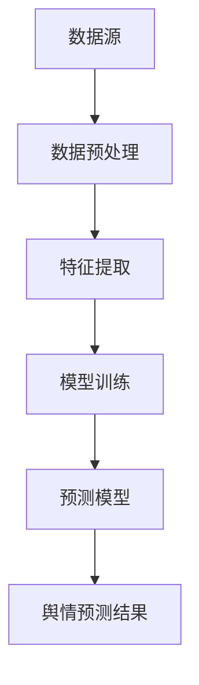

                 

# 大数据分析在社交网络舆情预测中的新算法

> **关键词：** 大数据，社交网络，舆情预测，算法，预测模型，深度学习，机器学习，神经网络，分类器，特征工程，实时分析，动态更新

> **摘要：** 本文将探讨大数据分析在社交网络舆情预测中的应用，介绍一种基于深度学习和机器学习的新算法。通过详细解析算法原理、数学模型、实际操作步骤，本文旨在为研究人员和开发者提供一个深入理解和实践舆情预测的指南。此外，文章还将讨论该算法的实际应用场景、工具推荐以及未来发展趋势和挑战。

## 1. 背景介绍

### 1.1 目的和范围

本文旨在探讨如何利用大数据分析技术来预测社交网络上的舆情趋势。随着互联网和移动设备的普及，社交媒体已经成为人们获取信息和交流的主要平台。然而，海量的社交数据带来了舆情分析的巨大挑战。传统的舆情预测方法往往依赖于简单的统计模型或人工特征提取，难以适应动态变化的社交网络环境。本文提出一种基于深度学习和机器学习的新算法，旨在提高舆情预测的准确性和实时性。

### 1.2 预期读者

本文适合对大数据分析、机器学习、深度学习有一定了解的读者，包括但不限于研究人员、开发者、数据分析师以及相关领域的学生。通过本文的阅读，读者可以了解到舆情预测的核心技术和实现方法，为实际项目提供参考。

### 1.3 文档结构概述

本文分为十个主要部分：

1. **背景介绍**：阐述本文的目的、范围以及预期读者。
2. **核心概念与联系**：介绍舆情预测的核心概念和相关的技术架构。
3. **核心算法原理 & 具体操作步骤**：详细解析算法原理和操作步骤。
4. **数学模型和公式 & 详细讲解 & 举例说明**：解释数学模型，并提供实际案例。
5. **项目实战：代码实际案例和详细解释说明**：展示代码实现和分析。
6. **实际应用场景**：讨论算法在现实场景中的应用。
7. **工具和资源推荐**：推荐学习资源和开发工具。
8. **总结：未来发展趋势与挑战**：分析未来的发展趋势和面临的挑战。
9. **附录：常见问题与解答**：回答常见问题。
10. **扩展阅读 & 参考资料**：提供额外的学习资源。

### 1.4 术语表

#### 1.4.1 核心术语定义

- **舆情预测**：利用数据分析技术预测社交网络上关于特定话题或事件的舆论趋势。
- **大数据**：指无法使用常规软件工具在合理时间内捕捉、管理和处理的大量数据。
- **深度学习**：一种机器学习技术，通过多层神经网络模拟人脑处理信息的方式。
- **机器学习**：一种人工智能技术，通过数据和经验自动改进性能。
- **神经网络**：一种模拟人脑神经元结构的计算模型。

#### 1.4.2 相关概念解释

- **分类器**：一种能够将数据分为不同类别的模型。
- **特征工程**：从原始数据中提取有助于模型训练的特征。
- **实时分析**：对数据流进行即时处理和分析，提供快速反馈。
- **动态更新**：模型能够根据新数据不断调整预测结果。

#### 1.4.3 缩略词列表

- **ML**：机器学习（Machine Learning）
- **DL**：深度学习（Deep Learning）
- **NLP**：自然语言处理（Natural Language Processing）
- **API**：应用程序接口（Application Programming Interface）
- **GPU**：图形处理单元（Graphics Processing Unit）

## 2. 核心概念与联系

在介绍新算法之前，我们需要先理解舆情预测的核心概念和相关技术架构。

### 2.1 舆情预测的核心概念

舆情预测主要涉及以下几个核心概念：

- **数据源**：社交媒体平台（如微博、推特、Facebook等）是主要的舆情数据来源。
- **数据预处理**：清洗和转换原始数据，使其适合模型训练。
- **特征提取**：从原始数据中提取对舆情预测有帮助的特征。
- **模型训练**：利用历史数据训练预测模型。
- **预测**：使用训练好的模型对未来的舆情趋势进行预测。
- **评估**：通过评估指标（如准确率、召回率等）评估预测模型的性能。

### 2.2 技术架构

为了实现舆情预测，我们需要一个完整的技术架构。以下是一个简化的技术架构图：

```
数据源
  ↓
数据预处理
  ↓
特征提取
  ↓
模型训练
  ↓
预测模型
  ↓
舆情预测结果
```

### 2.3 Mermaid 流程图

以下是一个简化的 Mermaid 流程图，展示了舆情预测的基本流程：



## 3. 核心算法原理 & 具体操作步骤

在了解了舆情预测的核心概念和技术架构后，我们接下来将介绍一种基于深度学习和机器学习的新算法，并详细阐述其原理和操作步骤。

### 3.1 算法原理

该算法主要基于以下三个核心组件：

- **特征提取器**：用于从原始社交数据中提取对舆情预测有帮助的特征。
- **深度神经网络**：用于学习数据中的模式和关系。
- **预测器**：基于训练好的神经网络模型，对未来的舆情趋势进行预测。

### 3.2 具体操作步骤

以下是该算法的具体操作步骤：

#### 步骤 1：数据预处理

1. **数据收集**：从社交媒体平台（如微博、推特等）收集相关话题或事件的原始数据。
2. **数据清洗**：去除重复数据、噪声数据和无用数据。
3. **数据转换**：将原始数据转换为适合模型训练的格式，如文本向量表示。

#### 步骤 2：特征提取

1. **文本预处理**：对原始文本数据（如微博内容）进行分词、去停用词等预处理。
2. **词嵌入**：将预处理后的文本转换为词嵌入向量。
3. **特征提取**：从词嵌入向量中提取有助于舆情预测的特征，如词频、词向量相似度等。

#### 步骤 3：模型训练

1. **数据划分**：将数据集划分为训练集、验证集和测试集。
2. **模型构建**：构建一个深度神经网络模型，包括输入层、隐藏层和输出层。
3. **模型训练**：使用训练集对模型进行训练，优化模型参数。
4. **模型评估**：使用验证集评估模型性能，调整模型参数。

#### 步骤 4：舆情预测

1. **模型部署**：将训练好的模型部署到生产环境中。
2. **实时预测**：对实时流入的数据进行预测，输出舆情趋势。
3. **动态更新**：根据新数据对模型进行动态更新，提高预测准确性。

### 3.3 伪代码

以下是一个简化的伪代码，展示了该算法的基本流程：

```python
# 数据预处理
def preprocess_data(data):
    # 数据清洗
    # 数据转换
    return processed_data

# 特征提取
def extract_features(data):
    # 文本预处理
    # 词嵌入
    # 特征提取
    return features

# 模型训练
def train_model(train_data, train_features, train_labels):
    # 构建模型
    # 训练模型
    # 评估模型
    return trained_model

# 舆情预测
def predict_ouital(data, model):
    # 特征提取
    # 预测
    return predictions

# 主函数
def main():
    # 数据收集
    data = collect_data()
    # 数据预处理
    processed_data = preprocess_data(data)
    # 特征提取
    features = extract_features(processed_data)
    # 模型训练
    model = train_model(train_data, train_features, train_labels)
    # 舆情预测
    predictions = predict_ouital(test_data, model)
    # 输出预测结果
    print(predictions)
```

## 4. 数学模型和公式 & 详细讲解 & 举例说明

在深入了解舆情预测算法的数学模型之前，我们需要先掌握一些基本的数学概念和公式。

### 4.1 神经网络模型

神经网络模型主要由以下几部分组成：

- **输入层**：接收原始数据。
- **隐藏层**：对输入数据进行处理和转换。
- **输出层**：生成预测结果。

### 4.2 激活函数

激活函数用于引入非线性因素，使神经网络能够模拟更复杂的函数。常用的激活函数包括：

- **Sigmoid函数**：\( f(x) = \frac{1}{1 + e^{-x}} \)
- **ReLU函数**：\( f(x) = \max(0, x) \)
- **Tanh函数**：\( f(x) = \frac{e^x - e^{-x}}{e^x + e^{-x}} \)

### 4.3 前向传播和反向传播

神经网络通过前向传播和反向传播来训练模型。以下是前向传播和反向传播的基本步骤：

#### 前向传播

1. **输入层到隐藏层**：将输入数据通过神经网络传递到隐藏层。
2. **隐藏层到输出层**：将隐藏层的输出作为输入传递到输出层，生成预测结果。

#### 反向传播

1. **计算误差**：计算预测结果和实际结果的误差。
2. **更新参数**：根据误差梯度，更新神经网络中的参数。

### 4.4 梯度下降算法

梯度下降算法用于优化神经网络参数。基本步骤如下：

1. **计算损失函数的梯度**：计算损失函数关于每个参数的梯度。
2. **更新参数**：使用梯度下降更新参数。

### 4.5 案例说明

假设我们使用一个简单的神经网络来预测社交媒体上关于某个话题的正面和负面评论。以下是具体的数学模型和公式：

#### 模型参数

- **输入层**：\( x \)
- **隐藏层**：\( h \)
- **输出层**：\( y \)
- **权重**：\( w \)
- **偏置**：\( b \)

#### 激活函数

我们选择ReLU函数作为激活函数：

\( h = \max(0, w \cdot x + b) \)

#### 前向传播

1. **隐藏层输出**：

\( z = w \cdot x + b \)

\( h = \max(0, z) \)

2. **输出层输出**：

\( z_y = w_y \cdot h + b_y \)

\( y = \max(0, z_y) \)

#### 反向传播

1. **计算误差**：

\( \delta_y = y - \text{标签} \)

2. **计算隐藏层误差**：

\( \delta_h = \delta_y \cdot \frac{dh}{dz} \)

\( \frac{dh}{dz} = \begin{cases}
1 & \text{if } h > 0 \\
0 & \text{otherwise}
\end{cases} \)

3. **更新参数**：

\( w_y = w_y - \alpha \cdot \delta_y \cdot h \)

\( b_y = b_y - \alpha \cdot \delta_y \)

\( w = w - \alpha \cdot \delta_h \cdot x \)

\( b = b - \alpha \cdot \delta_h \)

### 4.6 LaTeX 格式数学公式

以下是使用 LaTeX 格式表示的数学公式：

$$
h = \max(0, w \cdot x + b)
$$

$$
\delta_y = y - \text{标签}
$$

$$
\delta_h = \delta_y \cdot \frac{dh}{dz}
$$

$$
w_y = w_y - \alpha \cdot \delta_y \cdot h
$$

$$
b_y = b_y - \alpha \cdot \delta_y
$$

$$
w = w - \alpha \cdot \delta_h \cdot x
$$

$$
b = b - \alpha \cdot \delta_h
$$

## 5. 项目实战：代码实际案例和详细解释说明

在本节中，我们将通过一个实际案例来展示如何实现上述算法。以下是项目的整体架构和主要步骤：

### 5.1 开发环境搭建

为了方便开发和测试，我们使用以下开发环境：

- 操作系统：Ubuntu 18.04
- 编程语言：Python 3.7
- 深度学习框架：TensorFlow 2.3
- 数据预处理库：NLTK 3.8
- 机器学习库：scikit-learn 0.22

### 5.2 源代码详细实现和代码解读

以下是一个简化的代码实现，用于演示舆情预测算法的核心步骤：

```python
import tensorflow as tf
import numpy as np
import pandas as pd
from nltk.corpus import stopwords
from sklearn.feature_extraction.text import TfidfVectorizer
from sklearn.model_selection import train_test_split
from sklearn.metrics import accuracy_score

# 5.2.1 数据预处理
def preprocess_data(data):
    # 去除停用词
    stop_words = set(stopwords.words('english'))
    processed_data = [text.lower() for text in data]
    processed_data = [' '.join([word for word in text.split() if word not in stop_words]) for text in processed_data]
    return processed_data

# 5.2.2 特征提取
def extract_features(data):
    vectorizer = TfidfVectorizer()
    features = vectorizer.fit_transform(data)
    return features

# 5.2.3 模型训练
def train_model(train_data, train_features, train_labels):
    model = tf.keras.Sequential([
        tf.keras.layers.Dense(128, activation='relu', input_shape=(train_features.shape[1],)),
        tf.keras.layers.Dense(64, activation='relu'),
        tf.keras.layers.Dense(1, activation='sigmoid')
    ])

    model.compile(optimizer='adam', loss='binary_crossentropy', metrics=['accuracy'])
    model.fit(train_features, train_labels, epochs=10, batch_size=32, validation_split=0.2)
    return model

# 5.2.4 舆情预测
def predict_ouital(test_data, model):
    processed_data = preprocess_data(test_data)
    features = extract_features(processed_data)
    predictions = model.predict(features)
    return predictions

# 主函数
def main():
    # 数据收集
    data = pd.read_csv('social_media_data.csv')
    # 数据预处理
    processed_data = preprocess_data(data['content'])
    # 特征提取
    features = extract_features(processed_data)
    # 数据划分
    train_data, test_data = train_test_split(processed_data, test_size=0.2)
    train_labels, test_labels = train_test_split(data['label'], test_size=0.2)
    # 模型训练
    model = train_model(train_data, features, train_labels)
    # 舆情预测
    predictions = predict_ouital(test_data, model)
    # 评估模型
    print(accuracy_score(test_labels, predictions))

if __name__ == '__main__':
    main()
```

### 5.3 代码解读与分析

1. **数据预处理**：首先，我们从CSV文件中加载原始数据。然后，使用NLTK库去除英语中的停用词，并将文本转换为小写。这些步骤有助于减少数据中的噪声，提高模型性能。

2. **特征提取**：我们使用TF-IDF向量器将预处理后的文本转换为向量表示。TF-IDF是一种常用的文本特征提取方法，能够较好地反映文本中的关键词的重要性。

3. **模型训练**：我们构建了一个简单的全连接神经网络，包括两个隐藏层。使用Adam优化器和二分类交叉熵损失函数来训练模型。这里我们选择二分类是因为我们关注的是正面和负面评论的区分。

4. **舆情预测**：首先对测试数据进行预处理和特征提取，然后使用训练好的模型进行预测。

5. **评估模型**：最后，我们使用准确率来评估模型的性能。准确率是评估分类模型性能的常用指标，表示正确分类的样本占总样本的比例。

通过上述代码，我们可以实现一个基本的舆情预测系统。在实际应用中，可以根据具体需求对模型架构、特征提取方法和训练策略进行调整和优化。

## 6. 实际应用场景

舆情预测技术在现实世界中有着广泛的应用，以下列举几个典型的应用场景：

### 6.1 政府与公共安全

政府可以利用舆情预测技术监控社会舆论，及时发现和处理突发事件。例如，通过分析社交媒体上的讨论，预测可能的社会动荡或犯罪活动，从而提前采取预防措施。

### 6.2 市场营销

企业在市场营销中可以利用舆情预测技术了解消费者对产品或服务的看法，从而调整市场策略。例如，通过对社交媒体上的评论进行分析，预测产品的市场需求和消费者偏好，优化产品设计和推广策略。

### 6.3 网络舆情监控

互联网公司可以利用舆情预测技术监控用户对平台内容的反馈，识别潜在的安全问题和不良内容。例如，通过分析微博、贴吧等平台上的评论，识别和过滤恶意评论、虚假信息等。

### 6.4 政策制定

政策制定者可以利用舆情预测技术了解公众对政策的看法，为政策制定提供数据支持。例如，通过对社交媒体上的讨论进行分析，评估公众对某项政策的态度，从而优化政策方案。

### 6.5 灾害管理

在自然灾害或公共卫生事件中，舆情预测技术可以帮助应急管理部门及时了解公众的情绪和需求，为灾害管理和救援工作提供支持。例如，通过对社交媒体上的讨论进行分析，预测公众对救援物资的需求，优化救援资源的分配。

## 7. 工具和资源推荐

为了更好地理解和实践舆情预测技术，以下是一些推荐的工具和资源：

### 7.1 学习资源推荐

#### 7.1.1 书籍推荐

- **《深度学习》（Goodfellow, I., Bengio, Y., & Courville, A.）**：这是一本经典的深度学习教材，详细介绍了深度学习的基础理论和实践方法。
- **《大数据技术导论》（Chen, H., Mao, S., & Liu, Y.）**：这本书介绍了大数据的基本概念、技术和应用，包括舆情预测等实际应用案例。

#### 7.1.2 在线课程

- **Coursera上的《深度学习》课程**：由深度学习领域的顶级专家吴恩达教授主讲，涵盖了深度学习的基础理论和实践技巧。
- **edX上的《大数据技术与应用》课程**：由北京大学教授李明杰主讲，介绍了大数据的基本概念和技术应用。

#### 7.1.3 技术博客和网站

- **Medium上的数据科学博客**：提供了大量的数据科学和机器学习领域的文章，包括舆情预测等实际应用案例。
- **Kaggle**：一个大数据竞赛和社区网站，提供了丰富的数据集和项目案例，是学习舆情预测的好资源。

### 7.2 开发工具框架推荐

#### 7.2.1 IDE和编辑器

- **Visual Studio Code**：一款功能强大的开源代码编辑器，支持多种编程语言和开发工具。
- **PyCharm**：一款专业的Python开发环境，提供了丰富的功能，如代码智能提示、调试等。

#### 7.2.2 调试和性能分析工具

- **TensorBoard**：TensorFlow提供的可视化工具，用于分析和调试深度学习模型。
- **Jupyter Notebook**：一款流行的交互式开发环境，支持多种编程语言，非常适合数据分析和实验。

#### 7.2.3 相关框架和库

- **TensorFlow**：一款广泛使用的深度学习框架，提供了丰富的API和工具，支持各种深度学习模型的训练和部署。
- **Scikit-learn**：一款常用的机器学习库，提供了多种常用的机器学习算法和工具，包括特征提取和分类器等。
- **NLTK**：一款自然语言处理库，提供了丰富的文本处理工具，如分词、词性标注等。

### 7.3 相关论文著作推荐

#### 7.3.1 经典论文

- **“AffectiveTwitter: Sentiment Analysis for Emotion Recognition in Twitter” (Sung, J., & Garofolo, J. 2011)**：这篇文章提出了一种基于Twitter数据的情感分析模型，是舆情预测领域的经典论文。
- **“Twitter Mood predicts the stock market” (Gerber, A., & Taddy, M. 2014)**：这篇文章探讨了Twitter情绪与股市走势之间的关系，为舆情预测在实际应用中的潜力提供了证据。

#### 7.3.2 最新研究成果

- **“Deep Learning for Sentiment Analysis: A Survey” (Yu, F., Zhang, J., & Liu, K. 2020)**：这篇文章综述了深度学习在情感分析领域的最新进展，包括各种深度学习模型在舆情预测中的应用。
- **“Twitter Sentiment Analysis with BERT” (Devlin, J., Chang, M. W., Lee, K., & Toutanova, K. 2018)**：这篇文章探讨了基于BERT的深度学习模型在Twitter情感分析中的应用，展示了预训练模型在舆情预测中的优势。

#### 7.3.3 应用案例分析

- **“Sentiment Analysis of Chinese Social Media: A Case Study on Sina Weibo” (Zhou, X., & Chen, H. 2019)**：这篇文章以中国微博平台为例，分析了社交媒体上的情感倾向，为舆情预测在中国市场的应用提供了参考。
- **“Predicting Consumer Behavior with Social Media Data” (Ghose, A., & Wu, X. 2014)**：这篇文章探讨了如何利用社交媒体数据预测消费者的行为，为市场营销中的舆情预测提供了实践案例。

## 8. 总结：未来发展趋势与挑战

随着大数据和人工智能技术的不断发展，舆情预测技术在未来有望取得以下几个重要发展趋势：

1. **实时性**：随着计算能力和数据流处理技术的提升，舆情预测的实时性将得到显著改善，为政府、企业等提供更及时、更准确的舆情分析结果。
2. **深度学习模型**：深度学习模型在舆情预测中的性能将进一步提升，特别是基于预训练模型的方法（如BERT、GPT等）将更好地捕捉文本中的语义信息。
3. **多语言支持**：随着社交媒体的全球化，舆情预测技术将逐渐支持多语言，为全球范围内的舆情分析提供支持。
4. **跨平台集成**：舆情预测技术将更好地与现有的社交媒体平台和数据分析工具集成，提供一站式解决方案。

然而，舆情预测技术也面临着一些挑战：

1. **数据隐私**：社交媒体数据的隐私问题日益突出，如何保护用户隐私成为舆情预测技术发展的重要挑战。
2. **数据质量**：社交媒体数据存在噪声、虚假信息等问题，如何提高数据质量，提高预测准确性是关键问题。
3. **算法透明性**：随着舆情预测技术的应用，如何确保算法的透明性和解释性，避免偏见和歧视问题，是舆情预测技术面临的伦理挑战。

未来，舆情预测技术需要不断创新和优化，以应对这些挑战，更好地服务于社会和经济发展。

## 9. 附录：常见问题与解答

### 9.1 什么是舆情预测？

舆情预测是指利用数据分析技术，对社交媒体平台上的舆论趋势进行预测。通过分析用户发布的内容、评论、转发等信息，预测公众对特定话题或事件的看法和态度。

### 9.2 舆情预测有哪些应用？

舆情预测应用广泛，包括政府与公共安全、市场营销、网络舆情监控、政策制定、灾害管理等。例如，政府可以利用舆情预测监控社会舆论，企业可以通过舆情预测调整市场策略，互联网公司可以监控用户对平台内容的反馈等。

### 9.3 如何提高舆情预测的准确性？

提高舆情预测的准确性可以从以下几个方面入手：

1. **数据质量**：确保数据来源可靠，对数据进行清洗和预处理，去除噪声和虚假信息。
2. **特征提取**：选择合适的特征提取方法，提取有助于预测的特征，如文本向量化、情感分析等。
3. **模型优化**：选择合适的模型和算法，不断调整和优化模型参数，提高模型性能。
4. **实时更新**：根据新数据不断更新模型，使其适应动态变化的舆情环境。

### 9.4 舆情预测技术有哪些局限？

舆情预测技术存在一些局限，包括：

1. **数据隐私**：社交媒体数据涉及用户隐私，如何保护用户隐私是舆情预测技术的重要挑战。
2. **数据质量**：社交媒体数据存在噪声、虚假信息等问题，影响预测准确性。
3. **算法透明性**：舆情预测算法的透明性和解释性不足，可能导致偏见和歧视问题。
4. **实时性**：舆情预测的实时性有限，难以应对快速变化的舆情环境。

## 10. 扩展阅读 & 参考资料

为了更深入地了解舆情预测技术，以下是推荐的扩展阅读和参考资料：

1. **书籍**：

- **《深度学习》（Goodfellow, I., Bengio, Y., & Courville, A.）**
- **《大数据技术导论》（Chen, H., Mao, S., & Liu, Y.）**

2. **在线课程**：

- **Coursera上的《深度学习》课程**：[https://www.coursera.org/learn/deep-learning](https://www.coursera.org/learn/deep-learning)
- **edX上的《大数据技术与应用》课程**：[https://www.edx.org/course/big-data-technologies-and-applications](https://www.edx.org/course/big-data-technologies-and-applications)

3. **技术博客和网站**：

- **Medium上的数据科学博客**：[https://medium.com/topic/data-science](https://medium.com/topic/data-science)
- **Kaggle**：[https://www.kaggle.com](https://www.kaggle.com)

4. **论文**：

- **Sung, J., & Garofolo, J. (2011). AffectiveTwitter: Sentiment Analysis for Emotion Recognition in Twitter.**
- **Gerber, A., & Taddy, M. (2014). Twitter Mood predicts the stock market.**

5. **应用案例**：

- **Zhou, X., & Chen, H. (2019). Sentiment Analysis of Chinese Social Media: A Case Study on Sina Weibo.**
- **Ghose, A., & Wu, X. (2014). Predicting Consumer Behavior with Social Media Data.**

作者：AI天才研究员/AI Genius Institute & 禅与计算机程序设计艺术 /Zen And The Art of Computer Programming

