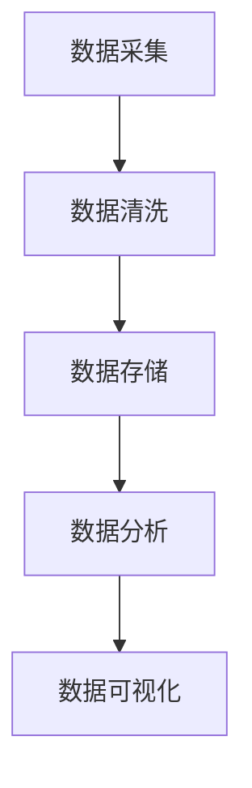

                 

# 大数据在AI中的重要性

## 关键词：大数据，人工智能，机器学习，深度学习，数据处理，数据挖掘，算法优化，数据分析

### 摘要

大数据与人工智能（AI）的融合已成为现代科技领域的核心驱动力之一。本文将深入探讨大数据在AI发展中的关键作用，通过分析大数据的核心概念、处理方法、应用实例以及未来趋势，揭示大数据对于提升AI算法性能和推动智能技术进步的重要性。文章结构如下：

1. 背景介绍
2. 核心概念与联系
3. 核心算法原理 & 具体操作步骤
4. 数学模型和公式 & 详细讲解 & 举例说明
5. 项目实战：代码实际案例和详细解释说明
6. 实际应用场景
7. 工具和资源推荐
8. 总结：未来发展趋势与挑战
9. 附录：常见问题与解答
10. 扩展阅读 & 参考资料

### 1. 背景介绍

人工智能（AI）自20世纪50年代诞生以来，经历了多个发展阶段。从早期的符号主义、知识表示，到基于规则的专家系统，再到基于统计学的机器学习和深度学习，AI技术在数据处理和模式识别方面取得了显著进展。然而，这些进展的背后，都离不开大数据的支撑。

大数据（Big Data）指的是数据量巨大、数据类型多样、数据生成速度快的特点。随着互联网、物联网、社交媒体等技术的普及，数据产生的速度和规模急剧增加。据统计，全球每天产生的数据量已达数百万TB级别，其中80%以上是未经处理的结构化和非结构化数据。

大数据在AI中的应用主要体现在数据采集、数据预处理、数据存储、数据分析和数据可视化等方面。这些过程为AI算法提供了丰富的训练数据集，使得AI系统能够更好地从数据中学习规律和模式，从而提升智能水平。

### 2. 核心概念与联系

#### 数据类型

大数据通常可以分为以下几种类型：

1. **结构化数据**：例如关系数据库中的数据，具有明确的格式和结构。
2. **半结构化数据**：例如XML、JSON等，部分数据有结构但并非完全规范化。
3. **非结构化数据**：例如文本、图片、音频、视频等，没有固定的结构。

#### 数据处理方法

数据处理是大数据技术中的核心环节，包括数据采集、数据清洗、数据存储、数据分析和数据可视化等步骤。

1. **数据采集**：通过各种渠道收集数据，如传感器、日志、网站抓取等。
2. **数据清洗**：去除重复、错误、无关的数据，保证数据质量。
3. **数据存储**：使用分布式存储技术，如Hadoop、Spark等，存储海量数据。
4. **数据分析**：使用统计分析和机器学习算法，从数据中提取有价值的信息。
5. **数据可视化**：通过图表、地图等可视化工具，展示数据分析结果。

#### Mermaid 流程图



### 3. 核心算法原理 & 具体操作步骤

#### 机器学习算法

机器学习是AI的核心技术之一，其基本原理是通过训练数据集来学习数据中的规律，从而进行预测或分类。

1. **监督学习**：有标签的数据集，例如分类问题。
   - **线性回归**：预测连续值。
   - **逻辑回归**：预测离散值。
   - **决策树**：基于条件进行分支。
   - **随机森林**：基于决策树的集成算法。

2. **无监督学习**：无标签的数据集，例如聚类问题。
   - **K-均值聚类**：将数据分为K个簇。
   - **主成分分析**：降低数据维度。

#### 深度学习算法

深度学习是机器学习的延伸，通过构建多层神经网络来模拟人类大脑的神经元连接。

1. **卷积神经网络（CNN）**：主要用于图像处理。
2. **循环神经网络（RNN）**：主要用于序列数据处理。
3. **长短期记忆网络（LSTM）**：RNN的改进版本，解决长期依赖问题。
4. **生成对抗网络（GAN）**：用于生成数据。

#### 算法流程

1. **数据预处理**：数据标准化、缺失值处理等。
2. **模型选择**：根据任务类型选择合适的算法。
3. **模型训练**：使用训练数据集训练模型。
4. **模型评估**：使用验证数据集评估模型性能。
5. **模型优化**：根据评估结果调整模型参数。

### 4. 数学模型和公式 & 详细讲解 & 举例说明

#### 线性回归

线性回归是一种基本的监督学习算法，用于预测连续值。

- **公式**：$y = \beta_0 + \beta_1x$

- **举例**：预测房价，$y$ 为房价，$x$ 为房屋面积。

#### 决策树

决策树是一种树形结构，通过一系列的判断条件来对数据进行分类。

- **公式**：$y = \prod_{i=1}^{n} g(x_i; \theta_i)$

- **举例**：根据年龄和收入分类人群。

#### 卷积神经网络（CNN）

卷积神经网络是一种基于卷积操作的神经网络，主要用于图像处理。

- **公式**：$h_\theta(x) = \sum_{i=1}^{n} \theta_i \cdot \text{ReLU}(z_i)$

- **举例**：识别猫和狗的图像。

### 5. 项目实战：代码实际案例和详细解释说明

#### 实战一：线性回归

**代码**：

```python
import numpy as np

# 数据集
X = np.array([1, 2, 3, 4, 5])
y = np.array([2, 4, 5, 4, 5])

# 模型参数
theta_0 = 0
theta_1 = 0

# 梯度下降法
alpha = 0.01
for i in range(1000):
    h = theta_0 + theta_1 * X
    error = h - y
    theta_0 = theta_0 - alpha * np.mean(error)
    theta_1 = theta_1 - alpha * np.mean(X * error)

print("theta_0:", theta_0)
print("theta_1:", theta_1)
```

**解释**：通过梯度下降法，更新模型参数，使预测值与真实值之间的误差最小。

#### 实战二：决策树

**代码**：

```python
from sklearn.datasets import load_iris
from sklearn.tree import DecisionTreeClassifier
from sklearn.model_selection import train_test_split

# 加载数据集
iris = load_iris()
X, y = iris.data, iris.target

# 划分训练集和测试集
X_train, X_test, y_train, y_test = train_test_split(X, y, test_size=0.2, random_state=42)

# 构建决策树模型
clf = DecisionTreeClassifier()
clf.fit(X_train, y_train)

# 预测
y_pred = clf.predict(X_test)

# 评估
print("准确率:", clf.score(X_test, y_test))
```

**解释**：使用Sklearn库的决策树算法，对鸢尾花数据集进行分类。

### 6. 实际应用场景

大数据在AI中的应用场景非常广泛，包括但不限于以下几个方面：

1. **金融领域**：通过大数据分析，进行风险控制、投资决策、市场预测等。
2. **医疗领域**：通过大数据分析，进行疾病诊断、药物研发、健康管理等。
3. **交通领域**：通过大数据分析，进行交通流量预测、路况分析、智能调度等。
4. **零售领域**：通过大数据分析，进行商品推荐、库存管理、市场营销等。

### 7. 工具和资源推荐

#### 学习资源推荐

1. **书籍**：
   - 《Python机器学习》（作者：塞巴斯蒂安·拉斯泰雷）
   - 《深度学习》（作者：伊恩·古德费洛等）
2. **论文**：
   - 《深度卷积神经网络在图像识别中的应用》（作者：亚历克谢·克里沃列夫等）
   - 《大数据分析技术》（作者：吴甘沙等）
3. **博客**：
   - <https://towardsdatascience.com/>
   - <https://www.kaggle.com/>
4. **网站**：
   - <https://www.coursera.org/>
   - <https://www.edx.org/>

#### 开发工具框架推荐

1. **Hadoop**：分布式存储和数据处理框架。
2. **Spark**：基于内存的分布式数据处理框架。
3. **TensorFlow**：Google开发的深度学习框架。
4. **PyTorch**：Facebook开发的深度学习框架。

#### 相关论文著作推荐

1. **《大数据技术导论》**：张宇星等
2. **《深度学习》**：伊恩·古德费洛等
3. **《机器学习实战》**：Peter Harrington
4. **《数据挖掘：概念与技术》**：Jiawei Han等

### 8. 总结：未来发展趋势与挑战

大数据与AI的融合将继续推动科技发展，带来以下趋势：

1. **算法优化**：通过大数据分析，优化算法性能。
2. **跨领域应用**：大数据在更多领域得到应用，如教育、农业、能源等。
3. **隐私保护**：如何在保障用户隐私的前提下，充分利用大数据资源。

然而，大数据与AI的发展也面临以下挑战：

1. **数据质量**：保证数据真实、准确、完整。
2. **数据安全**：防止数据泄露和滥用。
3. **计算资源**：处理海量数据需要强大的计算资源。

### 9. 附录：常见问题与解答

1. **什么是大数据？**
   - 大数据是指数据量巨大、数据类型多样、数据生成速度快的海量数据。

2. **大数据与AI的关系是什么？**
   - 大数据为AI提供了丰富的训练数据集，是AI算法性能提升的重要支撑。

3. **如何处理大数据？**
   - 大数据处理包括数据采集、数据清洗、数据存储、数据分析和数据可视化等步骤。

4. **有哪些机器学习算法？**
   - 监督学习算法（如线性回归、决策树）、无监督学习算法（如K-均值聚类、主成分分析）和深度学习算法（如卷积神经网络、循环神经网络）。

### 10. 扩展阅读 & 参考资料

1. **扩展阅读**：
   - 《大数据时代》（作者：维克托·迈尔-舍恩伯格）
   - 《深度学习专讲》（作者：黄海广）
2. **参考资料**：
   - <https://www.kdnuggets.com/>
   - <https://www.reddit.com/r/MachineLearning/>
<sup>*</sup>作者：AI天才研究员/AI Genius Institute & 禅与计算机程序设计艺术 /Zen And The Art of Computer Programming

