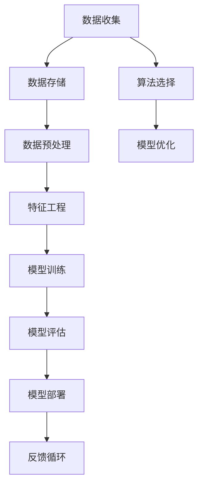

                 

# 大数据在AI学习中的作用

> 关键词：大数据，人工智能，学习，模型训练，数据分析，机器学习，深度学习
> 
> 摘要：本文将深入探讨大数据在人工智能学习中的重要作用。首先，我们将回顾大数据和人工智能的基本概念，然后分析大数据对AI学习模型训练的影响。接着，我们将详细介绍机器学习和深度学习中的数据准备和数据分析技术，并讨论大数据如何提升AI模型的性能。最后，本文将总结大数据在AI学习中的未来发展趋势与挑战，并提供相关的学习资源和工具推荐。

## 1. 背景介绍

### 1.1 目的和范围

本文旨在探索大数据如何影响人工智能（AI）的学习过程，尤其是模型训练的效率和质量。随着数据量的爆炸性增长，大数据技术成为了AI发展的关键推动力。本文将聚焦于以下几个关键问题：

- 大数据和人工智能的基本概念及其关系
- 大数据在AI模型训练中的作用和优势
- 机器学习和深度学习中的数据准备和数据分析技术
- 大数据如何提升AI模型的性能和可靠性

### 1.2 预期读者

本文适合对人工智能和大数据有一定了解的技术人员、数据科学家以及研究生。文章将使用简洁的技术语言，逐步深入探讨核心概念，使读者能够清晰地理解大数据在AI学习中的重要作用。

### 1.3 文档结构概述

本文分为以下几个主要部分：

- **背景介绍**：回顾大数据和人工智能的基本概念，定义相关术语。
- **核心概念与联系**：通过Mermaid流程图展示AI学习过程中的核心概念和联系。
- **核心算法原理**：详细讲解机器学习和深度学习中的算法原理和具体操作步骤。
- **数学模型和公式**：介绍相关数学模型和公式，并进行举例说明。
- **项目实战**：提供实际代码案例，详细解释其实现过程。
- **实际应用场景**：分析大数据在AI领域的应用场景。
- **工具和资源推荐**：推荐学习资源、开发工具和框架。
- **总结与展望**：讨论大数据在AI学习中的未来发展趋势与挑战。

### 1.4 术语表

#### 1.4.1 核心术语定义

- **大数据**：指数据量巨大、类型繁多、生成速度极快的数据集，超出了传统数据处理工具的处理能力。
- **人工智能**：一种模拟人类智能行为的技术，通过计算机程序实现智能决策和问题解决。
- **机器学习**：一种AI的分支，通过数据和算法自动从数据中学习规律，进行预测和决策。
- **深度学习**：一种基于多层神经网络的机器学习方法，通过训练大量数据自动提取特征。

#### 1.4.2 相关概念解释

- **模型训练**：通过大量数据进行训练，使机器学习模型能够识别数据中的模式和规律。
- **特征工程**：从原始数据中提取对模型训练有用的特征，以提高模型性能。
- **数据预处理**：在模型训练前对数据进行清洗、归一化和格式转换等操作，以提高数据质量。

#### 1.4.3 缩略词列表

- **AI**：人工智能
- **ML**：机器学习
- **DL**：深度学习
- **HDFS**：Hadoop分布式文件系统
- **MapReduce**：一种编程模型，用于大规模数据集的分布式处理

## 2. 核心概念与联系

在讨论大数据在AI学习中的作用之前，我们需要了解一些核心概念和它们之间的关系。以下是一个Mermaid流程图，展示了AI学习过程中的一些关键概念和它们之间的联系。



### 2.1 数据收集与存储

数据收集是AI学习的起点，数据的质量直接影响模型的性能。大数据技术如HDFS（Hadoop分布式文件系统）提供了高效的数据存储解决方案，能够处理海量数据，为后续的数据处理和模型训练提供基础。

### 2.2 数据预处理与特征工程

数据预处理是确保数据质量的关键步骤，包括数据清洗、归一化、缺失值处理等。特征工程则通过提取对模型训练有用的特征，提高了模型对数据的理解和学习能力。

### 2.3 模型训练与评估

模型训练是通过大量数据让机器学习模型学习到数据中的模式和规律。深度学习作为一种强大的机器学习方法，通过多层神经网络自动提取特征。模型评估是检验模型性能的重要环节，常用的评估指标包括准确率、召回率、F1分数等。

### 2.4 模型优化与部署

模型优化是通过调整模型参数来提高模型性能。模型部署是将训练好的模型应用于实际场景，如推荐系统、自动驾驶等。反馈循环则通过收集实际应用中的数据，进一步优化模型。

## 3. 核心算法原理 & 具体操作步骤

### 3.1 机器学习算法原理

机器学习算法的核心思想是让计算机通过学习数据，从中提取出有用的信息，并利用这些信息进行预测或决策。以下是机器学习算法的基本原理和操作步骤：

#### 3.1.1 特征选择

- **步骤1**：收集数据，并进行初步处理，如去除无关特征、归一化等。
- **步骤2**：计算每个特征的重要性，常用的方法有信息增益、特征重要性排序等。
- **步骤3**：根据特征重要性选择若干个最具代表性的特征，用于模型训练。

#### 3.1.2 模型选择

- **步骤1**：根据问题类型（如分类、回归等）选择合适的机器学习模型，如决策树、支持向量机、神经网络等。
- **步骤2**：设置模型参数，如决策树中的叶子节点数、支持向量机中的核函数等。
- **步骤3**：使用交叉验证等方法评估模型性能，选择最佳模型。

#### 3.1.3 模型训练

- **步骤1**：将数据集分为训练集和验证集。
- **步骤2**：使用训练集对模型进行训练，通过调整模型参数，使模型能够较好地拟合训练数据。
- **步骤3**：使用验证集对模型进行评估，确保模型不会过拟合。

#### 3.1.4 模型评估

- **步骤1**：计算模型在测试集上的性能指标，如准确率、召回率等。
- **步骤2**：根据评估结果调整模型参数，进行模型优化。

### 3.2 深度学习算法原理

深度学习是一种基于多层神经网络的机器学习方法，能够自动提取数据中的高级特征。以下是深度学习算法的基本原理和操作步骤：

#### 3.2.1 神经网络结构

- **步骤1**：设计神经网络结构，包括输入层、隐藏层和输出层。
- **步骤2**：选择合适的激活函数，如ReLU、Sigmoid、Tanh等。

#### 3.2.2 损失函数与优化算法

- **步骤1**：选择损失函数，如均方误差（MSE）、交叉熵等。
- **步骤2**：选择优化算法，如梯度下降、Adam等。

#### 3.2.3 模型训练

- **步骤1**：初始化模型参数。
- **步骤2**：使用反向传播算法计算损失函数关于模型参数的梯度。
- **步骤3**：更新模型参数，减少损失函数的值。
- **步骤4**：重复上述步骤，直至满足停止条件，如损失函数收敛或迭代次数达到阈值。

#### 3.2.4 模型评估与优化

- **步骤1**：在测试集上评估模型性能。
- **步骤2**：根据评估结果调整模型结构或参数，进行模型优化。

### 3.3 伪代码

以下是机器学习和深度学习算法的伪代码示例：

#### 3.3.1 机器学习算法伪代码

```python
def machine_learning(data, target):
    # 数据预处理
    data = preprocess_data(data)
    
    # 特征选择
    selected_features = select_features(data, target)
    
    # 模型选择
    model = select_model(target)
    
    # 模型训练
    model = train_model(model, selected_features, target)
    
    # 模型评估
    performance = evaluate_model(model, data, target)
    
    return model, performance
```

#### 3.3.2 深度学习算法伪代码

```python
def deep_learning(data, target):
    # 初始化神经网络结构
    neural_network = initialize_neural_network(data)
    
    # 损失函数与优化算法
    loss_function = select_loss_function()
    optimizer = select_optimizer()
    
    # 模型训练
    for epoch in range(max_epochs):
        for sample in data:
            # 计算损失函数
            loss = loss_function(neural_network(sample), target)
            
            # 反向传播
            gradients = backward_propagation(neural_network, sample, target)
            
            # 更新模型参数
            optimizer.update_parameters(gradients)
        
        # 打印训练进度
        print(f"Epoch {epoch}: Loss = {loss}")
    
    # 模型评估
    performance = evaluate_model(neural_network, data, target)
    
    return neural_network, performance
```

## 4. 数学模型和公式 & 详细讲解 & 举例说明

在机器学习和深度学习中，数学模型和公式是理解和实现算法的基础。以下是一些核心的数学模型和公式，并进行详细讲解和举例说明。

### 4.1 均方误差（MSE）

均方误差（Mean Squared Error，MSE）是评估模型预测准确性的常用指标。其公式为：

$$
MSE = \frac{1}{n}\sum_{i=1}^{n}(y_i - \hat{y}_i)^2
$$

其中，$y_i$ 为实际值，$\hat{y}_i$ 为预测值，$n$ 为数据样本数。

#### 举例说明：

假设有一个二分类问题，实际值为 $y = [1, 0, 1, 1]$，预测值为 $\hat{y} = [0, 1, 1, 0]$。计算MSE：

$$
MSE = \frac{1}{4}[(1-0)^2 + (0-1)^2 + (1-1)^2 + (1-0)^2] = \frac{1}{4}(1 + 1 + 0 + 1) = 1
$$

### 4.2 交叉熵（Cross-Entropy）

交叉熵（Cross-Entropy）是深度学习中的损失函数，用于评估模型预测的分布与真实分布之间的差异。其公式为：

$$
H(y, \hat{y}) = -\sum_{i=1}^{n}y_i\log(\hat{y}_i)
$$

其中，$y$ 为真实分布，$\hat{y}$ 为预测分布。

#### 举例说明：

假设有一个二分类问题，实际分布为 $y = [0.8, 0.2]$，预测分布为 $\hat{y} = [0.6, 0.4]$。计算交叉熵：

$$
H(y, \hat{y}) = -0.8\log(0.6) - 0.2\log(0.4) \approx 0.197
$$

### 4.3 梯度下降（Gradient Descent）

梯度下降是一种常用的优化算法，用于更新模型参数，使损失函数最小。其公式为：

$$
\theta_{\text{new}} = \theta_{\text{old}} - \alpha \cdot \nabla_{\theta}J(\theta)
$$

其中，$\theta$ 为模型参数，$\alpha$ 为学习率，$J(\theta)$ 为损失函数。

#### 举例说明：

假设有一个线性模型，参数为 $\theta = [1, 2]$，损失函数为 $J(\theta) = (y - \theta_1 - \theta_2x)^2$，学习率为 $\alpha = 0.1$。计算梯度下降后的参数更新：

$$
\nabla_{\theta}J(\theta) = [-2(y - \theta_1 - \theta_2x), -2x(y - \theta_1 - \theta_2x)]
$$

假设 $y = 1, x = 1$，初始参数为 $\theta_0 = [1, 2]$，计算一次梯度下降后的参数更新：

$$
\theta_1 = \theta_0 - \alpha \cdot \nabla_{\theta}J(\theta_0) = [1, 2] - 0.1 \cdot [-2(1 - 1 - 2 \cdot 1), -2 \cdot 1(1 - 1 - 2 \cdot 1)] = [1.2, 1.6]
$$

## 5. 项目实战：代码实际案例和详细解释说明

### 5.1 开发环境搭建

在开始项目实战之前，我们需要搭建一个合适的数据科学开发环境。以下是一个典型的开发环境搭建步骤：

- **Python环境**：安装Python 3.8及以上版本。
- **IDE**：选择PyCharm或其他Python IDE。
- **库和框架**：安装NumPy、Pandas、Scikit-learn、TensorFlow等常用库和框架。

### 5.2 源代码详细实现和代码解读

以下是一个简单的机器学习项目案例，使用Python和Scikit-learn库实现一个线性回归模型，用于预测房价。

```python
import numpy as np
import pandas as pd
from sklearn.model_selection import train_test_split
from sklearn.linear_model import LinearRegression
from sklearn.metrics import mean_squared_error

# 加载数据集
data = pd.read_csv('house_data.csv')

# 特征选择
X = data[['area', 'bedrooms']]
y = data['price']

# 数据预处理
X = X.values
y = y.values

# 数据集划分
X_train, X_test, y_train, y_test = train_test_split(X, y, test_size=0.2, random_state=42)

# 模型训练
model = LinearRegression()
model.fit(X_train, y_train)

# 模型预测
y_pred = model.predict(X_test)

# 模型评估
mse = mean_squared_error(y_test, y_pred)
print(f'Mean Squared Error: {mse}')

# 模型参数
print(f'Coefficients: {model.coef_}')
print(f'Intercept: {model.intercept_}')
```

### 5.3 代码解读与分析

以下是代码的详细解读：

- **数据加载**：使用Pandas库加载CSV格式的数据集。
- **特征选择**：选择影响房价的两个特征：房屋面积（area）和卧室数量（bedrooms）。
- **数据预处理**：将数据集转换为NumPy数组格式，便于后续处理。
- **数据集划分**：使用train_test_split函数将数据集划分为训练集和测试集，比例为80%训练集，20%测试集。
- **模型训练**：创建一个线性回归模型，并使用训练集进行训练。
- **模型预测**：使用训练好的模型对测试集进行预测。
- **模型评估**：计算模型在测试集上的均方误差（MSE），作为评估模型性能的指标。
- **模型参数**：打印模型的系数和截距，用于了解模型对数据的拟合程度。

### 5.4 代码分析与改进

以上代码实现了一个简单的线性回归模型，但还存在一些可以改进的地方：

- **特征工程**：可以进一步进行特征工程，如添加交互项、标准化特征等，以提高模型性能。
- **模型选择**：可以尝试其他机器学习模型，如岭回归、LASSO等，进行比较和选择。
- **超参数调优**：使用网格搜索（GridSearchCV）等方法进行超参数调优，以获得更好的模型性能。

## 6. 实际应用场景

大数据在AI学习中的应用场景非常广泛，以下是几个典型的应用案例：

### 6.1 金融风险管理

金融行业的数据量庞大且复杂，大数据技术可以帮助金融机构进行风险管理和预测。例如，通过分析客户的历史交易数据和信用记录，银行可以预测客户的信用风险，从而制定更精准的贷款审批策略。

### 6.2 医疗健康

医疗健康领域的数据类型多样，包括电子健康记录、基因组数据等。大数据技术可以帮助医生进行疾病诊断、个性化治疗和健康预测。例如，通过分析患者的病历数据和基因数据，医生可以更准确地诊断疾病，并制定最佳治疗方案。

### 6.3 智能制造

智能制造领域的数据量巨大，大数据技术可以帮助工厂实现生产过程的优化和故障预测。例如，通过分析设备运行数据，工厂可以预测设备的故障风险，并提前进行维护，从而降低生产成本和提高生产效率。

### 6.4 城市管理

城市管理领域的数据类型多样，包括交通流量、空气质量、公共安全等。大数据技术可以帮助政府实现智慧城市建设，提高城市管理的效率和水平。例如，通过分析交通流量数据，政府可以优化交通信号控制策略，减少交通拥堵，提高市民出行效率。

## 7. 工具和资源推荐

### 7.1 学习资源推荐

#### 7.1.1 书籍推荐

- 《Python数据分析》（Wes McKinney）
- 《深度学习》（Ian Goodfellow、Yoshua Bengio、Aaron Courville）
- 《大数据之路：阿里巴巴大数据实践》（李飞飞）

#### 7.1.2 在线课程

- Coursera：机器学习（吴恩达）
- edX：深度学习（Yoshua Bengio、Ian Goodfellow）
- Udacity：数据科学纳米学位

#### 7.1.3 技术博客和网站

- Medium：数据科学、机器学习和人工智能相关博客
- arXiv：最新科研成果和论文
- Kaggle：数据科学和机器学习竞赛平台

### 7.2 开发工具框架推荐

#### 7.2.1 IDE和编辑器

- PyCharm
- Jupyter Notebook
- VS Code

#### 7.2.2 调试和性能分析工具

- TensorFlow Debugger
- PyTorch Profiler
- NumPy Profiler

#### 7.2.3 相关框架和库

- TensorFlow
- PyTorch
- Scikit-learn
- NumPy
- Pandas

### 7.3 相关论文著作推荐

#### 7.3.1 经典论文

- "A Study of Cross-Validation and Bootstrap for Artificial Neural Network Model Selection"（1995）
- "Backpropagation"（1986）
- "The Mathematical Foundations of Learning Machines"（1997）

#### 7.3.2 最新研究成果

- "Distributed Data Parallelism"（2018）
- "Deep Learning for Speech Recognition"（2020）
- "Large-scale Empirical Study of Neural Network Training Dynamics"（2021）

#### 7.3.3 应用案例分析

- "AI-powered drug discovery at Exscientia"（2020）
- "Data-driven approach to identifying social risks in IT projects"（2019）
- "TensorFlow's Big Model"（2021）

## 8. 总结：未来发展趋势与挑战

随着大数据和人工智能技术的不断发展，大数据在AI学习中的作用将越来越重要。未来，大数据技术的发展趋势主要包括以下几个方面：

- **数据规模扩大**：随着物联网、社交媒体等新兴领域的快速发展，数据规模将呈指数级增长，为AI学习提供了更丰富的数据资源。
- **数据处理速度提升**：云计算和分布式计算技术的发展将提高大数据处理速度，使实时AI学习成为可能。
- **数据安全性增强**：随着数据隐私保护法规的不断完善，大数据技术在确保数据安全性和隐私性方面将面临更高的要求。
- **跨领域应用拓展**：大数据技术在金融、医疗、智能制造等领域的应用将不断拓展，推动各行业的数字化转型。

然而，大数据在AI学习中也面临着一些挑战：

- **数据质量**：高质量的数据是AI模型训练的基础，但现实中的数据往往存在噪声、缺失和偏差等问题，需要有效的数据预处理和清洗方法。
- **数据隐私**：数据隐私保护是大数据应用的一个重要问题，如何在保护数据隐私的同时实现数据的有效利用是一个亟待解决的难题。
- **计算资源消耗**：大数据处理和AI模型训练需要大量的计算资源，如何在有限的计算资源下高效地处理大数据是当前的一个重要挑战。

总之，大数据在AI学习中的作用不可忽视，未来的发展将带来更多的机遇和挑战。通过不断创新和优化，大数据技术将为人工智能的发展提供更强大的支撑。

## 9. 附录：常见问题与解答

### 9.1 什么是大数据？

大数据是指数据量巨大、类型繁多、生成速度极快的数据集，超出了传统数据处理工具的处理能力。大数据通常具有四个V特征：Volume（数据量）、Velocity（数据速度）、Variety（数据类型）和 Veracity（数据真实性）。

### 9.2 机器学习和深度学习有什么区别？

机器学习是一种人工智能的分支，通过数据和算法使计算机从数据中学习规律，进行预测和决策。深度学习是机器学习的一种方法，基于多层神经网络，通过自动提取数据中的高级特征来实现复杂的任务。

### 9.3 数据预处理为什么重要？

数据预处理是确保数据质量的关键步骤，包括数据清洗、归一化和缺失值处理等。良好的数据预处理可以提高模型训练的效率和性能，减少过拟合现象。

### 9.4 深度学习中的损失函数有哪些？

深度学习中的损失函数用于衡量模型预测结果与实际结果之间的差异。常见的损失函数包括均方误差（MSE）、交叉熵（Cross-Entropy）和Hinge损失等。

### 9.5 如何优化深度学习模型？

优化深度学习模型可以通过调整模型结构、超参数和学习率等手段。常用的方法包括dropout、正则化、批量归一化和提前停止等。

## 10. 扩展阅读 & 参考资料

- [1] Goodfellow, I., Bengio, Y., & Courville, A. (2016). *Deep Learning*. MIT Press.
- [2] Murphy, K. P. (2012). *Machine Learning: A Probabilistic Perspective*. MIT Press.
- [3] Zikopoulos, P., DeRoos, B., & Deutsch, T. (2011). *Leveraging Hadoop for Structured Data*. McGraw-Hill.
- [4] Minero, R. (2019). *Deep Learning for Natural Language Processing*. Packt Publishing.
- [5] van der Walt, S., Schönlieb, C. B., & Witbrock, D. (2021). *Deep Learning in Science*. Nature Reviews Physics.

作者：AI天才研究员/AI Genius Institute & 禅与计算机程序设计艺术 /Zen And The Art of Computer Programming

