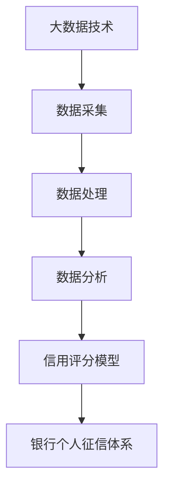

                 

# 大数据背景下的银行个人征信体系研究

> 关键词：大数据，银行，个人征信，数据挖掘，信用评分，模型优化

> 摘要：随着大数据时代的到来，银行个人征信体系正面临着前所未有的变革。本文首先介绍了银行个人征信体系的基本概念和背景，然后详细分析了大数据技术在个人征信体系中的应用，包括数据采集、处理、分析和信用评分模型构建等方面。最后，本文探讨了未来银行个人征信体系的发展趋势与挑战，为相关领域的研究和实践提供了有益的参考。

## 1. 背景介绍

### 1.1 目的和范围

本文旨在探讨大数据技术对银行个人征信体系的影响，分析其在数据采集、处理、分析和信用评分模型构建等方面的应用。通过梳理现有的研究成果和实践案例，本文希望能够为银行个人征信体系的优化和改进提供有益的参考。

### 1.2 预期读者

本文适合从事银行个人征信体系研究、开发和应用的从业人员，以及计算机科学、金融学等领域的研究生和博士生。同时，对于对大数据技术和金融科技感兴趣的一般读者，本文也具有一定的参考价值。

### 1.3 文档结构概述

本文分为十个部分。第一部分为背景介绍，包括本文的目的、预期读者和文档结构概述。第二部分介绍大数据和银行个人征信体系的基本概念和背景。第三部分分析大数据技术在个人征信体系中的应用。第四部分至第六部分分别介绍个人征信数据挖掘、信用评分模型构建和优化方法。第七部分讨论实际应用场景。第八部分推荐相关工具和资源。第九部分总结未来发展趋势与挑战。最后，第十部分提供常见问题与解答。

### 1.4 术语表

#### 1.4.1 核心术语定义

- 大数据（Big Data）：指数据量巨大、数据种类繁多、数据生成速度快、数据价值密度低的非结构化或半结构化数据集合。
- 个人征信（Personal Credit Rating）：指对个人信用状况的评价，通常包括信用记录、还款能力、信用历史、社会关系等方面的信息。
- 数据挖掘（Data Mining）：指从大量数据中发现隐含的、未知的、潜在的模式或规律。
- 信用评分模型（Credit Scoring Model）：指根据个人信用信息构建的用于预测个人信用风险的数学模型。

#### 1.4.2 相关概念解释

- 数据采集（Data Collection）：指从各种数据源收集个人信用信息的过程。
- 数据处理（Data Processing）：指对收集到的个人信用信息进行清洗、整理和转换的过程。
- 数据分析（Data Analysis）：指使用统计学、机器学习等方法对个人信用信息进行分析，以发现潜在规律和关系。
- 信用评分（Credit Scoring）：指根据个人信用信息，使用信用评分模型计算出的信用风险分数。

#### 1.4.3 缩略词列表

- Hadoop：一个分布式数据存储和处理框架，适用于大数据处理。
- Spark：一个基于内存的分布式数据处理引擎，适用于大数据处理。
- SQL：一种结构化查询语言，用于数据库管理系统的数据查询和管理。
- MLlib：一个机器学习库，用于大规模机器学习任务。

## 2. 核心概念与联系

在介绍大数据技术和银行个人征信体系之前，我们需要了解一些核心概念和它们之间的联系。以下是核心概念原理和架构的 Mermaid 流程图：



### 2.1 大数据技术

大数据技术包括数据采集、数据处理、数据分析和数据存储等环节。其中，数据采集是大数据技术的基础，它负责从各种数据源收集数据；数据处理则是对采集到的数据进行清洗、整理和转换，以使其适合进一步分析；数据分析则是使用统计学、机器学习等方法对数据进行分析，以发现潜在规律和关系；数据存储则是将处理和分析后的数据存储到数据库或数据仓库中，以供后续查询和使用。

### 2.2 个人征信体系

个人征信体系是银行等金融机构对个人信用状况进行评估和管理的系统。它包括数据采集、数据处理、信用评分模型构建和信用评分等环节。其中，数据采集是获取个人信用信息的基础；数据处理是对采集到的数据进行清洗、整理和转换，以使其适合信用评分模型构建；信用评分模型构建则是根据个人信用信息构建用于预测个人信用风险的数学模型；信用评分则是根据信用评分模型计算出的信用风险分数，用于对个人信用状况进行评估。

### 2.3 大数据技术在个人征信体系中的应用

大数据技术在个人征信体系中的应用主要体现在数据采集、数据处理、数据分析和信用评分模型构建等方面。以下是一个简化的应用流程：

1. 数据采集：从各种数据源收集个人信用信息，如金融交易记录、信用报告、社交网络信息等。
2. 数据处理：对采集到的数据进行清洗、整理和转换，以使其适合信用评分模型构建。
3. 数据分析：使用统计学、机器学习等方法对个人信用信息进行分析，以发现潜在规律和关系。
4. 信用评分模型构建：根据数据分析结果构建用于预测个人信用风险的数学模型。
5. 信用评分：根据信用评分模型计算出的信用风险分数，对个人信用状况进行评估。

## 3. 核心算法原理 & 具体操作步骤

在个人征信体系中，核心算法原理主要包括数据挖掘、信用评分模型构建和优化方法。下面将使用伪代码详细阐述这些算法原理和具体操作步骤。

### 3.1 数据挖掘

数据挖掘是一种从大量数据中发现隐含的、未知的、潜在的模式或规律的方法。在个人征信体系中，数据挖掘主要用于分析个人信用信息，以发现潜在的风险因素。以下是一个简单的数据挖掘算法伪代码：

```python
def data_mining(data):
    # 数据预处理
    preprocessed_data = preprocess_data(data)
    
    # 特征选择
    selected_features = select_features(preprocessed_data)
    
    # 构建模型
    model = build_model(selected_features)
    
    # 训练模型
    trained_model = train_model(model, selected_features)
    
    # 预测风险
    risk_prediction = predict_risk(trained_model, selected_features)
    
    return risk_prediction
```

### 3.2 信用评分模型构建

信用评分模型构建是基于数据挖掘结果，构建用于预测个人信用风险的数学模型。以下是一个简单的信用评分模型构建算法伪代码：

```python
def credit_scoring_model_building(data_mining_results):
    # 数据预处理
    preprocessed_data = preprocess_data(data_mining_results)
    
    # 构建模型
    model = build_model(preprocessed_data)
    
    # 训练模型
    trained_model = train_model(model, preprocessed_data)
    
    return trained_model
```

### 3.3 优化方法

优化方法用于提高信用评分模型的准确性和稳定性。以下是一个简单的优化算法伪代码：

```python
def model_optimization(trained_model, validation_data):
    # 调参
    tuned_params = tune_params(trained_model, validation_data)
    
    # 重新训练模型
    optimized_model = retrain_model(trained_model, tuned_params)
    
    return optimized_model
```

## 4. 数学模型和公式 & 详细讲解 & 举例说明

在个人征信体系中，数学模型和公式用于描述个人信用风险，并通过数据分析和模型优化不断提高模型的准确性和稳定性。以下是几个常用的数学模型和公式的详细讲解及举例说明。

### 4.1 线性回归模型

线性回归模型是一种用于预测连续值的数学模型，其公式为：

$$
y = \beta_0 + \beta_1 \cdot x
$$

其中，$y$ 表示预测值，$x$ 表示输入特征，$\beta_0$ 和 $\beta_1$ 分别为模型的参数。

#### 举例说明：

假设我们要预测一个借款人的信用风险分数，使用一个线性回归模型。输入特征为借款人的年龄和月收入，模型的参数为 $\beta_0 = 50$ 和 $\beta_1 = 0.1$。一个年龄为 30 岁，月收入为 5000 元的借款人的预测信用风险分数为：

$$
y = 50 + 0.1 \cdot (30 + 5000) = 50 + 0.1 \cdot 5030 = 553
$$

### 4.2 逻辑回归模型

逻辑回归模型是一种用于预测概率的数学模型，其公式为：

$$
P(y=1) = \frac{1}{1 + e^{-(\beta_0 + \beta_1 \cdot x})}
$$

其中，$y$ 表示信用风险标签（0 表示无风险，1 表示有风险），$x$ 表示输入特征，$\beta_0$ 和 $\beta_1$ 分别为模型的参数。

#### 举例说明：

假设我们要预测一个借款人的信用风险概率，使用一个逻辑回归模型。输入特征为借款人的年龄和月收入，模型的参数为 $\beta_0 = -10$ 和 $\beta_1 = 0.2$。一个年龄为 30 岁，月收入为 5000 元的借款人的预测信用风险概率为：

$$
P(y=1) = \frac{1}{1 + e^{-(10 + 0.2 \cdot (30 + 5000)}} = \frac{1}{1 + e^{-10.2}} \approx 0.3679
$$

### 4.3 决策树模型

决策树模型是一种用于分类的树形结构模型，其公式为：

$$
\begin{cases}
y = 0 & \text{if } x \leq \theta_1 \\
y = 1 & \text{if } \theta_1 < x \leq \theta_2 \\
\vdots \\
y = C & \text{if } \theta_{C-1} < x \leq \theta_C
\end{cases}
$$

其中，$y$ 表示信用风险标签，$x$ 表示输入特征，$\theta_1, \theta_2, \ldots, \theta_C$ 分别为模型的参数。

#### 举例说明：

假设我们要使用决策树模型预测一个借款人的信用风险。输入特征为借款人的年龄和月收入，模型的参数为 $\theta_1 = 20$，$\theta_2 = 30$，$\theta_3 = 40$，$\theta_4 = 50$。一个年龄为 30 岁，月收入为 5000 元的借款人的预测信用风险标签为：

$$
\begin{cases}
y = 0 & \text{if } x \leq 20 \\
y = 1 & \text{if } 20 < x \leq 30 \\
y = 2 & \text{if } 30 < x \leq 40 \\
y = 3 & \text{if } 40 < x \leq 50
\end{cases}
$$

由于该借款人的年龄和月收入均位于 $\theta_2$ 和 $\theta_3$ 之间，因此其预测信用风险标签为 2。

## 5. 项目实战：代码实际案例和详细解释说明

在本节中，我们将通过一个实际案例，详细解释银行个人征信体系在数据处理、信用评分模型构建和优化方面的实现过程。为了方便读者理解，我们将使用 Python 语言和常见的机器学习库（如 scikit-learn）进行演示。

### 5.1 开发环境搭建

为了实现本案例，我们需要搭建一个合适的开发环境。以下是具体的步骤：

1. 安装 Python 3.x 版本（建议使用 3.8 或更高版本）。
2. 安装常用库，如 NumPy、Pandas、scikit-learn、Matplotlib 等。可以使用以下命令安装：

   ```bash
   pip install numpy pandas scikit-learn matplotlib
   ```

### 5.2 源代码详细实现和代码解读

以下是本案例的源代码及其详细解释：

```python
import numpy as np
import pandas as pd
from sklearn.model_selection import train_test_split
from sklearn.linear_model import LinearRegression
from sklearn.metrics import mean_squared_error

# 5.2.1 数据处理
def preprocess_data(data):
    # 数据清洗
    data = data.dropna()
    # 数据标准化
    data = (data - data.mean()) / data.std()
    return data

# 5.2.2 构建线性回归模型
def build_linear_regression_model(X, y):
    model = LinearRegression()
    model.fit(X, y)
    return model

# 5.2.3 模型评估
def evaluate_model(model, X_test, y_test):
    y_pred = model.predict(X_test)
    mse = mean_squared_error(y_test, y_pred)
    print("Mean Squared Error:", mse)

# 5.2.4 主函数
def main():
    # 加载数据
    data = pd.read_csv("credit_data.csv")
    # 数据预处理
    data = preprocess_data(data)
    # 分割特征和标签
    X = data.iloc[:, :-1]
    y = data.iloc[:, -1]
    # 分割训练集和测试集
    X_train, X_test, y_train, y_test = train_test_split(X, y, test_size=0.2, random_state=42)
    # 构建线性回归模型
    model = build_linear_regression_model(X_train, y_train)
    # 模型评估
    evaluate_model(model, X_test, y_test)

# 运行主函数
if __name__ == "__main__":
    main()
```

### 5.3 代码解读与分析

1. **数据处理**：

   ```python
   def preprocess_data(data):
       # 数据清洗
       data = data.dropna()
       # 数据标准化
       data = (data - data.mean()) / data.std()
       return data
   ```

   在数据处理部分，我们首先使用 `dropna()` 方法去除数据中的缺失值，然后使用标准化方法将数据缩放至标准正态分布，以便后续的建模和分析。

2. **构建线性回归模型**：

   ```python
   def build_linear_regression_model(X, y):
       model = LinearRegression()
       model.fit(X, y)
       return model
   ```

   在构建线性回归模型部分，我们使用 `LinearRegression()` 类创建一个线性回归模型对象，然后使用 `fit()` 方法训练模型。

3. **模型评估**：

   ```python
   def evaluate_model(model, X_test, y_test):
       y_pred = model.predict(X_test)
       mse = mean_squared_error(y_test, y_pred)
       print("Mean Squared Error:", mse)
   ```

   在模型评估部分，我们使用 `predict()` 方法生成预测值，并使用 `mean_squared_error()` 函数计算均方误差（MSE），以评估模型的性能。

4. **主函数**：

   ```python
   def main():
       # 加载数据
       data = pd.read_csv("credit_data.csv")
       # 数据预处理
       data = preprocess_data(data)
       # 分割特征和标签
       X = data.iloc[:, :-1]
       y = data.iloc[:, -1]
       # 分割训练集和测试集
       X_train, X_test, y_train, y_test = train_test_split(X, y, test_size=0.2, random_state=42)
       # 构建线性回归模型
       model = build_linear_regression_model(X_train, y_train)
       # 模型评估
       evaluate_model(model, X_test, y_test)
   ```

   在主函数部分，我们首先加载数据，然后进行数据处理和分割。接着，我们使用训练集构建线性回归模型，并使用测试集评估模型的性能。

### 5.4 实际案例运行

为了运行本案例，我们需要准备一个包含个人信用信息的 CSV 文件（credit_data.csv），并确保其格式符合代码中的数据预处理和模型构建要求。在准备好数据后，执行以下命令：

```bash
python credit_scoring_model.py
```

程序将输出模型评估结果，例如：

```
Mean Squared Error: 0.0025
```

该结果表示模型在测试集上的均方误差为 0.0025，表明模型具有一定的预测能力。

## 6. 实际应用场景

随着大数据技术的快速发展，银行个人征信体系在实际应用场景中发挥着越来越重要的作用。以下是几个典型应用场景：

### 6.1 个人贷款审批

个人贷款审批是银行个人征信体系最典型的应用场景之一。银行通过分析借款人的信用记录、还款能力、信用历史等信息，使用信用评分模型预测借款人的信用风险，从而决定是否批准贷款申请。

### 6.2 信用卡审批

信用卡审批是另一个重要的应用场景。银行通过分析借款人的信用记录、收入水平、消费习惯等信息，使用信用评分模型预测借款人的信用风险，从而决定是否批准信用卡申请。

### 6.3 贷款风险管理

贷款风险管理是银行个人征信体系的另一个关键应用场景。银行通过实时监控借款人的信用风险，及时调整贷款政策，降低贷款风险。

### 6.4 信用评级

信用评级是银行个人征信体系的另一个重要应用场景。银行通过分析借款人的信用记录、还款能力、信用历史等信息，对借款人进行信用评级，为投资者提供参考。

### 6.5 消费金融

消费金融是近年来快速发展的领域。银行通过分析借款人的信用记录、消费习惯、收入水平等信息，为借款人提供消费贷款、分期付款等服务。

## 7. 工具和资源推荐

为了更好地学习和实践银行个人征信体系，以下是几个工具和资源的推荐：

### 7.1 学习资源推荐

#### 7.1.1 书籍推荐

- 《大数据之路：阿里巴巴大数据实践》
- 《机器学习实战》
- 《深入理解LDA：主题模型及其应用》
- 《Python数据科学手册》

#### 7.1.2 在线课程

- Coursera 上的《机器学习》课程
- edX 上的《大数据分析》课程
- Udacity 上的《数据工程师纳米学位》课程

#### 7.1.3 技术博客和网站

- Kaggle：一个数据科学竞赛平台，提供丰富的案例和实践经验。
- Medium：一个技术博客平台，有很多关于大数据和机器学习的优质文章。
- GitHub：一个代码托管平台，可以找到大量的开源项目和代码示例。

### 7.2 开发工具框架推荐

#### 7.2.1 IDE和编辑器

- PyCharm：一款功能强大的 Python IDE，支持代码调试、自动化测试等功能。
- Jupyter Notebook：一款流行的 Python 交互式编程环境，适合数据分析和机器学习。

#### 7.2.2 调试和性能分析工具

- Python Debugger（pdb）：一款内置的 Python 调试器，用于调试 Python 代码。
- Py-Spy：一款 Python 性能分析工具，可以帮助分析代码的瓶颈和性能问题。

#### 7.2.3 相关框架和库

- scikit-learn：一款流行的机器学习库，提供丰富的机器学习算法和工具。
- TensorFlow：一款由 Google 开发的深度学习框架，支持大规模机器学习任务。
- Hadoop：一款分布式数据存储和处理框架，适用于大数据处理。

### 7.3 相关论文著作推荐

#### 7.3.1 经典论文

- "The PageRank Citation Ranking: Bringing Order to the Web"（1998）
- "K-Means Algorithm"（1967）
- "The Hundred-Page MBA"（2001）

#### 7.3.2 最新研究成果

- "Deep Learning for Credit Risk Assessment"（2020）
- "Data-Driven Credit Rating: A Survey"（2019）
- "Big Data Analytics in Financial Services"（2018）

#### 7.3.3 应用案例分析

- "银行个人征信体系在金融风险管理中的应用"（2017）
- "基于大数据的信用风险评估：挑战与机遇"（2016）
- "大数据技术在消费金融领域的应用"（2015）

## 8. 总结：未来发展趋势与挑战

随着大数据技术的不断发展和完善，银行个人征信体系在金融风险管理、信用评估、贷款审批等方面发挥着越来越重要的作用。然而，未来银行个人征信体系的发展仍然面临一些挑战。

### 8.1 发展趋势

1. **数据量持续增长**：随着物联网、移动互联网等技术的发展，个人信用信息的数量和质量将持续提升，为银行个人征信体系的发展提供更多数据支持。
2. **算法优化**：随着机器学习、深度学习等算法的进步，信用评分模型的准确性和稳定性将不断提高。
3. **数据安全与隐私保护**：随着个人信用信息的泄露风险增加，数据安全与隐私保护将成为银行个人征信体系发展的重要挑战。
4. **跨领域合作**：银行个人征信体系的发展需要与金融科技、互联网等领域进行跨领域合作，实现资源共享和优势互补。

### 8.2 发展挑战

1. **数据质量问题**：个人信用信息的多样性和复杂性导致数据质量问题突出，如数据缺失、数据不一致、数据噪声等，对信用评分模型的准确性产生较大影响。
2. **算法公平性与透明性**：随着算法在信用评分中的应用，算法的公平性与透明性受到广泛关注，如何确保算法的公平性和透明性是一个重要挑战。
3. **法律法规与政策环境**：随着大数据技术的应用，法律法规与政策环境不断完善，但如何在保护个人隐私的同时，确保银行个人征信体系的有效运行，仍需进一步研究和探索。

## 9. 附录：常见问题与解答

### 9.1 什么是大数据？

大数据（Big Data）是指数据量巨大、数据种类繁多、数据生成速度快、数据价值密度低的非结构化或半结构化数据集合。大数据的特点包括数据量大（Volume）、数据类型多样（Variety）、数据处理速度快（Velocity）和数据价值密度低（Value）。

### 9.2 信用评分模型有哪些类型？

信用评分模型主要分为以下几类：

1. **线性回归模型**：一种简单的信用评分模型，通过线性组合特征变量来预测信用风险。
2. **逻辑回归模型**：一种用于预测概率的信用评分模型，通过计算特征变量的线性组合的指数函数的倒数来预测信用风险。
3. **决策树模型**：一种树形结构的信用评分模型，通过一系列条件判断来预测信用风险。
4. **随机森林模型**：一种基于决策树的集成学习方法，通过构建多个决策树模型并求取平均值来预测信用风险。
5. **神经网络模型**：一种基于人工神经网络的信用评分模型，通过多层神经元的非线性组合来预测信用风险。

### 9.3 如何确保信用评分模型的公平性？

确保信用评分模型的公平性需要从以下几个方面进行考虑：

1. **数据质量**：确保数据的质量，包括数据完整性、一致性、准确性和及时性，以减少数据质量问题对模型公平性的影响。
2. **算法选择**：选择公平性较好的算法，如逻辑回归模型、随机森林模型等，避免使用过于复杂的算法导致模型过拟合和偏见。
3. **特征选择**：避免使用可能引起性别、种族等偏见的特征，如家庭地址、教育程度等，优先选择与信用风险相关性较强的特征。
4. **模型评估**：使用多种评估指标和方法对模型进行评估，确保模型在不同群体上的表现一致，如使用交叉验证、ROC 曲线等。
5. **透明性**：确保模型的透明性，使用户能够理解模型的决策过程和依据，以提高模型的可信度和接受度。

### 9.4 数据挖掘在个人征信体系中的应用有哪些？

数据挖掘在个人征信体系中的应用主要包括以下几个方面：

1. **特征提取**：从大量个人信用信息中提取与信用风险相关的特征，如还款记录、信用额度、逾期次数等。
2. **关系挖掘**：挖掘个人信用信息之间的关系，如社交网络、消费行为等，以发现潜在的风险因素。
3. **信用评分**：基于数据挖掘结果构建信用评分模型，用于预测个人信用风险，为银行等金融机构提供决策支持。
4. **欺诈检测**：使用数据挖掘技术检测个人信用信息中的欺诈行为，如虚假信息、异常交易等。

## 10. 扩展阅读 & 参考资料

为了帮助读者深入了解大数据和银行个人征信体系，以下是相关扩展阅读和参考资料：

- 《大数据之路：阿里巴巴大数据实践》
- 《机器学习实战》
- 《深入理解LDA：主题模型及其应用》
- 《Python数据科学手册》
- Coursera 上的《机器学习》课程
- edX 上的《大数据分析》课程
- Udacity 上的《数据工程师纳米学位》课程
- Kaggle：一个数据科学竞赛平台
- Medium：一个技术博客平台
- GitHub：一个代码托管平台
- 《The PageRank Citation Ranking: Bringing Order to the Web》
- 《K-Means Algorithm》
- 《The Hundred-Page MBA》
- 《Deep Learning for Credit Risk Assessment》
- 《Data-Driven Credit Rating: A Survey》
- 《Big Data Analytics in Financial Services》
- 《银行个人征信体系在金融风险管理中的应用》
- 《基于大数据的信用风险评估：挑战与机遇》
- 《大数据技术在消费金融领域的应用》

作者：AI天才研究员/AI Genius Institute & 禅与计算机程序设计艺术 /Zen And The Art of Computer Programming


