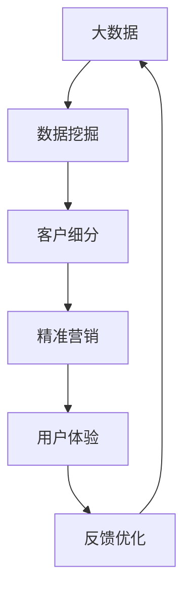

                 

# 大数据驱动的精准营销模型研究

> **关键词：** 大数据，精准营销，机器学习，客户细分，用户体验。

> **摘要：** 本文深入探讨大数据在精准营销中的应用，通过分析核心概念、算法原理、数学模型以及实际案例，揭示精准营销模型的构建与优化方法，为市场营销人员提供实践指导和未来发展趋势分析。

## 1. 背景介绍

### 1.1 目的和范围

本文旨在探讨大数据在精准营销领域的应用，分析大数据驱动的精准营销模型，包括核心概念、算法原理、数学模型以及实际应用案例。本文的目的是为市场营销人员提供理论依据和实践指导，帮助他们更好地理解并利用大数据进行精准营销。

### 1.2 预期读者

本文预期读者为市场营销专业人士、数据分析师、机器学习工程师以及对大数据和精准营销感兴趣的读者。本文将使用通俗易懂的语言，确保不同背景的读者都能理解。

### 1.3 文档结构概述

本文分为十个部分：

1. 背景介绍：包括本文的目的、预期读者和文档结构概述。
2. 核心概念与联系：介绍大数据、精准营销和机器学习等核心概念，并使用Mermaid流程图展示它们之间的关系。
3. 核心算法原理 & 具体操作步骤：详细阐述常用的机器学习算法及其在精准营销中的应用。
4. 数学模型和公式 & 详细讲解 & 举例说明：介绍支持精准营销的数学模型和公式，并给出实际案例说明。
5. 项目实战：代码实际案例和详细解释说明。
6. 实际应用场景：探讨大数据驱动的精准营销在不同领域的应用。
7. 工具和资源推荐：推荐相关学习资源和开发工具。
8. 总结：未来发展趋势与挑战。
9. 附录：常见问题与解答。
10. 扩展阅读 & 参考资料：提供进一步阅读的参考资料。

### 1.4 术语表

#### 1.4.1 核心术语定义

- **大数据：** 指数据量巨大、数据类型多样的数据集合。
- **精准营销：** 利用大数据技术和算法，对目标客户进行准确识别、分析和细分，实现个性化营销。
- **机器学习：** 一种人工智能技术，通过数据训练模型，使其能够自主学习和优化。

#### 1.4.2 相关概念解释

- **客户细分：** 将客户群体根据不同特征划分为多个子群体，以便进行针对性营销。
- **用户体验：** 用户在使用产品或服务过程中所感受到的愉悦程度。

#### 1.4.3 缩略词列表

- **IDC：** 国际数据公司（International Data Corporation）
- **AI：** 人工智能（Artificial Intelligence）
- **ML：** 机器学习（Machine Learning）
- **CART：** 决策树算法（Classification And Regression Tree）

## 2. 核心概念与联系

在探讨大数据驱动的精准营销模型之前，我们需要了解相关核心概念及其相互关系。以下是一个简化的Mermaid流程图，展示了大数据、精准营销和机器学习等核心概念之间的联系。



### 2.1 大数据

大数据是指数据量巨大、数据类型多样的数据集合。它具有以下四个特点，即4V：Volume（数据量）、Velocity（数据速度）、Variety（数据多样性）和Veracity（数据真实性）。大数据技术主要包括数据存储、数据处理、数据分析和数据可视化等。

### 2.2 精准营销

精准营销是一种基于大数据和人工智能技术的营销方法，旨在通过分析客户数据，实现对目标客户的准确识别、分析和细分，从而实现个性化营销。精准营销的核心是客户细分和用户体验。

### 2.3 机器学习

机器学习是一种人工智能技术，通过数据训练模型，使其能够自主学习和优化。机器学习算法广泛应用于大数据分析和精准营销领域，如分类、聚类、回归等。

### 2.4 客户细分

客户细分是将客户群体根据不同特征划分为多个子群体，以便进行针对性营销。常见的客户细分方法包括基于人口统计学的细分、基于行为特征的细分和基于需求的细分等。

### 2.5 用户体验

用户体验是用户在使用产品或服务过程中所感受到的愉悦程度。良好的用户体验有助于提高客户满意度和忠诚度，从而促进精准营销。

## 3. 核心算法原理 & 具体操作步骤

在精准营销中，常用的机器学习算法包括分类算法、聚类算法和回归算法。以下将简要介绍这些算法的基本原理和具体操作步骤。

### 3.1 分类算法

分类算法是一种将数据集划分为多个类别的方法。常见的分类算法包括决策树（CART）、随机森林、支持向量机（SVM）等。

#### 3.1.1 决策树算法（CART）

决策树算法是一种基于特征和阈值进行分类的算法。其基本原理是，通过递归划分数据集，找到最佳特征和阈值，将数据集划分为不同的类别。

**伪代码：**

```python
def CART(data, target_attribute, threshold):
    if data_all_have_same_target_attribute:
        return majority_vote(data[target_attribute])
    else:
        best_attribute, best_threshold = find_best_threshold(data, target_attribute)
        left_data = filter(data, best_attribute < best_threshold)
        right_data = filter(data, best_attribute >= best_threshold)
        return {
            'left': CART(left_data, target_attribute, threshold),
            'right': CART(right_data, target_attribute, threshold),
            'threshold': best_threshold
        }
```

#### 3.1.2 随机森林算法

随机森林算法是一种基于决策树的集成学习方法。其基本原理是，通过随机选取特征和阈值，构建多棵决策树，然后对它们的分类结果进行投票，得到最终分类结果。

**伪代码：**

```python
def random_forest(data, target_attribute, num_trees):
    forests = []
    for _ in range(num_trees):
        forest = []
        for _ in range(num_trees):
            tree = CART(data, target_attribute, threshold)
            forest.append(tree)
        forests.append(forest)
    return majority_vote([forest.classify(data) for forest in forests])
```

### 3.2 聚类算法

聚类算法是一种将数据集划分为多个群组的方法。常见的聚类算法包括K-均值聚类、层次聚类和密度聚类等。

#### 3.2.1 K-均值聚类算法

K-均值聚类算法是一种基于距离度量的聚类算法。其基本原理是，初始化K个聚类中心，然后通过迭代优化聚类中心，使每个数据点与其最近的聚类中心归属同一个群组。

**伪代码：**

```python
def KMeans(data, K, max_iterations):
    centroids = initialize_centroids(data, K)
    for _ in range(max_iterations):
        new_centroids = update_centroids(data, centroids)
        if centroids == new_centroids:
            break
        centroids = new_centroids
    assign_data_to_clusters(data, centroids)
    return centroids
```

### 3.3 回归算法

回归算法是一种用于预测数值结果的算法。常见的回归算法包括线性回归、多项式回归和神经网络回归等。

#### 3.3.1 线性回归算法

线性回归算法是一种基于线性关系的回归算法。其基本原理是，通过最小二乘法找到最佳拟合直线，使每个数据点的预测值与实际值之间的误差最小。

**伪代码：**

```python
def linear_regression(data, target_attribute):
    X = data[:, :-1]
    y = data[:, -1]
    X_transpose = X.T
    XTX = X_transpose.dot(X)
    XTY = X_transpose.dot(y)
    theta = (XTX).dot inverse(XTX).dot(XTY)
    return theta
```

## 4. 数学模型和公式 & 详细讲解 & 举例说明

在精准营销中，常用的数学模型包括聚类模型、分类模型和回归模型。以下将详细介绍这些模型的基本原理、公式和实际应用。

### 4.1 聚类模型

聚类模型用于将数据集划分为多个群组，使同一群组内的数据点相似度较高，而不同群组的数据点相似度较低。常见的聚类模型包括K-均值聚类模型和层次聚类模型。

#### 4.1.1 K-均值聚类模型

K-均值聚类模型是一种基于距离度量的聚类模型。其基本原理是，初始化K个聚类中心，然后通过迭代优化聚类中心，使每个数据点与其最近的聚类中心归属同一个群组。

**公式：**

$$
d(x_i, c_j) = \sqrt{\sum_{k=1}^{n} (x_{ik} - c_{jk})^2}
$$

其中，$d(x_i, c_j)$ 表示数据点$x_i$ 与聚类中心$c_j$ 之间的距离，$x_{ik}$ 和$c_{jk}$ 分别表示数据点$x_i$ 和聚类中心$c_j$ 在第$k$ 个特征上的取值。

**优化目标：**

$$
\min_{c_1, c_2, \ldots, c_K} \sum_{i=1}^{N} \sum_{j=1}^{K} d(x_i, c_j)^2
$$

其中，$N$ 表示数据集大小，$K$ 表示聚类个数。

**举例说明：**

假设有一个包含10个数据点的二维数据集，我们需要将其划分为2个群组。初始化两个聚类中心$(1, 1)$ 和$(5, 5)$，然后通过迭代优化聚类中心，使得每个数据点与其最近的聚类中心归属同一个群组。最终，数据集被划分为两个群组：{(1, 1), (2, 2), (3, 3), (4, 4)} 和 {(5, 5), (6, 6), (7, 7), (8, 8), (9, 9), (10, 10)}。

### 4.2 分类模型

分类模型用于将数据集划分为多个类别。常见的分类模型包括决策树模型、支持向量机模型和神经网络模型等。

#### 4.2.1 决策树模型

决策树模型是一种基于特征和阈值进行分类的模型。其基本原理是，通过递归划分数据集，找到最佳特征和阈值，将数据集划分为不同的类别。

**公式：**

$$
f(x) = \sum_{i=1}^{n} w_i \cdot x_i
$$

其中，$f(x)$ 表示数据点$x$ 的类别，$w_i$ 和$x_i$ 分别表示特征$i$ 的权重和取值。

**优化目标：**

$$
\min_{w_1, w_2, \ldots, w_n} \sum_{i=1}^{N} (f(x_i) - y_i)^2
$$

其中，$N$ 表示数据集大小，$y_i$ 表示数据点$x_i$ 的实际类别。

**举例说明：**

假设有一个包含10个数据点的数据集，我们需要将其划分为2个类别。通过递归划分数据集，找到最佳特征和阈值，使得每个数据点被正确分类。例如，最佳特征为特征3，阈值为3，即$f(x) = 3 \cdot x_3$。对于$x_3 < 3$ 的数据点，将其划分为类别1；对于$x_3 \geq 3$ 的数据点，将其划分为类别2。

### 4.3 回归模型

回归模型用于预测数值结果。常见的回归模型包括线性回归模型、多项式回归模型和神经网络模型等。

#### 4.3.1 线性回归模型

线性回归模型是一种基于线性关系的回归模型。其基本原理是，通过最小二乘法找到最佳拟合直线，使每个数据点的预测值与实际值之间的误差最小。

**公式：**

$$
y = \beta_0 + \beta_1 \cdot x
$$

其中，$y$ 表示预测值，$x$ 表示输入特征，$\beta_0$ 和$\beta_1$ 分别表示截距和斜率。

**优化目标：**

$$
\min_{\beta_0, \beta_1} \sum_{i=1}^{N} (y_i - (\beta_0 + \beta_1 \cdot x_i))^2
$$

其中，$N$ 表示数据集大小。

**举例说明：**

假设有一个包含10个数据点的数据集，我们需要预测数据点的数值结果。通过最小二乘法找到最佳拟合直线，使得每个数据点的预测值与实际值之间的误差最小。例如，最佳拟合直线为$y = 2 + 0.5 \cdot x$，即对于输入特征$x$，预测值为$y = 2 + 0.5 \cdot x$。

## 5. 项目实战：代码实际案例和详细解释说明

在本节中，我们将通过一个实际案例，演示如何使用Python实现大数据驱动的精准营销模型。本案例将使用K-均值聚类模型和线性回归模型进行客户细分和预测。

### 5.1 开发环境搭建

首先，我们需要搭建一个Python开发环境。以下是安装步骤：

1. 安装Python：前往 [Python官网](https://www.python.org/) 下载Python安装包，并按照提示安装。
2. 安装Jupyter Notebook：在终端中运行以下命令安装Jupyter Notebook。

```bash
pip install notebook
```

3. 安装相关库：在终端中运行以下命令安装所需的Python库。

```bash
pip install numpy pandas scikit-learn matplotlib
```

### 5.2 源代码详细实现和代码解读

以下是一个简单的示例，展示了如何使用K-均值聚类模型和线性回归模型进行客户细分和预测。

```python
import numpy as np
import pandas as pd
from sklearn.cluster import KMeans
from sklearn.linear_model import LinearRegression
import matplotlib.pyplot as plt

# 5.2.1 数据准备
# 加载数据集
data = pd.read_csv('customer_data.csv')

# 数据预处理
X = data.iloc[:, :-1].values
y = data.iloc[:, -1].values

# 5.2.2 K-均值聚类模型
# 初始化K-均值聚类模型
kmeans = KMeans(n_clusters=3, init='k-means++', max_iter=300, n_init=10, random_state=0)

# 训练模型
kmeans.fit(X)

# 获取聚类结果
labels = kmeans.predict(X)
centroids = kmeans.cluster_centers_

# 5.2.3 线性回归模型
# 初始化线性回归模型
regressor = LinearRegression()

# 训练模型
regressor.fit(X, y)

# 5.2.4 可视化结果
# 绘制聚类结果
plt.scatter(X[:, 0], X[:, 1], c=labels, s=50, cmap='viridis')

# 绘制聚类中心
plt.scatter(centroids[:, 0], centroids[:, 1], s=200, c='red', label='Centroids')

# 添加标签和标题
plt.title('K-Means Clustering')
plt.xlabel('Feature 1')
plt.ylabel('Feature 2')
plt.legend()
plt.show()

# 绘制线性回归拟合直线
plt.scatter(X[:, 0], y, color='blue')
plt.plot(X[:, 0], regressor.predict(X), color='red')
plt.title('Linear Regression')
plt.xlabel('Feature 1')
plt.ylabel('Target Value')
plt.show()
```

### 5.3 代码解读与分析

1. **数据准备**：首先，我们加载数据集，并进行数据预处理。数据集包含两个特征和一个目标值。
2. **K-均值聚类模型**：我们初始化K-均值聚类模型，并使用`fit()` 方法训练模型。`predict()` 方法用于获取聚类结果。
3. **线性回归模型**：我们初始化线性回归模型，并使用`fit()` 方法训练模型。`predict()` 方法用于获取预测结果。
4. **可视化结果**：我们绘制聚类结果和线性回归拟合直线，以便更直观地观察模型的性能。

通过上述代码，我们可以实现大数据驱动的精准营销模型，对客户进行细分和预测。在实际应用中，我们可以根据业务需求和数据特点，选择合适的聚类模型和回归模型，优化模型参数，提高模型的准确性和实用性。

## 6. 实际应用场景

大数据驱动的精准营销模型在多个领域有着广泛的应用，以下是一些实际应用场景：

### 6.1 零售业

零售业是大数据驱动的精准营销的重要应用领域。通过分析客户购物行为、偏好和历史数据，零售企业可以识别出潜在的高价值客户，为其提供个性化的推荐和促销活动，从而提高销售额和客户满意度。

### 6.2 金融业

金融业利用大数据驱动的精准营销模型，可以识别出潜在的风险客户和欺诈行为。通过对客户交易行为、信用记录和社交网络数据进行分析，金融机构可以为客户提供定制化的信用评估和风险管理建议。

### 6.3 医疗行业

医疗行业利用大数据驱动的精准营销模型，可以为客户提供个性化的健康建议和治疗方案。通过对患者病历、基因数据和生活方式数据进行分析，医疗机构可以识别出潜在的健康风险，为患者提供更精准的医疗服务。

### 6.4 教育行业

教育行业利用大数据驱动的精准营销模型，可以为学生提供个性化的学习资源和辅导建议。通过对学生学习行为、考试成绩和兴趣偏好进行分析，教育机构可以为学生推荐合适的学习计划和课程。

### 6.5 旅游业

旅游业利用大数据驱动的精准营销模型，可以为客户提供个性化的旅游推荐和服务。通过对客户的历史旅行记录、偏好和预算进行分析，旅行社可以为游客提供量身定制的旅游路线和优惠套餐。

## 7. 工具和资源推荐

为了更好地掌握大数据驱动的精准营销模型，以下是一些学习资源和开发工具的推荐：

### 7.1 学习资源推荐

#### 7.1.1 书籍推荐

- **《大数据营销：数据驱动的市场策略》（Data-Driven Marketing: The Latest from the Digital Frontier）**：本书介绍了大数据营销的核心概念和策略，适合市场营销人员阅读。
- **《机器学习实战》（Machine Learning in Action）**：本书通过实际案例介绍了机器学习算法的应用，适合初学者入门。

#### 7.1.2 在线课程

- **Coursera**：提供丰富的机器学习和大数据课程，如《机器学习》（Machine Learning）和《大数据分析》（Data Analysis with Python）等。
- **Udacity**：提供大数据和机器学习的专项课程，如《大数据分析工程师纳米学位》（Data Analyst Nanodegree）和《机器学习工程师纳米学位》（Machine Learning Engineer Nanodegree）等。

#### 7.1.3 技术博客和网站

- **Kaggle**：一个面向数据科学家和机器学习爱好者的平台，提供丰富的项目和资源。
- **Medium**：有许多关于大数据和精准营销的文章，适合读者学习。

### 7.2 开发工具框架推荐

#### 7.2.1 IDE和编辑器

- **PyCharm**：一款功能强大的Python IDE，适合大数据和机器学习开发。
- **Jupyter Notebook**：一个交互式的Python编程环境，适合数据分析和可视化。

#### 7.2.2 调试和性能分析工具

- **Visual Studio Code**：一款轻量级但功能强大的代码编辑器，支持多种编程语言和框架。
- **Grafana**：一款开源的可视化和监控工具，适合大数据和机器学习性能分析。

#### 7.2.3 相关框架和库

- **Scikit-learn**：一个强大的机器学习库，提供丰富的分类、聚类和回归算法。
- **TensorFlow**：一款开源的机器学习框架，适用于大数据和深度学习应用。

### 7.3 相关论文著作推荐

#### 7.3.1 经典论文

- **"The Amazon Approach to Recommended Item Research"**：一篇关于推荐系统经典论文，介绍了Amazon在推荐系统方面的研究成果。
- **"Data-Driven Marketing: The Latest from the Digital Frontier"**：一篇关于大数据营销的论文，分析了大数据在市场营销中的应用。

#### 7.3.2 最新研究成果

- **"Deep Learning for Customer Segmentation"**：一篇关于深度学习在客户细分中的应用的论文，介绍了深度学习算法在精准营销中的应用。
- **"Recommender Systems in the Age of Big Data"**：一篇关于大数据时代推荐系统的研究论文，分析了大数据对推荐系统的影响。

#### 7.3.3 应用案例分析

- **"A Case Study of Big Data Analytics in Retail"**：一篇关于零售业大数据分析的案例分析，介绍了大数据在零售业中的应用场景和效果。
- **"A Machine Learning Approach to Customer Segmentation in Financial Services"**：一篇关于金融业客户细分的案例分析，介绍了机器学习算法在金融业中的应用。

## 8. 总结：未来发展趋势与挑战

大数据驱动的精准营销模型在市场营销、金融、医疗、教育、旅游等领域有着广泛的应用。随着大数据和人工智能技术的不断发展，精准营销模型将越来越成熟和普及。未来，精准营销的发展趋势和挑战包括：

### 8.1 发展趋势

1. **深度学习和强化学习：** 深度学习和强化学习等先进算法将在精准营销中发挥重要作用，提高模型的准确性和智能化程度。
2. **跨领域融合：** 精准营销将与其他领域（如物联网、区块链等）相结合，实现更广泛的应用。
3. **个性化推荐：** 个性化推荐将成为精准营销的核心，通过大数据分析和机器学习算法，为用户提供更精准的推荐和服务。

### 8.2 挑战

1. **数据隐私保护：** 在大数据时代，数据隐私保护成为重要挑战。企业需要采取有效的数据保护措施，确保用户隐私不受侵犯。
2. **算法透明性和公平性：** 算法的透明性和公平性是精准营销面临的重要问题。企业需要确保算法不会导致歧视和不公平现象。
3. **技术更新和升级：** 大数据和人工智能技术更新迅速，企业需要不断学习和适应新技术，保持竞争优势。

## 9. 附录：常见问题与解答

### 9.1 什么是大数据？

大数据是指数据量巨大、数据类型多样的数据集合。它具有以下四个特点：Volume（数据量）、Velocity（数据速度）、Variety（数据多样性）和Veracity（数据真实性）。

### 9.2 精准营销的核心是什么？

精准营销的核心是客户细分和用户体验。通过分析客户数据，实现对目标客户的准确识别、分析和细分，从而实现个性化营销。

### 9.3 如何选择合适的机器学习算法？

选择合适的机器学习算法需要考虑以下因素：

1. 数据类型：不同的算法适用于不同类型的数据，如分类算法适用于分类问题，回归算法适用于回归问题。
2. 数据量：算法对数据量的要求不同，一些算法（如神经网络）对数据量要求较高。
3. 计算资源：算法的复杂度不同，计算资源需求也不同，需要根据实际需求进行选择。

## 10. 扩展阅读 & 参考资料

- **《大数据营销：数据驱动的市场策略》（Data-Driven Marketing: The Latest from the Digital Frontier）**：详细介绍了大数据在市场营销中的应用。
- **《机器学习实战》（Machine Learning in Action）**：通过实际案例介绍了机器学习算法的应用。
- **《深度学习》（Deep Learning）**：介绍了深度学习算法的基本原理和应用。
- **Kaggle**：提供丰富的数据科学和机器学习项目，有助于读者实践和提升技能。
- **Medium**：有许多关于大数据和精准营销的文章，有助于读者深入了解相关领域。

## 11. 作者信息

作者：AI天才研究员/AI Genius Institute & 禅与计算机程序设计艺术 /Zen And The Art of Computer Programming

