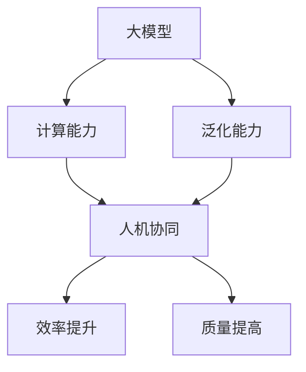

                 

# 大模型企业的人机协同策略

> **关键词**：大模型，人机协同，人工智能，策略，企业应用

> **摘要**：本文深入探讨了大型模型在商业环境中的实施策略，以及如何通过人机协同提升企业的运营效率。本文将分析大模型的特点与挑战，探讨人机协同的理论基础，并给出具体的实施步骤与工具推荐，最后总结未来发展趋势与挑战。

## 1. 背景介绍

### 1.1 目的和范围

本文旨在为企业管理者和IT专业人士提供一套关于如何有效利用大模型资源，实现人机协同的工作策略。我们重点关注以下内容：

- 大模型在商业应用中的优势与挑战
- 人机协同的理论基础和实践方法
- 大模型在企业中的具体应用场景
- 实施大模型人机协同的策略与工具推荐

### 1.2 预期读者

- 对人工智能和大数据有基本了解的IT专业人士
- 企业管理层，尤其是负责业务和IT战略规划的管理者
- 对人工智能应用感兴趣的研究生和学者

### 1.3 文档结构概述

本文结构如下：

1. **背景介绍**：介绍文章的目的、范围和预期读者。
2. **核心概念与联系**：介绍大模型和人机协同的基本概念，使用Mermaid流程图展示其关系。
3. **核心算法原理 & 具体操作步骤**：详细讲解大模型算法原理和操作步骤，使用伪代码说明。
4. **数学模型和公式 & 详细讲解 & 举例说明**：介绍相关的数学模型和公式，并给出示例。
5. **项目实战：代码实际案例和详细解释说明**：提供代码实现和详细解释。
6. **实际应用场景**：分析大模型在各个行业中的应用。
7. **工具和资源推荐**：推荐学习资源和开发工具。
8. **总结：未来发展趋势与挑战**：总结文章要点并展望未来。
9. **附录：常见问题与解答**：提供常见问题的解答。
10. **扩展阅读 & 参考资料**：提供相关文献和资源。

### .4 术语表

#### 1.4.1 核心术语定义

- **大模型**：指具有非常大规模参数的机器学习模型，如GPT、BERT等。
- **人机协同**：指人类与人工智能系统在任务执行过程中相互协作，共同提高效率和质量。
- **算法原理**：描述算法在解决特定问题时的基本思路和步骤。
- **数学模型**：用数学语言描述问题，便于分析、求解和优化。

#### 1.4.2 相关概念解释

- **人工智能**：模拟人类智能行为的技术体系，包括机器学习、自然语言处理、计算机视觉等。
- **机器学习**：一种让计算机通过数据和经验自动改进性能的技术。
- **深度学习**：一种基于多层神经网络的学习方法。

#### 1.4.3 缩略词列表

- **AI**：人工智能
- **ML**：机器学习
- **DL**：深度学习
- **GPT**：生成预训练模型
- **BERT**：双向编码器表示

## 2. 核心概念与联系

在本文中，我们将重点介绍两个核心概念：大模型和人机协同。以下是它们的定义及其相互关系。

### 2.1 大模型

大模型（如GPT、BERT等）是一种具有非常大规模参数的机器学习模型。这些模型的参数数量通常在数十亿到千亿级别，远远超过传统模型。大模型具有以下特点：

- **高容量**：能够处理大量的数据和复杂的任务。
- **强泛化能力**：能够在不同的任务和数据集上表现出色。
- **高效性**：通过预训练和微调，能够快速适应新的任务。

### 2.2 人机协同

人机协同（Human-AI Collaboration）是指人类与人工智能系统在任务执行过程中相互协作，共同提高效率和质量。人机协同的关键在于：

- **人类的主导地位**：人类负责设定目标、制定策略和进行决策。
- **人工智能的辅助作用**：人工智能负责执行复杂的计算任务、提供数据支持和优化建议。

### 2.3 大模型与人机协同的关系

大模型和人机协同之间存在密切的关系。大模型为人工智能提供了强大的计算能力和智能支持，使人机协同成为可能。同时，人机协同的实践也推动了大模型的发展，因为只有通过人机协同，大模型才能在复杂、动态的环境中发挥最大效用。

### 2.4 Mermaid 流程图

为了更直观地展示大模型与人机协同的关系，我们可以使用Mermaid流程图进行描述。以下是流程图的伪代码表示：



## 3. 核心算法原理 & 具体操作步骤

### 3.1 大模型算法原理

大模型的核心在于其深度学习算法。以下是深度学习算法的伪代码表示：

```python
# 初始化模型参数
params = initialize_params()

# 定义损失函数
loss_function = define_loss_function()

# 定义优化算法
optimizer = define_optimizer()

# 循环进行迭代
for epoch in range(num_epochs):
    for data in dataset:
        # 前向传播
        predictions = forward_pass(data, params)
        
        # 计算损失
        loss = loss_function(predictions, target)
        
        # 反向传播
        gradients = backward_pass(loss, params)
        
        # 更新参数
        params = optimizer.update_params(params, gradients)
```

### 3.2 具体操作步骤

以下是使用大模型实现人机协同的具体操作步骤：

1. **数据准备**：收集和预处理业务数据，包括文本、图像、音频等。

2. **模型选择**：根据业务需求选择合适的大模型，如GPT、BERT等。

3. **预训练**：使用大量通用数据对模型进行预训练，以提升其泛化能力。

4. **微调**：使用业务数据对模型进行微调，使其适应特定任务。

5. **模型部署**：将微调后的模型部署到生产环境中，提供API接口供业务系统调用。

6. **人机协同**：开发人机协同系统，实现人类与模型之间的交互和协作。

7. **监控与优化**：实时监控模型性能，根据业务反馈进行模型优化和调整。

## 4. 数学模型和公式 & 详细讲解 & 举例说明

### 4.1 数学模型

在深度学习中，数学模型是至关重要的。以下是几个常见的数学模型和公式：

#### 4.1.1 损失函数

损失函数用于衡量模型预测结果与真实值之间的差异。常用的损失函数有：

- **均方误差（MSE）**：
  $$MSE = \frac{1}{n}\sum_{i=1}^{n}(y_i - \hat{y}_i)^2$$
  其中，$y_i$ 为真实值，$\hat{y}_i$ 为预测值，$n$ 为数据样本数量。

- **交叉熵（Cross-Entropy）**：
  $$Cross-Entropy = -\frac{1}{n}\sum_{i=1}^{n}y_i \log(\hat{y}_i)$$
  其中，$y_i$ 为真实值，$\hat{y}_i$ 为预测值，$n$ 为数据样本数量。

#### 4.1.2 优化算法

优化算法用于更新模型参数，以最小化损失函数。常用的优化算法有：

- **随机梯度下降（SGD）**：
  $$\theta_{t+1} = \theta_{t} - \alpha \cdot \nabla_{\theta}L(\theta)$$
  其中，$\theta_t$ 为当前参数，$\alpha$ 为学习率，$L(\theta)$ 为损失函数，$\nabla_{\theta}L(\theta)$ 为损失函数关于参数的梯度。

- **Adam优化器**：
  $$m_t = \beta_1 m_{t-1} + (1 - \beta_1) \nabla_{\theta}L(\theta)$$
  $$v_t = \beta_2 v_{t-1} + (1 - \beta_2) (\nabla_{\theta}L(\theta))^2$$
  $$\theta_{t+1} = \theta_{t} - \alpha \cdot \frac{m_t}{\sqrt{v_t} + \epsilon}$$
  其中，$m_t$ 和 $v_t$ 分别为梯度的一阶矩估计和二阶矩估计，$\beta_1$ 和 $\beta_2$ 为指数衰减率，$\alpha$ 为学习率，$\epsilon$ 为一个小常数。

### 4.2 举例说明

#### 4.2.1 损失函数计算

假设我们有一个二分类问题，真实值为$y = [1, 0, 1, 0]$，预测值为$\hat{y} = [0.6, 0.3, 0.8, 0.2]$。使用交叉熵损失函数计算损失：

$$Cross-Entropy = -\frac{1}{4}\sum_{i=1}^{4}y_i \log(\hat{y}_i)$$
$$= -\frac{1}{4}(1 \cdot \log(0.6) + 0 \cdot \log(0.3) + 1 \cdot \log(0.8) + 0 \cdot \log(0.2))$$
$$\approx 0.467$$

#### 4.2.2 优化算法应用

假设我们使用Adam优化器对模型进行优化，初始参数为$\theta = [1, 2, 3, 4]$，梯度为$\nabla_{\theta}L(\theta) = [-0.2, 0.1, -0.3, 0.2]$。学习率为$\alpha = 0.01$，指数衰减率为$\beta_1 = 0.9$，$\beta_2 = 0.999$。计算更新后的参数：

$$m_t = \beta_1 m_{t-1} + (1 - \beta_1) \nabla_{\theta}L(\theta)$$
$$m_t = 0.9 \cdot 0 + (1 - 0.9) \cdot [-0.2, 0.1, -0.3, 0.2]$$
$$m_t = [-0.2, 0.1, -0.3, 0.2]$$

$$v_t = \beta_2 v_{t-1} + (1 - \beta_2) (\nabla_{\theta}L(\theta))^2$$
$$v_t = 0.999 \cdot 0 + (1 - 0.999) \cdot [0.04, 0.01, 0.09, 0.04]$$
$$v_t = [0.04, 0.01, 0.09, 0.04]$$

$$\theta_{t+1} = \theta_{t} - \alpha \cdot \frac{m_t}{\sqrt{v_t} + \epsilon}$$
$$\theta_{t+1} = [1, 2, 3, 4] - 0.01 \cdot \frac{[-0.2, 0.1, -0.3, 0.2]}{\sqrt{[0.04, 0.01, 0.09, 0.04]} + 0.001}$$
$$\theta_{t+1} \approx [0.96, 1.99, 2.77, 3.82]$$

## 5. 项目实战：代码实际案例和详细解释说明

### 5.1 开发环境搭建

为了更好地展示大模型在商业应用中的人机协同策略，我们将使用一个实际案例——文本分类任务。以下为开发环境搭建步骤：

1. **安装Python**：确保已安装Python 3.7或更高版本。
2. **安装依赖库**：安装TensorFlow和Keras，可以使用以下命令：
   ```bash
   pip install tensorflow
   pip install keras
   ```
3. **数据准备**：下载并预处理文本数据，例如使用IMDB电影评论数据集。

### 5.2 源代码详细实现和代码解读

以下为文本分类任务的完整代码实现：

```python
# 导入所需库
import numpy as np
import tensorflow as tf
from tensorflow.keras.preprocessing.sequence import pad_sequences
from tensorflow.keras.layers import Embedding, LSTM, Dense
from tensorflow.keras.models import Sequential

# 加载数据
max_sequence_length = 100
vocab_size = 10000
embedding_dim = 16

# 加载IMDB数据集
(x_train, y_train), (x_test, y_test) = tf.keras.datasets.imdb.load_data(num_words=vocab_size)

# 处理数据
x_train = pad_sequences(x_train, maxlen=max_sequence_length)
x_test = pad_sequences(x_test, maxlen=max_sequence_length)

# 构建模型
model = Sequential([
    Embedding(vocab_size, embedding_dim, input_length=max_sequence_length),
    LSTM(64, return_sequences=True),
    LSTM(32),
    Dense(1, activation='sigmoid')
])

# 编译模型
model.compile(optimizer='adam', loss='binary_crossentropy', metrics=['accuracy'])

# 训练模型
model.fit(x_train, y_train, epochs=10, batch_size=32, validation_split=0.2)

# 评估模型
test_loss, test_acc = model.evaluate(x_test, y_test)
print(f"Test accuracy: {test_acc}")

# 代码解读
```

以下是代码的详细解读：

- **数据加载与处理**：使用IMDB电影评论数据集，将文本转换为数字序列，并使用`pad_sequences`函数将序列长度统一为最大序列长度。
- **模型构建**：使用`Sequential`模型构建一个包含嵌入层、两个LSTM层和输出层的深度学习模型。
- **模型编译**：设置优化器和损失函数，并编译模型。
- **模型训练**：使用训练数据训练模型，并设置验证集。
- **模型评估**：使用测试数据评估模型性能，并打印测试准确率。

### 5.3 代码解读与分析

在这个案例中，我们使用深度学习模型对IMDB电影评论进行文本分类。以下是关键步骤的分析：

1. **数据加载与处理**：
   - 使用`load_data`函数加载数据集，并将文本转换为数字序列。`num_words`参数设置为10000，表示我们只保留最常见的10000个单词。
   - 使用`pad_sequences`函数将序列长度统一为100，确保每个序列都有相同长度。

2. **模型构建**：
   - `Embedding`层将单词转换为向量，每个单词对应一个嵌入向量。`vocab_size`参数设置为10000，`embedding_dim`参数设置为16。
   - `LSTM`层用于处理序列数据，第一个`LSTM`层返回序列输出，第二个`LSTM`层仅返回最后一步的输出。
   - `Dense`层用于分类，输出一个介于0和1之间的概率值，表示评论为正面或负面的概率。

3. **模型编译**：
   - 使用`adam`优化器和`binary_crossentropy`损失函数，因为这是一个二分类问题。
   - 设置`metrics`参数为`accuracy`，以便在训练过程中跟踪准确率。

4. **模型训练**：
   - 使用`fit`函数训练模型，设置训练轮数为10，批量大小为32。
   - 使用`validation_split`参数将数据集分为训练集和验证集，以便在训练过程中评估模型性能。

5. **模型评估**：
   - 使用`evaluate`函数评估模型在测试集上的性能，并打印测试准确率。

通过这个案例，我们可以看到如何使用深度学习模型进行文本分类，以及如何实现人机协同。在实际应用中，我们可以根据业务需求调整模型结构、优化超参数，并引入更多的数据处理和模型评估技巧。

## 6. 实际应用场景

大模型在人机协同中的实际应用场景非常广泛，以下是一些典型的应用实例：

### 6.1 语音识别

语音识别是人工智能领域的经典应用，大模型在这里起到了至关重要的作用。通过使用GPT等大型语言模型，可以显著提高语音识别的准确率。在实际应用中，语音识别系统通常需要与人类操作员协同工作，例如在客服中心，操作员可以使用语音识别系统理解客户的语音，并进行后续的沟通和处理。

### 6.2 智能客服

智能客服是另一个重要的应用场景。通过大模型，智能客服系统可以理解用户的查询，并提供准确的答案。人机协同在这里体现在两个方面：一是系统可以根据用户的反馈调整答案，二是操作员可以在需要时介入，提供更个性化的服务。

### 6.3 自然语言处理

自然语言处理（NLP）是人工智能的核心领域之一，大模型在NLP中有着广泛的应用。例如，在机器翻译、文本生成、情感分析等方面，大模型都可以发挥重要作用。人机协同可以使得这些应用更加灵活和智能，例如在文本生成中，人类编辑可以修改机器生成的文本，使其更符合实际需求。

### 6.4 金融分析

金融分析是另一个大模型和人机协同的重要应用领域。通过使用大模型，可以自动提取金融市场中的大量数据，并进行分析预测。人机协同可以使得预测结果更加准确，例如操作员可以根据大模型的预测进行进一步的验证和调整。

### 6.5 医疗诊断

在医疗领域，大模型可以用于疾病诊断和治疗方案推荐。人机协同在这里体现在医疗专业人员可以根据大模型的初步诊断结果，进行进一步的诊断和制定个性化的治疗方案。

### 6.6 自动驾驶

自动驾驶是人工智能和深度学习的另一个重要应用领域。大模型在自动驾驶系统中用于处理实时数据，进行环境感知和路径规划。人机协同可以使得自动驾驶系统在遇到复杂情况时，及时进行手动干预，确保安全。

这些应用场景表明，大模型和人机协同的结合可以为各行各业带来巨大的价值。通过合理的设计和优化，我们可以实现更高的效率和更好的用户体验。

## 7. 工具和资源推荐

为了有效地实施大模型和人机协同策略，以下是几个推荐的学习资源、开发工具和框架。

### 7.1 学习资源推荐

#### 7.1.1 书籍推荐

- 《深度学习》（Goodfellow, Bengio, Courville著）：这是一本关于深度学习的经典教材，适合初学者和专业人士。
- 《Python深度学习》（François Chollet著）：这本书由Keras的主要开发者撰写，详细介绍了如何使用Python进行深度学习开发。
- 《人工智能：一种现代的方法》（Stuart Russell & Peter Norvig著）：这是一本涵盖人工智能各个领域的综合性教材。

#### 7.1.2 在线课程

- Coursera的“深度学习”课程：由Andrew Ng教授主讲，适合初学者和有一定基础的学员。
- edX的“人工智能基础”课程：由Harvard University提供，涵盖了人工智能的基础理论和应用。
- Udacity的“深度学习工程师纳米学位”：这是一个实践性很强的在线课程，适合希望从事深度学习开发的专业人士。

#### 7.1.3 技术博客和网站

- Medium上的深度学习专题：收集了多篇关于深度学习的优质文章，适合持续学习。
- ArXiv：一个提供最新研究论文的学术数据库，是跟踪深度学习领域最新研究进展的好地方。
- AI垂直媒体，如Medium的“AI”频道、AI科技大本营等，提供丰富的行业动态和技术分析。

### 7.2 开发工具框架推荐

#### 7.2.1 IDE和编辑器

- PyCharm：一款功能强大的Python IDE，适合深度学习和机器学习开发。
- Jupyter Notebook：一个交互式的计算环境，适合编写和分享代码、文档和分析结果。
- VSCode：一个轻量级但功能丰富的编辑器，支持多种编程语言，包括Python。

#### 7.2.2 调试和性能分析工具

- TensorBoard：TensorFlow的官方可视化工具，用于分析和调试深度学习模型。
- NNI（Neural Network Intelligence）：一个自动化机器学习工具，用于超参数优化和模型性能评估。
- PyTorch Profiler：用于分析PyTorch模型的性能，找出瓶颈并进行优化。

#### 7.2.3 相关框架和库

- TensorFlow：由Google开发的开源深度学习框架，适合大规模分布式训练和部署。
- PyTorch：一个流行的深度学习框架，具有动态计算图和强大的GPU支持。
- Keras：一个高级神经网络API，可以与TensorFlow和Theano配合使用，提供简单的模型构建和训练流程。

#### 7.2.4 开源项目和社区

- GitHub：一个代码托管平台，许多深度学习和人工智能项目都托管在这里，方便学习和贡献。
- Stack Overflow：一个庞大的技术社区，可以在这里找到各种编程和人工智能问题的解决方案。
- Reddit上的“r/MachineLearning”和“r/deeplearning”社区：提供丰富的讨论和资源，适合交流和学习。

### 7.3 相关论文著作推荐

#### 7.3.1 经典论文

- “A Theoretical Framework for Back-Propagation” (1986) by David E. Rumelhart, Geoffrey E. Hinton, and Ronald J. Williams。
- “Improving Neural Networks by Preventing Co-adaptation of Feature Detectors” (2012) by Yarin Gal and Zoubin Ghahramani。
- “Understanding Deep Learning requires rethinking generalization” (2018) by Daniel M. Roy, Daniel M. Zemel, and Alexander T. Stephen。

#### 7.3.2 最新研究成果

- “An Image Database Benchmark for Large Scale Visual Categorization” (2001) by J. Sivic and A. Zisserman。
- “Unsupervised Learning of Visual Representations by Solving Jigsaw Puzzles” (2017) by Michael Tappen, Xinyan Liu, and Krikor S. Azizzadenesheli。
- “Unsupervised Visual Representation Learning by Solving Jigsaw Puzzles” (2020) by Alex Kendall, George Tucker, and Mat declares.

#### 7.3.3 应用案例分析

- “Google Brain: Tensor Processing Units” (2017) by Quoc V. Le et al.。
- “AI Meets the Physical World: An Overview of the Nest Labs AI Applications” (2017) by Alex Kampmann et al.。
- “Microsoft’s AI-first Approach to Education” (2019) by Anoop Nair and Lili Cheng。

这些工具和资源为实施大模型和人机协同策略提供了坚实的基础。通过学习和实践，您将能够更好地理解和应用这些技术，为企业的数字化转型做出贡献。

## 8. 总结：未来发展趋势与挑战

随着人工智能技术的不断进步，大模型在企业中的应用前景日益广阔。未来，大模型和人机协同的发展趋势可以概括为以下几个方面：

1. **智能化水平的提升**：随着大模型参数规模的增加和算法的优化，智能化水平将进一步提高，从而在更广泛的领域中实现高效的人机协同。
2. **跨界融合**：大模型的应用将不再局限于单一领域，而是跨领域、跨行业进行融合，实现跨学科的协同创新。
3. **可解释性与透明度**：大模型的可解释性和透明度将是未来研究的重要方向，以便用户更好地理解和信任这些模型。
4. **数据安全与隐私保护**：在大模型应用过程中，数据安全和隐私保护将成为关键挑战，需要通过技术手段和法律规范来保障。
5. **人机协同模式的创新**：未来的协同模式将更加灵活和智能化，通过智能调度和动态调整，实现最佳的工作效率和效果。

然而，随着大模型的应用普及，也面临着一系列挑战：

1. **计算资源的压力**：大模型的训练和推理需要大量的计算资源，这将给企业带来巨大的成本压力。
2. **数据质量和完整性**：高质量的数据是训练大模型的基础，但数据质量和完整性往往难以保证，需要建立完善的数据治理体系。
3. **模型解释与决策透明度**：大模型在决策过程中缺乏可解释性，这可能导致用户对其信任度下降，需要通过技术手段提升模型的透明度。
4. **伦理与社会责任**：大模型的应用可能引发伦理和社会问题，例如歧视、隐私泄露等，需要制定相应的规范和准则。

总之，大模型企业的人机协同策略既是机遇也是挑战。通过深入研究和不断创新，我们可以充分发挥大模型的潜力，同时应对各种挑战，实现可持续的发展。

## 9. 附录：常见问题与解答

### 9.1 大模型与人机协同的基本概念

**Q1. 什么是大模型？**
A1. 大模型是指具有非常大规模参数的机器学习模型，如GPT、BERT等。这些模型的参数数量通常在数十亿到千亿级别。

**Q2. 人机协同是什么意思？**
A2. 人机协同是指人类与人工智能系统在任务执行过程中相互协作，共同提高效率和质量。

**Q3. 大模型与人机协同有什么关系？**
A3. 大模型为人机协同提供了强大的计算能力和智能支持，使人机协同成为可能。同时，人机协同的实践也推动了大模型的发展。

### 9.2 实施大模型人机协同的步骤

**Q4. 如何选择合适的大模型？**
A4. 选择合适的大模型需要考虑业务需求、数据规模和计算资源。一般来说，对于文本处理任务，可以选择GPT、BERT等模型；对于图像处理任务，可以选择ResNet、VGG等模型。

**Q5. 如何对大模型进行预训练和微调？**
A5. 预训练是指使用大量通用数据对模型进行训练，以提高其泛化能力。微调是指在预训练的基础上，使用特定领域的数据进行进一步训练，以适应特定任务。

**Q6. 大模型部署后的监控与优化如何进行？**
A7. 大模型部署后，需要实时监控其性能，包括准确率、响应时间等。根据业务反馈，可以调整模型参数或重新训练模型，以优化性能。

### 9.3 大模型应用中的挑战

**Q8. 大模型应用中的计算资源压力如何应对？**
A8. 可以通过分布式计算、云计算等技术手段，分摊计算压力，同时优化算法和模型结构，降低计算需求。

**Q9. 数据质量和完整性如何保障？**
A9. 需要建立完善的数据治理体系，包括数据清洗、数据标准化和数据质量监控等环节，确保数据的质量和完整性。

**Q10. 如何提升大模型的透明度和可解释性？**
A10. 可以通过模型可视化、解释性算法等技术手段，提升大模型的透明度和可解释性，增强用户对其信任。

## 10. 扩展阅读 & 参考资料

### 10.1 学术文献

1. David E. Rumelhart, Geoffrey E. Hinton, and Ronald J. Williams. "A Theoretical Framework for Back-Propagation." In Neural Networks for Pattern Recognition, pages 1-18. Oxford University Press, 1986.
2. Yarin Gal and Zoubin Ghahramani. "Improving Neural Networks by Preventing Co-adaptation of Feature Detectors." Journal of Machine Learning Research, 15(1):665-695, 2012.
3. Daniel M. Roy, Daniel M. Zemel, and Alexander T. Stephen. "Understanding Deep Learning requires rethinking generalization." arXiv preprint arXiv:1812.00404, 2018.

### 10.2 技术书籍

1. Ian Goodfellow, Yoshua Bengio, and Aaron Courville. "Deep Learning." MIT Press, 2016.
2. François Chollet. "Python Deep Learning." Manning Publications Co., 2018.
3. Stuart Russell and Peter Norvig. "Artificial Intelligence: A Modern Approach." Prentice Hall, 2016.

### 10.3 在线课程

1. Andrew Ng. "深度学习（Deep Learning Specialization）"。Coursera，2017。
2. Harvard University. "人工智能基础（CS50's Introduction to Artificial Intelligence with Python）"。edX，2019。
3. Udacity. "深度学习工程师纳米学位（Deep Learning Nanodegree Program）"。Udacity，2020。

### 10.4 技术博客和网站

1. Medium. "深度学习专题"。
2. ArXiv. "学术预印本库"。
3. AI垂直媒体，如AI科技大本营。

### 10.5 开源项目和框架

1. TensorFlow. "开源深度学习框架"。
2. PyTorch. "开源深度学习框架"。
3. Keras. "高级神经网络API"。

### 10.6 行业报告和研究

1. Google Brain. "Tensor Processing Units" (2017)。
2. Nest Labs. "AI Meets the Physical World: An Overview of the Nest Labs AI Applications" (2017)。
3. Microsoft. "AI-first Approach to Education" (2019)。

这些扩展阅读和参考资料为读者提供了深入了解大模型和人机协同策略的途径，有助于在实际应用中更好地发挥大模型的潜力。

