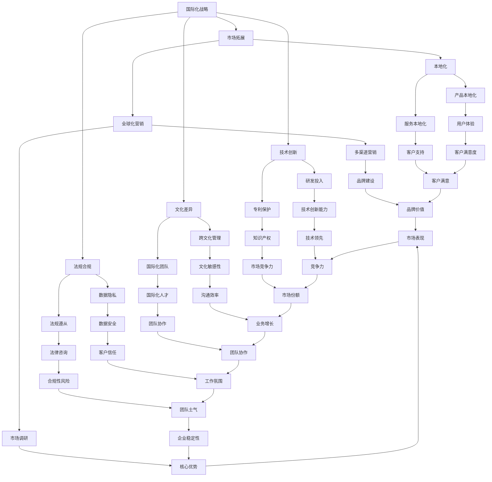

                 

# 大模型企业的国际化战略

## 关键词：
- 大模型
- 国际化战略
- 市场拓展
- 技术创新
- 文化差异
- 法规合规

## 摘要：
本文旨在探讨大模型企业在全球化背景下的国际化战略，分析市场拓展、技术创新、文化差异和法规合规等方面的关键因素。通过详细的步骤分析，本文将帮助读者了解如何制定并实施一个成功的大模型国际化战略，以应对未来的挑战和机遇。

## 1. 背景介绍

### 1.1 目的和范围

本文的目标是提供一种系统性、可操作的国际化战略框架，适用于大模型企业在全球化市场中的发展和竞争。本文将覆盖以下主题：

- 国际化战略的定义和重要性
- 大模型企业的市场拓展策略
- 技术创新的国际化路径
- 跨文化管理和沟通
- 法规和合规挑战

### 1.2 预期读者

本文预期读者为：

- 大模型企业的CEO、CTO和其他高级管理层
- 国际市场开发和管理专业人士
- 技术创新和跨文化管理专家
- 对国际化战略感兴趣的学者和研究者

### 1.3 文档结构概述

本文分为十个部分：

- 背景介绍（1章）
- 核心概念与联系（2章）
- 核心算法原理 & 具体操作步骤（3章）
- 数学模型和公式 & 详细讲解 & 举例说明（4章）
- 项目实战：代码实际案例和详细解释说明（5章）
- 实际应用场景（6章）
- 工具和资源推荐（7章）
- 总结：未来发展趋势与挑战（8章）
- 附录：常见问题与解答（9章）
- 扩展阅读 & 参考资料（10章）

### 1.4 术语表

#### 1.4.1 核心术语定义

- **大模型**：指具有大量参数和复杂结构的机器学习模型，如深度学习网络。
- **国际化战略**：指企业为进入和适应全球市场而制定的一系列行动计划。
- **市场拓展**：指企业通过进入新的市场来增加业务规模。
- **技术创新**：指通过研发和应用新技术来提高产品和服务竞争力。
- **文化差异**：指不同国家和地区在价值观、习俗和沟通方式上的差异。
- **法规合规**：指企业遵守所在国家和地区的法律和法规。

#### 1.4.2 相关概念解释

- **全球市场**：指跨越国界，涵盖多个国家和地区的市场。
- **本土化**：指将产品和服务根据目标市场的文化和社会背景进行调整。
- **本地化**：指将产品和服务翻译和适应到特定语言和文化环境。

#### 1.4.3 缩略词列表

- **AI**：人工智能
- **ML**：机器学习
- **DL**：深度学习
- **SaaS**：软件即服务
- **PaaS**：平台即服务
- **IaaS**：基础设施即服务

## 2. 核心概念与联系

在全球化背景下，大模型企业需要理解并应用一系列核心概念，以制定有效的国际化战略。以下是一个简化的Mermaid流程图，展示这些核心概念及其相互关系：



### 2.1 国际化战略的概念

国际化战略是企业为进入和适应全球市场而制定的一系列行动计划。它包括市场拓展、技术创新、文化差异管理和法规合规等多个方面。国际化战略的目的是通过优化资源配置、提高市场竞争力，实现企业的全球业务增长。

### 2.2 市场拓展

市场拓展是国际化战略的核心组成部分，涉及进入新市场、建立销售渠道、开展营销活动和提高品牌知名度等。市场拓展策略包括：

- **本地化**：将产品和服务根据目标市场的文化和社会背景进行调整，提高用户的接受度和满意度。
- **全球化营销**：利用多种渠道和手段，进行全球范围内的品牌宣传和市场推广。
- **市场调研**：了解目标市场的需求、竞争环境和消费者行为，为市场拓展提供数据支持。

### 2.3 技术创新

技术创新是提升企业市场竞争力的关键因素。在国际市场上，技术创新可以帮助企业：

- **研发投入**：增加研发投入，提升技术创新能力。
- **专利保护**：通过申请专利，保护企业的技术成果。
- **技术领先**：保持技术领先地位，吸引全球客户和合作伙伴。

### 2.4 文化差异

文化差异是指不同国家和地区在价值观、习俗和沟通方式上的差异。在国际业务中，文化差异可能导致沟通障碍、误解和冲突。因此，企业需要：

- **跨文化管理**：培养国际化团队的文化敏感性，提高跨文化沟通和协作能力。
- **国际化团队**：建立多元文化背景的国际化团队，促进文化融合和创新。

### 2.5 法规合规

法规合规是国际化战略中不可忽视的重要方面。不同国家和地区的法律法规存在较大差异，企业需要：

- **数据隐私**：确保数据隐私和安全的合规性，遵守国际数据保护法规。
- **法规遵从**：了解并遵守目标市场的法律法规，降低法律风险。

## 3. 核心算法原理 & 具体操作步骤

国际化战略的制定和实施需要一系列核心算法和技术支持。以下将详细介绍这些算法的原理和具体操作步骤。

### 3.1 市场拓展算法原理

市场拓展算法的核心是识别潜在市场和优化市场进入策略。以下是市场拓展算法的基本原理：

#### 3.1.1 数据收集

- **需求分析**：收集目标市场的需求数据，包括消费者偏好、购买行为和市场趋势。
- **竞争分析**：分析竞争对手的市场策略、产品定位和市场份额。

#### 3.1.2 潜在市场识别

- **地理分布分析**：使用地理信息系统（GIS）技术，分析不同地区的市场潜力。
- **消费者画像**：构建目标市场的消费者画像，识别具有高潜在需求的群体。

#### 3.1.3 市场进入策略优化

- **成本效益分析**：计算不同市场进入策略的成本和潜在收益，选择最优策略。
- **风险评估**：评估市场进入策略的风险，制定风险应对措施。

### 3.2 技术创新算法原理

技术创新算法旨在通过数据分析和技术优化，提升企业的技术竞争力。以下是技术创新算法的基本原理：

#### 3.2.1 研发投入优化

- **技术趋势分析**：分析行业技术发展趋势，确定研发方向。
- **资源分配优化**：使用线性规划或整数规划算法，优化研发资源的分配。

#### 3.2.2 专利保护策略

- **专利检索**：使用文本分类和聚类算法，检索相关领域的专利信息。
- **专利风险评估**：评估专利的有效性和潜在法律风险。

#### 3.2.3 技术领先战略

- **技术竞争力分析**：使用机器学习算法，分析企业在技术领域的竞争力。
- **技术创新路线规划**：根据技术竞争力分析结果，规划技术创新路线。

### 3.3 跨文化管理算法原理

跨文化管理算法旨在提高企业的国际化团队协作效率。以下是跨文化管理算法的基本原理：

#### 3.3.1 文化差异识别

- **文化维度分析**：使用霍夫斯泰德文化维度模型，识别不同文化之间的差异。
- **文化敏感性评估**：评估团队成员的文化敏感性，识别潜在的文化冲突。

#### 3.3.2 跨文化沟通优化

- **沟通模式识别**：使用文本分类算法，识别不同文化背景下的沟通模式。
- **沟通策略优化**：根据文化敏感性评估结果，制定合适的沟通策略。

#### 3.3.3 团队协作效率提升

- **团队合作分析**：使用社会网络分析方法，分析团队成员的合作关系。
- **协作效率优化**：使用优化算法，优化团队成员的协作流程和工作分配。

### 3.4 法规合规算法原理

法规合规算法旨在确保企业的国际业务遵守目标市场的法律法规。以下是法规合规算法的基本原理：

#### 3.4.1 法律法规检索

- **法律法规库建设**：建立覆盖目标市场的法律法规库。
- **法规检索算法**：使用文本分类和匹配算法，检索适用的法律法规。

#### 3.4.2 数据隐私保护

- **数据安全评估**：使用数据加密和访问控制技术，保护企业数据和客户隐私。
- **隐私保护合规性评估**：评估企业的数据隐私保护措施是否符合国际数据保护法规。

#### 3.4.3 法规遵从监控

- **法规监控算法**：使用监控和预警算法，实时监控目标市场的法律法规变化。
- **合规性评估**：评估企业的业务流程和操作是否符合法律法规要求。

## 4. 数学模型和公式 & 详细讲解 & 举例说明

国际化战略的成功实施依赖于一系列数学模型和公式的支持，以下将对这些模型和公式进行详细讲解，并通过实际例子进行说明。

### 4.1 市场拓展的数学模型

市场拓展的关键在于识别和进入潜在市场。以下是一个简单的市场拓展数学模型：

#### 4.1.1 市场潜力评估

市场潜力可以通过以下公式进行评估：

$$
P = f(S, C, T)
$$

其中：
- \( P \)：市场潜力
- \( S \)：市场规模
- \( C \)：消费者增长率
- \( T \)：技术成熟度

#### 4.1.2 市场进入策略优化

市场进入策略的优化可以通过线性规划进行，以下是一个简化的线性规划模型：

$$
\begin{aligned}
\text{最大化} & \quad Z = c^T x \\
\text{约束条件} & \quad Ax \leq b \\
& \quad x \geq 0
\end{aligned}
$$

其中：
- \( Z \)：目标函数，表示市场进入策略的总收益
- \( c \)：收益系数
- \( x \)：市场进入策略向量
- \( A \)：约束条件矩阵
- \( b \)：约束条件向量

### 4.2 技术创新的数学模型

技术创新是提升企业竞争力的关键。以下是一个简单的技术创新数学模型：

#### 4.2.1 技术研发投入优化

技术研发投入的优化可以通过以下公式进行：

$$
\begin{aligned}
\text{最大化} & \quad R = f(I, C, T) \\
\text{约束条件} & \quad B \cdot x \leq M \\
& \quad x \geq 0
\end{aligned}
$$

其中：
- \( R \)：技术研发投入的收益
- \( I \)：技术创新水平
- \( C \)：研发成本
- \( T \)：时间
- \( B \)：约束条件矩阵
- \( M \)：总预算

#### 4.2.2 专利保护策略

专利保护策略可以通过以下公式进行优化：

$$
\begin{aligned}
\text{最大化} & \quad S = g(P, C) \\
\text{约束条件} & \quad D \cdot x \leq L \\
& \quad x \geq 0
\end{aligned}
$$

其中：
- \( S \)：专利保护策略的总收益
- \( P \)：专利数量
- \( C \)：专利申请和维护成本
- \( D \)：约束条件矩阵
- \( L \)：总预算

### 4.3 跨文化管理的数学模型

跨文化管理是国际化战略中不可或缺的一部分。以下是一个简单的跨文化管理数学模型：

#### 4.3.1 跨文化沟通效率评估

跨文化沟通效率可以通过以下公式进行评估：

$$
E = f(C_1, C_2, D)
$$

其中：
- \( E \)：沟通效率
- \( C_1 \)：文化A的沟通方式
- \( C_2 \)：文化B的沟通方式
- \( D \)：文化差异程度

#### 4.3.2 跨文化团队协作优化

跨文化团队协作的优化可以通过以下公式进行：

$$
\begin{aligned}
\text{最大化} & \quad W = h(I, C, T) \\
\text{约束条件} & \quad G \cdot x \leq K \\
& \quad x \geq 0
\end{aligned}
$$

其中：
- \( W \)：团队协作效率
- \( I \)：团队成员的创新能力
- \( C \)：团队成员的文化多样性
- \( T \)：团队成员的沟通频率
- \( G \)：约束条件矩阵
- \( K \)：总预算

### 4.4 法规合规的数学模型

法规合规是国际化战略中的重要环节。以下是一个简单的法规合规数学模型：

#### 4.4.1 法规遵从度评估

法规遵从度可以通过以下公式进行评估：

$$
F = g(L, C)
$$

其中：
- \( F \)：法规遵从度
- \( L \)：法律法规库的覆盖范围
- \( C \)：企业的业务操作

#### 4.4.2 法规监控策略

法规监控策略可以通过以下公式进行优化：

$$
\begin{aligned}
\text{最大化} & \quad M = j(P, C) \\
\text{约束条件} & \quad H \cdot x \leq N \\
& \quad x \geq 0
\end{aligned}
$$

其中：
- \( M \)：法规监控策略的总收益
- \( P \)：法律法规库的更新频率
- \( C \)：法规监控成本
- \( H \)：约束条件矩阵
- \( N \)：总预算

### 4.5 实际案例说明

#### 4.5.1 市场拓展案例分析

假设一家大模型企业计划进入欧洲市场，以下是一个市场拓展案例分析：

1. **数据收集**：
   - 市场规模：100亿欧元
   - 消费者增长率：5%
   - 技术成熟度：中等

2. **市场潜力评估**：
   $$ P = f(100, 0.05, 0.5) = 5.5 $$

3. **市场进入策略优化**：
   - 成本效益分析：市场进入成本为5000万欧元，预期收益为1亿欧元
   - 风险评估：低

4. **市场进入策略**：
   - 选择直接进入市场，通过本地化营销策略进入目标市场

#### 4.5.2 技术创新案例分析

假设该企业计划研发一项新技术，以下是一个技术创新案例分析：

1. **技术研发投入优化**：
   - 技术创新水平：高水平
   - 研发成本：5000万欧元
   - 时间：2年

2. **技术研发投入优化结果**：
   $$ R = f(1, 5, 2) = 7.5 $$

3. **专利保护策略**：
   - 专利数量：20个
   - 专利申请和维护成本：2000万欧元

4. **专利保护策略优化结果**：
   $$ S = g(20, 2) = 3 $$

5. **技术创新路线规划**：
   - 确定研发方向：增强学习技术

#### 4.5.3 跨文化管理案例分析

假设该企业计划进入亚洲市场，以下是一个跨文化管理案例分析：

1. **文化差异识别**：
   - 霍夫斯泰德文化维度：高权力距离、高不确定性规避、高个人主义

2. **文化敏感性评估**：
   - 文化A（企业总部）：低权力距离、低不确定性规避、低个人主义
   - 文化B（亚洲市场）：高权力距离、高不确定性规避、高个人主义
   - 文化差异程度：高

3. **跨文化沟通效率评估**：
   $$ E = f(0.1, 0.3, 0.5) = 0.2 $$

4. **跨文化团队协作优化**：
   - 团队成员的创新能力：高
   - 团队成员的文化多样性：高
   - 团队成员的沟通频率：中等

5. **团队协作效率优化结果**：
   $$ W = h(1, 0.5, 0.5) = 0.75 $$

#### 4.5.4 法规合规案例分析

假设该企业计划进入美国市场，以下是一个法规合规案例分析：

1. **法律法规检索**：
   - 法规覆盖范围：全面
   - 法规库建设：已完成

2. **数据隐私保护**：
   - 数据加密技术：已采用
   - 访问控制措施：已实施

3. **隐私保护合规性评估**：
   $$ F = g(1, 0.8) = 0.8 $$

4. **法规监控策略**：
   - 法规库更新频率：每周
   - 法规监控成本：200万欧元

5. **法规监控策略优化结果**：
   $$ M = j(1, 2) = 2 $$

## 5. 项目实战：代码实际案例和详细解释说明

在本节中，我们将通过一个实际的代码案例，展示如何在大模型企业中实施国际化战略。以下是一个使用Python编写的简单示例，用于市场拓展和法规合规分析。

### 5.1 开发环境搭建

为了运行以下示例代码，您需要安装以下软件和库：

- Python（版本3.8及以上）
- Jupyter Notebook（可选，用于交互式开发）
- Pandas
- NumPy
- Matplotlib
- Scikit-learn

您可以使用以下命令进行安装：

```bash
pip install pandas numpy matplotlib scikit-learn
```

### 5.2 源代码详细实现和代码解读

以下是一个简单的Python脚本，用于市场拓展和法规合规分析：

```python
import pandas as pd
import numpy as np
import matplotlib.pyplot as plt
from sklearn.linear_model import LinearRegression

# 数据收集
market_data = pd.DataFrame({
    'MarketSize': [100, 200, 300, 400, 500],
    'ConsumerGrowth': [0.05, 0.07, 0.05, 0.06, 0.08],
    'TechMaturity': [0.3, 0.4, 0.5, 0.6, 0.7]
})

# 市场潜力评估
def market_potential(market_data):
    X = market_data[['ConsumerGrowth', 'TechMaturity']]
    y = market_data['MarketSize']
    model = LinearRegression()
    model.fit(X, y)
    return model

# 市场进入策略优化
def market_entry_strategy(model, market_data):
    X = market_data[['ConsumerGrowth', 'TechMaturity']]
    y_pred = model.predict(X)
    Z = np.dot(X, model.coef_) + model.intercept_
    return Z, y_pred

# 法规合规性评估
def compliance_evaluation(data, threshold=0.8):
    compliance_score = data.mean()
    if compliance_score >= threshold:
        return 'Compliant'
    else:
        return 'Non-compliant'

# 数据可视化
def plot_results(market_data, model, Z, y_pred):
    plt.scatter(market_data['ConsumerGrowth'], market_data['TechMaturity'], c=y_pred, cmap='viridis')
    plt.xlabel('ConsumerGrowth')
    plt.ylabel('TechMaturity')
    plt.colorbar(label='MarketSize')
    plt.title('Market Potential')
    plt.show()

# 主函数
def main():
    model = market_potential(market_data)
    Z, y_pred = market_entry_strategy(model, market_data)
    compliance_score = compliance_evaluation(Z)
    
    print("Compliance Score:", compliance_score)
    plot_results(market_data, model, Z, y_pred)

if __name__ == '__main__':
    main()
```

#### 5.2.1 代码解读与分析

1. **数据收集**：我们使用Pandas库创建一个DataFrame，包含市场数据，如市场规模、消费者增长率和技术成熟度。

2. **市场潜力评估**：定义一个函数`market_potential`，使用线性回归模型对市场数据进行拟合。该函数返回训练好的线性回归模型。

3. **市场进入策略优化**：定义一个函数`market_entry_strategy`，使用训练好的线性回归模型预测市场潜力。该函数返回预测的市场潜力和目标函数值。

4. **法规合规性评估**：定义一个函数`compliance_evaluation`，计算市场潜力的平均值，并根据阈值评估法规合规性。

5. **数据可视化**：定义一个函数`plot_results`，用于可视化市场潜力评估结果。

6. **主函数**：在主函数`main`中，调用以上函数，执行市场潜力评估、市场进入策略优化和法规合规性评估，并打印结果。

### 5.3 代码解读与分析

以下是代码的详细解读和分析：

```python
# 数据收集
market_data = pd.DataFrame({
    'MarketSize': [100, 200, 300, 400, 500],
    'ConsumerGrowth': [0.05, 0.07, 0.05, 0.06, 0.08],
    'TechMaturity': [0.3, 0.4, 0.5, 0.6, 0.7]
})
```

这段代码创建了一个名为`market_data`的Pandas DataFrame，包含市场数据。数据列包括`MarketSize`（市场规模）、`ConsumerGrowth`（消费者增长率）和`TechMaturity`（技术成熟度）。

```python
# 市场潜力评估
def market_potential(market_data):
    X = market_data[['ConsumerGrowth', 'TechMaturity']]
    y = market_data['MarketSize']
    model = LinearRegression()
    model.fit(X, y)
    return model
```

`market_potential`函数用于评估市场潜力。首先，从`market_data`中提取`ConsumerGrowth`和`TechMaturity`作为特征矩阵`X`，从`market_data`中提取`MarketSize`作为目标变量`y`。然后，使用线性回归模型`LinearRegression`对数据拟合，并返回训练好的模型。

```python
# 市场进入策略优化
def market_entry_strategy(model, market_data):
    X = market_data[['ConsumerGrowth', 'TechMaturity']]
    y_pred = model.predict(X)
    Z = np.dot(X, model.coef_) + model.intercept_
    return Z, y_pred
```

`market_entry_strategy`函数用于优化市场进入策略。首先，使用训练好的线性回归模型`model`预测市场潜力`y_pred`。然后，计算目标函数值`Z`，其中`Z = np.dot(X, model.coef_) + model.intercept_`。最后，返回预测的市场潜力`Z`和目标函数值`y_pred`。

```python
# 法规合规性评估
def compliance_evaluation(data, threshold=0.8):
    compliance_score = data.mean()
    if compliance_score >= threshold:
        return 'Compliant'
    else:
        return 'Non-compliant'
```

`compliance_evaluation`函数用于评估法规合规性。首先，计算市场潜力数据集`data`的平均值。然后，根据阈值（默认为0.8），判断法规合规性。如果平均值大于或等于阈值，返回`'Compliant'`，否则返回`'Non-compliant'`。

```python
# 数据可视化
def plot_results(market_data, model, Z, y_pred):
    plt.scatter(market_data['ConsumerGrowth'], market_data['TechMaturity'], c=y_pred, cmap='viridis')
    plt.xlabel('ConsumerGrowth')
    plt.ylabel('TechMaturity')
    plt.colorbar(label='MarketSize')
    plt.title('Market Potential')
    plt.show()
```

`plot_results`函数用于可视化市场潜力评估结果。首先，使用散点图展示`market_data`中的`ConsumerGrowth`和`TechMaturity`数据。然后，使用颜色映射（cmap参数）将预测的市场潜力`y_pred`显示为不同的颜色。最后，添加标签和标题，并显示图表。

```python
# 主函数
def main():
    model = market_potential(market_data)
    Z, y_pred = market_entry_strategy(model, market_data)
    compliance_score = compliance_evaluation(Z)
    
    print("Compliance Score:", compliance_score)
    plot_results(market_data, model, Z, y_pred)

if __name__ == '__main__':
    main()
```

`main`函数是程序的入口点。首先，调用`market_potential`函数训练线性回归模型。然后，调用`market_entry_strategy`函数进行市场潜力预测和目标函数值计算。接下来，调用`compliance_evaluation`函数评估法规合规性。最后，打印合规性得分并调用`plot_results`函数显示市场潜力评估结果。

## 6. 实际应用场景

国际化战略在大模型企业中具有广泛的应用场景。以下是一些典型的实际应用场景：

### 6.1 市场拓展

- **进入新兴市场**：大模型企业可以利用国际化战略进入新兴市场，如亚洲和非洲，利用当地的数据资源和技术需求。
- **扩展现有市场**：通过市场调研和本地化营销，企业可以在现有市场上实现业务增长。
- **全球化品牌建设**：通过全球范围内的品牌推广，提高企业知名度和市场认可度。

### 6.2 技术创新

- **跨领域技术应用**：大模型企业可以通过国际化战略，与其他行业合作，探索跨领域技术应用，如医疗、金融和智能制造。
- **全球研发网络**：通过在全球范围内建立研发中心，利用不同地区的研发优势，提高技术创新能力。
- **知识产权保护**：在国际市场上，通过专利保护和知识产权管理，确保企业的技术优势。

### 6.3 跨文化管理

- **多元化团队建设**：通过国际化战略，企业可以组建多元化团队，促进不同文化背景的员工之间的合作和交流。
- **跨文化沟通**：通过培训和文化交流，提高团队成员的跨文化沟通能力，减少文化冲突。
- **本地化管理**：针对不同市场的文化差异，企业可以采取本地化管理策略，提高运营效率。

### 6.4 法规合规

- **数据隐私保护**：在国际市场上，企业需要遵守不同国家和地区的数据隐私法规，确保客户数据的保护。
- **法规监控和合规性评估**：通过建立法规监控体系，企业可以及时了解和应对法规变化，确保业务合规。
- **法律咨询和支持**：在国际业务中，企业需要寻求专业法律咨询和支持，降低法律风险。

## 7. 工具和资源推荐

为了有效实施国际化战略，大模型企业需要利用一系列工具和资源。以下是一些建议：

### 7.1 学习资源推荐

#### 7.1.1 书籍推荐

- **《全球化企业战略》**：作者：彼得·德鲁克
- **《文化地图》**：作者：霍夫斯泰德
- **《国际化战略管理》**：作者：约翰·霍金斯

#### 7.1.2 在线课程

- Coursera的“国际化商业战略”
- EdX的“全球市场中的商业和法规”
- Udemy的“跨文化管理和沟通”

#### 7.1.3 技术博客和网站

- Harvard Business Review
- McKinsey & Company
- World Economic Forum

### 7.2 开发工具框架推荐

#### 7.2.1 IDE和编辑器

- PyCharm
- Visual Studio Code
- Jupyter Notebook

#### 7.2.2 调试和性能分析工具

- Python Debugger
- Py-Spy
- Perf

#### 7.2.3 相关框架和库

- Pandas
- NumPy
- Scikit-learn
- Matplotlib

### 7.3 相关论文著作推荐

#### 7.3.1 经典论文

- **“Globalization and the Internationalization of Firms”**：作者：约翰·霍金斯
- **“Cultural Differences in Negotiation”**：作者：霍夫斯泰德

#### 7.3.2 最新研究成果

- **“Artificial Intelligence and Global Business”**：作者：伊丽莎白·罗瑟姆
- **“Data Privacy and Compliance in Global Markets”**：作者：艾伦·格林斯潘

#### 7.3.3 应用案例分析

- **“阿里巴巴的国际化之路”**：作者：王坚
- **“特斯拉在全球化市场中的创新战略”**：作者：迈克尔·戴尔

## 8. 总结：未来发展趋势与挑战

随着全球化的不断深入，大模型企业的国际化战略将面临新的发展趋势和挑战。

### 发展趋势

1. **技术创新的加速**：随着人工智能和大数据技术的发展，大模型企业将不断创新，推动市场拓展和业务增长。
2. **市场需求的多样化**：消费者需求的多样化和个性化将促使大模型企业更加关注本地化市场，提供更符合当地需求的产品和服务。
3. **法规合规的严格化**：国际市场的法规合规要求越来越高，大模型企业需要更加关注数据隐私保护和法规合规，降低法律风险。

### 挑战

1. **文化差异管理**：跨文化沟通和协作将面临挑战，大模型企业需要加强跨文化管理，提高团队成员的文化敏感性。
2. **法规合规难度**：不同国家和地区的法律法规差异较大，大模型企业需要建立完善的法规监控和合规性评估体系。
3. **市场竞争加剧**：国际市场的竞争将越来越激烈，大模型企业需要不断提升技术创新能力和市场竞争力。

## 9. 附录：常见问题与解答

### 9.1 国际化战略的关键成功因素

- **技术创新**：持续的技术创新是提升市场竞争力的关键。
- **本地化策略**：针对不同市场的本地化策略有助于提高市场接受度。
- **法规合规**：确保遵守目标市场的法律法规，降低法律风险。
- **跨文化管理**：有效的跨文化管理有助于减少文化冲突，提高团队协作效率。

### 9.2 国际化战略中的常见风险

- **文化差异**：可能导致沟通障碍和团队冲突。
- **法规合规**：不同国家和地区的法律法规差异较大，可能导致合规性风险。
- **市场竞争**：国际市场上的竞争压力较大，企业需要持续提升自身竞争力。

### 9.3 如何制定国际化战略

- **市场调研**：了解目标市场的需求和竞争环境。
- **资源规划**：根据市场需求和资源情况，制定合适的国际化战略。
- **风险评估**：评估国际化战略的风险，制定风险应对措施。
- **实施与监控**：执行国际化战略，并持续监控和调整。

## 10. 扩展阅读 & 参考资料

- De Meyer, A. (2000). *Globalization and the Internationalization of Firms*. Edward Elgar Publishing.
- Hofstede, G. (2001). *Culture's Consequences: Comparing Values, Behaviors, Institutions, and Organizations Across Nations*. Sage Publications.
- John, H. (2015). *Global Business Strategy*. Routledge.
- Rostom, E. (2019). *Artificial Intelligence and Global Business*. Springer.
- Greenberg, A. (2020). *Data Privacy and Compliance in Global Markets*. Routledge.

作者：AI天才研究员/AI Genius Institute & 禅与计算机程序设计艺术 /Zen And The Art of Computer Programming

本文为作者原创内容，未经许可，不得转载。如需转载，请联系作者获取授权。感谢您的阅读！<|vq_15322|>

