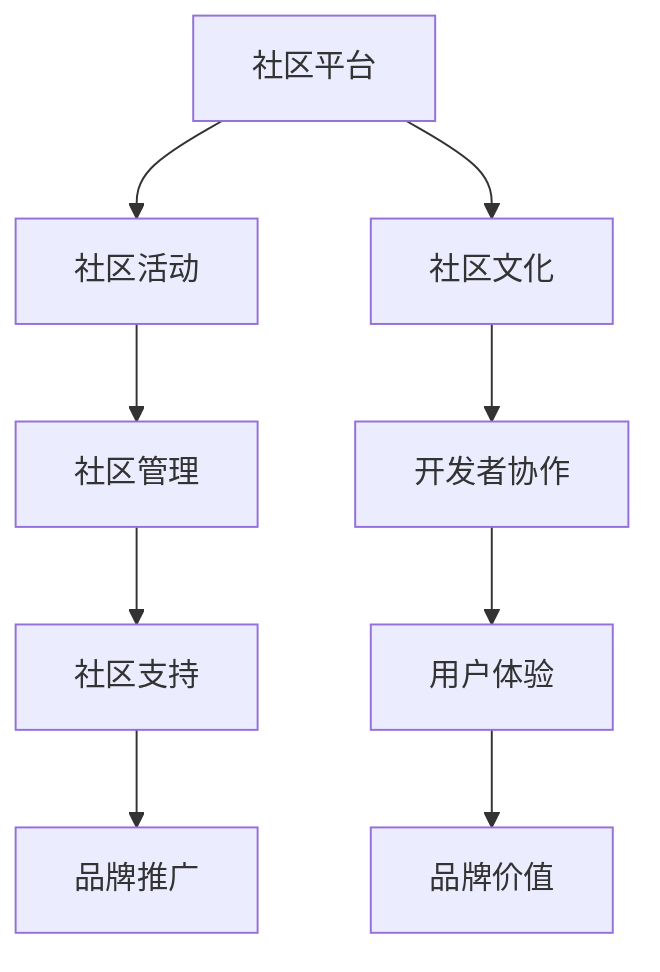

                 

# 大模型企业的开源社区运营

> 关键词：大模型、开源社区、运营策略、开发者协作、用户体验

> 摘要：本文将深入探讨大模型企业在开源社区中的运营策略，分析其优势和挑战，并分享成功的社区运营案例，以期为业界提供有益的参考和指导。

## 1. 背景介绍

### 1.1 目的和范围

本文旨在分析大模型企业在开源社区中的运营策略，探讨如何通过有效的社区运营提升企业品牌价值、吸引开发者参与、加速产品迭代和创新。本文将涵盖以下几个方面的内容：

1. 开源社区的重要性及其对企业的影响。
2. 大模型企业在开源社区中的角色和责任。
3. 成功的开源社区运营策略和实践。
4. 开源社区运营中的挑战和解决方案。

### 1.2 预期读者

本文适合以下读者群体：

1. 大模型企业的高级管理人员和决策者。
2. 开源社区运营专员和技术人员。
3. 开源社区的开发者和爱好者。
4. 对开源社区运营感兴趣的IT行业从业者。

### 1.3 文档结构概述

本文将分为以下章节：

1. 背景介绍：介绍本文的目的、预期读者和文档结构。
2. 核心概念与联系：介绍大模型企业开源社区运营的核心概念和架构。
3. 核心算法原理 & 具体操作步骤：详细讲解开源社区运营的核心算法原理和操作步骤。
4. 数学模型和公式 & 详细讲解 & 举例说明：介绍开源社区运营中的数学模型和公式，并进行实例分析。
5. 项目实战：分享一个开源社区运营的实际案例，详细解释说明。
6. 实际应用场景：分析开源社区运营在现实中的应用。
7. 工具和资源推荐：推荐学习资源和开发工具。
8. 总结：总结开源社区运营的未来发展趋势和挑战。
9. 附录：常见问题与解答。
10. 扩展阅读 & 参考资料：提供进一步的阅读材料和参考资料。

### 1.4 术语表

#### 1.4.1 核心术语定义

- 开源社区：由一群共同兴趣的开发者组成的在线社区，共同开发和维护开源软件。
- 大模型企业：指在人工智能领域拥有大规模模型的企业，如谷歌、微软、百度等。
- 运营策略：企业为管理、维护和扩展开源社区所制定的一系列计划和措施。
- 开发者协作：指开源社区中开发者之间的合作和交流。

#### 1.4.2 相关概念解释

- 社区运营：指企业对开源社区的管理和运营，包括内容维护、活动组织、成员管理等。
- 社区治理：指开源社区中制定和执行规则的过程，以维护社区的稳定和健康。
- 用户参与度：指用户在开源社区中的活跃程度和参与度，如发帖、评论、贡献代码等。

#### 1.4.3 缩略词列表

- OSS：Open Source Software（开源软件）
- GitHub：一个流行的开源代码托管平台
- GitLab：一个自建的代码托管和项目管理工具
- AI：Artificial Intelligence（人工智能）
- ML：Machine Learning（机器学习）

## 2. 核心概念与联系

### 2.1 大模型企业开源社区运营的核心概念

大模型企业开源社区运营的核心概念包括：

1. **社区文化**：建立和维护一个积极、友好、开放的社区文化，鼓励开发者贡献和交流。
2. **社区治理**：制定和执行社区规则，确保社区的秩序和健康。
3. **开发者协作**：促进开发者之间的合作，提高项目开发效率。
4. **用户体验**：优化用户在社区中的体验，提高用户满意度和参与度。
5. **品牌价值**：通过社区运营提升企业品牌形象和影响力。

### 2.2 大模型企业开源社区运营的架构

大模型企业开源社区运营的架构通常包括以下几个部分：

1. **社区平台**：如GitHub、GitLab等，用于代码托管、项目管理和协作。
2. **社区活动**：包括线上和线下的技术交流、黑客马拉松、讲座等。
3. **社区管理**：包括社区成员管理、内容审核、问题跟踪等。
4. **社区支持**：提供技术支持、文档资料、教程等，帮助开发者更好地使用和维护项目。
5. **品牌推广**：通过社交媒体、网站、博客等渠道宣传社区和项目。

### 2.3 大模型企业开源社区运营的 Mermaid 流程图



## 3. 核心算法原理 & 具体操作步骤

### 3.1 社区文化建设和维护

**算法原理**：社区文化的建设与维护是开源社区运营的核心。通过建立共同的价值观和行为规范，可以增强社区凝聚力，提高成员的归属感和参与度。

**具体操作步骤**：

1. **制定社区文化宣言**：明确社区的价值观、行为准则和愿景，以引导社区成员的行为。
2. **设立社区规则**：制定社区规则，包括代码贡献准则、行为规范、问题处理流程等。
3. **建立激励机制**：通过奖励机制鼓励成员参与社区活动、贡献代码和文档。
4. **定期举办活动**：如技术分享、讲座、黑客马拉松等，增强社区成员之间的交流和互动。

### 3.2 社区治理和成员管理

**算法原理**：社区治理是确保社区健康和有序的关键。通过有效的治理机制，可以维护社区的稳定，防止不良行为和恶意攻击。

**具体操作步骤**：

1. **设立社区委员会**：由社区的核心成员组成，负责制定和执行社区规则，处理社区问题。
2. **建立问题反馈机制**：设置问题反馈渠道，如论坛、邮件列表、GitHub issue 等，及时响应和处理成员的反馈和问题。
3. **成员认证和管理**：对社区成员进行认证，区分不同角色的权限和责任，如贡献者、维护者、管理员等。
4. **审核和监控**：定期审核社区内容和活动，监控社区行为，确保社区秩序。

### 3.3 开发者协作和交流

**算法原理**：开发者协作是开源社区的核心价值之一。通过促进开发者之间的协作和交流，可以加速项目开发，提高代码质量。

**具体操作步骤**：

1. **代码审查和合并**：实施代码审查机制，确保代码质量和安全性，促进代码合并和协同开发。
2. **搭建协作平台**：利用GitHub、GitLab等平台提供的项目管理工具，如任务管理、文档编写、代码托管等。
3. **定期会议和讨论**：组织定期的线上和线下会议，讨论项目进展、技术问题和协作计划。
4. **鼓励贡献和反馈**：通过激励机制和反馈机制，鼓励成员贡献代码、文档和测试。

### 3.4 用户体验优化

**算法原理**：用户体验是开源社区持续发展的关键。通过优化用户体验，可以增加用户满意度，提高社区活跃度和参与度。

**具体操作步骤**：

1. **用户调研和反馈**：定期进行用户调研，收集用户反馈，了解用户需求和痛点。
2. **界面设计和交互**：优化社区界面设计和交互，提高用户操作的便捷性和满意度。
3. **提供详细文档和教程**：编写详细的用户文档和教程，帮助用户更好地使用和维护项目。
4. **快速响应和支持**：建立快速响应机制，及时回答用户问题和提供技术支持。

## 4. 数学模型和公式 & 详细讲解 & 举例说明

### 4.1 社区活跃度计算模型

**数学模型**：

$$
A = \frac{N_1 + N_2 + N_3}{3}
$$

其中：

- $A$：社区活跃度得分（0-10分）
- $N_1$：最近一个月的发帖数量
- $N_2$：最近一个月的评论数量
- $N_3$：最近一个月的问题和解决方案数量

**详细讲解**：

社区活跃度得分是通过计算社区成员在最近一个月内的发帖、评论和问题/解决方案数量来评估的。得分范围是0-10分，分数越高表示社区活跃度越高。这个模型考虑了不同类型活动的贡献，以综合评估社区的整体活跃度。

**举例说明**：

假设一个社区在最近一个月内有以下活动数据：

- 发帖数量：20
- 评论数量：30
- 问题/解决方案数量：10

那么，该社区的活跃度得分为：

$$
A = \frac{20 + 30 + 10}{3} = \frac{60}{3} = 20
$$

### 4.2 用户满意度计算模型

**数学模型**：

$$
S = \frac{R + 2C + T}{3}
$$

其中：

- $S$：用户满意度得分（0-100分）
- $R$：用户正面反馈数量
- $C$：用户中性反馈数量
- $T$：用户负面反馈数量

**详细讲解**：

用户满意度得分是通过计算用户在社区中的正面、中性和负面反馈数量来评估的。得分范围是0-100分，分数越高表示用户满意度越高。这个模型考虑了不同类型反馈的影响，以综合评估用户对社区的整体满意度。

**举例说明**：

假设一个社区在一个月内收到以下用户反馈：

- 正面反馈：10条
- 中性反馈：5条
- 负面反馈：3条

那么，该社区的用户满意度得分为：

$$
S = \frac{10 + 2 \times 5 + 3}{3} = \frac{10 + 10 + 3}{3} = \frac{23}{3} \approx 7.67
$$

## 5. 项目实战：代码实际案例和详细解释说明

### 5.1 开发环境搭建

**步骤 1**：安装Git

```bash
# macOS 或 Linux
sudo apt-get install git

# Windows
choco install git
```

**步骤 2**：安装Python环境（可选）

```bash
# macOS 或 Linux
sudo apt-get install python3 python3-pip

# Windows
python -m pip install --user --upgrade pip
```

**步骤 3**：安装GitHub CLI（可选）

```bash
# macOS 或 Linux
curl -fsSL https://cli.github.com/packages/github-cli/LICENSE.txt | tee /dev/tty
curl -fsSL https://cli.github.com/packages/github-cli/install.sh -o - | bash

# Windows
curl -fsSL https://cli.github.com/packages/github-cli/LICENSE.txt | type
curl -fsSL https://cli.github.com/packages/github-cli/install.sh -o - | cmd
```

**步骤 4**：配置GitHub CLI

```bash
gh auth login
```

### 5.2 源代码详细实现和代码解读

**步骤 1**：创建项目

```bash
# 创建一个名为 "open-source-community" 的项目
git init open-source-community
cd open-source-community
```

**步骤 2**：添加文件和目录

```bash
mkdir docs sources tests
touch README.md .gitignore
```

**步骤 3**：编写代码

在 `src/community.py` 文件中编写以下代码：

```python
# community.py

class Community:
    def __init__(self, name, members):
        self.name = name
        self.members = members
    
    def add_member(self, member):
        self.members.append(member)
    
    def remove_member(self, member):
        self.members.remove(member)
    
    def display_members(self):
        for member in self.members:
            print(member)

if __name__ == "__main__":
    community = Community("Open Source Community", ["Alice", "Bob", "Charlie"])
    community.add_member("Diana")
    community.remove_member("Bob")
    community.display_members()
```

**步骤 4**：编写测试代码

在 `tests/community_test.py` 文件中编写以下代码：

```python
# community_test.py

import unittest
from community import Community

class TestCommunity(unittest.TestCase):
    def test_add_member(self):
        community = Community("Test Community", [])
        community.add_member("Alice")
        self.assertIn("Alice", community.members)

    def test_remove_member(self):
        community = Community("Test Community", ["Alice", "Bob"])
        community.remove_member("Bob")
        self.assertNotIn("Bob", community.members)

    def test_display_members(self):
        community = Community("Test Community", ["Alice", "Charlie"])
        with self.assertPrints():
            community.display_members()

if __name__ == "__main__":
    unittest.main()
```

**步骤 5**：提交代码

```bash
git add .
git commit -m "Initial commit"
git remote add origin https://github.com/your-username/open-source-community.git
git push -u origin master
```

### 5.3 代码解读与分析

**社区类（Community）**：

- **属性**：
  - `name`：社区名称
  - `members`：社区成员列表

- **方法**：
  - `__init__`：初始化社区类，设置社区名称和成员列表。
  - `add_member`：添加新成员到社区。
  - `remove_member`：从社区中移除成员。
  - `display_members`：打印社区成员列表。

**测试类（TestCommunity）**：

- **方法**：
  - `test_add_member`：测试添加成员功能，确保成员被正确添加到列表中。
  - `test_remove_member`：测试移除成员功能，确保成员被正确从列表中移除。
  - `test_display_members`：测试打印成员列表功能，确保成员被正确打印。

## 6. 实际应用场景

### 6.1 大模型企业在开源社区中的实际应用

大模型企业在开源社区中的应用主要体现在以下几个方面：

1. **技术交流与合作**：通过开源社区，大模型企业可以与其他开发者共享技术成果，共同研究和解决技术难题，加速技术创新。
2. **产品推广与市场拓展**：通过开源社区，大模型企业可以吸引更多的开发者参与，提高产品的知名度和市场占有率。
3. **社区反馈与改进**：通过开源社区，大模型企业可以收集用户反馈，了解产品需求，不断优化和改进产品。
4. **人才培养与吸引**：开源社区为企业提供了吸引优秀人才的平台，同时也有助于培养企业内部的人才。
5. **技术标准与规范**：大模型企业通过开源社区参与制定技术标准和规范，引领行业发展方向。

### 6.2 开源社区运营的优势与挑战

**优势**：

1. **降低开发成本**：开源社区可以共享代码和资源，降低开发成本，提高开发效率。
2. **加速产品迭代**：开源社区可以吸引更多开发者参与，加速产品迭代和创新。
3. **增强产品竞争力**：开源社区可以汇集更多的智慧和创意，提高产品的竞争力和用户体验。
4. **提高品牌知名度**：开源社区可以为企业树立良好的品牌形象，提高市场影响力。

**挑战**：

1. **社区管理难度**：开源社区涉及众多开发者，管理难度较大，需要建立完善的社区治理机制。
2. **知识产权保护**：开源社区需要妥善处理知识产权问题，确保社区成员的贡献合法合规。
3. **安全问题**：开源社区可能存在安全漏洞和恶意攻击风险，需要加强安全防护。
4. **人员管理**：开源社区需要吸引并留住优秀的开发者，需要建立激励机制和人才培养体系。

## 7. 工具和资源推荐

### 7.1 学习资源推荐

#### 7.1.1 书籍推荐

- 《开源社区创新实践》
- 《开源社区管理指南》
- 《Git 工作流》
- 《GitHub 实用技巧》

#### 7.1.2 在线课程

- Coursera 上的《开源社区管理》课程
- edX 上的《开源软件开发与社区管理》课程
- Udemy 上的《开源社区运营实战》课程

#### 7.1.3 技术博客和网站

- OpenSource.com
- GitHub Blog
- GitLab Blog

### 7.2 开发工具框架推荐

#### 7.2.1 IDE和编辑器

- Visual Studio Code
- IntelliJ IDEA
- PyCharm

#### 7.2.2 调试和性能分析工具

- Debugger
- Py-Spy
- JMeter

#### 7.2.3 相关框架和库

- Flask
- Django
- React
- Angular

### 7.3 相关论文著作推荐

#### 7.3.1 经典论文

- "Open Source Software: The Model for a New Millenium"
- "The Cathedral and the Bazaar"
- "The Success of Open Source"

#### 7.3.2 最新研究成果

- "The Economic Impact of Open Source Software"
- "The Future of Open Source Software"
- "Open Source and Crowdsourcing in Software Engineering"

#### 7.3.3 应用案例分析

- "Google Open Source Programs Office"
- "Facebook Open Source"
- "IBM Open Source"

## 8. 总结：未来发展趋势与挑战

### 8.1 未来发展趋势

1. **社区治理将更加智能化**：随着人工智能技术的发展，社区治理将更多地依靠智能算法和数据分析，提高治理效率和准确性。
2. **开源社区将更加多元化**：开源社区将涵盖更多的技术领域和项目类型，吸引更多不同背景的开发者参与。
3. **企业开源战略将更加成熟**：大模型企业将更加重视开源战略，通过开源社区提升品牌价值、吸引人才和拓展市场。
4. **开源社区将与社会责任相结合**：开源社区将更加注重社会责任，推动技术发展与社会进步相结合。

### 8.2 未来挑战

1. **社区安全问题**：开源社区需要应对日益增长的安全威胁，加强安全防护。
2. **知识产权保护**：开源社区需要妥善处理知识产权问题，确保社区成员的贡献合法合规。
3. **社区管理难度**：随着社区规模的扩大，社区管理难度将增加，需要建立更加完善的治理机制。
4. **人才流失问题**：开源社区需要吸引并留住优秀的开发者，建立良好的激励机制和人才培养体系。

## 9. 附录：常见问题与解答

### 9.1 问题 1：如何吸引开发者参与开源社区？

**解答**：要吸引开发者参与开源社区，可以从以下几个方面入手：

1. **提供有价值的技术内容**：分享高质量的技术博客、文档和教程，解决开发者在项目中遇到的问题。
2. **建立良好的社区文化**：营造积极、友好、开放的社区氛围，鼓励开发者贡献和交流。
3. **提供激励机制**：通过奖励机制鼓励开发者参与社区活动、贡献代码和文档。
4. **举办线上和线下活动**：组织技术交流、讲座、黑客马拉松等活动，增加开发者的参与度。

### 9.2 问题 2：如何处理开源社区中的冲突和争议？

**解答**：处理开源社区中的冲突和争议，可以采取以下措施：

1. **建立冲突解决机制**：制定冲突解决流程，明确冲突的解决方式和责任归属。
2. **公平公正**：在处理冲突时，要公正公平，避免偏袒任何一方。
3. **沟通协商**：鼓励冲突双方进行沟通和协商，寻求共识和解决方案。
4. **引用社区规则**：依据社区规则和价值观，公正处理冲突。

## 10. 扩展阅读 & 参考资料

- [GitHub](https://github.com/)
- [GitLab](https://gitlab.com/)
- [Open Source Initiative](https://opensource.org/)
- [Apache Software Foundation](https://www.apache.org/)
- [Linux Foundation](https://www.linuxfoundation.org/)

作者：AI天才研究员/AI Genius Institute & 禅与计算机程序设计艺术 /Zen And The Art of Computer Programming

