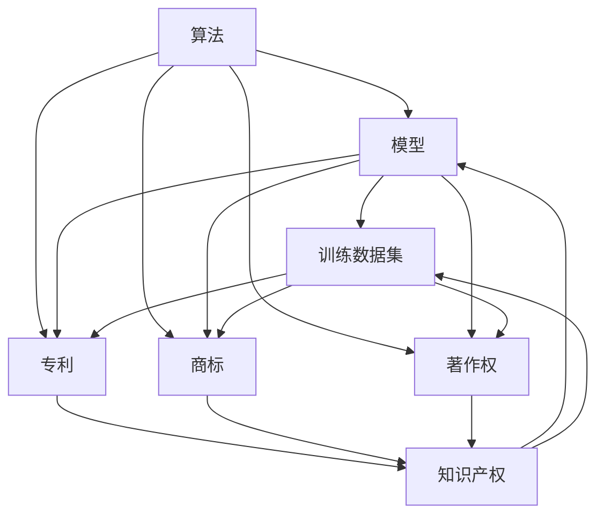

                 

# 大模型企业的知识产权保护

> 关键词：大模型、知识产权、保护、法律法规、技术创新、案例分析

> 摘要：随着人工智能技术的飞速发展，大模型在各个行业中的应用日益广泛，然而，知识产权保护问题也日益凸显。本文旨在探讨大模型企业在知识产权保护方面的挑战与策略，通过分析相关法律法规、核心概念以及具体操作步骤，为业界提供有益的参考和指导。

## 1. 背景介绍

### 1.1 目的和范围

本文旨在探讨大模型企业在知识产权保护方面的挑战与策略。具体来说，我们将从以下几个方面展开讨论：

1. **大模型知识产权保护的重要性**：阐述大模型技术在现代科技产业中的地位，以及知识产权保护对其发展的影响。
2. **法律法规框架**：介绍国内外关于知识产权保护的相关法律法规，分析其适用范围和特点。
3. **核心概念与联系**：阐述大模型相关的核心概念，包括算法、模型、数据集等，并通过Mermaid流程图展示其内在联系。
4. **核心算法原理**：详细讲解大模型的训练与优化算法，以及如何保护算法的知识产权。
5. **数学模型与公式**：介绍大模型训练过程中涉及的数学模型与公式，并举例说明。
6. **项目实战与代码案例**：通过实际项目案例，展示大模型知识产权保护的具体实施过程。
7. **实际应用场景**：分析大模型在各个行业中的应用，探讨知识产权保护的实际需求。
8. **工具和资源推荐**：推荐相关学习资源、开发工具和框架。
9. **总结与展望**：总结本文的主要内容，并对未来发展趋势与挑战进行展望。

### 1.2 预期读者

本文适合以下读者群体：

1. **大模型研发人员**：希望了解如何保护自己研发的大模型知识产权。
2. **知识产权律师和专家**：关注大模型领域的知识产权保护问题，希望了解最新动态。
3. **企业管理者和决策者**：关注企业知识产权战略，希望了解大模型领域的知识产权风险和应对策略。
4. **学术研究人员**：对大模型知识产权保护领域感兴趣的科研人员。

### 1.3 文档结构概述

本文分为以下十个部分：

1. 背景介绍
2. 核心概念与联系
3. 核心算法原理与具体操作步骤
4. 数学模型与公式
5. 项目实战：代码实际案例
6. 实际应用场景
7. 工具和资源推荐
8. 总结：未来发展趋势与挑战
9. 附录：常见问题与解答
10. 扩展阅读与参考资料

### 1.4 术语表

#### 1.4.1 核心术语定义

1. **大模型**：指具有海量参数、能够处理大规模数据的深度学习模型。
2. **知识产权**：指人类智力劳动创造的成果所享有的专有权利。
3. **专利**：指通过国家专利机关授予的，在一定期限内禁止他人未经许可实施发明创造的权利。
4. **商标**：指在商业活动中用以区分商品或服务来源的标志。
5. **著作权**：指对文学、艺术和科学作品所享有的专有权利。
6. **算法**：指解决问题的一系列明确、有序的步骤。
7. **训练数据集**：指用于训练模型的数据集合。

#### 1.4.2 相关概念解释

1. **算法创新**：指在现有算法基础上进行改进和创新，以提高模型性能或效率。
2. **模型优化**：指通过调整模型参数，使其在特定任务上达到更好的性能。
3. **数据隐私**：指保护数据所有者的个人信息不被未经授权的第三方访问或泄露。
4. **开源**：指软件、算法或其他知识产权的发布方式，允许用户自由使用、修改和分发。

#### 1.4.3 缩略词列表

1. **AI**：人工智能（Artificial Intelligence）
2. **DL**：深度学习（Deep Learning）
3. **NLP**：自然语言处理（Natural Language Processing）
4. **CV**：计算机视觉（Computer Vision）
5. **IPR**：知识产权（Intellectual Property Rights）
6. **GPL**：通用公共许可证（GNU General Public License）
7. **MIT**：麻省理工学院许可证（Massachusetts Institute of Technology License）

## 2. 核心概念与联系

在大模型企业中，知识产权保护的核心概念包括算法、模型、数据集等。以下是这些核心概念的联系与关系，通过Mermaid流程图展示：



### 2.1 算法

算法是解决特定问题的步骤集合。在大模型企业中，算法的创新和优化是核心。创新算法可以提高模型性能，而优化算法可以提高模型效率。

### 2.2 模型

模型是算法在实际问题中的应用。在大模型企业中，模型可以是用于图像识别、自然语言处理、推荐系统等领域的深度学习模型。模型的质量直接影响企业的核心竞争力。

### 2.3 训练数据集

训练数据集是模型训练的基础。在大模型企业中，高质量的训练数据集可以提高模型性能。然而，数据集的知识产权保护也是一大挑战。

### 2.4 知识产权

知识产权是指人类智力劳动创造的成果所享有的专有权利。在大模型企业中，知识产权包括专利、商标、著作权等。保护知识产权可以确保企业的合法权益。

### 2.5 专利、商标、著作权

专利、商标、著作权是知识产权的三大组成部分。专利用于保护发明创造，商标用于保护品牌，著作权用于保护文学、艺术和科学作品。

## 3. 核心算法原理与具体操作步骤

### 3.1 算法原理

大模型的算法原理主要涉及以下几个关键步骤：

1. **数据预处理**：对原始数据进行清洗、归一化等处理，以适应模型训练。
2. **模型初始化**：初始化模型参数，包括权重和偏置。
3. **前向传播**：将输入数据传递到模型中，计算输出结果。
4. **损失函数计算**：计算模型输出与真实标签之间的差距，以衡量模型性能。
5. **反向传播**：根据损失函数计算梯度，更新模型参数。
6. **迭代训练**：重复前向传播和反向传播过程，直到满足训练目标。

### 3.2 具体操作步骤

以下是使用Python和TensorFlow框架实现大模型训练的基本步骤：

```python
import tensorflow as tf

# 1. 数据预处理
# 加载并预处理数据
x_train, y_train = ...

# 2. 模型初始化
model = ...

# 3. 前向传播
outputs = model(x_train)

# 4. 损失函数计算
loss = ...

# 5. 反向传播
with tf.GradientTape() as tape:
  # 前向传播
  predictions = model(x_train)
  # 损失函数计算
  loss = ...

# 计算梯度
gradients = tape.gradient(loss, model.trainable_variables)

# 6. 参数更新
optimizer.apply_gradients(zip(gradients, model.trainable_variables))

# 7. 迭代训练
for epoch in range(num_epochs):
  # 前向传播
  ...
  # 损失函数计算
  ...
  # 反向传播
  ...
```

### 3.3 保护算法知识产权

为了保护算法的知识产权，企业可以采取以下措施：

1. **专利申请**：对创新的算法进行专利申请，以确保拥有专利权。
2. **版权登记**：对算法相关的代码、文档进行版权登记，以保护著作权。
3. **开源协议**：在合适的范围内，选择合适的开源协议，以保护算法的知识产权。
4. **保密协议**：与员工、合作伙伴签订保密协议，确保算法不被泄露。
5. **法律法规咨询**：咨询专业律师，了解相关法律法规，确保知识产权得到有效保护。

## 4. 数学模型与公式

在大模型的训练过程中，涉及多个数学模型和公式。以下是其中几个关键模型和公式的详细讲解：

### 4.1 损失函数

损失函数是衡量模型性能的重要指标。常见损失函数包括均方误差（MSE）、交叉熵（Cross Entropy）等。

#### 4.1.1 均方误差（MSE）

均方误差用于回归任务，计算模型预测值与真实值之间的差距。

$$
MSE = \frac{1}{n}\sum_{i=1}^{n}(y_i - \hat{y}_i)^2
$$

其中，$y_i$为真实值，$\hat{y}_i$为模型预测值，$n$为样本数量。

#### 4.1.2 交叉熵（Cross Entropy）

交叉熵用于分类任务，计算模型预测概率与真实标签之间的差距。

$$
H(y, \hat{y}) = -\sum_{i=1}^{n}y_i \log(\hat{y}_i)
$$

其中，$y$为真实标签，$\hat{y}$为模型预测概率。

### 4.2 梯度下降法

梯度下降法是一种优化算法，用于更新模型参数，以降低损失函数。

#### 4.2.1 随机梯度下降（SGD）

随机梯度下降在每个样本上计算梯度，并更新模型参数。

$$
\theta = \theta - \alpha \nabla_{\theta} J(\theta)
$$

其中，$\theta$为模型参数，$\alpha$为学习率，$J(\theta)$为损失函数。

#### 4.2.2 小批量梯度下降（MBGD）

小批量梯度下降在每个批量上计算梯度，并更新模型参数。

$$
\theta = \theta - \alpha \nabla_{\theta} J(\theta)
$$

其中，$b$为批量大小，$m$为样本总数。

### 4.3 反向传播算法

反向传播算法是一种用于计算模型梯度的重要算法。其核心思想是从输出层开始，逐层反向计算梯度。

$$
\nabla_{\theta} J(\theta) = \nabla_{\theta} [f(L) - y] = \nabla_{\theta} f(L) - \nabla_{\theta} y
$$

其中，$f(L)$为损失函数，$y$为真实标签，$L$为输出层。

### 4.4 激活函数

激活函数是神经网络中重要的非线性变换。常见的激活函数包括sigmoid、ReLU、Tanh等。

#### 4.4.1 sigmoid函数

sigmoid函数是一种常用的激活函数，其公式为：

$$
\sigma(z) = \frac{1}{1 + e^{-z}}
$$

#### 4.4.2 ReLU函数

ReLU函数是一种简单的激活函数，其公式为：

$$
\text{ReLU}(z) = \max(0, z)
$$

#### 4.4.3 Tanh函数

Tanh函数是一种常用的激活函数，其公式为：

$$
\tanh(z) = \frac{e^z - e^{-z}}{e^z + e^{-z}}
$$

## 5. 项目实战：代码实际案例和详细解释说明

### 5.1 开发环境搭建

为了实现大模型的训练和知识产权保护，我们需要搭建一个合适的技术栈。以下是开发环境的搭建步骤：

1. 安装Python 3.8及以上版本。
2. 安装TensorFlow 2.7及以上版本。
3. 安装必要的依赖库，如NumPy、Pandas、Scikit-learn等。
4. 配置GPU支持，确保TensorFlow能够利用GPU加速训练过程。

### 5.2 源代码详细实现和代码解读

以下是使用TensorFlow实现大模型训练的源代码：

```python
import tensorflow as tf
import numpy as np

# 1. 数据预处理
# 加载并预处理数据
x_train, y_train = ...

# 2. 模型初始化
model = ...

# 3. 前向传播
outputs = model(x_train)

# 4. 损失函数计算
loss = ...

# 5. 反向传播
with tf.GradientTape() as tape:
  # 前向传播
  predictions = model(x_train)
  # 损失函数计算
  loss = ...

# 计算梯度
gradients = tape.gradient(loss, model.trainable_variables)

# 6. 参数更新
optimizer.apply_gradients(zip(gradients, model.trainable_variables))

# 7. 迭代训练
for epoch in range(num_epochs):
  # 前向传播
  ...
  # 损失函数计算
  ...
  # 反向传播
  ...

# 8. 模型评估
test_loss = model.evaluate(x_test, y_test)
```

### 5.3 代码解读与分析

以下是代码的详细解读与分析：

1. **数据预处理**：加载并预处理训练数据，包括数据清洗、归一化等操作。这是模型训练的基础，对模型性能有重要影响。

2. **模型初始化**：定义模型结构，包括输入层、隐藏层和输出层。初始化模型参数，如权重和偏置。选择合适的模型架构和参数初始化方法对模型性能有重要影响。

3. **前向传播**：将输入数据传递到模型中，计算输出结果。前向传播过程中，模型会自动计算中间层的激活值。

4. **损失函数计算**：计算模型输出与真实标签之间的差距，以衡量模型性能。损失函数的选择对模型性能有重要影响。

5. **反向传播**：根据损失函数计算梯度，更新模型参数。反向传播算法是深度学习训练的核心，它通过计算梯度来调整模型参数，以降低损失函数。

6. **参数更新**：使用优化器更新模型参数。优化器用于调整学习率、动量等参数，以加速收敛。

7. **迭代训练**：重复前向传播和反向传播过程，直到满足训练目标。迭代次数、学习率等参数对模型性能有重要影响。

8. **模型评估**：使用测试数据集评估模型性能，计算测试损失。评估指标可以反映模型在未知数据上的表现，从而判断模型是否过拟合或欠拟合。

通过以上步骤，我们可以实现大模型的训练和知识产权保护。在实际应用中，根据具体需求和场景，可以进一步优化代码和模型结构，以提高模型性能和知识产权保护效果。

## 6. 实际应用场景

大模型在各个行业中的应用越来越广泛，以下是几个典型的实际应用场景：

### 6.1 医疗行业

大模型在医疗行业的应用包括疾病诊断、药物研发、医疗图像分析等。通过训练大型神经网络模型，可以对医学图像进行自动分析，辅助医生进行诊断。例如，使用深度学习模型对肺癌患者进行早期筛查，可以显著提高诊断准确率。

### 6.2 金融行业

大模型在金融行业的应用包括风险管理、投资策略、信用评估等。通过分析大量的金融数据，大模型可以识别潜在的风险因素，为金融机构提供决策支持。例如，使用深度学习模型对信用卡欺诈行为进行检测，可以显著提高检测准确率和效率。

### 6.3 制造业

大模型在制造业的应用包括生产线优化、质量控制、预测维护等。通过训练大型神经网络模型，可以对生产线中的各种参数进行实时监控和优化，提高生产效率和产品质量。例如，使用深度学习模型对生产设备进行预测维护，可以降低设备故障率，延长设备寿命。

### 6.4 电子商务

大模型在电子商务的应用包括推荐系统、广告投放、用户行为分析等。通过分析海量的用户数据和商品数据，大模型可以推荐个性化的商品，提高用户满意度和转化率。例如，使用深度学习模型对用户行为进行分析，可以预测用户购买偏好，为电商平台提供精准的广告投放策略。

### 6.5 智能交通

大模型在智能交通的应用包括交通流量预测、事故预警、自动驾驶等。通过分析大量的交通数据，大模型可以预测未来的交通状况，为交通管理和规划提供支持。例如，使用深度学习模型对交通事故进行预测，可以提前预警，减少交通事故的发生。

在实际应用中，大模型的知识产权保护具有重要意义。一方面，保护知识产权可以确保企业的创新成果不被侵权，维护企业的合法权益。另一方面，知识产权保护可以促进技术创新和知识共享，推动行业健康发展。因此，企业应重视大模型的知识产权保护，采取有效的措施进行保护和管理。

## 7. 工具和资源推荐

### 7.1 学习资源推荐

#### 7.1.1 书籍推荐

1. **《深度学习》（Goodfellow, Bengio, Courville著）**：系统介绍了深度学习的理论基础、算法和实现方法，适合初学者和进阶者阅读。
2. **《Python深度学习》（François Chollet著）**：以Python语言为例，详细介绍了深度学习的基本概念、算法和实现方法，适合Python程序员学习。
3. **《人工智能：一种现代方法》（Stuart Russell & Peter Norvig著）**：全面介绍了人工智能的理论、技术和应用，适合对人工智能感兴趣的读者阅读。

#### 7.1.2 在线课程

1. **斯坦福大学《深度学习》课程（CS231n）**：由深度学习领域知名教授Chris Olah主讲，系统介绍了深度学习的基础知识和实践技巧。
2. **谷歌《深度学习专业》课程**：由谷歌AI团队主讲，涵盖了深度学习的基础知识、应用场景和最新研究进展。
3. **吴恩达《深度学习专项课程》**：由知名人工智能专家吴恩达主讲，包括深度学习、强化学习等多个领域的课程，适合初学者和进阶者学习。

#### 7.1.3 技术博客和网站

1. **Medium**：众多深度学习、人工智能领域的专家和研究人员在此分享最新的研究成果和实践经验。
2. **ArXiv**：涵盖人工智能、计算机视觉、自然语言处理等领域的最新研究论文，是科研人员获取前沿研究成果的重要渠道。
3. **GitHub**：众多深度学习项目的代码和文档在此开放，是学习和实践深度学习的宝贵资源。

### 7.2 开发工具框架推荐

#### 7.2.1 IDE和编辑器

1. **Jupyter Notebook**：支持Python、R等多种编程语言，适合数据分析和深度学习实验。
2. **PyCharm**：强大的Python集成开发环境，适合深度学习和人工智能项目开发。
3. **Visual Studio Code**：轻量级、跨平台的代码编辑器，支持多种编程语言和深度学习工具。

#### 7.2.2 调试和性能分析工具

1. **TensorBoard**：TensorFlow提供的可视化工具，用于分析模型性能、学习曲线等。
2. **NVIDIA Nsight**：NVIDIA提供的深度学习性能分析工具，用于优化深度学习模型和代码。
3. **Intel Vtune Amplifier**：Intel提供的性能分析工具，用于优化深度学习模型和代码。

#### 7.2.3 相关框架和库

1. **TensorFlow**：谷歌开源的深度学习框架，适用于各种深度学习任务。
2. **PyTorch**：Facebook开源的深度学习框架，具有灵活的动态计算图，适合快速原型设计。
3. **Keras**：基于TensorFlow和Theano的开源深度学习库，提供了简洁、高效的API，适合快速实现深度学习项目。

### 7.3 相关论文著作推荐

#### 7.3.1 经典论文

1. **“A Theoretical Analysis of the Visa-Vis Neural Networks and Stochastic Gradient Descent”**：深度学习理论的经典论文，探讨了深度学习和随机梯度下降的收敛性。
2. **“Deep Learning”**：Goodfellow、Bengio、Courville合著的深度学习领域的里程碑论文，总结了深度学习的基本概念、算法和应用。
3. **“Convolutional Neural Networks for Visual Recognition”**：卷积神经网络在计算机视觉领域的经典论文，提出了LeNet、AlexNet等经典网络结构。

#### 7.3.2 最新研究成果

1. **“Bert: Pre-training of Deep Bidirectional Transformers for Language Understanding”**：谷歌提出的BERT模型，开创了自然语言处理领域的新篇章。
2. **“Generative Adversarial Nets”**：生成对抗网络（GAN）的提出，使得深度学习在图像生成、图像修复等领域取得了突破性进展。
3. **“Graph Neural Networks”**：图神经网络（GNN）的提出，使得深度学习在处理图数据方面取得了显著效果。

#### 7.3.3 应用案例分析

1. **“Google Brain’s AutoML”**：谷歌提出的自动机器学习（AutoML）系统，通过自动化机器学习流程，提高了模型开发和部署的效率。
2. **“OpenAI’s GPT-3”**：OpenAI提出的GPT-3模型，具有强大的文本生成能力，应用于自然语言处理、文本摘要等多个领域。
3. **“Uber’s Horovod”**：Uber开源的分布式深度学习框架，通过多GPU、多节点分布式训练，加速了深度学习模型的训练过程。

通过以上工具和资源的推荐，希望能够帮助读者更好地了解和掌握大模型及其知识产权保护的相关知识。在实际应用中，结合具体需求和场景，灵活选择和使用这些工具和资源，将有助于提高大模型研发和知识产权保护的效率和质量。

## 8. 总结：未来发展趋势与挑战

随着人工智能技术的不断发展，大模型在各个行业中的应用前景愈发广阔。然而，大模型的知识产权保护问题也日益凸显。在未来，大模型的知识产权保护将面临以下发展趋势和挑战：

### 8.1 发展趋势

1. **法律法规的完善**：随着大模型技术的普及，各国政府和国际组织将加强对大模型知识产权保护法律法规的制定和完善，为企业的知识产权保护提供更有力的法律保障。
2. **开源与保护并重**：在开源社区，大模型技术的共享和合作将日益普遍，同时企业将更加注重在开源项目中保护自己的知识产权，以防止技术泄露和侵权行为。
3. **技术手段的进步**：随着区块链、加密技术等新兴技术的应用，大模型知识产权保护的手段将更加多样化、高效化，有助于提高保护效果。
4. **国际化合作**：在全球化背景下，企业将加强与国际知识产权保护组织的合作，共同应对大模型知识产权保护领域的挑战。

### 8.2 挑战

1. **侵权行为的防范**：大模型技术的复杂性和高价值特性，使得侵权行为更加隐蔽和难以防范。企业需要建立完善的知识产权保护体系，加强监测和防范措施。
2. **技术创新的保护**：在技术创新日益激烈的背景下，企业需要加强自身的专利布局和版权登记，确保创新成果得到有效的法律保护。
3. **数据隐私与保护**：在大模型训练过程中，涉及大量的敏感数据，数据隐私和保护将成为知识产权保护的重要挑战。企业需要采取措施确保数据安全和合规性。
4. **国际竞争与合作**：在国际市场上，企业将面临来自不同国家和地区的竞争对手，知识产权保护的国际合作和协调将成为重要挑战。

### 8.3 建议与展望

为了应对未来大模型知识产权保护的发展趋势和挑战，企业应采取以下措施：

1. **加强法律法规学习**：企业应密切关注国内外知识产权保护法律法规的动态，确保自身的知识产权保护策略符合法律要求。
2. **建立完善的知识产权保护体系**：企业应建立专门的知识产权管理部门，制定完善的知识产权保护策略和流程，提高保护效果。
3. **加强技术创新与保护**：企业应持续投入研发，加强技术创新，并在技术创新过程中注重专利布局和版权登记。
4. **注重数据隐私与安全**：企业应采取有效的数据隐私保护和合规措施，确保数据安全和合规性。
5. **加强国际合作与协调**：企业应积极参与国际知识产权保护组织的合作和交流，共同应对知识产权保护领域的挑战。

总之，随着人工智能技术的快速发展，大模型的知识产权保护将面临前所未有的机遇和挑战。企业应密切关注发展趋势，积极应对挑战，加强知识产权保护，以推动大模型技术的健康、可持续发展。

## 9. 附录：常见问题与解答

### 9.1 大模型知识产权保护的重要性

**Q：为什么大模型的知识产权保护如此重要？**

A：大模型在各个行业中的应用日益广泛，具有重要的商业价值和技术意义。知识产权保护可以确保企业的创新成果不被侵权，维护企业的合法权益，促进技术创新和知识共享。同时，知识产权保护有助于提高企业的核心竞争力，推动行业的健康发展。

### 9.2 核心概念与联系

**Q：大模型的知识产权保护涉及哪些核心概念？**

A：大模型的知识产权保护涉及核心概念包括算法、模型、数据集、专利、商标、著作权等。这些概念相互关联，共同构成了大模型知识产权保护的法律框架和技术基础。

### 9.3 核心算法原理与具体操作步骤

**Q：如何保护大模型的算法知识产权？**

A：保护大模型算法的知识产权，可以通过以下途径：

1. **专利申请**：对创新的算法进行专利申请，确保拥有专利权。
2. **版权登记**：对算法相关的代码、文档进行版权登记，保护著作权。
3. **开源协议**：在合适的范围内，选择合适的开源协议，保护算法的知识产权。
4. **保密协议**：与员工、合作伙伴签订保密协议，防止算法泄露。
5. **法律法规咨询**：咨询专业律师，了解相关法律法规，确保知识产权得到有效保护。

### 9.4 数学模型与公式

**Q：大模型训练过程中常用的数学模型有哪些？**

A：大模型训练过程中常用的数学模型包括：

1. **损失函数**：如均方误差（MSE）、交叉熵（Cross Entropy）等。
2. **优化算法**：如随机梯度下降（SGD）、小批量梯度下降（MBGD）等。
3. **激活函数**：如sigmoid、ReLU、Tanh等。

### 9.5 项目实战：代码实际案例和详细解释说明

**Q：如何实现大模型的训练和知识产权保护？**

A：实现大模型的训练和知识产权保护，可以从以下几个方面入手：

1. **数据预处理**：确保输入数据的质量和一致性，为模型训练提供基础。
2. **模型构建**：选择合适的模型架构，如卷积神经网络（CNN）、循环神经网络（RNN）等。
3. **训练过程**：使用梯度下降算法训练模型，调整模型参数，优化模型性能。
4. **知识产权保护**：在代码中添加版权声明，签订保密协议，申请专利和版权登记。

### 9.6 实际应用场景

**Q：大模型在哪些行业和领域有广泛的应用？**

A：大模型在医疗、金融、制造业、电子商务、智能交通等领域有广泛的应用，如疾病诊断、风险控制、质量控制、推荐系统、自动驾驶等。

### 9.7 工具和资源推荐

**Q：如何获取大模型相关的学习资源和工具？**

A：可以通过以下途径获取大模型相关的学习资源和工具：

1. **书籍和课程**：购买深度学习、人工智能领域的专业书籍，参加在线课程。
2. **技术博客和网站**：阅读顶级技术博客，如Medium、ArXiv等。
3. **开源框架和库**：使用TensorFlow、PyTorch、Keras等开源框架和库，进行深度学习实验。

## 10. 扩展阅读与参考资料

为了更深入地了解大模型企业的知识产权保护，读者可以参考以下书籍、论文和网站：

### 10.1 书籍

1. 《深度学习》（Goodfellow, Bengio, Courville著）
2. 《Python深度学习》（François Chollet著）
3. 《人工智能：一种现代方法》（Stuart Russell & Peter Norvig著）

### 10.2 论文

1. “A Theoretical Analysis of the Visa-Vis Neural Networks and Stochastic Gradient Descent”
2. “Deep Learning”
3. “Convolutional Neural Networks for Visual Recognition”

### 10.3 网站和博客

1. Medium
2. ArXiv
3. GitHub

### 10.4 学术组织和机构

1. IEEE
2. ACM
3. NIPS
4. ICML

通过阅读这些书籍、论文和访问相关网站，读者可以进一步了解大模型企业的知识产权保护，提升自己在相关领域的专业知识和实践能力。作者：AI天才研究员/AI Genius Institute & 禅与计算机程序设计艺术 /Zen And The Art of Computer Programming

