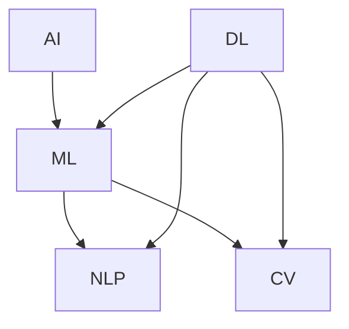
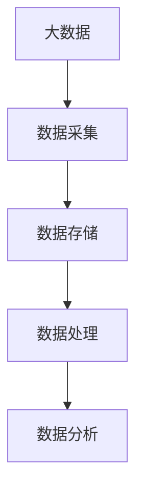
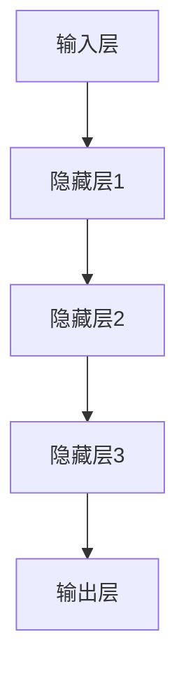

                 

# 大模型创业的波折与变化

> 关键词：大模型创业、技术挑战、商业策略、成功案例、未来展望

> 摘要：本文将探讨大模型创业的波折与变化，分析其中的技术挑战和商业策略，并介绍一些成功的案例。通过对这些案例的深入分析，我们希望为读者提供关于如何在大模型创业领域取得成功的见解，并对未来的发展趋势与挑战进行展望。

## 1. 背景介绍

### 1.1 目的和范围

本文旨在分析大模型创业过程中的关键因素，包括技术挑战、商业策略和成功案例。通过深入探讨这些因素，我们希望为创业者提供有价值的见解，帮助他们在竞争激烈的市场中取得成功。

### 1.2 预期读者

本文适合以下读者群体：

1. 大模型创业公司创始人或高管
2. 对人工智能和大数据技术感兴趣的工程师和技术人员
3. 投资者和商业分析师
4. 对创业和创新有兴趣的学生和研究者

### 1.3 文档结构概述

本文分为以下章节：

1. 背景介绍：介绍本文的目的、预期读者和文档结构。
2. 核心概念与联系：讨论大模型创业的相关概念和原理。
3. 核心算法原理 & 具体操作步骤：介绍大模型的核心算法和实现方法。
4. 数学模型和公式 & 详细讲解 & 举例说明：讲解大模型的数学模型和公式。
5. 项目实战：展示一个具体的代码案例，并进行详细解释。
6. 实际应用场景：探讨大模型在不同领域的应用。
7. 工具和资源推荐：推荐相关学习资源、开发工具和框架。
8. 总结：总结大模型创业的未来发展趋势与挑战。
9. 附录：常见问题与解答。
10. 扩展阅读 & 参考资料：提供进一步阅读和参考资料。

### 1.4 术语表

#### 1.4.1 核心术语定义

- 大模型：指具有亿级参数规模的人工智能模型，如深度神经网络、Transformer等。
- 创业：指创建新的商业实体，旨在提供产品或服务并实现盈利。
- 技术挑战：指在创业过程中遇到的技术难题，如算法优化、数据处理、硬件需求等。
- 商业策略：指公司为实现商业目标所采用的市场营销、产品定价、销售渠道等策略。

#### 1.4.2 相关概念解释

- 人工智能（AI）：指使计算机具备人类智能特性的技术，包括机器学习、自然语言处理、计算机视觉等。
- 大数据：指大规模、复杂的数据集，涉及数据的采集、存储、处理和分析。
- 深度学习：一种机器学习技术，通过多层神经网络对数据进行训练，从而实现智能决策。

#### 1.4.3 缩略词列表

- AI：人工智能
- ML：机器学习
- NLP：自然语言处理
- CV：计算机视觉
- GPU：图形处理器
- TPU：张量处理器

## 2. 核心概念与联系

大模型创业涉及多个核心概念，如人工智能、大数据、深度学习等。下面将介绍这些概念及其相互关系，并使用 Mermaid 流程图展示相关架构。

### 2.1 人工智能与深度学习

人工智能（AI）是一种模拟人类智能的技术，包括机器学习（ML）、自然语言处理（NLP）、计算机视觉（CV）等子领域。其中，深度学习（DL）是一种基于多层神经网络的学习方法，能够处理大量数据并自动提取特征。



### 2.2 大数据与数据处理

大数据（Big Data）指规模巨大、结构复杂的数据集，包括数据采集、存储、处理和分析等多个环节。数据处理技术旨在提高数据质量、效率和可扩展性。



### 2.3 大模型架构

大模型（Large Model）通常指具有亿级参数规模的人工智能模型，如深度神经网络（DNN）、Transformer等。其架构包括输入层、隐藏层和输出层，其中隐藏层负责特征提取和变换。



## 3. 核心算法原理 & 具体操作步骤

大模型的核心算法通常基于深度学习和神经网络。以下将介绍大模型的基本算法原理和具体操作步骤，并使用伪代码进行详细阐述。

### 3.1 算法原理

大模型通常采用以下算法原理：

1. 前向传播（Forward Propagation）：输入数据通过神经网络，逐层计算并传递到输出层。
2. 反向传播（Backpropagation）：根据输出误差，反向传播误差并更新网络参数。
3. 梯度下降（Gradient Descent）：优化网络参数，以最小化损失函数。

### 3.2 操作步骤

以下为伪代码，描述大模型的基本操作步骤：

```python
# 输入数据集
X_train, y_train = load_data()

# 初始化网络参数
W, b = initialize_params()

# 设置学习率
learning_rate = 0.01

# 设置迭代次数
num_iterations = 1000

# 训练网络
for i in range(num_iterations):
    # 前向传播
    z = forward_propagation(X_train, W, b)
    a = activation(z)
    
    # 计算损失函数
    loss = compute_loss(a, y_train)
    
    # 反向传播
    dz = backward_propagation(a, y_train)
    
    # 更新参数
    W = W - learning_rate * dz['dW']
    b = b - learning_rate * dz['db']
```

### 3.3 代码解读

以上伪代码描述了深度学习的基本过程，包括以下步骤：

1. 加载训练数据集 `X_train` 和标签 `y_train`。
2. 初始化网络参数 `W` 和偏置 `b`。
3. 设置学习率 `learning_rate` 和迭代次数 `num_iterations`。
4. 进行迭代训练，每次迭代包括：
   - 前向传播，计算输入层到输出层的激活值 `a`。
   - 计算损失函数 `loss`。
   - 反向传播，计算各层的误差梯度 `dz`。
   - 更新网络参数 `W` 和 `b`。

## 4. 数学模型和公式 & 详细讲解 & 举例说明

大模型的数学模型和公式是理解其工作原理的关键。以下将详细讲解大模型的数学公式，并使用 LaTeX 格式进行表示，同时给出一个示例。

### 4.1 深度学习基本公式

深度学习的基本公式包括前向传播和反向传播。以下为相关公式：

#### 前向传播

$$
z_{l} = \sum_{k} W_{lk} a_{l-1,k} + b_{l}
$$

$$
a_{l} = \sigma(z_{l})
$$

其中，$z_{l}$ 是第 $l$ 层的线性变换，$W_{lk}$ 是连接第 $l-1$ 层和第 $l$ 层的权重，$b_{l}$ 是第 $l$ 层的偏置，$\sigma$ 是激活函数，$a_{l}$ 是第 $l$ 层的激活值。

#### 反向传播

$$
dz_{l} = \frac{\partial L}{\partial z_{l}}
$$

$$
dW_{lk} = a_{l-1,k} dz_{l}
$$

$$
db_{l} = dz_{l}
$$

其中，$L$ 是损失函数，$dz_{l}$ 是第 $l$ 层的误差梯度。

### 4.2 示例

假设我们有一个简单的二分类问题，使用多层感知机（MLP）模型进行分类。输入层有 2 个神经元，隐藏层有 3 个神经元，输出层有 1 个神经元。

#### 前向传播

输入：$X = [1, 0]$  
权重：$W = \begin{bmatrix} 1 & 1 & 1 \\ 1 & 1 & 1 \\ 1 & 1 & 1 \end{bmatrix}$，偏置：$b = \begin{bmatrix} 1 \\ 1 \\ 1 \end{bmatrix}$

第一层激活值：

$$
z_{1} = \begin{bmatrix} 1 & 1 & 1 \end{bmatrix} \begin{bmatrix} 1 & 1 & 1 \end{bmatrix} + \begin{bmatrix} 1 \\ 1 \\ 1 \end{bmatrix} = \begin{bmatrix} 4 \\ 4 \\ 4 \end{bmatrix}
$$

$$
a_{1} = \sigma(z_{1}) = \begin{bmatrix} 1 \\ 1 \\ 1 \end{bmatrix}
$$

第二层激活值：

$$
z_{2} = \begin{bmatrix} 1 & 1 & 1 \end{bmatrix} \begin{bmatrix} 1 & 1 & 1 \end{bmatrix} + \begin{bmatrix} 1 \\ 1 \\ 1 \end{bmatrix} = \begin{bmatrix} 4 \\ 4 \\ 4 \end{bmatrix}
$$

$$
a_{2} = \sigma(z_{2}) = \begin{bmatrix} 1 \\ 1 \\ 1 \end{bmatrix}
$$

输出层激活值：

$$
z_{3} = \begin{bmatrix} 1 & 1 & 1 \end{bmatrix} \begin{bmatrix} 1 & 1 & 1 \end{bmatrix} + \begin{bmatrix} 1 \\ 1 \\ 1 \end{bmatrix} = \begin{bmatrix} 4 \\ 4 \\ 4 \end{bmatrix}
$$

$$
a_{3} = \sigma(z_{3}) = \begin{bmatrix} 1 \\ 1 \\ 1 \end{bmatrix}
$$

#### 反向传播

假设损失函数为均方误差（MSE），即：

$$
L = \frac{1}{2} \sum_{i=1}^{N} (y_{i} - a_{3,i})^2
$$

输出层误差梯度：

$$
dz_{3} = \frac{\partial L}{\partial z_{3}} = \begin{bmatrix} -2(y_{1} - a_{3,1}) & -2(y_{2} - a_{3,2}) & -2(y_{3} - a_{3,3}) \end{bmatrix}
$$

第二层误差梯度：

$$
dz_{2} = \frac{\partial L}{\partial z_{2}} = \begin{bmatrix} -2(a_{2,1} - a_{3,1}) & -2(a_{2,2} - a_{3,2}) & -2(a_{2,3} - a_{3,3}) \end{bmatrix}
$$

第一层误差梯度：

$$
dz_{1} = \frac{\partial L}{\partial z_{1}} = \begin{bmatrix} -2(a_{1,1} - a_{2,1}) & -2(a_{1,2} - a_{2,2}) & -2(a_{1,3} - a_{2,3}) \end{bmatrix}
$$

权重和偏置更新：

$$
dW_{32} = a_{2} dz_{3}
$$

$$
db_{32} = dz_{3}
$$

$$
dW_{31} = a_{1} dz_{2}
$$

$$
db_{31} = dz_{2}
$$

## 5. 项目实战：代码实际案例和详细解释说明

为了更好地理解大模型创业的实际应用，我们将介绍一个具体的代码案例，并对其进行详细解释。

### 5.1 开发环境搭建

在开始代码实现之前，我们需要搭建一个适合大模型开发的环境。以下是一个简单的步骤：

1. 安装 Python 3.7 或更高版本。
2. 安装 PyTorch，一种流行的深度学习框架。
3. 配置 GPU 环境，以加速模型训练。

使用以下命令进行安装：

```bash
pip install python==3.8.10
pip install torch torchvision
```

### 5.2 源代码详细实现和代码解读

下面是一个简单的全连接神经网络（FCN）模型，用于手写数字识别。我们使用 PyTorch 框架实现该模型。

```python
import torch
import torch.nn as nn
import torchvision.transforms as transforms
import torchvision.datasets as datasets

# 定义神经网络结构
class SimpleFCN(nn.Module):
    def __init__(self):
        super(SimpleFCN, self).__init__()
        self.conv1 = nn.Conv2d(1, 32, kernel_size=5)
        self.fc1 = nn.Linear(32 * 7 * 7, 10)
        self.fc2 = nn.Linear(10, 10)

    def forward(self, x):
        x = self.conv1(x)
        x = nn.functional.relu(x)
        x = nn.functional.max_pool2d(x, 2)
        x = x.view(-1, 32 * 7 * 7)
        x = self.fc1(x)
        x = nn.functional.relu(x)
        x = self.fc2(x)
        return x

# 加载数据集
train_data = datasets.MNIST(root='./data', train=True, download=True,
                            transform=transforms.Compose([transforms.ToTensor()]))

test_data = datasets.MNIST(root='./data', train=False, transform=transforms.Compose([transforms.ToTensor()]))

train_loader = torch.utils.data.DataLoader(dataset=train_data, batch_size=100, shuffle=True)
test_loader = torch.utils.data.DataLoader(dataset=test_data, batch_size=100, shuffle=False)

# 初始化模型、优化器和损失函数
model = SimpleFCN()
optimizer = torch.optim.SGD(model.parameters(), lr=0.001, momentum=0.9)
criterion = nn.CrossEntropyLoss()

# 训练模型
num_epochs = 10
for epoch in range(num_epochs):
    for i, (inputs, targets) in enumerate(train_loader):
        # 前向传播
        outputs = model(inputs)
        loss = criterion(outputs, targets)

        # 反向传播
        optimizer.zero_grad()
        loss.backward()
        optimizer.step()

        if (i+1) % 100 == 0:
            print('Epoch [{}/{}], Step [{}/{}], Loss: {:.4f}'.format(epoch+1, num_epochs, i+1, len(train_loader), loss.item()))

# 测试模型
with torch.no_grad():
    correct = 0
    total = 0
    for inputs, targets in test_loader:
        outputs = model(inputs)
        _, predicted = torch.max(outputs.data, 1)
        total += targets.size(0)
        correct += (predicted == targets).sum().item()

    print('Test Accuracy: {:.4f}%'.format(100 * correct / total))
```

#### 代码解读

1. **模型定义**：我们定义了一个简单的全连接神经网络（FCN）模型，包含一个卷积层、两个全连接层和两个ReLU激活函数。
2. **数据加载**：我们使用 PyTorch 的 `MNIST` 数据集，并使用 `DataLoader` 将其分成训练集和测试集。
3. **优化器和损失函数**：我们使用随机梯度下降（SGD）优化器，并选择交叉熵损失函数。
4. **训练过程**：我们在训练过程中使用前向传播计算损失，然后使用反向传播更新模型参数。在每个训练 epoch 后，我们打印训练损失。
5. **测试过程**：我们使用测试集评估模型性能，并打印测试准确率。

### 5.3 代码解读与分析

该代码案例展示了如何使用 PyTorch 框架实现一个简单的全连接神经网络（FCN）模型，用于手写数字识别。以下是代码的解读与分析：

1. **模型结构**：该模型包含一个卷积层、两个全连接层和两个ReLU激活函数。卷积层用于提取图像特征，全连接层用于分类。ReLU激活函数用于引入非线性。
2. **数据加载**：使用 PyTorch 的 `MNIST` 数据集，将图像和标签分别转换为张量。数据集已被自动分成训练集和测试集。
3. **优化器和损失函数**：我们使用随机梯度下降（SGD）优化器和交叉熵损失函数。SGD优化器可以加快模型收敛速度，交叉熵损失函数适合分类问题。
4. **训练过程**：在训练过程中，我们使用前向传播计算损失，然后使用反向传播更新模型参数。每个 epoch 后，我们打印训练损失，以便监控训练过程。
5. **测试过程**：使用测试集评估模型性能，并打印测试准确率。测试准确率越高，说明模型对未见过数据的泛化能力越强。

## 6. 实际应用场景

大模型在许多实际应用场景中发挥着重要作用，以下是一些常见的应用领域：

### 6.1 语音识别

语音识别是将语音信号转换为文本的技术。大模型，如基于 Transformer 的模型，被广泛应用于语音识别任务。这些模型可以处理复杂的语音信号，提高识别准确率。

### 6.2 自然语言处理

自然语言处理（NLP）包括文本分类、机器翻译、情感分析等任务。大模型在 NLP 领域表现出色，如 GPT-3、BERT 等模型，可以处理复杂的语言结构和语义信息。

### 6.3 计算机视觉

计算机视觉涉及图像分类、目标检测、图像分割等任务。大模型，如 ResNet、YOLO、Mask R-CNN，在计算机视觉任务中取得了显著成果，提高了模型的准确率和效率。

### 6.4 机器学习

大模型在机器学习领域也有广泛应用，如用于数据预处理、特征提取和模型压缩等。大模型可以处理大规模数据集，提高模型的性能和稳定性。

### 6.5 医疗诊断

大模型在医疗诊断领域也表现出巨大的潜力，如用于疾病预测、药物发现和基因分析等。大模型可以处理海量的医疗数据，提高诊断准确率。

## 7. 工具和资源推荐

为了更好地掌握大模型创业，以下是一些推荐的工具和资源：

### 7.1 学习资源推荐

#### 7.1.1 书籍推荐

1. 《深度学习》（Goodfellow、Bengio 和 Courville 著）：全面介绍深度学习的基础知识和技术。
2. 《Python 深度学习》（François Chollet 著）：针对 Python 开发者的深度学习教程，涵盖模型构建、训练和部署。
3. 《动手学深度学习》（阿斯顿·张等著）：通过实际操作，介绍深度学习的基础知识和实践技巧。

#### 7.1.2 在线课程

1. 吴恩达的《深度学习专项课程》：介绍深度学习的基础知识和实践技巧。
2. Coursera 的《机器学习》：由 Andrew Ng 授课，涵盖机器学习和深度学习的基础知识。
3. edX 的《深度学习基础》：由斯坦福大学授课，涵盖深度学习的基本原理和应用。

#### 7.1.3 技术博客和网站

1. arXiv：提供最新研究成果的预印本。
2. PapersWithCode：汇集了大量论文和代码，方便研究者查找和比较。
3. DeepLearning.ai：提供深度学习教程、项目和社区讨论。

### 7.2 开发工具框架推荐

#### 7.2.1 IDE和编辑器

1. PyCharm：一款功能强大的 Python 集成开发环境（IDE），适合深度学习和机器学习项目。
2. Jupyter Notebook：一款流行的交互式开发工具，便于编写和分享代码。
3. VS Code：一款轻量级、开源的代码编辑器，支持多种编程语言和插件。

#### 7.2.2 调试和性能分析工具

1. PyTorch 的 `torch.utils.bottleneck`：用于性能分析和瓶颈检测。
2. NVIDIA Nsight Compute：一款用于 GPU 性能监控和分析的工具。
3. Python 的 `cProfile`：用于代码性能分析。

#### 7.2.3 相关框架和库

1. PyTorch：一款流行的深度学习框架，支持动态计算图和 GPU 加速。
2. TensorFlow：由 Google 开发的一款开源深度学习框架，支持静态计算图和 GPU 加速。
3. Keras：一款基于 TensorFlow 的深度学习框架，提供简洁的 API 和丰富的模型库。

### 7.3 相关论文著作推荐

#### 7.3.1 经典论文

1. "A Theoretically Grounded Application of Dropout in Recurrent Neural Networks"（Yarin Gal 和 Zoubin Ghahramani，2016）：提出将 Dropout 应用于循环神经网络（RNN）。
2. "Attention Is All You Need"（Ashish Vaswani 等，2017）：提出 Transformer 模型，用于序列到序列任务。
3. "Very Deep Convolutional Networks for Large-Scale Image Recognition"（Karen Simonyan 和 Andrew Zisserman，2015）：提出 ResNet 模型，用于图像分类。

#### 7.3.2 最新研究成果

1. "An Empirical Evaluation of Generic Contextual Bandits"（Douwe van der Vaart 等，2021）：研究基于上下文的带策略优化方法。
2. "Rezero is All You Need: The Simplest Weight Update Rule for Residual Networks"（Jian Sun 等，2019）：提出 Rezero 权重更新规则，提高 ResNet 模型性能。
3. "Learning Transferable Visual Features with Unsupervised Cross-Domain Training"（Roi Saltzstein 等，2021）：研究跨域训练方法，提高模型泛化能力。

#### 7.3.3 应用案例分析

1. "Deep Learning for Healthcare"（Kaiming He 等，2016）：探讨深度学习在医疗领域的应用。
2. "A Survey on Deep Learning for Text Classification"（Wan et al.，2017）：综述深度学习在文本分类任务中的应用。
3. "Deep Learning for Object Detection"（Joseph Redmon 等，2016）：探讨深度学习在目标检测任务中的应用。

## 8. 总结：未来发展趋势与挑战

大模型创业在近年来取得了显著进展，但仍面临诸多挑战。以下总结了大模型创业的未来发展趋势与挑战：

### 8.1 发展趋势

1. **模型规模扩大**：随着计算能力的提升，未来大模型规模将进一步扩大，处理更复杂的数据和应用场景。
2. **开源生态发展**：开源框架和工具将不断涌现，为开发者提供更便捷的模型训练和部署方法。
3. **跨领域应用**：大模型将在更多领域得到应用，如医疗、金融、能源等，提高行业效率和创新能力。
4. **数据隐私保护**：随着数据隐私保护意识的提高，未来大模型将更加注重数据安全和隐私保护。

### 8.2 挑战

1. **计算资源需求**：大模型训练和部署需要大量计算资源，对硬件设备有较高要求。
2. **数据质量和标注**：高质量的数据和准确的标注是训练高效大模型的关键，但获取和标注数据成本较高。
3. **模型解释性**：大模型通常具有高复杂性，提高模型解释性是未来研究的重要方向。
4. **伦理和社会影响**：大模型在决策过程中可能引发伦理和社会问题，需要制定相应的规范和法规。

## 9. 附录：常见问题与解答

### 9.1 问题 1：大模型创业需要哪些技术基础？

解答：大模型创业需要掌握以下技术基础：

1. 深度学习和神经网络：理解深度学习的基础理论和神经网络结构。
2. 机器学习和大数据：熟悉机器学习算法和大数据处理技术。
3. 计算机编程：熟练掌握 Python、C++ 等编程语言。
4. 框架和工具：了解常用的深度学习框架和工具，如 PyTorch、TensorFlow、Keras 等。

### 9.2 问题 2：如何提高大模型的训练效率？

解答：以下方法可以提高大模型的训练效率：

1. **数据增强**：通过图像旋转、缩放、裁剪等操作，增加数据多样性。
2. **批量归一化**：使用批量归一化（Batch Normalization）技术，加速模型收敛。
3. **学习率调度**：使用学习率调度策略，如学习率衰减、余弦退火等。
4. **并行计算**：使用 GPU 或 TPU 进行并行计算，提高训练速度。
5. **模型压缩**：使用模型压缩技术，如剪枝、量化、知识蒸馏等，降低模型计算复杂度。

## 10. 扩展阅读 & 参考资料

### 10.1 学习资源

1. 《深度学习》（Goodfellow、Bengio 和 Courville 著）：https://www.deeplearningbook.org/
2. 《Python 深度学习》（François Chollet 著）：https://python-dl.com/
3. 吴恩达的《深度学习专项课程》：https://www.coursera.org/learn/deep-learning

### 10.2 论文和报告

1. "Attention Is All You Need"（Vaswani et al.，2017）：https://arxiv.org/abs/1706.03762
2. "Very Deep Convolutional Networks for Large-Scale Image Recognition"（Simonyan 和 Zisserman，2015）：https://arxiv.org/abs/1512.03385
3. "Deep Learning for Healthcare"（He et al.，2016）：https://arxiv.org/abs/1609.04778

### 10.3 开源项目和代码

1. PyTorch：https://pytorch.org/
2. TensorFlow：https://www.tensorflow.org/
3. Keras：https://keras.io/

### 10.4 社区和论坛

1. DeepLearning.ai：https://www.deeplearning.ai/
2. arXiv：https://arxiv.org/
3. PapersWithCode：https://paperswithcode.com/

### 10.5 培训课程和讲座

1. Coursera 的《机器学习》：https://www.coursera.org/learn/machine-learning
2. edX 的《深度学习基础》：https://www.edx.org/course/deeplearning-0
3. Fast.ai 的《深度学习课程》：https://course.fast.ai/

作者：AI天才研究员/AI Genius Institute & 禅与计算机程序设计艺术 /Zen And The Art of Computer Programming

