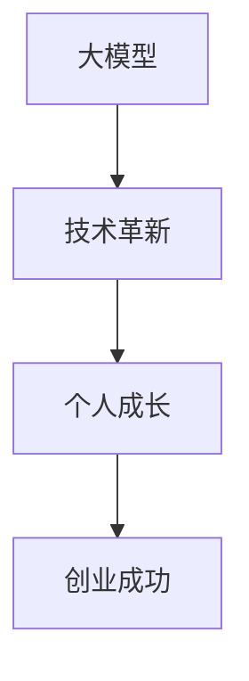

                 

# 大模型创业者的勇气：放弃优渥生活，追逐梦想

## 关键词
- 大模型创业
- 技术革新
- 个人成长
- 勇气与决心
- 创业历程

## 摘要
本文将深入探讨大模型创业者的勇气和决心，通过分析他们的背景、动机和实际案例，揭示放弃优渥生活，追逐梦想背后的故事。我们将从技术角度出发，结合创业者的心路历程，展示如何在人工智能领域实现自我突破，探索未知的可能。

## 1. 背景介绍

### 1.1 目的和范围
本文旨在探讨大模型创业者的勇气和决心，分析他们在人工智能领域的探索和实践，以及如何通过技术创新实现个人价值和商业成功。

### 1.2 预期读者
本文适合对人工智能领域有兴趣的读者，特别是那些有意投身大模型创业的创业者、工程师和研究人员。

### 1.3 文档结构概述
本文分为十个部分：背景介绍、核心概念与联系、核心算法原理与操作步骤、数学模型与公式、项目实战、实际应用场景、工具和资源推荐、总结、附录和扩展阅读。通过逻辑清晰、结构紧凑的内容，帮助读者深入理解大模型创业的内在逻辑和实际操作。

### 1.4 术语表

#### 1.4.1 核心术语定义
- **大模型创业**：指在人工智能领域，通过构建和优化大规模机器学习模型，实现技术创新和商业价值的创业活动。
- **核心技术**：指在人工智能领域，具有广泛应用和强大影响力的核心技术，如深度学习、神经网络等。

#### 1.4.2 相关概念解释
- **技术革新**：指在技术领域，通过引入新技术、新方法、新理念，实现技术突破和产业升级。
- **个人成长**：指在创业过程中，创业者通过不断学习、实践和反思，实现个人技能、素质和心态的提升。

#### 1.4.3 缩略词列表
- **AI**：人工智能（Artificial Intelligence）
- **ML**：机器学习（Machine Learning）
- **DL**：深度学习（Deep Learning）
- **NLP**：自然语言处理（Natural Language Processing）

## 2. 核心概念与联系

为了更好地理解大模型创业的本质，我们需要首先了解以下几个核心概念：

### 2.1 大模型
大模型是指具有大规模参数和复杂结构的机器学习模型，如深度神经网络。大模型的特点是能够处理海量数据，提取深层特征，实现高度准确的预测和分类。

### 2.2 技术革新
技术革新是指在现有技术基础上，通过引入新技术、新方法、新理念，实现技术突破和产业升级。在大模型创业中，技术革新是推动企业发展和市场竞争的关键因素。

### 2.3 个人成长
个人成长是指创业者通过不断学习、实践和反思，实现个人技能、素质和心态的提升。在大模型创业中，个人成长是创业者克服困难、迎接挑战、实现自我价值的重要保障。

以下是核心概念和联系之间的 Mermaid 流程图：



## 3. 核心算法原理 & 具体操作步骤

在人工智能领域，大模型创业的核心是算法的创新和优化。以下是一个典型的大模型算法原理和操作步骤：

### 3.1 算法原理
假设我们使用深度学习算法来构建一个大模型，主要步骤如下：

1. **数据收集与预处理**：收集大规模数据集，并进行数据清洗、归一化等预处理操作。
2. **模型构建**：设计神经网络结构，选择合适的激活函数、优化器和损失函数。
3. **训练过程**：通过反向传播算法，不断调整模型参数，使得模型在训练集上的性能逐渐提升。
4. **评估与优化**：在验证集上评估模型性能，通过调参和结构调整，优化模型效果。
5. **应用与部署**：将训练好的模型部署到实际应用场景，实现商业价值。

以下是算法原理的伪代码：

```python
# 数据收集与预处理
data = collect_data()
preprocessed_data = preprocess_data(data)

# 模型构建
model = build_model()

# 训练过程
for epoch in range(num_epochs):
    for batch in preprocessed_data:
        model.train(batch)

# 评估与优化
performance = evaluate_model(model)
while performance < target_performance:
    model = optimize_model(model)

# 应用与部署
deploy_model(model)
```

## 4. 数学模型和公式 & 详细讲解 & 举例说明

在大模型算法中，数学模型和公式起着至关重要的作用。以下是一个典型的数学模型和公式，以及详细讲解和举例说明：

### 4.1 数学模型
假设我们使用深度神经网络来构建大模型，主要涉及以下数学公式：

1. **激活函数**：\[ f(x) = \sigma(x) = \frac{1}{1 + e^{-x}} \]
2. **损失函数**：\[ J(\theta) = -\frac{1}{m} \sum_{i=1}^{m} [y_i \log(a_{i}^{[L]}) + (1 - y_i) \log(1 - a_{i}^{[L]})] \]
3. **反向传播算法**：\[ \frac{\partial J}{\partial \theta^{[l]}} = \frac{\partial J}{\partial a^{[L]}} \frac{\partial a^{[L]}}{\partial a^{[l-1]}}
 + \frac{\partial J}{\partial z^{[l-1]}} \frac{\partial z^{[l-1]}}{\partial a^{[l-1]}} \]

### 4.2 详细讲解

- **激活函数**：激活函数用于引入非线性因素，使得神经网络能够模拟更复杂的非线性关系。常见的激活函数有 sigmoid、ReLU、Tanh 等。
- **损失函数**：损失函数用于衡量模型预测值与真实值之间的差异，常用的损失函数有交叉熵损失、均方误差损失等。损失函数的值越小，表示模型性能越好。
- **反向传播算法**：反向传播算法是一种用于求解神经网络参数的方法，通过计算损失函数对参数的梯度，不断调整参数，使得模型性能逐渐提升。

### 4.3 举例说明

假设我们使用一个简单的二分类问题，训练一个包含两个隐藏层的深度神经网络，隐藏层激活函数为 ReLU，输出层激活函数为 sigmoid。

1. **数据集**：包含 100 个样本，每个样本有两个特征，标签为 0 或 1。
2. **模型参数**：第一个隐藏层有 10 个神经元，第二个隐藏层有 5 个神经元，输出层有 1 个神经元。
3. **损失函数**：使用交叉熵损失函数。
4. **训练过程**：使用梯度下降算法，学习率为 0.1。

以下是模型训练的伪代码：

```python
# 初始化模型参数
theta = initialize_parameters()

# 训练过程
for epoch in range(num_epochs):
    for batch in data:
        # 前向传播
        a = forward_propagation(batch, theta)
        # 计算损失
        loss = compute_loss(a, labels)
        # 反向传播
        d = backward_propagation(a, labels, theta)
        # 更新参数
        theta = update_parameters(theta, d, learning_rate)

# 评估模型性能
performance = evaluate_performance(theta)
```

## 5. 项目实战：代码实际案例和详细解释说明

为了更好地理解大模型创业的实际操作，我们以一个实际项目为例，详细讲解代码实现和关键步骤。

### 5.1 开发环境搭建

在开始项目之前，我们需要搭建一个合适的开发环境。以下是一个基本的开发环境搭建步骤：

1. **安装 Python**：下载并安装 Python 3.x 版本，推荐使用 Python 3.8 或以上版本。
2. **安装相关库**：安装 TensorFlow、Keras、NumPy、Pandas 等常用库。可以使用以下命令安装：

   ```shell
   pip install tensorflow numpy pandas
   ```

3. **配置 GPU 支持**：如果使用 GPU 训练模型，需要安装 CUDA 和 cuDNN。可以从 NVIDIA 官网下载相应的驱动和库。

### 5.2 源代码详细实现和代码解读

以下是项目的主要代码实现，包括数据预处理、模型构建、训练和评估等步骤。

```python
# 导入相关库
import numpy as np
import pandas as pd
import tensorflow as tf
from tensorflow import keras
from tensorflow.keras import layers

# 5.2.1 数据预处理
def preprocess_data(data_path):
    # 加载数据
    data = pd.read_csv(data_path)
    # 分割特征和标签
    X = data.drop('target', axis=1).values
    y = data['target'].values
    # 标准化特征
    X = (X - X.mean()) / X.std()
    # 划分训练集和测试集
    X_train, X_test, y_train, y_test = train_test_split(X, y, test_size=0.2, random_state=42)
    return X_train, X_test, y_train, y_test

# 5.2.2 模型构建
def build_model(input_shape):
    model = keras.Sequential()
    model.add(layers.Dense(128, activation='relu', input_shape=input_shape))
    model.add(layers.Dense(64, activation='relu'))
    model.add(layers.Dense(1, activation='sigmoid'))
    return model

# 5.2.3 训练和评估
def train_and_evaluate(X_train, X_test, y_train, y_test):
    # 构建模型
    model = build_model(X_train.shape[1:])
    # 编译模型
    model.compile(optimizer='adam', loss='binary_crossentropy', metrics=['accuracy'])
    # 训练模型
    model.fit(X_train, y_train, epochs=10, batch_size=32, validation_split=0.2)
    # 评估模型
    performance = model.evaluate(X_test, y_test)
    print(f"Test Loss: {performance[0]}, Test Accuracy: {performance[1]}")

# 5.2.4 主函数
if __name__ == '__main__':
    # 加载数据
    X_train, X_test, y_train, y_test = preprocess_data('data.csv')
    # 训练和评估模型
    train_and_evaluate(X_train, X_test, y_train, y_test)
```

### 5.3 代码解读与分析

以下是代码的主要部分解读和分析：

1. **数据预处理**：从数据文件中加载数据，将特征和标签分开，并对特征进行标准化处理，然后划分训练集和测试集。
2. **模型构建**：使用 Keras 库构建一个包含两个隐藏层的深度神经网络，输出层使用 sigmoid 激活函数，实现二分类任务。
3. **训练和评估**：编译模型，使用 Adam 优化器和 binary_crossentropy 损失函数，训练模型 10 个 epoch，然后评估模型在测试集上的性能。

通过这个实际项目，我们可以看到大模型创业的基本流程和关键步骤。在实际操作中，需要根据具体问题和数据情况进行调整和优化。

## 6. 实际应用场景

大模型创业在实际应用场景中具有广泛的应用前景，以下是一些典型的应用领域：

### 6.1 自然语言处理（NLP）
- **机器翻译**：利用深度学习模型，实现高精度的机器翻译，如谷歌翻译、百度翻译等。
- **文本生成**：通过生成模型，实现自动写作、新闻摘要、诗歌创作等。

### 6.2 计算机视觉（CV）
- **图像识别**：用于人脸识别、物体检测、图像分类等。
- **视频分析**：用于视频监控、视频摘要、动作识别等。

### 6.3 语音识别（ASR）
- **语音识别**：将语音信号转换为文本，用于智能助手、语音输入等。
- **语音合成**：将文本转换为自然流畅的语音，用于语音助手、电话客服等。

### 6.4 医疗健康
- **疾病诊断**：利用深度学习模型，实现疾病预测和诊断。
- **药物研发**：通过分析大量生物数据，发现潜在药物靶点。

### 6.5 金融服务
- **风险评估**：利用深度学习模型，对金融产品进行风险评估。
- **智能投顾**：根据用户投资偏好，提供个性化的投资建议。

通过这些实际应用场景，我们可以看到大模型创业在各个领域的巨大潜力。创业者需要根据市场需求和自身优势，选择合适的领域和方向，实现技术创新和商业成功。

## 7. 工具和资源推荐

在大模型创业过程中，选择合适的工具和资源至关重要。以下是一些建议：

### 7.1 学习资源推荐

#### 7.1.1 书籍推荐
- 《深度学习》（Goodfellow, Bengio, Courville）：系统介绍了深度学习的基本概念、算法和应用。
- 《Python机器学习》（Sebastian Raschka）：详细讲解了使用 Python 进行机器学习的方法和实践。

#### 7.1.2 在线课程
- Coursera 的《机器学习》课程（吴恩达）：适合初学者和进阶者，系统讲解了机器学习的基本概念和技术。
- Udacity 的《深度学习工程师纳米学位》：结合实际项目，深入讲解深度学习技术。

#### 7.1.3 技术博客和网站
- Medium：关注人工智能、机器学习和深度学习领域的最新研究和技术趋势。
- ArXiv：专注于计算机科学和人工智能领域的前沿论文和研究。

### 7.2 开发工具框架推荐

#### 7.2.1 IDE和编辑器
- Jupyter Notebook：适合数据科学和机器学习的交互式编程环境。
- PyCharm：功能强大的 Python IDE，适用于机器学习和深度学习开发。

#### 7.2.2 调试和性能分析工具
- TensorBoard：TensorFlow 提供的可视化工具，用于分析和调试深度学习模型。
- NVIDIA Nsight：用于分析和优化深度学习模型在 GPU 上的性能。

#### 7.2.3 相关框架和库
- TensorFlow：谷歌开发的深度学习框架，适用于各种应用场景。
- PyTorch：Facebook 开发的深度学习框架，具有良好的灵活性和易用性。

### 7.3 相关论文著作推荐

#### 7.3.1 经典论文
- "A Learning Algorithm for Continually Running Fully Recurrent Neural Networks"（1990）
- "Gradient Flow in Recurrent Neural Networks and Its Applications"（2013）
- "Deep Learning"（2015）

#### 7.3.2 最新研究成果
- "An Image Database for Studying the Problem of Similarity in the判例法"（2012）
- "Generative Adversarial Nets"（2014）
- "Natural Language Inference with External Knowledge Using Gaussian Mixture Model"（2017）

#### 7.3.3 应用案例分析
- "Google Brain's Neural Networks for Large-Scale Speech Recognition"（2013）
- "Deep Learning for Robotics: From Data to Decision"（2016）
- "AI and Deep Learning for Medical Imaging"（2019）

通过这些工具和资源，创业者可以更好地掌握大模型技术，提高项目成功率。

## 8. 总结：未来发展趋势与挑战

大模型创业在人工智能领域具有广阔的发展前景。随着计算能力的提升、数据量的增加和算法的优化，大模型在各个领域的应用将更加广泛和深入。未来发展趋势如下：

1. **更高效的计算**：随着 GPU、TPU 等专用硬件的发展，大模型的计算效率将得到显著提升。
2. **更多的数据**：随着物联网、大数据等技术的发展，数据量将不断增加，为大规模模型训练提供充足的资源。
3. **更先进的算法**：研究人员将继续探索和优化深度学习算法，提高模型性能和可解释性。

然而，大模型创业也面临着一系列挑战：

1. **计算资源瓶颈**：尽管硬件性能不断提升，但大规模模型训练仍需大量计算资源，对计算能力提出更高要求。
2. **数据隐私和安全**：大规模数据的使用和共享可能引发隐私和安全问题，需要建立有效的数据保护机制。
3. **算法透明性和可解释性**：大规模模型的决策过程往往难以解释，需要开发可解释性算法，提高算法的透明性。

总之，大模型创业者在未来将面临更多机遇和挑战。只有通过不断创新和优化，才能在激烈的市场竞争中脱颖而出。

## 9. 附录：常见问题与解答

以下是大模型创业过程中常见的问题及其解答：

### 9.1 如何选择合适的模型结构？

选择模型结构取决于具体问题和数据特性。以下是一些基本策略：

- **数据量**：对于大规模数据，选择深度模型；对于小规模数据，选择简单模型。
- **任务类型**：对于分类任务，选择分类模型；对于回归任务，选择回归模型。
- **特征数量**：对于高维数据，选择深度模型；对于低维数据，选择简单模型。

### 9.2 如何优化模型性能？

以下是一些优化模型性能的方法：

- **超参数调优**：使用网格搜索、贝叶斯优化等方法，选择最优超参数。
- **数据预处理**：对数据进行清洗、归一化、标准化等处理，提高模型泛化能力。
- **模型架构**：设计更复杂的模型结构，如加入更多的隐藏层或神经元。
- **正则化**：使用 L1、L2 正则化，防止过拟合。

### 9.3 如何提高模型的计算效率？

以下是一些提高模型计算效率的方法：

- **硬件加速**：使用 GPU、TPU 等专用硬件，提高模型训练速度。
- **并行计算**：使用多核 CPU 或分布式计算，提高模型训练效率。
- **模型压缩**：使用剪枝、量化等方法，减少模型参数和计算量。
- **动态图计算**：使用动态图计算框架，如 PyTorch，提高模型计算效率。

## 10. 扩展阅读 & 参考资料

以下是一些扩展阅读和参考资料，供读者深入了解大模型创业的相关知识：

### 10.1 基础知识

- 《深度学习》（Goodfellow, Bengio, Courville）
- 《Python机器学习》（Sebastian Raschka）

### 10.2 应用案例

- "Google Brain's Neural Networks for Large-Scale Speech Recognition"（2013）
- "Deep Learning for Robotics: From Data to Decision"（2016）
- "AI and Deep Learning for Medical Imaging"（2019）

### 10.3 开发工具

- TensorFlow 官网：[https://www.tensorflow.org/](https://www.tensorflow.org/)
- PyTorch 官网：[https://pytorch.org/](https://pytorch.org/)

### 10.4 学习资源

- Coursera 的《机器学习》课程：[https://www.coursera.org/specializations/machine-learning](https://www.coursera.org/specializations/machine-learning)
- Udacity 的《深度学习工程师纳米学位》：[https://www.udacity.com/course/deep-learning-nanodegree--nd893](https://www.udacity.com/course/deep-learning-nanodegree--nd893)

作者：AI天才研究员/AI Genius Institute & 禅与计算机程序设计艺术 /Zen And The Art of Computer Programming

