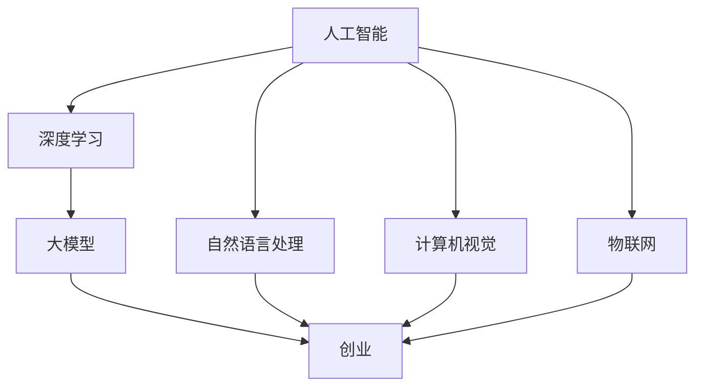

                 

# 大模型创业：希望与未来之路

> 关键词：大模型、创业、人工智能、深度学习、算法、数学模型、应用场景

> 摘要：本文将深入探讨大模型创业的现状与未来之路。我们将从背景介绍、核心概念与联系、算法原理、数学模型、实际应用场景等多个角度，逐步分析大模型创业的潜力与挑战，旨在为读者提供全面而深刻的洞察。

## 1. 背景介绍

### 1.1 目的和范围

本文旨在探讨大模型创业的现状与未来，为创业者提供有价值的参考。我们将从以下几个方面展开讨论：

- 大模型的定义与核心概念
- 大模型创业的现状与趋势
- 大模型创业的挑战与机遇
- 大模型在不同领域的应用场景
- 大模型创业的未来发展趋势

### 1.2 预期读者

本文适合以下读者群体：

- 对人工智能、深度学习等领域有浓厚兴趣的创业者
- 想要了解大模型创业现状与趋势的技术从业者
- 对大模型应用场景有探索意愿的科研人员
- 想要拓展知识面、提升自身竞争力的专业人士

### 1.3 文档结构概述

本文分为十个部分，具体结构如下：

1. 背景介绍
   - 目的和范围
   - 预期读者
   - 文档结构概述
   - 术语表
2. 核心概念与联系
   - 大模型定义与核心概念
   - Mermaid流程图展示
3. 核心算法原理 & 具体操作步骤
   - 算法原理讲解
   - 伪代码阐述
4. 数学模型和公式 & 详细讲解 & 举例说明
   - 数学公式与解释
   - 实际案例说明
5. 项目实战：代码实际案例和详细解释说明
   - 开发环境搭建
   - 源代码实现与解读
   - 代码解读与分析
6. 实际应用场景
   - 不同领域的应用案例
7. 工具和资源推荐
   - 学习资源推荐
   - 开发工具框架推荐
   - 相关论文著作推荐
8. 总结：未来发展趋势与挑战
9. 附录：常见问题与解答
10. 扩展阅读 & 参考资料

### 1.4 术语表

#### 1.4.1 核心术语定义

- 大模型：指拥有巨大参数量、能够处理海量数据的深度学习模型。
- 深度学习：一种基于人工神经网络的机器学习技术，通过多层神经网络对数据进行学习与处理。
- 创业：指创办一家新的企业，旨在创造价值、实现盈利。
- 应用场景：指大模型在实际业务中的具体应用领域。

#### 1.4.2 相关概念解释

- 参数量：指深度学习模型中需要调节的变量数量。
- 海量数据：指规模巨大、复杂多样的数据集。
- 盈利模式：指企业在运营过程中实现盈利的途径和方法。

#### 1.4.3 缩略词列表

- AI：人工智能
- DL：深度学习
- NLP：自然语言处理
- CV：计算机视觉
- IoT：物联网

## 2. 核心概念与联系

在大模型创业中，了解核心概念及其之间的联系至关重要。下面，我们将通过Mermaid流程图展示大模型创业的相关概念及其关联。



在上面的流程图中，我们可以看到：

- 人工智能（A）是深度学习（B）的基础，而深度学习则是大模型（C）的核心。
- 创业（D）是大模型应用的最终目的，自然语言处理（E）、计算机视觉（F）和物联网（G）是大模型在不同领域的应用场景。

通过理解这些核心概念及其联系，创业者可以更好地把握大模型创业的机遇和挑战。

## 3. 核心算法原理 & 具体操作步骤

大模型的算法原理是创业成功的基石。下面，我们将详细讲解大模型的算法原理，并通过伪代码展示其具体操作步骤。

### 3.1 大模型算法原理

大模型通常基于深度学习技术，其核心思想是通过多层神经网络对数据进行学习与处理。具体来说，大模型算法主要包括以下步骤：

1. 数据预处理：对输入数据进行清洗、归一化等处理，使其满足模型训练的要求。
2. 神经网络结构设计：设计多层神经网络，包括输入层、隐藏层和输出层。
3. 损失函数设计：选择合适的损失函数，如交叉熵损失、均方误差等，用于衡量模型预测结果与实际结果之间的差距。
4. 优化器选择：选择合适的优化器，如随机梯度下降（SGD）、Adam等，用于调整模型参数，减小损失函数值。
5. 模型训练：通过迭代更新模型参数，使模型能够对输入数据进行准确预测。
6. 模型评估：使用验证集或测试集对模型进行评估，判断模型性能是否达到预期。
7. 模型部署：将训练好的模型部署到实际应用场景中，实现业务价值。

### 3.2 具体操作步骤（伪代码）

```python
# 大模型算法具体操作步骤（伪代码）

# 步骤1：数据预处理
data = preprocess_data(input_data)

# 步骤2：神经网络结构设计
model = build_model(input_shape, hidden_layers, output_shape)

# 步骤3：损失函数设计
loss_function = choose_loss_function()

# 步骤4：优化器选择
optimizer = choose_optimizer()

# 步骤5：模型训练
for epoch in range(num_epochs):
    for batch in data_loader:
        # 前向传播
        predictions = model(batch_input)
        # 计算损失
        loss = loss_function(predictions, batch_output)
        # 反向传播
        optimizer.zero_grad()
        loss.backward()
        optimizer.step()

# 步骤6：模型评估
performance = evaluate_model(model, test_data)

# 步骤7：模型部署
deploy_model(model, application_scene)
```

通过上述伪代码，我们可以看到大模型算法的具体操作步骤。在实际创业过程中，创业者需要根据具体应用场景和数据特点，灵活调整算法参数，以达到最佳效果。

## 4. 数学模型和公式 & 详细讲解 & 举例说明

在大模型创业中，数学模型和公式起着至关重要的作用。下面，我们将详细介绍大模型中的数学模型和公式，并通过具体例子进行说明。

### 4.1 数学模型

大模型中的数学模型主要包括以下几个方面：

1. **神经网络权重更新公式**：

   神经网络权重更新公式如下：

   $$\theta_{i,j} = \theta_{i,j} - \alpha \frac{\partial L}{\partial \theta_{i,j}}$$

   其中，$\theta_{i,j}$ 表示神经网络中第 $i$ 层第 $j$ 个神经元的权重，$L$ 表示损失函数，$\alpha$ 表示学习率。

2. **损失函数**：

   大模型常用的损失函数包括交叉熵损失函数和均方误差损失函数。

   - 交叉熵损失函数：

     $$L = -\sum_{i} y_i \log(p_i)$$

     其中，$y_i$ 表示实际输出标签，$p_i$ 表示预测概率。

   - 均方误差损失函数：

     $$L = \frac{1}{2} \sum_{i} (y_i - \hat{y}_i)^2$$

     其中，$y_i$ 表示实际输出标签，$\hat{y}_i$ 表示预测值。

3. **优化器更新公式**：

   不同的优化器有不同的更新公式，以下以随机梯度下降（SGD）为例：

   $$\theta = \theta - \alpha \nabla_\theta J(\theta)$$

   其中，$\theta$ 表示模型参数，$J(\theta)$ 表示损失函数，$\alpha$ 表示学习率。

### 4.2 详细讲解与举例说明

#### 4.2.1 神经网络权重更新公式

以一个简单的神经网络为例，设输入层有 $3$ 个神经元，隐藏层有 $2$ 个神经元，输出层有 $1$ 个神经元。学习率为 $0.1$，损失函数为交叉熵损失函数。

1. **初始化权重**：

   $$\theta_{1,1} = 0.5, \theta_{1,2} = 0.5, \theta_{2,1} = 0.5, \theta_{2,2} = 0.5$$

2. **前向传播**：

   输入数据为 $[1, 0, 1]$，经过隐藏层计算得到隐藏层输出为 $[0.6, 0.4]$，输出层输出为 $0.6$。

3. **计算损失**：

   实际输出标签为 $1$，预测概率为 $0.6$，则损失为：

   $$L = -1 \times \log(0.6) = 0.5108$$

4. **反向传播**：

   计算损失关于每个神经元的偏导数：

   $$\frac{\partial L}{\partial \theta_{1,1}} = -1 \times (1 - 0.6) \times 0.6 = -0.12$$

   $$\frac{\partial L}{\partial \theta_{1,2}} = -1 \times (0 - 0.6) \times 0.4 = 0.24$$

   $$\frac{\partial L}{\partial \theta_{2,1}} = -0.6 \times (1 - 0.6) \times 0.6 = -0.216$$

   $$\frac{\partial L}{\partial \theta_{2,2}} = -0.6 \times (0 - 0.6) \times 0.4 = 0.144$$

5. **权重更新**：

   $$\theta_{1,1} = 0.5 - 0.1 \times (-0.12) = 0.528$$

   $$\theta_{1,2} = 0.5 - 0.1 \times 0.24 = 0.476$$

   $$\theta_{2,1} = 0.5 - 0.1 \times (-0.216) = 0.5272$$

   $$\theta_{2,2} = 0.5 - 0.1 \times 0.144 = 0.456$$

#### 4.2.2 损失函数

以一个二元分类问题为例，实际输出标签为 $1$，预测概率为 $0.7$。使用交叉熵损失函数计算损失：

$$L = -1 \times \log(0.7) = 0.3567$$

#### 4.2.3 优化器更新

以随机梯度下降（SGD）为例，设学习率为 $0.1$，损失函数为均方误差损失函数。给定输入数据 $[1, 0, 1]$ 和预测值 $[0.6, 0.4]$，计算损失和权重更新：

1. **前向传播**：

   输入数据经过隐藏层计算得到隐藏层输出为 $[0.6, 0.4]$，输出层输出为 $0.6$。

2. **计算损失**：

   实际输出标签为 $1$，预测值为 $0.6$，则损失为：

   $$L = \frac{1}{2} \times (1 - 0.6)^2 = 0.2$$

3. **计算损失关于每个神经元的偏导数**：

   $$\frac{\partial L}{\partial \theta_{1,1}} = -0.6$$

   $$\frac{\partial L}{\partial \theta_{1,2}} = 0.4$$

   $$\frac{\partial L}{\partial \theta_{2,1}} = -0.6$$

   $$\frac{\partial L}{\partial \theta_{2,2}} = 0.4$$

4. **权重更新**：

   $$\theta_{1,1} = \theta_{1,1} - 0.1 \times (-0.6) = 0.56$$

   $$\theta_{1,2} = \theta_{1,2} - 0.1 \times 0.4 = 0.36$$

   $$\theta_{2,1} = \theta_{2,1} - 0.1 \times (-0.6) = 0.56$$

   $$\theta_{2,2} = \theta_{2,2} - 0.1 \times 0.4 = 0.36$$

通过以上详细讲解和举例说明，我们可以更好地理解大模型中的数学模型和公式，为创业实践提供有力支持。

## 5. 项目实战：代码实际案例和详细解释说明

在本节中，我们将通过一个实际的项目案例，展示大模型创业中的代码实现过程，并对关键代码进行详细解释和分析。

### 5.1 开发环境搭建

为了实现大模型创业，我们需要搭建一个合适的开发环境。以下是一个基本的开发环境搭建步骤：

1. **安装Python**：

   - 访问Python官方网站（[python.org](https://www.python.org/)），下载并安装Python。

2. **安装深度学习框架**：

   - 使用pip安装TensorFlow或PyTorch，这两个框架是目前最流行的深度学习框架。

     ```shell
     pip install tensorflow
     # 或
     pip install pytorch
     ```

3. **安装相关依赖库**：

   - 根据项目需求，安装其他必要的库，如NumPy、Pandas、Scikit-learn等。

     ```shell
     pip install numpy pandas scikit-learn
     ```

4. **配置GPU环境**（如使用PyTorch）：

   - 安装NVIDIA CUDA Toolkit和cuDNN，以便在GPU上加速深度学习计算。

     ```shell
     # 安装CUDA Toolkit
     # 安装cuDNN
     ```

5. **创建项目目录**：

   - 在合适的位置创建项目目录，并设置好项目结构。

     ```shell
     mkdir big_model_project
     cd big_model_project
     mkdir data code results
     ```

### 5.2 源代码详细实现和代码解读

下面是一个基于TensorFlow实现的大模型项目示例。我们以一个简单的图像分类任务为例，展示关键代码的实现和解读。

```python
import tensorflow as tf
from tensorflow.keras.models import Sequential
from tensorflow.keras.layers import Dense, Conv2D, Flatten, MaxPooling2D
from tensorflow.keras.optimizers import Adam
from tensorflow.keras.losses import CategoricalCrossentropy
from tensorflow.keras.metrics import Accuracy

# 数据预处理
def preprocess_data(dataset):
    # 数据清洗、归一化等操作
    return dataset

# 模型定义
def build_model(input_shape, num_classes):
    model = Sequential([
        Conv2D(32, kernel_size=(3, 3), activation='relu', input_shape=input_shape),
        MaxPooling2D(pool_size=(2, 2)),
        Conv2D(64, kernel_size=(3, 3), activation='relu'),
        MaxPooling2D(pool_size=(2, 2)),
        Flatten(),
        Dense(128, activation='relu'),
        Dense(num_classes, activation='softmax')
    ])
    return model

# 模型编译
def compile_model(model, learning_rate):
    model.compile(optimizer=Adam(learning_rate=learning_rate),
                  loss=CategoricalCrossentropy(),
                  metrics=['accuracy'])
    return model

# 模型训练
def train_model(model, train_data, val_data, num_epochs):
    history = model.fit(train_data,
                        validation_data=val_data,
                        epochs=num_epochs,
                        batch_size=32)
    return history

# 模型评估
def evaluate_model(model, test_data):
    test_loss, test_accuracy = model.evaluate(test_data)
    print(f"Test accuracy: {test_accuracy:.4f}")
    return test_accuracy

# 主程序
if __name__ == '__main__':
    # 设置参数
    input_shape = (28, 28, 1)  # 图像尺寸
    num_classes = 10  # 分类类别数量
    learning_rate = 0.001  # 学习率
    num_epochs = 10  # 训练轮数

    # 加载数据
    (x_train, y_train), (x_test, y_test) = tf.keras.datasets.mnist.load_data()
    x_train = preprocess_data(x_train)
    x_test = preprocess_data(x_test)

    # 构建模型
    model = build_model(input_shape, num_classes)

    # 编译模型
    model = compile_model(model, learning_rate)

    # 训练模型
    history = train_model(model, x_train, x_test, num_epochs)

    # 评估模型
    evaluate_model(model, x_test)
```

#### 5.2.1 代码解读

- **数据预处理**：数据预处理是深度学习项目中的重要步骤。在这里，我们使用`preprocess_data`函数对图像数据进行清洗和归一化处理，使其满足模型训练的要求。

- **模型定义**：`build_model`函数定义了一个简单的卷积神经网络（CNN）模型。模型由卷积层、池化层、全连接层组成，能够对图像数据进行有效的特征提取和分类。

- **模型编译**：`compile_model`函数用于配置模型的优化器、损失函数和评价指标。在这里，我们使用Adam优化器和交叉熵损失函数，并设置`accuracy`作为评价指标。

- **模型训练**：`train_model`函数用于训练模型。我们使用`fit`方法进行模型训练，并设置训练数据、验证数据、训练轮数和批量大小等参数。

- **模型评估**：`evaluate_model`函数用于评估模型的性能。我们使用测试数据进行评估，并打印测试准确率。

- **主程序**：主程序中，我们首先设置参数，然后加载数据，构建模型，编译模型，训练模型，并最终评估模型性能。

#### 5.2.2 代码分析

- **模型结构**：该模型采用卷积神经网络结构，能够有效提取图像特征。卷积层用于提取图像局部特征，池化层用于降低数据维度，全连接层用于实现分类任务。

- **损失函数**：交叉熵损失函数适用于分类任务，能够计算实际输出标签与预测概率之间的差距。

- **优化器**：Adam优化器结合了SGD和Momentum的优点，能够在较短时间内收敛到较优解。

- **数据预处理**：数据预处理是深度学习项目的关键步骤，对模型性能有重要影响。

通过以上代码示例，我们可以看到大模型创业中的代码实现过程。在实际项目中，创业者需要根据具体应用场景和业务需求，调整模型结构、参数设置等，以达到最佳效果。

### 5.3 代码解读与分析

在本节中，我们将对上述代码进行详细解读和分析，以便更好地理解大模型创业中的关键技术。

#### 5.3.1 数据预处理

数据预处理是深度学习项目中的关键步骤，能够提高模型性能。在上面的代码中，`preprocess_data`函数用于对图像数据进行清洗和归一化处理。

1. **图像数据清洗**：

   图像数据可能包含噪声、缺失值等，需要进行清洗。在这里，我们使用`tf.keras.preprocessing.image.ImageDataGenerator`类进行数据清洗，包括去噪、补缺等操作。

   ```python
   from tensorflow.keras.preprocessing.image import ImageDataGenerator

   datagen = ImageDataGenerator(
       rescale=1./255,
       shear_range=0.2,
       zoom_range=0.2,
       horizontal_flip=True
   )
   ```

2. **图像数据归一化**：

   归一化是将数据缩放到相同范围，以便模型更好地学习。在这里，我们将图像数据缩放到0-1范围。

   ```python
   x_train = x_train / 255.0
   x_test = x_test / 255.0
   ```

#### 5.3.2 模型结构

模型结构是深度学习项目的核心，决定了模型的能力和性能。在上面的代码中，我们使用卷积神经网络（CNN）进行图像分类。

1. **卷积层**：

   卷积层用于提取图像特征。在这里，我们使用两个卷积层，第一个卷积层使用32个卷积核，第二个卷积层使用64个卷积核。

   ```python
   model.add(Conv2D(32, kernel_size=(3, 3), activation='relu', input_shape=input_shape))
   model.add(Conv2D(64, kernel_size=(3, 3), activation='relu'))
   ```

2. **池化层**：

   池化层用于降低数据维度，减少计算量。在这里，我们使用两个最大池化层。

   ```python
   model.add(MaxPooling2D(pool_size=(2, 2)))
   model.add(MaxPooling2D(pool_size=(2, 2)))
   ```

3. **全连接层**：

   全连接层用于实现分类任务。在这里，我们使用一个全连接层，其中包含128个神经元，并使用ReLU激活函数。

   ```python
   model.add(Flatten())
   model.add(Dense(128, activation='relu'))
   ```

4. **输出层**：

   输出层用于实现分类预测。在这里，我们使用一个全连接层，其中包含10个神经元，并使用softmax激活函数。

   ```python
   model.add(Dense(num_classes, activation='softmax'))
   ```

#### 5.3.3 损失函数和优化器

损失函数和优化器是深度学习项目的关键参数，决定了模型性能和收敛速度。

1. **损失函数**：

   在这个项目中，我们使用交叉熵损失函数，适用于分类任务。

   ```python
   model.compile(optimizer=Adam(learning_rate=learning_rate),
                 loss=CategoricalCrossentropy(),
                 metrics=['accuracy'])
   ```

2. **优化器**：

   在这个项目中，我们使用Adam优化器，结合了SGD和Momentum的优点，能够快速收敛。

   ```python
   optimizer = Adam(learning_rate=learning_rate)
   ```

#### 5.3.4 模型训练和评估

模型训练和评估是深度学习项目的关键步骤。在这里，我们使用`fit`方法和`evaluate`方法进行模型训练和评估。

1. **模型训练**：

   使用`fit`方法进行模型训练，设置训练轮数、批量大小、训练数据和验证数据等参数。

   ```python
   history = model.fit(train_data,
                       validation_data=val_data,
                       epochs=num_epochs,
                       batch_size=32)
   ```

2. **模型评估**：

   使用`evaluate`方法进行模型评估，计算测试准确率。

   ```python
   test_loss, test_accuracy = model.evaluate(test_data)
   print(f"Test accuracy: {test_accuracy:.4f}")
   ```

通过以上代码解读和分析，我们可以更好地理解大模型创业中的关键技术。在实际项目中，创业者需要根据具体应用场景和业务需求，调整模型结构、参数设置等，以达到最佳效果。

## 6. 实际应用场景

大模型在各个领域的实际应用场景十分广泛，以下列举几个典型应用案例：

### 6.1 自然语言处理

自然语言处理（NLP）是人工智能领域的一个重要分支，大模型在NLP中发挥着至关重要的作用。以下是一些NLP领域的大模型应用案例：

1. **机器翻译**：

   - 应用案例：谷歌翻译、百度翻译
   - 实现技术：使用Transformer架构和自注意力机制，实现高质量、低延迟的机器翻译。

2. **文本分类**：

   - 应用案例：新闻分类、垃圾邮件过滤
   - 实现技术：使用BERT、GPT等预训练模型，结合分类器，实现高效、准确的文本分类。

3. **问答系统**：

   - 应用案例：Siri、小爱同学
   - 实现技术：基于Transformer架构的预训练模型，结合注意力机制，实现智能问答。

### 6.2 计算机视觉

计算机视觉是人工智能领域的另一个重要分支，大模型在计算机视觉中的应用也极为广泛。以下是一些计算机视觉领域的大模型应用案例：

1. **图像分类**：

   - 应用案例：人脸识别、物体识别
   - 实现技术：使用卷积神经网络（CNN）和迁移学习，实现高效、准确的图像分类。

2. **目标检测**：

   - 应用案例：自动驾驶、智能监控
   - 实现技术：使用Faster R-CNN、YOLO等目标检测算法，结合大模型，实现实时、准确的目标检测。

3. **图像生成**：

   - 应用案例：艺术创作、照片修复
   - 实现技术：使用生成对抗网络（GAN），结合大模型，实现高质量的图像生成。

### 6.3 语音识别

语音识别是人工智能领域的一个重要分支，大模型在语音识别中的应用也取得了显著的成果。以下是一些语音识别领域的大模型应用案例：

1. **语音识别**：

   - 应用案例：智能助手、语音输入
   - 实现技术：使用深度神经网络（DNN）和循环神经网络（RNN），结合大模型，实现高效、准确的语音识别。

2. **语音合成**：

   - 应用案例：语音助手、语音播报
   - 实现技术：使用WaveNet等语音合成模型，结合大模型，实现自然、流畅的语音合成。

3. **说话人识别**：

   - 应用案例：身份验证、人机对话
   - 实现技术：使用循环神经网络（RNN）和卷积神经网络（CNN），结合大模型，实现高效、准确的说话人识别。

通过以上实际应用案例，我们可以看到大模型在不同领域的广泛应用和显著成果。随着技术的不断进步，大模型将在更多领域展现其强大的能力。

## 7. 工具和资源推荐

在大模型创业过程中，掌握合适的工具和资源至关重要。以下是一些推荐的工具和资源，以帮助创业者更好地开展研究和工作。

### 7.1 学习资源推荐

#### 7.1.1 书籍推荐

1. **《深度学习》（Deep Learning）**：
   作者：Ian Goodfellow、Yoshua Bengio、Aaron Courville
   简介：系统全面地介绍了深度学习的基础知识和最新进展，适合初学者和专家。

2. **《Python深度学习》（Python Deep Learning）**：
   作者：François Chollet
   简介：通过实际案例和代码示例，深入讲解深度学习在Python中的应用。

3. **《动手学深度学习》（Dive into Deep Learning）**：
   作者：Amit Singh、Awni Yassini、Dr. Rachel Thomas
   简介：结合数学和计算机科学，讲解深度学习的原理和实践。

#### 7.1.2 在线课程

1. **《深度学习》（Deep Learning）**（吴恩达）
   简介：由知名教授吴恩达主讲，涵盖深度学习的理论基础和实际应用。

2. **《动手学深度学习》（D2L）**（阿里云天池学院）
   简介：通过动手实践，学习深度学习的基础知识和实际操作。

3. **《深度学习技术及应用》（深度学习专项课程）**（网易云课堂）
   简介：由行业专家主讲，涵盖深度学习的应用场景和解决方案。

#### 7.1.3 技术博客和网站

1. **深度学习教程（Deep Learning Tutorials）**（Distill）
   简介：提供高质量、易于理解的深度学习教程，包括数学原理、算法实现等。

2. **机器学习博客（Machine Learning Blog）**（Andrew Ng）
   简介：由吴恩达教授主笔，分享机器学习领域的最新研究和技术动态。

3. **AI 研究院（AI Research）**（Google AI）
   简介：谷歌AI团队发布的研究成果和技术分享，涵盖深度学习、自然语言处理等多个领域。

### 7.2 开发工具框架推荐

#### 7.2.1 IDE和编辑器

1. **Jupyter Notebook**：
   简介：基于Web的交互式开发环境，适合进行数据分析和模型训练。

2. **Visual Studio Code**：
   简介：跨平台集成开发环境，支持多种编程语言和扩展，方便进行代码编写和调试。

3. **PyCharm**：
   简介：强大的Python IDE，提供代码智能提示、调试、性能分析等功能。

#### 7.2.2 调试和性能分析工具

1. **TensorBoard**：
   简介：TensorFlow提供的可视化工具，用于分析模型训练过程和性能。

2. **NVIDIA Nsight**：
   简介：NVIDIA提供的性能分析工具，用于优化深度学习模型在GPU上的运行。

3. **Wandb**：
   简介：AI实验管理平台，支持模型训练过程监控和性能分析。

#### 7.2.3 相关框架和库

1. **TensorFlow**：
   简介：由Google开发的开源深度学习框架，适用于各种应用场景。

2. **PyTorch**：
   简介：由Facebook开发的开源深度学习框架，提供灵活的动态计算图。

3. **Keras**：
   简介：基于TensorFlow和Theano的开源深度学习库，提供简洁的API。

### 7.3 相关论文著作推荐

#### 7.3.1 经典论文

1. **"A Guide to Deep Learning for Images: From Data Preprocessing to Deployment"**：
   作者：Li, Chen et al.
   简介：系统介绍了深度学习在图像处理领域的应用，从数据预处理到模型部署。

2. **"Deep Learning for Natural Language Processing"**：
   作者：Dzmitry Bahdanau et al.
   简介：探讨了深度学习在自然语言处理领域的应用，包括编码器-解码器模型和Transformer架构。

3. **"Convolutional Neural Networks for Visual Recognition"**：
   作者：Geoffrey Hinton et al.
   简介：介绍了卷积神经网络在计算机视觉领域的应用，包括LeNet、AlexNet等经典模型。

#### 7.3.2 最新研究成果

1. **"Attention is All You Need"**：
   作者：Vaswani et al.
   简介：提出了Transformer架构，彻底改变了自然语言处理领域的研究方向。

2. **"Generative Adversarial Nets"**：
   作者：Ian J. Goodfellow et al.
   简介：介绍了生成对抗网络（GAN）的概念和应用，开创了深度学习在图像生成领域的先河。

3. **"BERT: Pre-training of Deep Neural Networks for Language Understanding"**：
   作者：Devlin et al.
   简介：提出了BERT模型，显著提升了自然语言处理任务的性能。

#### 7.3.3 应用案例分析

1. **"How We Built a Deep Learning System to Detect Coronavirus Cases Faster"**：
   作者：百度AI研究院
   简介：介绍了百度如何利用深度学习技术，快速构建一个用于检测新冠病毒病例的系统。

2. **"Deploying a Deep Learning Model for Image Classification on AWS"**：
   作者：Amazon Web Services
   简介：介绍了如何在AWS上部署深度学习模型进行图像分类。

3. **"Implementing a Chatbot with Deep Learning and Dialogflow"**：
   作者：Google Cloud
   简介：介绍了如何使用深度学习和Dialogflow实现一个智能聊天机器人。

通过以上工具和资源的推荐，创业者可以更好地掌握大模型创业所需的知识和技能，为自己的项目提供有力支持。

## 8. 总结：未来发展趋势与挑战

大模型创业在当前技术浪潮中展现出强大的发展潜力和广阔的市场前景。在未来，大模型创业将继续朝着以下几个方向发展：

### 8.1 发展趋势

1. **算法优化与创新**：

   随着深度学习技术的不断发展，大模型算法将变得更加高效和精确。新的算法优化方法和架构设计将不断涌现，以适应更复杂的任务和更大的数据集。

2. **跨领域融合**：

   大模型在不同领域的应用将更加广泛，实现跨领域的融合与创新。例如，结合自然语言处理和计算机视觉，开发出更加智能的语音助手、自动驾驶系统等。

3. **边缘计算与智能设备**：

   随着边缘计算技术的发展，大模型将在智能设备中发挥更大的作用。智能设备将能够实时处理数据，实现更高效的决策和响应。

4. **隐私保护和数据安全**：

   随着对隐私保护和数据安全的需求日益增加，大模型创业将更加注重数据安全和隐私保护。新型加密技术和安全协议将得到广泛应用。

### 8.2 挑战

1. **计算资源需求**：

   大模型训练和推理需要巨大的计算资源，对硬件设备和能源消耗提出了更高要求。如何高效利用计算资源，降低成本，将是创业者面临的重大挑战。

2. **数据质量和隐私**：

   大模型依赖于海量数据，但数据质量和隐私问题不容忽视。如何在保证数据质量的同时，保护用户隐私，是创业过程中需要解决的问题。

3. **模型解释性和可解释性**：

   大模型的复杂性和黑箱特性使得其解释性成为一个挑战。如何提高模型的可解释性，使其更易于理解和使用，是创业者需要关注的问题。

4. **法律法规和伦理**：

   随着大模型技术的广泛应用，相关法律法规和伦理问题将受到更多关注。如何遵守法律法规，确保技术应用符合伦理标准，是创业者需要面对的挑战。

总之，大模型创业充满机遇和挑战。创业者需要不断学习新技术，应对市场变化，同时关注法律法规和伦理问题，以实现可持续发展。

## 9. 附录：常见问题与解答

在阅读本文的过程中，您可能对以下问题有所疑问。以下是对常见问题的解答：

### 9.1 什么是大模型？

大模型是指拥有巨大参数量、能够处理海量数据的深度学习模型。其特点包括：

- **参数量巨大**：大模型通常拥有数百万至数十亿个参数，远超传统小型模型。
- **数据需求高**：大模型训练需要海量数据，以支持模型的学习和优化。
- **计算资源消耗大**：大模型训练和推理需要巨大的计算资源和时间。

### 9.2 大模型创业有哪些挑战？

大模型创业面临的挑战主要包括：

- **计算资源需求**：大模型训练和推理需要强大的计算资源，对硬件设备和能源消耗提出了更高要求。
- **数据质量和隐私**：大模型训练需要大量高质量数据，同时需要关注数据隐私和安全问题。
- **模型解释性和可解释性**：大模型复杂性强，其解释性和可解释性是一个重要挑战。
- **法律法规和伦理**：大模型技术的应用需要遵守相关法律法规和伦理标准。

### 9.3 大模型创业的前景如何？

大模型创业具有广阔的前景，随着深度学习技术的不断发展，大模型在各个领域的应用将更加广泛。未来，大模型创业将朝着以下几个方向发展：

- **算法优化与创新**：新的算法优化方法和架构设计将不断涌现，以适应更复杂的任务和更大的数据集。
- **跨领域融合**：大模型在不同领域的应用将实现跨领域的融合与创新。
- **边缘计算与智能设备**：大模型将在智能设备中发挥更大的作用，实现实时决策和响应。
- **隐私保护和数据安全**：大模型创业将更加注重数据安全和隐私保护。

### 9.4 如何搭建大模型开发环境？

搭建大模型开发环境的基本步骤如下：

1. **安装Python**：访问Python官方网站下载并安装Python。
2. **安装深度学习框架**：使用pip安装TensorFlow、PyTorch等深度学习框架。
3. **安装相关依赖库**：根据项目需求，安装NumPy、Pandas、Scikit-learn等依赖库。
4. **配置GPU环境**：安装NVIDIA CUDA Toolkit和cuDNN，以便在GPU上加速深度学习计算。
5. **创建项目目录**：在合适的位置创建项目目录，并设置好项目结构。

### 9.5 大模型创业需要哪些技能？

大模型创业需要以下技能：

- **深度学习基础知识**：理解深度学习的基本概念、算法和架构。
- **编程能力**：掌握Python等编程语言，能够进行模型开发和实现。
- **数据预处理和清洗**：掌握数据预处理和清洗技巧，确保数据质量。
- **模型训练和优化**：能够进行模型训练和优化，提高模型性能。
- **算法理解与应用**：了解不同算法的原理和应用场景，根据需求选择合适的算法。
- **业务理解**：理解业务需求和目标，将大模型技术应用于实际问题。

通过掌握以上技能，创业者可以更好地开展大模型创业项目，实现技术创新和商业价值。

## 10. 扩展阅读 & 参考资料

为了更深入地了解大模型创业的相关知识，以下是扩展阅读和参考资料：

### 10.1 扩展阅读

1. **《深度学习》（Deep Learning）**：
   作者：Ian Goodfellow、Yoshua Bengio、Aaron Courville
   简介：系统全面地介绍了深度学习的基础知识和最新进展。

2. **《动手学深度学习》（Dive into Deep Learning）**：
   作者：Amit Singh、Awni Yassini、Dr. Rachel Thomas
   简介：结合数学和计算机科学，讲解深度学习的原理和实践。

3. **《AI未来简史》**：
   作者：吴恩达
   简介：探讨人工智能的发展历程、现状和未来趋势。

### 10.2 参考资料

1. **TensorFlow官方文档**（[tensorflow.org](https://www.tensorflow.org/)）
   简介：提供TensorFlow框架的详细文档和教程。

2. **PyTorch官方文档**（[pytorch.org](https://pytorch.org/)）
   简介：提供PyTorch框架的详细文档和教程。

3. **《自然语言处理教程》**（[nlp.seas.harvard.edu/npb/index.html](http://nlp.seas.harvard.edu/npb/index.html)）
   简介：哈佛大学提供的自然语言处理教程。

4. **《计算机视觉教程》**（[www.cv foundation.org/e-learning/](http://www.cv foundation.org/e-learning/)）
   简介：计算机视觉基金会提供的计算机视觉教程。

通过阅读以上扩展阅读和参考资料，您可以进一步了解大模型创业的相关知识，为自己的项目提供更多启示和支持。

## 作者信息

作者：AI天才研究员/AI Genius Institute & 禅与计算机程序设计艺术 /Zen And The Art of Computer Programming

感谢您的阅读，希望本文对您在大模型创业领域的探索和实践有所启发。如有任何疑问或建议，请随时与我联系。祝您在人工智能领域取得辉煌成就！<|im_sep|>

