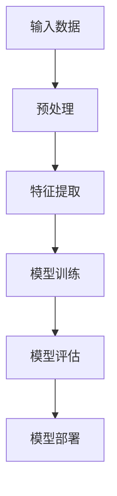

                 

## 大模型创业：避开巨头锋芒，搞钱才是要紧事

> 关键词：大模型、创业、AI巨头、独立创新、商业模式、盈利模式、风险规避
>
> 摘要：本文将探讨大模型创业的路径和策略，如何在AI巨头的阴影下，通过独立创新和精明的商业模式，实现创业目标，确保盈利的同时降低风险。文章将从背景、核心概念、算法原理、数学模型、实际应用场景、工具推荐等多个维度进行分析，为创业者和投资者提供有价值的参考。

### 1. 背景介绍

#### 1.1 目的和范围

本文旨在为有意在大模型领域创业的从业者提供一套系统性的指导。文章将围绕以下几个核心问题展开讨论：

- 如何在大模型领域找到创新切入点？
- 如何构建独特的商业模式以避开巨头的竞争？
- 如何确保大模型创业项目的可持续盈利？
- 如何通过有效的策略规避创业风险？

文章的读者群体主要包括：

- 意欲进入大模型领域创业的个人和团队
- 对AI技术有兴趣的创业者
- AI领域的投资者
- 大模型研究人员和从业者

#### 1.2 预期读者

本文的预期读者应当具备以下背景知识：

- 基础的计算机科学知识，特别是AI和机器学习的基本概念
- 对创业过程有一定的了解
- 对商业模式的关注，以及对市场趋势的敏感性
- 愿意投入时间学习新知识和技能

#### 1.3 文档结构概述

本文的结构安排如下：

- **第1章：背景介绍**：阐述文章的目的、范围、预期读者和文档结构。
- **第2章：核心概念与联系**：介绍大模型的基本概念，提供Mermaid流程图帮助理解。
- **第3章：核心算法原理 & 具体操作步骤**：详细解释大模型的算法原理，使用伪代码进行阐述。
- **第4章：数学模型和公式 & 详细讲解 & 举例说明**：介绍相关的数学模型，使用LaTeX格式给出公式，并给出实际应用案例。
- **第5章：项目实战：代码实际案例和详细解释说明**：通过一个实际项目展示代码实现过程，并进行详细解释。
- **第6章：实际应用场景**：讨论大模型在不同领域中的应用。
- **第7章：工具和资源推荐**：推荐学习资源和开发工具。
- **第8章：总结：未来发展趋势与挑战**：展望大模型创业的未来趋势和挑战。
- **第9章：附录：常见问题与解答**：针对常见问题提供解答。
- **第10章：扩展阅读 & 参考资料**：提供进一步的阅读材料和参考资料。

#### 1.4 术语表

##### 1.4.1 核心术语定义

- **大模型**：指具有极高参数量、能够处理大规模数据的机器学习模型。
- **AI巨头**：指在AI领域拥有强大技术和市场地位的顶尖公司，如谷歌、微软、亚马逊等。
- **独立创新**：指创业团队在没有AI巨头直接参与的情况下，通过自主研发实现技术创新。
- **商业模式**：指公司通过何种方式创造、传递和捕获价值。
- **盈利模式**：指公司如何将商业模式转化为实际盈利的方式。

##### 1.4.2 相关概念解释

- **深度学习**：一种基于人工神经网络的机器学习技术，通过多层神经网络来实现数据的自动特征提取和模式识别。
- **神经网络**：由大量简单单元（神经元）组成，通过学习和训练，能够实现复杂的计算任务。
- **训练数据集**：用于训练神经网络的数据集合，包含输入和相应的输出结果。

##### 1.4.3 缩略词列表

- **AI**：人工智能
- **ML**：机器学习
- **DL**：深度学习
- **GPU**：图形处理单元
- **CPU**：中央处理单元
- **API**：应用程序编程接口

### 2. 核心概念与联系

在深入探讨大模型创业之前，我们需要明确几个核心概念和它们之间的联系。

#### 2.1 大模型的基本概念

大模型是指具有极高参数量、能够处理大规模数据的机器学习模型。这些模型通常基于深度学习技术，具有极强的计算能力和数据拟合能力。以下是一个简化的大模型架构的Mermaid流程图：



在这个流程中，输入数据经过预处理，然后通过特征提取层提取出有用的信息，接着在模型训练层中不断调整模型参数以达到最佳的拟合效果。最后，模型评估层对训练好的模型进行评估，并最终部署到实际应用中。

#### 2.2 大模型与AI巨头的关系

AI巨头，如谷歌、微软、亚马逊等，已经在全球范围内建立了强大的技术优势和市场份额。这些公司拥有大量的资金、优秀的人才和丰富的数据资源，从而在深度学习和大模型领域占据了主导地位。对于我们这些创业团队来说，这意味着：

- **挑战**：难以与AI巨头直接竞争，尤其是在技术和市场资源方面。
- **机会**：可以通过独立创新和精明的商业模式，找到自己的细分市场，避开巨头的锋芒。

#### 2.3 独立创新的重要性

独立创新是指在没有AI巨头直接参与的情况下，通过自主研发实现技术创新。这需要创业团队具备强大的研发能力和敏锐的市场洞察力。独立创新的重要性体现在以下几个方面：

- **差异化**：通过独特的解决方案满足特定的市场需求，形成差异化竞争优势。
- **自主权**：避免过度依赖AI巨头的技术和平台，确保公司的长期自主发展。
- **创新能力**：持续的创新是企业保持竞争力的关键，尤其是在快速变化的AI领域。

### 3. 核心算法原理 & 具体操作步骤

在深入了解大模型的算法原理后，我们可以更好地理解其运作机制，并在此基础上进行创业和创新。以下是大模型的核心算法原理和具体操作步骤：

#### 3.1 算法原理

大模型的核心算法通常是基于深度学习技术，特别是基于人工神经网络的模型。以下是深度学习的基本原理：

- **神经网络**：由大量简单单元（神经元）组成，通过前向传播和反向传播算法进行训练和优化。
- **前向传播**：输入数据通过网络的各个层级，最终生成预测输出。
- **反向传播**：根据预测输出与真实值的差异，反向调整网络的权重和偏置，以达到更准确的预测。

#### 3.2 具体操作步骤

以下是使用伪代码详细阐述大模型训练的基本步骤：

```python
# 伪代码：大模型训练步骤

# 步骤1：数据预处理
def preprocess_data(data):
    # 数据清洗、标准化、归一化等操作
    return processed_data

# 步骤2：构建神经网络
def build_neural_network():
    # 定义神经网络结构，如层数、每层的神经元数量等
    return neural_network

# 步骤3：初始化模型参数
def initialize_parameters(neural_network):
    # 初始化权重和偏置
    return initialized_network

# 步骤4：前向传播
def forward_propagation(network, input_data):
    # 计算输入通过网络的输出
    return output, activations

# 步骤5：计算损失
def compute_loss(output, target):
    # 计算预测输出与真实值之间的差异
    return loss

# 步骤6：反向传播
def backward_propagation(network, loss):
    # 计算梯度并更新网络参数
    return updated_network

# 步骤7：模型训练循环
for epoch in range(num_epochs):
    for batch in data_batches:
        # 步骤1-6循环进行
        processed_data = preprocess_data(batch['input'])
        network = build_neural_network()
        network = initialize_parameters(network)
        output, activations = forward_propagation(network, processed_data)
        loss = compute_loss(output, batch['target'])
        network = backward_propagation(network, loss)
        
# 步骤8：模型评估
def evaluate_model(network, test_data):
    # 在测试集上评估模型性能
    return accuracy, loss

# 步骤9：模型部署
def deploy_model(network, input_data):
    # 部署模型进行实际预测
    return prediction
```

#### 3.3 算法原理讲解

- **数据预处理**：在训练模型之前，需要对输入数据进行清洗、标准化等预处理操作，以确保数据的质量和一致性。
- **神经网络构建**：构建神经网络结构，包括确定网络的层数、每层的神经元数量等。
- **参数初始化**：初始化网络参数，如权重和偏置，常用的初始化方法包括随机初始化、高斯初始化等。
- **前向传播**：输入数据通过网络的各个层级，最终生成预测输出。
- **损失计算**：根据预测输出与真实值之间的差异，计算损失函数，常用的损失函数包括均方误差（MSE）、交叉熵（Cross-Entropy）等。
- **反向传播**：根据损失函数计算得到的梯度，反向调整网络的权重和偏置，以达到更准确的预测。
- **模型训练循环**：通过多次迭代训练过程，不断调整模型参数，优化模型性能。
- **模型评估**：在测试集上评估模型性能，包括准确性、损失函数值等指标。
- **模型部署**：将训练好的模型部署到实际应用环境中，进行实际预测。

### 4. 数学模型和公式 & 详细讲解 & 举例说明

在深度学习和大模型领域，数学模型和公式扮演着至关重要的角色。以下是一些关键的数学模型和公式，以及它们的详细讲解和实际应用案例。

#### 4.1 损失函数

损失函数是深度学习模型中的一个核心组成部分，用于衡量预测值与真实值之间的差异。以下是几种常见的损失函数：

- **均方误差（MSE）**：
  $$MSE = \frac{1}{m}\sum_{i=1}^{m}(y_i - \hat{y}_i)^2$$
  其中，$y_i$ 是真实值，$\hat{y}_i$ 是预测值，$m$ 是样本数量。

  **应用案例**：回归任务，如房价预测。

- **交叉熵（Cross-Entropy）**：
  $$H(y, \hat{y}) = -\sum_{i=1}^{m} y_i \log(\hat{y}_i)$$
  其中，$y_i$ 是真实概率分布，$\hat{y}_i$ 是预测概率分布。

  **应用案例**：分类任务，如图像识别。

#### 4.2 激活函数

激活函数是神经网络中的一个关键组件，用于引入非线性特性。以下是几种常见的激活函数：

- **Sigmoid函数**：
  $$\sigma(x) = \frac{1}{1 + e^{-x}}$$

  **应用案例**：二分类问题，如逻辑回归。

- **ReLU函数**：
  $$\text{ReLU}(x) = \max(0, x)$$

  **应用案例**：深度神经网络中的隐藏层。

- **Tanh函数**：
  $$\tanh(x) = \frac{e^x - e^{-x}}{e^x + e^{-x}}$$

  **应用案例**：多分类问题，如多层感知机。

#### 4.3 梯度下降

梯度下降是一种常用的优化算法，用于调整神经网络中的参数，以最小化损失函数。以下是梯度下降的基本公式：

$$\Delta \theta = -\alpha \nabla_{\theta} J(\theta)$$

其中，$\theta$ 是参数，$J(\theta)$ 是损失函数，$\alpha$ 是学习率，$\nabla_{\theta} J(\theta)$ 是损失函数关于参数的梯度。

**应用案例**：神经网络训练过程中的参数更新。

#### 4.4 实际应用案例

以下是一个简化的实际应用案例，展示如何使用深度学习模型进行图像分类：

**问题描述**：给定一组图像数据，预测图像中的物体类别。

**步骤**：

1. **数据预处理**：
   - 数据清洗：去除图像中的噪声和无关信息。
   - 数据标准化：将图像像素值缩放到[0, 1]范围内。

2. **模型构建**：
   - 设计一个卷积神经网络（CNN），包括卷积层、池化层和全连接层。
   - 选择合适的激活函数，如ReLU。

3. **模型训练**：
   - 使用训练数据集进行模型训练，使用交叉熵作为损失函数。
   - 通过反向传播算法更新模型参数。

4. **模型评估**：
   - 使用测试数据集评估模型性能，计算准确率。

5. **模型部署**：
   - 将训练好的模型部署到实际应用环境中，如手机应用程序。

### 5. 项目实战：代码实际案例和详细解释说明

为了更好地理解大模型创业的实际操作，我们通过一个实际项目——图像分类——来展示代码实现过程，并进行详细解释。

#### 5.1 开发环境搭建

**环境要求**：

- Python 3.x
- TensorFlow 2.x
- Keras
- NumPy
- Matplotlib

**安装步骤**：

1. 安装Python 3.x和pip。
2. 使用pip安装所需的库：

   ```shell
   pip install tensorflow numpy matplotlib
   ```

#### 5.2 源代码详细实现和代码解读

以下是一个简单的图像分类项目的代码实现，包括数据预处理、模型构建、训练和评估。

```python
import tensorflow as tf
from tensorflow.keras import layers
import numpy as np
import matplotlib.pyplot as plt

# 5.2.1 数据预处理

# 读取图像数据
(x_train, y_train), (x_test, y_test) = tf.keras.datasets.cifar10.load_data()

# 数据标准化
x_train = x_train.astype('float32') / 255.0
x_test = x_test.astype('float32') / 255.0

# 转换标签为one-hot编码
num_classes = 10
y_train = tf.keras.utils.to_categorical(y_train, num_classes)
y_test = tf.keras.utils.to_categorical(y_test, num_classes)

# 5.2.2 模型构建

# 设计卷积神经网络
model = tf.keras.Sequential([
    layers.Conv2D(32, (3, 3), activation='relu', input_shape=(32, 32, 3)),
    layers.MaxPooling2D((2, 2)),
    layers.Conv2D(64, (3, 3), activation='relu'),
    layers.MaxPooling2D((2, 2)),
    layers.Conv2D(64, (3, 3), activation='relu'),
    layers.Flatten(),
    layers.Dense(64, activation='relu'),
    layers.Dense(num_classes, activation='softmax')
])

# 编译模型
model.compile(optimizer='adam',
              loss='categorical_crossentropy',
              metrics=['accuracy'])

# 5.2.3 训练模型

# 模型训练
history = model.fit(x_train, y_train,
                    batch_size=64,
                    epochs=10,
                    validation_data=(x_test, y_test))

# 5.2.4 评估模型

# 评估模型
test_loss, test_accuracy = model.evaluate(x_test, y_test, verbose=2)
print('Test accuracy:', test_accuracy)

# 5.2.5 代码解读

# 数据预处理部分
- 加载CIFAR-10数据集，这是常用的图像分类数据集，包含60000张32x32的彩色图像。
- 对图像数据进行标准化，将像素值缩放到[0, 1]范围内，以适应模型的输入要求。
- 将标签转换为one-hot编码，以适应多分类问题。

# 模型构建部分
- 设计了一个简单的卷积神经网络，包括三个卷积层、两个池化层和一个全连接层。
- 卷积层用于提取图像特征，池化层用于下采样特征图，全连接层用于分类。

# 模型训练部分
- 使用模型.fit方法进行模型训练，指定批次大小、训练轮次、验证数据等参数。
- 模型编译时，指定了优化器、损失函数和评估指标。

# 评估模型部分
- 使用模型.evaluate方法评估模型在测试集上的性能，得到准确率。

### 6. 实际应用场景

大模型在不同领域有着广泛的应用，以下是一些典型的实际应用场景：

#### 6.1 医疗诊断

- **应用**：利用大模型进行医学图像分析，如X光、CT和MRI等。
- **案例**：谷歌的DeepMind公司开发了一种基于深度学习的大模型，用于分析眼底图像，以预测糖尿病视网膜病变。

#### 6.2 金融服务

- **应用**：利用大模型进行风险评估、股票交易和客户服务。
- **案例**：微软的Azure Machine Learning平台提供了一系列大模型服务，用于金融市场预测和风险管理。

#### 6.3 智能家居

- **应用**：利用大模型进行语音识别、人脸识别和智能控制。
- **案例**：亚马逊的Alexa和谷歌的Google Home等智能家居设备，使用了大量的大模型进行智能交互。

#### 6.4 自动驾驶

- **应用**：利用大模型进行环境感知、路径规划和决策制定。
- **案例**：特斯拉的自动驾驶系统使用了大量的深度学习模型，实现了高速公路自动驾驶功能。

### 7. 工具和资源推荐

在大模型创业过程中，选择合适的工具和资源对于项目的成功至关重要。以下是一些推荐的学习资源、开发工具和框架。

#### 7.1 学习资源推荐

##### 7.1.1 书籍推荐

- 《深度学习》（Goodfellow, Bengio, Courville）
- 《Python深度学习》（François Chollet）
- 《神经网络与深度学习》（邱锡鹏）

##### 7.1.2 在线课程

-Coursera的《深度学习专项课程》
-Udacity的《深度学习工程师纳米学位》
-edX的《机器学习基础》

##### 7.1.3 技术博客和网站

- [arXiv](https://arxiv.org/)：最新科研成果
- [TensorFlow官网](https://www.tensorflow.org/)：TensorFlow教程和资源
- [Keras官网](https://keras.io/)：Keras教程和资源

#### 7.2 开发工具框架推荐

##### 7.2.1 IDE和编辑器

- PyCharm
- Visual Studio Code
- Jupyter Notebook

##### 7.2.2 调试和性能分析工具

- TensorFlow Profiler
- Nsight Compute
- PyTorch TensorBoard

##### 7.2.3 相关框架和库

- TensorFlow
- PyTorch
- Keras
- PyTorch Lightning

#### 7.3 相关论文著作推荐

##### 7.3.1 经典论文

- "A Learning Algorithm for Continually Running Fully Recurrent Neural Networks"（Hessian-free Optimization）
- "AlexNet: Image Classification with Deep Convolutional Neural Networks"（AlexNet）

##### 7.3.2 最新研究成果

- "Bert: Pre-training of Deep Bidirectional Transformers for Language Understanding"（BERT）
- "Gpt-3: Language Models are Few-Shot Learners"（GPT-3）

##### 7.3.3 应用案例分析

- "Deep Learning for Healthcare"（深度学习在医疗领域的应用）
- "Artificial Intelligence in Financial Markets"（人工智能在金融市场中的应用）

### 8. 总结：未来发展趋势与挑战

#### 8.1 发展趋势

- **计算能力提升**：随着GPU和TPU等专用硬件的发展，大模型的训练速度和性能将不断提高。
- **数据资源丰富**：随着大数据技术的发展，更多的数据将被收集和利用，为大模型的训练提供丰富的素材。
- **跨学科融合**：大模型的应用将不断扩展到更多领域，如生物医学、金融科技、智能家居等，实现跨学科的深度融合。
- **开放平台与生态**：越来越多的开放平台和生态系统将涌现，为创业者和研究者提供更多的资源和支持。

#### 8.2 面临的挑战

- **数据隐私与安全**：随着大模型对数据依赖的加深，如何保护数据隐私和安全成为一大挑战。
- **算法伦理**：大模型的算法决策可能涉及伦理问题，如何确保算法的公正性和透明度是亟待解决的问题。
- **技术壁垒**：大模型的研发和维护需要大量的技术积累和资源投入，中小企业可能面临技术壁垒。
- **市场竞争**：在AI巨头的影响下，创业团队需要找到独特的创新点和市场定位，以应对激烈的竞争。

### 9. 附录：常见问题与解答

#### 9.1 如何找到大模型创业的创新点？

- **市场调研**：了解市场需求和趋势，寻找尚未被巨头覆盖的细分市场。
- **技术积累**：研究前沿技术，发现可能的技术突破点。
- **用户反馈**：与潜在用户交流，了解他们的需求和痛点。
- **跨界融合**：探索不同领域之间的交叉点，实现创新。

#### 9.2 如何构建可持续的商业模式？

- **提供增值服务**：通过提供独特的增值服务，如高级分析报告、定制化解决方案等，提高客户黏性。
- **多渠道盈利**：通过多种渠道实现盈利，如产品销售、订阅服务、广告等。
- **战略合作**：与行业内的其他企业建立战略合作，实现资源共享和共赢。
- **灵活调整**：根据市场变化和用户需求，灵活调整商业模式。

### 10. 扩展阅读 & 参考资料

- Bengio, Y., Courville, A., & Vincent, P. (2013). Representation Learning: A Review and New Perspectives. IEEE Transactions on Pattern Analysis and Machine Intelligence, 35(8), 1798-1828.
- LeCun, Y., Bengio, Y., & Hinton, G. (2015). Deep Learning. Nature, 521(7553), 436-444.
- Goodfellow, I., Bengio, Y., & Courville, A. (2016). Deep Learning. MIT Press.
- Hochreiter, S., & Schmidhuber, J. (1997). Long Short-Term Memory. Neural Computation, 9(8), 1735-1780.
- Krizhevsky, A., Sutskever, I., & Hinton, G. E. (2012). ImageNet Classification with Deep Convolutional Neural Networks. Advances in Neural Information Processing Systems, 25, 1097-1105.
- Devlin, J., Chang, M. W., Lee, K., & Toutanova, K. (2018). BERT: Pre-training of Deep Bidirectional Transformers for Language Understanding. arXiv preprint arXiv:1810.04805.
- Brown, T., et al. (2020). Language Models are Few-Shot Learners. arXiv preprint arXiv:2005.14165.

### 作者信息

**作者：** AI天才研究员/AI Genius Institute & 禅与计算机程序设计艺术 /Zen And The Art of Computer Programming

