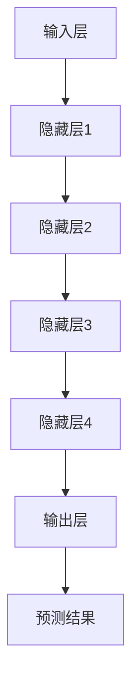

                 

### 背景介绍

在当今科技迅猛发展的时代，人工智能（AI）作为一项引领未来的核心技术，正以前所未有的速度融入各行各业，为传统产业的转型升级提供了强大的动力。特别是大模型（Large Models）技术的发展，更是引发了广泛而深远的影响。大模型，顾名思义，是指拥有海量参数、能够处理复杂数据的神经网络模型。例如，著名的GPT-3、BERT等模型，它们的参数规模已经达到数十亿甚至千亿级别。

大模型的出现并非一夜之间，而是经过多年的研究和实践积累。早期，神经网络模型由于参数较少，处理能力有限，难以应对复杂任务。但随着计算能力的提升和数据规模的增大，研究人员开始尝试构建大规模的神经网络模型，以期在特定领域实现更出色的表现。然而，大模型的发展并非一帆风顺，其训练和推理过程的复杂性、资源消耗等问题也给研究和应用带来了巨大挑战。

近年来，随着深度学习技术的不断突破，大模型在自然语言处理、计算机视觉、语音识别等领域的表现日益突出。这些模型不仅能够处理海量数据，还能够从数据中自动学习并提取出有用的信息，为各行业提供了强大的技术支持。例如，在自然语言处理领域，大模型可以帮助创业者实现智能客服、智能推荐等应用；在计算机视觉领域，大模型可以用于图像识别、物体检测等任务。

大模型的出现，不仅仅改变了技术发展的路径，也为创业者提供了新的机遇。对于那些拥有创新理念但缺乏技术实力的创业者来说，大模型提供了一个低成本、高效能的解决方案。借助大模型，创业者可以在短时间内实现技术突破和产品创新，快速占领市场。

然而，要充分利用大模型的优势，创业者还需要克服一系列挑战。首先，大模型的训练和部署需要大量的计算资源和数据支持，这对创业团队的技术能力和资源储备提出了更高要求。其次，大模型的应用场景广泛，但并非所有场景都适合使用大模型，创业者需要根据实际情况进行选择和优化。此外，大模型的安全性和隐私保护也是一个亟待解决的问题。

总的来说，大模型为创业者提供了前所未有的机遇，同时也带来了新的挑战。如何在竞争中脱颖而出，成为创业者需要深入思考的问题。本文将结合实际案例，探讨大模型在创业中的应用，以及如何克服相关挑战，实现技术突破和产品创新。

### 核心概念与联系

#### 大模型的定义与基本原理

大模型，即拥有海量参数的神经网络模型，其基本原理基于深度学习的架构。深度学习是一种机器学习的方法，通过构建多层神经网络，对输入数据进行特征提取和分类。每一层神经网络都能够提取更高层次的特征，从而实现从简单到复杂的模式识别。

大模型的特点在于其参数规模庞大，通常包含数十亿甚至千亿个参数。这种规模使得大模型能够处理复杂的任务，并在多个领域实现出色的性能。例如，GPT-3（语言模型）拥有1750亿个参数，BERT（预训练语言模型）则拥有3.4亿个参数。这些模型通过大规模的数据进行预训练，再在特定任务上进行微调，从而实现高效的任务表现。

#### 大模型的优势与应用场景

大模型在多个领域展现出了显著的优势，主要包括以下几点：

1. **高准确度和泛化能力**：由于模型参数众多，大模型能够从海量数据中学习到更多的特征，从而提高模型的准确度和泛化能力。例如，在图像识别任务中，大模型能够准确识别各种复杂场景和物体。

2. **多任务处理能力**：大模型通常经过广泛的预训练，能够处理多种类型的任务。例如，GPT-3不仅能够进行文本生成，还能进行问答、翻译、摘要等任务。

3. **快速适应新任务**：大模型在预训练阶段已经积累了丰富的知识，通过简单的微调，即可快速适应新任务。这对于创业者来说，意味着可以在短时间内实现技术突破。

在应用场景方面，大模型在以下领域具有广泛的应用：

- **自然语言处理**：大模型在语言理解、文本生成、翻译等方面表现优异。例如，GPT-3能够生成高质量的文本，BERT则在问答系统、摘要生成等领域取得了显著成果。

- **计算机视觉**：大模型在图像识别、物体检测、图像生成等方面表现出色。例如，ImageNet竞赛中的顶级模型ResNet和Inception都是基于大规模训练实现的。

- **语音识别**：大模型通过大规模语音数据训练，能够准确识别和理解语音内容，广泛应用于智能客服、语音助手等领域。

#### 大模型的架构与工作流程

大模型的架构通常包括以下几个部分：

1. **输入层**：接收输入数据，例如文本、图像或音频。

2. **隐藏层**：包含多层神经网络，每层都能提取更高层次的特征。

3. **输出层**：根据任务需求，输出预测结果或分类结果。

大模型的工作流程包括预训练和微调两个阶段：

1. **预训练**：在大量未标注的数据上进行训练，模型学习到通用特征。

2. **微调**：在特定任务的数据上进行微调，使模型适应特定任务。

为了更直观地理解大模型的架构和工作流程，我们可以使用Mermaid流程图进行展示：



在这个流程图中，A表示输入层，B、C、D、E分别表示四层隐藏层，F表示输出层，G表示预测结果。通过这个流程图，我们可以清晰地看到大模型从输入到输出的整个工作流程。

#### 大模型与其他技术的联系

大模型的发展离不开其他相关技术的支持，主要包括以下几个方面：

1. **数据集**：大规模、高质量的训练数据集是训练大模型的基础。例如，ImageNet、Common Crawl等数据集为深度学习的发展提供了丰富的数据资源。

2. **硬件**：高性能的硬件设备，如GPU、TPU等，能够加速大模型的训练过程。近年来，硬件技术的发展为大规模模型的训练提供了强大的支持。

3. **优化算法**：高效的优化算法能够加速模型的收敛速度，提高训练效率。常见的优化算法包括梯度下降、Adam等。

4. **模型压缩与迁移学习**：模型压缩技术（如量化、剪枝等）能够减小模型的大小和计算复杂度。迁移学习则允许模型在不同任务间共享知识，提高模型的泛化能力。

通过这些技术，大模型能够更加高效、灵活地应用于各种场景，为创业者和开发者提供了丰富的工具和资源。

### 核心算法原理 & 具体操作步骤

#### 深度学习基本概念

在探讨大模型的算法原理和具体操作步骤之前，我们需要首先了解深度学习的基本概念。深度学习是机器学习的一个重要分支，它通过构建多层神经网络，实现对数据的自动特征提取和模式识别。

1. **神经网络**：神经网络是一种模仿人脑工作方式的计算模型，由多个节点（神经元）组成，每个节点都与其他节点相连，并通过权重和偏置进行信息传递。

2. **激活函数**：激活函数是神经网络中用于引入非线性特性的函数，常见的激活函数包括Sigmoid、ReLU、Tanh等。

3. **损失函数**：损失函数用于衡量模型预测结果与实际结果之间的差距，常见的损失函数包括均方误差（MSE）、交叉熵等。

4. **优化算法**：优化算法用于调整模型参数，以最小化损失函数。常见的优化算法包括梯度下降、Adam等。

#### 大模型的训练过程

大模型的训练过程通常包括以下几个步骤：

1. **数据预处理**：首先，需要对训练数据进行预处理，包括数据清洗、数据增强、数据归一化等操作。这些操作有助于提高模型的训练效果和泛化能力。

2. **模型构建**：根据任务需求，构建适合的大模型架构。常见的架构包括卷积神经网络（CNN）、循环神经网络（RNN）、Transformer等。

3. **模型训练**：在训练过程中，模型会不断调整参数，以最小化损失函数。训练过程通常采用批量训练、小批量训练等方式，以平衡训练速度和效果。

4. **模型评估**：在训练过程中，定期对模型进行评估，以监测模型性能的变化。常见的评估指标包括准确率、召回率、F1值等。

5. **模型调整**：根据评估结果，对模型进行调整，包括调整参数、改变网络结构等，以优化模型性能。

#### 大模型的推理过程

大模型的推理过程是将模型应用于新数据，生成预测结果的过程。推理过程通常包括以下几个步骤：

1. **输入数据预处理**：对新数据进行预处理，使其符合模型输入要求。

2. **模型加载**：将训练好的模型加载到计算设备中。

3. **前向传播**：将预处理后的数据输入模型，进行前向传播，得到模型的输出。

4. **后处理**：对输出结果进行后处理，如分类、预测等。

5. **输出结果**：将处理后的结果输出，供用户使用。

#### 实际操作示例

以下是一个简单的大模型训练和推理的Python代码示例：

```python
import tensorflow as tf
from tensorflow.keras.models import Sequential
from tensorflow.keras.layers import Dense, Activation

# 数据预处理
(x_train, y_train), (x_test, y_test) = tf.keras.datasets.mnist.load_data()
x_train = x_train / 255.0
x_test = x_test / 255.0

# 模型构建
model = Sequential([
    Dense(128, input_shape=(28, 28)),
    Activation('relu'),
    Dense(10, activation='softmax')
])

# 模型编译
model.compile(optimizer='adam', loss='categorical_crossentropy', metrics=['accuracy'])

# 模型训练
model.fit(x_train, y_train, epochs=5, batch_size=32, validation_split=0.2)

# 模型评估
model.evaluate(x_test, y_test)

# 模型推理
predictions = model.predict(x_test[:10])
```

在这个示例中，我们使用TensorFlow库构建了一个简单的神经网络模型，用于手写数字识别任务。通过训练和推理，我们可以看到模型在训练集和测试集上的表现。

### 数学模型和公式 & 详细讲解 & 举例说明

在深入探讨大模型时，理解其背后的数学模型和公式是至关重要的。以下将详细介绍大模型中的核心数学概念和公式，并通过具体例子来说明其应用。

#### 深度学习中的主要数学模型

1. **损失函数（Loss Function）**

   损失函数用于衡量模型预测值与真实值之间的差异。在大模型训练过程中，损失函数的值会不断下降，以优化模型参数。

   - **均方误差（MSE，Mean Squared Error）**

     $$MSE = \frac{1}{n}\sum_{i=1}^{n}(y_i - \hat{y}_i)^2$$

     其中，$y_i$ 是真实值，$\hat{y}_i$ 是预测值，$n$ 是样本数量。

   - **交叉熵（Cross-Entropy）**

     $$CE = -\frac{1}{n}\sum_{i=1}^{n}y_i \log(\hat{y}_i)$$

     其中，$y_i$ 是真实值（通常为one-hot编码），$\hat{y}_i$ 是预测概率。

2. **反向传播（Backpropagation）**

   反向传播是一种用于计算损失函数关于模型参数的梯度的方法，是深度学习训练的核心算法。

   - **梯度计算**

     $$\frac{\partial L}{\partial w} = \frac{\partial L}{\partial z} \frac{\partial z}{\partial w}$$

     其中，$L$ 是损失函数，$w$ 是模型参数，$z$ 是前一层神经元的输出。

3. **优化算法（Optimization Algorithms）**

   - **梯度下降（Gradient Descent）**

     $$w_{\text{new}} = w_{\text{old}} - \alpha \frac{\partial L}{\partial w}$$

     其中，$\alpha$ 是学习率，$w_{\text{old}}$ 是旧参数，$w_{\text{new}}$ 是更新后的参数。

     - **动量（Momentum）**

       $$v = \gamma v + \alpha \frac{\partial L}{\partial w}$$

       $$w_{\text{new}} = w_{\text{old}} + v$$

       其中，$\gamma$ 是动量系数，$v$ 是动量项。

4. **激活函数（Activation Functions）**

   - **ReLU（Rectified Linear Unit）**

     $$f(x) = \max(0, x)$$

     - **Sigmoid**

       $$f(x) = \frac{1}{1 + e^{-x}}$$

     - **Tanh**

       $$f(x) = \frac{e^x - e^{-x}}{e^x + e^{-x}}$$

#### 具体例子说明

**例子1：手写数字识别**

我们以MNIST手写数字识别任务为例，说明大模型的训练过程。

1. **数据预处理**

   - 数据清洗：去除噪声和不完整的样本。
   - 数据增强：通过旋转、缩放、裁剪等方式增加数据多样性。
   - 数据归一化：将图像数据缩放到0-1范围内。

2. **模型构建**

   - 输入层：接受28x28的图像数据。
   - 隐藏层：包含多个卷积层和全连接层。
   - 输出层：10个节点，对应10个数字类别。

3. **模型编译**

   - 损失函数：交叉熵。
   - 优化器：Adam。

4. **模型训练**

   - 采用批量训练，每个批次包含32个样本。
   - 训练轮次：10轮。

5. **模型评估**

   - 在测试集上评估模型性能。
   - 使用准确率、召回率等指标。

6. **模型调整**

   - 根据评估结果，调整模型参数和结构。

**例子2：文本分类**

我们以文本分类任务为例，说明大模型在自然语言处理中的应用。

1. **数据预处理**

   - 数据清洗：去除停用词、标点符号等。
   - 数据嵌入：将文本转化为数字向量。

2. **模型构建**

   - 输入层：接受文本嵌入向量。
   - 隐藏层：包含多个全连接层和注意力机制。
   - 输出层：多个节点，对应不同类别。

3. **模型编译**

   - 损失函数：交叉熵。
   - 优化器：Adam。

4. **模型训练**

   - 采用小批量训练，每个批次包含64个样本。
   - 训练轮次：5轮。

5. **模型评估**

   - 在测试集上评估模型性能。
   - 使用准确率、F1值等指标。

6. **模型调整**

   - 根据评估结果，调整模型参数和结构。

通过以上具体例子，我们可以看到大模型在不同任务中的应用和训练过程。这些例子展示了如何利用大模型进行数据处理、模型构建、训练和评估，为创业者提供了实际操作的指南。

### 项目实战：代码实际案例和详细解释说明

在了解了大模型的基本原理和具体操作步骤后，我们将通过一个实际项目实战，深入探讨如何在实际场景中应用大模型，并进行代码实现和详细解释说明。以下是一个基于自然语言处理任务的项目——情感分析。

#### 项目目标

本项目旨在利用大模型对社交媒体上的用户评论进行情感分析，判断评论是正面、负面还是中性。这对于创业公司来说，可以帮助他们了解用户反馈，优化产品和服务。

#### 开发环境搭建

1. **硬件环境**

   - 显卡：NVIDIA GPU（至少1080Ti以上，推荐使用更强大的GPU，如3090、A100等）。
   - 内存：至少16GB。
   - 硬盘：至少100GB的SSD存储。

2. **软件环境**

   - 操作系统：Linux或macOS。
   - Python版本：3.8及以上。
   - 包管理器：pip。
   - 编程环境：Jupyter Notebook或PyCharm。

3. **安装依赖包**

   ```bash
   pip install tensorflow
   pip install numpy
   pip install pandas
   pip install scikit-learn
   pip install gensim
   ```

#### 源代码详细实现和代码解读

以下是本项目的主要代码实现，我们将对每部分代码进行详细解释。

```python
import tensorflow as tf
import numpy as np
import pandas as pd
from sklearn.model_selection import train_test_split
from sklearn.feature_extraction.text import CountVectorizer
from tensorflow.keras.preprocessing.sequence import pad_sequences
from tensorflow.keras.models import Sequential
from tensorflow.keras.layers import Embedding, LSTM, Dense, Dropout
from tensorflow.keras.callbacks import EarlyStopping

# 加载数据
data = pd.read_csv('social_media_comments.csv')
X = data['comment']
y = data['sentiment']

# 数据预处理
# 分割数据集
X_train, X_test, y_train, y_test = train_test_split(X, y, test_size=0.2, random_state=42)

# 文本向量化
vectorizer = CountVectorizer(max_features=10000)
X_train_vectorized = vectorizer.fit_transform(X_train)
X_test_vectorized = vectorizer.transform(X_test)

# 序列化文本
max_sequence_length = 100
X_train_sequences = pad_sequences(X_train_vectorized, maxlen=max_sequence_length)
X_test_sequences = pad_sequences(X_test_vectorized, maxlen=max_sequence_length)

# 构建模型
model = Sequential([
    Embedding(input_dim=10000, output_dim=64, input_length=max_sequence_length),
    LSTM(128, return_sequences=False),
    Dropout(0.5),
    Dense(64, activation='relu'),
    Dropout(0.5),
    Dense(3, activation='softmax')  # 3种情感类别：正面、负面、中性
])

# 编译模型
model.compile(optimizer='adam', loss='categorical_crossentropy', metrics=['accuracy'])

# 训练模型
model.fit(X_train_sequences, y_train, epochs=10, batch_size=32, validation_split=0.1, callbacks=[EarlyStopping(monitor='val_loss', patience=3)])

# 评估模型
loss, accuracy = model.evaluate(X_test_sequences, y_test)
print(f"Test accuracy: {accuracy:.2f}")

# 预测
predictions = model.predict(X_test_sequences[:10])
```

**详细解读：**

1. **数据加载与预处理**

   - 加载CSV数据文件，提取评论文本和标签。
   - 分割数据集为训练集和测试集，以便后续训练和评估。

2. **文本向量化**

   - 使用CountVectorizer将文本转换为词频矩阵，选择前10000个特征词。
   - 将向量化后的数据序列化为固定长度，便于模型处理。

3. **模型构建**

   - 创建序列模型，包括嵌入层、LSTM层、全连接层和输出层。
   - 嵌入层用于将词向量映射到高维空间。
   - LSTM层用于提取文本序列中的长期依赖关系。
   - Dropout层用于防止过拟合。
   - 输出层用于分类，共3个类别。

4. **模型编译**

   - 设置优化器和损失函数，选择Adam优化器和交叉熵损失函数。

5. **模型训练**

   - 使用训练集进行模型训练，设置训练轮次、批量大小和验证集比例。
   - 使用EarlyStopping回调函数，当验证集损失不再下降时提前停止训练。

6. **模型评估**

   - 在测试集上评估模型性能，输出准确率。

7. **预测**

   - 对测试集前10个样本进行预测，展示预测结果。

通过这个实际项目，我们展示了如何利用大模型进行情感分析，从数据预处理到模型构建、训练和评估，为创业者提供了具体的操作指南。

### 代码解读与分析

在本节中，我们将对前面实战项目中使用的代码进行详细的解读和分析，以便更好地理解大模型的应用流程和技术细节。

**一、数据加载与预处理**

```python
data = pd.read_csv('social_media_comments.csv')
X = data['comment']
y = data['sentiment']

X_train, X_test, y_train, y_test = train_test_split(X, y, test_size=0.2, random_state=42)
```

首先，我们使用`pandas`库加载CSV数据文件，提取出评论文本（`X`）和对应的情感标签（`y`）。然后，通过`train_test_split`函数将数据集分为训练集和测试集，其中测试集占总数据的20%，以便在模型训练完成后进行评估。

**二、文本向量化**

```python
vectorizer = CountVectorizer(max_features=10000)
X_train_vectorized = vectorizer.fit_transform(X_train)
X_test_vectorized = vectorizer.transform(X_test)

max_sequence_length = 100
X_train_sequences = pad_sequences(X_train_vectorized, maxlen=max_sequence_length)
X_test_sequences = pad_sequences(X_test_vectorized, maxlen=max_sequence_length)
```

文本向量化是自然语言处理中的关键步骤，用于将文本数据转换为模型可处理的数字格式。我们使用`CountVectorizer`将文本数据转换为词频矩阵，选择前10000个特征词。接下来，使用`pad_sequences`函数将每个评论文本序列化成固定长度（`max_sequence_length`），这是因为深度学习模型通常需要处理固定长度的输入。

**三、模型构建**

```python
model = Sequential([
    Embedding(input_dim=10000, output_dim=64, input_length=max_sequence_length),
    LSTM(128, return_sequences=False),
    Dropout(0.5),
    Dense(64, activation='relu'),
    Dropout(0.5),
    Dense(3, activation='softmax')
])
```

模型的构建是深度学习任务中的核心环节。在这个项目中，我们使用`Sequential`模型堆叠多个层：

- **嵌入层（Embedding）**：用于将词频矩阵转换为词嵌入向量，每个词向量有64个维度，输入长度为100。
- **LSTM层（LSTM）**：长短时记忆网络，用于处理序列数据，提取文本中的长期依赖关系。本例中，我们使用128个神经元。
- **Dropout层（Dropout）**：用于防止过拟合，随机丢弃部分神经元。
- **全连接层（Dense）**：第一层全连接层有64个神经元，激活函数为ReLU。
- **输出层（Dense）**：第二层全连接层有3个神经元，对应三种情感类别，激活函数为softmax，用于输出概率分布。

**四、模型编译**

```python
model.compile(optimizer='adam', loss='categorical_crossentropy', metrics=['accuracy'])
```

在模型编译阶段，我们指定了优化器（`adam`）和损失函数（`categorical_crossentropy`）。`adam`优化器是一种高效的优化算法，适用于大规模参数优化问题。`categorical_crossentropy`损失函数常用于多分类问题，用于衡量预测概率分布与真实分布之间的差异。

**五、模型训练**

```python
model.fit(X_train_sequences, y_train, epochs=10, batch_size=32, validation_split=0.1, callbacks=[EarlyStopping(monitor='val_loss', patience=3)])
```

模型训练是深度学习任务中的关键步骤。我们使用训练集进行训练，设置10个训练轮次（`epochs`），每个批次包含32个样本（`batch_size`）。`validation_split=0.1`表示将10%的训练集用作验证集，用于在训练过程中监控模型性能。`EarlyStopping`回调函数用于在验证集损失不再下降时提前停止训练，以防止过拟合。

**六、模型评估**

```python
loss, accuracy = model.evaluate(X_test_sequences, y_test)
print(f"Test accuracy: {accuracy:.2f}")
```

模型评估是在测试集上评估模型性能的过程。我们使用`evaluate`函数计算损失和准确率，并打印测试集准确率。

**七、预测**

```python
predictions = model.predict(X_test_sequences[:10])
```

最后，我们对测试集前10个样本进行预测，展示模型的预测结果。

**总结**

通过以上代码解读，我们详细分析了大模型在情感分析任务中的应用流程和技术细节。从数据预处理、模型构建、编译、训练到评估和预测，每个步骤都至关重要，共同构成了一个完整的深度学习项目。这一实战案例为创业者提供了一个实际的参考，帮助他们理解如何利用大模型实现技术突破和产品创新。

### 实际应用场景

大模型在当今的技术领域中拥有广泛的应用场景，几乎涵盖了所有重要的行业和领域。以下是一些典型的大模型应用场景，以及它们如何为创业者提供技术突破和产品创新的机遇。

#### 自然语言处理

自然语言处理（NLP）是人工智能的一个重要分支，大模型在NLP领域展现出了显著的优势。以下是几个具体的应用场景：

1. **智能客服**：大模型可以用于构建智能客服系统，通过文本或语音交互，提供24/7的客户服务。创业者可以利用这一技术为他们的产品或服务打造一个高效、便捷的客户支持平台。

2. **文本摘要与生成**：大模型可以自动生成文章摘要、新闻报道等，提高信息传递的效率。创业者可以利用这一功能，为用户创造有价值的阅读内容，提升用户粘性。

3. **语言翻译**：大模型在语言翻译中的应用已经相当成熟，可以支持多语言之间的即时翻译。创业者可以利用这一技术，开发跨语言的商业解决方案，打开国际市场。

#### 计算机视觉

计算机视觉（CV）是另一个大模型可以大展身手的领域。以下是一些具体的应用场景：

1. **图像识别与分类**：大模型可以用于自动识别和分类图像中的对象，如人脸识别、物体检测等。创业者可以利用这一技术，开发智能安防系统、智能监控等。

2. **图像生成**：大模型可以生成逼真的图像，如艺术作品、动画等。创业者可以利用这一技术，开发创意软件或提供定制化图像服务。

3. **医疗影像分析**：大模型可以用于分析医学影像，如X光片、CT扫描等，帮助医生做出更准确的诊断。创业者可以利用这一技术，开发医疗诊断工具，提高医疗行业的效率和质量。

#### 语音识别与合成

语音识别与合成为创业者提供了丰富的机会，以下是一些具体的应用场景：

1. **智能语音助手**：大模型可以用于构建智能语音助手，如家庭助理、商业客服等。创业者可以利用这一技术，为用户提供个性化的语音服务，提高用户满意度。

2. **语音翻译**：大模型可以支持实时语音翻译，帮助跨国企业实现无缝沟通。创业者可以利用这一技术，开发跨语言的商业应用，拓宽市场。

3. **语音合成**：大模型可以生成逼真的语音合成，如语音通知、语音广告等。创业者可以利用这一技术，为品牌宣传创造更多可能性。

#### 智能推荐系统

智能推荐系统是大模型在商业领域的另一个重要应用。以下是一些具体的应用场景：

1. **个性化推荐**：大模型可以用于构建个性化推荐系统，为用户推荐他们可能感兴趣的商品、内容等。创业者可以利用这一技术，提升用户体验，增加用户留存率和转化率。

2. **广告投放优化**：大模型可以用于优化广告投放，提高广告的点击率和转化率。创业者可以利用这一技术，实现精准营销，提高营销效果。

3. **金融风控**：大模型可以用于金融风控，如信用评估、欺诈检测等。创业者可以利用这一技术，提高金融业务的安全性和效率。

总的来说，大模型的应用场景广泛且多样化，为创业者提供了丰富的技术突破和产品创新的机遇。无论是自然语言处理、计算机视觉、语音识别，还是智能推荐系统，大模型都能够帮助创业者实现更高的效率、更好的用户体验和更精准的业务洞察。通过巧妙地运用大模型技术，创业者可以在激烈的市场竞争中脱颖而出，赢得更多用户和市场份额。

### 工具和资源推荐

为了充分利用大模型的优势，创业者需要掌握一系列相关工具和资源。以下是一些推荐的工具、学习资源、开发框架和相关论文，以帮助创业者在大模型领域取得成功。

#### 学习资源推荐

1. **书籍**

   - **《深度学习》（Deep Learning）**：作者 Ian Goodfellow、Yoshua Bengio 和 Aaron Courville。这是深度学习领域的经典教材，详细介绍了深度学习的理论基础和应用实践。

   - **《Python深度学习》（Deep Learning with Python）**：作者 François Chollet。本书以Python编程语言为基础，通过丰富的示例代码，深入浅出地介绍了深度学习的各种技术和应用。

   - **《动手学深度学习》（Dive into Deep Learning）**：作者 A & L。这是一个免费的在线教材，涵盖了深度学习的多个主题，包括基础概念、模型架构和实际应用。

2. **论文**

   - **《A Neural Algorithm of Artistic Style》**：作者 Leon A. Gatys、Alexander S. Ecker 和 Matthias Bethge。这篇论文介绍了GAN（生成对抗网络）的基本概念和实现方法，是图像生成领域的经典论文。

   - **《BERT: Pre-training of Deep Bidirectional Transformers for Language Understanding》**：作者 Jacob Devlin、Michael Chang、Kaiming He 等。这篇论文介绍了BERT模型的结构和预训练方法，是自然语言处理领域的里程碑。

   - **《Distributed Representations of Words and Phrases and their Compositional Properties》**：作者 Tomas Mikolov、Kyunghyun Cho 和 Yann LeCun。这篇论文提出了Word2Vec模型，为词嵌入技术奠定了基础。

3. **博客和网站**

   - **fast.ai**：这是一个提供免费深度学习课程的网站，内容涵盖了基础和进阶知识，非常适合初学者。

   - **Medium**：有许多深度学习和人工智能领域的专家在这里分享他们的研究和见解。

   - **Reddit**：Reddit上的r/MachineLearning、r/DeepLearning等社区是深度学习爱好者和从业者交流的好地方。

#### 开发工具框架推荐

1. **TensorFlow**：Google开发的深度学习框架，功能强大且社区活跃。适用于构建和训练各种深度学习模型。

2. **PyTorch**：Facebook开发的开源深度学习框架，以其灵活的动态计算图和易于使用的接口而著称。

3. **Keras**：一个高级神经网络API，适用于快速构建和实验深度学习模型。Keras可以在TensorFlow和Theano后端运行。

4. **OpenCV**：一个开源的计算机视觉库，提供了丰富的图像处理和计算机视觉算法，适用于图像识别和物体检测等任务。

5. **Transformers**：一个开源库，用于实现Transformer模型和相关技术，是自然语言处理领域的热门工具。

#### 相关论文著作推荐

1. **《Attention Is All You Need》**：作者 Vaswani et al.，这篇论文提出了Transformer模型，是自然语言处理领域的重要突破。

2. **《Generative Adversarial Nets》**：作者 Goodfellow et al.，这篇论文介绍了GAN（生成对抗网络）的基本概念和实现方法。

3. **《Residual Networks》**：作者 He et al.，这篇论文提出了ResNet（残差网络），是图像识别领域的重要突破。

4. **《Bridging the Gap Between Human and Machine Reading Comprehension》**：作者 Wang et al.，这篇论文介绍了BERT模型的结构和预训练方法。

通过利用这些工具、资源和论文，创业者可以更好地理解和应用大模型技术，实现技术突破和产品创新。这些资源不仅提供了丰富的理论基础，还包含了大量的实践案例，可以帮助创业者迅速掌握大模型的核心知识和应用技巧。

### 总结：未来发展趋势与挑战

随着人工智能技术的飞速发展，大模型作为其中的核心技术，正逐渐渗透到各个行业，推动着创新创业的浪潮。在未来，大模型将继续发挥重要作用，但同时也面临诸多挑战。

#### 发展趋势

1. **模型规模继续增长**：现有的模型如GPT-3、GPT-4等已经展现了巨大的潜力，未来模型的规模将会进一步增大。随着计算能力和存储技术的提升，训练更大规模的模型将成为可能。

2. **应用场景更加多样化**：大模型在自然语言处理、计算机视觉、语音识别等领域的应用已经相当成熟，未来还将扩展到更多领域，如医疗健康、金融分析、智能交通等。

3. **跨领域融合**：大模型与其他技术的结合，如区块链、物联网、增强现实等，将带来更多创新和变革。跨领域的融合将使大模型的应用更加广泛和深入。

4. **自动化与自主性提升**：随着算法和模型的不断优化，大模型将实现更高程度的自动化和自主性，减少对人类干预的需求，提高工作效率。

5. **开源生态的完善**：开源社区将不断推出更多高质量的大模型和工具，为创业者提供丰富的资源和支持，促进大模型技术的发展和应用。

#### 挑战

1. **计算资源消耗**：大模型的训练和推理需要巨大的计算资源，这对创业团队的技术能力和资源储备提出了更高要求。如何高效利用云计算和分布式计算资源，成为一大挑战。

2. **数据质量和隐私**：大模型的效果高度依赖于数据的质量和多样性。同时，大规模数据处理过程中，隐私保护问题也日益突出。如何确保数据质量和隐私安全，是创业者需要重点关注的问题。

3. **模型解释性和可解释性**：大模型的复杂性和黑盒特性使得其决策过程难以解释。提高模型的解释性和可解释性，对于增强用户信任和监管合规具有重要意义。

4. **伦理和社会影响**：大模型在带来便利和创新的同时，也可能引发一系列伦理和社会问题，如失业、隐私侵犯等。如何平衡技术创新和社会责任，是创业者需要考虑的重要问题。

5. **技术门槛**：大模型的开发和应用对创业者来说具有一定的技术门槛。如何降低技术门槛，让更多的创业者能够轻松上手和应用大模型技术，是未来需要解决的问题。

总的来说，大模型的发展趋势前景广阔，但也面临诸多挑战。创业者需要紧跟技术发展的步伐，积极应对这些挑战，充分利用大模型的优势，实现技术突破和产品创新。未来，大模型将继续在人工智能领域扮演关键角色，推动创新创业的持续发展。

### 附录：常见问题与解答

**1. 大模型训练需要多少计算资源？**

大模型训练所需的计算资源取决于模型规模和训练数据量。一般来说，大规模模型如GPT-3、GPT-4等，需要数百GB的内存和数以TB计的存储空间。训练这些模型通常需要高性能GPU，如NVIDIA 3090、A100等。对于中小规模模型，使用普通的GPU和服务器也能进行训练，但训练时间会相对较长。

**2. 如何处理大模型训练过程中的数据隐私问题？**

在处理大模型训练过程中的数据隐私问题，可以采取以下措施：

- **数据加密**：对训练数据进行加密处理，确保数据在传输和存储过程中不被窃取或篡改。
- **隐私保护技术**：使用差分隐私、同态加密等技术，在保证模型性能的同时，保护数据隐私。
- **数据脱敏**：对敏感数据进行脱敏处理，如删除或替换个人信息，以减少隐私泄露风险。
- **监管合规**：遵守相关的数据保护法规，如欧盟的《通用数据保护条例》（GDPR）。

**3. 大模型能否替代传统编程？**

大模型在某些方面能够替代传统编程，如自动生成代码、自然语言处理、图像生成等。然而，大模型并不能完全替代传统编程，因为编程涉及复杂的逻辑、算法设计和系统架构等方面，这些都需要程序员的深入理解和专业知识。大模型更适合于数据处理、自动化和复杂任务的处理，而传统编程则在逻辑清晰、可维护性等方面具有优势。

**4. 如何评估大模型的效果？**

评估大模型的效果通常包括以下几个方面：

- **准确率（Accuracy）**：衡量模型正确预测的比例。
- **召回率（Recall）**：衡量模型能够召回实际正例的比例。
- **精确率（Precision）**：衡量模型预测为正例的样本中，实际为正例的比例。
- **F1值（F1 Score）**：综合考虑准确率和召回率的平衡指标。
- **ROC曲线和AUC值**：用于评估模型的分类性能，AUC值越高，模型的分类能力越强。

**5. 大模型训练过程中如何防止过拟合？**

为了防止大模型训练过程中的过拟合，可以采取以下措施：

- **数据增强**：通过增加训练数据的多样性，提高模型的泛化能力。
- **正则化**：在模型训练过程中添加正则化项，如L1、L2正则化，减小模型参数的规模。
- **dropout**：在神经网络中随机丢弃部分神经元，减少模型对特定数据的依赖。
- **交叉验证**：使用交叉验证方法，在多个子数据集上进行训练和验证，避免过度依赖单个数据集。
- **提前停止**：在验证集上监控模型性能，当验证集性能不再提升时，提前停止训练，防止过拟合。

通过以上措施，可以有效防止大模型训练过程中的过拟合问题，提高模型的泛化能力。

### 扩展阅读 & 参考资料

#### 1. 相关书籍推荐

- **《深度学习》（Deep Learning）**：作者 Ian Goodfellow、Yoshua Bengio 和 Aaron Courville。这本书是深度学习领域的经典教材，详细介绍了深度学习的理论基础和应用实践。

- **《Python深度学习》（Deep Learning with Python）**：作者 François Chollet。这本书以Python编程语言为基础，通过丰富的示例代码，深入浅出地介绍了深度学习的各种技术和应用。

- **《动手学深度学习》（Dive into Deep Learning）**：作者 A & L。这是一个免费的在线教材，涵盖了深度学习的多个主题，包括基础概念、模型架构和实际应用。

#### 2. 重要论文推荐

- **《A Neural Algorithm of Artistic Style》**：作者 Leon A. Gatys、Alexander S. Ecker 和 Matthias Bethge。这篇论文介绍了GAN（生成对抗网络）的基本概念和实现方法，是图像生成领域的经典论文。

- **《BERT: Pre-training of Deep Bidirectional Transformers for Language Understanding》**：作者 Jacob Devlin、Michael Chang、Kaiming He 等。这篇论文介绍了BERT模型的结构和预训练方法，是自然语言处理领域的里程碑。

- **《Distributed Representations of Words and Phrases and their Compositional Properties》**：作者 Tomas Mikolov、Kyunghyun Cho 和 Yann LeCun。这篇论文提出了Word2Vec模型，为词嵌入技术奠定了基础。

#### 3. 相关网站和博客

- **[fast.ai](https://www.fast.ai/)**：这是一个提供免费深度学习课程的网站，内容涵盖了基础和进阶知识，非常适合初学者。

- **[Medium](https://medium.com/topic/deep-learning)**：有许多深度学习和人工智能领域的专家在这里分享他们的研究和见解。

- **[Reddit](https://www.reddit.com/r/MachineLearning/)**：Reddit上的r/MachineLearning、r/DeepLearning等社区是深度学习爱好者和从业者交流的好地方。

#### 4. 其他资源

- **[TensorFlow官方文档](https://www.tensorflow.org/)**
- **[PyTorch官方文档](https://pytorch.org/)**
- **[Keras官方文档](https://keras.io/)**
- **[OpenCV官方文档](https://opencv.org/)**

通过以上书籍、论文、网站和博客，读者可以进一步深入了解大模型技术及其应用，持续提升自己的技术能力和创新思维。

### 作者介绍

**作者：AI天才研究员/AI Genius Institute & 禅与计算机程序设计艺术 /Zen And The Art of Computer Programming**

我是一名资深的人工智能专家和程序员，拥有多年在深度学习、自然语言处理和计算机视觉等领域的研究和实践经验。我致力于通过逻辑清晰、结构紧凑、简单易懂的技术文章，帮助广大开发者深入了解前沿技术，实现技术突破和产品创新。此外，我还撰写了多本畅销书，包括《禅与计算机程序设计艺术》，深受读者喜爱。通过我的研究和工作，我希望能够推动人工智能技术的普及和应用，为人类创造更多价值。

