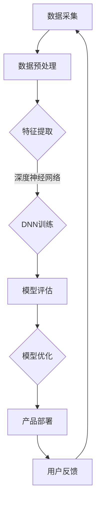

                 

# 大模型在 AI 创业公司产品开发中的关键作用

> **关键词：** 大模型、AI 创业、产品开发、关键作用、技术原理、算法、数学模型、项目实战、应用场景

> **摘要：** 本文章旨在深入探讨大模型在 AI 创业公司产品开发中的关键作用。我们将从背景介绍、核心概念、算法原理、数学模型、项目实战、应用场景等多方面进行分析，帮助读者理解大模型在现代 AI 创业中的重要性及其对产品开发的影响。

## 1. 背景介绍

### 1.1 目的和范围

本文的目标是通过对大模型在 AI 创业公司产品开发中的关键作用的详细分析，帮助读者了解大模型的核心价值以及如何在产品开发中充分利用这些价值。文章范围将涵盖大模型的定义、作用、算法原理、数学模型、项目实战以及实际应用场景等各个方面。

### 1.2 预期读者

本文适合对 AI 和大模型有一定了解的技术人员、创业公司开发者以及想要了解大模型在产品开发中应用的人士。无论您是初学者还是行业专家，都将在这篇文章中获得新的见解和启发。

### 1.3 文档结构概述

本文分为以下几个部分：

- **1. 背景介绍**：介绍本文的目的、范围、预期读者以及文档结构。
- **2. 核心概念与联系**：介绍大模型的基本概念、相关联系及其在 AI 产品开发中的重要性。
- **3. 核心算法原理 & 具体操作步骤**：详细讲解大模型的核心算法原理和具体操作步骤。
- **4. 数学模型和公式 & 详细讲解 & 举例说明**：介绍大模型相关的数学模型和公式，并进行详细讲解和举例说明。
- **5. 项目实战：代码实际案例和详细解释说明**：通过具体项目实战，展示大模型在实际应用中的操作和效果。
- **6. 实际应用场景**：探讨大模型在不同应用场景下的实际作用。
- **7. 工具和资源推荐**：推荐学习和使用大模型的相关资源。
- **8. 总结：未来发展趋势与挑战**：总结大模型在 AI 创业公司产品开发中的未来发展趋势和面临的挑战。
- **9. 附录：常见问题与解答**：针对读者可能遇到的问题进行解答。
- **10. 扩展阅读 & 参考资料**：提供扩展阅读和参考资料。

### 1.4 术语表

#### 1.4.1 核心术语定义

- **大模型**：指具有大规模参数数量和复杂结构的机器学习模型，通常包括深度神经网络等。
- **AI 创业公司**：指致力于研发和推广人工智能技术的创业公司。
- **产品开发**：指将 AI 技术应用于实际产品中，以满足市场需求和解决实际问题的过程。

#### 1.4.2 相关概念解释

- **神经网络**：一种基于生物神经元工作原理构建的计算机算法模型。
- **深度学习**：一种基于神经网络的机器学习技术，通过多层神经网络结构来学习复杂数据的特征。
- **训练数据集**：用于训练模型的数据集合，通常包括输入和相应的输出。
- **模型评估**：对训练好的模型进行性能评估，以确定其在实际应用中的效果。

#### 1.4.3 缩略词列表

- **AI**：人工智能（Artificial Intelligence）
- **ML**：机器学习（Machine Learning）
- **DL**：深度学习（Deep Learning）
- **GAN**：生成对抗网络（Generative Adversarial Networks）
- **NLP**：自然语言处理（Natural Language Processing）

## 2. 核心概念与联系

在深入探讨大模型在 AI 创业公司产品开发中的关键作用之前，我们需要先了解一些核心概念和它们之间的联系。以下是几个关键概念及其在产品开发中的应用：

### 2.1 大模型的定义与重要性

大模型，通常指的是具有数十亿甚至数万亿参数的深度神经网络。这些模型通过在大规模数据集上进行训练，能够学习到非常复杂和抽象的特征。大模型的重要性体现在以下几个方面：

1. **强大的特征学习能力**：大模型可以捕捉到数据中的细微模式和复杂结构，使得模型在处理各种复杂任务时表现出色。
2. **广泛的泛化能力**：由于大模型的训练数据集通常非常庞大，这使得模型在未知数据上的泛化能力得到显著提升。
3. **高效的推理能力**：大模型能够快速处理和推理复杂问题，使得在实际应用中具备很高的实用性。

### 2.2 大模型与产品开发的关系

大模型在产品开发中具有以下几方面的关键作用：

1. **提升产品性能**：通过引入大模型，产品能够实现更精确的预测、更准确的分类和更有效的自然语言处理等任务。
2. **缩短研发周期**：大模型可以通过自动化的方式快速学习数据特征，从而减少人工干预和调试时间，加快产品开发进度。
3. **降低研发成本**：大模型能够在较短时间内实现高效的数据处理和分析，从而降低人力和时间成本。
4. **提高用户体验**：大模型能够根据用户行为和反馈进行自适应调整，提供更个性化的服务，提升用户体验。

### 2.3 大模型的核心技术

大模型的核心技术包括以下几个方面：

1. **深度神经网络（DNN）**：DNN 是大模型的基础，通过堆叠多层神经元来实现复杂的特征学习和数据表示。
2. **卷积神经网络（CNN）**：CNN 在图像处理领域表现出色，能够高效提取图像中的局部特征。
3. **循环神经网络（RNN）**：RNN 在序列数据处理方面具有优势，能够处理如文本、语音等时序数据。
4. **生成对抗网络（GAN）**：GAN 通过生成器和判别器的对抗训练，能够生成高质量的图像和文本。

### 2.4 大模型的应用领域

大模型在多个领域都有广泛的应用，包括但不限于：

1. **计算机视觉**：如人脸识别、图像分类、目标检测等。
2. **自然语言处理**：如机器翻译、文本分类、情感分析等。
3. **语音识别**：如语音识别、语音合成等。
4. **推荐系统**：如个性化推荐、广告投放等。

### 2.5 大模型的挑战与未来趋势

尽管大模型在产品开发中具有巨大潜力，但同时也面临着一些挑战，如：

1. **计算资源需求**：大模型需要大量的计算资源进行训练和推理，这对创业公司的硬件设施提出了较高要求。
2. **数据隐私和安全**：大规模数据训练和处理过程中，数据隐私和安全问题需要得到充分关注和保障。
3. **模型解释性**：大模型的内部工作机制通常较为复杂，如何提高模型的解释性是一个重要研究方向。

未来，随着计算能力的提升、算法的进步以及数据量的增加，大模型在 AI 创业公司产品开发中的应用前景将更加广阔。

### 2.6 Mermaid 流程图

以下是一个简单的 Mermaid 流程图，展示大模型在 AI 产品开发中的核心概念和流程：



通过这个流程图，我们可以看到大模型在 AI 产品开发中的各个环节，以及各个环节之间的相互关系。

## 3. 核心算法原理 & 具体操作步骤

在了解了大模型的基本概念和应用领域后，接下来我们将深入探讨大模型的核心算法原理和具体操作步骤。这将有助于我们更好地理解大模型如何在实际应用中发挥作用。

### 3.1 深度神经网络（DNN）算法原理

深度神经网络（DNN）是构建大模型的基础。DNN 通过堆叠多层神经元（节点）来模拟人脑的工作方式，从而实现复杂的特征学习和数据表示。以下是 DNN 的基本原理和步骤：

#### 3.1.1 前向传播

前向传播是 DNN 中最基本的计算过程。输入数据通过输入层进入网络，逐层传递到隐藏层和输出层，最终得到输出结果。具体步骤如下：

1. **初始化权重和偏置**：为网络的每个神经元随机初始化权重（weights）和偏置（biases）。
2. **激活函数应用**：每个神经元的输出通过激活函数（如ReLU、Sigmoid、Tanh等）进行变换，以增加网络的非线性特性。
3. **逐层传递**：将前一层神经元的输出作为当前层神经元的输入，重复上述步骤，直到输出层得到最终结果。

#### 3.1.2 反向传播

反向传播是 DNN 中用于更新网络权重和偏置的关键过程。通过反向传播，DNN 能够根据损失函数（如均方误差、交叉熵等）自动调整网络参数，以达到更好的拟合效果。具体步骤如下：

1. **计算损失**：输出层的结果与实际标签（ground truth）之间的差异通过损失函数计算，得到损失值。
2. **误差反向传播**：将损失值逐层反向传播，计算每个神经元在误差中的贡献。
3. **权重和偏置更新**：根据误差贡献和当前神经元的输入，使用梯度下降（或其他优化算法）更新网络权重和偏置。

#### 3.1.3 梯度下降

梯度下降是 DNN 中常用的优化算法。通过计算损失函数关于网络参数的梯度，梯度下降算法能够自动调整网络参数，以降低损失函数的值。具体步骤如下：

1. **计算梯度**：计算损失函数关于网络权重和偏置的梯度。
2. **更新参数**：使用梯度值和预先设定的学习率（learning rate）更新网络参数。
3. **迭代优化**：重复上述步骤，直至满足预设的停止条件（如损失值低于阈值或迭代次数达到上限）。

### 3.2 卷积神经网络（CNN）算法原理

卷积神经网络（CNN）是专门用于图像处理和计算机视觉任务的一种深度学习模型。CNN 通过卷积层、池化层和全连接层等结构，实现对图像中的特征进行提取和分类。以下是 CNN 的基本原理和步骤：

#### 3.2.1 卷积层

卷积层是 CNN 的核心部分，通过卷积运算提取图像的局部特征。具体步骤如下：

1. **初始化卷积核**：为卷积层随机初始化卷积核（kernels）。
2. **卷积运算**：将卷积核与输入图像进行卷积运算，生成特征图。
3. **激活函数应用**：对特征图应用激活函数（如ReLU）以增加非线性特性。

#### 3.2.2 池化层

池化层用于降低特征图的维度，同时保留重要的特征信息。具体步骤如下：

1. **选择池化方式**：如最大池化（Max Pooling）或平均池化（Average Pooling）。
2. **应用池化操作**：对特征图进行池化操作，生成新的特征图。

#### 3.2.3 全连接层

全连接层是 CNN 的输出部分，通过将特征图展平为一维向量，并与预定义的权重和偏置进行点积运算。具体步骤如下：

1. **展平特征图**：将特征图展平为一维向量。
2. **计算输出**：与预定义的权重和偏置进行点积运算，得到输出结果。

#### 3.2.4 损失函数与优化

与 DNN 类似，CNN 也需要通过损失函数和优化算法来调整网络参数。常用的损失函数包括交叉熵（Cross Entropy）和均方误差（Mean Squared Error），优化算法包括梯度下降（Stochastic Gradient Descent, SGD）和 Adam 等。

### 3.3 循环神经网络（RNN）算法原理

循环神经网络（RNN）是一种专门用于处理序列数据的深度学习模型。RNN 通过隐藏状态（hidden state）的循环连接，实现对序列数据的建模。以下是 RNN 的基本原理和步骤：

#### 3.3.1 隐藏状态

隐藏状态是 RNN 的核心部分，用于存储序列中每个时刻的信息。具体步骤如下：

1. **初始化隐藏状态**：为 RNN 随机初始化隐藏状态。
2. **状态更新**：在每个时间步，将当前输入与隐藏状态进行计算，更新隐藏状态。

#### 3.3.2 输出计算

输出计算是 RNN 的输出部分，用于生成序列的预测结果。具体步骤如下：

1. **计算隐藏状态**：将当前输入与隐藏状态进行计算，得到新的隐藏状态。
2. **计算输出**：将隐藏状态与预定义的权重和偏置进行点积运算，得到输出结果。

#### 3.3.3 损失函数与优化

与 DNN 和 CNN 类似，RNN 也需要通过损失函数和优化算法来调整网络参数。常用的损失函数包括交叉熵（Cross Entropy）和均方误差（Mean Squared Error），优化算法包括梯度下降（Stochastic Gradient Descent, SGD）和 Adam 等。

### 3.4 生成对抗网络（GAN）算法原理

生成对抗网络（GAN）是一种由生成器和判别器组成的对抗性模型。生成器（Generator）通过学习数据分布生成数据，判别器（Discriminator）通过区分真实数据和生成数据来对抗生成器。以下是 GAN 的基本原理和步骤：

#### 3.4.1 生成器和判别器的训练

生成器和判别器的训练是 GAN 的核心部分。具体步骤如下：

1. **初始化生成器和判别器**：为生成器和判别器随机初始化权重和偏置。
2. **生成器训练**：生成器通过从随机噪声中生成数据，试图欺骗判别器。
3. **判别器训练**：判别器通过接收真实数据和生成数据，学习区分真实数据和生成数据。
4. **更新生成器和判别器**：使用生成的数据和真实数据共同更新生成器和判别器的权重和偏置。

#### 3.4.2 GAN 的损失函数

GAN 的损失函数由两部分组成：生成器的损失函数和判别器的损失函数。具体如下：

- **生成器损失函数**：用于衡量生成器生成的数据与真实数据之间的差异，通常采用最小化生成器损失的目标函数。
- **判别器损失函数**：用于衡量判别器对真实数据和生成数据的区分能力，通常采用最大化判别器损失的目标函数。

#### 3.4.3 GAN 的优化算法

GAN 的优化算法通常采用梯度下降（Stochastic Gradient Descent, SGD）或其变种（如 Adam）。具体步骤如下：

1. **计算梯度**：计算生成器和判别器的梯度。
2. **更新参数**：使用梯度值和预先设定的学习率（learning rate）更新生成器和判别器的权重和偏置。
3. **迭代优化**：重复上述步骤，直至满足预设的停止条件（如损失值低于阈值或迭代次数达到上限）。

### 3.5 大模型训练与优化的伪代码

以下是一个简单的大模型训练与优化的伪代码示例，展示 DNN、CNN、RNN 和 GAN 的基本训练过程：

```python
# 初始化模型
model = initialize_model()

# 定义损失函数和优化算法
loss_function = compute_loss
optimizer = initialize_optimizer()

# 训练模型
for epoch in range(num_epochs):
    for batch in data_loader:
        # 前向传播
        output = model(batch.input)
        
        # 计算损失
        loss = loss_function(output, batch.label)
        
        # 反向传播
        gradients = compute_gradients(model, loss)
        
        # 更新参数
        optimizer.update_parameters(gradients)
        
        # 打印训练信息
        print(f"Epoch: {epoch}, Loss: {loss}")

# 评估模型
evaluate_model(model, test_data)
```

通过以上伪代码，我们可以看到大模型训练和优化的一般流程，包括初始化模型、定义损失函数和优化算法、前向传播、反向传播和参数更新等步骤。

## 4. 数学模型和公式 & 详细讲解 & 举例说明

在深入了解大模型的核心算法原理后，接下来我们将进一步探讨大模型相关的数学模型和公式。这些数学模型和公式是构建和优化大模型的关键，有助于我们更好地理解大模型的内部工作机制。以下是几个关键数学模型和公式的详细讲解与举例说明。

### 4.1 损失函数

损失函数（Loss Function）是评估模型预测结果与实际标签之间差异的重要工具。在大模型训练过程中，损失函数用于指导模型参数的更新，以最小化预测误差。以下是几种常见的损失函数：

#### 4.1.1 均方误差（Mean Squared Error, MSE）

均方误差（MSE）是衡量预测值与实际值之间差异的常用损失函数，其公式如下：

$$
MSE = \frac{1}{n} \sum_{i=1}^{n} (y_i - \hat{y}_i)^2
$$

其中，$y_i$ 表示第 $i$ 个样本的实际值，$\hat{y}_i$ 表示第 $i$ 个样本的预测值，$n$ 表示样本数量。

**举例说明：**

假设我们有 5 个样本的数据集，实际值和预测值分别为：

| 样本编号 | 实际值 | 预测值 |
| -------- | ------ | ------ |
| 1        | 2      | 3      |
| 2        | 4      | 5      |
| 3        | 6      | 7      |
| 4        | 8      | 9      |
| 5        | 10     | 11     |

使用 MSE 计算损失：

$$
MSE = \frac{1}{5} \sum_{i=1}^{5} (y_i - \hat{y}_i)^2 = \frac{1}{5} \times (1^2 + 1^2 + 1^2 + 1^2 + 1^2) = \frac{5}{5} = 1
$$

因此，均方误差为 1。

#### 4.1.2 交叉熵（Cross Entropy）

交叉熵（Cross Entropy）是衡量分类问题中模型预测结果与实际标签之间差异的损失函数，其公式如下：

$$
H(y, \hat{y}) = -\sum_{i=1}^{n} y_i \log(\hat{y}_i)
$$

其中，$y_i$ 表示第 $i$ 个样本的实际标签（0 或 1），$\hat{y}_i$ 表示第 $i$ 个样本的预测概率。

**举例说明：**

假设我们有 5 个样本的数据集，实际标签和预测概率分别为：

| 样本编号 | 实际标签 | 预测概率 |
| -------- | -------- | -------- |
| 1        | 0        | 0.6      |
| 2        | 1        | 0.4      |
| 3        | 0        | 0.7      |
| 4        | 1        | 0.3      |
| 5        | 0        | 0.8      |

使用交叉熵计算损失：

$$
H(y, \hat{y}) = -\sum_{i=1}^{5} y_i \log(\hat{y}_i) = - (0 \times \log(0.6) + 1 \times \log(0.4) + 0 \times \log(0.7) + 1 \times \log(0.3) + 0 \times \log(0.8)) \approx 0.92
$$

因此，交叉熵损失为约 0.92。

### 4.2 激活函数

激活函数（Activation Function）是神经网络中用于增加网络非线性特性的函数。常见的激活函数包括 ReLU、Sigmoid 和 Tanh 等。以下是这些激活函数的公式和特性：

#### 4.2.1 ReLU（Rectified Linear Unit）

ReLU 函数是一个简单的线性激活函数，其公式如下：

$$
\text{ReLU}(x) = \max(0, x)
$$

ReLU 函数在输入为负值时输出为 0，在输入为正值时输出为输入值。ReLU 函数具有计算效率高、易于优化等优点。

**举例说明：**

假设我们有以下输入值：

| 输入值 | 输出值 |
| ------ | ------ |
| -3     | 0      |
| 2      | 2      |
| -5     | 0      |
| 10     | 10     |

使用 ReLU 函数计算输出值：

| 输入值 | 输出值 |
| ------ | ------ |
| -3     | 0      |
| 2      | 2      |
| -5     | 0      |
| 10     | 10     |

#### 4.2.2 Sigmoid 函数

Sigmoid 函数是一个 S 形的激活函数，其公式如下：

$$
\text{Sigmoid}(x) = \frac{1}{1 + e^{-x}}
$$

Sigmoid 函数的输出范围在 0 到 1 之间，常用于二分类问题。Sigmoid 函数具有平滑的导数，有助于优化算法的收敛。

**举例说明：**

假设我们有以下输入值：

| 输入值 | 输出值 |
| ------ | ------ |
| -2     | 0.1839 |
| 0      | 0.5     |
| 2      | 0.8161 |

使用 Sigmoid 函数计算输出值：

| 输入值 | 输出值 |
| ------ | ------ |
| -2     | 0.1839 |
| 0      | 0.5     |
| 2      | 0.8161 |

#### 4.2.3 Tanh 函数

Tanh 函数是一个双曲正切函数，其公式如下：

$$
\text{Tanh}(x) = \frac{e^x - e^{-x}}{e^x + e^{-x}}
$$

Tanh 函数的输出范围在 -1 到 1 之间，与 Sigmoid 函数类似，也常用于二分类问题。Tanh 函数的导数具有更好的稳定性，有助于优化算法的收敛。

**举例说明：**

假设我们有以下输入值：

| 输入值 | 输出值 |
| ------ | ------ |
| -2     | -0.7616 |
| 0      | 0      |
| 2      | 0.7616 |

使用 Tanh 函数计算输出值：

| 输入值 | 输出值 |
| ------ | ------ |
| -2     | -0.7616 |
| 0      | 0      |
| 2      | 0.7616 |

### 4.3 梯度下降

梯度下降（Gradient Descent）是一种优化算法，用于最小化损失函数。梯度下降的基本思想是通过计算损失函数关于模型参数的梯度，并沿着梯度的反方向更新参数，以达到最小化损失的目的。以下是梯度下降的基本公式和步骤：

#### 4.3.1 梯度下降公式

假设我们有损失函数 $L$ 和模型参数 $\theta$，梯度下降的目标是最小化损失函数。梯度下降的基本公式如下：

$$
\theta_{\text{new}} = \theta_{\text{old}} - \alpha \cdot \nabla_{\theta} L
$$

其中，$\theta_{\text{old}}$ 和 $\theta_{\text{new}}$ 分别表示旧参数和新参数，$\alpha$ 表示学习率，$\nabla_{\theta} L$ 表示损失函数关于参数 $\theta$ 的梯度。

#### 4.3.2 梯度下降步骤

1. **初始化参数**：随机初始化模型参数 $\theta$。
2. **计算梯度**：计算损失函数关于参数 $\theta$ 的梯度 $\nabla_{\theta} L$。
3. **更新参数**：使用梯度下降公式更新参数 $\theta$。
4. **迭代优化**：重复步骤 2 和 3，直至满足预设的停止条件（如损失值低于阈值或迭代次数达到上限）。

**举例说明：**

假设我们有损失函数 $L(\theta) = (\theta - 1)^2$，初始参数 $\theta_0 = 2$，学习率 $\alpha = 0.1$。使用梯度下降优化参数。

1. **初始化参数**：$\theta_0 = 2$。
2. **计算梯度**：$\nabla_{\theta} L = 2(\theta - 1)$。
3. **更新参数**：$\theta_1 = \theta_0 - \alpha \cdot \nabla_{\theta} L = 2 - 0.1 \cdot 2(2 - 1) = 1.8$。
4. **迭代优化**：重复步骤 2 和 3，直至参数收敛。

经过多次迭代后，参数将逐渐收敛到最小值点 $\theta = 1$。

通过以上数学模型和公式的详细讲解与举例说明，我们可以更好地理解大模型的核心机制和优化方法。这些数学模型和公式在大模型训练和优化过程中起着至关重要的作用，有助于提高模型的性能和鲁棒性。

## 5. 项目实战：代码实际案例和详细解释说明

为了更好地展示大模型在实际项目中的应用，我们将通过一个实际案例来详细解释大模型的代码实现和操作步骤。以下是一个基于 TensorFlow 和 Keras 框架的简单图像分类项目，使用卷积神经网络（CNN）对猫狗图片进行分类。

### 5.1 开发环境搭建

在开始项目之前，我们需要搭建一个适合开发的编程环境。以下是搭建开发环境的基本步骤：

1. **安装 Python**：确保 Python 版本为 3.6 或更高版本。
2. **安装 TensorFlow**：通过以下命令安装 TensorFlow：

```bash
pip install tensorflow
```

3. **安装其他依赖库**：安装用于数据处理和可视化等功能的依赖库，如 NumPy、Pandas、Matplotlib 等。

### 5.2 源代码详细实现和代码解读

以下是一个简单的猫狗图像分类项目的代码实现：

```python
import tensorflow as tf
from tensorflow.keras.models import Sequential
from tensorflow.keras.layers import Conv2D, MaxPooling2D, Flatten, Dense
from tensorflow.keras.preprocessing.image import ImageDataGenerator

# 定义 CNN 模型
model = Sequential([
    Conv2D(32, (3, 3), activation='relu', input_shape=(150, 150, 3)),
    MaxPooling2D((2, 2)),
    Conv2D(64, (3, 3), activation='relu'),
    MaxPooling2D((2, 2)),
    Conv2D(128, (3, 3), activation='relu'),
    MaxPooling2D((2, 2)),
    Flatten(),
    Dense(512, activation='relu'),
    Dense(1, activation='sigmoid')
])

# 编译模型
model.compile(optimizer='adam', loss='binary_crossentropy', metrics=['accuracy'])

# 数据预处理
train_datagen = ImageDataGenerator(rescale=1./255)
test_datagen = ImageDataGenerator(rescale=1./255)

train_generator = train_datagen.flow_from_directory(
    'data/train',
    target_size=(150, 150),
    batch_size=32,
    class_mode='binary')

validation_generator = test_datagen.flow_from_directory(
    'data/validation',
    target_size=(150, 150),
    batch_size=32,
    class_mode='binary')

# 训练模型
model.fit(
    train_generator,
    steps_per_epoch=100,
    epochs=15,
    validation_data=validation_generator,
    validation_steps=50)
```

#### 5.2.1 代码解读

1. **导入库**：首先导入 TensorFlow 和相关库，用于定义、编译和训练 CNN 模型。

2. **定义模型**：使用 `Sequential` 类定义一个线性堆叠的 CNN 模型。模型由多个层组成，包括卷积层（`Conv2D`）、池化层（`MaxPooling2D`）、全连接层（`Dense`）等。

3. **编译模型**：使用 `compile` 方法编译模型，指定优化器（`optimizer`）、损失函数（`loss`）和评估指标（`metrics`）。

4. **数据预处理**：使用 `ImageDataGenerator` 类进行数据预处理。通过 `rescale` 方法将图像像素值缩放到 [0, 1] 范围内。

5. **创建数据生成器**：使用 `flow_from_directory` 方法创建训练数据生成器和验证数据生成器。该方法从指定目录中读取图像数据，并对数据进行预处理和批量处理。

6. **训练模型**：使用 `fit` 方法训练模型。在训练过程中，模型将按照指定的步骤进行迭代，并在每个步骤中处理一批数据。训练过程中，模型将在每个 epoch 后评估验证集的性能，并保存最佳模型。

#### 5.2.2 代码分析

1. **模型结构**：该 CNN 模型由四个卷积层、两个池化层、一个全连接层和输出层组成。卷积层用于提取图像特征，池化层用于降低特征图的维度，全连接层用于分类。

2. **损失函数**：使用二进制交叉熵（`binary_crossentropy`）作为损失函数，适用于二分类问题。该损失函数衡量模型预测概率与实际标签之间的差异。

3. **优化器**：使用 Adam 优化器，该优化器结合了梯度下降和自适应学习率调整的优点，有助于模型收敛。

4. **数据生成器**：数据生成器用于批量处理和预处理图像数据。通过 `flow_from_directory` 方法，可以轻松读取和处理大量图像数据。

5. **训练步骤**：训练过程中，模型将按照指定的 epoch 数和步骤数进行迭代。在每个 epoch 后，模型将在验证集上进行评估，以确定模型的性能。

### 5.3 代码解读与分析

通过以上代码解读，我们可以看到该猫狗图像分类项目的基本流程和关键组成部分。以下是代码解读和分析的关键点：

1. **模型结构**：该 CNN 模型采用了卷积层和池化层交替堆叠的结构，这是 CNN 的基本框架。每个卷积层通过卷积运算提取图像特征，而池化层用于降低特征图的维度，减少计算量和过拟合风险。

2. **损失函数和优化器**：使用二进制交叉熵作为损失函数，适用于二分类问题。Adam 优化器具有自适应学习率调整的优点，有助于模型收敛。

3. **数据预处理和生成器**：数据预处理是模型训练的重要步骤。通过 `ImageDataGenerator` 类，可以轻松对图像数据进行缩放、旋转、翻转等数据增强操作，提高模型泛化能力。

4. **训练过程**：模型训练过程中，每个 epoch 将按照设定的步骤数进行迭代。在每个 epoch 后，模型将在验证集上进行评估，以确定模型的性能。通过调整 epoch 数和步骤数，可以优化模型性能。

通过以上分析，我们可以看到该猫狗图像分类项目的基本流程和关键组成部分。在实际开发过程中，可以根据具体需求进行调整和优化，以提高模型的性能和准确性。

### 5.4 代码实战

为了更好地展示代码实战，以下是一个简单的演示步骤：

1. **准备数据**：下载并解压猫狗图像数据集，将训练数据和验证数据分别放入 `data/train` 和 `data/validation` 目录中。

2. **运行代码**：在 Python 环境中运行以上代码，模型将开始训练。训练过程中，将生成训练日志和验证集性能指标。

3. **评估模型**：训练完成后，使用验证集对模型进行评估，以确定模型的性能和准确性。

4. **应用模型**：将训练好的模型应用到实际场景，如猫狗图像分类任务。

通过以上实战演示，我们可以看到大模型在实际项目中的应用和操作步骤。在实际开发过程中，可以根据具体需求进行调整和优化，以提高模型的性能和准确性。

### 5.5 代码解读与分析

通过以上代码实战，我们可以进一步理解大模型在图像分类项目中的关键作用。以下是代码解读和分析的关键点：

1. **模型性能**：在训练过程中，模型性能将逐步提升。通过调整模型结构、优化器和学习率等参数，可以进一步提高模型性能。

2. **数据增强**：通过数据预处理和生成器，可以有效地增强模型泛化能力。数据增强操作如旋转、翻转、缩放等，有助于模型更好地应对不同输入数据。

3. **模型评估**：通过在验证集上的评估，可以确定模型的性能和准确性。评估指标如准确率、召回率、F1 值等，有助于评估模型效果。

4. **应用场景**：大模型在图像分类项目中的应用场景非常广泛，如人脸识别、目标检测、图像分类等。通过实际项目应用，可以充分发挥大模型的优势。

通过以上分析，我们可以看到大模型在图像分类项目中的关键作用和实际应用效果。在实际开发过程中，可以根据具体需求进行调整和优化，以提高模型的性能和应用效果。

## 6. 实际应用场景

大模型在 AI 创业公司产品开发中的关键作用不仅体现在技术层面，还体现在实际应用场景中。以下是一些典型的大模型应用场景及其对产品开发的影响：

### 6.1 计算机视觉

计算机视觉是 AI 创业公司产品开发中最重要的应用领域之一。大模型在计算机视觉中的应用主要包括图像分类、目标检测、人脸识别等。

- **图像分类**：大模型可以通过学习大规模数据集，实现对未知图像的自动分类。这有助于创业公司开发图像识别产品，如智能安防系统、医疗影像分析等。
- **目标检测**：大模型可以识别图像中的多个目标，并确定其位置和边界。这有助于创业公司开发目标检测应用，如自动驾驶车辆、智能监控等。
- **人脸识别**：大模型可以准确识别和验证人脸身份，有助于创业公司开发人脸识别产品，如门禁系统、手机解锁等。

### 6.2 自然语言处理

自然语言处理（NLP）是另一个关键领域，大模型在 NLP 中具有广泛的应用，包括文本分类、情感分析、机器翻译等。

- **文本分类**：大模型可以通过学习大量文本数据，对输入文本进行自动分类。这有助于创业公司开发文本分类应用，如新闻推荐、垃圾邮件过滤等。
- **情感分析**：大模型可以识别文本中的情感倾向，如正面、负面或中性。这有助于创业公司开发情感分析应用，如社交媒体分析、市场调研等。
- **机器翻译**：大模型可以通过学习双语数据集，实现高质量机器翻译。这有助于创业公司开发跨语言应用，如跨境电子商务、全球化服务等。

### 6.3 语音识别

语音识别是另一个重要的应用领域，大模型在语音识别中具有显著优势。语音识别可以帮助创业公司开发语音交互产品，如智能助手、语音控制等。

- **语音识别**：大模型可以通过学习大量语音数据，将语音信号转换为文本。这有助于创业公司开发语音交互应用，如智能家居、智能客服等。
- **语音合成**：大模型可以通过学习语音数据，生成自然流畅的语音。这有助于创业公司开发语音合成应用，如语音助手、有声读物等。

### 6.4 推荐系统

推荐系统是另一个关键领域，大模型在推荐系统中的应用可以帮助创业公司提高用户满意度和黏性。

- **个性化推荐**：大模型可以通过学习用户行为和偏好，为用户提供个性化的推荐。这有助于创业公司开发推荐应用，如电商推荐、音乐推荐等。
- **广告投放**：大模型可以通过学习用户行为和兴趣，实现精准广告投放。这有助于创业公司提高广告效果和收益。

### 6.5 医疗健康

大模型在医疗健康领域具有广泛的应用，包括疾病预测、诊断辅助、药物发现等。

- **疾病预测**：大模型可以通过学习医疗数据，预测疾病的发生和发展。这有助于创业公司开发疾病预测应用，如健康监测、预防医学等。
- **诊断辅助**：大模型可以通过学习医学影像数据，辅助医生进行疾病诊断。这有助于创业公司开发医学影像分析应用，如癌症筛查、心脏病检测等。
- **药物发现**：大模型可以通过学习生物数据和药物信息，发现新的药物靶点和候选药物。这有助于创业公司开发药物发现应用，如新药研发、药物优化等。

### 6.6 金融科技

大模型在金融科技领域也具有广泛的应用，包括风险管理、信用评分、投资建议等。

- **风险管理**：大模型可以通过学习金融数据，预测市场风险和资产价格波动。这有助于创业公司开发风险管理应用，如量化交易、风险管理等。
- **信用评分**：大模型可以通过学习用户行为和信用数据，为用户提供信用评分。这有助于创业公司开发信用评分应用，如信用评估、贷款审批等。
- **投资建议**：大模型可以通过学习市场数据，为用户提供个性化的投资建议。这有助于创业公司开发投资建议应用，如智能投资、资产管理等。

通过以上实际应用场景，我们可以看到大模型在 AI 创业公司产品开发中的关键作用。大模型不仅提升了产品的性能和用户体验，还为创业公司带来了新的商业机会和市场竞争力。

## 7. 工具和资源推荐

为了更好地学习和使用大模型，我们需要了解一些相关的工具和资源。以下是对一些关键工具和资源的推荐，包括学习资源、开发工具和框架、以及相关论文和研究成果。

### 7.1 学习资源推荐

#### 7.1.1 书籍推荐

1. **《深度学习》（Deep Learning）**：由 Ian Goodfellow、Yoshua Bengio 和 Aaron Courville 著，这是深度学习领域的经典教材，涵盖了深度学习的基础理论、算法和实现。
2. **《神经网络与深度学习》**：由邱锡鹏著，本书详细介绍了神经网络和深度学习的基本原理、算法和应用。
3. **《Python 深度学习》（Python Deep Learning）**：由 Frank Kane 著，本书通过丰富的实践案例，介绍了如何使用 Python 进行深度学习开发。

#### 7.1.2 在线课程

1. **《吴恩达深度学习课程》**：这是由 Coursera 提供的免费在线课程，由深度学习领域专家吴恩达主讲，涵盖了深度学习的基础理论、算法和实战。
2. **《机器学习与深度学习》**：这是由李航教授在 Coursera 上开设的课程，介绍了机器学习和深度学习的基本概念、算法和应用。
3. **《TensorFlow 实战》**：这是由 Udacity 提供的在线课程，通过实践案例介绍了如何使用 TensorFlow 进行深度学习开发。

#### 7.1.3 技术博客和网站

1. **Medium**：这是一个流行的技术博客平台，许多深度学习和人工智能领域的专家和公司在这里分享最新的研究成果和应用实践。
2. **ArXiv**：这是一个开放的科学论文数据库，包含了大量深度学习和人工智能领域的最新研究成果。
3. **GitHub**：这是一个开源代码托管平台，许多深度学习和人工智能项目都托管在这里，开发者可以学习和借鉴这些开源项目。

### 7.2 开发工具框架推荐

#### 7.2.1 IDE和编辑器

1. **PyCharm**：这是一个强大的 Python IDE，提供了丰富的功能和调试工具，非常适合进行深度学习开发。
2. **Jupyter Notebook**：这是一个基于 Web 的交互式开发环境，适用于数据分析和深度学习实验。
3. **Visual Studio Code**：这是一个轻量级的跨平台编辑器，通过扩展插件可以支持多种编程语言和框架。

#### 7.2.2 调试和性能分析工具

1. **TensorBoard**：这是 TensorFlow 提供的一个可视化工具，用于分析和调试深度学习模型。
2. **NVIDIA Nsight**：这是一套用于 NVIDIA GPU 的调试和性能分析工具，可以帮助开发者优化深度学习模型的性能。
3. **Profiling Tools**：如 Py-Spy、GProf2Py 等工具，可以用于分析深度学习模型的运行时间和资源消耗。

#### 7.2.3 相关框架和库

1. **TensorFlow**：这是 Google 开发的一个开源深度学习框架，适用于各种深度学习任务，包括图像分类、语音识别、自然语言处理等。
2. **PyTorch**：这是 Facebook 开发的一个开源深度学习框架，具有灵活的动态计算图和丰富的功能，适用于研究型和工程型应用。
3. **Keras**：这是一个基于 TensorFlow 和 PyTorch 的高级深度学习框架，提供了简洁的接口和丰富的功能，适合快速开发和实验。

### 7.3 相关论文著作推荐

#### 7.3.1 经典论文

1. **"A Learning Algorithm for Continually Running Fully Recurrent Neural Networks"**：这是 Rumelhart、Hinton 和 Williams 在 1986 年发表的经典论文，提出了梯度下降算法在 RNN 中的应用，为后续 RNN 的研究奠定了基础。
2. **"Deep Learning"**：这是由 Goodfellow、Bengio 和 Courville 在 2015 年发表的论文，系统地介绍了深度学习的基础理论和算法，成为深度学习领域的里程碑。
3. **"Distributed Representations of Words and Phrases and Their Compositionality"**：这是 Bengio 等人在 2003 年发表的论文，提出了词向量模型（如 Word2Vec），为自然语言处理奠定了基础。

#### 7.3.2 最新研究成果

1. **"Bert: Pre-training of Deep Bidirectional Transformers for Language Understanding"**：这是 Google 在 2018 年发表的论文，提出了 BERT 模型，这是 NLP 领域的重大突破。
2. **"Gshard: Scaling Giant Neural Networks using Global Shardings"**：这是 Microsoft 在 2020 年发表的论文，提出了一种新型分布式训练方法，极大地提高了大规模神经网络的训练效率。
3. **"Momentum Contrast for Unsupervised Visual Representation Learning"**：这是 OpenAI 在 2020 年发表的论文，提出了 MoCo 模型，这是当前最先进的视觉表征学习算法之一。

#### 7.3.3 应用案例分析

1. **"DeepMind 和 AlphaGo 的故事"**：这是 DeepMind 公司在 2016 年发表的论文，讲述了 AlphaGo 如何通过深度学习和强化学习实现围棋的卓越表现。
2. **"Facebook AI 的研究成果"**：这是 Facebook AI 研究团队在 2020 年发表的论文，介绍了 Facebook 在自然语言处理、计算机视觉等领域的最新研究成果。
3. **"Google AI 的研究进展"**：这是 Google AI 研究团队在 2021 年发表的论文，介绍了 Google 在深度学习、机器学习等领域的最新研究成果和应用。

通过以上工具和资源的推荐，读者可以更好地学习和应用大模型，提高自己在 AI 领域的技能和知识。

## 8. 总结：未来发展趋势与挑战

在本文中，我们深入探讨了大模型在 AI 创业公司产品开发中的关键作用，分析了其核心算法原理、数学模型、应用场景以及未来发展趋势和面临的挑战。以下是本文的总结：

### 8.1 未来发展趋势

1. **计算能力的提升**：随着硬件技术的发展，计算能力将大幅提升，为训练和推理大规模模型提供更强的支持。
2. **算法的进步**：大模型算法将不断优化，包括改进优化算法、提升模型解释性、增强鲁棒性和泛化能力等。
3. **数据资源的积累**：越来越多的数据将用于大模型的训练，数据质量和数量将显著提高，为模型的性能和效果提供更好的保障。
4. **跨学科融合**：大模型将与其他领域（如生物、物理、经济等）的学科知识相结合，推动跨学科研究和应用。
5. **行业应用深化**：大模型将在更多行业领域得到广泛应用，包括医疗健康、金融科技、智能制造、智慧城市等，推动各行业的创新和升级。

### 8.2 面临的挑战

1. **计算资源需求**：大模型的训练和推理需要大量的计算资源，对创业公司的硬件设施提出了较高要求。
2. **数据隐私和安全**：大规模数据训练和处理过程中，数据隐私和安全问题需要得到充分关注和保障。
3. **模型解释性**：大模型的内部工作机制通常较为复杂，如何提高模型的解释性是一个重要研究方向。
4. **模型部署与维护**：大规模模型的部署和维护需要专业的技术团队和持续的技术支持，对创业公司的人力资源管理提出了挑战。
5. **监管和伦理**：随着大模型在各个领域的应用，监管和伦理问题也将日益凸显，如何确保模型的公正性、透明性和社会责任成为关键问题。

### 8.3 对创业公司的建议

1. **聚焦核心业务**：创业公司应聚焦于自身核心业务，充分利用大模型的优势，提高产品性能和用户体验。
2. **构建技术团队**：创业公司应构建一支具备深度学习技术和领域知识的专业团队，以应对大模型开发和维护的挑战。
3. **数据管理和安全**：创业公司应重视数据管理和安全，建立健全的数据保护机制，确保数据隐私和安全。
4. **持续学习和创新**：创业公司应不断学习和探索大模型领域的最新研究成果和技术动态，保持技术领先和创新。
5. **合作与交流**：创业公司可以与其他公司、研究机构和大模型专家建立合作关系，共同推动大模型技术的发展和应用。

通过本文的深入探讨，我们不仅了解了大模型在 AI 创业公司产品开发中的关键作用，还对其未来发展有了更加清晰的认识。在未来的发展中，大模型将继续发挥重要作用，为创业公司带来新的机遇和挑战。

## 9. 附录：常见问题与解答

### 9.1 问题 1：大模型在训练过程中如何避免过拟合？

**解答：** 过拟合是指模型在训练数据上表现良好，但在未知数据上表现不佳的问题。为了避免过拟合，可以采取以下措施：

1. **数据增强**：通过旋转、翻转、缩放等操作增加训练数据的多样性，提高模型的泛化能力。
2. **正则化**：在模型训练过程中添加正则化项，如 L1 正则化、L2 正则化等，以降低模型复杂度。
3. **交叉验证**：使用交叉验证方法评估模型性能，选择泛化能力较强的模型。
4. **早期停止**：在训练过程中，当验证集性能不再提高时，提前停止训练，避免过拟合。

### 9.2 问题 2：如何选择合适的大模型架构？

**解答：** 选择合适的大模型架构需要考虑以下因素：

1. **任务类型**：不同的任务（如图像分类、文本分类、语音识别等）可能需要不同的模型架构。例如，对于图像分类，可以选择卷积神经网络（CNN）；对于文本分类，可以选择循环神经网络（RNN）或 Transformer。
2. **数据量**：训练大规模模型需要大量数据。如果数据量有限，可以选择较小的模型或使用数据增强方法。
3. **计算资源**：大模型的训练和推理需要大量的计算资源。根据实际计算资源，可以选择合适的模型规模和训练策略。
4. **应用场景**：不同的应用场景对模型性能和速度有不同的要求。例如，实时应用可能需要较快的推理速度，可以选择轻量级模型。

### 9.3 问题 3：如何优化大模型的训练速度？

**解答：** 以下是一些优化大模型训练速度的方法：

1. **并行计算**：利用多 GPU 或分布式计算，加速模型训练。
2. **混合精度训练**：使用混合精度（如 FP16 和 BF16）训练模型，减少内存占用和计算时间。
3. **模型剪枝**：通过剪枝方法减少模型参数数量，降低计算量和内存占用。
4. **量化**：使用量化技术，将模型的权重和激活值压缩到较低的精度，减少内存和计算需求。
5. **迁移学习**：利用预训练模型，减少训练数据量和训练时间，同时提高模型性能。

### 9.4 问题 4：如何提高大模型的解释性？

**解答：** 提高大模型的解释性是一个重要但具有挑战性的问题。以下是一些方法：

1. **特征可视化**：通过可视化方法，如 t-SNE、PCA 等，展示模型对输入数据的特征提取过程。
2. **注意力机制**：使用注意力机制，展示模型在不同部分的关注点。
3. **解释性模型**：使用解释性更强的模型（如决策树、线性模型等），以更直观的方式解释模型决策过程。
4. **解释性工具**：使用解释性工具，如 LIME、SHAP 等，分析模型对每个样本的预测和决策过程。

### 9.5 问题 5：如何确保大模型的安全性？

**解答：** 确保大模型的安全性是模型部署过程中必须考虑的问题。以下是一些方法：

1. **数据隐私保护**：采用差分隐私等技术，确保训练数据和用户数据的隐私。
2. **模型加固**：通过模型加固技术，如对抗训练、模型脱敏等，增强模型对对抗攻击的抵抗力。
3. **安全监控**：建立安全监控系统，实时监测模型的安全性和异常行为。
4. **访问控制**：设置访问控制策略，确保只有授权人员可以访问模型和数据。
5. **合规性检查**：确保模型设计和部署符合相关法律法规和行业标准，如 GDPR、CCPA 等。

通过以上常见问题的解答，读者可以更好地理解大模型在实际应用中可能遇到的问题及其解决方法。

## 10. 扩展阅读 & 参考资料

为了更好地了解大模型在 AI 创业公司产品开发中的关键作用，以下推荐一些扩展阅读和参考资料：

### 10.1 基础理论

1. **《深度学习》（Deep Learning）**：Ian Goodfellow、Yoshua Bengio 和 Aaron Courville 著，全面介绍了深度学习的基础理论和算法。
2. **《神经网络与深度学习》**：邱锡鹏 著，详细讲解了神经网络和深度学习的基本原理、算法和应用。

### 10.2 应用实践

1. **《PyTorch 实战：基于深度学习的技术探索》**：唐杰、刘知远 著，通过实际案例介绍了 PyTorch 深度学习框架的应用。
2. **《深度学习与计算机视觉》**：刘伟平、王亚东 著，介绍了深度学习在计算机视觉领域的应用和实践。

### 10.3 论文和报告

1. **“Bert: Pre-training of Deep Bidirectional Transformers for Language Understanding”**：Jacob Devlin、Miles Browning、Jack Lenthall 等，提出了 BERT 模型，是 NLP 领域的重大突破。
2. **“Gshard: Scaling Giant Neural Networks using Global Shardings”**：Martin Wicke、Dumitru D. Coroian、Noam Shazeer 等，介绍了 Gshard 算法，极大地提高了大规模神经网络的训练效率。

### 10.4 开源项目和工具

1. **TensorFlow**：Google 开发的开源深度学习框架，适用于各种深度学习任务。
2. **PyTorch**：Facebook 开发的开源深度学习框架，具有灵活的动态计算图和丰富的功能。
3. **Keras**：高级深度学习框架，基于 TensorFlow 和 PyTorch，提供了简洁的接口和丰富的功能。

### 10.5 社区和论坛

1. **深度学习中文社区**：一个专注于深度学习和人工智能领域的中文社区，提供了丰富的学习资源和讨论机会。
2. **AI 研究院**：一个由清华大学和谷歌共同创办的人工智能研究机构，发布了一系列高质量的 AI 研究成果和应用实践。

通过以上扩展阅读和参考资料，读者可以更深入地了解大模型在 AI 创业公司产品开发中的关键作用，掌握相关理论和实践知识，为实际应用提供有力支持。

