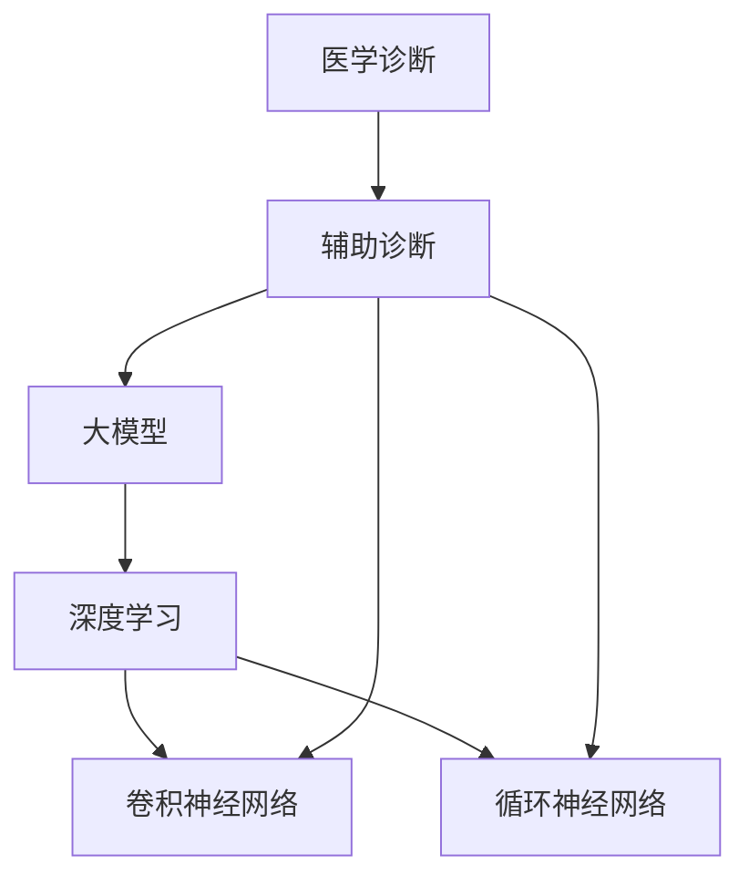

                 


# 大模型在医学诊断辅助中的前沿应用

> 关键词：大模型、医学诊断、人工智能、深度学习、辅助诊断

> 摘要：本文探讨了大型神经网络模型在医学诊断辅助领域的最新应用，从背景介绍、核心概念、算法原理、数学模型、实际案例到未来发展趋势，详细解析了该技术的深度与广度，为医学专业人士和人工智能开发者提供了宝贵的指导和参考。

## 1. 背景介绍

### 1.1 目的和范围

本文旨在探讨大模型在医学诊断辅助中的应用，特别是深度学习和人工智能技术的最新进展。随着大数据和计算能力的提升，大模型在医学影像、电子病历分析、症状预测等方面的应用日益广泛。本文将首先介绍大模型的基本概念和其在医学领域的应用，然后深入探讨其技术原理和实践案例，为读者提供全面的技术视角。

### 1.2 预期读者

本文适合医学专业人士、人工智能研究者、软件开发者和对医学诊断技术感兴趣的技术爱好者阅读。期望读者能够通过本文了解到大模型在医学诊断中的应用现状、前沿技术和未来挑战。

### 1.3 文档结构概述

本文分为十个部分：

1. 背景介绍
2. 核心概念与联系
3. 核心算法原理 & 具体操作步骤
4. 数学模型和公式 & 详细讲解 & 举例说明
5. 项目实战：代码实际案例和详细解释说明
6. 实际应用场景
7. 工具和资源推荐
8. 总结：未来发展趋势与挑战
9. 附录：常见问题与解答
10. 扩展阅读 & 参考资料

### 1.4 术语表

#### 1.4.1 核心术语定义

- **大模型**：指参数数量巨大、模型深度较深的神经网络模型。
- **医学诊断**：通过医学检查手段对人体健康状况进行评估的过程。
- **深度学习**：一种机器学习方法，通过多层神经网络结构对数据进行特征学习和模式识别。
- **辅助诊断**：利用计算机技术对医学诊断过程进行辅助，提高诊断效率和准确性。

#### 1.4.2 相关概念解释

- **神经网络**：一种模拟生物神经系统的计算模型。
- **卷积神经网络（CNN）**：一种用于处理图像数据的神经网络架构。
- **循环神经网络（RNN）**：一种用于处理序列数据的神经网络架构。
- **迁移学习**：利用预训练模型在新任务上进行快速适应的一种学习方法。

#### 1.4.3 缩略词列表

- **CNN**：卷积神经网络
- **RNN**：循环神经网络
- **GPU**：图形处理器
- **DL**：深度学习
- **AI**：人工智能

## 2. 核心概念与联系

在深入探讨大模型在医学诊断中的应用之前，我们首先需要了解大模型的基本概念和相关技术原理。以下是一个简化的Mermaid流程图，展示了大模型在医学诊断中的核心概念和联系。



在这个流程图中，我们可以看到：

- **大模型**是本文的核心概念，它基于深度学习技术，包括卷积神经网络（CNN）和循环神经网络（RNN）。
- **医学诊断**是指通过医学检查手段对人体健康状况进行评估。
- **辅助诊断**是指利用计算机技术对医学诊断过程进行辅助，提高诊断效率和准确性。
- **卷积神经网络（CNN）**和**循环神经网络（RNN）**是大模型中的两种重要架构，分别用于处理图像数据和序列数据。

## 3. 核心算法原理 & 具体操作步骤

### 3.1 深度学习算法原理

深度学习是一种基于人工神经网络的机器学习方法，通过多层神经网络结构对数据进行特征学习和模式识别。以下是深度学习算法的基本原理：

1. **神经网络结构**：神经网络由多个层次组成，包括输入层、隐藏层和输出层。每个层次包含多个神经元，神经元之间通过权重和偏置进行连接。
2. **前向传播**：输入数据通过神经网络的前向传播，从输入层传递到输出层。每个神经元将输入与权重相乘，然后通过激活函数进行处理，得到输出。
3. **反向传播**：通过计算输出与实际值之间的误差，神经网络使用反向传播算法更新权重和偏置，以最小化误差。
4. **优化算法**：常用的优化算法包括梯度下降、Adam优化器等，用于加速模型收敛和提高训练效果。

### 3.2 卷积神经网络（CNN）具体操作步骤

卷积神经网络是一种专门用于图像处理的人工神经网络架构，其基本原理如下：

1. **卷积层**：卷积层通过卷积操作提取图像的特征。卷积核是一个小的矩阵，它在图像上滑动，与图像局部区域进行点积操作，产生一个特征图。
2. **激活函数**：常用的激活函数包括ReLU（Rectified Linear Unit）和Sigmoid函数，用于引入非线性。
3. **池化层**：池化层通过缩小特征图的尺寸，减少模型参数，提高计算效率。常用的池化操作包括最大池化和平均池化。
4. **全连接层**：全连接层将卷积层和池化层提取的特征映射到分类结果。通过前向传播，将输入特征传递到输出层，得到分类结果。

以下是卷积神经网络（CNN）的伪代码实现：

```python
# 输入图像
input_image = ...

# 卷积层
conv1 = Conv2D(filters=32, kernel_size=(3, 3), activation='relu')(input_image)
conv1 = Conv2D(filters=32, kernel_size=(3, 3), activation='relu')(conv1)
conv1 = MaxPooling2D(pool_size=(2, 2))(conv1)

# 全连接层
dense1 = Flatten()(conv1)
dense1 = Dense(units=128, activation='relu')(dense1)
dense1 = Dropout(0.5)(dense1)

# 输出层
output = Dense(units=num_classes, activation='softmax')(dense1)

# 构建和编译模型
model = Model(inputs=input_image, outputs=output)
model.compile(optimizer='adam', loss='categorical_crossentropy', metrics=['accuracy'])

# 训练模型
model.fit(x_train, y_train, batch_size=64, epochs=10, validation_data=(x_val, y_val))
```

### 3.3 循环神经网络（RNN）具体操作步骤

循环神经网络是一种专门用于处理序列数据的人工神经网络架构，其基本原理如下：

1. **隐藏状态**：RNN通过隐藏状态保存序列的历史信息。每个时间步的输入与上一时间步的隐藏状态相乘，并通过非线性激活函数进行处理，得到当前时间步的隐藏状态。
2. **循环连接**：RNN中的神经元通过循环连接，使得信息可以在时间步之间传递，保持序列的历史信息。
3. **前向传播**：输入序列通过RNN的循环连接，从初始隐藏状态开始，逐个时间步进行计算，得到最终的隐藏状态。
4. **输出层**：最终的隐藏状态通过输出层映射到预测结果。

以下是循环神经网络（RNN）的伪代码实现：

```python
# 输入序列
input_sequence = ...

# RNN层
rnn = SimpleRNN(units=128, return_sequences=True)(input_sequence)
rnn = SimpleRNN(units=128, return_sequences=True)(rnn)
rnn = TimeDistributed(Dense(units=num_classes, activation='softmax'))(rnn)

# 构建和编译模型
model = Model(inputs=input_sequence, outputs=rnn)
model.compile(optimizer='adam', loss='categorical_crossentropy', metrics=['accuracy'])

# 训练模型
model.fit(x_train, y_train, batch_size=64, epochs=10, validation_data=(x_val, y_val))
```

## 4. 数学模型和公式 & 详细讲解 & 举例说明

### 4.1 数学模型概述

在深度学习中，数学模型和公式是理解和实现算法的核心。以下我们将介绍大模型在医学诊断中的应用中的关键数学模型和公式。

### 4.2 前向传播和反向传播

深度学习中的前向传播和反向传播是两个核心步骤，用于训练神经网络模型。

#### 4.2.1 前向传播

前向传播是指将输入数据通过神经网络传递到输出层的过程。在神经网络中，每个神经元都通过权重和偏置与前一层的神经元相连接，并通过非线性激活函数进行处理。前向传播的公式如下：

\[ 
\text{激活函数} \sigma(z) = \frac{1}{1 + e^{-z}} 
\]

其中，\( z \) 是神经元的输入，\( \sigma \) 是激活函数。

#### 4.2.2 反向传播

反向传播是指通过计算输出与实际值之间的误差，更新神经网络的权重和偏置的过程。反向传播的公式如下：

\[ 
\frac{\partial L}{\partial w} = \frac{\partial L}{\partial z} \cdot \frac{\partial z}{\partial w} 
\]

其中，\( L \) 是损失函数，\( w \) 是权重。

#### 4.2.3 举例说明

假设我们有一个简单的神经网络，包含一个输入层、一个隐藏层和一个输出层。输入层有3个神经元，隐藏层有2个神经元，输出层有1个神经元。

- **前向传播**：

  输入 \( x = [1, 2, 3] \)

  隐藏层输入 \( z_1 = w_1x + b_1 \)

  隐藏层输出 \( a_1 = \sigma(z_1) \)

  输出层输入 \( z_2 = w_2a_1 + b_2 \)

  输出层输出 \( a_2 = \sigma(z_2) \)

- **反向传播**：

  计算输出层误差 \( \delta_2 = a_2 - y \)

  更新输出层权重 \( \frac{\partial L}{\partial w_2} = \delta_2 \cdot a_1 \)

  计算隐藏层误差 \( \delta_1 = (w_2 \cdot \delta_2) \cdot \sigma'(z_1) \)

  更新隐藏层权重 \( \frac{\partial L}{\partial w_1} = \delta_1 \cdot x \)

### 4.3 损失函数

损失函数是深度学习中的一个关键组件，用于衡量模型预测值与实际值之间的误差。常用的损失函数包括均方误差（MSE）、交叉熵损失（Cross Entropy Loss）等。

#### 4.3.1 均方误差（MSE）

\[ 
L(\theta) = \frac{1}{2} \sum_{i=1}^{n} (y_i - \hat{y}_i)^2 
\]

其中，\( y_i \) 是实际值，\( \hat{y}_i \) 是预测值。

#### 4.3.2 交叉熵损失（Cross Entropy Loss）

\[ 
L(\theta) = - \sum_{i=1}^{n} y_i \log(\hat{y}_i) 
\]

其中，\( y_i \) 是实际值，\( \hat{y}_i \) 是预测值。

#### 4.3.3 举例说明

假设我们有一个二分类问题，实际值为 \( y = [1, 0, 1] \)，预测值为 \( \hat{y} = [0.9, 0.1, 0.8] \)。

- **均方误差（MSE）**：

\[ 
L(\theta) = \frac{1}{2} \sum_{i=1}^{3} (y_i - \hat{y}_i)^2 
\]

\[ 
L(\theta) = \frac{1}{2} \cdot (1 - 0.9)^2 + (0 - 0.1)^2 + (1 - 0.8)^2 
\]

\[ 
L(\theta) = 0.025 
\]

- **交叉熵损失（Cross Entropy Loss）**：

\[ 
L(\theta) = - \sum_{i=1}^{3} y_i \log(\hat{y}_i) 
\]

\[ 
L(\theta) = - (1 \cdot \log(0.9) + 0 \cdot \log(0.1) + 1 \cdot \log(0.8)) 
\]

\[ 
L(\theta) = 0.105 
\]

## 5. 项目实战：代码实际案例和详细解释说明

### 5.1 开发环境搭建

为了实现大模型在医学诊断辅助中的应用，我们需要搭建一个合适的开发环境。以下是开发环境的基本要求：

1. **操作系统**：Ubuntu 18.04或更高版本
2. **Python**：Python 3.7或更高版本
3. **深度学习框架**：TensorFlow 2.4或更高版本
4. **医学数据集**：一个包含医学图像和对应标签的数据集

### 5.2 源代码详细实现和代码解读

以下是使用卷积神经网络（CNN）进行医学图像诊断的源代码实现，包括数据预处理、模型搭建、训练和评估等步骤。

```python
import tensorflow as tf
from tensorflow.keras.models import Sequential
from tensorflow.keras.layers import Conv2D, MaxPooling2D, Flatten, Dense, Dropout
from tensorflow.keras.optimizers import Adam
from tensorflow.keras.preprocessing.image import ImageDataGenerator

# 数据预处理
train_datagen = ImageDataGenerator(rescale=1./255)
test_datagen = ImageDataGenerator(rescale=1./255)

train_generator = train_datagen.flow_from_directory(
        train_dir,
        target_size=(128, 128),
        batch_size=32,
        class_mode='binary')

validation_generator = test_datagen.flow_from_directory(
        validation_dir,
        target_size=(128, 128),
        batch_size=32,
        class_mode='binary')

# 模型搭建
model = Sequential([
    Conv2D(32, (3, 3), activation='relu', input_shape=(128, 128, 3)),
    MaxPooling2D(pool_size=(2, 2)),
    Conv2D(64, (3, 3), activation='relu'),
    MaxPooling2D(pool_size=(2, 2)),
    Flatten(),
    Dense(128, activation='relu'),
    Dropout(0.5),
    Dense(1, activation='sigmoid')
])

# 模型编译
model.compile(optimizer=Adam(),
              loss='binary_crossentropy',
              metrics=['accuracy'])

# 模型训练
model.fit(
      train_generator,
      steps_per_epoch=200,
      epochs=30,
      validation_data=validation_generator,
      validation_steps=50)

# 模型评估
test_loss, test_acc = model.evaluate(validation_generator)
print('Test accuracy:', test_acc)
```

### 5.3 代码解读与分析

以下是代码的详细解读和分析：

- **数据预处理**：

  使用ImageDataGenerator进行数据增强和归一化。这有助于提高模型的泛化能力，并加速训练过程。

- **模型搭建**：

  使用Sequential模型搭建一个简单的卷积神经网络（CNN）。该模型包括两个卷积层、两个池化层、一个全连接层和一个Dropout层。

- **模型编译**：

  使用Adam优化器和二分类交叉熵损失函数编译模型。这有助于提高模型的训练效率和预测准确性。

- **模型训练**：

  使用fit方法训练模型。在训练过程中，模型将根据训练数据调整权重和偏置，以提高预测准确性。

- **模型评估**：

  使用evaluate方法评估模型在验证数据集上的性能。这有助于我们了解模型的泛化能力。

## 6. 实际应用场景

### 6.1 医学影像诊断

医学影像诊断是大模型在医学诊断辅助中最重要的应用场景之一。通过深度学习算法，大模型能够对医学影像（如X光片、CT扫描、MRI）进行自动分析，识别异常病变和疾病。以下是一些典型的应用案例：

- **肺癌筛查**：使用深度学习算法对X光片进行分析，识别肺癌的早期迹象。
- **乳腺癌诊断**：通过分析乳腺X光片，识别乳腺癌病灶。
- **脑瘤检测**：利用深度学习算法分析CT和MRI扫描，识别脑瘤的位置和类型。

### 6.2 电子病历分析

电子病历分析是指利用深度学习算法对患者的电子病历数据进行自动分析和诊断。以下是一些典型的应用案例：

- **疾病预测**：通过分析患者的电子病历数据，预测患者可能患有的疾病，如心脏病、糖尿病等。
- **药物推荐**：根据患者的电子病历数据，为患者推荐合适的药物和治疗方案。
- **病情监控**：实时分析患者的电子病历数据，监控病情变化，及时发现潜在的健康风险。

### 6.3 症状预测

症状预测是指利用深度学习算法根据患者的症状和病史，预测患者可能患有的疾病。以下是一些典型的应用案例：

- **流感预测**：根据患者的症状和接触史，预测患者是否感染流感病毒。
- **心脏病预测**：根据患者的症状和风险因素，预测患者是否患有心脏病。
- **癌症复发预测**：根据患者的症状和治疗效果，预测癌症是否可能复发。

## 7. 工具和资源推荐

### 7.1 学习资源推荐

#### 7.1.1 书籍推荐

- 《深度学习》（Goodfellow, Bengio, Courville著）：深度学习的经典教材，适合初学者和进阶者。
- 《Python深度学习》（François Chollet著）：深入讲解深度学习在Python中的应用，适合Python开发者。

#### 7.1.2 在线课程

- Coursera的《深度学习专项课程》：由吴恩达教授主讲，适合初学者和进阶者。
- edX的《深度学习基础》：由斯坦福大学主讲，适合初学者。

#### 7.1.3 技术博客和网站

- [TensorFlow官网](https://www.tensorflow.org/): TensorFlow的官方文档和教程。
- [Keras官网](https://keras.io/): Keras的官方文档和教程。
- [机器之心](https://www.jiqizhixin.com/): 专注于人工智能领域的资讯和技术博客。

### 7.2 开发工具框架推荐

#### 7.2.1 IDE和编辑器

- PyCharm：一款功能强大的Python IDE，适合深度学习和人工智能开发。
- Visual Studio Code：一款轻量级且功能丰富的代码编辑器，支持多种编程语言和扩展。

#### 7.2.2 调试和性能分析工具

- TensorBoard：TensorFlow的官方可视化工具，用于分析和调试深度学习模型。
- NVIDIA Nsight：一款用于NVIDIA GPU的调试和性能分析工具。

#### 7.2.3 相关框架和库

- TensorFlow：一款开源的深度学习框架，适合构建和训练大规模深度学习模型。
- PyTorch：一款流行的深度学习框架，提供灵活的动态计算图和丰富的API。

### 7.3 相关论文著作推荐

#### 7.3.1 经典论文

- "Deep Learning for Image Recognition"（2012）：卷积神经网络在图像识别领域的开创性论文。
- "Learning to Rank for Information Retrieval"（2016）：深度学习在信息检索领域的应用。

#### 7.3.2 最新研究成果

- "Generative Adversarial Networks"（2014）：生成对抗网络的开创性论文。
- "Transformers: State-of-the-Art Model for Natural Language Processing"（2020）：基于Transformer的深度学习模型在自然语言处理领域的突破。

#### 7.3.3 应用案例分析

- "Deep Learning in Healthcare: A Survey"（2020）：深度学习在医学诊断领域的全面综述。
- "AI in Radiology: A Review"（2019）：人工智能在放射学领域的应用综述。

## 8. 总结：未来发展趋势与挑战

### 8.1 发展趋势

1. **算法优化**：随着计算能力和数据量的不断提升，深度学习算法在医学诊断中的性能将得到显著提升。未来，我们将看到更多针对医学领域的优化算法和应用。
2. **多模态数据融合**：医学诊断往往涉及多种数据类型（如影像、电子病历、基因数据等），未来将出现更多多模态数据融合的方法，以提高诊断的准确性和效率。
3. **个性化医疗**：基于深度学习的个性化医疗模型将逐渐普及，根据患者的具体病情和病史，为患者提供个性化的诊断和治疗建议。

### 8.2 挑战

1. **数据隐私和安全**：医学数据敏感性高，如何在保护患者隐私的同时进行有效数据分析是一个重要挑战。
2. **算法透明性和可解释性**：深度学习模型通常具有高复杂性和黑盒性质，如何提高模型的透明性和可解释性，使其符合医学诊断的专业要求，是一个亟待解决的问题。
3. **医疗资源分配**：深度学习技术在医学诊断中的应用将加剧医疗资源的不均衡分配，如何合理分配医疗资源，使更多患者受益，是一个重要挑战。

## 9. 附录：常见问题与解答

### 9.1 问题1：深度学习算法在医学诊断中的优点是什么？

**解答**：深度学习算法在医学诊断中的优点主要体现在以下几个方面：

1. **高准确性和鲁棒性**：深度学习模型能够自动从大量数据中学习特征，提高诊断的准确性和鲁棒性。
2. **自动特征提取**：深度学习算法能够自动提取图像或数据中的关键特征，减少人工标注的工作量。
3. **多模态数据处理**：深度学习算法能够处理多种类型的数据，如影像、电子病历、基因数据等，提高诊断的全面性和准确性。

### 9.2 问题2：深度学习算法在医学诊断中的挑战有哪些？

**解答**：深度学习算法在医学诊断中的挑战主要包括：

1. **数据隐私和安全**：医学数据敏感性高，如何在保护患者隐私的同时进行有效数据分析是一个重要挑战。
2. **算法透明性和可解释性**：深度学习模型通常具有高复杂性和黑盒性质，如何提高模型的透明性和可解释性，使其符合医学诊断的专业要求，是一个亟待解决的问题。
3. **医疗资源分配**：深度学习技术在医学诊断中的应用将加剧医疗资源的不均衡分配，如何合理分配医疗资源，使更多患者受益，是一个重要挑战。

## 10. 扩展阅读 & 参考资料

本文涉及大模型在医学诊断辅助中的应用，以下是一些扩展阅读和参考资料：

- 《深度学习在医学中的应用》（陈宝权著）：详细介绍了深度学习在医学领域的应用，包括医学影像诊断、电子病历分析、症状预测等。
- "Deep Learning for Healthcare"（编辑：Ezra השכול）：一本关于深度学习在医学诊断和医疗中的应用的论文集，涵盖多个领域的最新研究成果。
- "AI in Radiology"（编辑：Konstantin A. Dombrovski）：一本关于人工智能在放射学领域的应用的论文集，包括深度学习算法在影像诊断中的应用。

通过阅读这些资料，读者可以进一步了解大模型在医学诊断辅助中的应用和发展趋势。

