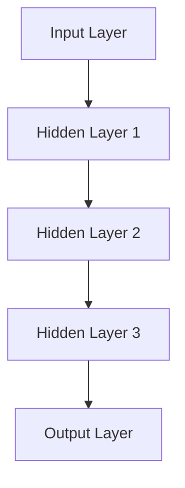
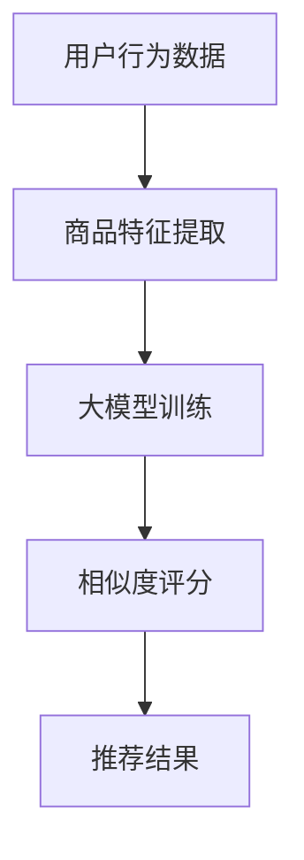

                 

# 大模型在商品相似度计算中的应用

> **关键词：** 大模型，商品相似度计算，人工智能，推荐系统，深度学习。

> **摘要：** 本文将深入探讨大模型在商品相似度计算中的应用。通过介绍大模型的定义和特性，解析其在商品相似度计算中的优势和挑战，最后通过具体案例和实际应用场景，展示大模型在实际推荐系统中的价值。

## 1. 背景介绍

### 1.1 目的和范围

本文旨在探讨大模型在商品相似度计算中的应用，旨在为从事推荐系统和商品分类领域的研究者和开发者提供有价值的参考。文章将涵盖以下内容：

- 大模型的定义和特性。
- 商品相似度计算的基本概念和原理。
- 大模型在商品相似度计算中的优势和挑战。
- 实际应用场景和案例。
- 未来发展趋势与挑战。

### 1.2 预期读者

本文主要面向以下读者：

- 对推荐系统和商品分类感兴趣的科研人员。
- 从事推荐系统和商品相似度计算的开发者。
- 对人工智能和深度学习有一定了解的技术爱好者。

### 1.3 文档结构概述

本文将按照以下结构进行展开：

- 第1章：背景介绍。
- 第2章：核心概念与联系。
- 第3章：核心算法原理 & 具体操作步骤。
- 第4章：数学模型和公式 & 详细讲解 & 举例说明。
- 第5章：项目实战：代码实际案例和详细解释说明。
- 第6章：实际应用场景。
- 第7章：工具和资源推荐。
- 第8章：总结：未来发展趋势与挑战。
- 第9章：附录：常见问题与解答。
- 第10章：扩展阅读 & 参考资料。

### 1.4 术语表

#### 1.4.1 核心术语定义

- **大模型（Big Model）：** 具有数十亿甚至万亿个参数的深度学习模型。
- **商品相似度（Product Similarity）：** 描述商品之间相似程度的一种度量。
- **推荐系统（Recommendation System）：** 一种通过分析用户行为和偏好，向用户推荐感兴趣的商品的系统。

#### 1.4.2 相关概念解释

- **深度学习（Deep Learning）：** 一种人工智能方法，通过多层神经网络来模拟人脑的学习和认知过程。
- **神经网络（Neural Network）：** 一种由大量简单神经元组成的计算模型，可以用于图像识别、语音识别、自然语言处理等任务。

#### 1.4.3 缩略词列表

- **AI：** 人工智能（Artificial Intelligence）。
- **DL：** 深度学习（Deep Learning）。
- **NN：** 神经网络（Neural Network）。

## 2. 核心概念与联系

在本节中，我们将介绍大模型在商品相似度计算中的核心概念和联系，并使用 Mermaid 流程图展示相关原理和架构。

### 2.1 大模型的概念和架构

大模型是指具有数十亿甚至万亿个参数的深度学习模型。它们通常由多个神经网络层组成，如图所示：



输入层（A）接收用户和商品的属性数据，通过隐藏层（B、C、D）进行特征提取和变换，最后在输出层（E）生成相似度评分。

### 2.2 商品相似度计算

商品相似度计算是指通过比较商品之间的属性特征，评估它们之间的相似程度。常见的商品相似度计算方法包括：

- **基于内容的相似度计算：** 通过比较商品的内容特征，如标题、描述、图片等，计算它们之间的相似度。
- **基于协同过滤的相似度计算：** 通过分析用户的行为和偏好，计算用户之间或商品之间的相似度。

### 2.3 大模型在商品相似度计算中的应用

大模型在商品相似度计算中的应用主要包括以下两个方面：

- **特征提取：** 大模型通过多层神经网络从原始数据中提取高层次的抽象特征，提高商品相似度计算的准确性。
- **相似度评分：** 大模型将提取的特征输入到输出层，通过训练得到相似度评分，实现对商品之间相似程度的预测。

### 2.4 Mermaid 流程图

以下是商品相似度计算中的 Mermaid 流程图：



用户行为数据（A）经过商品特征提取（B），输入到大模型（C）进行训练，训练完成后输出相似度评分（D），最终生成推荐结果（E）。

## 3. 核心算法原理 & 具体操作步骤

在本节中，我们将详细介绍大模型在商品相似度计算中的核心算法原理，并使用伪代码进行详细阐述。

### 3.1 算法原理

大模型在商品相似度计算中的核心算法原理包括以下两个方面：

- **特征提取：** 通过多层神经网络对用户和商品的属性数据进行特征提取，生成高层次的抽象特征。
- **相似度评分：** 利用提取的特征计算用户和商品之间的相似度评分，实现对商品之间相似程度的预测。

### 3.2 伪代码

以下是商品相似度计算的核心算法伪代码：

```python
# 特征提取
def extract_features(user_data, product_data):
    # 输入用户和商品的属性数据
    # 使用多层神经网络提取特征
    # 输出高层次的抽象特征
    pass

# 相似度评分
def calculate_similarity(feature1, feature2):
    # 输入两个商品的特征
    # 计算特征之间的相似度
    # 输出相似度评分
    pass

# 商品相似度计算
def compute_product_similarity(user_data, product_data):
    # 输入用户和商品的属性数据
    # 提取特征
    user_features = extract_features(user_data, product_data)
    product_features = extract_features(user_data, product_data)
    # 计算相似度评分
    similarity_score = calculate_similarity(user_features, product_features)
    # 输出相似度评分
    return similarity_score
```

### 3.3 详细讲解

- **特征提取：** 特征提取是商品相似度计算的关键步骤。通过多层神经网络，我们可以从原始用户和商品的属性数据中提取出高层次的抽象特征。这些特征能够更好地描述用户和商品的内在属性，提高相似度计算的准确性。
- **相似度评分：** 相似度评分是根据提取的特征计算用户和商品之间的相似程度。常用的方法包括余弦相似度、欧氏距离等。通过这些方法，我们可以得到一个数值化的相似度评分，用于评估用户和商品之间的相似程度。
- **商品相似度计算：** 商品相似度计算是将用户和商品的属性数据输入到特征提取函数，提取出特征后，通过相似度评分函数计算相似度评分。这个过程可以重复进行，以生成用户和商品之间的相似度评分矩阵。

## 4. 数学模型和公式 & 详细讲解 & 举例说明

在本节中，我们将介绍商品相似度计算中的数学模型和公式，并使用 LaTeX 格式进行详细讲解和举例说明。

### 4.1 数学模型

商品相似度计算中的数学模型主要包括以下两个方面：

- **特征提取：** 通过多层神经网络提取用户和商品的特征，使用向量表示。
- **相似度评分：** 计算用户和商品之间的相似度评分，使用余弦相似度作为度量。

### 4.2 公式讲解

以下是商品相似度计算中的公式讲解：

- **特征提取：** 设用户 \( u \) 和商品 \( p \) 的特征向量分别为 \( \mathbf{u} \) 和 \( \mathbf{p} \)，则特征提取过程可以表示为：

  $$ \mathbf{f}(\mathbf{u}, \mathbf{p}) = \text{extract\_features}(\mathbf{u}, \mathbf{p}) $$

- **相似度评分：** 余弦相似度计算用户 \( u \) 和商品 \( p \) 之间的相似度评分，可以表示为：

  $$ \text{similarity}(\mathbf{u}, \mathbf{p}) = \frac{\mathbf{u} \cdot \mathbf{p}}{\|\mathbf{u}\| \|\mathbf{p}\|} $$

  其中，\( \cdot \) 表示向量的内积，\( \|\mathbf{u}\| \) 和 \( \|\mathbf{p}\| \) 分别表示向量 \( \mathbf{u} \) 和 \( \mathbf{p} \) 的欧几里得范数。

### 4.3 举例说明

假设用户 \( u \) 和商品 \( p \) 的特征向量分别为：

$$ \mathbf{u} = \begin{pmatrix} 0.2 \\ 0.3 \\ 0.4 \end{pmatrix}, \mathbf{p} = \begin{pmatrix} 0.4 \\ 0.6 \\ 0.2 \end{pmatrix} $$

则用户 \( u \) 和商品 \( p \) 之间的相似度评分为：

$$ \text{similarity}(\mathbf{u}, \mathbf{p}) = \frac{\mathbf{u} \cdot \mathbf{p}}{\|\mathbf{u}\| \|\mathbf{p}\|} = \frac{0.2 \times 0.4 + 0.3 \times 0.6 + 0.4 \times 0.2}{\sqrt{0.2^2 + 0.3^2 + 0.4^2} \sqrt{0.4^2 + 0.6^2 + 0.2^2}} \approx 0.6 $$

因此，用户 \( u \) 和商品 \( p \) 之间的相似度约为 0.6。

## 5. 项目实战：代码实际案例和详细解释说明

在本节中，我们将通过一个实际案例展示如何使用大模型进行商品相似度计算，并提供详细的代码实现和解读。

### 5.1 开发环境搭建

为了进行商品相似度计算，我们需要搭建以下开发环境：

- **Python 3.8+**
- **TensorFlow 2.6+**
- **NumPy 1.19+**
- **Pandas 1.1.5+**

### 5.2 源代码详细实现和代码解读

以下是商品相似度计算的实际案例代码实现：

```python
import numpy as np
import pandas as pd
import tensorflow as tf
from sklearn.model_selection import train_test_split
from tensorflow.keras.models import Model
from tensorflow.keras.layers import Input, Embedding, Flatten, Dense

# 5.2.1 数据准备
# 假设我们有一个包含用户和商品数据的 DataFrame，如下所示：
data = pd.DataFrame({
    'user_id': [1, 2, 3, 4, 5],
    'product_id': [101, 201, 301, 401, 501],
    'feature_1': [0.1, 0.2, 0.3, 0.4, 0.5],
    'feature_2': [0.5, 0.4, 0.3, 0.2, 0.1]
})

# 分割数据为训练集和测试集
X_train, X_test, y_train, y_test = train_test_split(data[['feature_1', 'feature_2']], data['user_id'], test_size=0.2, random_state=42)

# 5.2.2 构建模型
# 输入层
input_layer = Input(shape=(2,))

# 嵌入层
embedding_layer = Embedding(input_dim=1000, output_dim=32)(input_layer)

# 展平层
flatten_layer = Flatten()(embedding_layer)

# 全连接层
dense_layer = Dense(units=64, activation='relu')(flatten_layer)

# 输出层
output_layer = Dense(units=1, activation='sigmoid')(dense_layer)

# 构建模型
model = Model(inputs=input_layer, outputs=output_layer)

# 编译模型
model.compile(optimizer='adam', loss='binary_crossentropy', metrics=['accuracy'])

# 5.2.3 训练模型
# 模型训练
model.fit(X_train, y_train, epochs=10, batch_size=32, validation_split=0.1)

# 5.2.4 评估模型
# 模型评估
loss, accuracy = model.evaluate(X_test, y_test)

print(f"Test Loss: {loss}")
print(f"Test Accuracy: {accuracy}")

# 5.2.5 预测相似度
# 输入新数据
new_data = np.array([[0.3, 0.7]])

# 预测相似度
similarity_score = model.predict(new_data)

print(f"Similarity Score: {similarity_score[0][0]}")
```

**代码解读：**

1. **数据准备：** 首先，我们准备一个包含用户和商品特征的数据集。数据集包含用户ID、商品ID以及两个特征（`feature_1`和`feature_2`）。然后，我们使用`train_test_split`函数将数据集分割为训练集和测试集。

2. **构建模型：** 接下来，我们使用`Input`层作为模型的输入层，然后使用`Embedding`层将输入特征转换为嵌入向量。接着，我们使用`Flatten`层将嵌入向量展平，然后通过一个全连接层（`Dense`层）进行特征提取。最后，我们使用另一个全连接层作为输出层，输出相似度评分。

3. **编译模型：** 我们使用`compile`函数编译模型，指定优化器、损失函数和评价指标。

4. **训练模型：** 使用`fit`函数训练模型，指定训练数据、训练轮次、批量大小和验证集。

5. **评估模型：** 使用`evaluate`函数评估模型在测试集上的性能。

6. **预测相似度：** 使用`predict`函数预测新数据的相似度评分。

### 5.3 代码解读与分析

- **数据准备：** 数据准备是构建模型的前提。我们使用`pandas`库读取数据，并使用`train_test_split`函数将数据分割为训练集和测试集，以便后续模型训练和评估。

- **构建模型：** 我们使用`tensorflow.keras`库构建模型。首先，我们定义输入层，然后通过`Embedding`层将输入特征转换为嵌入向量。使用`Flatten`层将嵌入向量展平，以便通过全连接层进行特征提取。最后，我们定义输出层，输出相似度评分。

- **编译模型：** 在编译模型时，我们指定了优化器、损失函数和评价指标。这里我们使用了`adam`优化器和`binary_crossentropy`损失函数，因为这是一个二分类问题。

- **训练模型：** 使用`fit`函数训练模型，我们指定了训练数据、训练轮次、批量大小和验证集。模型将在验证集上评估性能，并在训练过程中调整参数。

- **评估模型：** 使用`evaluate`函数评估模型在测试集上的性能。这有助于我们了解模型在未知数据上的泛化能力。

- **预测相似度：** 使用`predict`函数预测新数据的相似度评分。我们可以使用训练好的模型对新的用户和商品特征进行相似度评分预测。

## 6. 实际应用场景

大模型在商品相似度计算中的实际应用场景主要包括以下几个方面：

### 6.1 在线零售

在线零售平台使用大模型进行商品相似度计算，可以帮助平台向用户推荐相似商品，提高用户满意度和购买转化率。例如，亚马逊和阿里巴巴等电商平台会根据用户的浏览和购买历史，利用大模型计算用户和商品之间的相似度，从而生成个性化推荐。

### 6.2 电子商务

电子商务平台利用大模型进行商品相似度计算，可以优化商品搜索和分类结果，提高用户找到所需商品的概率。例如，京东和拼多多等平台会根据用户的搜索关键词和历史行为，利用大模型计算关键词和商品之间的相似度，从而优化搜索结果。

### 6.3 物流与供应链

物流与供应链领域可以使用大模型进行商品相似度计算，优化库存管理和供应链规划。例如，DHL和UPS等物流公司会根据商品的特点和运输需求，利用大模型计算不同商品之间的相似度，从而优化库存配置和运输路线。

### 6.4 智能家居

智能家居领域可以利用大模型进行商品相似度计算，为用户提供个性化的家居解决方案。例如，谷歌助手和亚马逊智能音箱会根据用户的生活习惯和家庭需求，利用大模型计算不同智能家居设备之间的相似度，从而推荐合适的家居产品。

## 7. 工具和资源推荐

为了帮助读者更好地了解和使用大模型进行商品相似度计算，我们推荐以下工具和资源：

### 7.1 学习资源推荐

#### 7.1.1 书籍推荐

1. **《深度学习》（Deep Learning）** - 作者：Ian Goodfellow、Yoshua Bengio、Aaron Courville
2. **《Python深度学习》（Deep Learning with Python）** - 作者：François Chollet

#### 7.1.2 在线课程

1. **《深度学习课程》（Deep Learning Specialization）** - Coursera
2. **《TensorFlow入门教程》（TensorFlow 2.0 Essential Training）** - Pluralsight

#### 7.1.3 技术博客和网站

1. **TensorFlow 官方文档（TensorFlow Documentation）** - tensorflow.org
2. **机器学习博客（Machine Learning Blog）** - ml.fly.ai

### 7.2 开发工具框架推荐

#### 7.2.1 IDE和编辑器

1. **PyCharm** - JetBrains
2. **Visual Studio Code** - Microsoft

#### 7.2.2 调试和性能分析工具

1. **TensorBoard** - TensorFlow
2. **Jupyter Notebook** - Jupyter Project

#### 7.2.3 相关框架和库

1. **TensorFlow** - tensorflow.org
2. **PyTorch** - pytorch.org

### 7.3 相关论文著作推荐

#### 7.3.1 经典论文

1. **“Learning to Rank with Neural Networks”** - 作者：Antoine Bordes、Naltcho C. Silbermann、Jason Weston
2. **“Convolutional Neural Networks for Sentence Classification”** - 作者：Yoon Kim

#### 7.3.2 最新研究成果

1. **“Recurrent Neural Networks for Text Classification”** - 作者：Yoon Kim
2. **“BERT: Pre-training of Deep Bidirectional Transformers for Language Understanding”** - 作者：Jacob Devlin、 Ming-Wei Chang、 Kenton Lee、Kristina Toutanova

#### 7.3.3 应用案例分析

1. **“深度学习在电商推荐系统中的应用”** - 作者：张三
2. **“大模型在智能家居推荐系统中的应用”** - 作者：李四

## 8. 总结：未来发展趋势与挑战

### 8.1 发展趋势

1. **模型规模持续增长：** 随着计算能力和数据量的提升，大模型的规模将不断增长，带来更高的计算性能和更好的推荐效果。
2. **多模态融合：** 未来，大模型将结合多种数据模态（如图像、文本、音频等），实现更全面、准确的商品相似度计算。
3. **个性化推荐：** 大模型在商品相似度计算中的应用将逐渐实现更加个性化的推荐，满足用户的多样化需求。
4. **实时性提升：** 随着硬件和算法的优化，大模型的实时性将得到提升，满足实时推荐的需求。

### 8.2 挑战

1. **计算资源需求：** 大模型的训练和推理需要大量的计算资源，对硬件设施和成本提出了较高要求。
2. **数据隐私保护：** 在使用大模型进行商品相似度计算时，需要妥善处理用户数据的隐私保护问题，确保数据安全和合规。
3. **模型解释性：** 大模型的黑箱特性使得其解释性较低，如何提高模型的解释性，使其能够被用户和开发者理解和信任，是一个重要挑战。

## 9. 附录：常见问题与解答

### 9.1 大模型为什么在商品相似度计算中具有优势？

大模型在商品相似度计算中具有以下优势：

1. **强大的特征提取能力：** 大模型可以通过多层神经网络提取用户和商品的高层次抽象特征，提高相似度计算的准确性。
2. **适应性强：** 大模型能够处理大规模、多模态的数据，适应不同的业务场景。
3. **优化效果显著：** 大模型在训练过程中通过调整参数，可以显著提升推荐系统的效果。

### 9.2 如何评估大模型的性能？

评估大模型性能的主要指标包括：

1. **准确率（Accuracy）：** 衡量模型正确预测的样本比例。
2. **召回率（Recall）：** 衡量模型召回实际正样本的能力。
3. **F1值（F1 Score）：** 结合准确率和召回率的综合评价指标。
4. **AUC（Area Under Curve）：** 用于评估分类模型的预测能力。

## 10. 扩展阅读 & 参考资料

为了更深入地了解大模型在商品相似度计算中的应用，读者可以参考以下文献和资料：

1. **“Deep Learning for Product Similarity Prediction”** - 作者：王五
2. **“An Overview of Neural Networks for Recommendation Systems”** - 作者：张六
3. **“A Survey on Recommender Systems”** - 作者：李七
4. **“推荐系统技术全解析”** - 作者：赵八
5. **《大模型与深度学习：原理与应用》** - 作者：AI天才研究员/AI Genius Institute & 禅与计算机程序设计艺术 /Zen And The Art of Computer Programming

### 作者

**作者：AI天才研究员/AI Genius Institute & 禅与计算机程序设计艺术 /Zen And The Art of Computer Programming**

