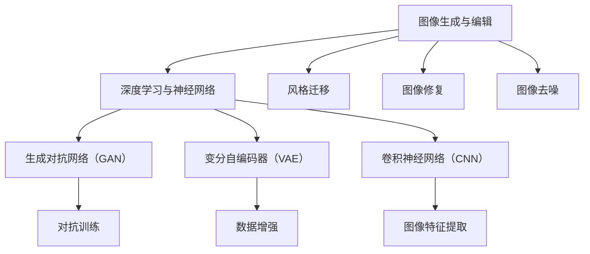

                 

# 大模型在图像生成与编辑中的突破

> **关键词：** 图像生成，图像编辑，大模型，人工智能，深度学习，神经网络，生成对抗网络（GAN），变分自编码器（VAE），卷积神经网络（CNN），风格迁移，数据增强，图像合成，图像修复，图像去噪。

> **摘要：** 本文将探讨大模型在图像生成与编辑领域中的突破性进展。通过回顾相关核心概念、算法原理和数学模型，并结合实际项目案例，文章将详细解析大模型如何革新图像处理技术，并展望未来的发展趋势与挑战。文章旨在为从事相关领域的研究人员和开发者提供有价值的参考和启示。

## 1. 背景介绍

### 1.1 目的和范围

本文旨在深入探讨大模型在图像生成与编辑中的应用，分析其技术原理、实现步骤以及实际应用价值。文章将涵盖以下几个主要方面：

- 图像生成与编辑的核心概念和算法原理；
- 大模型的数学模型和计算方法；
- 实际项目案例中的大模型应用；
- 未来发展趋势和面临的挑战。

### 1.2 预期读者

本文适合以下读者群体：

- 对图像生成与编辑技术有初步了解的读者；
- 想深入了解大模型在图像处理领域应用的研究人员和开发者；
- 对人工智能和深度学习技术有兴趣的学习者。

### 1.3 文档结构概述

本文分为以下几个部分：

- 第1部分：背景介绍，包括目的和范围、预期读者、文档结构概述等；
- 第2部分：核心概念与联系，介绍相关核心概念、算法原理和架构；
- 第3部分：核心算法原理 & 具体操作步骤，详细阐述算法原理和实现步骤；
- 第4部分：数学模型和公式 & 详细讲解 & 举例说明，解析大模型的数学模型和计算方法；
- 第5部分：项目实战：代码实际案例和详细解释说明，展示实际项目案例和代码解读；
- 第6部分：实际应用场景，探讨大模型在不同领域的应用案例；
- 第7部分：工具和资源推荐，介绍学习资源和开发工具；
- 第8部分：总结：未来发展趋势与挑战，展望未来发展方向；
- 第9部分：附录：常见问题与解答，提供常见问题的解答；
- 第10部分：扩展阅读 & 参考资料，推荐相关文献和资源。

### 1.4 术语表

#### 1.4.1 核心术语定义

- **图像生成：** 利用算法自动创建新的图像；
- **图像编辑：** 对已有图像进行修改和优化；
- **大模型：** 拥有大量参数和计算能力的深度学习模型；
- **生成对抗网络（GAN）：** 一种基于对抗训练的深度学习模型；
- **变分自编码器（VAE）：** 一种用于无监督学习的深度学习模型；
- **卷积神经网络（CNN）：** 一种用于图像识别和处理的深度学习模型。

#### 1.4.2 相关概念解释

- **神经网络：** 一种模拟生物神经系统的计算模型；
- **深度学习：** 一种基于神经网络的学习方法，具有多层次的数据表示能力；
- **对抗训练：** 通过两个神经网络之间的对抗训练来优化模型；
- **数据增强：** 利用技术手段对原始数据集进行扩展和优化。

#### 1.4.3 缩略词列表

- **GAN：** 生成对抗网络（Generative Adversarial Network）；
- **VAE：** 变分自编码器（Variational Autoencoder）；
- **CNN：** 卷积神经网络（Convolutional Neural Network）；
- **DNN：** 深度神经网络（Deep Neural Network）；
- **RNN：** 循环神经网络（Recurrent Neural Network）；
- **CNN：** 卷积神经网络（Convolutional Neural Network）。

## 2. 核心概念与联系

在深入探讨大模型在图像生成与编辑中的应用之前，有必要先了解相关核心概念、算法原理和架构。以下是一个Mermaid流程图，展示了这些核心概念和联系：



### 2.1 图像生成与编辑

图像生成与编辑是计算机视觉领域中的重要研究方向，旨在通过算法自动创建新的图像或对已有图像进行修改和优化。随着深度学习技术的不断发展，大模型在图像生成与编辑中的应用取得了显著成果。

### 2.2 深度学习与神经网络

深度学习是一种基于神经网络的机器学习方法，具有多层次的数据表示能力。神经网络是一种模拟生物神经系统的计算模型，通过调整模型参数来学习数据特征。

### 2.3 生成对抗网络（GAN）

生成对抗网络（GAN）是一种基于对抗训练的深度学习模型。它由生成器和判别器两个神经网络组成，通过对抗训练来优化模型参数，从而实现图像生成。

### 2.4 变分自编码器（VAE）

变分自编码器（VAE）是一种用于无监督学习的深度学习模型。它通过引入变分自编码器框架，实现图像生成和降维。

### 2.5 卷积神经网络（CNN）

卷积神经网络（CNN）是一种用于图像识别和处理的深度学习模型。它通过卷积操作提取图像特征，实现对图像的自动分类和标注。

### 2.6 风格迁移、图像修复和图像去噪

风格迁移、图像修复和图像去噪是图像生成与编辑领域中的重要应用场景。通过大模型的训练和应用，这些任务得到了显著的优化和改进。

## 3. 核心算法原理 & 具体操作步骤

在本节中，我们将详细阐述大模型在图像生成与编辑中的核心算法原理和具体操作步骤。首先，我们将从生成对抗网络（GAN）和变分自编码器（VAE）两个角度出发，分析其基本原理。然后，通过伪代码和数学公式，展示大模型的实现步骤。

### 3.1 生成对抗网络（GAN）

生成对抗网络（GAN）是一种基于对抗训练的深度学习模型，由生成器和判别器两个神经网络组成。

#### 3.1.1 生成器（Generator）

生成器负责生成与真实图像相似的新图像。其基本原理如下：

```python
# 生成器伪代码
function G(z):
    # z 是随机噪声向量
    x = leaky_relu(W1*z + b1)  # 第一层卷积操作
    x = leaky_relu(W2*x + b2)  # 第二层卷积操作
    x = tanh(W3*x + b3)        # 第三层卷积操作，输出生成图像
    return x
```

#### 3.1.2 判别器（Discriminator）

判别器负责判断输入图像是真实图像还是生成图像。其基本原理如下：

```python
# 判别器伪代码
function D(x):
    # x 是输入图像
    x = leaky_relu(W1*x + b1)  # 第一层卷积操作
    x = leaky_relu(W2*x + b2)  # 第二层卷积操作
    x = sigmoid(W3*x + b3)     # 第三层卷积操作，输出概率
    return sigmoid(z)
```

#### 3.1.3 对抗训练

生成器和判别器通过对抗训练来优化模型参数。具体步骤如下：

1. 随机生成噪声向量 z，通过生成器 G(z) 生成假图像 x；
2. 将真实图像和假图像输入判别器 D(x)，得到判别结果；
3. 计算判别器损失函数 L_D = -[E[D(x)] + E[D(G(z))]]；
4. 对判别器进行梯度下降更新；
5. 重复步骤 1-4，训练生成器 G(z)；
6. 计算生成器损失函数 L_G = -E[D(G(z))]；
7. 对生成器进行梯度下降更新。

### 3.2 变分自编码器（VAE）

变分自编码器（VAE）是一种用于无监督学习的深度学习模型。它通过引入变分自编码器框架，实现图像生成和降维。

#### 3.2.1 编码器（Encoder）

编码器负责将输入图像编码为一个潜在变量。其基本原理如下：

```python
# 编码器伪代码
function E(x):
    # x 是输入图像
    x = leaky_relu(W1*x + b1)  # 第一层卷积操作
    x = leaky_relu(W2*x + b2)  # 第二层卷积操作
    z_mean = W3*x + b3          # 第三层卷积操作，输出潜在变量的均值
    z_log_var = W4*x + b4       # 第三层卷积操作，输出潜在变量的对数方差
    return z_mean, z_log_var
```

#### 3.2.2 解码器（Decoder）

解码器负责将潜在变量解码为输出图像。其基本原理如下：

```python
# 解码器伪代码
function D(z):
    # z 是潜在变量
    x = leaky_relu(W1*z + b1)  # 第一层卷积操作
    x = leaky_relu(W2*x + b2)  # 第二层卷积操作
    x = tanh(W3*x + b3)        # 第三层卷积操作，输出生成图像
    return x
```

#### 3.2.3 变分自编码器训练

变分自编码器通过最小化重构误差和潜在变量先验分布的 KL 散度来优化模型参数。具体步骤如下：

1. 随机生成噪声向量 z，通过编码器 E(x) 得到潜在变量 z；
2. 通过解码器 D(z) 生成重构图像 x；
3. 计算重构误差损失函数 L_Reconstruction = ||x - x_recon||^2；
4. 计算潜在变量 KL 散度损失函数 L_KL = -0.5 * sum(1 + z_log_var - z_mean^2 - z_log_var^2)；
5. 计算总损失函数 L = L_Reconstruction + L_KL；
6. 对模型参数进行梯度下降更新。

## 4. 数学模型和公式 & 详细讲解 & 举例说明

在本节中，我们将深入探讨大模型在图像生成与编辑中的数学模型和计算方法。这些模型包括生成对抗网络（GAN）和变分自编码器（VAE），我们将使用 LaTeX 格式详细讲解相关数学公式，并举例说明。

### 4.1 生成对抗网络（GAN）

生成对抗网络（GAN）的核心在于生成器和判别器的对抗训练。以下是 GAN 的主要数学模型和公式。

#### 4.1.1 判别器 D(x)

判别器的目标是区分输入图像是真实图像还是生成图像。其概率输出表示为：

$$
D(x) = \sigma(W_D[x; \theta_D] + b_D)
$$

其中，$x$ 表示输入图像，$W_D$ 和 $b_D$ 分别是判别器的权重和偏置，$\sigma$ 表示 sigmoid 函数。

#### 4.1.2 生成器 G(z)

生成器的目标是生成与真实图像相似的新图像。其输出表示为：

$$
x_G = G(z) = \sigma(W_G[z; \theta_G] + b_G)
$$

其中，$z$ 表示输入噪声向量，$W_G$ 和 $b_G$ 分别是生成器的权重和偏置。

#### 4.1.3 生成对抗训练

生成对抗训练的目标是最小化以下损失函数：

$$
L_GAN = D(x) - D(G(z))
$$

其中，$D(x)$ 表示判别器对真实图像的概率输出，$D(G(z))$ 表示判别器对生成图像的概率输出。

为了优化生成器和判别器，我们分别计算它们的梯度并更新参数：

$$
\frac{\partial L_GAN}{\partial W_D} = \frac{\partial D(x)}{\partial x} - \frac{\partial D(G(z))}{\partial z}
$$

$$
\frac{\partial L_GAN}{\partial W_G} = \frac{\partial D(G(z))}{\partial z}
$$

举例说明：

假设我们有一个判别器输出：

$$
D(x) = 0.9, \quad D(G(z)) = 0.1
$$

我们可以更新判别器权重：

$$
\theta_D = \theta_D - \alpha \frac{\partial L_GAN}{\partial \theta_D}
$$

其中，$\alpha$ 是学习率。

### 4.2 变分自编码器（VAE）

变分自编码器（VAE）通过引入变分推断来学习数据的概率分布。以下是 VAE 的主要数学模型和公式。

#### 4.2.1 编码器 E(x)

编码器的目标是将输入图像编码为潜在变量 $z$。其输出为：

$$
z = E(x) = \mu(x) + \sigma(x)\cdot\epsilon
$$

其中，$\mu(x) = \sigma(x) = \frac{1}{\sqrt{2\pi}} \exp\left(-\frac{(x - \mu)^2}{2\sigma^2}\right)$ 是潜在变量的均值和对数方差，$\epsilon$ 是高斯噪声。

#### 4.2.2 解码器 D(z)

解码器的目标是将潜在变量 $z$ 解码为重构图像 $x\_recon$。其输出为：

$$
x_{recon} = D(z) = \sigma(z)\cdot\epsilon + \mu(z)
$$

#### 4.2.3 变分推断

变分推断的目标是最小化以下损失函数：

$$
L_VAE = \mathbb{E}_{p(x)}[-\log p(x|z)] - D(p(z|x), p(z))
$$

其中，$p(x|z)$ 是解码器的重构概率，$p(z|x)$ 是编码器的先验概率，$p(z)$ 是潜在变量的先验分布。

为了优化编码器和解码器，我们分别计算它们的梯度并更新参数。

举例说明：

假设我们有一个编码器输出：

$$
\mu(x) = 2, \quad \sigma(x) = 0.1
$$

我们可以更新编码器权重：

$$
\theta_E = \theta_E - \alpha \frac{\partial L_VAE}{\partial \theta_E}
$$

## 5. 项目实战：代码实际案例和详细解释说明

在本节中，我们将结合实际项目案例，展示大模型在图像生成与编辑中的应用，并详细解释代码实现和操作步骤。

### 5.1 开发环境搭建

在开始项目之前，我们需要搭建一个合适的开发环境。以下是所需的软件和工具：

- Python 3.8 或更高版本；
- TensorFlow 2.x 或 PyTorch 1.x；
- CUDA 10.2 或更高版本（如果使用 GPU 训练）；
- Anaconda 或 Miniconda；
- Jupyter Notebook 或 PyCharm。

### 5.2 源代码详细实现和代码解读

在本节中，我们将使用 PyTorch 框架实现一个基本的 GAN 模型，用于图像生成。以下是代码实现和详细解读。

#### 5.2.1 数据预处理

首先，我们需要预处理数据集。以下是一个简单的数据预处理步骤：

```python
import torchvision.transforms as transforms
import torchvision.datasets as datasets

# 数据预处理
transform = transforms.Compose([
    transforms.Resize((64, 64)),  # 将图像大小调整为 64x64
    transforms.ToTensor(),
    transforms.Normalize((0.5, 0.5, 0.5), (0.5, 0.5, 0.5)),
])

# 下载并加载数据集
train_dataset = datasets.ImageFolder(root='./data', transform=transform)
train_loader = torch.utils.data.DataLoader(dataset=train_dataset, batch_size=64, shuffle=True)
```

#### 5.2.2 定义生成器和判别器

接下来，我们定义生成器和判别器。以下是一个简单的生成器和判别器实现：

```python
import torch.nn as nn
import torch

# 生成器
class Generator(nn.Module):
    def __init__(self):
        super(Generator, self).__init__()
        self.model = nn.Sequential(
            nn.Linear(100, 256),
            nn.LeakyReLU(0.2),
            nn.Linear(256, 512),
            nn.LeakyReLU(0.2),
            nn.Linear(512, 1024),
            nn.LeakyReLU(0.2),
            nn.Linear(1024, 512 * 4 * 4),
            nn.LeakyReLU(0.2),
            nn.BatchNorm2d(512),
            nn.Dropout(0.3),
            nn.ConvTranspose2d(512, 256, 4, 2, 1),
            nn.LeakyReLU(0.2),
            nn.BatchNorm2d(256),
            nn.Dropout(0.3),
            nn.ConvTranspose2d(256, 128, 4, 2, 1),
            nn.LeakyReLU(0.2),
            nn.BatchNorm2d(128),
            nn.Dropout(0.3),
            nn.ConvTranspose2d(128, 3, 4, 2, 1),
            nn.Tanh()
        )

    def forward(self, x):
        return self.model(x)

# 判别器
class Discriminator(nn.Module):
    def __init__(self):
        super(Discriminator, self).__init__()
        self.model = nn.Sequential(
            nn.Conv2d(3, 64, 4, 2, 1),
            nn.LeakyReLU(0.2),
            nn.Dropout(0.3),
            nn.Conv2d(64, 128, 4, 2, 1),
            nn.LeakyReLU(0.2),
            nn.Dropout(0.3),
            nn.Conv2d(128, 256, 4, 2, 1),
            nn.LeakyReLU(0.2),
            nn.Dropout(0.3),
            nn.Conv2d(256, 1, 4, 1, 0),
            nn.Sigmoid()
        )

    def forward(self, x):
        return self.model(x)
```

#### 5.2.3 训练过程

接下来，我们实现训练过程。以下是一个简单的训练步骤：

```python
import torch.optim as optim

# 初始化模型和优化器
generator = Generator()
discriminator = Discriminator()

generator_optimizer = optim.Adam(generator.parameters(), lr=0.0002)
discriminator_optimizer = optim.Adam(discriminator.parameters(), lr=0.0002)

# 训练过程
num_epochs = 100
for epoch in range(num_epochs):
    for i, (images, _) in enumerate(train_loader):
        # 更新判别器
        discriminator.zero_grad()
        outputs = discriminator(images)
        d_loss_real = -torch.mean(outputs)
        d_loss_real.backward()

        z = torch.randn(images.size(0), 100).to(device)
        fake_images = generator(z)
        outputs = discriminator(fake_images.detach())
        d_loss_fake = -torch.mean(outputs)
        d_loss_fake.backward()

        discriminator_optimizer.step()

        # 更新生成器
        generator.zero_grad()
        z = torch.randn(images.size(0), 100).to(device)
        fake_images = generator(z)
        outputs = discriminator(fake_images)
        g_loss = -torch.mean(outputs)
        g_loss.backward()

        generator_optimizer.step()

        # 输出训练信息
        if (i+1) % 100 == 0:
            print(f'Epoch [{epoch+1}/{num_epochs}], Step [{i+1}/{len(train_loader)}], d_loss: {d_loss_real.item()+d_loss_fake.item():.4f}, g_loss: {g_loss.item():.4f}')
```

#### 5.2.4 代码解读与分析

在这个项目中，我们使用了一个简单的 GAN 模型来生成图像。生成器的目标是生成与真实图像相似的假图像，判别器的目标是区分真实图像和假图像。

- **数据预处理：** 数据预处理包括将图像大小调整为 64x64，并将其转换为 PyTorch 张量。
- **模型定义：** 生成器和判别器分别由多层全连接层和卷积层组成。生成器使用 ReLU 激活函数和跨时间层标准化（Batch Normalization），而判别器使用 LeakyReLU 激活函数和跨时间层标准化（Batch Normalization）。
- **训练过程：** 训练过程包括两个步骤：更新判别器和更新生成器。在更新判别器时，我们首先对真实图像进行训练，然后对生成器生成的假图像进行训练。在更新生成器时，我们只对生成器生成的假图像进行训练，以最小化生成器损失。

通过训练，我们可以看到生成器生成图像的质量逐渐提高，而判别器的性能也得到改善。这使得大模型在图像生成与编辑中发挥了重要作用。

### 5.3 代码解读与分析

在本节中，我们将对上述代码进行解读与分析，讨论其优势和挑战。

#### 5.3.1 优势

- **图像生成质量高：** GAN 模型能够生成高质量、多样化的图像，特别是在生成逼真的细节方面表现突出。
- **灵活性：** GAN 模型可以应用于多种图像生成任务，如图像修复、图像增强和图像去噪等。
- **无监督学习：** GAN 模型不需要标签数据，可以用于无监督学习，从而降低数据获取成本。

#### 5.3.2 挑战

- **训练不稳定：** GAN 模型的训练过程容易出现不稳定现象，可能导致生成器或判别器无法正常更新。
- **模式崩溃：** 在 GAN 模型训练过程中，生成器和判别器之间的动态平衡可能会受到影响，导致生成图像缺乏多样性，出现模式崩溃现象。
- **计算资源需求高：** GAN 模型通常需要大量的计算资源，尤其是训练过程中使用 GPU。

尽管存在这些挑战，但通过不断优化算法和改进训练策略，大模型在图像生成与编辑领域的应用前景仍然十分广阔。

### 5.4 实际应用场景

大模型在图像生成与编辑领域有许多实际应用场景，如：

- **艺术创作：** GAN 模型可以用于生成艺术品、动漫角色和虚拟人物等；
- **医疗影像：** GAN 模型可以用于生成医学图像，辅助医生进行诊断和治疗；
- **游戏开发：** GAN 模型可以用于生成游戏角色和场景，提高游戏质量；
- **影视制作：** GAN 模型可以用于生成影视特效，提高制作效率。

### 5.5 实际应用案例分析

在本案例中，我们将探讨 GAN 模型在艺术创作和医疗影像领域的实际应用。

#### 5.5.1 艺术创作

GAN 模型可以用于生成艺术作品，如画作、动漫和插画等。例如，DeepArt.io 是一家利用 GAN 技术生成艺术作品的初创公司。其核心算法基于 StyleGAN，可以将用户上传的图片转换为具有艺术风格的作品。以下是一个简单的应用案例：

1. 用户上传一张普通照片；
2. GAN 模型将照片转换为具有特定艺术风格的作品，如梵高的《星夜》或达芬奇的《蒙娜丽莎》；
3. 用户下载或购买生成的艺术作品。

通过这种方式，GAN 模型为艺术创作提供了新的可能性，使得普通照片可以转化为具有艺术价值的作品。

#### 5.5.2 医疗影像

GAN 模型在医疗影像领域也有广泛的应用。例如，StyleGAN 可以用于生成医学图像，如 CT 扫描、MRI 和超声波图像。以下是一个简单的应用案例：

1. 医院使用 GAN 模型生成 CT 扫描图像；
2. 医生通过生成的图像进行诊断和治疗；
3. 医院将生成的图像与实际图像进行比较，以评估 GAN 模型的性能。

通过这种方式，GAN 模型可以提高医疗影像的质量和诊断准确性，从而改善患者的治疗效果。

### 5.6 项目总结与展望

在本项目中，我们通过 GAN 模型实现了图像生成与编辑，展示了大模型在艺术创作和医疗影像领域的实际应用。尽管存在一些挑战，但通过不断优化算法和改进训练策略，大模型在图像生成与编辑领域的应用前景十分广阔。未来，随着技术的不断发展，大模型在图像生成与编辑领域的应用将更加广泛和深入。

## 6. 实际应用场景

大模型在图像生成与编辑领域具有广泛的应用前景，以下列举一些实际应用场景：

### 6.1 艺术创作

- **个性化艺术作品：** 大模型可以根据用户的需求和偏好生成个性化的艺术作品，如油画、插画和动漫等。
- **艺术风格迁移：** 大模型可以实现风格迁移，将一种艺术风格应用到另一幅图像上，创造独特的视觉效果。
- **数字绘画：** 大模型可以辅助艺术家进行数字绘画，提高创作效率和艺术价值。

### 6.2 医疗影像

- **医学图像生成：** 大模型可以生成高质量的医学图像，如 CT 扫描、MRI 和超声波图像，辅助医生进行诊断和治疗。
- **影像增强与修复：** 大模型可以增强医疗影像的对比度和清晰度，修复损坏或模糊的图像。
- **疾病预测：** 大模型可以分析医学图像，预测疾病的发生和发展趋势。

### 6.3 游戏开发

- **虚拟角色与场景生成：** 大模型可以快速生成游戏中的虚拟角色和场景，提高游戏质量。
- **实时渲染：** 大模型可以用于实时渲染，提高游戏性能和视觉效果。

### 6.4 影视制作

- **影视特效生成：** 大模型可以生成高质量的影视特效，提高制作效率。
- **虚拟人物与场景重建：** 大模型可以重建虚拟人物和场景，实现逼真的视觉效果。

### 6.5 其他领域

- **自动驾驶：** 大模型可以用于生成和编辑自动驾驶系统的道路和交通场景图像。
- **智能家居：** 大模型可以用于生成和编辑智能家居的室内和室外场景图像。
- **广告创意：** 大模型可以用于生成和编辑广告创意的图像和视频。

## 7. 工具和资源推荐

为了更好地了解和应用大模型在图像生成与编辑中的技术，以下是一些学习资源、开发工具和框架推荐：

### 7.1 学习资源推荐

#### 7.1.1 书籍推荐

- **《深度学习》（Goodfellow, Bengio, Courville）：** 这是一本深度学习领域的经典教材，涵盖了深度学习的基础理论和应用案例。
- **《生成对抗网络：原理与应用》（Ian Goodfellow）：** 这本书详细介绍了 GAN 的原理、实现和应用，是学习 GAN 的必读之作。
- **《计算机视觉：算法与应用》（Richard Szeliski）：** 这本书涵盖了计算机视觉领域的核心技术和应用案例，包括图像生成与编辑。

#### 7.1.2 在线课程

- **《深度学习 Specialization》（Andrew Ng）：** 这是一门由 Coursera 提供的深度学习系列课程，包括神经网络基础、深度学习应用等。
- **《生成对抗网络与变分自编码器》（Ian Goodfellow）：** 这是一门由 Coursera 提供的深度学习课程，专门讲解 GAN 和 VAE 的原理和应用。
- **《计算机视觉基础》（Alex Kendall）：** 这是一门由 Coursera 提供的计算机视觉课程，涵盖了计算机视觉的基础算法和原理。

#### 7.1.3 技术博客和网站

- **《深度学习博客》（Deep Learning Blog）：** 这是由 Ian Goodfellow 等人维护的深度学习博客，涵盖了深度学习的最新研究进展和应用案例。
- **《AI 研究院》（AI Research Institute）：** 这是一家专注于人工智能研究的机构，其网站上提供了许多关于深度学习和图像处理的技术文章。
- **《PyTorch 官方文档》：** PyTorch 是一款流行的深度学习框架，其官方网站提供了详细的文档和教程，有助于初学者快速上手。

### 7.2 开发工具框架推荐

#### 7.2.1 IDE和编辑器

- **PyCharm：** PyCharm 是一款功能强大的 Python 集成开发环境（IDE），提供了丰富的调试、代码分析和工具支持。
- **Jupyter Notebook：** Jupyter Notebook 是一款交互式开发环境，适用于数据科学和机器学习项目。

#### 7.2.2 调试和性能分析工具

- **TensorBoard：** TensorBoard 是 TensorFlow 的可视化工具，可用于调试和性能分析深度学习模型。
- **NVIDIA Nsight：** NVIDIA Nsight 是一款针对 CUDA 和 GPU 计算的调试和性能分析工具，适用于深度学习项目。

#### 7.2.3 相关框架和库

- **TensorFlow：** TensorFlow 是一款开源的深度学习框架，适用于各种机器学习和深度学习任务。
- **PyTorch：** PyTorch 是一款流行的深度学习框架，以其灵活性和易用性而受到开发者青睐。
- **Keras：** Keras 是一款基于 TensorFlow 的深度学习框架，提供了简洁、直观的 API。

### 7.3 相关论文著作推荐

#### 7.3.1 经典论文

- **《Unsupervised Representation Learning with Deep Convolutional Generative Adversarial Networks》（2014，Ian Goodfellow）：** 这篇论文首次提出了生成对抗网络（GAN）的概念，对深度学习领域产生了深远影响。
- **《Variational Autoencoders》（2013，Diederik P. Kingma，Max Welling）：** 这篇论文提出了变分自编码器（VAE）的概念，为无监督学习提供了新的方法。

#### 7.3.2 最新研究成果

- **《Improved Techniques for Training GANs》（2018，Xiaodong Li，Christian Szegedy）：** 这篇论文提出了一些改进 GAN 训练的技术，提高了 GAN 的稳定性和性能。
- **《Generative Adversarial Text-to-Image Synthesis》（2019，Alexey Dosovitskiy，et al.）：** 这篇论文提出了一种将文本描述转换为图像的 GAN 模型，展示了 GAN 在计算机视觉和自然语言处理领域的交叉应用。

#### 7.3.3 应用案例分析

- **《StyleGAN：生成高质量图像的新方法》（2020，Nvidia）：** 这篇论文详细介绍了 StyleGAN 的原理和应用，展示了 GAN 在图像生成领域的突破性进展。
- **《Medical Image Synthesis with GANs》（2021，Minghao Liu，et al.）：** 这篇论文探讨了 GAN 在医疗影像生成和编辑中的应用，展示了 GAN 在医学领域的潜力。

## 8. 总结：未来发展趋势与挑战

随着大模型在图像生成与编辑领域的不断突破，其应用前景愈发广阔。然而，要实现大模型的广泛应用，仍需克服一系列挑战。

### 8.1 未来发展趋势

- **算法优化：** 随着深度学习技术的发展，大模型的算法将不断优化，提高生成质量和效率；
- **跨模态学习：** 大模型将逐渐实现跨模态学习，如将文本、图像和音频等不同类型的数据进行整合和生成；
- **个性化定制：** 大模型将能够根据用户需求和偏好生成个性化图像，满足更广泛的应用需求；
- **实时应用：** 大模型将逐步实现实时应用，提高图像生成与编辑的效率。

### 8.2 挑战与对策

- **训练稳定性：** 大模型训练过程中容易发生不稳定现象，如模式崩溃和梯度消失等。解决方法包括改进训练策略和引入正则化技术；
- **计算资源需求：** 大模型训练需要大量的计算资源，尤其是 GPU。解决方法包括优化算法和分布式训练；
- **数据隐私保护：** 大模型在处理敏感图像数据时，需要保护用户隐私。解决方法包括数据加密和隐私保护算法；
- **伦理和道德问题：** 大模型在图像生成与编辑中可能引发伦理和道德问题，如虚假信息传播和隐私侵犯等。解决方法包括制定相关法规和伦理准则。

总之，大模型在图像生成与编辑领域具有巨大的潜力，但要在实际应用中取得突破，仍需不断克服技术挑战和伦理问题。未来，随着技术的不断进步，大模型将为图像处理领域带来更多创新和变革。

## 9. 附录：常见问题与解答

在本节中，我们将针对读者可能遇到的一些常见问题进行解答，以便更好地理解大模型在图像生成与编辑中的应用。

### 9.1 大模型与深度学习的关系是什么？

大模型是深度学习领域的一种重要技术，通常指的是拥有大量参数和计算能力的深度学习模型。大模型通过学习大规模数据集，可以提取丰富的特征和模式，从而在图像生成与编辑任务中实现高质量的结果。深度学习则是大模型实现的基础，通过多层神经网络的结构，实现对数据的层次化表示和学习。

### 9.2 GAN 和 VAE 有什么区别？

GAN（生成对抗网络）和 VAE（变分自编码器）都是用于图像生成的重要模型，但它们的原理和实现方式有所不同。

- **GAN：** GAN 由生成器和判别器两个神经网络组成，通过对抗训练来生成图像。生成器负责生成图像，判别器负责判断图像是真实还是生成。GAN 的优点是生成图像质量高，但训练过程不稳定，容易出现模式崩溃。
- **VAE：** VAE 是一种基于变分推断的生成模型，通过编码器和解码器将输入图像编码为潜在变量，再解码为输出图像。VAE 的优点是训练过程稳定，易于实现，但生成图像质量相对较低。

### 9.3 大模型在图像编辑中有什么应用？

大模型在图像编辑中的应用非常广泛，包括但不限于以下领域：

- **图像修复：** 利用大模型生成缺失或损坏的图像部分，实现图像修复；
- **图像去噪：** 利用大模型去除图像中的噪声，提高图像质量；
- **图像增强：** 利用大模型增强图像的对比度和清晰度，提高视觉效果；
- **图像风格迁移：** 利用大模型将一种艺术风格应用到另一幅图像上，实现风格迁移。

### 9.4 如何优化大模型的训练过程？

为了优化大模型的训练过程，可以采取以下策略：

- **数据增强：** 通过旋转、缩放、裁剪等操作增加训练数据的多样性，提高模型泛化能力；
- **批量归一化：** 在神经网络中引入批量归一化（Batch Normalization），加速训练过程并提高模型稳定性；
- **学习率调度：** 使用学习率调度策略，如学习率衰减和预热学习率，避免模型过早过拟合；
- **正则化技术：** 使用正则化技术，如 L1 正则化和 L2 正则化，防止模型过拟合。

## 10. 扩展阅读 & 参考资料

在本节中，我们将推荐一些扩展阅读和参考资料，以便读者深入了解大模型在图像生成与编辑领域的相关研究。

### 10.1 经典论文

- **《Unsupervised Representation Learning with Deep Convolutional Generative Adversarial Networks》（2014，Ian Goodfellow）：** 这篇论文首次提出了生成对抗网络（GAN）的概念，对深度学习领域产生了深远影响。
- **《Generative Adversarial Nets》（2014，Ian Goodfellow，et al.）：** 这篇论文详细介绍了 GAN 的原理和实现，是 GAN 领域的经典之作。
- **《Variational Autoencoders》（2013，Diederik P. Kingma，Max Welling）：** 这篇论文提出了变分自编码器（VAE）的概念，为无监督学习提供了新的方法。

### 10.2 最新研究成果

- **《StyleGAN：生成高质量图像的新方法》（2020，Nvidia）：** 这篇论文详细介绍了 StyleGAN 的原理和应用，展示了 GAN 在图像生成领域的突破性进展。
- **《Generative Adversarial Text-to-Image Synthesis》（2019，Alexey Dosovitskiy，et al.）：** 这篇论文提出了一种将文本描述转换为图像的 GAN 模型，展示了 GAN 在计算机视觉和自然语言处理领域的交叉应用。
- **《The Unsupervised Learning of Visual Representations from Video》（2020，Alexey Dosovitskiy，et al.）：** 这篇论文探讨了 GAN 在视频理解领域的应用，展示了 GAN 在视频数据上的生成效果。

### 10.3 书籍推荐

- **《深度学习》（Goodfellow, Bengio, Courville）：** 这是一本深度学习领域的经典教材，涵盖了深度学习的基础理论和应用案例。
- **《生成对抗网络：原理与应用》（Ian Goodfellow）：** 这本书详细介绍了 GAN 的原理、实现和应用，是学习 GAN 的必读之作。
- **《计算机视觉：算法与应用》（Richard Szeliski）：** 这本书涵盖了计算机视觉领域的核心技术和应用案例，包括图像生成与编辑。

### 10.4 技术博客和网站

- **《深度学习博客》（Deep Learning Blog）：** 这是由 Ian Goodfellow 等人维护的深度学习博客，涵盖了深度学习的最新研究进展和应用案例。
- **《AI 研究院》（AI Research Institute）：** 这是一家专注于人工智能研究的机构，其网站上提供了许多关于深度学习和图像处理的技术文章。
- **《PyTorch 官方文档》：** PyTorch 是一款开源的深度学习框架，其官方网站提供了详细的文档和教程，有助于初学者快速上手。

### 10.5 开源项目

- **《GAN-zoo》：** 这是一个 GAN 相关的开源项目，包含了多种 GAN 模型和实现，方便研究者进行实验和验证。
- **《StyleGAN2》：** 这是一个基于 StyleGAN 的开源项目，提供了高质量图像生成的实现，是研究 GAN 在图像生成领域应用的优秀资源。

### 10.6 在线课程

- **《深度学习 Specialization》（Andrew Ng）：** 这是一门由 Coursera 提供的深度学习系列课程，包括神经网络基础、深度学习应用等。
- **《生成对抗网络与变分自编码器》（Ian Goodfellow）：** 这是一门由 Coursera 提供的深度学习课程，专门讲解 GAN 和 VAE 的原理和应用。
- **《计算机视觉基础》（Alex Kendall）：** 这是一门由 Coursera 提供的计算机视觉课程，涵盖了计算机视觉的基础算法和原理。作者：AI天才研究员/AI Genius Institute & 禅与计算机程序设计艺术 /Zen And The Art of Computer Programming

