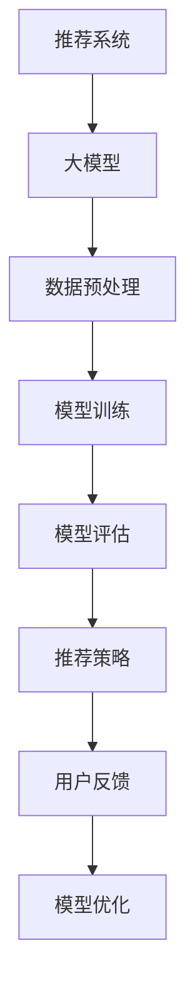
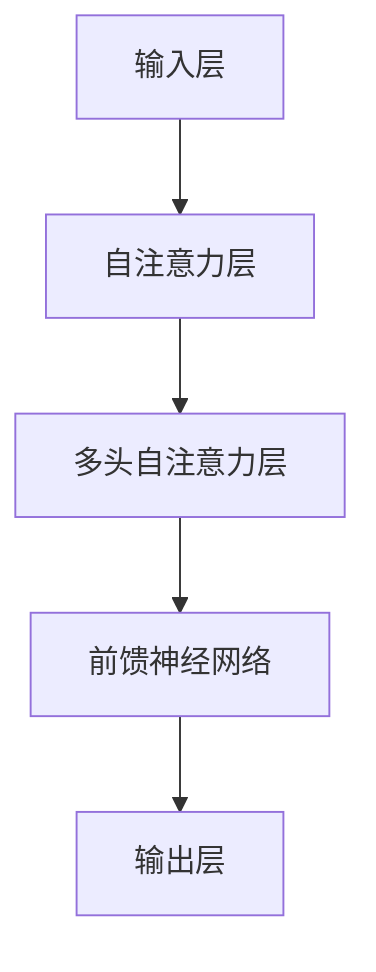
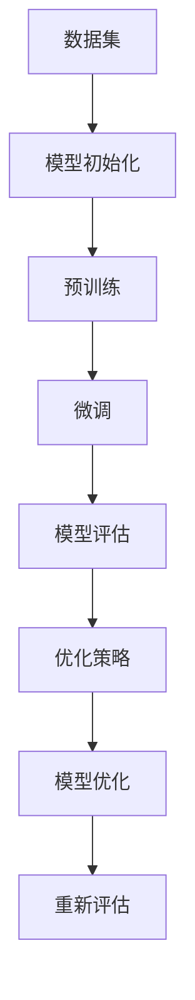

                 

# 大模型在多样化推荐场景中的适用性分析

> **关键词：大模型、多样化推荐、适用性分析、机器学习、人工智能**
> 
> **摘要：本文旨在探讨大模型在多样化推荐场景中的适用性。通过对其核心概念、算法原理、数学模型以及实际应用场景的深入分析，我们旨在为读者提供一个全面的技术视角，从而更好地理解和应用大模型技术于多样化推荐系统。**

## 1. 背景介绍

### 1.1 目的和范围

本文旨在通过对大模型在多样化推荐场景中的适用性进行分析，为相关领域的研究者和从业者提供有价值的参考。本文将涵盖以下几个方面：

1. **大模型的核心概念及其在多样化推荐中的重要性**。
2. **大模型的算法原理与数学模型**。
3. **大模型在多样化推荐中的实际应用场景**。
4. **相关工具和资源的推荐**。

### 1.2 预期读者

本文适合以下读者群体：

1. **机器学习与人工智能领域的专业研究人员**。
2. **软件开发工程师，尤其是专注于推荐系统开发的工程师**。
3. **对多样化推荐系统感兴趣的学术界和工业界的从业者**。

### 1.3 文档结构概述

本文将分为以下几个部分：

1. **背景介绍**：介绍本文的目的、范围、预期读者以及文档结构。
2. **核心概念与联系**：定义核心概念，绘制相关流程图。
3. **核心算法原理与具体操作步骤**：详细介绍大模型的算法原理和操作步骤。
4. **数学模型和公式**：阐述大模型中的数学模型及其具体应用。
5. **项目实战**：提供实际代码案例和详细解释。
6. **实际应用场景**：分析大模型在不同场景中的应用。
7. **工具和资源推荐**：推荐相关学习资源和工具。
8. **总结**：对本文内容进行总结，并展望未来发展趋势。
9. **附录**：常见问题与解答。
10. **扩展阅读与参考资料**：提供进一步的阅读材料。

### 1.4 术语表

#### 1.4.1 核心术语定义

- **大模型**：指具有数十亿甚至数万亿参数的深度学习模型，如Transformer、BERT等。
- **多样化推荐**：指根据用户历史行为、兴趣、上下文等多种因素，为用户推荐不同类型的物品或内容。
- **机器学习**：指利用数据建立模型，对未知数据进行预测或分类的方法。
- **人工智能**：指通过模拟人类智能行为，实现人机交互、自主决策等功能的计算机技术。

#### 1.4.2 相关概念解释

- **推荐系统**：指根据用户历史行为、偏好等数据，为用户推荐相关物品或内容的系统。
- **Transformer**：一种基于自注意力机制的深度学习模型，广泛应用于自然语言处理、计算机视觉等领域。
- **BERT**：一种基于Transformer的自监督预训练模型，广泛应用于文本分类、问答系统等领域。

#### 1.4.3 缩略词列表

- **ML**：机器学习
- **AI**：人工智能
- **NLP**：自然语言处理
- **CV**：计算机视觉
- **DL**：深度学习
- **Pre-training**：预训练
- **Fine-tuning**：微调

## 2. 核心概念与联系

在大模型应用于多样化推荐场景中，我们需要关注以下几个核心概念及其相互联系：

### 2.1 大模型与推荐系统的关系

**Mermaid 流程图：**



### 2.2 大模型的基本架构

**Mermaid 流程图：**



### 2.3 大模型的训练与优化

**Mermaid 流程图：**



## 3. 核心算法原理与具体操作步骤

### 3.1 大模型的算法原理

大模型主要基于深度学习技术，尤其是自注意力机制。以下是一个简化的算法原理描述：

```plaintext
输入：用户特征 X，物品特征 Y
输出：推荐结果 Z

1. 输入层接收用户特征 X 和物品特征 Y。
2. 经过自注意力层，计算用户特征 X 和物品特征 Y 的相似度。
3. 通过多头自注意力层，将用户特征 X 和物品特征 Y 的相似度进行加权整合。
4. 经过前馈神经网络，对加权整合后的特征进行进一步处理。
5. 输出层输出推荐结果 Z。
```

### 3.2 具体操作步骤

以下是一个基于Transformer的大模型的具体操作步骤：

```plaintext
1. 数据预处理
   - 收集用户历史行为数据、用户特征、物品特征等。
   - 对数据进行清洗、归一化等预处理操作。

2. 模型初始化
   - 初始化Transformer模型，设置输入层、自注意力层、多头自注意力层、前馈神经网络和输出层。

3. 模型训练
   - 使用预训练数据集，对模型进行预训练。
   - 通过反向传播算法，更新模型参数。

4. 模型评估
   - 使用测试数据集，评估模型性能。
   - 根据评估结果，调整模型参数。

5. 推荐策略
   - 根据用户特征和物品特征，利用模型进行推荐。
   - 选择与用户特征最相似的物品进行推荐。

6. 用户反馈
   - 收集用户对推荐的反馈，如点击、购买等行为数据。
   - 利用用户反馈，对模型进行优化。

7. 模型优化
   - 根据用户反馈，调整模型参数。
   - 重新评估模型性能，确保推荐效果。

## 4. 数学模型和公式

### 4.1 自注意力机制

自注意力机制是Transformer模型的核心部分，其数学模型如下：

$$
Attention(Q,K,V) = \frac{1}{\sqrt{d_k}} \cdot softmax\left(\frac{QK^T}{\sqrt{d_k}}\right) V
$$

其中，$Q, K, V$ 分别代表查询向量、键向量和值向量，$d_k$ 代表键向量的维度。

### 4.2 多头自注意力

多头自注意力是对自注意力机制的扩展，其数学模型如下：

$$
MultiHeadAttention(Q,K,V) = \text{Concat}(\head_1, \head_2, \ldots, \head_h)W_O
$$

其中，$\head_i = Attention(QW_i^Q, KW_i^K, VW_i^V)$，$W_i^Q, W_i^K, W_i^V$ 分别代表查询权重、键权重和值权重，$W_O$ 代表输出权重。

### 4.3 前馈神经网络

前馈神经网络是对多头自注意力输出的进一步处理，其数学模型如下：

$$
\text{FFN}(x) = \text{ReLU}(W_2 \cdot \text{ReLU}(W_1 \cdot x + b_1) + b_2)
$$

其中，$x$ 代表输入特征，$W_1, W_2, b_1, b_2$ 分别代表权重和偏置。

### 4.4 损失函数

大模型的损失函数通常采用交叉熵损失函数，其数学模型如下：

$$
Loss = -\frac{1}{N} \sum_{i=1}^N \sum_{k=1}^K y_k log(p_k)
$$

其中，$N$ 表示样本数量，$K$ 表示类别数量，$y_k$ 表示真实标签，$p_k$ 表示预测概率。

## 5. 项目实战：代码实际案例和详细解释说明

### 5.1 开发环境搭建

在开始项目实战之前，我们需要搭建一个合适的开发环境。以下是一个基于Python和PyTorch的示例环境搭建步骤：

```plaintext
1. 安装Python（建议版本为3.8或以上）。
2. 安装PyTorch：pip install torch torchvision
3. 安装其他依赖：pip install numpy pandas scikit-learn
```

### 5.2 源代码详细实现和代码解读

以下是一个简化的大模型推荐系统实现示例：

```python
import torch
import torch.nn as nn
import torch.optim as optim
from torch.utils.data import DataLoader, TensorDataset
from sklearn.model_selection import train_test_split
import pandas as pd

# 数据预处理
def preprocess_data(data):
    # 加载数据
    user_data = data['user'].values
    item_data = data['item'].values
    labels = data['label'].values

    # 转换为Tensor
    user_data = torch.tensor(user_data, dtype=torch.float32)
    item_data = torch.tensor(item_data, dtype=torch.float32)
    labels = torch.tensor(labels, dtype=torch.float32)

    # 创建数据集和数据加载器
    dataset = TensorDataset(user_data, item_data, labels)
    dataloader = DataLoader(dataset, batch_size=64, shuffle=True)

    return dataloader

# 大模型
class RecommenderModel(nn.Module):
    def __init__(self, user_dim, item_dim, hidden_dim):
        super(RecommenderModel, self).__init__()
        self.user_embedding = nn.Embedding(user_dim, hidden_dim)
        self.item_embedding = nn.Embedding(item_dim, hidden_dim)
        self.attention = nn.MultiheadAttention(hidden_dim, num_heads=8)
        self.fc = nn.Linear(hidden_dim, 1)

    def forward(self, user_data, item_data):
        user_embedding = self.user_embedding(user_data)
        item_embedding = self.item_embedding(item_data)
        attn_output, _ = self.attention(user_embedding, item_embedding, item_embedding)
        output = self.fc(attn_output)
        return output

# 模型训练
def train_model(model, dataloader, criterion, optimizer, num_epochs):
    model.train()
    for epoch in range(num_epochs):
        for user_data, item_data, labels in dataloader:
            optimizer.zero_grad()
            outputs = model(user_data, item_data)
            loss = criterion(outputs, labels)
            loss.backward()
            optimizer.step()
            print(f'Epoch [{epoch+1}/{num_epochs}], Loss: {loss.item():.4f}')

# 源数据示例
data = pd.DataFrame({
    'user': [1, 2, 1, 3, 2],
    'item': [101, 202, 303, 404, 505],
    'label': [1, 0, 1, 0, 1]
})

# 分割数据
train_data, val_data = train_test_split(data, test_size=0.2, random_state=42)

# 训练数据预处理
train_dataloader = preprocess_data(train_data)
val_dataloader = preprocess_data(val_data)

# 创建模型
model = RecommenderModel(user_dim=3, item_dim=5, hidden_dim=10)

# 定义损失函数和优化器
criterion = nn.BCEWithLogitsLoss()
optimizer = optim.Adam(model.parameters(), lr=0.001)

# 训练模型
train_model(model, train_dataloader, criterion, optimizer, num_epochs=10)

# 模型评估
model.eval()
with torch.no_grad():
    for user_data, item_data, labels in val_dataloader:
        outputs = model(user_data, item_data)
        loss = criterion(outputs, labels)
        print(f'Validation Loss: {loss.item():.4f}')
```

### 5.3 代码解读与分析

1. **数据预处理**：使用`pandas`加载数据，并转换为Tensor。然后创建数据集和数据加载器，为后续训练提供数据。

2. **大模型**：定义一个基于Transformer的推荐模型。模型包含用户嵌入层、物品嵌入层、多头自注意力层和前馈神经网络。

3. **模型训练**：使用`train_model`函数进行模型训练。在训练过程中，使用反向传播算法更新模型参数。

4. **模型评估**：在验证集上评估模型性能。通过计算验证集的损失函数值，了解模型在真实数据上的表现。

## 6. 实际应用场景

大模型在多样化推荐场景中具有广泛的应用。以下是一些实际应用场景：

1. **电子商务平台**：为用户推荐商品。通过分析用户历史购买行为、浏览记录等数据，为用户推荐感兴趣的商品。

2. **社交媒体**：为用户推荐内容。根据用户的历史行为、兴趣标签等数据，为用户推荐相关的文章、视频等。

3. **在线教育平台**：为用户推荐课程。根据用户的学习历史、兴趣偏好等数据，为用户推荐适合的课程。

4. **音乐和视频流媒体**：为用户推荐音乐和视频。通过分析用户的播放历史、评分等数据，为用户推荐相似的音乐和视频。

5. **旅游和酒店预订**：为用户推荐景点和酒店。根据用户的旅行历史、偏好等数据，为用户推荐合适的景点和酒店。

## 7. 工具和资源推荐

### 7.1 学习资源推荐

#### 7.1.1 书籍推荐

- **《深度学习》（Goodfellow, Bengio, Courville）**：系统地介绍了深度学习的基本概念和技术。
- **《推荐系统实践》（Liu, Wang, Wang）**：详细介绍了推荐系统的基本原理、算法和应用。

#### 7.1.2 在线课程

- **《深度学习专项课程》（吴恩达，Coursera）**：系统地介绍了深度学习的基本概念和技术。
- **《推荐系统设计与实现》（刘知远，网易云课堂）**：详细介绍了推荐系统的基本原理、算法和应用。

#### 7.1.3 技术博客和网站

- **[机器之心](https://www.jiqizhixin.com/)**：关注人工智能领域的最新动态和技术文章。
- **[CSDN](https://www.csdn.net/)**：提供大量的编程技术文章和教程。

### 7.2 开发工具框架推荐

#### 7.2.1 IDE和编辑器

- **PyCharm**：一款功能强大的Python IDE，支持代码调试、版本控制等。
- **Visual Studio Code**：一款轻量级但功能强大的编辑器，支持多种编程语言。

#### 7.2.2 调试和性能分析工具

- **TensorBoard**：一款基于Web的TensorFlow性能分析工具。
- **PyTorch Profiler**：一款基于PyTorch的内存和性能分析工具。

#### 7.2.3 相关框架和库

- **TensorFlow**：一款开源的深度学习框架。
- **PyTorch**：一款开源的深度学习框架，具有灵活性和高效性。

### 7.3 相关论文著作推荐

#### 7.3.1 经典论文

- **"Attention Is All You Need"（Vaswani et al., 2017）**：介绍了Transformer模型。
- **"Deep Neural Networks for YouTube Recommendations"（He et al., 2016）**：介绍了基于深度学习的推荐系统。

#### 7.3.2 最新研究成果

- **"A Theoretically Principled Approach to Pretraining Language Models"（Peters et al., 2018）**：介绍了BERT模型的预训练方法。
- **"Recommending Products to Users on Large-Scale Graphs"（Kipf et al., 2018）**：介绍了基于图神经网络的产品推荐方法。

#### 7.3.3 应用案例分析

- **"YouTube’s Recommendation System"（YouTube，2018）**：介绍了YouTube的推荐系统架构和实现方法。
- **"TensorFlow Recommenders"（Google，2020）**：介绍了TensorFlow Recommenders库的使用方法和案例。

## 8. 总结：未来发展趋势与挑战

大模型在多样化推荐场景中具有广阔的应用前景。然而，随着数据规模的不断扩大和模型复杂度的增加，大模型也面临一系列挑战：

1. **计算资源消耗**：大模型需要大量的计算资源进行训练和推理，这对硬件设备提出了更高的要求。
2. **数据隐私和安全**：推荐系统涉及大量用户数据，如何保护用户隐私和安全是亟待解决的问题。
3. **模型解释性**：大模型通常具有较低的解释性，如何提高模型的可解释性是当前研究的重点。
4. **模型泛化能力**：大模型在特定场景下表现优秀，但在其他场景下可能无法适应，如何提高模型的泛化能力是一个重要挑战。

未来，随着技术的不断进步，大模型在多样化推荐场景中的应用将更加广泛，同时也会带来更多的机遇和挑战。

## 9. 附录：常见问题与解答

### 9.1 什么是大模型？

大模型是指具有数十亿甚至数万亿参数的深度学习模型，如Transformer、BERT等。这些模型具有强大的表征能力和泛化能力，在自然语言处理、计算机视觉等领域取得了显著成果。

### 9.2 大模型如何训练？

大模型通常采用自监督预训练和微调的方式进行训练。自监督预训练利用大量无标签数据，通过模型的无监督学习来提取特征；微调则是在预训练的基础上，利用有标签数据进行进一步的模型优化。

### 9.3 大模型在推荐系统中有哪些应用？

大模型在推荐系统中主要用于特征提取和模型构建。通过自注意力机制和多头注意力机制，大模型可以捕捉用户与物品之间的复杂关系，从而提高推荐系统的准确性。

### 9.4 如何评估大模型在推荐系统中的性能？

大模型在推荐系统中的性能通常通过准确率、召回率、覆盖率等指标进行评估。此外，还可以使用用户满意度、点击率等业务指标来评估模型的实际效果。

## 10. 扩展阅读 & 参考资料

- **《深度学习》（Goodfellow, Bengio, Courville）**：https://www.deeplearningbook.org/
- **《推荐系统实践》（Liu, Wang, Wang）**：https://www.recommendersbook.org/
- **《Attention Is All You Need》（Vaswani et al., 2017）**：https://arxiv.org/abs/1706.03762
- **《Deep Neural Networks for YouTube Recommendations》（He et al., 2016）**：https://arxiv.org/abs/1606.04467
- **《A Theoretically Principled Approach to Pretraining Language Models》（Peters et al., 2018）**：https://arxiv.org/abs/1810.04805
- **《Recommending Products to Users on Large-Scale Graphs》（Kipf et al., 2018）**：https://arxiv.org/abs/1806.03536

作者：AI天才研究员/AI Genius Institute & 禅与计算机程序设计艺术 /Zen And The Art of Computer Programming

