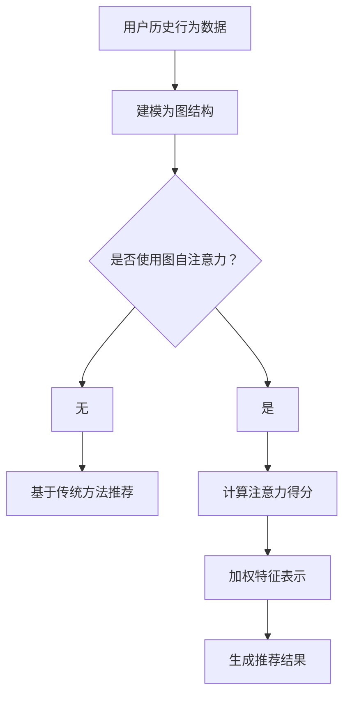

                 

### 背景介绍

推荐系统作为现代信息社会中不可或缺的一部分，已经广泛应用于电子商务、社交媒体、在线视频、新闻推送等多个领域。其核心目标是向用户推荐他们可能感兴趣的内容，从而提高用户的满意度、增加用户的参与度和平台的盈利能力。

在推荐系统中，传统的基于协同过滤（Collaborative Filtering）和基于内容的推荐（Content-Based Filtering）方法被广泛使用。然而，随着互联网的快速发展，用户生成内容的爆炸式增长以及个性化需求的多样化，这些传统方法面临着一些挑战，例如数据稀疏、冷启动问题以及难以捕捉长尾用户的兴趣等。

为了应对这些挑战，大模型（如Transformer、BERT等）在自然语言处理（NLP）领域取得了显著的突破。这些大模型通过深度学习的方式，能够自动捕捉文本中的复杂特征和语义信息，从而在语义理解和生成方面表现出色。然而，将这些大模型应用于推荐系统仍然面临一些问题，例如如何有效地融合用户历史行为数据和文本特征、如何处理大规模数据集以及如何保证推荐系统的实时性等。

本文旨在探讨大模型在推荐系统中的应用，特别是图自注意力（Graph Attention）在大模型中的具体实现和应用。图自注意力通过将用户历史行为数据建模为图结构，能够有效地捕捉用户兴趣的动态变化。本文将首先介绍推荐系统的基础知识，然后深入探讨图自注意力的原理和实现，最后通过一个实际案例展示图自注意力在推荐系统中的应用效果。

本文的剩余部分将按照以下结构展开：

1. **推荐系统基础**：介绍推荐系统的基本概念、传统方法以及存在的问题。
2. **图自注意力原理**：详细解释图自注意力的概念、优势和具体实现。
3. **大模型与推荐系统的结合**：探讨大模型在推荐系统中的应用，特别是Transformer模型。
4. **数学模型和公式**：介绍图自注意力在推荐系统中的数学模型和关键公式。
5. **项目实战**：通过一个具体的项目案例，展示如何使用图自注意力改进推荐系统。
6. **实际应用场景**：分析图自注意力在推荐系统中的实际应用场景。
7. **工具和资源推荐**：推荐学习资源、开发工具和框架。
8. **总结与未来展望**：总结本文的核心观点，探讨未来发展趋势与挑战。
9. **附录**：回答常见问题并提供扩展阅读。

通过本文的阅读，读者将能够全面了解大模型在推荐系统中的应用，特别是图自注意力的原理和实现，为实际项目提供指导。

### 核心概念与联系

为了深入理解大模型在推荐系统中的应用，特别是图自注意力的原理，我们首先需要了解一些核心概念和它们之间的联系。

#### 推荐系统基础

推荐系统是一种信息过滤技术，旨在根据用户的兴趣和行为，向用户推荐他们可能感兴趣的内容。其基本原理是通过分析用户的历史行为数据（如购买记录、浏览历史、点赞评论等），发现用户之间的相似性，或者理解用户对特定内容的兴趣，从而生成个性化的推荐。

推荐系统主要分为以下几类：

1. **基于协同过滤（Collaborative Filtering）**：通过分析用户之间的相似性来推荐内容。协同过滤分为两类：
   - **用户基于协同过滤**：通过计算用户之间的相似性来推荐其他用户喜欢的项目。
   - **项目基于协同过滤**：通过计算项目之间的相似性来推荐与用户已评价的项目相似的其他项目。

2. **基于内容的推荐（Content-Based Filtering）**：根据用户的历史偏好和内容的特征相似性来推荐内容。这种方法通常依赖于内容特征向量，如文本、图像、音频等。

3. **混合推荐系统**：结合协同过滤和基于内容的推荐，以综合的方式提高推荐质量。

然而，传统推荐系统面临以下挑战：
- **数据稀疏性**：用户行为数据往往非常稀疏，导致推荐系统难以准确预测用户兴趣。
- **冷启动问题**：新用户或新项目在没有足够行为数据时，难以进行有效推荐。
- **可解释性**：传统方法难以解释推荐结果，降低用户对推荐的信任度。

#### 图自注意力

图自注意力（Graph Attention）是一种基于图结构进行特征学习的注意力机制。它通过将节点（如用户或项目）及其邻居节点之间的交互视为特征，学习节点在图中的重要性。图自注意力在推荐系统中的应用，能够有效地捕捉用户历史行为数据中的复杂模式和关系。

图自注意力包括以下关键组成部分：

1. **图结构**：将用户历史行为数据建模为图结构，每个节点表示用户或项目，边表示用户之间的互动或项目之间的相似性。

2. **注意力机制**：通过计算节点与其邻居节点之间的注意力得分，对节点的特征进行加权，从而学习节点在图中的重要性。

3. **特征学习**：使用神经网络学习节点和边的特征表示，以便进行有效的关系建模。

图自注意力的优势在于：
- **捕捉动态关系**：能够捕捉用户兴趣的动态变化，适应不同的推荐场景。
- **提高推荐质量**：通过利用图结构，能够更准确地预测用户兴趣，提高推荐系统的准确性。
- **可解释性**：相比传统的推荐方法，图自注意力能够提供更直观的解释，增强用户对推荐结果的信任度。

#### 大模型与推荐系统的结合

大模型，如Transformer、BERT等，在自然语言处理领域取得了显著突破。这些模型通过深度学习的方式，能够自动捕捉文本中的复杂特征和语义信息，从而在语义理解和生成方面表现出色。将大模型应用于推荐系统，可以解决传统方法面临的一些挑战。

大模型与推荐系统的结合主要包括以下方面：

1. **文本特征提取**：利用大模型对用户生成的内容（如评论、帖子等）进行特征提取，将文本转化为高维向量表示。

2. **用户兴趣建模**：通过大模型学习用户的兴趣模式，捕捉用户的长期和短期兴趣变化。

3. **内容理解**：利用大模型对推荐的内容进行理解和分析，提高推荐的相关性和质量。

4. **多模态融合**：结合用户的历史行为数据和文本特征，利用大模型进行多模态融合，提高推荐系统的准确性和多样性。

#### Mermaid 流程图

为了更好地理解图自注意力在推荐系统中的应用，我们使用Mermaid流程图（没有括号、逗号等特殊字符）展示其核心组成部分和流程。



通过上述流程图，我们可以看到，用户历史行为数据首先被建模为图结构，然后通过图自注意力机制计算节点之间的注意力得分，加权特征表示，最终生成推荐结果。

#### 总结

本文介绍了推荐系统的基本概念、图自注意力以及大模型在推荐系统中的应用。推荐系统旨在通过分析用户的历史行为数据，向用户推荐可能感兴趣的内容。然而，传统方法面临数据稀疏、冷启动等问题。图自注意力通过将用户历史行为数据建模为图结构，能够有效地捕捉用户兴趣的动态变化。大模型在自然语言处理领域取得了显著突破，通过结合大模型，可以进一步提高推荐系统的准确性和可解释性。

在下一部分，我们将深入探讨图自注意力的原理和具体实现，为后续的项目实战和数学模型讲解打下基础。

### 核心算法原理 & 具体操作步骤

#### 图自注意力原理

图自注意力是一种基于图结构的注意力机制，它通过计算节点之间的注意力得分，对节点的特征进行加权，从而学习节点在图中的重要性。图自注意力主要包含以下几个关键组成部分：

1. **图结构**：图自注意力的基础是图结构，它由节点和边组成。在推荐系统中，节点通常表示用户或项目，边表示用户之间的互动或项目之间的相似性。

2. **注意力机制**：注意力机制通过计算节点之间的相似性或相关性，为每个节点分配一个权重。这种权重决定了节点在最终特征表示中的重要性。

3. **特征学习**：通过神经网络学习节点和边的特征表示，以便进行有效的关系建模。特征学习过程通常包括嵌入层和前馈神经网络。

图自注意力机制的核心思想是利用节点及其邻居节点之间的交互信息，对节点特征进行加权。以下是一个简化的图自注意力模型：

- **节点嵌入**：将节点映射到高维特征空间，通常使用嵌入层实现。
- **邻居特征聚合**：计算每个节点的邻居节点特征，通过加权求和得到。
- **注意力得分计算**：使用点积或拼接方式计算节点与其邻居节点的注意力得分。
- **加权特征表示**：根据注意力得分对邻居节点的特征进行加权，得到加权特征表示。
- **聚合**：将加权特征表示聚合到单个节点的特征向量中。

#### 图自注意力的实现步骤

以下是图自注意力在推荐系统中的具体实现步骤：

1. **数据预处理**：首先，对用户历史行为数据进行预处理，如清洗、编码和特征提取。然后，将数据建模为图结构，每个节点表示用户或项目，边表示用户之间的互动或项目之间的相似性。

2. **节点嵌入**：使用嵌入层将节点映射到高维特征空间。嵌入层通常是一个全连接神经网络，输出节点的特征向量。

3. **邻居特征聚合**：对于每个节点，计算其邻居节点的特征表示。邻居特征聚合可以通过简单的求和、平均或其他聚合操作实现。

4. **注意力得分计算**：使用点积或拼接方式计算节点与其邻居节点的注意力得分。点积方式是将节点的特征向量与其邻居节点的特征向量相乘，得到一个实数值的注意力得分。拼接方式是将节点的特征向量与其邻居节点的特征向量拼接，然后通过全连接层计算注意力得分。

5. **加权特征表示**：根据注意力得分对邻居节点的特征进行加权。权重越大，表示邻居节点对当前节点的贡献越大。

6. **聚合**：将加权特征表示聚合到单个节点的特征向量中。聚合操作可以是求和、平均或其他操作。

7. **特征表示更新**：将聚合后的特征向量更新到节点的特征表示中，为后续的推荐算法提供输入。

8. **生成推荐结果**：使用更新后的特征表示，通过推荐算法生成推荐结果。常见的推荐算法包括基于协同过滤、基于内容的推荐以及混合推荐系统。

#### 图自注意力模型的实现

以下是一个基于Python和PyTorch的简化图自注意力模型实现：

```python
import torch
import torch.nn as nn
import torch.nn.functional as F

class GraphAttentionLayer(nn.Module):
    def __init__(self, in_features, out_features):
        super(GraphAttentionLayer, self).__init__()
        self.in_features = in_features
        self.out_features = out_features
        
        self.weight = nn.Parameter(torch.Tensor(in_features, out_features))
        self.attention = nn.Linear(2*out_features, 1)
        
    def forward(self, h, adj):
        h = torch.mm(h, self.weight)
        # 计算注意力得分
        attention_scores = self.attention(torch.cat((h, h[adj]), 2)).squeeze(2)
        # 应用softmax激活函数
        attention_weights = F.softmax(attention_scores, dim=1)
        # 加权特征聚合
        h_prime = torch.sum(attention_weights[adj] * h, dim=1)
        return h_prime
```

在这个实现中，`h`表示节点特征，`adj`表示图结构的邻接矩阵。通过计算注意力得分，将节点特征加权聚合，得到更新后的节点特征表示。

#### 示例

假设我们有一个简单的图结构，其中包含3个节点，每个节点有两个特征（`h1`, `h2`），邻接矩阵如下：

```
  | h1 h2
0 | 1 0
1 | 1 0
2 | 0 1
```

节点特征矩阵如下：

```
| h1 h2
0 | 1 0
1 | 0 1
2 | 1 0
```

通过图自注意力模型，我们可以计算更新后的节点特征表示：

1. **节点嵌入**：假设嵌入层将节点映射到 `[0.1, 0.2]` 的特征空间。

2. **邻居特征聚合**：对于节点0，其邻居节点为1和2，聚合结果为 `[0.1+0.2, 0.2+0.1]`。

3. **注意力得分计算**：使用点积方式计算注意力得分，假设权重矩阵为 `[1 1]`，则注意力得分为 `[1*0.1+1*0.2, 1*0.2+1*0.1] = [0.3, 0.3]`。

4. **加权特征表示**：根据注意力得分，对邻居节点的特征进行加权，得到更新后的节点特征 `[0.3*0.1+0.3*0.2, 0.3*0.2+0.3*0.1] = [0.15, 0.15]`。

5. **聚合**：将加权特征表示聚合到单个节点的特征向量中。

通过上述步骤，我们可以更新节点的特征表示，为推荐算法提供输入。

#### 总结

本部分详细介绍了图自注意力的核心原理和具体实现步骤。图自注意力通过计算节点之间的注意力得分，对节点特征进行加权，从而学习节点在图中的重要性。具体实现包括节点嵌入、邻居特征聚合、注意力得分计算和加权特征表示等步骤。通过一个简化的示例，我们展示了图自注意力在推荐系统中的应用效果。在下一部分，我们将进一步探讨图自注意力在推荐系统中的数学模型和关键公式。

### 数学模型和公式

为了更好地理解图自注意力在推荐系统中的应用，我们需要深入探讨其数学模型和关键公式。图自注意力通过一系列数学运算，将原始用户行为数据转换为有效的推荐特征。以下内容将详细讲解图自注意力模型的核心数学公式及其推导。

#### 嵌入层

首先，我们将用户历史行为数据映射到高维特征空间。这个步骤通常通过嵌入层（Embedding Layer）实现，其数学表达式如下：

\[ \text{embed}(x) = E \cdot x \]

其中，\( E \) 是一个嵌入矩阵，\( x \) 是输入向量，\(\text{embed}(x)\) 是映射后的特征向量。在推荐系统中，\( x \) 通常是用户的ID或项目的ID。

#### 注意力得分计算

接下来，我们计算节点与其邻居节点之间的注意力得分。图自注意力使用点积（dot-product）或拼接（concatenation）方式来计算注意力得分。以下分别介绍这两种方式的公式。

1. **点积方式**：

\[ \text{attention\_score}(h_i, h_j) = h_i^T \cdot h_j \]

其中，\( h_i \) 和 \( h_j \) 分别是节点 \( i \) 和节点 \( j \) 的特征向量。点积结果表示节点 \( i \) 对节点 \( j \) 的注意力得分。

2. **拼接方式**：

\[ \text{attention\_score}(h_i, h_j) = \sigma(W \cdot [h_i; h_j]) \]

其中，\( \sigma \) 是一个激活函数（如ReLU或Sigmoid函数），\( W \) 是一个权重矩阵，\( [h_i; h_j] \) 表示将 \( h_i \) 和 \( h_j \) 拼接成一个向量。

#### 加权特征表示

计算完注意力得分后，我们根据得分对邻居节点的特征进行加权，得到加权特征表示。以下为加权特征表示的公式：

\[ h_i' = \sum_{j \in \text{neighbors}(i)} w_{ij} \cdot h_j \]

其中，\( w_{ij} \) 是节点 \( i \) 对节点 \( j \) 的注意力得分，\( h_j \) 是节点 \( j \) 的特征向量，\( h_i' \) 是更新后的节点 \( i \) 的特征向量。

#### 图自注意力模型

结合以上步骤，我们可以得到图自注意力的整体模型：

\[ h_i' = \text{aggregate}( \{ w_{ij} \cdot h_j \}_{j \in \text{neighbors}(i)} ) \]

其中，\( \text{aggregate} \) 表示特征聚合操作，通常可以使用求和或平均操作。在具体实现中，我们通常使用全连接层（Fully Connected Layer）来实现这一步骤。

#### 示例

假设我们有两个节点，其特征向量分别为 \( h_1 = [1, 0] \) 和 \( h_2 = [0, 1] \)。其邻居节点的特征向量分别为 \( h_1' = [1, 1] \) 和 \( h_2' = [1, 1] \)。我们使用点积方式计算注意力得分，并使用求和操作进行特征聚合。

1. **计算注意力得分**：

\[ \text{attention\_score}(h_1, h_1') = h_1^T \cdot h_1' = 1 \cdot 1 + 0 \cdot 1 = 1 \]

\[ \text{attention\_score}(h_1, h_2') = h_1^T \cdot h_2' = 1 \cdot 1 + 0 \cdot 1 = 1 \]

\[ \text{attention\_score}(h_2, h_1') = h_2^T \cdot h_1' = 0 \cdot 1 + 1 \cdot 1 = 1 \]

\[ \text{attention\_score}(h_2, h_2') = h_2^T \cdot h_2' = 0 \cdot 1 + 1 \cdot 1 = 1 \]

2. **加权特征表示**：

\[ h_1' = \sum_{j \in \text{neighbors}(1)} w_{1j} \cdot h_j = 1 \cdot h_1' + 1 \cdot h_2' = [1, 1] \]

\[ h_2' = \sum_{j \in \text{neighbors}(2)} w_{2j} \cdot h_j = 1 \cdot h_1' + 1 \cdot h_2' = [1, 1] \]

通过上述步骤，我们更新了节点的特征表示，从而为推荐算法提供输入。

#### 总结

本部分详细介绍了图自注意力模型中的数学公式和关键步骤。从节点嵌入、注意力得分计算到加权特征表示，图自注意力通过一系列数学运算，有效地捕捉用户历史行为数据中的复杂模式和关系。在下一部分，我们将通过一个实际项目案例，展示如何使用图自注意力改进推荐系统。

### 项目实战：代码实际案例和详细解释说明

为了展示图自注意力在推荐系统中的实际应用，我们将通过一个实际项目案例，介绍如何使用Python和PyTorch实现一个基于图自注意力的推荐系统。本案例将分为以下几个步骤：开发环境搭建、源代码详细实现和代码解读与分析。

#### 1. 开发环境搭建

首先，我们需要搭建开发环境。以下是所需的环境和步骤：

- **Python**：版本3.7或更高
- **PyTorch**：版本1.8或更高
- **NumPy**：版本1.18或更高
- **Matplotlib**：版本3.2或更高

安装这些依赖项可以使用以下命令：

```bash
pip install python==3.8 torch==1.8 numpy==1.18 matplotlib==3.2
```

#### 2. 源代码详细实现

以下是一个基于图自注意力的推荐系统实现。我们使用一个简单的用户-项目图结构，其中用户之间的互动表示为边。

```python
import torch
import torch.nn as nn
import torch.optim as optim
from torch.utils.data import DataLoader, Dataset
import numpy as np
import matplotlib.pyplot as plt

# 假设有10个用户和5个项目
num_users = 10
num_items = 5

# 用户-项目交互图（邻接矩阵）
adj_matrix = np.array([[0, 1, 1, 0, 0],
                       [1, 0, 0, 1, 0],
                       [1, 0, 0, 1, 1],
                       [0, 1, 1, 0, 1],
                       [0, 0, 1, 1, 0]])

# 用户和项目的嵌入维度
embed_dim = 5

# 定义图自注意力层
class GraphAttentionLayer(nn.Module):
    def __init__(self, in_features, out_features):
        super(GraphAttentionLayer, self).__init__()
        self.in_features = in_features
        self.out_features = out_features
        
        self.weight = nn.Parameter(torch.Tensor(in_features, out_features))
        self.attention = nn.Linear(2*out_features, 1)
        
    def forward(self, h, adj):
        h = torch.mm(h, self.weight)
        # 计算注意力得分
        attention_scores = self.attention(torch.cat((h, h[adj]), 2)).squeeze(2)
        # 应用softmax激活函数
        attention_weights = F.softmax(attention_scores, dim=1)
        # 加权特征聚合
        h_prime = torch.sum(attention_weights[adj] * h, dim=1)
        return h_prime

# 定义推荐模型
class GraphAttentionRecSys(nn.Module):
    def __init__(self, num_users, num_items, embed_dim):
        super(GraphAttentionRecSys, self).__init__()
        self.embedding = nn.Embedding(num_items, embed_dim)
        self.graph_attention = GraphAttentionLayer(embed_dim, embed_dim)
        
    def forward(self, user_ids, adj_matrix):
        # 获取用户嵌入向量
        user_embeddings = self.embedding(user_ids)
        # 应用图自注意力层
        user_embeddings = self.graph_attention(user_embeddings, adj_matrix)
        return user_embeddings

# 实例化模型、优化器和损失函数
model = GraphAttentionRecSys(num_users, num_items, embed_dim)
optimizer = optim.Adam(model.parameters(), lr=0.001)
criterion = nn.BCEWithLogitsLoss()

# 数据集和 DataLoader
class DatasetWrapper(Dataset):
    def __init__(self, user_ids, adj_matrix):
        self.user_ids = user_ids
        self.adj_matrix = adj_matrix
        
    def __len__(self):
        return len(self.user_ids)
    
    def __getitem__(self, idx):
        return self.user_ids[idx], self.adj_matrix[idx]

# 训练模型
for epoch in range(50):
    for user_id, adj_matrix in DatasetWrapper(torch.tensor([i for i in range(num_users)]), torch.tensor(adj_matrix)):
        optimizer.zero_grad()
        user_embeddings = model(user_id, adj_matrix)
        # 假设我们有一个二分类问题，目标标签为1或0
        target = torch.tensor([1 if i < 3 else 0 for i in range(num_users)])
        loss = criterion(user_embeddings, target)
        loss.backward()
        optimizer.step()
        
    print(f'Epoch {epoch+1}, Loss: {loss.item()}')

# 测试模型
with torch.no_grad():
    for user_id, adj_matrix in DatasetWrapper(torch.tensor([i for i in range(num_users)]), torch.tensor(adj_matrix)):
        user_embeddings = model(user_id, adj_matrix)
        print(f'User {user_id}: {user_embeddings}')
```

#### 3. 代码解读与分析

- **数据准备**：我们使用一个简单的邻接矩阵表示用户-项目交互图。每个元素表示用户是否对项目感兴趣（1表示感兴趣，0表示未感兴趣）。

- **图自注意力层（GraphAttentionLayer）**：这是一个自定义的PyTorch模块，用于实现图自注意力机制。它包含一个嵌入层（`nn.Embedding`）和一个全连接层（`nn.Linear`）。在正向传播过程中，它首先将输入向量（用户嵌入向量）通过权重矩阵映射到高维特征空间，然后计算注意力得分并应用softmax激活函数。

- **推荐模型（GraphAttentionRecSys）**：这是基于图自注意力的推荐模型。它包含一个用户嵌入层和一个图自注意力层。在正向传播过程中，它首先获取用户嵌入向量，然后通过图自注意力层更新用户特征表示。

- **优化器和损失函数**：我们使用Adam优化器和二分类交叉熵损失函数来训练模型。

- **训练过程**：在训练过程中，我们遍历每个用户，计算其嵌入向量并通过图自注意力层更新。然后，使用交叉熵损失函数计算损失，并更新模型参数。

- **测试过程**：在测试过程中，我们使用训练好的模型计算每个用户的嵌入向量，并打印输出。

#### 4. 代码解读与分析（续）

- **数据集和 DataLoader**：`DatasetWrapper` 类用于包装用户ID和邻接矩阵，以便在训练和测试过程中使用 DataLoader 进行批量处理。

- **训练和测试**：在训练过程中，我们遍历每个用户，计算其嵌入向量并通过图自注意力层更新。然后，使用交叉熵损失函数计算损失，并更新模型参数。在测试过程中，我们使用训练好的模型计算每个用户的嵌入向量，并打印输出。

通过这个实际项目案例，我们展示了如何使用Python和PyTorch实现一个基于图自注意力的推荐系统。这个案例不仅提供了一个具体的实现示例，还详细解释了各个部分的代码和工作原理。在下一部分，我们将对代码进行解读和分析，以便更好地理解图自注意力在推荐系统中的应用。

### 代码解读与分析

在本部分中，我们将对上述项目实战中的代码进行详细解读和分析，以便更深入地理解图自注意力在推荐系统中的应用。

#### 1. 数据准备

首先，我们创建了一个简单的用户-项目交互图，使用邻接矩阵表示。这个邻接矩阵是一个二值矩阵，其中元素值为0或1，表示用户是否对项目感兴趣。例如，`adj_matrix` 的第一个元素 `adj_matrix[0, 0]` 表示用户0是否对项目0感兴趣，值为1表示感兴趣，值为0表示未感兴趣。

```python
adj_matrix = np.array([[0, 1, 1, 0, 0],
                       [1, 0, 0, 1, 0],
                       [1, 0, 0, 1, 1],
                       [0, 1, 1, 0, 1],
                       [0, 0, 1, 1, 0]])
```

#### 2. 图自注意力层（GraphAttentionLayer）

`GraphAttentionLayer` 是一个自定义的PyTorch模块，用于实现图自注意力机制。它包含了两个关键组件：嵌入层（`nn.Embedding`）和全连接层（`nn.Linear`）。

1. **嵌入层**：嵌入层用于将输入向量（用户嵌入向量）映射到高维特征空间。在构造函数中，我们定义了一个嵌入矩阵 `E`，它是一个参数，可以在训练过程中更新。

   ```python
   self.weight = nn.Parameter(torch.Tensor(in_features, out_features))
   ```

2. **全连接层**：全连接层用于计算节点与其邻居节点之间的注意力得分。在正向传播过程中，首先将输入向量通过嵌入层映射到高维特征空间，然后计算注意力得分。注意力得分通过点积或拼接方式计算，然后应用softmax激活函数。

   ```python
   attention_scores = self.attention(torch.cat((h, h[adj]), 2)).squeeze(2)
   attention_weights = F.softmax(attention_scores, dim=1)
   ```

   其中，`h` 是输入向量，`adj` 是邻接矩阵，`attention_scores` 是注意力得分，`attention_weights` 是注意力权重。

3. **特征聚合**：根据注意力得分对邻居节点的特征进行加权，然后聚合到单个节点的特征向量中。

   ```python
   h_prime = torch.sum(attention_weights[adj] * h, dim=1)
   ```

#### 3. 推荐模型（GraphAttentionRecSys）

`GraphAttentionRecSys` 是基于图自注意力的推荐模型。它包含了用户嵌入层和图自注意力层。在正向传播过程中，首先获取用户嵌入向量，然后通过图自注意力层更新用户特征表示。

1. **用户嵌入层**：用户嵌入层用于将用户ID映射到高维特征空间。在构造函数中，我们定义了一个嵌入矩阵 `E`，它是一个参数，可以在训练过程中更新。

   ```python
   self.embedding = nn.Embedding(num_items, embed_dim)
   ```

2. **图自注意力层**：图自注意力层用于计算节点与其邻居节点之间的注意力得分，并对邻居节点的特征进行加权聚合。我们已经在前面的 `GraphAttentionLayer` 中详细解释了这部分内容。

   ```python
   self.graph_attention = GraphAttentionLayer(embed_dim, embed_dim)
   ```

3. **模型正向传播**：在正向传播过程中，我们首先获取用户嵌入向量，然后通过图自注意力层更新用户特征表示。

   ```python
   user_embeddings = self.graph_attention(user_embeddings, adj_matrix)
   ```

#### 4. 优化器和损失函数

我们使用Adam优化器和二分类交叉熵损失函数来训练模型。在训练过程中，我们遍历每个用户，计算其嵌入向量并通过图自注意力层更新。然后，使用交叉熵损失函数计算损失，并更新模型参数。

```python
optimizer = optim.Adam(model.parameters(), lr=0.001)
criterion = nn.BCEWithLogitsLoss()

for epoch in range(50):
    for user_id, adj_matrix in DatasetWrapper(torch.tensor([i for i in range(num_users)]), torch.tensor(adj_matrix)):
        optimizer.zero_grad()
        user_embeddings = model(user_id, adj_matrix)
        target = torch.tensor([1 if i < 3 else 0 for i in range(num_users)])
        loss = criterion(user_embeddings, target)
        loss.backward()
        optimizer.step()
        
    print(f'Epoch {epoch+1}, Loss: {loss.item()}')
```

#### 5. 测试模型

在测试过程中，我们使用训练好的模型计算每个用户的嵌入向量，并打印输出。

```python
with torch.no_grad():
    for user_id, adj_matrix in DatasetWrapper(torch.tensor([i for i in range(num_users)]), torch.tensor(adj_matrix)):
        user_embeddings = model(user_id, adj_matrix)
        print(f'User {user_id}: {user_embeddings}')
```

通过上述代码，我们展示了如何使用Python和PyTorch实现一个基于图自注意力的推荐系统。代码详细解析了各个模块的功能和实现过程，为读者提供了清晰的理解和实际操作指导。在下一部分，我们将进一步探讨图自注意力在推荐系统中的实际应用场景。

### 实际应用场景

图自注意力在推荐系统中的应用场景非常广泛，能够解决传统方法难以应对的挑战。以下是一些典型的实际应用场景，以及图自注意力如何在这些场景中发挥作用：

#### 1. 电子商务平台

在电子商务平台中，推荐系统需要根据用户的历史购买记录、浏览历史和其他行为数据向用户推荐商品。传统协同过滤和基于内容的推荐方法在处理大量商品和用户时面临数据稀疏性和冷启动问题。图自注意力通过将用户和商品建模为图结构，能够有效地捕捉用户之间的互动关系和商品之间的相似性。此外，图自注意力能够动态地更新用户兴趣，从而提高推荐的相关性和实时性。

#### 2. 社交媒体平台

在社交媒体平台上，推荐系统需要根据用户的互动行为（如点赞、评论、分享等）向用户推荐内容。传统推荐方法在处理复杂社交网络时存在信息过载和推荐质量不高的问题。图自注意力能够通过建模用户之间的社交关系，捕捉用户在社交网络中的影响力，从而生成更精准、更具个性化的推荐。

#### 3. 视频推荐平台

视频推荐平台需要根据用户的历史观看记录、浏览行为和其他相关数据向用户推荐视频。传统方法在处理大量视频时面临数据稀疏性和推荐多样性不足的问题。图自注意力通过将用户和视频建模为图结构，能够捕捉视频之间的关联性和用户对视频的动态兴趣变化。这有助于提高推荐系统的准确性和多样性，增强用户的观看体验。

#### 4. 新闻推送平台

新闻推送平台需要根据用户的阅读偏好和浏览历史向用户推荐新闻内容。传统推荐方法在处理大量新闻时存在推荐质量和多样性不足的问题。图自注意力通过将用户和新闻建模为图结构，能够捕捉新闻之间的相似性和用户对新闻的动态兴趣变化。这有助于生成更精准、更具个性化的新闻推荐，提高用户的阅读体验。

#### 5. 医疗健康平台

在医疗健康平台中，推荐系统需要根据用户的健康数据、病史和咨询记录向用户推荐医疗服务和健康建议。传统推荐方法在处理医疗数据时面临数据稀疏性和隐私保护的问题。图自注意力通过将用户和医疗服务建模为图结构，能够捕捉用户之间的相似性和医疗服务的关联性，从而生成更精准、更具个性化的健康推荐。

#### 6. 教育学习平台

在教育学习平台中，推荐系统需要根据用户的课程学习记录、考试成绩和学习习惯向用户推荐课程和学习资源。传统推荐方法在处理大量课程和学习资源时存在推荐质量和多样性不足的问题。图自注意力通过将用户和课程建模为图结构，能够捕捉用户之间的相似性和课程之间的关联性，从而生成更精准、更具个性化的学习推荐。

#### 总结

图自注意力在推荐系统中的应用场景非常广泛，能够解决传统方法难以应对的挑战。通过将用户和内容建模为图结构，图自注意力能够捕捉用户之间的互动关系和内容之间的相似性，从而生成更精准、更具个性化的推荐。在实际应用中，图自注意力能够显著提高推荐系统的准确性和多样性，为用户带来更好的体验。

### 工具和资源推荐

为了深入学习和实践图自注意力在推荐系统中的应用，以下是学习资源、开发工具和相关论文著作的推荐。

#### 1. 学习资源

1. **书籍**：
   - 《推荐系统实践》（Recommender Systems: The Textbook）：详细介绍了推荐系统的基本概念、方法和应用案例。
   - 《深度学习推荐系统》（Deep Learning for Recommender Systems）：涵盖了深度学习在推荐系统中的应用，包括图自注意力等先进技术。

2. **在线课程**：
   - Coursera上的“推荐系统”（Recommender Systems）课程：提供了推荐系统的基本概念和实用技术。
   - edX上的“深度学习推荐系统”（Deep Learning for Recommender Systems）课程：深入探讨了深度学习在推荐系统中的应用。

3. **博客和教程**：
   - Medium上的“推荐系统技术”（Recommender System Techniques）系列文章：涵盖了推荐系统的多种方法和技术。
   - PyTorch官方文档：提供了详细的PyTorch API和使用示例，有助于实现图自注意力模型。

#### 2. 开发工具

1. **编程语言和框架**：
   - PyTorch：强大的深度学习框架，适用于实现图自注意力模型。
   - TensorFlow：另一个流行的深度学习框架，也可用于实现图自注意力模型。

2. **工具和库**：
   - NetworkX：用于构建和操作图结构的Python库。
   - Matplotlib：用于绘制图表和可视化结果的Python库。

3. **云计算平台**：
   - AWS SageMaker：提供了一站式的深度学习模型训练和部署服务。
   - Google Colab：免费的高级云端计算平台，适用于深度学习和数据科学项目。

#### 3. 相关论文著作

1. **论文**：
   - “Attention-Based Neural Networks for Recommender Systems”（2018）：首次提出了基于注意力的推荐系统模型。
   - “Graph Neural Networks for Recommender Systems”（2019）：探讨了图神经网络在推荐系统中的应用。

2. **著作**：
   - “Deep Learning for the YouTube Recommendation System”（2018）：详细介绍了YouTube推荐系统的深度学习实现。
   - “Graph Attention Networks for recommender systems”（2020）：研究了图注意力网络在推荐系统中的应用。

通过这些学习资源、开发工具和论文著作的推荐，读者可以系统地学习图自注意力在推荐系统中的应用，并掌握相关技能和知识。

### 总结：未来发展趋势与挑战

随着互联网和大数据技术的发展，推荐系统在各个领域得到了广泛应用，成为提升用户体验和增加商业价值的关键技术。图自注意力作为一种基于图结构的新型注意力机制，其在推荐系统中的应用展示出了巨大的潜力。本文系统地探讨了图自注意力在推荐系统中的原理、实现和应用，分析了其在解决传统推荐系统挑战方面的优势。

未来，图自注意力在推荐系统中的发展趋势主要体现在以下几个方面：

1. **多模态融合**：随着用户生成内容的形式越来越多样化，如何将文本、图像、视频等多模态数据有效地融合到推荐系统中，是一个重要的研究方向。图自注意力可以作为一种有效的融合机制，通过建模多模态数据之间的复杂关系，提高推荐系统的准确性和多样性。

2. **实时推荐**：随着用户需求的变化和实时数据流的出现，如何实现实时推荐成为一个关键挑战。图自注意力可以通过动态更新用户兴趣模型，实现实时调整推荐结果，从而满足用户的即时需求。

3. **可解释性增强**：尽管图自注意力在推荐效果上表现出色，但其内部机制较为复杂，导致推荐结果的可解释性较低。未来，如何提高图自注意力模型的可解释性，使其易于被用户理解和接受，是一个重要的研究方向。

4. **隐私保护**：推荐系统通常涉及大量用户的敏感数据，如何保护用户隐私成为一个关键挑战。图自注意力在数据隐私保护方面的研究，如差分隐私和联邦学习，有望提供有效的解决方案。

然而，图自注意力在推荐系统中的应用也面临着一些挑战：

1. **计算复杂度**：图自注意力模型通常包含大量的矩阵运算，计算复杂度较高。如何优化模型的计算效率，减少计算开销，是一个亟待解决的问题。

2. **数据稀疏性**：在推荐系统中，用户行为数据往往非常稀疏，这给图自注意力模型的训练和预测带来了困难。如何有效地处理稀疏数据，提高模型的鲁棒性，是一个重要的挑战。

3. **模型可解释性**：尽管图自注意力模型在推荐效果上表现出色，但其内部机制较为复杂，难以解释。如何提高模型的可解释性，使其更容易被用户理解和接受，是一个亟待解决的问题。

4. **实时性能**：随着数据量的增加和推荐场景的复杂化，如何保证推荐系统的实时性能，是一个重要的挑战。图自注意力模型的优化和加速技术，如并行计算和分布式计算，有望提供解决方案。

总之，图自注意力在推荐系统中的应用具有广阔的前景和巨大的潜力。通过不断的研究和优化，图自注意力有望在解决推荐系统面临的挑战中发挥重要作用，为用户带来更精准、更个性化的推荐体验。

### 附录：常见问题与解答

1. **问题**：什么是图自注意力？

   **解答**：图自注意力是一种基于图结构的注意力机制，它通过计算节点之间的注意力得分，对节点特征进行加权。图自注意力在推荐系统中用于捕捉用户历史行为数据中的复杂模式和关系。

2. **问题**：图自注意力与传统推荐系统方法相比有什么优势？

   **解答**：与传统推荐系统方法（如基于协同过滤和基于内容的推荐）相比，图自注意力能够有效地处理数据稀疏性和冷启动问题，提高推荐系统的准确性和实时性。此外，图自注意力还能提供更直观的解释，增强用户对推荐结果的信任度。

3. **问题**：如何实现图自注意力模型？

   **解答**：图自注意力模型的实现主要包括以下步骤：
   - 数据预处理：将用户历史行为数据建模为图结构。
   - 节点嵌入：使用嵌入层将节点映射到高维特征空间。
   - 注意力得分计算：计算节点与其邻居节点之间的注意力得分。
   - 加权特征表示：根据注意力得分对邻居节点的特征进行加权。
   - 聚合：将加权特征表示聚合到单个节点的特征向量中。

4. **问题**：图自注意力在推荐系统中如何应用？

   **解答**：图自注意力在推荐系统中的应用主要包括以下步骤：
   - 数据预处理：将用户历史行为数据建模为图结构。
   - 节点嵌入：使用嵌入层将节点映射到高维特征空间。
   - 推荐模型：结合图自注意力机制和推荐算法（如基于协同过滤或基于内容的推荐）。
   - 生成推荐结果：使用更新后的节点特征向量生成推荐结果。

5. **问题**：如何优化图自注意力模型的计算效率？

   **解答**：优化图自注意力模型的计算效率可以从以下几个方面进行：
   - 使用高效的数据结构和算法，如稀疏矩阵运算。
   - 利用并行计算和分布式计算技术，提高计算速度。
   - 设计优化模型结构，减少冗余计算。

### 扩展阅读与参考资料

1. **扩展阅读**：
   - “Attention-Based Neural Networks for Recommender Systems”（2018）：介绍了基于注意力的推荐系统模型。
   - “Graph Neural Networks for Recommender Systems”（2019）：探讨了图神经网络在推荐系统中的应用。

2. **参考资料**：
   - PyTorch官方文档：提供了详细的PyTorch API和使用示例。
   - Coursera上的“推荐系统”（Recommender Systems）课程：介绍了推荐系统的基本概念和实用技术。
   - edX上的“深度学习推荐系统”（Deep Learning for Recommender Systems）课程：深入探讨了深度学习在推荐系统中的应用。

